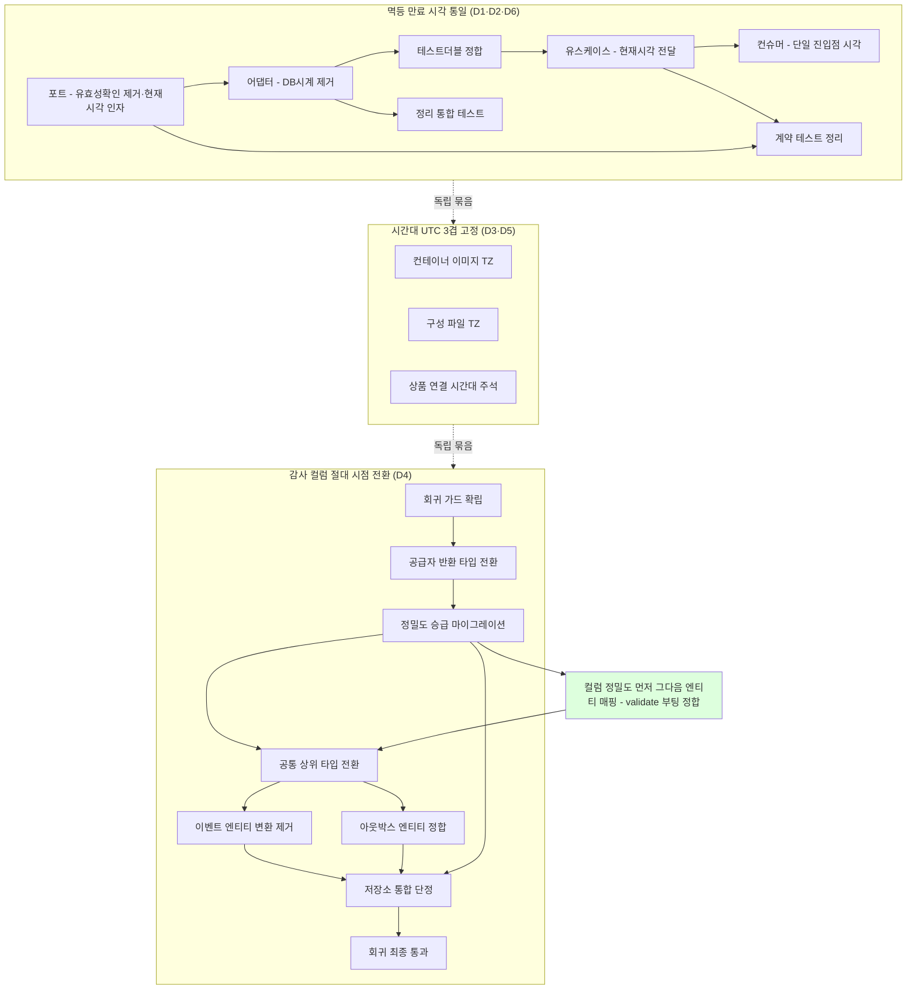

# TIME-MODEL-FOLLOWUP PLAN

- **Topic**: [TIME-MODEL-FOLLOWUP](topics/TIME-MODEL-FOLLOWUP.md)
- **Date**: 2026-06-06
- **Round**: 1
- **Flyway 신규 버전**: V4 (현재 최신 V3__drop_payment_stock_outbox.sql 다음)

---

## 요약 브리핑

### 태스크 목록 (18개, layer 의존 순서)

| # | 태스크 | 결정 |
|---|---|---|
| P1 | 재고 멱등 포트에서 유효성 확인 메서드 제거 + 만료 기록에 현재 시각 인자 추가 | D1·D2 |
| P2 | 재고 멱등 어댑터 — 만료행 삭제 DB 시계 제거, 유효성 확인 제거 | D1·D2 |
| P3 | 재고 멱등 테스트 더블 시그니처 정합 | D1·D2 |
| P4 | 재고 커밋 유스케이스 — 현재 시각 인자 추가·전달 | D1 |
| P5 | 재고 커밋 컨슈머 — 단일 진입점 현재 시각 산출 후 전달 | D1 |
| P6 | 멱등 포트 계약 테스트 유효성 확인 정리 | D2 |
| P7 | 재고 멱등 정리 통합 테스트 유효성 확인 잔재 제거 | D2·D6 |
| P8 | 6개 서비스 컨테이너 이미지 시간대 UTC 고정 | D3 |
| P9 | 구성 파일(apps·infra) 시간대 UTC 고정 | D3 |
| P10 | 상품 연결 시간대 UTC 존치 주석 갱신 | D5 |
| P11 | 감사 공급자 절대 시점 전환 전 회귀 가드 확립 | D4 |
| P12 | 감사 공급자 반환 타입 절대 시점 전환 | D4 |
| P13 | 결제 감사 컬럼 정밀도 승급 마이그레이션(V4) | D4 |
| P14 | 결제 감사 공통 상위 타입 절대 시점 전환 | D4 |
| P15 | 결제 이벤트 엔티티 수동 변환 제거 | D4 |
| P16 | 결제 아웃박스 엔티티 수동 변환 정합 | D4 |
| P17 | 결제 이벤트 저장소 절대 시점 통합 단정 보강 | D4 |
| P18 | 감사 공급자 절대 시점 회귀 최종 통과 확인 | D4 |

### 변경 후 실행 순서 (의존 흐름)



### 핵심 결정 → 태스크 매핑

| 결정 | 태스크 |
|---|---|
| D1 멱등 만료 현재 시각을 앱 단일 시계로 통일 | P1·P2·P4·P5 |
| D2 유효성 확인 메서드 전건 제거 | P1·P2·P3·P6·P7 |
| D3 시간대 UTC 3겹 고정 | P8·P9 |
| D4 감사 컬럼 절대 시점 타입 + 정밀도 승급 | P11~P18 |
| D5 상품 연결 시간대 UTC 존치 | P10 |
| D6 만료 경계 검증 재배치 | P2·P7 |
| D7 세 항목 단일 PR·TDD 커밋 흐름 | 전체(P1~P18) |

### 트레이드오프 / 후속

- **순서 불변(돈 앵커)**: 컬럼 정밀도 승급(P13)이 감사 타입 전환(P14)보다 **반드시 앞** — 그래야 절대 시점 매핑 후 스키마 검증 부팅이 깨지지 않는다. 감사 생성 시각은 만료 기준이라 도메인 리스크 태스크.
- **감사 생성 시각 갱신 금지 불변(updatable=false)**은 타입 전환 시에도 보존(P14 AC + 리플렉션 회귀 가드).
- **감사 공급자 회귀 가드**는 직전 작업이 검증 누락으로 재작업한 전례 반영 — 전환 전(P11)·후(P18) 양쪽에 가드.
- 정밀도 승급은 만료 기준 시각을 서브초만큼 늦추는 안전 방향(조기 만료 없음). 기존 행 혼재는 운영 데이터 0 전제로 무해.

---

## 태스크 목록

### P1 — [port] D2: EventDedupeStore 포트에서 existsValid 제거, recordIfAbsent 시그니처에 now 추가

- **layer**: application/port
- **tdd**: true
- **domain_risk**: true
- **결정 추적**: D1(recordIfAbsent now 인자), D2(existsValid 전건 제거)
- **변경 파일**:
  - `product-service/src/main/java/.../product/application/port/out/EventDedupeStore.java`
- **완료 조건 (AC)**:
  - [x] `existsValid(String)` 메서드 + javadoc 제거
  - [x] `recordIfAbsent` 시그니처 → `boolean recordIfAbsent(String eventUUID, Instant now, Instant expiresAt)`
  - [x] 컴파일 통과 (구현체/Fake 아직 미수정이라 컴파일 에러 발생 예정 — RED 상태 정상)
- **의존**: 없음
- **테스트 스펙**:
  - 클래스: `EventDedupeStoreContractTest` (기존 파일 교체)
  - 메서드:
    - [x] `recordIfAbsent_포트시그니처_now포함_컴파일계약()`: 익명 구현체로 `recordIfAbsent(String, Instant, Instant)` 시그니처 존재를 컴파일 수준 단정
    - [x] `deleteExpired_포트시그니처_컴파일계약()`: 기존 유지
    - [x] existsValid 계약 테스트 제거

**완료 결과**: 포트 인터페이스 `EventDedupeStore.java` — `existsValid` 제거 + `recordIfAbsent` 3-인자 시그니처 확정. `EventDedupeStoreContractTest` 컴파일 계약 테스트 2개 작성. 구현체(`JdbcEventDedupeStore`)·Fake·호출자 컴파일 에러는 P2~P5에서 해소 예정(PLAN AC 명시된 정상 RED 상태).

---

### P2 — [infrastructure] D1+D2: JdbcEventDedupeStore — NOW() 제거, existsValid 제거

- **layer**: infrastructure
- **tdd**: true
- **domain_risk**: true
- **결정 추적**: D1(SQL_DELETE_EXPIRED_BY_UUID NOW() → 바인딩), D2(SQL_EXISTS_VALID + existsValid 제거)
- **변경 파일**:
  - `product-service/src/main/java/.../product/infrastructure/idempotency/JdbcEventDedupeStore.java`
- **완료 조건 (AC)**:
  - [x] `SQL_EXISTS_VALID` 상수(라인 45-47) 제거
  - [x] `SQL_DELETE_EXPIRED_BY_UUID`(라인 52-53) `expires_at < NOW()` → `expires_at < ?` 바인딩 파라미터로 교체
  - [x] `existsValid` 메서드(라인 80-84) 제거
  - [x] `recordIfAbsent(String eventUUID, Instant expiresAt)` → `recordIfAbsent(String eventUUID, Instant now, Instant expiresAt)` 시그니처 업데이트
  - [x] DELETE 실행 시 `Timestamp.from(now)` + UTC_CALENDAR 명시 바인딩
  - [x] 클래스 javadoc 라인 26 줄 전건 정리: existsValid 설명 + NOW() 근거("NOW() 는 connectionTimeZone=UTC 적용 후 UTC 기준") 모두 제거 (D2 existsValid 제거 + D1 NOW() 제거로 전체 무효화)
  - [x] `JdbcEventDedupeStore`는 `Clock` 필드를 이미 보유하지만, recordIfAbsent 경로에서 self clock.instant() 미사용 — `now`는 호출자(use case P4)에서 주입받음
- **의존**: P1 (포트 시그니처 확정 후)
- **테스트 스펙**:
  - [x] 기존 `JdbcEventDedupeStoreRoundTripTest`의 2번째 테스트(`existsValid_nowBasedOnConnectionUTC_sameBoundaryAsAppInstant`) 제거 (D2)
  - [x] 새 테스트 `recordIfAbsent_nonUtcJvm_expiredRow삭제경계_만료행만삭제`:
    - Asia/Seoul JVM TZ 강제, 만료 행(`now` 이전)과 미만료 행(`now` 이후) 각 1건 삽입
    - `recordIfAbsent(uuid, now, futureExpiry)` 호출 시 만료 행이 DELETE되고 미만료 행은 잔존
    - DB 재조회 count 단정 (만료 행만 삭제됨 = 재기록 성공, 미만료 동일 uuid는 false 반환 확인)
    - 경계 동치(DM-2) `expires_at == now`: `expires_at < now` 만 삭제하므로 동일 시각 행은 만료로 보지 않고 잔존 → 동일 uuid `recordIfAbsent`는 `false`(미만료 보존, 중복 재고 차감 skip 멱등 유지) 단정

**완료 결과**: `JdbcEventDedupeStore` — SQL_EXISTS_VALID 상수 제거, existsValid 메서드 제거, SQL_DELETE_EXPIRED_BY_UUID NOW() → `?` 바인딩 파라미터 교체, recordIfAbsent 3-인자 시그니처(now+expiresAt) + DELETE에 UTC_CALENDAR 명시 바인딩. `JdbcEventDedupeStoreRoundTripTest` existsValid 테스트 제거 + 경계 검증 테스트 추가. `JdbcEventDedupeStoreCleanupTest` existsValid 참조 count 기반으로 교체(컴파일 에러 자동수정). product-service 전체 컴파일은 StockCommitUseCase(P4)·StockCommitConsumer(P5) 시그니처 미수정으로 여전히 RED — P3~P5에서 해소 예정. Testcontainers 통합 테스트 GREEN은 P5 이후.

---

### P3 — [test/fake] D1+D2: FakeEventDedupeStore 시그니처 정합

- **layer**: test/fake (use case 소비자 이전에 배치)
- **tdd**: false
- **domain_risk**: false
- **결정 추적**: D1(recordIfAbsent now 인자), D2(existsValid 제거)
- **변경 파일**:
  - `product-service/src/test/java/.../product/mock/FakeEventDedupeStore.java`
- **완료 조건 (AC)**:
  - `existsValid` 메서드 제거
  - `recordIfAbsent(String, Instant, Instant)` — 세 번째 파라미터 `now`를 만료 비교 기준 시각으로 사용 (`now.isBefore(existing)` → 만료 여부 판정, 기존 `Instant.now(clock)` 대체)
  - `deleteExpired` 유지
  - `clock` 필드 제거 가능 (now가 외부 주입으로 바뀌어 내부 clock 불필요 — 단 deleteExpired 패턴과 정합 확인)
- **순서 근거**: Fake가 P4(use case 단위 테스트가 Fake에 now 전달을 단정)·P6(contract 테스트)보다 앞서야 그 테스트들이 컴파일된다. 포트 구현체이므로 의존은 P1(포트)만으로 충분(P2 infra 구현과 독립).
- **의존**: P1

**완료 결과**: `FakeEventDedupeStore` — `existsValid` 메서드 제거, `clock` 필드 + 생성자 2개 제거, `recordIfAbsent(String, Instant, Instant)` 3-인자 시그니처로 교체(세 번째 파라미터 `now` 만료 비교 기준 — `existing.isBefore(now)` 판정). `deleteExpired` 유지. `FakeEventDedupeStoreTest` 구 Clock 생성자 → no-arg + 3-인자 호출로 정합 갱신. `StockCommitUseCase` 컴파일 에러(2-인자 → 3-인자 미수정)는 P4 대상 정상 RED.

---

### P4 — [application] D1: StockCommitUseCase.commit 시그니처에 now 추가 및 전달

- **layer**: application
- **tdd**: true
- **domain_risk**: true
- **결정 추적**: D1(now 전파: consumer→useCase→port), 헥사고날 D2 원칙(Clock 권한은 consumer 진입점)
- **변경 파일**:
  - `product-service/src/main/java/.../product/application/usecase/StockCommitUseCase.java`
- **완료 조건 (AC)**:
  - [x] `commit(String eventUUID, String orderId, long productId, int qty, Instant expiresAt)` → `commit(String eventUUID, String orderId, long productId, int qty, Instant now, Instant expiresAt)` 시그니처 추가
  - [x] `eventDedupeStore.recordIfAbsent(eventUUID, expiresAt)` → `eventDedupeStore.recordIfAbsent(eventUUID, now, expiresAt)` 전달
  - [x] `StockCommitUseCase`에 `Clock` 신설 금지 (now는 인자로 받음)
- **의존**: P2, P3 (P3 Fake 시그니처가 먼저 정합돼야 use case 단위 테스트의 now 전달 단정이 컴파일됨)
- **테스트 스펙**:
  - 클래스: `StockCommitUseCaseTest` (신규 또는 기존 확장)
  - 메서드:
    - [x] `commit_중복이벤트_recordIfAbsent에now전달_false반환시스킵()`: `FakeEventDedupeStore`에 now 인자가 전달되는지 단정, 중복 시 commitToRdb 미호출 확인
    - [x] `commit_최초이벤트_재고차감성공()`: recordIfAbsent true 반환 시 재고 차감 확인

**완료 결과**: `StockCommitUseCase.commit` — 시그니처에 `Instant now` 인자 추가(5-인자 → 6-인자), `recordIfAbsent(eventUUID, now, expiresAt)` 3-인자 전달 완료. `Clock` 신설 없음(D1 헥사고날 원칙 준수). `StockCommitUseCaseTest` — 기존 3개 테스트 now 인자 포함 갱신 + P4 스펙 신규 2개(`commit_중복이벤트_recordIfAbsent에now전달_false반환시스킵`, `commit_최초이벤트_재고차감성공`) 추가. 컴파일 에러 자동수정: `StockCommitConsumer`(P5 대상) 임시 `now=clock.instant()` 추가로 컴파일 통과, `StockCommitConsumerTest` 구 5-인자 verify → 6-인자 갱신. product-service 단위 테스트 25 PASS.

---

### P5 — [infrastructure/consumer] D1: StockCommitConsumer — now 산출 후 commit에 전달

- **layer**: infrastructure
- **tdd**: true
- **domain_risk**: true
- **결정 추적**: D1(Clock 보유처 consumer에서 now 산출 → commit 인자 전달)
- **변경 파일**:
  - `product-service/src/main/java/.../product/infrastructure/messaging/consumer/StockCommitConsumer.java`
- **완료 조건 (AC)**:
  - [x] `consume` 메서드 내에서 `Instant now = clock.instant()` 산출
  - [x] `stockCommitUseCase.commit(idempotencyKey, orderId, productId, qty, now, expiresAt)` — now 추가 전달
  - [x] `resolveExpiresAt` 내부 `clock.instant()` 호출은 `now`로 대체 또는 공유 (같은 진입점에서 동일 시각 사용)
  - [x] `consume` 메서드 내 `now` 산출을 `resolveExpiresAt` 호출보다 앞 순서로 배치해 (1) commit의 now 인자, (2) resolveExpiresAt fallback base가 동일 Instant를 공유하도록 한다 (단일 진입점 동일 시각 불변 D1)
- **의존**: P4
- **테스트 스펙**:
  - 클래스: `StockCommitConsumerTest` (신규 또는 기존 확장)
  - 메서드:
    - [x] `consume_clock주입now_useCaseCommit에전달()`: tick-advancing Clock 주입 — `expiresAt=null/occurredAt=null` 경로에서 commit의 now 인자와 resolveExpiresAt fallback base가 동일 Instant임을 단정 (D1 단일 진입점 동일 시각 불변)

**완료 결과**: `StockCommitConsumer.resolveExpiresAt` 시그니처를 `(StockCommittedMessage, Instant now)`로 변경 — 내부 `clock.instant()` 재호출 제거. `consume` 진입 시 단일 `now = clock.instant()` 산출 후 `resolveExpiresAt(message, now)`와 `commit(..., now, expiresAt)` 양쪽에 동일 Instant 전달. `StockCommitConsumerTest` — tick Clock RED 테스트 `consume_clock주입now_useCaseCommit에전달` 추가 + 기존 3개 유지. product-service 단위 26 + 통합 6 = 32 테스트 전부 PASS. G1 묶음(P1~P5) 컴파일 닫힘 + 멱등 경로 완성.

---

### P6 — [test/contract] D2: EventDedupeStoreContractTest existsValid 계약 정리 확인

- **layer**: test
- **tdd**: false
- **domain_risk**: false
- **결정 추적**: D2(existsValid 포트 제거 → 계약 테스트 동반 정리)
- **변경 파일**:
  - `product-service/src/test/java/.../product/application/port/out/EventDedupeStoreContractTest.java`
- **완료 조건 (AC)**:
  - P1 완료 후 `EventDedupeStoreContractTest`의 `deleteExpired` 계약 테스트는 유지, existsValid 참조 제거
  - `recordIfAbsent_포트시그니처_now포함_컴파일계약()` 추가 (P1에서 함께 작성 가능)
  - `./gradlew test` 통과
- **의존**: P1, P3

---

### P7 — [test/integration] D6: JdbcEventDedupeStoreCleanupTest — existsValid 잔재 제거

- **layer**: test/integration
- **tdd**: false
- **domain_risk**: false
- **결정 추적**: D2(existsValid 전건 제거), D6(existsValid 보존 단언 제거)
- **변경 파일**:
  - `product-service/src/test/java/.../product/infrastructure/idempotency/JdbcEventDedupeStoreCleanupTest.java`
- **완료 조건 (AC)**:
  - 라인 133-147 `deleteExpired_existsValid미만료행_불영향` 테스트에서 `dedupeStore.existsValid(uuid1)`/`existsValid(uuid2)` 호출 제거
  - existsValid 대신 `count` 행 수 기반으로 대체 (`countAll() == 2` 단정)
  - 나머지 두 테스트(`deleteExpired_만료행만삭제_미만료행잔존`, `deleteExpired_batchSize제한_초과분미삭제`)는 그대로 유지
- **의존**: P2

---

### P8 — [설정] D3: Dockerfile 6개 TZ backstop — ENV TZ=UTC + ENTRYPOINT -Duser.timezone=UTC

- **layer**: 설정 (Docker)
- **tdd**: false
- **domain_risk**: false
- **결정 추적**: D3(TZ backstop 3겹 — 겹 1+2)
- **변경 파일**:
  - `payment-service/Dockerfile`
  - `pg-service/Dockerfile`
  - `product-service/Dockerfile`
  - `user-service/Dockerfile`
  - `eureka-server/Dockerfile`
  - `gateway/Dockerfile`
- **완료 조건 (AC)**:
  - 각 Dockerfile `FROM` 직후 `ENV TZ=UTC` 추가
  - 각 Dockerfile `ENTRYPOINT` → `["java","-Duser.timezone=UTC","-jar","/app/app.jar"]`
  - 6개 모두 동일 패턴 적용
- **의존**: 없음

---

### P9 — [설정] D3: compose TZ backstop — docker-compose.apps.yml + docker-compose.infra.yml

- **layer**: 설정 (compose)
- **tdd**: false
- **domain_risk**: false
- **결정 추적**: D3(TZ backstop 3겹 — 겹 3), D3 eureka compose 위치 확정(infra.yml 소속)
- **변경 파일**:
  - `docker/docker-compose.apps.yml` — payment/pg/product/user/gateway 5서비스 `environment.TZ: UTC` 추가
  - `docker/docker-compose.infra.yml` — eureka 서비스 `environment.TZ: UTC` 추가 (라인 124 `environment:` 블록 안)
- **완료 조건 (AC)**:
  - `docker-compose.apps.yml`의 각 서비스 `environment` 블록에 `TZ: UTC` 키 추가 (기존 `EUREKA_DEFAULT_ZONE` 등과 병렬)
  - `docker-compose.infra.yml`의 eureka 서비스 `environment` 블록에 `TZ: UTC` 추가 (라인 124-125 `SPRING_PROFILES_ACTIVE: docker` 옆)
- **의존**: P8

---

### P10 — [설정] D5: product application.yml 주석 갱신

- **layer**: 설정 (yml 주석)
- **tdd**: false
- **domain_risk**: false
- **결정 추적**: D5(connectionTimeZone=UTC 존치 + 주석 stale 제거), discuss-domain-1 DM-F2 반영
- **변경 파일**:
  - `product-service/src/main/resources/application.yml` (라인 13-15 주석)
  - `product-service/src/main/resources/application-docker.yml` (라인 7-8 주석)
- **완료 조건 (AC)**:
  - `application.yml` 주석: "DM2 — existsValid/SQL_DELETE_EXPIRED_BY_UUID 의 DB NOW()" 언급 제거, 대신 "D1/D2로 NOW()·existsValid 제거 완료. connectionTimeZone=UTC 존치 근거: raw-JDBC Timestamp.from(instant) 바인딩(recordIfAbsent INSERT IGNORE / recordIfAbsent DELETE-by-uuid / deleteExpired)의 DB 세션 UTC backstop"으로 재서술 (DM-3: recordIfAbsent DELETE-by-uuid 경로도 raw-JDBC 바인딩 대상이므로 열거 포함)
  - `application-docker.yml` 주석도 정합 갱신 (D7 → D5 근거 반영)
  - `connectionTimeZone=UTC&forceConnectionTimeZoneToSession=true` URL 값 무변경
- **의존**: P2 (existsValid 제거 완료 후)

---

### P11 — [test] D4: clockDateTimeProvider Instant 반환 후 auditing wiring 회귀 가드 확인

- **layer**: test (단위 + 통합)
- **tdd**: true
- **domain_risk**: true
- **결정 추적**: D4(clockDateTimeProvider Instant 반환 전환 전 회귀 가드 확립), §4 auditing wiring 권고, 직전 토픽 major M3 전례
- **변경 파일**:
  - `payment-service/src/test/java/.../payment/core/config/JpaAuditingProviderWiringTest.java` (기존 — 현재 상태 재확인)
  - `payment-service/src/test/java/.../payment/infrastructure/PaymentEventRepositoryImplTest.java` (기존 — 현재 상태 재확인)
- **완료 조건 (AC)**:
  - `JpaAuditingProviderWiringTest.jpaAuditing_dateTimeProviderRef_isLinkedToClockDateTimeProvider()` — 이미 존재, P12 실행 전 현재 GREEN임을 `./gradlew test` 확인
  - `PaymentEventRepositoryImplTest.auditing_createdAt_isFilledByClockDateTimeProvider()` — 이미 존재, GREEN 확인
  - 신규 메서드 `clockDateTimeProvider_반환타입이Instant_를_반환한다()`: `JpaConfig.clockDateTimeProvider().getNow()` 결과가 `Optional<Instant>` 타입임을 단정 — P12 RED 게이트 역할
    - 클래스: `JpaAuditingProviderWiringTest`에 추가
    - `Optional<TemporalAccessor> nowOpt = provider.getNow(); assertThat(nowOpt.get()).isInstanceOf(Instant.class)`
- **의존**: 없음

---

### P12 — [infrastructure] D4: JpaConfig clockDateTimeProvider 반환 타입 Instant 전환

- **layer**: infrastructure / core/config
- **tdd**: true
- **domain_risk**: true
- **결정 추적**: D4(clockDateTimeProvider 반환 타입 Instant 동반 전환), §4 auditing wiring 회귀 가드
- **변경 파일**:
  - `payment-service/src/main/java/.../payment/core/config/JpaConfig.java`
- **완료 조건 (AC)**:
  - `clockDateTimeProvider()` 반환: `LocalDateTime.ofInstant(clock.instant(), ZoneOffset.UTC)` → `clock.instant()`
  - import `LocalDateTime` / `ZoneOffset` 제거
  - P11의 `clockDateTimeProvider_반환타입이Instant_를_반환한다()` 테스트 GREEN
  - `JpaAuditingProviderWiringTest` 및 `PaymentEventRepositoryImplTest` DM1 회귀 가드 여전히 GREEN
  - javadoc 라인 23 "Clock 을 통해 항상 UTC 기준 LocalDateTime 을 반환한다" → Instant 반환으로 정정
  - 라인 25 "BaseEntity 필드/컬럼 타입은 변경하지 않는다(NG4)" stale 주석 제거 (직전 토픽 D3가 박은 NG4를 D4가 명시 승계·번복)
- **의존**: P11

---

### P13 — [Flyway] D4: V4 DDL — audit 컬럼 DATETIME → DATETIME(6) ALTER 승급

- **layer**: infrastructure / Flyway
- **tdd**: false
- **domain_risk**: true
- **결정 추적**: D4(DDL DATETIME(6) 승급), 운영 데이터 0 전제(학습 프로젝트)
- **변경 파일**:
  - `payment-service/src/main/resources/db/migration/V4__audit_datetime6_upgrade.sql` (신규)
- **완료 조건 (AC)**:
  - 4개 테이블(`payment_event`/`payment_order`/`payment_outbox`/`payment_history`) 각각 `created_at`/`updated_at`/`deleted_at` 컬럼을 `DATETIME` → `DATETIME(6)` ALTER
  - 각 `ALTER TABLE ... MODIFY COLUMN` 구문 — NOT NULL 여부·기존 DEFAULT 보존 (V1 정의 기준 — 3컬럼 모두 nullable + DEFAULT 없음 그대로 유지)
  - `payment_outbox.created_at`(복합 인덱스 `idx_payment_outbox_status_retry_created` 키 컬럼)·`payment_history.created_at`(단일 인덱스 `idx_payment_history_created_at` 키 컬럼)은 MODIFY 후 인덱스 정의 무변경 확인 (DATETIME→DATETIME(6)은 MySQL이 인덱스 자동 재구성하나 validate가 인덱스까지 보므로 V1 인덱스 정의와 동일함을 보장)
  - **순서 불변 (DM-1)**: 이 DDL ALTER 는 P14(BaseEntity `Instant`+`datetime(6)` 매핑 전환)보다 **반드시 앞서** 적용된다. 그래야 P14 후 `ddl-auto: validate` 부팅 시 실제 컬럼 정밀도(`DATETIME(6)`)와 엔티티 매핑 정밀도(`datetime(6)`)가 정합한다. V4 가 BaseEntity 타입 전환보다 뒤에 오면 V1~V3 의 `DATETIME` 컬럼과 엔티티 `datetime(6)` 매핑이 어긋나 validate 부팅이 깨질 수 있다.
  - Testcontainers MySQL 에서 V1→V4 순차 적용만 검증 (이 시점 엔티티는 아직 `LocalDateTime`/`datetime` — round-trip validate 부팅 round-trip 은 P14 이후 P17/P18 통합 태스크에서 검증)
- **의존**: P12
- **SQL 구조** (12개 ALTER 구문, 4테이블 × 3컬럼):
  ```sql
  ALTER TABLE payment_event
    MODIFY COLUMN created_at  DATETIME(6),
    MODIFY COLUMN updated_at  DATETIME(6),
    MODIFY COLUMN deleted_at  DATETIME(6);
  -- (payment_order, payment_outbox, payment_history 동일 패턴)
  ```

---

### P14 — [infrastructure/entity-base] D4: BaseEntity audit 컬럼 LocalDateTime → Instant 전환

- **layer**: infrastructure (entity base)
- **tdd**: true
- **domain_risk**: true
- **결정 추적**: D4(BaseEntity `LocalDateTime` → `Instant` + `datetime(6)` 매핑 정밀도 정합). `created_at`은 만료 cutoff 비교 기준(`findReadyPaymentsOlderThan`)이라 도메인 리스크.
- **변경 파일**:
  - `payment-service/src/main/java/.../payment/core/common/infrastructure/BaseEntity.java`
- **완료 조건 (AC)**:
  - `createdAt`/`updatedAt`/`deletedAt` 3필드 타입 `LocalDateTime` → `Instant`
  - 각 `@Column` `columnDefinition = "datetime"` → `"datetime(6)"` (P13 V4 DDL 승급한 실제 컬럼 정밀도와 일치)
  - `createdAt`의 `@Column(updatable = false)` **보존** — 생성 시각 갱신 금지 audit 불변(Architect AC 보강). 타입 전환이 이 속성을 떨어뜨리지 않음을 단정
  - `import java.time.LocalDateTime` → `java.time.Instant`
  - **순서 불변 (DM-1)**: 본 태스크는 P13(V4 DDL `DATETIME(6)` ALTER) **이후** 적용. 그래야 본 전환 후 `ddl-auto: validate` 부팅 시 실제 컬럼 정밀도(`DATETIME(6)`) ↔ 엔티티 매핑 정밀도(`datetime(6)`)가 정합한다
  - **검증 한정(DM-1)**: 본 태스크 자체 검증은 **리플렉션 단위 단정**(필드 타입 + `updatable=false`)으로 한정. `ddl-auto: validate` 부팅 round-trip 정합은 P17/P18 통합 태스크에서 검증(P14 AC는 "Spring 부팅 확인"을 요구하지 않음)
- **의존**: P12(`clockDateTimeProvider` Instant 반환), P13(V4 DDL 선행)
- **테스트 스펙**:
  - 클래스: `BaseEntityAuditTypeTest` (신규 단위 테스트)
  - 메서드:
    - `audit3필드_타입이_Instant()`: 리플렉션으로 `createdAt`/`updatedAt`/`deletedAt` 필드 타입이 `java.time.Instant`임을 단정
    - `createdAt_updatableFalse_보존()`: `createdAt` 필드의 `@Column.updatable()`이 `false`임을 리플렉션으로 단정(audit 불변 회귀 가드)

---

### P15 — [infrastructure/entity] D4: PaymentEventEntity toInstant 변환 제거

- **layer**: infrastructure
- **tdd**: true
- **domain_risk**: false
- **결정 추적**: D4(엔티티 매핑 경계 수동 toInstant 제거)
- **변경 파일**:
  - `payment-service/src/main/java/.../payment/infrastructure/entity/PaymentEventEntity.java`
- **완료 조건 (AC)**:
  - `toDomain()` 라인 119-120: `getCreatedAt().toInstant(java.time.ZoneOffset.UTC)` → `getCreatedAt()` 직접 사용
  - `import java.time.ZoneOffset` 제거 (다른 사용처 없으면)
  - 라인 65 "BaseEntity(createdAt/updatedAt)는 NG4 준수로 변경하지 않는다" stale 주석 제거 (P14 BaseEntity 타입 전환으로 거짓이 된 NG4 흔적 — P12 주석 정리와 동일 사유)
  - P14 완료(BaseEntity `createdAt`이 `Instant`) 상태에서 컴파일 통과
- **의존**: P14
- **테스트 스펙**:
  - 클래스: `PaymentEventEntityTest` (신규 단위 테스트, 또는 기존 확장)
  - 메서드:
    - `toDomain_createdAt이Instant로직접반환된다()`: `PaymentEventEntity` 리플렉션으로 `createdAt` 필드 직접 세팅, `toDomain(emptyList()).getCreatedAt()`이 동일 `Instant` 반환 단정

---

### P16 — [infrastructure/entity] D4: PaymentOutboxEntity toInstant 헬퍼 사용처 정합

- **layer**: infrastructure
- **tdd**: true
- **domain_risk**: false
- **결정 추적**: D4(PaymentOutboxEntity toDomain createdAt/updatedAt 변환 제거), domain-expert DM-F 6(nextRetryAt/inFlightAt용 헬퍼 잔존 필수 확인)
- **변경 파일**:
  - `payment-service/src/main/java/.../payment/infrastructure/entity/PaymentOutboxEntity.java`
- **완료 조건 (AC)**:
  - `toDomain()` 라인 77-78: `toInstant(getCreatedAt())` / `toInstant(getUpdatedAt())` → `getCreatedAt()` / `getUpdatedAt()` 직접 사용 (BaseEntity getter가 Instant로 바뀌어 변환 불필요)
  - `toInstant(LocalDateTime)` private 헬퍼는 `nextRetryAt`(라인 75)/`inFlightAt`(라인 76) 변환에 여전히 사용되므로 **제거 금지** — 잔존 확인
  - 컴파일 통과
- **의존**: P14
- **테스트 스펙**:
  - 클래스: `PaymentOutboxEntityTest` (신규 단위 테스트, 또는 기존 확장)
  - 메서드:
    - `toDomain_createdAt_updatedAt이Instant로직접반환된다()`: entity `createdAt`/`updatedAt` 리플렉션 세팅, `toDomain().getCreatedAt()`/`getUpdatedAt()`이 동일 Instant 반환 단정
    - `toDomain_nextRetryAt_toInstant헬퍼경유동작확인()`: `nextRetryAt` LocalDateTime 세팅, `toDomain().getNextRetryAt()` 정상 Instant 반환 확인 (헬퍼 잔존 회귀 가드)

---

### P17 — [test/integration] D4: PaymentEventRepositoryImplTest — Instant 타입 단정 보강

- **layer**: test/integration
- **tdd**: false
- **domain_risk**: false
- **결정 추적**: D4(BaseEntity Instant 전환 후 round-trip 통합 회귀 확인), §4 검증 전략
- **변경 파일**:
  - `payment-service/src/test/java/.../payment/infrastructure/PaymentEventRepositoryImplTest.java`
- **완료 조건 (AC)**:
  - P15 완료 후 기존 `findReadyPaymentsOlderThan` 테스트가 `LocalDateTime` raw SQL INSERT 대신 `Instant` 또는 그대로 사용 가능한지 확인 — `DATETIME(6)` 컬럼에 `LocalDateTime` INSERT는 여전히 동작하므로 코드 수정 불필요
  - 신규 메서드 `save_createdAt_Instant_roundTrip()`: JPA save → flush → `findById` → `getCreatedAt()`가 `Instant` 타입이고 save 시점 근방(±2초) 단정 (D4 전환 후 Instant round-trip 완전 검증)
  - `DM1 회귀 가드` 테스트(기존 `auditing_createdAt_isFilledByClockDateTimeProvider`) — 내부 `loaded.getCreatedAt()` 반환 타입이 `Instant`로 변경됨에 따라 `isAfterOrEqualTo(Instant)` 비교 정합 확인 (현재 메서드는 LocalDateTime 비교 내부를 사용하지 않으므로 무수정 가능)
- **의존**: P15, P16

---

### P18 — [test/integration] D4: JpaAuditingProviderWiringTest Instant 반환 회귀 최종 GREEN 확인

- **layer**: test/unit + integration
- **tdd**: false
- **domain_risk**: true
- **결정 추적**: D4(clockDateTimeProvider Instant 반환 wiring 회귀 가드 최종), §4 auditing wiring 회귀
- **변경 파일**:
  - `payment-service/src/test/java/.../payment/core/config/JpaAuditingProviderWiringTest.java`
- **완료 조건 (AC)**:
  - P12 추가한 `clockDateTimeProvider_반환타입이Instant_를_반환한다()` 테스트 GREEN
  - `jpaAuditing_dateTimeProviderRef_isLinkedToClockDateTimeProvider()` GREEN (빈 연결 회귀 없음)
  - `./gradlew :payment-service:test` 전체 통과
- **의존**: P12, P13, P14, P17 (P14 DATETIME(6) DDL은 round-trip 검증의 직접 전제 — P17 경유 transitive 의존을 명시 의존으로 보강)

---

## 결정 → 태스크 추적 테이블

| 결정 ID | 결정 요약 | 매핑 태스크 |
|---------|----------|------------|
| D1 | `recordIfAbsent` NOW() → 앱 주입 `now` 통일, 포트 시그니처 `now` 추가 | P1, P2, P3, P4, P5 |
| D2 | `existsValid` 포트·구현·Fake·Contract·AC8·Cleanup 전건 제거 | P1, P2, P3, P6, P7 |
| D3 | TZ backstop 3겹 (Dockerfile + JVM + compose) 6개 서비스 | P8, P9 |
| D4 | BaseEntity `LocalDateTime` → `Instant`, DDL `DATETIME(6)` 승급, `clockDateTimeProvider` Instant 전환 | P11, P12, P13, P14, P15, P16, P17, P18 |
| D5 | product `connectionTimeZone=UTC` 존치 + 주석 stale 갱신 | P10 |
| D6 | AC8 round-trip → `recordIfAbsent` 만료 DELETE 경계 검증으로 재배치 | P2 (RoundTripTest 내 AC8 교체) |
| D7 | 세 항목 단일 PR, TDD 커밋 흐름 | 모든 태스크 (실행 전략) |

---

## discuss findings → 태스크 매핑 테이블

| Finding ID | 출처 | 심각도 | 내용 요약 | 처리 태스크 |
|-----------|------|--------|----------|------------|
| M1 (Critic) | discuss-critic-1 | minor | `OutboxPendingAgeMetrics` D4 연쇄 오분류(과대계상) — 실제 도메인 PaymentOutbox 소비라 무관 | PLAN §3 기재(P15/P16에서 연쇄 대상 4곳으로 정정, OutboxPendingAgeMetrics 제외) |
| M2 (Critic) | discuss-critic-1 | minor | `PaymentSchedulerTest`/`PaymentControllerTest` NOW() INSERT fixture 누락 | P14 완료 조건에 "회귀 확인 대상" 명시 (DATETIME(6) 승급으로 미파손, 수정 불필요) |
| DM-F1 (Domain) | discuss-domain-1 | minor | StockCommitUseCase Clock 미보유 — now 전파 경로 명시 필요 | P4(useCase now 인자 추가), P5(consumer clock.instant() → now 산출 후 전달) |
| DM-F2 (Domain) | discuss-domain-1 | minor | product application.yml:13 주석 stale (existsValid/NOW() 근거가 D1/D2로 소멸) | P10 |

---

## 요약

- **총 태스크 수**: 18개
- **domain_risk=true 태스크**: P1, P2, P4, P5, P11, P12, P13, P14, P18 — 9개
- **tdd=true 태스크**: P1, P2, P4, P5, P11, P12, P14, P15, P16 — 9개 (P13 Flyway DDL은 tdd=false, P14 BaseEntity 타입 전환이 tdd=true)
- **topic.md D1~D7 결정 중 태스크 미매핑 항목**: 없음 (pass)
- **Flyway 신규 버전**: V4 (`V4__audit_datetime6_upgrade.sql`)
- **layer 정렬 순서**: port(P1) → infrastructure adapter(P2) → test/fake(P3) → application/usecase(P4) → infrastructure/consumer(P5) → test/contract(P6) → test/integration-product(P7) → 설정/Docker(P8,P9) → 설정/yml-주석(P10) → test/회귀가드(P11) → infrastructure/config(P12) → Flyway(P13) → infrastructure/entity-base(P14) → infrastructure/entity-event(P15) → infrastructure/entity-outbox(P16) → test/integration-payment(P17,P18)
