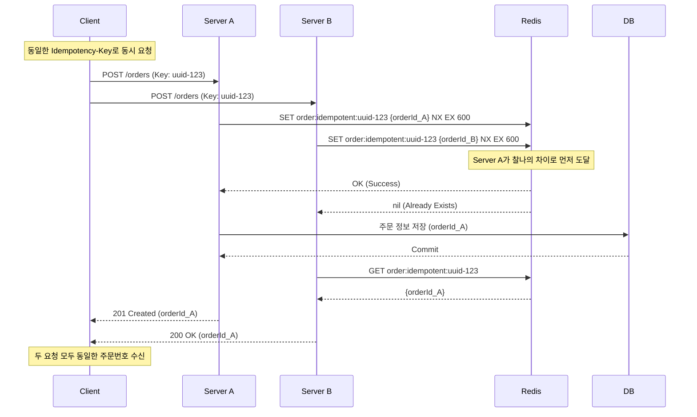

# Checkout 멱등성 설계

> 최종 수정: 2026-03-22

---

## 문제 정의

`POST /checkout` 호출 시마다 `UUIDProvider.generateUUID()`로 새 orderId를 생성한다.
클라이언트 버그, 네트워크 재시도, UI 중복 클릭 등으로 동일한 사용자/상품 조합 요청이
여러 번 도달하면 각각 다른 orderId를 가진 `PaymentEvent`가 복수 생성된다.

```
클라이언트 → [POST /checkout] × 3
→ PaymentEvent(orderId=A), PaymentEvent(orderId=B), PaymentEvent(orderId=C) 생성
→ 결제 전 READY 상태 주문 3개 누적
```

**영향:** 유효하지 않은 READY 주문이 DB에 쌓임, 재고 관련 후속 로직 혼란 가능

---

## 설계 옵션 비교

### Option 1: 클라이언트 멱등성 키 (표준 패턴)

클라이언트가 UUID를 생성해 헤더(`Idempotency-Key`)에 포함, 서버가 키 기준으로 중복 판정.

- **장점:** Stripe 등 표준 패턴, 의미가 명확
- **단점:** 클라이언트 협력 필요, 클라이언트가 같은 키로 3번 요청을 보낼 수 있다는 것이 전제

### Option 2: DB Unique Constraint (서버 사이드)

`payment_event` 테이블의 `(user_id, idempotency_key)` 또는 별도 `idempotency_key` 컬럼에
UNIQUE 제약을 걸고, `DuplicateKeyException` 발생 시 기존 row 반환.

- **장점:** 추가 인프라 불필요, DB 트랜잭션과 묶여 정합성 보장
- **단점:** 예외 흐름으로 로직 처리, TTL 직접 관리 필요

### Option 3: Redis SETNX EX (분산 환경)

```
SET order:idempotent:{userId}:{hash} {orderId} NX EX 10
```

- SETNX 성공 → 주문 생성 후 orderId 저장
- SETNX 실패 → `GET`으로 기존 orderId 조회 후 반환
- **장점:** 원자적, TTL 자동, 다중 서버에서도 동작
- **단점:** Redis 인프라 필요, 장애 시 별도 대응 필요

### Option 4: 인메모리 Caffeine Cache (단일 서버 한정)

```java
Cache<String, String> cache = Caffeine.newBuilder()
    .expireAfterWrite(10, TimeUnit.SECONDS)
    .build();
```

- **장점:** 인프라 불필요, 구현 단순, 원자적 `get-if-present` 지원
- **단점:** 서버 재시작 시 소실, 다중 서버 불가

---

## 결정 사항

| 항목 | 결정 | 이유 |
|------|------|------|
| 구현 방식 | Option 4 (Caffeine 인메모리) | 단일 서버 벤치마크 환경, 인프라 불필요 |
| 캐시 라이브러리 | Caffeine | Spring Boot 친화적, Guava Cache와 API 유사, 성능 우수 |
| TTL | 10초 | 중복 클릭/재시도 방어에 충분, 의도적 재주문과 구분 가능 |
| 멱등성 키 | `Idempotency-Key` 헤더 (없으면 body hash 파생) | 클라이언트 선택적 제공, 미제공 시 서버 자동 파생 |
| body hash 파생식 | `hash(userId + sortedProductIds + amounts)` | 동일 주문 내용 식별 |
| HTTP 응답 상태 | 최초 생성 201 Created / 중복 반환 200 OK | 클라이언트가 신규/기존 구분 가능 |
| 포트 추상화 | `IdempotencyStore` outbound port 인터페이스 | 추후 Redis(Option 3) 교체 용이 |
| 저장 내용 | `idempotencyKey → CheckoutResult` | orderId + totalAmount 재구성 없이 바로 반환 |

---

## 영향 범위

- **변경:**
  - `PaymentController` — `@RequestHeader("Idempotency-Key")` 추출 추가
  - `PaymentPresentationMapper` — `CheckoutCommand`에 키 포함
  - `CheckoutCommand` — `idempotencyKey` 필드 추가
  - `PaymentCheckoutServiceImpl` — 중복 판정 로직 추가
  - `build.gradle` — Caffeine 의존성 추가
- **신규:**
  - `application/port/out/IdempotencyStore` — outbound port 인터페이스
  - `infrastructure/idempotency/IdempotencyStoreImpl` — Caffeine 기반 구현
  - `core/common/util/IdempotencyKeyHasher` — body hash 파생 유틸
- **무관:** confirm 흐름, Outbox/Kafka 전략, 도메인 엔티티

---

## 제외 범위

- **Redis 전환:** 멀티 서버 확장 시 Option 3으로 교체 — 현재 단일 서버 벤치마크 대상 외
- **DB Unique Constraint:** 현재 `payment_event` 스키마 변경 없음
- **멱등성 키 감사 로그:** 이번 작업 범위 외

---

## 구현 위치 (헥사고날 레이어 기준)

```
presentation layer  : Idempotency-Key 헤더 추출 → CheckoutCommand에 포함
application layer   : PaymentCheckoutServiceImpl — 중복 판정 및 기존 CheckoutResult 반환
infrastructure layer: IdempotencyStoreImpl (Caffeine) — IdempotencyStore 포트 구현
```

`IdempotencyStore`를 outbound port 인터페이스로 정의하면
인프라 교체 없이 전략만 바꿀 수 있다.

---

## 참고

### SETNX Race Condition (Option 3 적용 시 참고)

