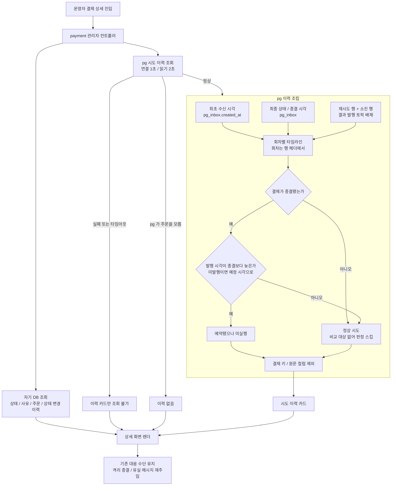
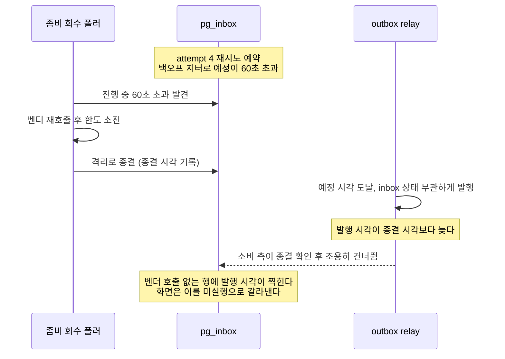
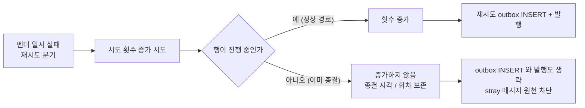

# 관리자 화면 가시성 확충 — 완료 브리핑

> 작업 기간: 2026-07-27 ~ 2026-07-28 · 이슈/브랜치 #126

## 작업 요약

결제 전 구간을 라이브로 구동해보니 운영자가 화면만 보고는 상황을 파악할 수 없는 지점이 두 곳 드러났다. 격리된 결제 상세에는 최종 상태와 사유만 있어 몇 번, 언제 시도해서 소진됐는지 알 수 없었고, 관리자 화면에 재고 항목 자체가 없어 결제 실패로 재고가 제대로 되돌아왔는지 확인하려면 DB를 조회해야 했다. 둘 다 개발자 없이는 대응이 불가능한 상태였다.

문제의 뿌리는 정보를 가진 쪽과 화면을 그리는 쪽이 다른 서비스라는 것이었다. 시도 기록은 pg-service DB에, 확정 재고는 product-service DB에 있는데 관리자 화면은 payment-service가 그린다. 게다가 payment ↔ pg 사이에는 HTTP 경로가 아예 없었다 — 두 서비스는 Kafka로만 대화했고 pg-service에는 컨트롤러가 한 개도 없었다.

접근의 전환점은 **재시도가 이미 행 단위로 DB에 쌓여 있다는 발견**이었다. pg-service의 재시도는 별도 큐나 스케줄러가 아니라 outbox 행 INSERT 로 표현되고(`PgVendorCallService.insertRetryOutbox`), 그 테이블을 비우는 정리 작업이 없다. 즉 시도 이력 타임라인이 온전히 남아 있었다. 새 테이블도 새 쓰기 경로도 없이 읽어서 조립하면 되는 일이었다. 최초 시도만 outbox 행이 아닌 `pg_inbox.created_at`(명령 수신 시각)에서 온다.

다만 관측 기능이면서도 사실의 정확성을 두 군데서 지켜야 했다. 좀비 회수 폴러의 타임아웃(60초)이 마지막 재시도의 백오프 범위(40.5~67.5초)와 겹쳐, 폴러가 예약된 재시도를 앞지르면 **벤더 호출 없이 발행만 된 행**이 남는다. 이를 정상 시도로 세면 화면이 "종결 이후에도 시도가 있었다"는 거짓을 시간 역전된 순서로 보여준다. 그리고 그 판정이 딛고 서는 종결 시각(`pg_inbox.updated_at`)이 밀리지 않도록 시도 횟수 증가 UPDATE에 상태 가드를 붙여야 했다 — 이번 작업이 승인 경로를 건드린 유일한 지점이다.

결과적으로 관리자 결제 상세에 회차별 시도 이력 카드가 붙고, 상품 단위 재고 화면이 생겼다. pg-service에는 첫 HTTP 진입점이 세워졌다. pg가 죽어도 상세 화면은 열리며 격리 종결·유실 메시지 재주입 버튼은 그대로 동작한다. 라이브 검증 과정에서 화면이 거짓을 말하는 표시 결함 둘을 잡아 고쳤고, ship 게이트에서 사용자 요청으로 항상 0인 죽은 컬럼(`pg_outbox.attempt`)과 그것으로 상수 0을 발행하던 히스토그램까지 걷어냈다.

## 핵심 설계 결정

| 결정 | 근거 | 기각된 대안과 이유 |
|---|---|---|
| pg-service에 관리자 조회 REST를 신설하고 화면 렌더 시 직접 조회 | 진행 중인 결제도 보이고 이력의 출처가 pg 한 곳으로 유지된다 | **종결 결과 메시지에 동봉** — 필요한 것은 횟수 하나가 아니라 이력이라 메시지에 배열을 실어야 하고, 결과 메시지가 관측 데이터 운반 그릇으로 변한다. payment 쪽에 이력 저장소를 새로 만드는 것은 V5에서 죽은 컬럼으로 지운 재시도 카운트를 형태만 바꿔 되살리는 셈. **시도마다 경과 이벤트 발행** — 이미 DB에 있는 이력을 메시지로 복제하는 구조라 부품만 늘고 종결 이벤트와 순서가 어긋날 여지가 생긴다 |
| 이력 출처는 새 테이블이 아닌 기존 `pg_outbox` 재시도·소진 행 + `pg_inbox` 최초 수신 시각 | 재시도가 행 단위로 쌓이고 정리 작업이 없어 이력이 온전하다. 승인 경로의 쓰기를 늘리지 않는다 | **시도 이력 전용 테이블** — 벤더 호출 실제 시각을 기록해 유령 행 문제가 애초에 안 생기지만, 같은 사실이 두 곳에 남아 어긋날 여지가 생기고 승인 경로 쓰기 트랜잭션에 삽입이 하나 늘어난다. 관측 기능이 결제 본류의 쓰기 경로를 건드리는 것은 피하려던 것 |
| 미실행 판정은 **발행 시각(없으면 실행 예정 시각)** 을 종결 시각과 비교. 비종결이면 판정 자체를 건너뛴다 | 예정 시각만 비교하면 "예정은 종결 전이었으나 발행이 밀려 종결 이후에 나간 행"을 놓친다. 비종결에서 기본값을 잘못 잡으면 진행 중인 정상 재시도가 미실행으로 표시된다 | 초기 설계는 예정 시각만 비교했다 — plan 게이트에서 좁은 창을 놓친다는 지적으로 정밀화 |
| `incrementAttempt` UPDATE에 진행 중 상태 가드 추가 | 가드가 없으면 종결된 행의 종결 시각이 뒤로 밀리고 시도 횟수가 부풀려져, 유령 행 판정이 오염된 기준점 위에서 이뤄진다. 정상 재시도 경로에서는 행이 진행 중이라 무동작 | 관측 전용 경계를 지키고 한계로만 기록하는 안 — 화면이 딛고 설 기준선이 조용히 밀리면 기능의 전제가 무너진다고 판단 |
| 회차는 outbox 행의 `headers_json` 에서 읽는다 | 행 INSERT 시 정확히 기록된다 | `pg_outbox.attempt` 컬럼 — 두 생성 팩토리가 0을 박아 넣고 증가시키는 UPDATE가 없어 항상 0인 죽은 컬럼. 이번 작업에서 아예 제거 |
| 재고는 조회 전용, 확정 수량만, 상품 단위 별도 화면 | 선차감이 도는 중 사람이 재고를 만지면 동시성 문제가 붙는다. 캐시 선차감 상태는 승인 중 확정 수량과 어긋나 화면에서 설명이 안 된다 | 초기 가정은 "조작 기능 포함"이었으나 동시성 위험으로 뒤집혔다. 기존 캐시 재동기화 REST는 유지하되 화면에 노출하지 않는다. **결제 상세 안에 재고 표시** — 기존 단건 조회 재사용으로 끝나지만 결제 한 건에 걸린 상품만 보이고 상세 렌더가 상품 서비스 상태에 더 얽힌다 |
| pg 조회 실패 시 이력 카드만 조회 불가로 표시하고 상세의 나머지는 렌더 | 관리자 상세는 격리 종결·재주입 버튼이 걸린 대응 화면이다. 관측 정보가 안 보인다고 대응 수단이 막히면 기능을 더한 것이 아니라 뺀 셈이 된다 | — |
| 관리자 조회 전용 짧은 Feign 타임아웃 (연결 1초 / 읽기 2초) | 기본값(2초/5초)이면 pg가 느릴 때 상세 진입이 그만큼 지연된다. 관리자 화면은 빨리 실패하고 부분 렌더하는 편이 낫다 | — |
| 조회 포트를 결제 승인 경로가 쓰는 `ProductPort` 와 분리, Feign client는 공유 | 승인 경로 포트에 관리자 용도가 섞이면 나중에 떼어내기 어렵다. client를 나누면 불필요한 중복이 생긴다 | — |
| 이력 없음은 404가 아니라 정상 응답 | 조회 실패와 구분되어야 한다. 이 설계 덕에 컨트롤러가 없던 서비스에 예외 핸들러를 새로 만들지 않고 끝났다 | — |

## 변경 범위

**pg-service — 이력 제공 (최초의 HTTP 진입점)**

| 영역 | 내용 |
|---|---|
| 추가 | 관리자 조회 컨트롤러(`GET /api/v1/confirmations/{orderId}/attempts`) + 인바운드 포트 + 응답 DTO 2종 |
| 추가 | 이력 조립 서비스 + 타임라인 DTO 2종 — 회차별 조립, 유령 행 판정, 원문 컬럼 배제 |
| 추가 | `PgOutboxRepository` 주문번호별 이력 행 조회 — 재시도·소진 토픽만, 결과 발행 토픽 배제, 예약 시각 오름차순 |
| 추가 | Flyway V6 — `pg_outbox` 주문번호 + 토픽 인덱스 (관리자 조회 전용, 발행 큐 폴링 인덱스와 용도 분리) |
| 변경 | `incrementAttempt` 에 진행 중 상태 가드 + 반영 행 수 반환. `insertRetryOutbox` 순서 반전(증가 먼저 → 0이면 outbox INSERT·발행 생략) |
| 제거 | Flyway V7 — `pg_outbox.attempt` 컬럼 + 도메인 필드 + 엔티티 매핑 + `pg_outbox.attempt_count_histogram` 메트릭과 그 pending 전량 스캔 |

**payment-service — 이력 소비 + 화면**

| 영역 | 내용 |
|---|---|
| 추가 | pg 전용 Feign client + 설정(짧은 타임아웃, ErrorDecoder) + 수신 DTO |
| 추가 | 조회 포트 2종(시도 이력 / 상품 카탈로그) + HTTP 어댑터 2종 — 승인 경로 포트와 분리 |
| 추가 | 입력 포트 2종 + application 구현 2종 — 조회 실패 흡수와 폴백 판단 전담 |
| 변경 | 결제 상세에 시도 이력 카드 + 세 상태(이력 있음 / 없음 / 조회 불가) 분기 |
| 추가 | 재고 화면 컨트롤러(`/admin/stocks`) + 템플릿 — 조회 전용, 확정 수량만, 한계 안내 문구 |

**product-service — 재고 목록**

| 영역 | 내용 |
|---|---|
| 추가 | 상품 목록 페이징 조회 — 포트, 저장소(상품+재고 배치 조회로 N+1 회피), 유스케이스, 엔드포인트, 페이지 응답 DTO. 크기 상한 100 |

**무관 (건드리지 않음)**: 상태 전이 도메인, 재고 캐시 선차감·보상 로직, 기존 회복 기능(격리 종결·유실 메시지 재주입), 기존 캐시 재동기화 REST, `ProductPort`(승인 경로 포트, 시그니처 불변), `pg_inbox.attempt`(시도 횟수 정본).

## 다이어그램

### 이력 조립과 유령 행 판정

### 유령 행이 생기는 경로

### 승인 경로 접촉 (유일)

## 코드 리뷰 요약

게이트는 discuss 2라운드, plan 1라운드, ship 1라운드 + 재리뷰 1회로 진행했다.

**discuss 게이트** — critical 0. domain-expert가 좀비 회수 경합으로 outbox 타임라인이 실제 시도와 어긋날 수 있음을 지적해 유령 행 라벨링 결정이 여기서 생겼다. `pg_outbox.payload` 의 벤더 결제 키 노출 방지 방침도 이때 추가됐다. reviewer는 TODOS 미등재와 라이브 검증 필요 여부 미결정을 지적했다. 2라운드에서 `incrementAttempt` 무가드 UPDATE로 종결 시각이 오염될 수 있다는 major가 나와, 사용자 확인 후 상태 가드를 이번 범위에 포함시켰다.

**plan 게이트** — 양쪽 pass. 미실행 판정을 예정 시각만으로 하면 "발행이 종결 이후로 밀린 행"을 놓친다는 지적으로 판정 기준을 발행 시각 우선으로 정밀화했다. 가장 위험하다고 지목한 상태 가드는 domain-expert가 호출 경로를 역추적해 정상 재시도를 막지 않음을 확인했다.

**라이브 검증에서 발견** — 화면이 거짓을 말하는 표시 결함 2건. 최초 수신 회차가 "미발행(실행 예정)"으로 나와 실행 안 된 것처럼 보였고(1회차는 outbox 행이 없어 예약·발행 시각이 빈다), 소진 행에 소진 표시가 없어 회차 4가 세 줄 중 어느 것이 한도 소진인지 구분되지 않았다. 둘 다 수정 후 재기동으로 재확인했다.

**ship 리뷰** — critical 0 / major 2 / minor 2, 전건 채택.

| # | 등급 | finding | 처리 |
|---|---|---|---|
| 1 | major | payment-service의 새 컨트롤러 둘이 `application.port.out` 을 직접 호출 — 계층 규칙 위반. 같은 변경의 pg-service 쪽은 인바운드 포트를 거쳐 PR 내부 일관성도 깨짐 | 얇은 입력 포트 2종 + application 구현 2종을 넣고 조회 실패 흡수를 그쪽으로 이동 |
| 2 | major | 두 워커가 같은 주문을 동시에 재시도 분기 태우면 같은 회차 번호가 여러 줄에 찍힐 수 있는데 안내 문구가 없음 | 화면 안내에 회차 중복 가능성 추가. 자동 판정(격리 종결·재주입)은 이 값을 읽지 않아 오염되지 않음을 확인 |
| 3 | minor | `addAttemptHistory` 의 try 범위가 로컬 뷰 변환까지 감싸 pg 장애와 매핑 버그가 구분되지 않고, 로그에 예외 타입이 없음 | try를 포트 호출로 좁히고 예외 타입 로깅 추가 |
| 4 | minor | `insertRetryOutbox` 가 시도 횟수 반영 행 수 0(가드 발동)을 무시하고 outbox 행을 넣어 종결된 주문에 stray 메시지가 생김 | 반환형을 `int` 로 살리고 순서 반전 — 증가 먼저, 0이면 INSERT·발행 생략 |

**재리뷰** — 양쪽 pass, 새 critical·major 없음. 승인 경로 재변경(순서 반전)이 트랜잭션 원자성·한도 판정 순서·소진 경로를 깨지 않음을 소스 대조 + Testcontainers 통합 테스트 실측으로 확인했다. 한도 판정은 증가 **전** 값으로 이미 결정되므로 순서 충돌이 없다. 재리뷰 minor 1건(주석의 예외 흡수 주체가 리팩터 이전 문구)도 수정했다.

**ship 게이트에서 사용자 요청으로 추가** — `pg_outbox.attempt` 죽은 컬럼 제거(Task 14). 조사 과정에서 이 값으로 `pg_outbox.attempt_count_histogram` 을 매분 발행하며(설명은 "attempt 분포"인데 값은 상수 0), 그걸 채우려고 pending outbox 행 전량을 매분 적재하고 있었음이 드러났다. 대시보드 참조는 없음을 확인하고 컬럼·도메인 필드·엔티티 매핑·메트릭을 함께 걷어냈다. 선례는 payment-service `V5__drop_payment_event_retry_count.sql`.

## 라이브 검증

도커 스택(`--mode fake --skip-obs`)을 기동해 3항목을 관찰 확인했다.

가짜 게이트웨이로는 재시도를 유발할 수 없다 — 주입 실패가 재시도 **불가** 예외라 확정 실패로 직행하고, Toxiproxy 드릴 설정은 Kafka 앞단만 프록시해 벤더 호출을 건드리지 못한다. 그래서 재시도 소진으로 격리된 결제에 해당하는 행을 pg DB에 직접 심어(사용자 승인) 조회·조립·렌더 경로를 검증했다. pg가 그 행을 올바르게 쓰는지는 `PgSelfLoopRetryExhaustionIntegrationTest` 가 덮는다. 검증용 데이터는 전건 삭제했다.

| 항목 | 결과 |
|---|---|
| 시도 이력 렌더 | 최초 수신 + 재시도 3회 + 유령 행 + 회차 미지 + 소진 행이 정확히 분류. 결과 발행 토픽 행 배제. 유령 행이 발행 시각 기준으로 미실행 판정됨 — 예정 시각만 비교했다면 새어 나갔을 행 |
| 결제 키 비노출 | 심어둔 `payload` 에 평문 키가 있는 상태에서 응답 0건, pg 로그 0건 |
| pg 중단 시 부분 렌더 | HTTP 200, 이력 카드만 안내로 대체. 격리 종결·재주입 폼 둘 다 생존. 재기동 직후 Eureka 등록 전 콜드 스타트 구간도 같은 경로를 탐 |
| 재고 화면 | 확정 수량이 RDB와 일치. RDB를 95로 바꾸면 화면도 95, 97로 되돌리면 97로 즉시 반영. 상품 서비스 중단 시에도 200 + 안내이며 결제 상세 무영향 |

## 수치

| 항목 | 값 |
|---|---|
| 태스크 | 14개 (13 + ship 게이트에서 추가된 죽은 컬럼 제거) |
| 커밋 | 31 |
| 파일 | 86 files changed |
| 테스트 | pg-service 351 단위 + 16 통합 / payment-service 539 / product-service 57 — 전건 통과, 린트 4종 통과 |
| 게이트 findings | discuss critical 0 · major 3 / plan minor 5 / ship critical 0 · major 2 · minor 2(+재리뷰 minor 1) — 전건 처리 |

## 미결 / 후속

| 항목 | 내용 |
|---|---|
| `[PG-WORKER-SPAN-ORDER-ID]` | 재시도 워커가 추적 문맥을 복원만 해 원격 구간에 속성이 조용히 버려진다 — 주문 단위 추적 검색 불가. 워커 자체 추적 구간 생성이 선행돼야 하는 별 작업 |
| `[PG-ZOMBIE-TIMEOUT-BACKOFF-OVERLAP]` | 좀비 타임아웃 60초 < 최대 재시도 백오프 67.5초 겹침 자체는 남는다. 이번 작업은 표시만 교정했다. `[PG-RETRY-BACKOFF-OFF-BY-ONE]` 와 함께 판단 필요 |
| 재고 조작 | 캐시 재동기화 화면 노출 · 확정 수량 조정 · 잡힌 재고 수동 해제 — 동시성 위험으로 별 토픽 |
| 회차 중복 | 두 워커 동시 진입 시 같은 회차가 여러 행에 나타난다. 화면 문구로 알리는 선까지 처리했고 근본 해소는 위 겹침 항목과 얽힌다 |
| 라이브 재실측 | 이 작업이 끝나면 실측 리포트의 로그 근거를 화면 근거로 교체한다 — 재시도 근거는 관리자 화면 시도 이력으로, 재고 되돌림은 재고 화면 세 장으로 |
