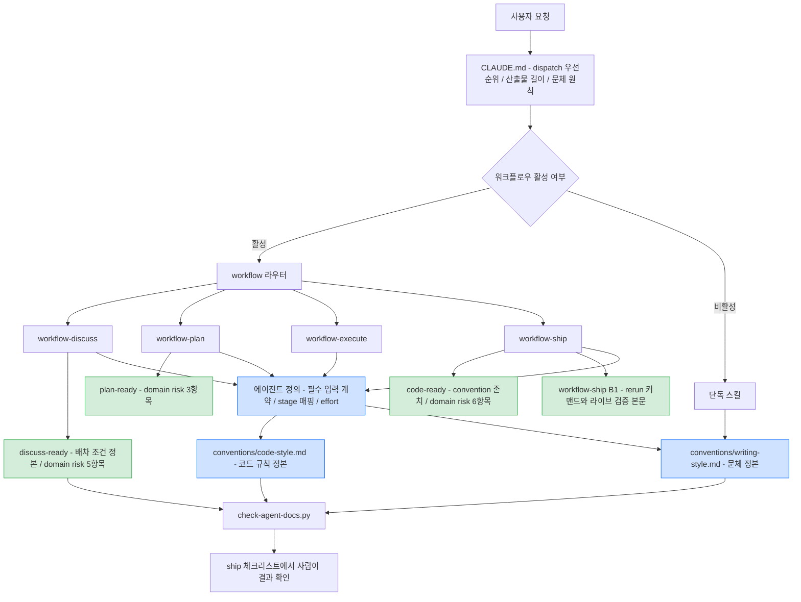

# 에이전트 컨텍스트 정비 — 완료 브리핑

> 작업 기간: 2026-07-30 ~ 2026-08-03 · 이슈 [#130](https://github.com/hyoguoo/payment-platform/issues/130) · 브랜치 `#130`

## 작업 요약

에이전트가 매 세션 읽는 지침이 `CLAUDE.md`, 스킬 14개, 체크리스트 4종, 에이전트 정의 3종, 코드 컨벤션 문서로 흩어져 있다. 여기에 두 가지가 쌓였다. 서로 부딪히는 지시가 있었고, 같은 규칙이 세 곳 이상에 본문으로 실려 있었다.

부딪히는 지시부터 보면, 세션 설정은 서브에이전트를 함부로 부르지 말라고 하는데 워크플로우 스킬은 게이트 판정과 구현을 서브에이전트로만 하라고 못박는다. 워크플로우를 돌릴 때마다 두 지시가 충돌했다. 중복 쪽은 더 조용한 문제다. 세 곳 내용이 같을 때는 아무 일도 없지만, 규칙이 바뀌어 한 곳만 고치면 나머지는 옛 내용으로 남는다. 어느 쪽이 정본인지 판단할 근거가 문서 안에 없었다.

정리 방향은 셋이다. 충돌하는 지시의 우선순위를 루트 지침에 명시하고, 중복 규칙을 정본 하나와 포인터로 모으고, 도구나 모델이 이미 하는 일을 다시 시키는 지시를 걷어냈다. 옮기는 순서도 못박았다 — 정본에 없는 규칙은 먼저 이식한 뒤에야 다른 곳을 포인터로 바꾼다. 순서를 어기면 규칙이 저장소에서 사라지기 때문이다.

정리만으로는 상태가 유지되지 않아 검사 스크립트를 함께 만들었다. 참조가 유효한지, 중복이 돌아왔는지, 어디서도 참조하지 않는 문서가 생겼는지를 판정한다. 이 도구는 만든 당일에 두 건을 잡았다. 하나는 잘라낸 줄이 만든 고아 문서였고, 다른 하나는 중복 사전의 정본 오지정이었다.

결제 도메인 방어망은 정리 대상에서 뺐다. 체크리스트의 도메인 리스크 항목, 도메인 검토자 배차 조건, 최종 검증 커맨드, 리뷰어의 도메인 위임 의무는 문구 그대로 남겼다.

## 핵심 설계 결정

| 결정 | 근거 | 기각한 대안 |
|:---:|:---:|:---:|
| 코드 규칙 서술은 `code-style.md`가 정본, 구현 에이전트 지시만 포인터화 | 리뷰 체크리스트는 판정 항목이라 성격이 다르고, 정적 분석이 없는 규칙은 수동 판정이 유일한 검증 수단 | 체크리스트까지 포인터화(검증 수단 소멸) · 에이전트 정의 정본(사람이 읽는 문서가 종속됨) |
| 정본에 없는 규칙은 먼저 이식한 뒤 포인터화 | `@Data` 금지와 null 반환 금지가 정본에 아예 없었다 — 순서를 어기면 규칙이 사라진다 | 이식 없이 포인터화 |
| null 반환 금지에 적용 범위를 함께 명시 | 금액 미수신 판정은 null이 도메인 상태고, 메시지·응답 DTO의 nullable 필드는 서비스 간 계약이다 | 범위 없이 이식(현재 코드와 즉시 모순) |
| TDD 사이클은 개발 흐름과 커밋 타입 매핑으로 나눠 각각 정본 지정 | 두 문서가 이미 각 축을 담당해 이동 없이 정리된다 | 단일 정본(축이 다른 규칙이 섞임) |
| 리뷰어의 억제 지시 제거, 도메인 위임 의무는 보존 | 보수적 판정을 지시하면 실제 결함 보고까지 줄어든다. 위임 의무는 도메인 검토자 미배석 라운드의 유일한 감지 경로 | 문구만 완화(억제 신호가 남음) |
| 리뷰어 effort만 하향, 원복 조건은 `CONCERNS.md`에 등재 | 토픽 문서는 아카이브로 빠져 평소 참조 경로에서 사라진다 | 토픽 문서에만 기록(사문화) |
| dispatch 예시 제거는 에이전트 입력 계약 신설 이후에만 | 예시 블록이 stage별 체크리스트 매핑을 명문화하는 유일한 자리였다 | 계약 없이 예시 제거(배차 입력 유실) |
| 검사 스크립트는 종료 코드로 작업을 막지 않는다 | 오탐이 남은 도구가 작업을 막으면 검사를 고치는 대신 건너뛰게 된다 | 실패 시 차단 |
| 메모리는 적용 범위까지 같을 때만 삭제 | 통합테스트 다중 서비스 조건과 라이브 검증 일반 원칙은 프로젝트 파일에 없었다 | 파일 단위 대응만 확인하고 삭제 |

## 변경 범위

**루트 지침** — dispatch 우선순위 선언과 산출물 길이 기준을 신설했다. 스킬 목록 3줄과 커밋 규칙 재서술 3줄은 제거했다. 문체 원칙 3줄은 ship 중 추가했다. 9,333자에서 8,875자로 줄었다.

**에이전트 정의 3종** — 세 에이전트 모두 필수 입력 계약(호출자 제공 항목 + 미비 시 거부)을 갖췄다. 도메인 검토자에는 stage별 체크리스트 매핑 표와 `CONCERNS.md` 선행 읽기를 추가했다. 리뷰어의 억제 지시를 걷어내고 effort를 `xhigh`에서 `high`로 낮췄다. 구현 에이전트의 코드 컨벤션 항목은 정본 포인터로 축약했다.

**체크리스트 4종** — `code-ready.md`의 execution discipline에서 린트가 잡는 미사용 import만 뺐다. 죽은 코드 판정은 남겼다. 도메인 리스크 섹션 3종은 손대지 않았고 diff에 hunk가 없음을 확인했다. `discuss-ready.md`는 도메인 검토자 배차 조건의 정본이 됐고, `ship-ready.md`에는 다중 서비스 재실행 조건과 검사 스크립트 확인 항목이 들어갔다.

**워크플로우 스킬** — 네 스킬에서 dispatch 예시 블록을 제거하고 에이전트 입력 계약을 가리키게 했다. 브리핑 플로우차트 규칙을 완화하되 도메인 토픽 예외를 같은 절에 명시했다. 최종 검증 절차의 실행 커맨드는 본문 그대로 남겼다.

**문서 컨벤션** — 352줄짜리 작성 컨벤션을 문체·용어·표 세 파일로 쪼개고 원 파일은 인덱스로 줄였다. 최상위 불릿 32개와 코드 블록 15개가 분할 전후로 일치한다. 문서 검수 스킬의 사본 표를 포인터로 대체하고 루프 상한을 3에서 2로 낮췄다.

**코드 규칙 문서** — `code-style.md`에 `@Data` 금지와 null 반환 금지를 이식했다. null 규칙에는 적용 범위와 제외 대상 세 갈래를 함께 적었다.

**검사 도구** — `scripts/check-agent-docs.py`를 신설했다. 참조 무결성·frontmatter·체크리스트 참조·중복 규칙·Mermaid 금지 문자·고아 문서 6종을 판정한다.

**메모리** — 30건 중 10건을 삭제하고 2건을 부분 정리했다. 18건은 프로젝트 파일보다 적용 범위가 넓어 남겼다.

## 다이어그램

정비 후 지침이 로드되는 경로다. 초록은 문구를 보존한 방어망, 파랑은 정본이 된 자리다.

## 코드 리뷰 요약

ship 리뷰에서 5건이 나왔다. critical은 없었고 4건을 채택, 1건을 스킵했다.

- `TESTING.md` 헤더가 본문 축약 이후에도 갱신되지 않았다 (major, 채택) — 이 작업이 강조한 ship 게이트 항목에 스스로 걸릴 사안이었다
- 참고 문서가 루트에 남아 아카이브 후 참조를 잃는다 (minor, 채택) — `docs/context/`로 옮기고 색인을 추가했다
- 중복 사전에 `catch (Exception)` 항목이 빠졌다 (minor, 채택)
- 위 항목의 정본을 거꾸로 지정했다 (major, 채택) — 포인터 파일을 정본으로 적어 진짜 정본이 검사 대상에 남았다. 출력은 문제 0건이었지만 대조한 것이 없었다. 재리뷰가 잡았다
- 커밋 scope 일관성 (minor, 스킵) — amend가 막혀 과거 커밋을 고칠 수 없다. 다음 토픽부터 통일한다

도메인 검토자는 pass를 냈다. 체크리스트 3종의 도메인 리스크 항목, 배차 조건의 2갈래 문구와 예시절, 최종 검증 커맨드, 리뷰어의 위임 의무를 원본과 대조해 훼손이 없음을 확인했다. 새로 이식한 null 반환 금지의 제외 범위도 실제 코드의 정당한 null 사용과 대응한다고 판정했다.

게이트는 오래 걸렸다. discuss는 6라운드, plan은 3라운드를 돌았다. 잔여 findings가 discuss에서 9 → 8 → 7 → 5 → 3 → 3으로 줄었다. 반복된 지적 유형이 하나 있다 — 설계 문서가 인용한 파일 경로·섹션명·항목 수가 실제와 어긋났다. 세 라운드 연속으로 같은 종류가 나왔고, 그때부터 완료 기준을 자기 판정 대신 diff 대조로 바꿨다.

## 수치

| 항목 | 값 |
|:---:|:---:|
| 태스크 | 19개 (계획 18 + ship 중 추가 1) |
| 커밋 | 23개 |
| 변경 | 31파일 +2394 / -486 |
| 소스 코드 변경 | 0건 (문서·검사 스크립트만) |
| 테스트 | 전체 통과, 전 태스크 UP-TO-DATE — 소스 변경이 없어 재실행 대상 없음 |
| 린트 게이트 | checkstyle·spotbugs main/test 통과 |
| 라이브 검증 | 해당 없음 — 런타임 행동 변경 0건 |
| 검사 스크립트 | 참조 214 · frontmatter 17 · 체크리스트 17 · 중복 8 · 고아 15 모두 문제 0건 |
| discuss 게이트 | 6라운드 |
| plan 게이트 | 3라운드 |
| ship 리뷰 findings | critical 0 · major 2 · minor 3 |

## 후속 항목

`TODOS.md` 섹션 F에 다섯 건을 등재했다.

- 리뷰어 effort 하향의 실제 영향을 첫 도메인 인접 토픽에서 재확인
- 정적 분석 규칙 신설 — `var`·`@Data`·null 반환·`catch (Exception)`을 checkstyle이나 ArchUnit으로 강제
- 검사 스크립트의 CI 편입 — 오탐이 잦아든 뒤 판단
- `code-ready.md`의 낡은 `handleUnknownFailure` 참조 정리 — 이 메서드는 코드에 더 이상 없다
- 결제 흐름 문서 두 곳의 Mermaid 유니코드 화살표 40건 정리
