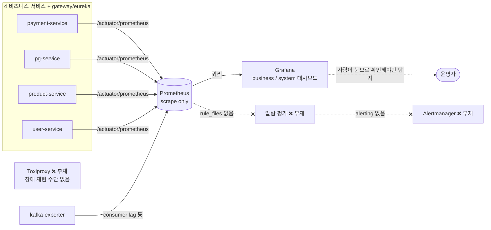
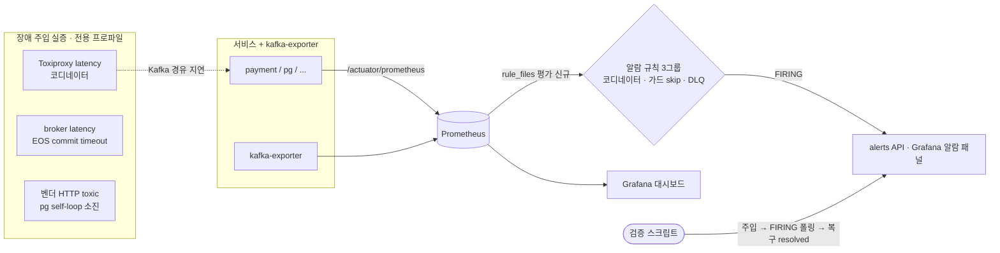

# 알람 규칙 인프라 + 장애 주입 실증 설계

> 최종 수정: 2026-06-26

## 사전 브리핑

### 현재 이해한 문제

관측 대시보드와 메트릭은 갖췄지만, **임계 초과 시 자동으로 경보를 울리는 알람 규칙 인프라가 없다**. Kafka 트랜잭션 코디네이터 장애로 결제 확정 처리가 멈추거나, 종결 가드가 늦게 도착한 승인 결과를 조용히 무시(noop)하는 비율이 치솟아도, 사람이 대시보드를 들여다보지 않는 한 탐지되지 않는다. 더불어 그렇게 정의한 알람이 **실제 장애 상황에서 발화하는지 검증할 장애 주입 수단(Toxiproxy)도 없다**.

### 현재 시스템 동작 (as-is)

- Prometheus는 6개 서비스 + kafka-exporter를 scrape만 하고 `rule_files`/`alerting` 블록이 둘 다 없다.
- 코디네이터 트랜잭션 메트릭(`kafka_producer_txn_*`), 종결 가드 skip(`payment_confirm_guard_skip_total`), EOS 커밋 실패 DLQ 도달(`payment_eos_commit_failure_dlq_total`), 격리(`payment_quarantined_total` / `pg_retry_exhausted_quarantine_total`)는 **수집·시각화는 되지만 임계 자동 경보는 없다**.
- 장애를 의도적으로 주입해 알람을 흔들어 볼 프록시 계층이 없다.

### 이번 discuss에서 결정하려는 것

1. **알람 토폴로지** — Prometheus alert rule만 평가(Grafana 알람 패널로 표시) vs Alertmanager까지 도입(통지 라우팅). 학습 프로젝트 맥락에서 어디까지.
2. **알람 대상 + baseline 임계** — 코디네이터 장애(트랜잭션 commit/abort 정체·consumer lag), 종결 가드 skip 비율, 그리고 확장 후보(EOS 커밋 실패 DLQ 도달·격리 누적)를 어디까지 알람으로 잡을지 + 측정 없이 시작하는 잠정 임계.
3. **Toxiproxy 도입 형태** — 어느 compose에 어떤 프록시를 둘지. 코디네이터 지연/kill 과 DLQ 소진 2종을 어떻게 재현할지.
4. **알람 발화 실증 방법** — 장애 주입 → 알람 PENDING/FIRING 전이 확인을 자동(검증 스크립트) vs 수동(smoke 가이드)으로 어떻게 남길지.

### 열린 질문 / 가정

- **통지 채널**: Alertmanager까지 가면 어디로 통지하나(Slack/webhook)? 학습 프로젝트라 "rule 평가 + Grafana 표시"만으로 충분한지, 아니면 통지 라우팅 실증까지 가치가 있는지.
- **코디네이터 장애 재현**: 현재 Kafka는 단일 broker(broker=coordinator)라, broker 앞에 Toxiproxy를 끼워 지연/끊김을 주면 코디네이터 장애로 충분히 근사되는가.
- **DLQ 소진 알람 대상**: "DLQ 소진"의 알람 신호는 무엇인가 — `.dlq` 토픽 적체(kafka-exporter consumer lag)인가, EOS 커밋 실패 DLQ 도달 카운터 증가율인가.
- **가정**: k6 부하 곡선(T4-B)·나머지 장애 6종(DB 지연, 프로세스 kill, FCG timeout, Redis 다운, 재고 캐시 발산, 보상 중복 진입)은 **이 토픽 범위 밖**(후속 분리).
- **가정**: 측정 환경이 아직 없으므로 임계값은 baseline(잠정)으로 시작하고, 실측 정밀화는 후속으로 표시한다.

---

## 요약 브리핑

### 결정된 접근

Prometheus에 알람 규칙 평가 인프라를 세운다(Alertmanager 없이 `rule_files` 평가 + Grafana/`/alerts` 표시). 운영 위험 3그룹 — **Kafka 코디네이터 정체 / 종결 가드의 늦은-결과 무시 / DLQ 적체** — 에 baseline 임계 규칙을 정의하고, Toxiproxy 지연 주입과 벤더·커밋 실패 주입으로 알람이 실제 FIRING되는지 검증 스크립트로 실증한다. 알람이 참조하는 메트릭이 전부 이미 존재하므로 **애플리케이션 코드는 무변경**, 인프라(observability/docker)·검증 스크립트 위주다.

### 변경 후 동작 (to-be)

### 핵심 결정 목록

- **토폴로지**: Alertmanager 미도입, Prometheus rule 평가 + Grafana 표시. compose에 `rules` 디렉토리 마운트 추가(현재 단일 파일 바인드라 필수).
- **코디네이터 발화**: txn abort(commit timeout 유래) 1차 안전망 OR consumer lag OR broker 가용성 backstop(`up==0 OR kafka_brokers<1 OR absent(kafka_brokers)`) — 3분기. 라이브 실측 결과 단일 broker 완전 정지 시 `kafka_brokers` 는 0 이 아니라 시리즈 소멸(absent)로 되므로 `absent()` 가 완전다운 backstop의 실제 주체이며, `kafka_brokers<1` 단독은 dead branch.
- **가드 skip**: 위험 status(비-DONE terminal) 필터 분자 / 분모 IN_PROGRESS→terminal 전이 / `for` + 분모 하한.
- **DLQ 적체**: 앱 도달 카운터 + `.dlq` 토픽 offset 둘 다 `increase()` 델타, 독립 cross-check(합산 금지).
- **주입 분리**: 코디네이터=latency toxic / EOS DLQ=broker latency commit timeout / pg DLQ=벤더 HTTP toxic(Fake는 NonRetryable만 던져 불가).
- **검증**: `promtool check rules` + `test rules`(합성 발화 단정) + 그룹별 라이브 드릴 스크립트.

### 트레이드오프 / 후속 작업

- **임계값은 baseline 잠정** — T4-B 부하 측정 후 실측 정밀화(규칙 주석에 잠정 표기).
- **plan 최우선 실증 대상** — 코디네이터 lag 비대칭 실현 + latency 하 EOS commit timeout의 결정성(주입 지연 ↔ `transaction.timeout.ms` 의존). 불가 시 `promtool test rules` + 통합테스트로 격하(규칙은 운영 유효).
- **범위 밖 후속** — 통지 채널(Alertmanager/Slack), 나머지 장애 6종(T4-A), k6 부하 곡선(T4-B), 오토스케일러(T4-C).

---

# 알람 규칙 인프라 + 장애 주입 실증 설계

> 최종 수정: 2026-06-26

## 문제 정의

Prometheus는 6개 서비스 + kafka-exporter를 scrape만 하고 `rule_files`/`alerting` 블록이 없다. 코디네이터 트랜잭션 정체·종결 가드 skip 급증·DLQ 적체 같은 운영 위험 신호가 메트릭으로 수집·시각화는 되지만 **임계 자동 경보가 없어 사람이 대시보드를 봐야만 탐지**된다. 또한 정의한 알람이 실제 장애에서 발화하는지 흔들어 볼 **장애 주입 수단(Toxiproxy)이 없다**.

해결: (1) Prometheus 알람 규칙 평가 인프라를 세우고, (2) 운영 위험 3종(코디네이터 정체 / 가드 skip / DLQ 적체)에 baseline 임계 규칙을 정의하며, (3) Kafka 코디네이터 장애를 Toxiproxy로 주입해 알람이 실제 FIRING되는지 검증 스크립트로 실증한다.

## 영향 범위

| 구분 | 대상 |
|---|---|
| 신규 | `observability/prometheus/rules/*.yml`(알람 규칙), Toxiproxy 컨테이너 + Kafka 경유 override(실증 전용), 알람 발화 검증 스크립트 |
| 변경 | `observability/prometheus/prometheus.yml`(`rule_files` 블록 추가); `docker/docker-compose.observability.yml`(prometheus 서비스에 `rules` 디렉토리 마운트 추가 — 현재 `prometheus.yml` **단일 파일만** 바인드라 마운트 없이는 규칙 미로드, 알람 인프라 조용히 무동작) |
| 무관 | 애플리케이션 코드(4서비스) — 알람이 참조하는 메트릭이 모두 이미 등록됨(코드 변경 없음). hexagonal layer 룰 비관여(인프라/관측 계층 전용) |

기존 메트릭 인벤토리(전부 노출 중):

- `kafka_consumergroup_lag`(kafka-exporter) — **소비 정체 1차 신호**(코디네이터 장애 시 가장 견고하게 반응). DLQ 중 소비자 있는 `payment.commands.confirm.dlq`의 backlog 신호로도 사용
- `kafka_producer_txn_commit_time_ns_total` / `kafka_producer_txn_abort_time_ns_total` — 코디네이터 트랜잭션(누적 카운터, 단독 1차 신호로 부적합 — 아래 결정 참조)
- `payment_confirm_guard_skip_total`(분자 원천) / `payment_confirm_terminal_resend_total`(정상 재발행 — 분자에서 차감) / `payment_transition_total`(분모 후보) — 종결 가드 skip
- `payment_eos_commit_failure_dlq_total` / `pg_retry_exhausted_quarantine_total` — DLQ·격리 도달 카운터(앱 발행 시점, 멱등)
- `kafka_topic_partition_current_offset{topic=~".*dlq"}` — DLQ 토픽 누적 도착량(단조 증가 — **`increase()` 델타로만** 적체 신호화. kafka-exporter 토픽 필터 없음)
- `up{job="kafka-exporter"}` / `kafka_brokers` / `absent(kafka_brokers)` — broker 가용성(하드 아웃티지 backstop — 파생 메트릭이 평탄한 완전 다운에서도 코디네이터 그룹 발화). 라이브 실측 결과 완전 정지 시 `kafka_brokers` 는 시리즈 소멸(absent)이므로 `absent()` 가 완전다운 backstop의 실제 주체. `kafka_brokers<1` 은 멀티 broker 부분 다운(exporter 생존 + broker 수 감소) 대비.

## 설계 옵션 비교

### 종결 가드 skip 알람의 분자 정의

게이트에서 `payment_confirm_guard_skip_total`이 **정상 복구(DONE+APPROVED 재발행) + 위험 noop(QUARANTINED 늦은 APPROVED 등)의 합**임이 확인됐다(`PaymentConfirmResultUseCase.handle`가 가드 false 진입 시 무조건 먼저 record, DONE+APPROVED면 재발행 + `terminal_resend` 동반 증가). 정상 재발행을 그대로 분자로 쓰면 오탐 + 위험 신호 희석.

- **원천 카운터 그대로** — `rate(payment_confirm_guard_skip_total)`. 단순하나 정상 재발행 오염.
- **정상 재발행 차감** — `rate(guard_skip) - rate(payment_confirm_terminal_resend_total)`. 위험 noop만 근사. 분자 음수 방지(`clamp_min`) 필요.
- **위험 status 라벨 필터** — `rate(payment_confirm_guard_skip_total{status=~"QUARANTINED|FAILED|EXPIRED|CANCELED|PARTIAL_CANCELED"})` (DONE 제외 — DONE noop은 대부분 정상 재발행/stale 무시). `PaymentConfirmGuardSkipMetrics`가 6종 status를 eager 0 등록하므로 라벨 필터가 코드 변경 없이 가능. **한계**: 라벨은 결제 *현재* status만 담고 *수신 메시지* status가 없어, 같은 QUARANTINED라도 위험(늦은 APPROVED → 청구-미이행 불일치)과 양성(늦은 FAILED)을 구분 못 한다 — 규칙 주석에 적시.

→ **위험 status 라벨 필터**를 1차 채택(가장 직접적, 코드 무변경). 위험 status는 비-DONE terminal 전체(QUARANTINED/FAILED/EXPIRED/CANCELED/PARTIAL_CANCELED). 분모는 전체 전이가 아니라 **confirm 결과 적용 전이(IN_PROGRESS→terminal)**로 고정해 결제 1건당 2배 계상(READY→IN_PROGRESS 동반)을 배제. 저트래픽 0-division은 `and rate(분모) > floor` 가드로 흡수.

### 코디네이터 정체 신호 선택

게이트에서 두 가지가 확인됐다: (a) 누적 시간 카운터 `kafka_producer_txn_abort_time_ns_total`은 broker **완전 차단** 시 producer가 블로킹돼 평탄할 수 있으나, **latency(지연) 주입** 하에서는 EOS commit이 timeout→abort로 귀결돼 **실제 증가**한다. (b) 단일 broker + 전역 지연은 produce/fetch를 **대칭** 저하시켜 `events.confirmed` consumer lag가 안 쌓일 수 있다.

- **txn abort/producer 송신 에러(commit timeout 유래)** — latency 주입 하에서 증가 → **그룹 발화의 1차 안전망**. 단 증가의 결정성은 주입 지연 크기 ↔ `transaction.timeout.ms`/`delivery.timeout.ms` 설정 대비에 의존하므로 자명하지 않다 → **plan 최우선 실증 대상**.
- **`events.confirmed` consumer lag** — 코디네이터 정체의 가장 직관적 신호이나, 누적되려면 **producer는 흐르고 consumer만 정체**하는 비대칭 주입이 필요. 대칭 지연이면 안 쌓임.
- **broker 가용성(`up{job="kafka-exporter"}==0 OR kafka_brokers < 1 OR absent(kafka_brokers)`)** — 하드 아웃티지 backstop. 위 두 파생 신호가 평탄한 완전 다운에서도 그룹 발화. 발화식은 3분기 OR: `up==0`(exporter scrape 실패) / `kafka_brokers<1`(멀티 broker 부분 다운) / `absent(kafka_brokers)`(완전 정지 시 시리즈 소멸). 라이브 실측 결과 단일 broker 완전 정지 시 `kafka_brokers` 는 0이 아니라 시리즈 소멸(absent)이므로 완전다운 backstop 의 실제 주체는 `absent()` 임.

→ 발화 규칙은 **txn abort/producer error OR consumer lag OR broker 가용성**으로 두되, latency 정체는 txn abort, 하드 아웃티지는 가용성 backstop이 받는다. consumer lag를 1차로 승격하려면 비대칭 메커니즘(서비스별 프록시 리스너 등)을 plan에서 확정하고 실증 전 lag 실제 누적을 관측해 정당화한다.

### Toxiproxy 주입 형태 — 끊김 vs 지연·비대칭

게이트 핵심 지적: KRaft 단일 broker 완전 차단은 producer·consumer 동시 정지(신호 평탄), `advertised.listeners`(=`kafka:9092` 직결) 미설정은 프록시 우회. 더해 **단일 broker 전역 지연은 produce/fetch를 대칭 저하**시켜 consumer lag 비대칭을 만들지 못한다.

- **broker 완전 끊김** — 대칭 정지·신호 평탄. 부적합.
- **전역 latency toxic** — 끊지는 않으나 produce/fetch 대칭 저하 → lag 비대칭 미달성. 단 EOS commit timeout→abort는 발생해 txn abort 신호는 확보.
- **비대칭 latency(서비스별 프록시 경유)** — consumer(payment `events.confirmed`) 경로만 지연 프록시 경유시키고 producer(pg) 직결 → lag 실제 누적. 단일 broker에 별도 advertised 리스너를 추가해 서비스별 다른 bootstrap을 광고해야 해 구성 복잡.

→ **latency toxic + `advertised.listeners` 프록시 광고** 채택하되, **비대칭 실현(서비스별 리스너 분리 등)의 정확한 구성은 plan에서 확정·검증**한다. 비대칭이 어려우면 코디네이터 그룹 발화는 txn abort 안전망으로 확보하고 lag는 보조로 둔다. 검증 스크립트에 "produce가 실제 프록시 카운터를 통과하는지" 사전 확인 스텝을 둬 우회를 방지한다.

### Toxiproxy 배치

- **전용 프로파일(실증 시만 기동)** — 별도 compose override로 두고 실증 스크립트가 기동. 평상시 운영 경로 무오염.
- **infra 상시 포함** — Kafka 앞단 상시 경유. 평상시에도 프록시 지연/장애점 추가. 경로 오염.

→ **전용 프로파일** 채택(삭제·격리 비용 최소).

## 결정 사항

| 항목 | 결정 | 이유 |
|---|---|---|
| 알람 토폴로지 | Prometheus `rule_files` 평가 + Grafana/`/alerts` 표시. Alertmanager 미도입 | 학습 프로젝트라 통지 채널 운영 부담 불필요. 평가·발화 실증이 목적 |
| 규칙 로드 경로 | `docker-compose.observability.yml`에 `rules` 디렉토리 마운트 추가 | 현재 prometheus.yml 단일 파일만 바인드 — 마운트 없이는 규칙 미로드(무동작) |
| 알람 규칙 그룹 | 코디네이터 정체 / 종결 가드 skip / DLQ 적체 3그룹 | 운영 위험 신호 단위로 규칙 파일 분리 |
| 코디네이터 정체 신호 | txn abort/producer 에러(commit timeout 유래) OR consumer lag OR broker 가용성(`up==0 OR kafka_brokers<1 OR absent(kafka_brokers)`) — 3분기 | latency 정체=txn abort, 하드 아웃티지=가용성 backstop. 라이브 실측 결과 완전 정지 시 kafka_brokers 는 시리즈 소멸(absent) → `absent()` 가 완전다운 포착의 실제 주체; `kafka_brokers<1` 은 멀티 broker 부분 다운 대비. txn abort 결정성은 주입 지연↔txn timeout 의존이라 plan 최우선 실증. lag는 비대칭 시 |
| 종결 가드 skip 분자 | 위험 status 필터(`status=~"QUARANTINED\|FAILED\|EXPIRED\|CANCELED\|PARTIAL_CANCELED"`, DONE 제외), 분모는 IN_PROGRESS→terminal 전이 | 정상 재발행(DONE) 오염 배제 + 1건 2배 계상 배제. 라벨이 수신 status 못 가르는 한계는 주석 |
| 가드 skip 발화 조건 | 비율 SLO + `for` 지속절 + `and rate(분모)>floor` 하한 | 일시 skip이 아닌 지속 패턴만, 저트래픽 0-division 흡수 |
| DLQ 적체 신호 | 앱 도달 카운터 `increase()` + `.dlq` 토픽 offset `increase()` 델타 + `commands.confirm.dlq` 컨슈머 정체 backstop(`consumergroup_lag>0`). **독립 cross-check(OR), 합산 금지** | 누적 offset은 절대값 무의미(델타화). 앱 카운터(멱등)와 토픽 offset(좀비 중복 over-count 가능)은 count가 달라 합산 시 이중계상. 정체 backstop은 도착 onset-only 신호가 놓치는 미배수 적체(미해결 결제) 포착 |
| 임계값 | baseline(잠정), 규칙 주석에 명시 | 측정 환경 부재. 실측 정밀화는 후속(T4-B 의존) |
| 장애 주입 수단 | Toxiproxy latency toxic + `advertised.listeners` 프록시 광고(전용 override). 비대칭 실현·EOS commit timeout·pg 벤더 toxic의 결정적 구성은 plan 확정 | 완전 차단=대칭 정지, advertised 미설정=우회, 전역 latency=대칭이라 lag 비대칭은 별도 구성 필요 |
| 실증 산출물 | 검증 스크립트(장애 주입 → `/api/v1/alerts` FIRING 폴링 → 복구 후 resolved) | 자동 재현. 기존 `docs/smoke` 스크립트 패턴 계승 |

## 장애 시나리오와 대응

게이트에서 "한 장애(broker 차단)로 정체→DLQ 연쇄 실증"이 불가함이 확인됐다 — broker 차단은 소비를 죽여 DLQ 발행(같은 broker 대상)까지 실패시키고, EOS DLQ와 pg DLQ는 주입점이 다르다. **알람 그룹별로 주입점을 분리**한다.

| 알람 그룹 | 주입 방식 | 기대 발화 신호 | 함정 / 대응 |
|---|---|---|---|
| 코디네이터 정체 | Toxiproxy **latency toxic**(broker 응답 지연, 끊지 않음) + advertised 프록시 광고. 정상 confirm 트래픽 동반 | txn abort/producer 에러↑(commit timeout 유래, 1차 안전망); consumer lag↑는 비대칭 주입 달성 시 | 완전 차단·프록시 우회 회피. 전역 latency는 대칭이라 lag 비대칭 구성은 plan 확정. produce 프록시 경유 사전 확인 |
| DLQ 적체 (EOS 경로) | broker **latency 하 EOS commit timeout→abort→AfterRollback backoff 소진**(코드 무변경; 테스트 전용 커밋 실패 PostProcessor는 통합테스트 계층 한정) | `payment_eos_commit_failure_dlq_total` `increase()`↑ + `.dlq` offset 델타↑ | 라이브에서 지연→커밋 실패의 결정적 귀결은 plan 검증. 불가 시 규칙 정의만 + `PaymentEosIntegrationTest` #6/#7이 카운터 증가 이미 검증 |
| DLQ 적체 (pg 경로) | pg **벤더 HTTP toxic**(read-timeout→retryable→self-loop→attempt≥4 소진). 실벤더 호출 프로파일 전제 | `pg_retry_exhausted_quarantine_total` `increase()`↑ | Fake gateway는 fail 시 NonRetryable만 던져 self-loop 미진입 → 구동 불가(옵션 삭제). 실벤더/Fake 프로파일 택일 |

알람 규칙의 거짓 양성/음성 대응: `for` 지속절로 일시 스파이크 억제, 분모 하한으로 저트래픽 비율 출렁 억제, baseline 임계는 주석으로 잠정 표기해 실측 후 조정 경로 명시.

## 검증 전략

- **규칙 문법 + 발화 유닛테스트**: `promtool check rules`로 PromQL·구조 정적 검증 + `promtool test rules`(합성 시계열 주입 → PENDING/FIRING 단정)로 메트릭→임계 발화 로직을 라이브 없이 검증. 라이브 드릴이 격하된 그룹도 이 유닛테스트로 발화 보증.
- **프록시 경유 사전 확인**: latency toxic 주입 전, 테스트 produce가 Toxiproxy 카운터를 실제 통과하는지 확인(advertised.listeners 우회 차단 검증).
- **발화 실증 스크립트**(그룹별): ① 정상 confirm 트래픽 발생(`scripts/k6/async-payment.js` 재활용 또는 간이 confirm 루프) → ② 그룹별 주입(코디네이터=latency toxic / EOS DLQ=broker latency 하 commit timeout / pg DLQ=벤더 HTTP toxic) → ③ Prometheus `/api/v1/alerts` 폴링해 대상 알람 `state=firing` 확인 → ④ 주입 해제 후 `resolved` 복귀 확인. 종료 코드로 PASS/FAIL.
- **주입 메커니즘 plan 확정 + 격하 폴백**: 코디네이터 lag 비대칭 실현, EOS commit timeout의 결정적 유발, pg 벤더 toxic 프로파일 구성은 plan에서 실현성을 검증한다. 어느 그룹이든 라이브 결정적 주입이 불가하면 그 그룹은 **규칙 정의 + `promtool test rules`(합성 시계열 발화 단정) + 통합테스트 위임**으로 격하하고 라이브 드릴 대상에서 제외한다(규칙 자체는 남아 운영에서 유효).
- **회귀 가드**: 검증 스크립트를 `docs/smoke` 가이드에 연결해 인프라 변경 시 재실행 가능하게.

## 제외 범위

- **Alertmanager / 통지 채널(Slack·webhook)** — rule 평가·발화 실증이 목적. 통지 라우팅은 별도 가치라 제외.
- **k6 부하 곡선 전면 재설계(T4-B)** — 알람 실증에 필요한 최소 트래픽만 사용. TPS/p95 곡선 측정은 후속.
- **나머지 장애 6종(T4-A)** — DB 지연/끊김, 프로세스 kill, FCG timeout, Redis 다운, 재고 캐시 발산, 보상 중복 진입. 알람 직결 2종(코디네이터·DLQ)만.
- **임계값 실측 정밀화** — baseline으로 시작. 실측 기반 조정은 측정 환경(T4-B) 준비 후.
- **오토스케일러(T4-C)·CircuitBreaker(T4-D)** — 결이 다른 Phase 5 본진.

## 참고

- `docs/context/TODOS.md` — TC-13-FOLLOW-3(코디네이터 알람), TC-13-FOLLOW-4(가드 skip SLO), Phase 5 T4-A/T4-B
- `docs/archive/observability-completion/` — 대시보드·메트릭 인벤토리 선행 작업
- `observability/prometheus/prometheus.yml` — scrape 설정(여기에 `rule_files` 추가)
- `docs/archive/dlq-reachability/COMPLETION-BRIEFING.md` — DLQ 도달 카운터·격리 메트릭 출처
