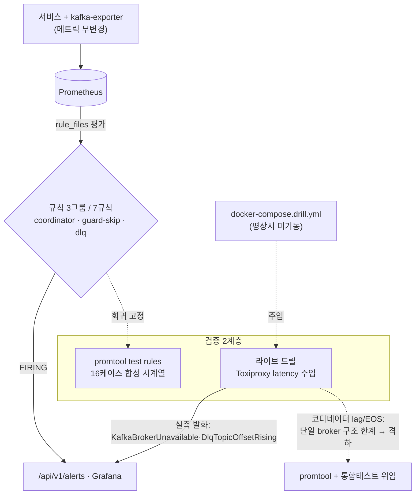

# ALERTING-RULES-AND-FAULT-DRILL 완료 브리핑

> 완료일: 2026-06-27 / 이슈·브랜치: #116

## 작업 요약

payment-platform 은 결제 흐름·상태 전이·DLQ·코디네이터 신호를 Micrometer 로 이미 노출하고 Grafana 대시보드로 보고 있었지만, **"이 신호가 위험 수준에 도달했을 때 규칙으로 판정해 알람을 띄우는" 평가 계층이 없었다.** 또한 그 알람이 실제 장애에서 발화하는지 확인할 **장애 주입 환경**도 없었다. 이 작업은 운영 위험 3축(EOS 트랜잭션 코디네이터 정체 / 비동기 confirm 종결 가드의 위험 status skip / DLQ 적체)에 대한 Prometheus 알람 규칙 인프라를 세우고, Toxiproxy latency 주입 드릴로 발화를 실증하는 것을 목표로 했다.

접근은 **rule 평가만 도입(Alertmanager·통지 채널 미연결)** 하는 최소 경계로 잡았다. `prometheus.yml` 의 `rule_files` 로 규칙 디렉토리를 로드해 `/api/v1/rules`·`/api/v1/alerts` 에서 평가·조회까지만 하고, 통지는 범위 밖으로 미뤘다. 규칙은 전부 `promtool test rules` 합성 시계열 픽스처로 발화/미발화를 회귀 고정했고(16케이스), Toxiproxy 는 평상시 미기동하는 **전용 드릴 프로파일**(`docker-compose.drill.yml`)로 분리해 정상 경로를 오염시키지 않게 했다.

결과적으로 3그룹 7규칙 + 16케이스 promtool 픽스처 + 드릴 프로파일 + 발화 검증 스크립트/가이드가 갖춰졌다. **라이브 실증이 promtool만으로는 보이지 않던 결함을 잡았다**: broker 완전 정지 시 `kafka_brokers` 메트릭은 `0` 이 아니라 **시리즈가 소멸(absent)** 하여, 원래의 `kafka_brokers < 1` 단독 backstop 은 절대 발화하지 않는 **dead branch** 였다. `absent(kafka_brokers)` 분기를 추가해 보강하고 promtool 회귀로 고정했다. `KafkaBrokerUnavailable`·`DlqTopicOffsetRising` 은 라이브 발화→해소까지 실측했다. 코디네이터 lag/EOS commit timeout 은 단일 broker 구조 한계로 라이브 결정적 발화가 불가해(아래) promtool + 통합테스트 격하 폴백으로 보증했다.

## 핵심 설계 결정

| 결정 | 근거 | 기각된 대안 |
|---|---|---|
| **rule 평가만, Alertmanager 미도입** | 학습 목표는 "위험 신호의 규칙화·발화 검증". 통지 채널은 별도 토픽 가치 | Alertmanager + Slack 통지까지 한 번에 — 범위 비대, 검증 초점 흐려짐 |
| **코디네이터 = txn abort OR consumer lag OR broker 가용성(backstop) 3신호 OR** | latency 정체는 txn abort, 소비 정체는 lag, 하드 아웃티지는 가용성이 각각 받음. 완전 다운(파생 신호 평탄)도 backstop 으로 발화 보장 | 단일 신호 — 완전 다운에서 abort·lag 가 0 이라 미발화 사각 |
| **broker 가용성 backstop = `up==0` OR `kafka_brokers<1` OR `absent(kafka_brokers)`** | **라이브 실측**: 완전 정지 시 kafka_brokers 는 0 아닌 absent → `kafka_brokers<1` 단독은 dead branch. absent() 가 실제 완전다운 backstop, `kafka_brokers<1` 은 멀티 broker 부분 다운 대비 | 초기 2분기(`up==0`/`kafka_brokers<1`) — dead branch 포함, 단일 broker 완전다운 미포착 |
| **guard skip = 위험 status 분자 / IN_PROGRESS→terminal 전이 분모 비율** | 종결 가드가 위험 status(QUARANTINED·FAILED·EXPIRED·CANCELED·PARTIAL_CANCELED)를 skip 하는 비율이 SLO 위반 신호. 분모는 `payment_transition_total{from_status=IN_PROGRESS}` (resetToReady 는 AOP 우회라 분모 비오염) | 절대 카운트 — 트래픽 규모에 따라 임계 무의미 |
| **DLQ = 앱 카운터 + `.dlq` offset 델타 + `commands.confirm.dlq` lag 독립 cross-check(OR, 합산 금지)** | 앱 카운터(멱등)와 토픽 offset(좀비 중복 over-count 가능)은 count 가 달라 합산 시 이중계상. 도메인 예외 경로 DLQ(앱 카운터 미증가)는 offset 이, 소비 정체는 lag 이 백업 | 합산 단일 신호 — 이중계상 + 원인 구분 불가 |
| **Toxiproxy = latency toxic + 전용 드릴 프로파일** | 평상시 미기동 override 로 정상 경로 무오염. latency 가 코디네이터/EOS 정체를 재현하는 가장 직접적 toxic | 상시 기동 / 연결 끊김(timeout) toxic — 정상 경로 영향, 정체보다 즉시 실패 재현 |
| **for: 2m (broker 가용성)** | exporter 콜드스타트(첫 scrape 전) 일시 absent 오발화 흡수. 트레이드오프(완전다운 단독 신호 시 감지 +1분 지연)는 오발화 회피 우선 + up==0 동시 backstop 으로 수용 | for:1m — 콜드스타트 오발화 위험 |

## 변경 범위

- **규칙 인프라** — `observability/prometheus/prometheus.yml` `rule_files` 블록, `docker-compose.observability.yml` 에 `rules` 디렉토리 마운트, `rules/.gitkeep`.
- **알람 규칙 3그룹** — `rules/coordinator.yml`(3) · `rules/guard-skip.yml`(1) · `rules/dlq.yml`(3) = 7규칙.
- **promtool 픽스처** — `rules/tests/{coordinator,guard_skip,dlq}_test.yml` = 16케이스(coordinator 6 / guard_skip 3 / dlq 7). 발화 + 미발화(알람 피로 방지) + OR 분기별 단독 발화 독립 회귀 고정.
- **장애 주입 드릴** — `docker/docker-compose.drill.yml`(kafka PROXY 리스너 + payment bootstrap 우회 + toxiproxy 서비스) · `docker/toxiproxy.json`(kafka-proxy 등록). 평상시 미기동.
- **발화 검증 스크립트** — `scripts/smoke/drill-toxiproxy.sh`(주입/해제/검증) · `alert-firing-coordinator.sh` · `alert-firing-dlq.sh` · `alert-rules-promtool.sh`(Docker 경유 통합 래퍼) + `smoke-all.sh` Phase 1.3 등록.
- **문서** — `docs/smoke/alert-firing-check.md`(가이드) · `STACK.md`(관측성 섹션) · `CLAUDE.md`(docs/smoke 참조) · `PITFALLS.md` #24(kafka_brokers dead branch) · `TODOS.md`(T4-B 정밀화 DE1/DE2).
- **애플리케이션 코드 무변경** — 알람 참조 메트릭은 전부 기존 노출분.

## 다이어그램

## 코드 리뷰 요약

ship Phase A — reviewer **revise**(major 1·minor 2), domain-expert **pass**(minor 3), critical 0. 재리뷰 **pass**.

- **[major] absent 분기 fix 의 문서-코드 정합** — 막판 보강한 3분기 발화식이 설계 SSOT·PLAN 완료기록에 2분기로 남아 있고 dead-branch 함정이 PITFALLS 미등록 → **채택**: topics 4곳·PLAN Task 3 정정 + PITFALLS #24 등록.
- **[minor] 케이스 수 drift** — 스크립트·가이드가 14케이스/coordinator 5 로 표기(실제 16/6) → **채택**: 전부 16/6/7 정정 + c3(absent)·dlq (g) 열거 추가.
- **[minor] DLQ pg 분기 픽스처 부재** — `pg_retry_exhausted_quarantine_total` OR 분기 양성 회귀 없음 → **채택**: dlq_test (g) 케이스 추가.
- **[minor] absent 콜드스타트 오발화(domain-expert)** — **채택**: `for: 1m→2m` + 트레이드오프 caveat 주석(재리뷰 minor 반영).
- **[minor] guard-skip status 라벨 위험/양성 미구분(domain-expert)** — **후속**: 현 warning 유지 합당, 수신 메시지 status 라벨화는 T4-B(TODOS DE1).
- **[minor] lag 임계 1000 미검증 baseline(domain-expert)** — **후속**: 단일 broker 구조 한계, 멀티 broker T4-B 재교정(TODOS DE2).

domain-expert 교차 확인(클린): 분모 `from_status=IN_PROGRESS` 비오염(resetToReady AOP 우회), DLQ 3신호 독립성(합산 없음), 소비자 그룹·메트릭명 실코드 일치, 드릴 프로파일 정상 경로 무오염.

## 단일 broker 구조 한계 (라이브 실증 기록)

payment-service 는 `events.confirmed` consumer 이면서 `commands.confirm` producer 이기도 해, 단일 broker 전역 latency 가 produce/fetch 를 **대칭** 저하시킨다 → consumer-only lag 비대칭이 안 쌓인다(라이브 피크 ~150 ≪ 임계 1000). latency 2000ms 는 `transaction.timeout.ms` 미만이라 EOS commit 이 느려질 뿐 abort 미발생. 따라서 코디네이터 lag/EOS commit timeout 의 라이브 결정적 발화는 단일 broker 환경에서 불가하며, promtool + 통합테스트(`PaymentEosIntegrationTest`/`PgSelfLoopRetryExhaustionIntegrationTest`) 격하 폴백으로 보증한다. 멀티 broker 정밀화는 T4-B 후속.

## 수치

- **태스크**: 7 (전부 완료)
- **promtool**: 16케이스 전건 SUCCESS (coordinator 6 / guard_skip 3 / dlq 7), check rules 7규칙 SUCCESS
- **라이브 발화 실측**: 2건 (`KafkaBrokerUnavailable`, `DlqTopicOffsetRising`)
- **커밋**: 18
- **findings**: critical 0 / major 1(해소) / minor 6(해소 4 — 케이스 수·dlq 픽스처·for caveat·absent for-bump / 후속 2 — DE1·DE2)
- **애플리케이션 코드 변경**: 0 (인프라·관측·스크립트·문서 전용)
