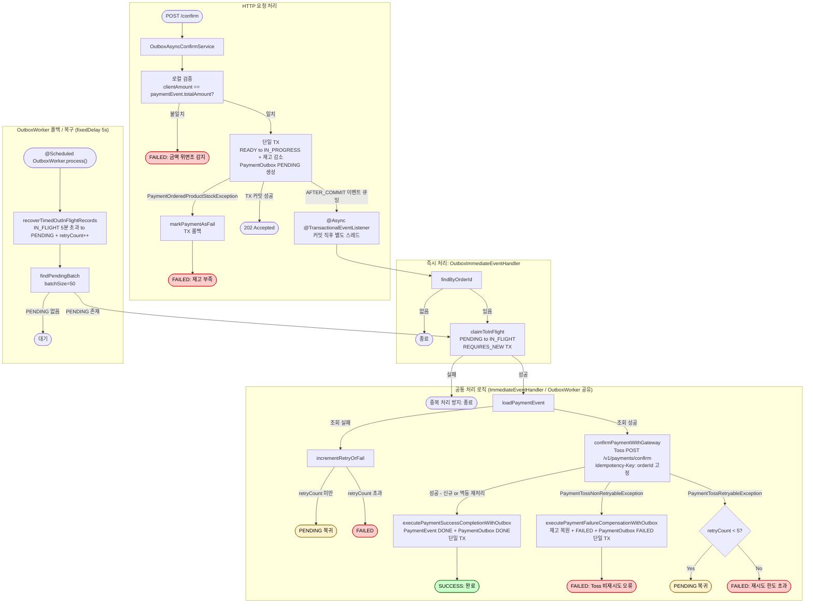

# 비동기 결제 시스템 전환 및 스케줄러 클렌징 설계

> 최종 수정: 2026-03-28 (existsByOrderId 제거, executePaymentSuccessCompletion+markDone 통합, getStatusByOrderId 제거 추가)

---

## 문제 정의

현재 시스템은 Sync가 기본 전략(`matchIfMissing=true`)이며, 다수의 스케줄러가 중복되는 목적으로 동작하고 있다. 또한 Toss confirm 멱등키가 매번 타임스탬프로 달라지는 구현 버그가 존재한다.

1. **전략 기본값 불일치**: `async-strategy: sync`가 기본값이지만 Outbox 전략을 메인 시스템으로 전환해야 함
2. **스케줄러 목적 혼재**: `PaymentScheduler`에 3개 메서드가 있으나 실제로는 전략별 관심사가 섞여 있음
   - `recoverRetryablePayment()` — UNKNOWN/stale IN_PROGRESS 재시도 (Sync 전용: UNKNOWN은 Sync에서만 발생)
   - `recoverStuckPayments()` — PaymentProcess.PROCESSING 복구 (Sync 전용: PaymentProcess는 Sync만 생성)
   - `expireOldReadyPayments()` — READY 만료 처리 (공통)
3. **`@ConditionalOnProperty` 버그**: `@Scheduled` 메서드에 `@ConditionalOnProperty`를 선언하면 Spring에서 무시됨 — 실제로는 활성화 여부에 관계없이 항상 실행
4. **불필요한 복구 코드**: Sync가 성능 테스트 전용으로 격하되면 `recoverRetryablePayment`/`recoverStuckPayments`의 복잡한 복구 로직이 불필요
5. **`generateIdempotencyKey()` 버그**: 현재 `baseKey + "_" + System.currentTimeMillis()`로 매 호출마다 다른 멱등키 생성 — Toss 멱등성 보장 불가. orderId 고정으로 변경하면 confirm 재호출 시 동일 성공 응답 반환 → 크래시 복구 경로 보장
6. **`validateCompletionStatus()` 불필요한 Toss GET 호출**: Toss confirm API 자체가 amount 검증을 포함하므로 사전 조회 불필요. Outbox 흐름에서 command를 paymentEvent 값으로 재구성하므로 로컬 검증도 자기 비교에 불과함

---

## 영향 범위

### 제거

| 파일 | 이유 |
|------|------|
| `scheduler/port/PaymentRecoverService` | 두 메서드 모두 제거되어 포트 자체가 불필요 |
| `PaymentRecoverServiceImpl` | 포트 구현체, 전체 제거 |
| `PaymentRecoveryUseCase` | `recoverStuckPayments` + `markRecovery*` 메서드 — `PaymentRecoverServiceImpl`만 사용 |
| `PaymentRetryableValidateException` | `PaymentRecoverServiceImpl`에서만 사용 |
| `PaymentScheduler.recoverRetryablePayment()` | Sync 전용, Outbox에서는 UNKNOWN 상태 미발생 |
| `PaymentScheduler.recoverStuckPayments()` | Sync 전용, PaymentProcess 기반 복구 |
| `PaymentLoadUseCase.getRetryablePaymentEvents()` | `PaymentRecoverServiceImpl`에서만 호출 |
| `PaymentCommandUseCase.increaseRetryCount()` | `PaymentRecoverServiceImpl`에서만 호출 |
| `PaymentProcessUseCase.findAllProcessingJobs()` | `PaymentRecoveryUseCase.recoverStuckPayments()`에서만 호출 |
| `PaymentEvent.isRetryable(LocalDateTime)` | `PaymentRecoverServiceImpl`에서만 호출 |
| `PaymentEvent.isRetryableInProgress()` | `isRetryable()` 내부에서만 사용 |
| `PaymentEvent.increaseRetryCount()` | `PaymentCommandUseCase.increaseRetryCount()`에서만 호출 |
| `PaymentEvent.RETRYABLE_MINUTES_FOR_IN_PROGRESS` | `getRetryablePaymentEvents()`에서만 사용 |
| `PaymentEventRepository.findDelayedInProgressOrUnknownEvents()` | `getRetryablePaymentEvents()`에서만 호출 |
| `JpaPaymentEventRepository.findByInProgressWithTimeConstraintOrUnknown()` | 위 포트 메서드의 구현 |
| `PaymentCommandUseCase.validateCompletionStatus()` | Outbox 흐름에서 완전 제거 — Toss GET 불필요(confirm API가 amount 검증 포함), 로컬 검증은 자기 비교에 불과 |
| `PaymentEvent.validateCompletionStatus()` | `PaymentCommandUseCase.validateCompletionStatus()`에서만 호출 |
| `PaymentGatewayPort.getStatus()` | `validateCompletionStatus()`에서만 호출; 제거 후 미사용 |
| `PaymentGatewayPort.getStatusByOrderId()` | 코드베이스 어디서도 호출하지 않는 미사용 메서드 |
| `PaymentStatusResult` | `getStatus()` 반환 타입; 제거 후 미사용 여부 확인 |
| `PaymentSchedulerTest` (관련 테스트) | 제거된 메서드 테스트 |
| `PaymentRecoveryUseCaseTest` | 전체 제거 |
| `PaymentRecoverServiceImplTest` | 전체 제거 |

### 변경

| 파일 | 변경 내용 |
|------|----------|
| `application.yml` | `async-strategy: sync` → `async-strategy: outbox` |
| `PaymentScheduler` | `paymentRecoverService` 필드 제거, 두 메서드 제거, `@ConditionalOnProperty` 버그 제거 (`expireOldReadyPayments`에 붙어 있는 동작하지 않는 애노테이션) |
| `TossPaymentGatewayStrategy.generateIdempotencyKey()` | `baseKey + "_" + currentTimeMillis` → `baseKey` 고정 반환 (confirm은 orderId, cancel은 paymentKey) |
| `OutboxImmediateEventHandler` | `validateCompletionStatus()` 호출 제거; `markDone/markFailed` 외부 호출 제거 — `executePaymentSuccessCompletionWithOutbox/executePaymentFailureCompensationWithOutbox`가 내부 처리 |
| `OutboxWorker` | 동일 |
| `PaymentTransactionCoordinator` | `existsByOrderId` 분기 제거 (Outbox에서 항상 false); Outbox 전용 `executePaymentSuccessCompletionWithOutbox(orderId, paymentEvent, approvedAt, outbox)` 및 `executePaymentFailureCompensationWithOutbox(orderId, paymentEvent, paymentOrderList, failureReason, outbox)` 추가; `PaymentOutboxUseCase` 의존성 추가 |
| `PaymentConfirmServiceImpl` (Sync) | `validateCompletionStatus()` 내 Toss GET 제거, 로컬 검증(클라이언트 요청값 vs DB값)만 별도 메서드로 분리하여 유지 |

### 유지

- `PaymentScheduler.expireOldReadyPayments()` — 공통 필요 (단, 비동작 `@ConditionalOnProperty` 제거)
- `OutboxWorker` — Outbox 폴백 + IN_FLIGHT 타임아웃 복구 — 그대로 유지
- `PaymentProcess` 도메인/엔티티/리포지토리 — Sync 전략(성능 테스트)에서 여전히 사용
- `PaymentProcessUseCase` — `createProcessingJob`, `completeJob`, `failJob`, `existsByOrderId` 유지
- `PaymentTransactionCoordinator` — Sync 전략에서 사용하는 메서드 유지
- `PaymentConfirmServiceImpl` — Sync 성능 테스트용 유지
- `OutboxAsyncConfirmService` — 메인 전략
- `PaymentConfirmPublisherPort` + `OutboxImmediatePublisher` — Kafka 전환을 위한 추상화 계층 유지
- `PaymentEvent.retryCount` 필드 — Admin API 응답에서 표시됨
- `PaymentEventRepository.countByRetryCountGreaterThanEqual()` — 메트릭에서 사용

---

## 결정 사항

| 항목 | 결정 | 이유 |
|------|------|------|
| 기본 전략 | `outbox` | Outbox가 메인 시스템, Sync는 성능 테스트 전용 |
| `recoverRetryablePayment` | 완전 제거 | Outbox에서 UNKNOWN 미발생; Sync는 테스트 목적이라 복구 불필요 |
| `recoverStuckPayments` | 완전 제거 | Sync 전용 PaymentProcess 복구 — 테스트 목적에 불필요 |
| `expireOldReadyPayments` | 유지 (항상 실행) | 공통 관심사. `@ConditionalOnProperty` 버그만 제거 |
| `generateIdempotencyKey` | orderId 고정 | Toss 멱등성 활성화 — confirm 재호출 시 동일 성공 응답 반환하여 크래시 복구 경로 보장 |
| `validateCompletionStatus` (Outbox) | 완전 제거 | Toss confirm API가 amount 검증 포함 — 사전 GET 조회 불필요. Outbox 흐름에서 command는 paymentEvent 값으로 구성되므로 로컬 검증도 자기 비교에 불과 |
| `validateCompletionStatus` (Sync) | Toss GET 제거, 로컬 검증만 유지 | Sync는 클라이언트 요청값 vs DB값 비교가 유의미 — 클라이언트 조작 방지. Toss GET은 confirm이 대신 검증 |
| `PaymentProcess` 유지 | 유지 | Sync 전략이 `executeStockDecreaseWithJobCreation` 등에서 사용 중 |
| `existsByOrderId` (Outbox 흐름) | 제거 | Outbox에서 PaymentProcess 미생성 → 항상 false, 불필요한 DB 조회 |
| `executePaymentSuccessCompletion + markDone` | 단일 TX로 통합 (`WithOutbox` 메서드) | 원자성 보장 + markDone 내 findByOrderId 재조회 제거 |
| Kafka 전환 구조 | `PaymentConfirmPublisherPort` 추상화 유지 | 현재 `OutboxImmediatePublisher` 구현; Kafka 전환 시 구현체만 교체 |

---

## Outbox 복구 안전성 분석

서버 장애 시나리오별 커버리지:

| 시나리오 | 현재 | 수정 후 |
|---------|------|--------|
| TX 커밋 전 서버 크래시 | TX 롤백 → READY 유지, 클라이언트 재시도 | 동일 |
| TX 커밋 후, ImmediateEventHandler 실행 전 크래시 | OutboxWorker가 PENDING 재처리 | 동일 |
| ImmediateEventHandler IN_FLIGHT 중 크래시 (Toss 호출 전) | `recoverTimedOutInFlightRecords()` → PENDING 복귀 | 동일 |
| Toss API 일시 오류 | `incrementRetryOrFail()` → PENDING 복귀 (최대 5회) | 동일 |
| **Toss confirm 성공 후 DB 저장 전 크래시** | **OutboxWorker 재처리 → confirm 재호출 → ALREADY_PROCESSED → 보상 → 불일치** ❌ | orderId 고정 멱등키 → Toss가 동일 성공 응답 반환 → 정상 완료 처리 ✅ |

---

## 개선된 비동기 결제 흐름

### 서버 장애 복구 경로 요약

| 장애 시점 | 복구 방식 |
|----------|---------|
| TX 커밋 전 크래시 | TX 롤백 → PaymentEvent READY 유지 → 클라이언트 재시도 |
| TX 커밋 후, 핸들러 실행 전 크래시 | 재시작 후 OutboxWorker가 PENDING 재처리 |
| IN_FLIGHT 중 크래시 (Toss 호출 전) | `recoverTimedOutInFlightRecords` (5분) → PENDING → OutboxWorker |
| **confirm 성공 후 DB 저장 전 크래시** ★ | IN_FLIGHT 타임아웃 → PENDING → OutboxWorker → confirm 재호출 → Toss 멱등성(orderId 고정키)으로 동일 성공 응답 → 정상 완료 |
| Toss 일시 오류 | `incrementRetryOrFail` → PENDING 복귀 (최대 5회) |

---

## 제외 범위

- **`PaymentEvent.retryCount` 필드 제거**: Admin API 응답에 표시되므로 DB 컬럼/도메인 필드 유지
- **`PaymentEventStatus.UNKNOWN` 제거**: Sync 전략이 retryable Toss 오류 시 여전히 이 상태를 기록함 (성능 테스트에서 관측 가능)
- **`PaymentScheduler` 클래스 이름 변경**: `expireOldReadyPayments()` 하나만 남아도 리네임은 별도 작업
- **Kafka 구현체 작성**: 포트 추상화만 유지하며 구현은 이번 범위 밖
- **Sync 전략 추가 변경**: Toss GET 제거 + 로컬 검증 분리 외 `PaymentConfirmServiceImpl` 내부 로직은 손대지 않음
