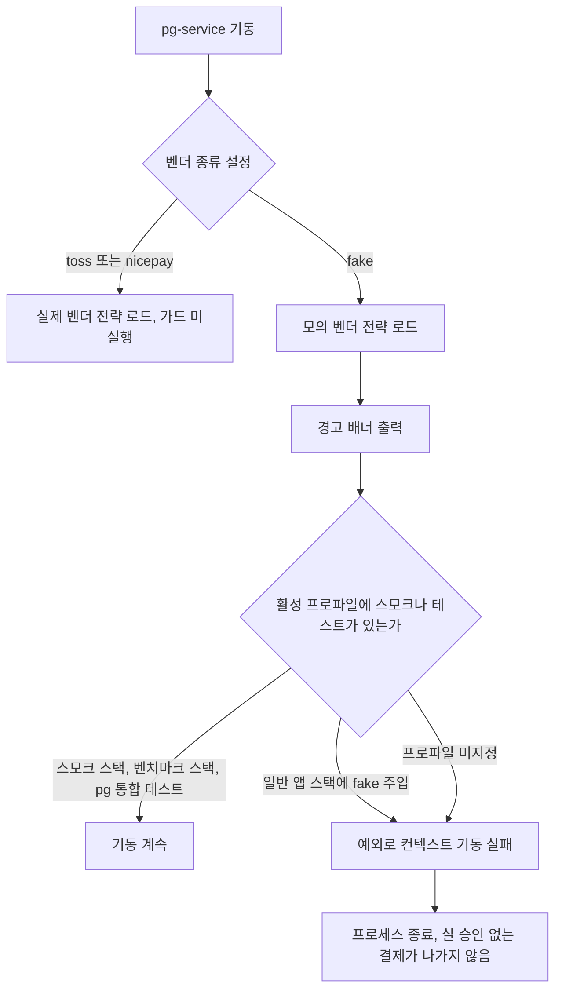
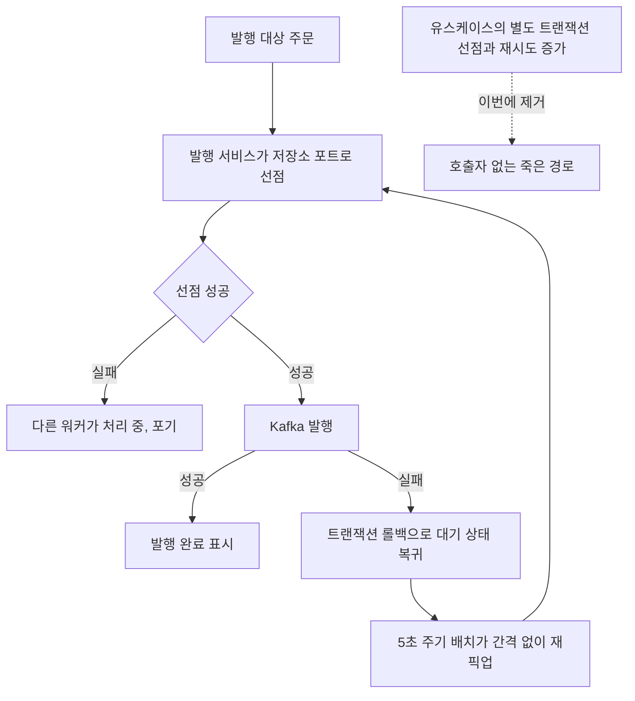

# 미해결 항목 잔여 정리 (BACKLOG-RESIDUE-CLEANUP) — 완료 브리핑

> 기간: 2026-08-04 ~ 2026-08-05 / 이슈·브랜치: #134

## 작업 요약

미해결 항목 대장의 현재 과업이 여덟 건까지 쌓여 있었다. 성격을 갈라 보니 실제로 코드를 손대야 하는 것은 셋뿐이고 나머지는 판단만 내리면 닫히는 것들이라, 한 토픽으로 묶어 일곱 건을 종결했다.

코드를 손댄 셋은 각각 다른 종류의 문제였다. 첫째, 발행 유스케이스에 별도 트랜잭션 선점(`claimToInFlight`)과 재시도 횟수 증가(`incrementRetryOrFail`) 메서드가 남아 있었는데 프로덕션 호출처가 0이었다. 코드만 읽으면 재시도 정책이 도는 것처럼 보이지만 실제 발행 실패는 간격 없이 다음 배치에서 재시도된다. 둘째, 모의 벤더가 `pg.gateway.type=fake` 로 로드될 때 경고 배너만 남기고 기동을 막지 않아, 스모크용 환경변수가 배포에 남으면 실 승인 없이 결제가 완료될 수 있었다. 셋째, 앞선 토픽에서 정적 검출을 도입하며 기준선을 0으로 맞추려고 억제 목록에 올려둔 기존 위반 여섯 건이 그대로였다.

접근은 각각 제거·차단·수정이다. 미사용 메서드는 지웠고(동작 변화 없음), 모의 벤더에는 활성 프로파일 기준 부팅 가드를 넣어 허용 조합 밖이면 컨텍스트 기동을 실패시켰으며, 억제 여섯 건은 실제로 고쳐 억제 목록의 기준선 항목을 비웠다. 판단만으로 닫히는 넷은 대장에서 정리했다.

결과적으로 대장의 현재 과업은 한 건만 남았다. 다만 ship 단계에서 사용자 질문을 계기로 새 사실이 드러났다 — 재시도 횟수를 올리는 유일한 경로인 타임아웃 회수도 실행되지 않으며, 그 때문에 `payment_outbox` 컬럼 넷과 Prometheus 지표 둘이 값이 고정된 채로 남아 있다. 이번 범위에서 처리하지 않고 TC-7 에 조건부 후속으로 등재했다.

## 핵심 설계 결정

### 미사용 선점 메서드를 어디까지 지울 것인가

유스케이스 메서드 두 개와 대응 테스트만 지우고, 저장소 포트의 동명 메서드와 재시도 정책 값 객체는 남겼다. 포트 쪽 `claimToInFlight` 는 `OutboxRelayService.relay` 가 실제로 호출하는 살아있는 선점 경로이고, `RetryPolicy` / `RetryPolicyProperties` 는 타임아웃 회수 경로가 코드상 참조한다.

**기각한 대안** — 재시도 정책 구성 전체 제거. 타임아웃 회수 경로가 그 값을 참조하고 있어 연쇄 제거가 불가능했다.

git 이력으로 유래를 확인해 제거 판단의 근거로 삼았다. 예전에는 payment 가 PG 를 직접 호출했고 긴 외부 호출을 감싸느라 선점을 별도 트랜잭션으로 먼저 커밋해야 했다. MSA 전환(`0465ed0e`)에서 PG 호출을 pg-service 로 넘기며 담당 서비스가 삭제됐고, 대체된 발행 경로는 Kafka 발행 한 번이라 선점을 같은 트랜잭션에서 처리하도록 단순해졌다. 두 메서드는 그때 호출자를 잃었다 — 미완성 회귀가 아니라 의도된 단순화의 잔재다.

### 부팅 가드를 무엇으로 판정할 것인가

활성 프로파일로 판정한다. 프로파일은 스프링이 관리하는 단일 지점이고, 실제 사용 조합을 전수 확인한 결과와도 맞는다.

**기각한 대안** — 환경변수 목록 검사. 환경변수는 어디서든 주입될 수 있어 검사 대상이 계속 늘고, 새 배포 방식이 생길 때마다 목록을 고쳐야 한다.

| 스택 | 활성 프로파일 | 벤더 종류 | 판정 |
|:---:|:---:|:---:|:---:|
| 스모크 | `docker,smoke` | `fake` 고정 | 통과 |
| 벤치마크 | `docker,smoke` | `fake` 고정 | 통과 |
| 일반 앱 | `docker` | 환경변수, 기본 `toss` | 차단 |
| pg 통합 테스트 | `test` (이번에 추가) | 테스트가 `fake` 주입 | 통과 |

### 프로파일 미지정을 허용할 것인가

허용하지 않는다. 미지정을 통과시키면 pg 통합 테스트를 안 고쳐도 되지만, 이 가드의 목적이 잘못된 배포 설정을 막는 것인데 설정이 가장 덜 갖춰진 상태를 통과시키는 자기모순이 된다. 프로파일을 빠뜨린 배포가 가장 위험한 배포다.

대신 pg 통합 테스트 네 건에 `@ActiveProfiles("test")` 를 명시했다. pg 설정에는 프로파일 조건부 블록이 없고 `application-test.yml` 도 없어 활성 프로파일 목록만 채워질 뿐 부수 효과가 없다.

### 기동을 어떻게 멈출 것인가

빈 생성 시점에 예외를 던져 애플리케이션 컨텍스트 기동을 실패시킨다. 원인이 로그에 남고 배포 파이프라인이 실패로 인지한다.

**기각한 대안** — 기동 후 헬스 체크 실패. 프로세스는 뜨므로 그사이 이미 로드된 모의 벤더가 요청을 처리할 여지가 남는다. 목표는 실 승인 없는 결제가 한 건도 나가지 않는 것이라 부족하다.

가드는 `@PostConstruct` 에 뒀다. 생성자에 두면 `new FakePgGatewayStrategy(...)` 로 객체를 만들어 승인 동작을 검증하는 기존 단위 테스트가 전부 깨진다. `@PostConstruct` 는 컨테이너가 빈을 만들 때만 호출하므로 실 기동 경로에서는 확실히 걸리면서 단위 테스트에는 걸리지 않는다.

### 가드와 테스트 수정을 한 태스크로 묶은 이유

둘을 나누면 어느 하나만 반영된 상태가 중간에 생긴다. 가드만 들어가면 pg 통합 테스트 네 건이 전부 깨지고, 프로파일만 붙으면 의미가 없다. 한 커밋으로 묶어 통합 테스트 재실행이 이 태스크의 실질 회귀 가드가 되게 했다.

## 변경 범위

| 영역 | 변경 | 의도 |
|:---:|:---:|:---:|
| payment 유스케이스 | `PaymentOutboxUseCase` 메서드 2개 + 테스트 4건 제거 | 호출자 없는 경로가 정책을 있는 것처럼 보이게 하는 오독 제거 |
| pg 벤더 전략 | `FakePgGatewayStrategy` 에 `Environment` 주입 + 프로파일 가드 | 실 환경 모의 승인 차단 |
| pg 통합 테스트 | 4건에 `@ActiveProfiles("test")` 추가 | 가드 도입으로 깨지는 것을 같은 단위에서 방지 |
| payment 조회 서비스 | 조회 실패 흡수 2곳의 try 밖 재할당 제거 + Javadoc 정정 | 스타일 위반 실제 해소 (동작 불변) |
| 테스트 4곳 | 타입 추론 키워드 2건, try 밖 재할당 1건, 빈 예외 블록 1건 수정 | 스타일 위반 실제 해소 |
| 정적 검사 설정 | `checkstyle-suppressions.xml` 기준선 억제 6건 + 설명 주석 제거 | 억제 목록을 비워 게이트 승격 전제 확보 |
| 문서 | `TODOS.md` 7건 삭제 + 섹션 라벨 폐지, `CONCERNS.md` L-1·L-18, `CONFIRM-FLOW.md`, `STACK.md` | 코드 상태와 지도 동기화, 끊어진 참조 정리 |

## 다이어그램

### 부팅 가드 판정

### 발행 재시도 경로 (변경 없음 — 죽은 가지만 제거)

## 코드 리뷰 요약

Reviewer revise (major 1 / minor 1), Domain Expert pass (findings 0).

| severity | finding | 처리 |
|:---:|:---:|:---:|
| major | `STACK.md` 140·151행이 없어진 `TODOS.md` 섹션 E 를 가리킨다. 140행의 "기존 위반은 전량 억제해 기준선이 0" 서술도 이번 수정으로 낡았고, 151행이 가리키던 게이트 승격 판단은 추적처를 잃었다 | 채택 — 정적 검출 설정 문서가 그 결정이 있을 자리라, 죽은 참조를 걷고 열린 결정을 `STACK.md` 안에 직접 남겼다 |
| minor | 테스트 스타일 정리 커밋 타입이 `feat` 인데 내용상 `refactor:` / `test:` 가 맞다 | 스킵 — 타입만 바꾸려고 커밋 4개를 재작성할 값어치가 없다 |

Domain Expert 는 "호출처 0" 전제, 부팅 가드의 허용·차단 조합, 통합 테스트 프로파일 추가의 무부작용을 소스로 대조해 확인했고 리스크 카탈로그 6축 전부 해당 없음으로 판정했다. `PgConfirmListenerSplitIntegrationTest` 의 빈 catch 를 `assertThatThrownBy` 로 바꾼 변경은 검증 약화가 아니라 강화라는 판정도 함께 받았다 — 이전 형태는 예외가 전혀 던져지지 않아도 통과할 수 있었다.

plan 게이트에서도 revise 를 한 번 받았다. 대장 정리 태스크의 완료 기준이 특정 식별자 문자열 검사만 하고 있어, 항목을 지운 뒤 본문 없는 섹션 헤더 다섯 개와 건수가 안 맞는 안내문이 남는 상태를 그대로 통과시켰다. 기준을 보강한 뒤 통과했다.

## 미결 / 후속

ship 단계에서 사용자 질문("retry 는 계속 0인가")을 계기로 확인한 사실이다. 이번 범위에서 처리하지 않고 `TODOS.md` TC-7 에 등재했다.

- `incrementRetryCount` 를 부르는 유일한 프로덕션 경로인 타임아웃 회수도 실행되지 않는다 — `relay` 가 단일 TX 안에서 PENDING → IN_FLIGHT → DONE 을 모두 처리해 IN_FLIGHT 가 커밋된 상태로 남지 않기 때문이다.
- 그 결과 `payment_outbox` 컬럼 넷(`retry_count` / `next_retry_at` / `in_flight_at` / `available_at`)과 지표 둘(`attempt_count_histogram` / `future_pending_count`)이 값이 고정된 채로 남는다.
- 정리는 "payment 쪽 발행 재시도에 백오프를 둘 것인가"(TC-7, 부하 측정 대기)가 먼저 결정돼야 한다. 지금 걷으면 측정을 기다리던 결정을 측정 없이 확정하는 셈이고, `next_retry_at` 이 살아있는 쿼리 3곳과 인덱스에 엮여 있어 결제 핵심 테이블의 파괴적 마이그레이션이 된다.

라이브 검증은 수행하지 않았다. 이번 변경은 런타임 행동이 바뀐 축(알람 규칙·컨슈머 설정·스케줄러·관리자 경로)에 해당하지 않고, 부팅 가드의 허용·차단 조합은 단위 테스트 4건과 pg 통합 테스트 캐시 없는 재실행으로 확인했다.

## 수치

- 태스크: 5개 (+ 리뷰 finding 수정 1회)
- 커밋: 8개
- 테스트: 전체 통과 (단위 1033 / 통합 payment 98 · pg 16)
- 린트: checkstyle · spotbugs 4종 위반 0
- findings: critical 0 / major 1 (해소) / minor 1 (스킵)
- 대장 현재 과업: 8건 → 1건
