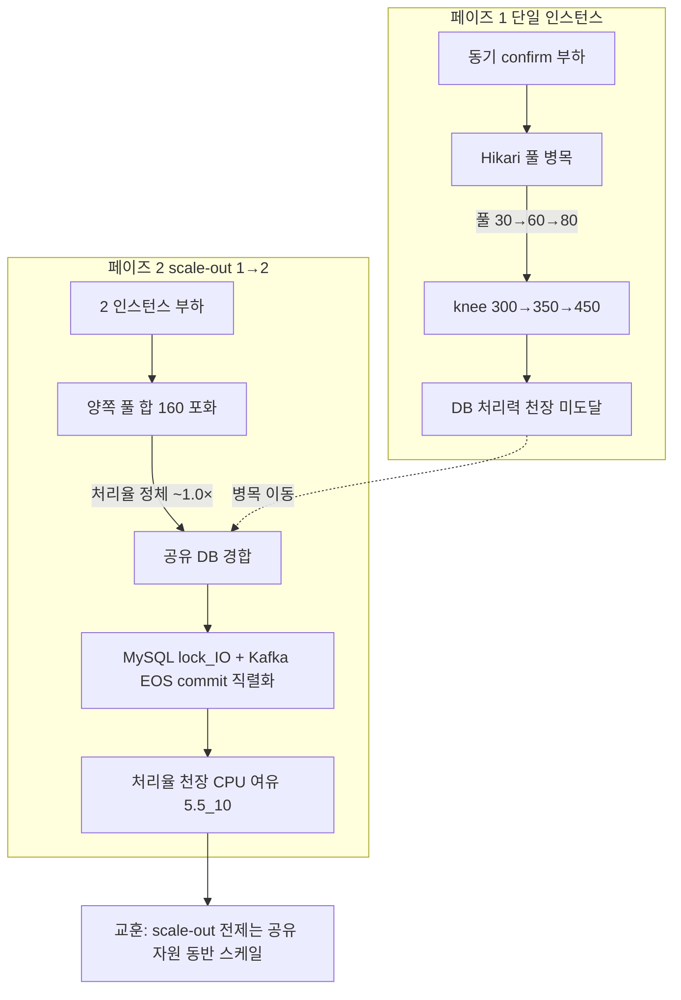

# CAPACITY-AND-SCALEOUT — 완료 브리핑

> 결제 처리량 부하 측정 2페이즈 — 단일 인스턴스 자원 병목 규명 → payment 1→2 scale-out 선형성 검증
> 이슈/브랜치: #104 / 완료: 2026-06-19 / 측정 SSOT: `CAPACITY-AND-SCALEOUT-REPORT.md`(사이클 3~7)

## 작업 요약

K6-ASYNC-BENCHMARK가 비동기 결제 경로의 흡수력을 입증한 데 이어, 이 토픽은 **"무엇이 처리량을 막는가, 그리고 인스턴스를 늘리면 그게 풀리는가"**를 정량화했다.

**페이즈 1(단일 인스턴스)**: 자원별 rate sweep으로 동기 confirm 병목이 **Hikari DB 커넥션 풀**임을 규명했다. 풀 30→60→80 상향이 knee를 300→350→450으로 계속 밀어, 풀이 지배 자원이고 DB 처리력은 로컬에서 아직 천장이 아님을 확인했다. 비동기 e2e는 75 req/s까지 완벽 흡수했고, 폴링 전략은 backoff+지터가 fixed 대비 폴링 부하 28%↓·체감 latency 27%↓로 win-win이었다.

**페이즈 2(scale-out 1→2)**: `hostname` 라인 제거로 transactional.id를 인스턴스별 고유화한 뒤 2 인스턴스를 띄웠다. 결과는 **scale-out 기각** — confirm 처리율비 ~1.0×, e2e ~1.3×로 합격 기준 1.6×에 미달했다. 양쪽 Hikari 풀(합 160)이 포화해도 처리율이 1 인스턴스와 같았고, CPU는 5.5/10 코어로 여유였다. 즉 **병목이 인스턴스-로컬 자원(풀)에서 공유 자원(MySQL lock/IO + Kafka EOS commit 직렬화)으로 이동**했다. scale-out의 전제는 앱 증설이 아니라 공유 자원(DB)의 동반 스케일이라는 것이 핵심 교훈이다.

**안전성**은 별도로 검증했다. transactional.id 고유화로 정상/rebalance 모두 fencing 없이 균등 분산(편차 0.7%)됐고, 정상 운영에선 재고 정합이 완벽(redis==RDB)했다. 의도적 id 충돌(prefix 강제)을 유발하면 ProducerFenced가 발생했는데, **충돌은 정상 배타 파티션이 아니라 rebalance overlap 순간에만** 일어났다(consumer-initiated EOS의 txn.id=prefix+group+topic+partition 구조). 충돌 시 redis<RDB 미세 갭(0.1%대)이 관측됐고, ship 리뷰에서 이 원인을 두고 2-run 실측으로 규명한 것이 이 토픽의 분석 하이라이트다(아래 코드 리뷰 요약).

## 핵심 설계 결정

- **D1 — 공유자원 설정 튜닝까지**: 자원 개수 확장(인스턴스 추가)은 후속, 우선 설정 튜닝(Hikari 풀·MySQL max_conn·Lettuce 풀)으로 병목을 식별. 갯수 확장은 페이즈 2.
- **D2 — 로컬 2 인스턴스**: N≤2(로컬 메모리 7.65GB). 절대 TPS 무의미, 상대 비교만. 기각된 대안: 클라우드 다중 인스턴스(학습 프로젝트 범위 밖).
- **D3 — hostname 제거 고유화**: `transactional.id=${app}-${HOSTNAME:local}`에서 hostname 라인 제거 → 컨테이너ID 기반 고유. 기각된 대안: `INSTANCE_ID` 환경변수 도입(불필요한 신규 변수).
- **D4 — 폴링 ON/OFF 이원 계측 + backoff+지터**: 체감(폴링 응답)·처리(payment_history DONE) 분리 계측. 폴링 자가부하를 분리하기 위함.
- **D5 — DLT `.dlq` 정합**: 측정 막는 consumer 블로킹 버그(CONCERNS C-12) 선제거. destinationResolver `.dlq` 명시.
- **D6 — REPORT 연장 + USL**: K6-ASYNC-BENCHMARK-REPORT 형식 연장. USL 회귀로 scale-out 한계 정량화(N≤2 한계는 정직히 기록).

## 변경 범위

- **측정 인프라**: `docker-compose.benchmark.yml`(payment ports `"8080:8080"`→`"8080"` 동적 할당으로 scale=2 충돌 회피, MySQL max_conn/Lettuce 풀 튜닝 env), `docker-compose.apps.yml`(payment `hostname` 라인 제거 — D3).
- **측정 스크립트**: `scripts/k6/{async-payment.js, helpers.js, sweep.sh, run-benchmark.sh, verify-settlement.sh}`(confirm·폴링 시각 계측, backoff 전략, settle 자동 추종, 재고 정합 교차검증), `scripts/bench-seed-stock.sh`, `scripts/usl-fit.py`+`usl-data/*.csv`(USL 피팅 도구, 순수 Python).
- **프로덕션 코드**: `KafkaErrorHandlerConfig`(DLT `.dlq` 고정 destination resolver — Task 1) + `KafkaErrorHandlerConfigTest`. 측정 인프라 외 유일한 로직 변경.
- **문서**: `CAPACITY-AND-SCALEOUT-REPORT.md`(측정 SSOT 사이클 3~7 + 종합 결론), `-RESEARCH.md`(USL·Kafka EOS·HikariCP·가상스레드 서칭), topic·PLAN. CONCERNS C-12 해소·TODOS T4-E 등재.

## 다이어그램 — 병목의 이동

## 코드 리뷰 요약

- **major (domain-expert)** — 재고 미세 갭 원인 오귀속. 측정 중 "abort 보상 INCR 누락"으로 적었고, domain-expert는 "reconciler L7 cascade(PITFALLS §18)"를 제시했다. **ship 단계에서 reconciler 30s vs 600s 2-run 실측으로 둘 다 반증**: 양쪽 `READY 복원`(reconciler reset) 로그 0건 + 갭이 reconciler timeout 무관하게 5~6 → cascade 아님. 갭 ≈ IN_PROGRESS 수(실험 B: 갭 6 = IN_PROGRESS 6)로, 실제 원인은 **fencing이 stock-committed(RDB 차감) EOS를 abort시켜 재배달 대기 중인 IN_PROGRESS in-flight 비대칭**(redis DECR은 `OutboxAsyncConfirmService` 선점·RDB 차감은 `handleApproved` stock-committed — 다른 단계). 리뷰가 측정 결론의 정확성을 크게 높인 사례.
- **minor 6건 전부 반영** — 멱등 흡수 실측(dedupe row=DONE), 안전성 양분 서술(정상=정합 완벽/충돌=in-flight 미세 갭), 실험 A/B 라벨 매핑, "abort 재배달 대기" 표현, 영구성 코드 경로 명시, 용어 통일, 표 헤더 trailing space 제거.
- 1차 reviewer **pass** / domain-expert **revise** → 2차 **둘 다 pass**.

## 수치

- **태스크**: 10 (준비 T1~4 / 페이즈 1 T5~6 / 페이즈 2 T7~10)
- **측정 사이클**: REPORT 사이클 3~7 (Hikari 풀 / 비동기 e2e·폴링 / baseline·fencing / scale-out / USL)
- **테스트**: 전체 BUILD SUCCESSFUL, 회귀 0 (코드 변경은 DLT resolver만, `KafkaErrorHandlerConfigTest` 가드)
- **findings**: critical 0 / major 1(해소) / minor 8(2라운드 누적, 전부 반영)
- **scale-out 결과**: confirm 1.0× / e2e 1.3× (합격 1.6× 미달, 기각) · 정합·무결성 ✅
