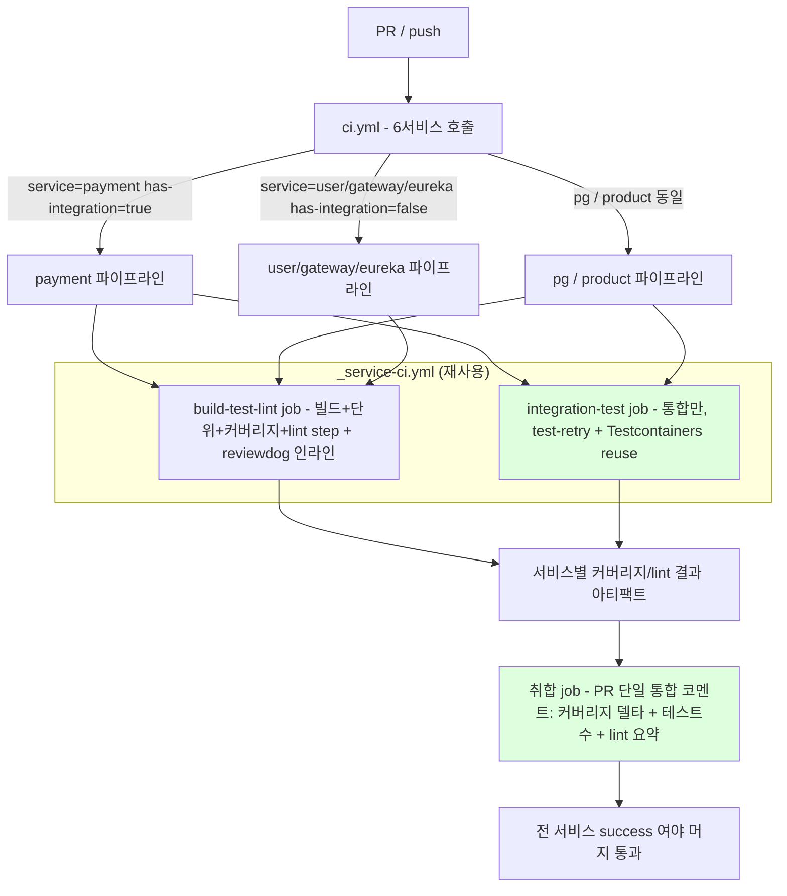

# CI-PIPELINE-REDESIGN

> CI 파이프라인을 서비스별 fan-out 구조로 재설계 + 빌드·게이트 위생 4건 흡수.
> 근거: 사용자 요청(멀티서비스 CI 차용·발전) + `docs/context/TODOS.md` [CLEANUP-BATCH-B 후속] / [FLYWAY-USER-SEED-GAP].
> Round 0 ledger: `docs/rounds/ci-pipeline-redesign/discuss-interview-0.md` (RESOLVED 20 / Path 4 잔여 2건 — 본 라운드에서 측정·확인 완료).

---

## 요약 브리핑

### 결정된 접근

단일 2-job CI를 **매 PR 6서비스 각각 독립 파이프라인으로 fan-out**하는 구조로 재설계한다. 서비스 1개 파이프라인을 재사용 워크플로우(`_service-ci.yml`)로 추출해 6번 호출하면 GitHub Actions UI에 서비스별 독립 막대로 뜨고, 서비스마다 빌드·단위·커버리지·lint를 한 막대로, 느린 통합테스트만 별도 막대로 분리한다. 통합테스트에는 flaky 자동 재시도(test-retry)와 Testcontainers 재사용을 건다. 6서비스 결과는 PR 단일 통합 코멘트(커버리지 델타 + 테스트수 + lint 요약)로 모으고 reviewdog 인라인은 서비스별로 유지한다(Discord 알림 제거). 변경 감지는 채택하지 않고 매번 전수 수행한다. 이 재설계 과정에 빌드·게이트 위생 4건(액션 Node 24 상향, Groovy `=` 문법, 커버리지 게이트 실측 상향, user Flyway seed 차단 테스트)을 흡수한다.

### 변경 후 동작 (to-be)



### 핵심 결정 ID

- **D1** fan-out = 재사용 워크플로우 `_service-ci.yml`(입력 `service`/`has-integration`), matrix 기각
- **D2** 서비스당 1 job(빌드+단위+커버리지+lint) + 통합테스트만 별도 job, `build -x integrationTest` 강제, 통합 없는 서비스는 통합 job 생략
- **D3** test-retry는 통합테스트 한정 + Testcontainers reuse + setup-gradle 기본 캐싱(build cache 기각). `maxFailures` 구체값 plan 확정
- **D4** jacoco-report 내장 base 비교 + 단일 통합 코멘트(lint 요약 포함, 서비스별 난립 금지 O4), reviewdog 인라인 유지, Discord 제거
- **D5** 액션 8종 Node 24 최신(checkout v6 / setup-java v5 / upload-artifact v7 / gradle-actions v6 / junit-report v6 / jacoco-report v1.8 / github-script v9 / reviewdog-setup v1.5)
- **D6** Groovy `exceptionFormat "full"` → `= 'full'` 4곳
- **D7** 커버리지 게이트 실측 상향 — payment 0.90 / pg 0.93 / product 0.43, user는 `UserQueryUseCase` 테스트 신규 작성 후 상향, gateway/eureka 0.0 유지(측정 라인 0)
- **D8** user `FlywayDockerProfileTest` 신규(product 동형, seed 차단 회귀 가드) → user has-integration true 전환

### 알려진 트레이드오프 / 후속

- **매 PR 전수 수행** — 6서비스 matrix 병렬 + Gradle 의존 캐시로 벽시계 시간은 1서비스 수준에 수렴. 변경 감지 미채택(결정성·머지게이트 단순성).
- **액션 메이저 bump**(checkout v4→v6, upload-artifact v4→v7, setup-gradle v3→v6, github-script v7→v9) breaking은 PR 자체 실행으로 실증(§4).
- **D4 양립성**(jacoco 내장 비교 vs 단일 코멘트) — 액션이 서비스별 코멘트를 달면 O4 위반이므로, 성립 안 하면 단일 코멘트 우선. plan 확정.
- **Testcontainers reuse 한계** — ephemeral runner라 job 간(서비스 간) 재사용 효과 없음, 같은 job 내 다중 테스트 클래스에만 효과.
- **gateway/eureka 0.0 유지** — 측정 대상 클래스 0(라우팅/디스커버리 전용). 향후 로직 추가 시 게이트 재검토.

---

## §1 배경 / 문제

### as-is

현재 `.github/workflows/ci.yml` 은 단일 워크플로우의 두 job 으로 6서비스를 한 덩어리로 처리한다.

- `Test & Coverage`: 루트 `./gradlew test jacocoTestReport` 1회 → 6서비스 단위 테스트 + JaCoCo + JUnit 리포트 + Madrapps `jacoco-report` PR 코멘트(6서비스 XML 일괄).
- `Lint`: 루트 `./gradlew checkstyleMain checkstyleTest --continue` + `spotbugsMain --continue` → reviewdog 인라인(서비스별 루프) + `lint-summary.js` 요약 코멘트 + lint gate.

### 문제

1. **서비스 격리 부재** — GitHub Actions UI 막대가 2개뿐이라 어느 서비스가 깨졌는지 막대 레벨에서 안 보인다. 한 서비스의 컴파일 실패가 전 서비스 테스트 실행을 한 job 안에서 순차로 묶는다.
2. **단계 격리 부재** — 느린 통합 테스트(Testcontainers cold-start)와 빠른 단위/lint 가 같은 신호에 섞인다. 통합 flaky 가 단위 결과를 오염시킨다.
3. **flaky 자동 방어 부재** — `org.gradle.test-retry` 플러그인이 없어 통합 cold-start flaky 가 그대로 빨간 막대가 된다.
4. **위생 잔여 4건**:
   - **(a) 액션 Node 20 EOL** — 사용 액션 8종이 Node 20 런타임. GitHub 이 Node 20 actions runtime 을 단계 폐기 중이라 강제 마이그레이션 대상.
   - **(b) Groovy deprecated 문법** — `exceptionFormat "full"` (space-call) 4곳. Gradle 9 에서 setter space-call 경고.
   - **(c) 커버리지 게이트 실효성** — user/gateway/eureka 0.0(루트 기본), product 0.40 으로 실측 대비 과도하게 느슨. 회귀를 못 막는다.
   - **(d) user Flyway seed 차단 무방어** — product 는 `FlywayDockerProfileTest` 로 docker profile seed 차단을 회귀 방어하지만 user 는 동일 패턴(`application-docker.yml: locations: classpath:db/schema`)인데 테스트가 없다.

### 이번 작업의 범위 결정

매 PR 마다 6서비스를 각각 독립 파이프라인으로 fan-out 하면서 위생 4건을 그 과정에 흡수한다. **변경 감지(paths-filter)는 채택하지 않는다** — 6서비스가 공통 모듈·project 의존 0 으로 완전 독립이고, 공통 영향원(루트 `build.gradle`/`settings.gradle`/`gradle/` wrapper/`.github`) 변경이 전 서비스에 영향을 주므로, 결정성·머지게이트 단순성을 위해 전수 수행을 택한다.

---

## §2 설계 결정

### D1 — fan-out 메커니즘 = 재사용 워크플로우 (`_service-ci.yml`)

- **결정**: 서비스 1개 파이프라인을 `workflow_call` 재사용 워크플로우 `_service-ci.yml` 로 추출하고, `ci.yml` 이 6서비스를 각각 입력 파라미터로 호출한다(`strategy.matrix.service` 미채택).
- **입력 파라미터(추정 형태)**:
  - `service` — Gradle 모듈명(`payment-service` 등). reviewdog/JaCoCo 경로 prefix 와 `:<svc>:` task 지정에 사용.
  - `has-integration` (boolean) — 통합 job 생성 여부 분기. payment/pg/product=true, user/gateway/eureka=false.
- **근거**: 서비스별 차이(통합 유무, 커버리지 minimum, 결과 막대 라벨)를 입력으로 명시적으로 표현할 수 있고, 워크플로우 내부에서 job 을 자유롭게 쪼갤 수 있다(D2 와 정합). reusable workflow 는 한 호출이 곧 한 "checks" 그룹이라 6서비스 독립 막대로 자연 렌더된다.
- **기각: `strategy.matrix.service`** — 코드는 최소지만 (1) matrix job 내부에서 통합/단위를 별도 job 으로 쪼개기 어렵고(matrix 는 단일 job 템플릿), (2) `has-integration` 같은 조건부 job 생략을 `if` 로 흩뿌려야 해 가독성이 떨어진다. **삭제·교체 비용 관점**: 향후 서비스 추가/제거 시 reusable 은 호출 1줄 추가/삭제로 끝나고, 서비스별 특수 처리가 필요해질 때 입력 1개 추가로 흡수된다 — matrix 는 특수 분기가 늘수록 `if` 조건이 누적된다.

### D2 — 단계 분리 = 서비스당 1 job(빌드+단위+커버리지+lint) + 통합테스트만 별도 job

- **결정**: `_service-ci.yml` 내부를 두 job 으로 구성한다.
  - **`build-test-lint` job (항상)**: checkout → JDK 21 → setup-gradle → `:<svc>:build -x integrationTest`(컴파일+단위+JaCoCo+checkstyle+spotbugs) → reviewdog 인라인 → JaCoCo 델타 코멘트용 결과 업로드 → lint gate.
  - **`integration-test` job (`has-integration == true` 일 때만)**: checkout → JDK 21 → setup-gradle → `:<svc>:integrationTest`(test-retry + Testcontainers reuse).
- **근거**: 느린 통합 실패와 빠른 단위/lint 실패를 막대 레벨에서 분리한다. 통합 task 없는 user/gateway/eureka 는 통합 막대를 아예 생성하지 않아 UI 노이즈가 없다. 빌드·단위·커버리지·lint 를 한 job step 으로 묶는 이유: 이들은 같은 컴파일 산출물을 공유하므로 job 분리 시 컴파일을 중복 수행(또는 산출물 아티팩트 왕복)하게 되어 비용 대비 이득이 없다.
- **주의(트레이드오프 추적 대상)**: `build` task 는 기본적으로 `check` → `integrationTest` 까지 끌고 오므로(`check.dependsOn integrationTest`), `build-test-lint` job 에서는 반드시 `-x integrationTest` 로 통합을 제외해야 두 job 의 책임이 겹치지 않는다. 이 제외가 누락되면 단위 job 이 통합까지 돌려 D2 의 분리 의도가 깨진다 — plan/execute 단계 강제 확인 항목.
- **기각: 빌드/단위/커버리지/lint 를 4 job 으로 추가 분할** — 막대 수만 늘고 컴파일 중복 비용이 커진다. 사용자 확정(S5): "서비스당 1막대 + 통합만 별도".

### D3 — 속도·안정 (C축): 통합 한정 test-retry + Testcontainers reuse + 기본 캐싱

- **결정**:
  - **test-retry**: `org.gradle.test-retry` 플러그인을 도입하되 **`integrationTest` task 에만** retry 설정. 단위 `test` task 에는 미적용. **구체값(`maxRetries`·`maxFailures` 가드)은 plan 에서 확정**(예: `maxRetries=2`, `maxFailures=N` — 다발 실패 시 retry 가 결함을 가리지 않도록 상한). 여기서는 "통합 한정 + maxFailures 가드 존재"만 결정.
  - **Testcontainers reuse**: `testcontainers.reuse.enable=true` 활성화(CI runner 환경에서 컨테이너 재사용).
  - **Gradle 캐시**: `gradle/actions/setup-gradle` 기본 의존성 캐싱만. build cache(태스크 출력 캐시) 적극 활용은 미채택.
- **근거**: cold-start flaky 이력은 통합(Testcontainers MySQL 기동 타이밍) 쪽이므로 retry 범위를 통합에 한정해 단위 테스트의 "재시도로 가려진 진짜 결함" 위험을 차단한다. build cache 미채택: 서비스 독립·매 PR 전수 구조에서 task output cache 의 적중률·정합성 검증 비용이 이득을 상회한다(setup-gradle 의존성 캐시만으로 충분).
- **검증 필요(plan)**: `testcontainers.reuse.enable` 은 ephemeral CI runner 에서 컨테이너 생존이 job 수명 내로 한정되므로 같은 job 안 다중 테스트 클래스 간 재사용에만 효과가 있다. job 간(서비스 간)은 runner 가 달라 효과 없음 — 이 한계를 plan 에서 명시.
- **기각: 전 모듈 test-retry** — 단위 테스트 flaky 를 retry 로 덮으면 결정성 신호를 잃는다. **기각: build cache 적극 활용** — 위 근거.

### D4 — PR 리포트 (D축): jacoco-report 액션 내장 base 비교 + 단일 통합 코멘트 + lint 요약 신호 재배치

- **결정**:
  - **커버리지 델타**: Madrapps `jacoco-report` 액션 내장 base 비교 기능 사용(별도 base run·캐시 보존 미채택). 각 서비스의 `build-test-lint` job 이 자기 모듈 JaCoCo XML 을 산출.
  - **단일 통합 코멘트(커버리지)**: 서비스별 결과(커버리지·델타·테스트수)를 아티팩트로 업로드 → `ci.yml` 의 취합 job 이 `actions/github-script` 로 6서비스 표를 **단일 PR 코멘트**로 조립(`update-comment` 로 갱신, 코멘트 난립 금지 — 메모리 feedback).
  - **lint 요약 신호 재배치(현행 `lint-summary.js` 후신)**: 현행 단일 lint 요약 PR 코멘트(`lint-summary.js`)는 jacoco 와 **동일 위험**(6서비스 호출 시 서비스별 코멘트 난립 → O4 위반, 또는 신호 소실)을 가지므로 같은 패턴으로 재배치한다. **lint 요약도 취합 job 단일 코멘트로 통합**(서비스별 lint 결과를 아티팩트로 업로드 → 취합 job 이 조립). **reviewdog 인라인은 서비스별 유지**(각 `build-test-lint` job 이 자기 모듈 경로만 인라인). **`spotbugs-to-rdjsonl.py`(spotbugs→reviewdog rdjsonl 변환)는 `_service-ci.yml` 내부로 이동**해 서비스별 인라인 step 에서 호출. **설계 제약**: lint 요약은 서비스별 코멘트 난립 금지(O4) — 단일 코멘트로 수렴해야 한다.
  - **커버리지 델타 + lint 요약을 하나의 통합 코멘트로 합칠지, 둘 다 단일이되 분리된 코멘트로 둘지는 plan 에서 확정**(둘 중 무엇이든 "서비스별 난립 금지"는 불변 제약).
  - **reviewdog 인라인 유지**, **Discord 알림 제거**.
- **근거**: 단일 코멘트가 PR 리뷰어의 인지 부하를 최소화한다(메모리 `feedback_pr_report_single_comment`). jacoco-report 내장 비교는 base 브랜치 커버리지 확보를 액션에 위임해 별도 base run 인프라를 없앤다.
- **검증 필요(plan/execute) — 적신호 후보**: reusable workflow 를 6번 호출하면 각 호출이 Madrapps `jacoco-report` 를 독립 실행하므로, **액션이 서비스마다 PR 코멘트를 따로 달면** 단일 코멘트 원칙(O4)과 충돌한다. 두 가지로 해소:
  - (권장) `_service-ci.yml` 안에서는 Madrapps 액션을 **코멘트 비활성(`update-comment: false` 또는 코멘트 미사용) + 커버리지 수치만 산출/업로드** 로 쓰고, 단일 코멘트 조립은 취합 job 의 github-script 가 전담.
  - 또는 Madrapps 액션을 서비스별로 쓰지 않고 취합 job 에서 6 XML 을 한 번에 넘겨 1코멘트(현행 ci.yml 방식)로 유지.
  - 액션 내장 base 비교를 살리면서 단일 코멘트를 지키는 조합이 성립하는지 plan 에서 확정한다. **성립 안 하면 "내장 비교 vs 단일 코멘트" 중 단일 코멘트 우선**(사용자 O4 확정이 더 강함).

### D5 — 위생 (a): 액션 Node 24 버전 일괄 상향

- **결정**: 사용 액션 8종을 Node 24 런타임 최신 메이저로 상향(아래 §3 버전 표). reviewdog/action-setup 은 composite 라 Node 런타임 무관하나 최신 정렬.
- **근거**: Node 20 runtime 폐기 대응. 메이저 bump 는 breaking change 가능성이 있어 §3 표에 주의점 명시, 실증은 §4(PR 자체 실행).

### D6 — 위생 (b): Groovy `exceptionFormat "full"` → `=` 4곳

- **결정**: `exceptionFormat "full"` 4곳을 `exceptionFormat = 'full'` 로 통일(루트 `build.gradle` test 블록 1곳 + payment/pg/product `integrationTest` 블록 각 1곳).
- **근거**: Gradle setter space-call deprecation 대응. 동작 동일, 문법만 명시 대입.

### D7 — 위생 (c): 커버리지 게이트 실측 기반 상향

- **결정**: 실측(§3 커버리지 표) 기반으로 minimum 을 현실적 안전마진(현재 측정값 - 약 2~3%p)으로 상향. **payment/pg/product 는 실측 기반 상향, user 는 `UserQueryUseCase` 단위 테스트를 신규 작성한 뒤 실측 기반 상향, gateway/eureka 는 측정 대상 클래스 0개라 0.0 유지**(아래 근거). 사용자 확정(적신호 1 RESOLVED): user 는 테스트 작성+상향, gateway/eureka 만 0.0 유지.
- **근거 / 측정 결과**:
  - payment 92.93%, pg 96.21%, product 45.65% — 모두 측정 가능 application/usecase/domain 라인이 충분.
  - **gateway / eureka**: JaCoCo 제외 필터(`config/**`, `infrastructure/**`, `*Application.class` 등) 적용 후 **측정 대상 클래스 0개**. 라우팅·디스커버리 전용 모듈이라 application/domain 로직이 없다. minimum 을 0 초과로 올리면 "측정 대상 0 → ratio NaN/0" 으로 게이트가 의미 없이 깨지거나 항상 통과한다. → **0.0 유지(불가피), 사유 명문화**.
  - **user**: 측정 대상이 `UserQueryUseCase`(3 라인)뿐, 현재 0% 커버. **본 토픽에서 `UserQueryUseCase` 단위 테스트를 신규 작성**(§3 변경 범위)하여 커버한 뒤, minimum 을 테스트 작성 후 실측값 기준 의미 있는 수치로 상향한다. 더 이상 0.0 유지가 아니다.
- **기각: gateway/eureka 까지 0 초과 상향** — 측정 라인이 0 이라 물리적으로 불가(ratio NaN/0). 이 두 모듈만 0.0 유지가 정합이며, user 는 테스트 신규 작성으로 R5("전 모듈 상향")를 충족시킨다.

### D8 — 위생 (d): user FlywayDockerProfileTest 신규

- **결정**: product `FlywayDockerProfileTest` 와 **동형** 테스트를 user-service 에 추가. `@SpringBootTest(NONE)` + `@Testcontainers` + `@Tag("integration")` + `@ActiveProfiles("docker")` 로 docker profile 의 `locations: classpath:db/schema` override 가 V2 seed(`V2__seed_user.sql`)를 차단함을 검증(flyway_schema_history V1 only + user 테이블 row count 0).
- **근거**: user 가 product 와 정확히 같은 seed 차단 패턴이고 회귀 무방어 상태. **부수 효과**: user 에 `@Tag("integration")` 테스트가 처음 생기므로 user 의 `integrationTest` task 와 Testcontainers 의존이 신규로 필요해진다 → **D1 의 `has-integration` 분기에서 user 가 false→true 로 바뀐다**. 즉 user 도 통합 job 을 갖게 된다.
- **연쇄 영향(추적 필수)**: user `build.gradle` 에 (1) `integrationTest` task + `check.dependsOn`/`mustRunAfter` 추가, (2) Testcontainers 의존(`spring-boot-testcontainers`, `testcontainers-bom`, `mysql`, `junit-jupiter`) 추가, (3) docker-java API 버전 환경변수(`DOCKER_API_VERSION=1.44`) 추가 — product/pg 동형. 이 변경이 D1 입력값(user: `has-integration=true`)과 D2(통합 job 생성)에 직접 반영된다.

---

## §3 변경 범위

### 신규: `.github/workflows/_service-ci.yml` (재사용 워크플로우 — 구조 스케치)

```yaml
name: Service CI
on:
  workflow_call:
    inputs:
      service:           { type: string, required: true }   # 예: payment-service
      has-integration:   { type: boolean, required: true }

permissions:
  contents: read
  pull-requests: write
  checks: write

jobs:
  build-test-lint:
    name: ${{ inputs.service }} · build/unit/lint
    runs-on: ubuntu-latest
    steps:
      - uses: actions/checkout@v6
      - uses: actions/setup-java@v5      # java-version 21, temurin
      - uses: gradle/actions/setup-gradle@v6
      - run: ./gradlew :${{ inputs.service }}:build -x integrationTest   # 컴파일+단위+JaCoCo+checkstyle+spotbugs
        # checkstyle/spotbugs 실패를 게이트 step 까지 미루려면 --continue + continue-on-error 패턴 유지
      - reviewdog (checkstyle/spotbugs 인라인, 해당 service 경로만)
        # spotbugs→rdjsonl 변환은 _service-ci.yml 내부로 이동한 spotbugs-to-rdjsonl.py 호출 (D4)
      - JaCoCo XML 업로드(아티팩트) — 취합 job 단일 코멘트용
      - lint 요약 결과 업로드(아티팩트) — 취합 job 단일 lint 코멘트용 (현행 lint-summary.js 후신, D4)
      - lint gate (checkstyle/spotbugs outcome 검사)
  integration-test:
    name: ${{ inputs.service }} · integration
    if: ${{ inputs.has-integration }}
    runs-on: ubuntu-latest
    steps:
      - checkout / setup-java / setup-gradle
      - run: ./gradlew :${{ inputs.service }}:integrationTest   # test-retry + TC reuse
        env: { TESTCONTAINERS_REUSE_ENABLE: "true", DOCKER_API_VERSION: "1.44" }
      - JUnit 리포트 업로드
```

### 재작성: `.github/workflows/ci.yml`

```yaml
name: CI
on:
  push: { branches: [ main ] }
  pull_request: { branches: [ main ] }
permissions: { contents: read, pull-requests: write, checks: write }
jobs:
  payment:  { uses: ./.github/workflows/_service-ci.yml, with: { service: payment-service,  has-integration: true  }, secrets: inherit }
  pg:       { uses: ./.github/workflows/_service-ci.yml, with: { service: pg-service,       has-integration: true  }, secrets: inherit }
  product:  { uses: ./.github/workflows/_service-ci.yml, with: { service: product-service,  has-integration: true  }, secrets: inherit }
  user:     { uses: ./.github/workflows/_service-ci.yml, with: { service: user-service,     has-integration: true  }, secrets: inherit }  # D8 로 true 전환
  gateway:  { uses: ./.github/workflows/_service-ci.yml, with: { service: gateway,          has-integration: false }, secrets: inherit }
  eureka:   { uses: ./.github/workflows/_service-ci.yml, with: { service: eureka-server,    has-integration: false }, secrets: inherit }

  report:   # 취합 job — 6서비스 JaCoCo + lint 요약 아티팩트 수집 → github-script 단일 PR 코멘트
    needs: [ payment, pg, product, user, gateway, eureka ]
    if: ${{ always() && github.event_name == 'pull_request' }}
    runs-on: ubuntu-latest
    steps:
      - download-artifact (6서비스 결과: JaCoCo XML + lint 요약)
      - actions/github-script@v9 → 서비스별 표(커버리지·델타·테스트수) 단일 코멘트 조립/갱신
        # lint 요약도 단일 코멘트로 통합 (현행 lint-summary.js 후신, D4) — 통합 1코멘트/분리 2단일코멘트는 plan 확정
```

> 6 호출은 fan-out 으로 병렬 스케줄되어 벽시계 시간은 가장 느린 서비스(통합 보유 payment/pg/product) 수준에 수렴. `report` job 은 `needs` + `always()` 로 일부 서비스 실패에도 리포트를 남긴다.

### lint 신호 스크립트 재배치 (D4)

현행 `ci.yml` 의 lint 관련 보조 스크립트 2종을 새 구조로 재배치한다.

| 현행 스크립트 | 역할 | 재배치 |
|---|---|---|
| `spotbugs-to-rdjsonl.py` | spotbugs XML → reviewdog rdjsonl 변환 | **`_service-ci.yml` 내부로 이동** — 서비스별 reviewdog 인라인 step 에서 자기 모듈 spotbugs 결과만 변환. reviewdog 인라인은 서비스별 유지. |
| `lint-summary.js` | 단일 lint 요약 PR 코멘트 생성 | **취합 job 으로 이동(후신)** — 서비스별 lint 요약 결과를 아티팩트로 업로드 → `report` job 이 단일 코멘트로 통합. 서비스별 코멘트 난립 금지(O4). |

> jacoco-report 코멘트(D4) 와 동일 위험 처리: 6서비스 호출 시 lint 요약이 서비스별로 난립(O4 위반)하거나 조용히 사라지지 않도록, 인라인은 서비스별·요약은 취합 단일로 분리한다.

### `build.gradle` (루트 + 서비스)

| 파일 | 변경 |
|---|---|
| 루트 `build.gradle` | (D3) `org.gradle.test-retry` 플러그인 추가 + 서비스 `integrationTest` task 에 retry 설정 wiring(통합 task 보유 서비스만). (D6) test 블록 `exceptionFormat "full"` → `= 'full'`. (D7) gateway/eureka minimum 정책은 ext 미설정(=0.0) 유지 결정 명문화 주석(측정 라인 0). |
| payment/pg/product `build.gradle` | (D6) `integrationTest` 블록 `exceptionFormat "full"` → `= 'full'`. (D7) ext `jacoco.lineCoverageMinimum` 상향(아래 표). (D3) integrationTest retry 적용. |
| user `build.gradle` | (D8) `integrationTest` task + Testcontainers 의존 + `DOCKER_API_VERSION` 신규. (D7) `UserQueryUseCase` 단위 테스트 신규 작성 후 ext `jacoco.lineCoverageMinimum` 을 실측 기반으로 상향(아래 표). |
| gateway/eureka `build.gradle` | 변경 없음(측정 라인 0, 통합 없음, minimum 0.0 유지). |

### 신규: `user-service/.../infrastructure/FlywayDockerProfileTest.java` (D8)

product 동형. `V2__seed_user.sql` 차단 검증 + user 테이블 row count 0. `src/test/resources/docker-java.properties`(api.version=1.44) 동반 필요 여부 plan 확인.

### 신규: `user-service/.../application/usecase/UserQueryUseCaseTest.java` (D7)

`UserQueryUseCase` 단위 테스트 신규 작성(Mockito, test-first). 현재 측정 대상 클래스 중 유일하게 0% 커버인 use case 를 커버해, D7 의 user minimum 상향 전제(상향할 라인 = 커버된 라인)를 마련한다. 테스트 작성 후 실측 커버리지를 기준으로 user ext `jacoco.lineCoverageMinimum` 을 의미 있는 수치로 설정한다.

### 액션 버전 표 (Path 4 — 확인 완료, 2026-06-07 GitHub API 실측)

| 액션 | 현재 | 최신 메이저 | runs.using | 비고 |
|---|---|---|---|---|
| actions/checkout | v4 | **v6** (v6.0.3) | node24 | v4→v6: 기본 fetch 동작/Node 변경. breaking 가능 — PR 실증 |
| actions/setup-java | v4 | **v5** (v5.2.0) | node24 | v5: 기본값/캐시 동작 점검 |
| actions/upload-artifact | v4 | **v7** (v7.0.1) | node24 | v4→v7: artifact 백엔드 변경 이력. 동명 artifact 업로드 충돌 정책 점검 |
| gradle/actions/setup-gradle | v3 | **v6** (v6.1.0) | node24 | v3→v6: 메이저 다단계. 캐시 키/입력 호환 점검 |
| mikepenz/action-junit-report | v4 | **v6** (v6.4.1) | node24 | 입력 파라미터 호환 점검 |
| Madrapps/jacoco-report | v1.7.2 | **v1.8.0** | node24 | base 비교/단일 코멘트 동작은 D4 검증 항목 |
| reviewdog/action-setup | v1 | **v1.5.0** | composite | Node 런타임 무관(composite) |
| actions/github-script | v7 | **v9** (v9.0.0) | node24 | v7→v9: 메이저 2단계. script 컨텍스트 API 호환 점검 |

> 전 액션 Node 24 런타임 확인 완료(reviewdog 는 composite 라 해당 없음). 메이저 bump 의 breaking change 는 §4(PR 자체 실행)로 실증한다.

### 커버리지 실측 + 게이트 제안 (Path 4 — 측정 완료)

측정: `./gradlew jacocoTestReport`(integrationTest.exec 합산 포함, payment/pg/product). LINE counter, BUNDLE 합산, 현행 제외 필터 적용.

| 서비스 | 측정 LINE 커버리지 | 측정 라인(covered/total) | 현재 minimum | 제안 minimum | 비고 |
|---|---|---|---|---|---|
| payment-service | **92.93%** | 552/594 | 0.89 | **0.90** | 안전마진 ~3%p. 현행 0.89 보다 약상향 |
| pg-service | **96.21%** | 559/581 | 0.91 | **0.93** | 현행 0.91 과 실측 96.2% 사이 갭 큼. 0.93 으로 상향(마진 ~3%p) |
| product-service | **45.65%** | 21/46 | 0.40 | **0.43** | 측정 라인 자체가 적음(46). 마진 보수적 |
| user-service | **0.00% → 테스트 후 재측정** | 0/3 → 테스트 후 covered 증가 | 0.0 | **테스트 작성 후 실측 기반 상향** | `UserQueryUseCase` 단위 테스트 신규 작성(D7). 작성 후 jacocoTestReport 재측정값 - 안전마진으로 minimum 확정 |
| gateway | 측정 대상 0 | 0/0 | 0.0 | **0.0 유지(불가피)** | 제외 필터 후 측정 클래스 0개(라우팅 전용). 상향 물리적 불가 |
| eureka-server | 측정 대상 0 | 0/0 | 0.0 | **0.0 유지(불가피)** | 동상. 디스커버리 전용 |

> **R5("전 모듈 상향") 와의 갭 — 해소(적신호 1 RESOLVED)**: gateway/eureka 는 측정 라인 0 으로 상향 불가(0.0 유지 명문화). user 는 `UserQueryUseCase` 단위 테스트를 신규 작성해 커버한 뒤 실측 기반 상향한다(사용자 확정). 따라서 상향 가능 모듈 = payment/pg/product/user, 0.0 유지 모듈 = gateway/eureka.

---

## §4 검증 전략

1. **CI 자체는 PR 에서 실증** — 재설계된 `ci.yml` + `_service-ci.yml` 의 정상 동작(6서비스 독립 막대, 통합 job 분기, 단일 코멘트, 액션 메이저 bump breaking 부재)은 본 작업 PR 의 Actions 실행으로 직접 확인한다. `act` 로컬 실행은 reusable workflow + secrets + Testcontainers 의존성으로 충실도가 낮아 미채택.
2. **로컬 회귀** — 각 build.gradle/테스트 변경은 `./gradlew test`(단위) + 통합 보유 서비스 `:<svc>:integrationTest` 로 회귀 없음 확인. D7 게이트 상향은 `./gradlew :<svc>:jacocoTestCoverageVerification` 로 통과 확인(상향 후에도 green 이어야 함).
3. **D6 동작 동일성** — Groovy 문법 변경은 출력 동일성만(테스트 결과 포맷 변화 없음).
4. **D8 신규 테스트** — user `FlywayDockerProfileTest` 가 RED(현재 무방어)→GREEN(seed 차단 검증) 순으로 작성(test-first).
5. **verify 단계** — 6서비스 전부 green + 위생 4건 반영 + PR 단일 코멘트 렌더 확인.

---

## §5 트레이드오프 / 후속

### 트레이드오프

- **매 PR 전체 수행 시간** — 변경 감지 미채택으로 항상 6서비스 수행. fan-out 병렬로 벽시계는 최저(통합 보유 서비스 수준)이나 runner 분(minutes) 사용량은 증가. 결정성·머지게이트 단순성과의 교환으로 수용(R1).
- **재사용 워크플로우 분리 비용** — `_service-ci.yml` 추출로 ci.yml 이 얇아지지만 디버깅 시 두 파일을 오가야 한다. 단일 워크플로우 대비 간접화 1단계. **삭제·교체 비용 이득**: 서비스 추가/제거가 호출 1줄, 단계 변경이 한 곳(`_service-ci.yml`)에 국소화 — 6곳 중복 편집 대비 우위.
- **test-retry 통합 한정** — 통합 flaky 는 자동 흡수하나 단위 flaky 는 그대로 노출(의도). 단위 결정성 우선.
- **Testcontainers reuse 의 CI 한계** — ephemeral runner 에서 job 내 다중 테스트 클래스 간만 효과. job/서비스 간 재사용 없음.

### 후속 / 적신호

- **[적신호 1 — RESOLVED(사용자 확정)] user 커버리지 게이트 상향**: R5("전 모듈 상향")와의 충돌을 다음으로 확정. user 는 `UserQueryUseCase` 단위 테스트를 본 토픽에서 신규 작성해 커버한 뒤 minimum 을 실측 기반으로 상향(위 (A) 안 채택). gateway/eureka 는 측정 대상 클래스 0개로 상향이 물리적으로 불가하므로 0.0 유지(불가피, 사유 명문화). → D7 / §3 변경 범위 / 커버리지 표에 반영 완료.
- **[적신호 — plan 확인] D4 단일 코멘트 vs jacoco-report 내장 base 비교 양립성**: reusable 6 호출이 Madrapps 액션을 6번 실행할 때 코멘트 난립 없이 단일 코멘트 + base 델타를 동시 만족하는 조합이 성립하는지 plan/execute 에서 확정. 양립 불가 시 단일 코멘트(O4) 우선.
- **[plan 확인] `build -x integrationTest` 제외 정합** — `check.dependsOn integrationTest` 때문에 단위 job 이 통합을 끌어오지 않도록 제외 강제(D2 주의).
- **gateway/eureka 의 lint/build job** — 측정 라인 0 이어도 checkstyle/spotbugs/컴파일은 유효하므로 `build-test-lint` job 은 그대로 생성(통합 job 만 생략).

---

## 비범위 (non-goals)

- **변경 감지(paths-filter) 기반 선택 실행** — R1 로 명시 기각. 매 PR 전수.
- **build cache(태스크 출력 캐시) 적극 활용** — D3 기각. 의존성 캐시만.
- **전 모듈 test-retry** — D3 기각. 통합 한정.
- **Discord/외부 알림** — R3 제거.
- **gateway/eureka 의 커버리지 게이트 강제 상향** — 측정 대상 클래스 0개로 0.0 유지(D7, 적신호 1 RESOLVED). user 는 범위 내(테스트 작성+상향)로 전환됨.
- **CircuitBreaker·HTTP 회복성 등 런타임 도메인 변경** — 본 토픽은 CI/빌드 인프라 한정, 결제 도메인 리스크 ≈ 0.
- **k6/벤치 파이프라인 통합** — 별도 토픽(PHASE-4).
