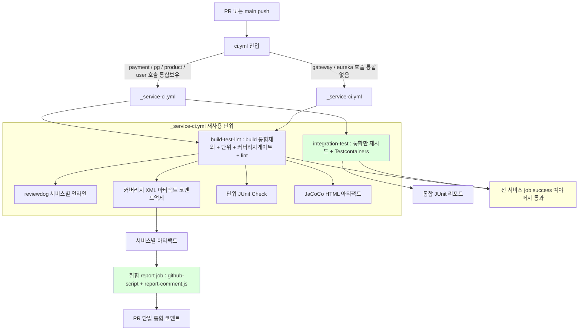
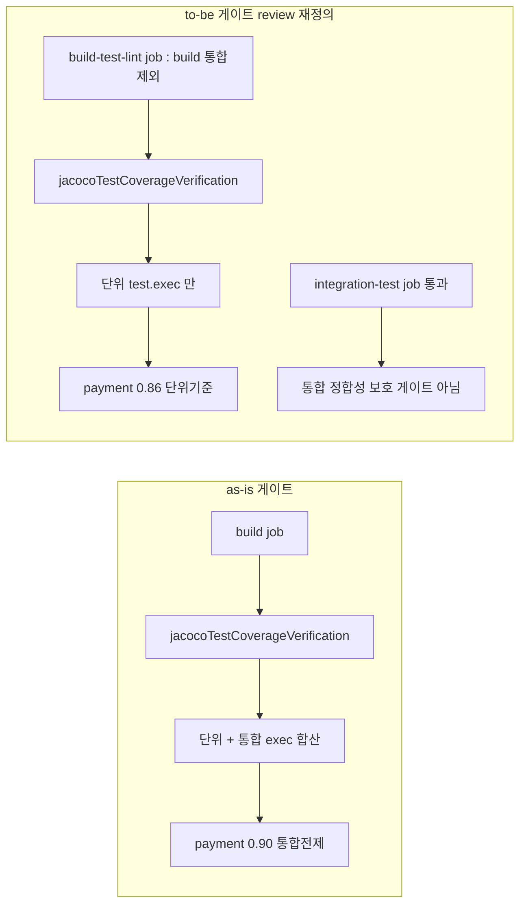

# CI-PIPELINE-REDESIGN 완료 브리핑

> 이슈/브랜치 #91 · 2026-06-08 · 7태스크(T1~T7)

---

## 작업 요약

기존 CI(`.github/workflows/ci.yml`)는 단일 워크플로우의 두 job(`Test & Coverage` / `Lint`)으로 6서비스를 한 덩어리로 처리했다. 이 구조에는 세 가지 문제가 있었다. (1) GitHub Actions UI 막대가 2개뿐이라 어느 서비스가 깨졌는지 막대 레벨에서 안 보이고, 한 서비스의 컴파일 실패가 전 서비스 테스트를 한 job 안에서 순차로 묶었다. (2) 느린 통합 테스트(Testcontainers cold-start)와 빠른 단위/lint가 같은 신호에 섞여 통합 flaky가 단위 결과를 오염시켰다. (3) `org.gradle.test-retry` 플러그인이 없어 통합 cold-start flaky가 그대로 빨간 막대가 됐다. 여기에 빌드·게이트 위생 잔여 4건(액션 Node 20 EOL, Groovy deprecated 문법, 커버리지 게이트 실효성, user Flyway seed 차단 무방어)이 누적돼 있었다.

접근은 **매 PR마다 6서비스를 각각 독립 파이프라인으로 fan-out**하면서 위생 4건을 그 과정에 흡수하는 것이다. 서비스 1개 파이프라인을 재사용 워크플로우(`_service-ci.yml`)로 추출해 `ci.yml`이 6번 호출하면 GitHub Actions UI에 서비스별 독립 막대로 뜬다. 서비스마다 빌드·단위·커버리지·lint를 한 막대(`build-test-lint` job)로, 느린 통합테스트만 별도 막대(`integration-test` job)로 분리하고, 통합에는 자동 재시도(test-retry)와 Testcontainers 재사용을 건다. 6서비스 결과는 취합 `report` job이 PR 단일 통합 코멘트로 모으고 reviewdog 인라인은 서비스별로 유지한다. 변경 감지(paths-filter)는 채택하지 않고 매번 전수 수행한다(결정성·머지게이트 단순성).

결과적으로 7태스크로 분해해 단위 341 + 통합 48 테스트 PASS, 린트 위반 0, 4서비스 커버리지 게이트 green으로 완료했다. **review 단계에서 가장 중요한 발견**은 커버리지 게이트가 통합 exec 합산을 전제로 산정됐는데 새 CI 구조가 build job에서 통합을 제외해(`-x integrationTest`) payment 게이트가 영구 실패하는 구조적 함정이었고, 이를 **게이트를 단위 커버리지 기준으로 재정의**(통합 정합성은 `integration-test` job 통과로 보호)하여 해소했다.

---

## 핵심 설계 결정

### D1 — fan-out = 재사용 워크플로우 `_service-ci.yml`
- **결정**: 서비스 1개 파이프라인을 `workflow_call` 재사용 워크플로우로 추출하고 `ci.yml`이 6서비스를 각각 입력 파라미터(`service`, `has-integration`)로 호출.
- **근거**: reusable workflow 한 호출 = 한 "checks" 그룹이라 6서비스 독립 막대로 자연 렌더. 서비스 추가/제거가 호출 1줄, 단계 변경이 한 곳(`_service-ci.yml`)에 국소화.
- **기각: `strategy.matrix.service`** — matrix는 단일 job 템플릿이라 통합/단위를 별도 job으로 쪼개기 어렵고, `has-integration` 조건부 job 생략을 `if`로 흩뿌려야 해 가독성이 떨어진다.

### D2 — 서비스당 1 job(빌드+단위+커버리지+lint) + 통합테스트만 별도 job
- **결정**: `build-test-lint` job(항상)은 `./gradlew :<svc>:build -x integrationTest`, `integration-test` job(`has-integration == true`만)은 `:<svc>:integrationTest`.
- **근거**: 느린 통합 실패와 빠른 단위/lint를 막대 레벨에서 분리. 빌드·단위·커버리지·lint는 같은 컴파일 산출물을 공유하므로 한 job으로 묶는다.
- **주의**: `check.dependsOn integrationTest` 때문에 build job은 반드시 `-x integrationTest`로 통합을 제외해야 분리가 유지된다(grep 검증 항목으로 강제).

### D3 — 통합 한정 test-retry + Testcontainers reuse
- **결정**: `org.gradle.test-retry` 1.6.5를 `integrationTest` task에만 적용(`maxRetries=2`, `maxFailures=3`). 단위 `test`엔 미적용. Testcontainers `reuse.enable=true` + setup-gradle 기본 캐싱.
- **근거**: cold-start flaky는 통합(Testcontainers MySQL 기동 타이밍) 쪽이므로 retry를 통합에 한정해 단위의 "재시도로 가려진 진짜 결함" 위험을 차단. `maxFailures=3`은 다발 실패(결정적 결함)는 retry가 흡수하지 못하게 하는 가드.
- **기각: 전 모듈 test-retry / build cache 적극 활용** — 단위 결정성 신호 상실 / 서비스 독립·전수 구조에서 task output cache 검증 비용이 이득 상회.

### D4 — PR 단일 통합 코멘트 + lint 신호 재배치
- **결정**: jacoco-report를 코멘트 비활성 모드(수치만 산출)로 쓰고, 취합 `report` job의 `github-script` + `report-comment.js`가 6서비스 커버리지/lint를 단일 PR 코멘트로 조립(`update-comment`로 난립 방지). reviewdog 인라인은 서비스별 유지. `lint-summary.js` 폐기, Discord 제거.
- **근거**: reusable 6 호출이 액션을 6번 실행할 때 서비스별 코멘트 난립(O4 위반)을 구조적으로 막으면서 PR 리뷰어 인지 부하를 최소화.

### D5 — 액션 8종 Node 24 최신 상향
- **결정**: checkout v6 / setup-java v5 / upload-artifact v7 / gradle setup-gradle v6 / junit-report v6 / jacoco-report v1.8 / github-script v9 / reviewdog-setup v1.5.
- **근거**: Node 20 runtime 폐기 대응. 메이저 bump breaking은 PR 자체 Actions 실행으로 실증(`act` 미채택 — reusable+secrets+Testcontainers로 충실도 낮음).

### D6 — Groovy `exceptionFormat "full"` → `= 'full'` 4곳
- Gradle setter space-call deprecation 대응. 동작 동일, 문법만 명시 대입.

### D7 — 커버리지 게이트 (★ review에서 단위 기준으로 재정의)
- **plan 초안**: 통합 합산 실측 기반 상향(payment 0.90 / pg 0.93 / product 0.43 / user 0.97). gateway/eureka는 측정 대상 클래스 0이라 0.0 유지.
- **review 발견(Domain Expert F1)**: build job이 `-x integrationTest`로 통합 exec 없이 도는데 루트 `build.gradle`이 게이트에 통합 exec 합산을 전제 → payment 단위만으로 0.89 < 0.90 → **CI 항상 BUILD FAILED**. D2(통합 분리)와 D7(통합 합산 전제)의 충돌.
- **최종 결정(사용자 선택)**: 게이트를 **단위 커버리지 기준으로 재정의**. 루트 build.gradle에서 게이트·리포트의 `integrationTest.exec` 합산 제거, payment minimum **0.90→0.86**(단위 실측 89.23% − 안전마진), pg 0.93 / product 0.43 / user 0.97 유지. 통합 경로 정합성은 게이트가 아니라 `integration-test` job 통과(pass/fail)로 보호.
- **기각: 통합 합산 유지(게이트를 integration-test job으로 이동)** — 단위 test 중복 실행 + job 구조 복잡. **기각: minimum을 단위-only로 단순 하향만** — 통합 라인 보호 의도를 명문화하지 않으면 게이트 의미 혼선.

### D8 — user FlywayDockerProfileTest + 통합 전환
- **결정**: product `FlywayDockerProfileTest` 동형 테스트를 user-service에 추가(docker profile `locations: classpath:db/schema`가 `V2__seed_user.sql` 차단 검증). `@Tag("integration")`이 처음 생기므로 `integrationTest` task + Testcontainers 의존 추가 → user `has-integration` false→true 전환.
- **근거**: user가 product와 같은 seed 차단 패턴인데 회귀 무방어 상태였다.

---

## 변경 범위

### CI 워크플로우 (`.github/workflows/`)
- **`_service-ci.yml`** (신규) — `workflow_call` 재사용 워크플로우. `build-test-lint` job(checkout v6 → setup-java v5 → setup-gradle v6 → `:<svc>:build -x integrationTest` → reviewdog 인라인 → jacoco-report 코멘트 비활성 → 커버리지 XML·lint 요약 아티팩트 업로드 → 단위 JUnit Check → JaCoCo HTML 아티팩트 → lint gate) + `integration-test` job(`if: has-integration`, `:<svc>:integrationTest` with test-retry + TC reuse → JUnit 리포트).
- **`ci.yml`** (재작성) — 6서비스를 `_service-ci.yml`로 각각 호출(user `has-integration: true`) + 취합 `report` job(`needs` 6서비스 + `always() && pull_request`, 아티팩트 다운로드 → `report-comment.js` 단일 코멘트).

### CI 스크립트 (`.github/scripts/`)
- **`report-comment.js`** (신규) — 6서비스 커버리지(JaCoCo XML report-level LINE 총계 파싱) + lint 요약 아티팩트를 단일 PR 코멘트로 조립. `update-comment` 패턴.
- **`lint-summary.js`** (삭제) — 역할을 `report-comment.js`로 이관.
- **`spotbugs-to-rdjsonl.py`** (경로 유지) — `_service-ci.yml`에서 서비스 인자로 호출.

### 빌드 (`build.gradle`)
- **루트** — `org.gradle.test-retry` 1.6.5 `apply false` 잠금. test 블록 Groovy 문법 정정. 게이트·리포트 executionData를 단위 `test.exec` 기준으로 통일(통합 exec 합산 제거).
- **payment/pg/product** — `plugins`에 test-retry apply + `integrationTest` 블록 `retry {}`. Groovy 문법 정정. 커버리지 minimum(payment 0.86 / pg 0.93 / product 0.43).
- **user** — `integrationTest` task + Testcontainers 의존(BOM + mysql + junit-jupiter) + `resolutionStrategy.eachDependency` override(product 동형) + `DOCKER_API_VERSION=1.44` + test-retry wiring. minimum 0.97.

### 테스트 (user-service)
- **`UserQueryUseCaseTest`** (신규) — `queryById` 정상조회/미존재예외 단위 테스트(Mockito). `UserQueryUseCase` 100% 커버.
- **`FlywayDockerProfileTest`** (신규) — docker profile seed 차단 회귀 가드(product 동형). MySQL Testcontainers, `user` 테이블 row 0 + flyway_schema_history V1 only 검증.
- **`docker-java.properties`** (신규) — `api.version=1.44`.

---

## 다이어그램

---

## 코드 리뷰 요약

**1라운드** — Critic fail(critical 2 / major 2 / minor 1) + Domain Expert revise(major 1):
- **[critical] coverage 아티팩트 경로 불일치** — upload-artifact v4+ 단일 파일 평탄화(`coverage-<svc>/jacocoTestReport.xml`)인데 `report-comment.js`는 중첩 경로를 읽어 전 서비스 N/A → JS 읽기 경로 평탄으로 통일(lint과 일관).
- **[critical] LINE 정규식 첫-매치 버그** — 비-global `match`가 XML 첫 카운터(클래스 단위)만 잡음 → `matchAll` global + 마지막 매치(report-level 총계)로 수정. product 0%→45.65% 검증.
- **[major×2] 현행 회귀** — 단위 JUnit Check 리포트 소실 → build-test-lint job에 `action-junit-report` step 복원. JaCoCo HTML 아티팩트 소실 → `jacoco-html-<svc>` 업로드 복원(retention 14).
- **[major] 커버리지 게이트 구조 함정(DE F1)** — build job 통합 exec 미합산으로 payment 영구 BUILD FAILED → 게이트 단위 기준 재정의(D7 참조).
- **[minor]** user 게이트 근거 코멘트 / 통합 라인 실보호 없음 인지.

**2라운드 재리뷰** — Critic·Domain Expert **둘 다 pass**(critical/major 0). 1라운드 findings 전건 해소 실측 확인. 잔존 minor: 게이트 단위화 잔재 데드코드(정리 완료) / 통합 정합성 보호가 branch protection required checks 등록에 의존(PR 인계).

---

## 수치

| 항목 | 값 |
|------|---|
| 태스크 | 7개 (T1~T7) |
| 단위 테스트 | 341 PASS |
| 통합 테스트 | 48 PASS (Docker 가용) |
| 커버리지 게이트 | 4서비스 green (payment 0.86 / pg 0.93 / product 0.43 / user 0.97) |
| 린트 위반 | 0 |
| 코드 리뷰 findings | critical 2 / major 3 / minor 4 (전건 해소, 재리뷰 pass) |
| 영구 문서 갱신 | 2개 (STACK / TESTING) |

---

## verify/운영 인계 사항

- **branch protection required checks 등록 필요** — 통합 정합성 보호가 각 서비스 `build-test-lint` + `integration-test` job의 머지 차단력에 의존한다. GitHub branch protection의 required status checks에 각 job을 등록해야 통합테스트 실패 시 머지가 실제로 차단된다(워크플로우 코드만으로는 미보장). PR 본문에 운영 전제로 명시.
- **CI 자체 실증** — 6서비스 독립 막대, 취합 단일 코멘트, 액션 메이저 bump breaking 부재는 본 PR의 GitHub Actions 실행으로 직접 확인한다.
