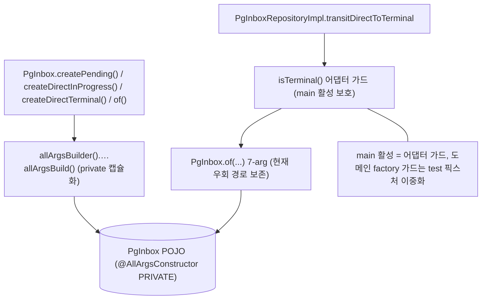
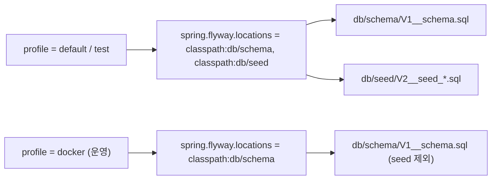
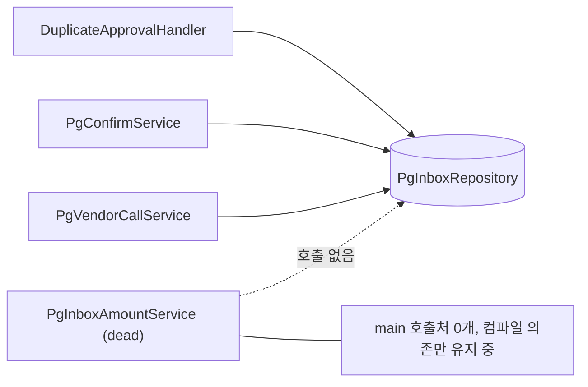
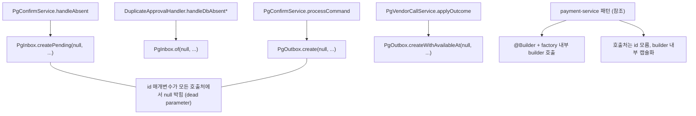
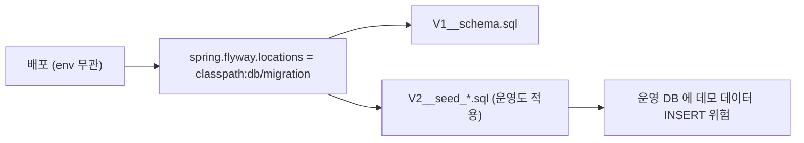

# CLEANUP-BATCH-A

> PR 묶음 A — 코드 청소 4건. TODOS.md 의 [PR A] 태그 항목 묶음.
> 직전 봉인: PG-CONFIRM-LISTENER-SPLIT (PR #74, 2026-05-09).
> 작업 일자: 2026-05-11 ~

## 요약 브리핑

### 결정된 접근

직전 PG-CONFIRM-LISTENER-SPLIT 봉인 후 누적된 청소 부채 4건을 단일 토픽 4 sub-section (§1.1~§1.4) 으로 묶어 한 PR 사이클에 처리한다. 도메인 결정 동반 없고 4 영역 cross 의존 0 — pg-service `PgInboxAmountService` dead service 제거 + pg-service `PgInbox` / `PgOutbox` 의 Lombok `@Builder` 패턴 통일 (factory only 노출, builder private) + product / user-service Flyway 의 `db/schema` + `db/seed` 디렉토리 분리 (`docker` profile 은 schema 만) + payment-service `Retryable` 예외 503 + `Retry-After: 5` 일괄 매핑. 권고 implement 순서는 §1.1 → §1.3 → §1.4 → §1.2 (영향 작은 것 → 큰 것).

### 변경 후 동작 (to-be)

#### §1.2 PgInbox / PgOutbox builder 패턴 (적용 후)



#### §1.3 Flyway profile 별 location (적용 후)



#### §1.4 Retryable 예외 응답 흐름 (적용 후)


### 핵심 결정 ID 목록 (§1 sub-section)

- §1.1 — `PgInboxAmountService` dead service 본체 + 단독 테스트 2 파일 삭제
- §1.2 — `PgInbox` / `PgOutbox` 에 `@Builder(allArgsBuilder/allArgsBuild) + @AllArgsConstructor(PRIVATE)` 적용. factory only 노출 룰 JavaDoc 강제. **main 활성 보호는 어댑터 가드 (PgInboxRepositoryImpl), 도메인 factory 가드는 test 픽스처 이중화** (D1 흡수)
- §1.3 — Flyway 디렉토리 `db/migration/` → `db/schema/` + `db/seed/` 물리 분리. `docker` profile 은 schema 만 적용. plan 단계에서 docker-compose named volume 재사용 시나리오 1회 확인 (D4 흡수)
- §1.4 — `PaymentExceptionHandler` 에 `ProductServiceRetryableException` / `UserServiceRetryableException` 핸들러 2건 추가. 503 + `Retry-After: 5` 일괄. body 는 기존 `PaymentErrorCode.PRODUCT_SERVICE_UNAVAILABLE` / `USER_SERVICE_UNAVAILABLE` 재사용

### 알려진 트레이드오프 / 후속 작업

- **429 시그널 정보 손실 (의도)** — Feign ErrorDecoder 가 429 / 503 둘 다 단일 `RetryableException` 으로 통합. 503 일괄 매핑으로 클라이언트엔 "재시도 가능" 시그널만. 429 / 503 분기 복원은 별 토픽 (TODOS.md 신규 항목 등재 — D3 흡수)
- **`Retry-After` 고정값 5초** — vendor 가 준 `Retry-After` 전파 / jitter 적용은 별 토픽
- **builder 외부 노출 룰 컴파일러 강제 불가** — JavaDoc + code review 만으로 강제. ArchUnit 별 토픽 분리
- **Flyway missing-migration 운영 가시화** — 학습자 docker-compose named volume 재사용 시 부팅 실패 가능성. STACK.md 에 3-step 대응 가이드 (volume prune / schema_history 정리 / ignore-migration-patterns) 추가 (D4 흡수)
- **plan 단계 위임** — TC-2 검증 방식 (Testcontainers `@ActiveProfiles("docker")` vs 수동 스모크) 은 plan 단계에서 비용/가치 재평가 후 확정

---

## 사전 브리핑

### 현재 이해한 문제

직전 토픽 (PG-CONFIRM-LISTENER-SPLIT) 봉인 후 누적된 짧은 청소 항목 4개를 한 묶음으로 처리. 도메인 결정 동반 없는 단순 정리 작업이지만 영역이 4갈래로 분리됨 (pg-service 도메인 / payment-service ControllerAdvice / product+user 운영 안전성).

이 묶음의 목적은 **작은 부채를 누적시키지 않고 직전 토픽 맥락 살아있을 때 청소** 하는 것. 다음 묶음 (PR B — 도메인 결정 묶음) 시작 전에 표면적을 줄인다.

### 4 항목 한눈에

| 항목 | 영역 | 변경 핵심 | 위험 |
|---|---|---|---|
| **TC-16** | pg-service application | `PgInboxAmountService` dead service 삭제 | 0 (호출처 0) |
| **TC-10** | pg-service domain | `PgInbox` / `PgOutbox` 의 static factory + null 박는 패턴 → payment-service 의 `@Builder + @AllArgsConstructor(PRIVATE)` 패턴으로 통일 | 중 (호출처 10곳, 테스트로 방어) |
| **TC-2** | product / user-service infrastructure | Flyway seed (`V2__seed_*.sql`) 가 운영 배포에도 같이 적용되는 위험 차단 (`spring.flyway.locations` 환경별 분리) | 낮음 (설정만) |
| **TC-5** | payment-service presentation | `Retryable` 예외가 500 으로 노출되는 것을 503/429 + Retry-After 헤더로 정확히 매핑 | 낮음 (ControllerAdvice) |

### 현재 시스템 동작 (as-is)

#### TC-16 — `PgInboxAmountService` 호출 그래프



#### TC-10 — pg-service 도메인 생성자 패턴 (현재)



#### TC-2 — Flyway seed 적용 경로 (현재)



#### TC-5 — Retryable 예외 응답 흐름 (현재)

```mermaid
flowchart LR
    Client["클라이언트"] --> Controller["PaymentController"]
    Controller --> UseCase["use case"]
    UseCase --> Adapter["ProductHttpAdapter / UserHttpAdapter"]
    Adapter --> Retryable["RetryableException catch"]
    Retryable --> Throw["ProductServiceRetryableException throw"]
    Throw --> Advice["GlobalExceptionHandler 매처 없음"]
    Advice --> Generic["500 Internal Server Error (실제는 503/429 상황)"]
    Generic --> Client2["클라이언트는 일시 장애 vs 영구 장애 구분 못 함"]
```



### 이번 discuss 에서 결정할 것

- 4 항목을 **단일 토픽 안 4 묶음** 으로 분해할지, 아니면 **각각 별 sub-section** 으로 갈지 (plan 단계 태스크 의존 그래프 영향)
- TC-10 의 builder 패턴 선택 — payment-service `@Builder + @AllArgsConstructor(PRIVATE)` 그대로 미러링 vs pg-service 특화 변형 (예: factory 의도 보존)
- TC-2 의 환경 분리 방식 — `spring.flyway.locations` placeholder vs profile 별 application-*.yml 분리 vs `@Profile` 어노테이션
- TC-5 의 응답 코드 정책 — `RetryableException` 일괄 503 + `Retry-After` 헤더 default 값? 또는 예외 종류별 분기 (503 vs 429)?
- 4 항목 처리 순서 — 의존 없으니 임의 가능하지만 review / verify 부담 최소화 순서 결정 (예: 영향 작은 것 먼저)

### 열린 질문 / 가정

- TC-10 의 `PgInbox` 가 PG-CONFIRM-LISTENER-SPLIT 봉인으로 PENDING / IN_PROGRESS / APPROVED / FAILED / QUARANTINED 5상태 + `createDirectInProgress` / `createDirectTerminal` 등 신규 factory 까지 추가된 상태. **builder 패턴 전환이 review m1 (보정 경로 PENDING 우회 룰) 의 명시성 손상 없이 가능한지** 검증 필요
- TC-2 의 환경 분리 — 현재 `docker-compose.yml` 이 어떤 profile 로 띄우는지 확인 필요 (dev / prod 구분 명확한지)
- TC-5 의 `Retryable` 예외 분류 — 어떤 예외가 503 (서비스 불가) 이고 어떤 게 429 (rate limit) 인지 기존 코드 인벤토리 필요
- 단일 토픽으로 묶어도 review 단계가 4 영역 가로지르면 finding 분산 가능성. **두 묶음으로 더 쪼개야 할지 (예: pg-service 묶음 vs payment+product+user 묶음) discuss Round 1 에서 architect 가 판단**

### 참고

- 직전 봉인: `docs/archive/pg-confirm-listener-split/COMPLETION-BRIEFING.md`
- TODOS 본문: `docs/context/TODOS.md` 의 `[PR A]` 태그 4 항목 (line 35~155 사이)
- 영역 분리 검증 시 참조: `docs/context/ARCHITECTURE.md` 의 hexagonal layer 룰

---

## §0 목표 / 범위 / 비범위

### 목표
직전 PG-CONFIRM-LISTENER-SPLIT 봉인으로 노출된 소규모 청소 부채 4건을 **하나의 토픽 안 4 sub-section 으로 묶어** 직전 맥락이 살아 있을 때 동시에 정리한다. 코드 표면적 축소 + 운영 안전성 (Flyway seed 차단, Retryable 시그널 명확화) + 도메인 패턴 일관성 (pg-service ↔ payment-service builder 패턴 통일) 을 한 PR 사이클로 가져간다.

### 범위 (in-scope)
- §1.1 `PgInboxAmountService` dead service 및 그 단독 테스트 제거 (pg-service application layer)
- §1.2 `PgInbox` / `PgOutbox` 도메인 클래스의 생성자 패턴을 payment-service `PaymentOutbox` 와 동일한 `@Builder + @AllArgsConstructor(PRIVATE)` 로 통일, builder 는 캡슐화 / factory only 노출
- §1.3 product-service / user-service 의 Flyway 마이그레이션 디렉토리를 `db/schema/` + `db/seed/` 로 물리 분리, `docker` profile 은 `db/schema` 만 적용
- §1.4 payment-service 의 `ProductServiceRetryableException` / `UserServiceRetryableException` 두 예외를 `503 Service Unavailable + Retry-After: 5` 로 정확 매핑 (`PaymentExceptionHandler` 신규 핸들러 추가)

### 비범위 (non-goals)
1. **Feign ErrorDecoder 의 429/503 분기 보존** — 현재 두 status code 가 단일 retryable 예외로 합쳐지는 정보 손실 구조는 본 토픽에서 손대지 않는다. 별 토픽으로 분리 (TC-5 확장).
2. **운영 (prod) profile 신설** — 현재 두 비즈니스 인스턴스는 `docker` profile 단일 운영 가정. `prod` profile 분리는 본 토픽 범위 밖.
3. **`Retry-After` 동적 backoff** — 본 토픽은 고정값 5초만 적용. 응답 헤더에서 vendor 가 준 `Retry-After` 를 전파하거나 jitter 를 거는 정책은 별 토픽.
4. **pg-service `PgInbox` factory 추가 / 변경** — PG-CONFIRM-LISTENER-SPLIT 봉인 시점의 4종 시나리오 의도는 **그대로 보존**, 단순히 내부 구현을 builder 로 갈아끼우는 것만 수행.
5. **payment-service `PaymentOutbox` / `StockOutbox` 패턴 역수정** — 참조 표준이지 변경 대상이 아니다.
6. **dedupe / outbox row cleanup 스케줄러** — TODOS 별 항목, 본 토픽 범위 밖.
7. **위키 동기화** — TC-13 본진. 본 토픽은 `docs/context/*` 의 영구 문서 갱신까지만.

### 묶음 구조 결정
사용자 답변 #1 확정: **단일 토픽 내 4 sub-section** (§1.1 ~ §1.4) 으로 진행. 4 영역은 cross 의존이 0 이라 plan 단계에서 4 태스크 묶음을 **임의 순서 / 병렬 처리 가능** 으로 정의할 수 있다. 단 review / verify 부담 최소화를 위해 implement 순서는 §1.1 → §1.3 → §1.4 → §1.2 (영향 작은 것 → 큰 것) 를 권고한다.

---

## §1 결정 사항

### §1.1 TC-16 — `PgInboxAmountService` 제거

**무엇** — pg-service `application/service/PgInboxAmountService.java` 와 단독 의존하는 테스트 `pg-service/src/test/java/.../application/service/PgInboxAmountStorageTest.java` 두 파일을 함께 삭제.

**근거** — main 호출처 0건이 Path 1 확정 (호출 그래프는 사전 브리핑 다이어그램 참조). 본 서비스의 JavaDoc 도 "이 서비스는 main 코드에서 호출처가 없는 dead service" 라고 명시. PCS-9 봉인 시점에 포트 메서드(transitNoneToInProgress) 교체에 따른 컴파일 에러 해소만 진행하고 본체 제거는 별 토픽으로 미뤄 둔 상태였다. 본 청소 토픽에서 봉인.

**호출처 인벤토리 (검증 완료)**:
- main 호출처: 0건 (grep `PgInboxAmountService` → 본체 + 단독 테스트만 매칭)
- test 호출처: 1건 (`PgInboxAmountStorageTest.java`) — 함께 삭제
- 포트 (`PgInboxRepository`) 측 영향: 본 서비스가 호출하는 메서드 (`transitDirectToInProgress`, `transitDirectToTerminal`, `transitToQuarantined`, `transitToApproved`) 는 다른 호출처가 있어 포트 메서드 자체는 보존

**as-is → to-be**:
- as-is: dead service 1 클래스 + 단독 테스트 1 클래스가 application layer 에 비활성 상태로 컴파일 중
- to-be: 두 파일 삭제, 컴파일 단위에서 사라짐. layer 위반 0, 다른 의존 0

**영향 / 위험** — 0. 다만 `PgInboxRepository` 의 `transitDirectToInProgress` 등 포트 메서드 호출 그래프에서 dead service 가 빠지므로 plan 단계에서 메서드 호출 카운트 재확인.

---

### §1.2 TC-10 — `PgInbox` / `PgOutbox` 생성자 패턴 통일

**무엇** — payment-service `PaymentOutbox` 가 사용하는 `@Builder(builderMethodName="allArgsBuilder", buildMethodName="allArgsBuild") + @AllArgsConstructor(access = AccessLevel.PRIVATE)` 패턴을 pg-service 의 `PgInbox` / `PgOutbox` 두 도메인 POJO 에 적용. 명시적 `private` 생성자 본체는 제거 (`@AllArgsConstructor(PRIVATE)` 가 대체).

**builder 노출 룰 (사용자 답변 #2 확정)**:
- **builder 는 외부 비노출** — `@Builder` 가 생성하는 `allArgsBuilder()` 정적 메서드는 자동으로 `public` 이지만, **호출처는 factory method 만 사용** 한다는 룰을 클래스 JavaDoc 에 명시
- **factory only 노출** — 모든 호출처 (main + test) 는 기존 factory (`PgInbox.create*`, `PgInbox.of`, `PgInbox.ofWithId`, `PgOutbox.create`, `PgOutbox.createWithAvailableAt`, `PgOutbox.of`) 만 사용
- **factory 본체는 builder 호출로 갈아끼움** — 메서드 시그니처 / 의도 / 가드 (예: `createDirectTerminal` 의 `isTerminal()` 가드) 는 그대로 유지, 본문만 `allArgsBuilder().…allArgsBuild()` 로 교체

**시나리오 의도 보존 (PG-CONFIRM-LISTENER-SPLIT § m1 봉인)**:

PG-CONFIRM-LISTENER-SPLIT review m1 에서 결정한 `PgInbox` factory 4종은 **각각 시나리오 의도** 를 담고 있어 builder 캡슐화 후에도 외부에 그대로 보존된다.

> **Round 2 흡수 노트 (D1, D2)** — 본 표의 "main 실제 보호 surface" 컬럼은 코드 검증 (`PgInboxRepositoryImpl.transitDirectToTerminal:148-155`, `PgInboxPendingService.insertPendingAndPublish:79-97`) 결과 추가됐다. 핵심 정정 2건:
>
> 1. **`createDirectTerminal` 의 `isTerminal()` 도메인 가드는 main 활성 보호 경로가 아니다.** main 보정 경로 (`PgInboxRepositoryImpl.transitDirectToTerminal`) 는 `reasonCode` 파라미터가 도메인 factory 시그니처에 없어 `PgInbox.of(orderId, terminalStatus, amount, storedStatusResult, reasonCode, now, now)` 7-arg 직접 호출로 우회한다. 어댑터 메서드 본문 자체에 동일 `isTerminal()` 가드가 박혀 있어 (`PgInboxRepositoryImpl.java:150`) main 보호는 어댑터 가드가 담당, 도메인 factory 가드는 **테스트 픽스처 / 잠재 직접 호출자 보호용 이중화**. builder 전환 후에도 이 분리는 그대로 유지된다 — 어댑터 가드는 본 토픽 비범위, 손대지 않는다.
> 2. **`PgInbox.create` 4 오버로드의 main 호출처는 0건이다.** 사전 브리핑 다이어그램이 `PgConfirmService.handleAbsent → PgInbox.createPending(null, ...)` 호출을 그렸지만 실제 main 은 `PgConfirmService.processCommand → PgInboxPendingService.insertPendingAndPublish → PgInboxRepository.insertPending(...)` 네이티브 INSERT 경로로 가서 `PgInbox` 도메인 객체를 만들지 않는다. 즉 `create` 4 오버로드 전체가 **테스트 픽스처 전용**이며, builder 전환의 main behavior 영향 범위는 사전 브리핑보다 더 좁다 (`createDirectInProgress` / `of` / `ofWithId` 만 main 호출).

| factory | 시나리오 의도 | 본문 변경 후 가드 / 분기 | main 실제 보호 surface |
|---|---|---|---|
| `create(orderId, amount, [now,] [paymentKey, vendorType])` (4 오버로드) | 정상 경로 PENDING 신설 (listener TX) | status = `PENDING`, paymentKey / vendorType 옵션 처리 | **main 호출처 0건** — test 픽스처 전용. main 정상 경로는 `insertPending(...)` 네이티브 INSERT 사용 |
| `createDirectInProgress(orderId, amount)` | 보정 경로 PENDING 우회 — DB row 부재 + 벤더 IN_PROGRESS 응답 시 직접 IN_PROGRESS 신설 | status = `IN_PROGRESS`, paymentKey / vendorType = null | **main 활성** — `PgInboxRepositoryImpl.transitDirectToInProgress` 가 본 factory 호출. builder 전환 영향 직접 |
| `createDirectTerminal(orderId, amount, terminalStatus, storedStatusResult)` | 보정 경로 PENDING 우회 — DB row 부재 + 벤더 terminal (APPROVED/QUARANTINED) 응답 시 직접 terminal 신설 | `!terminalStatus.isTerminal()` 입력 시 `IllegalArgumentException` 가드 유지 — builder 내부가 아닌 factory 시그니처 앞단에서 검증 (test / 직접 호출자 보호용 이중화) | **main 활성 가드 = 어댑터** (`PgInboxRepositoryImpl.transitDirectToTerminal:150`). 어댑터가 `PgInbox.of(...)` 7-arg 직접 호출로 도메인 factory 우회 (reasonCode 파라미터 부재). 본 토픽은 어댑터 가드 그대로 보존 |
| `of(...)` (2 오버로드) | 테스트용 / `PgInboxEntity#toDomain()` 용 복원 — id = null, 모든 필드 명시 | 가드 없음 (불변 복원) | **main 활성** — `PgInboxRepositoryImpl.transitDirectToTerminal` + `PgInboxEntity#toDomain()` 가 본 factory 호출. builder 전환 영향 직접 |
| `ofWithId(...)` | DB row pk 포함 복원 — `PgInboxEntity#toDomain()` 전용 | 가드 없음 | **main 활성** — `PgInboxEntity#toDomain()` |

`PgOutbox` 도 동일:

| factory | 시나리오 의도 | 본문 변경 후 처리 |
|---|---|---|
| `create(id, topic, key, payload, headersJson)` | 즉시 발행 가능 outbox 신설 (`availableAt = now`, attempt = 0) | id 인자는 **호출처 7건 모두 null** 박힘 — dead parameter |
| `createWithAvailableAt(id, topic, key, payload, headersJson, availableAt)` | 지연 발행 outbox 신설 (self-retry backoff) | id 인자 동일 — dead parameter |
| `of(id, topic, key, payload, headersJson, availableAt, processedAt, attempt, createdAt)` | `PgOutboxEntity#toDomain()` 복원 + 테스트 픽스처 | id 포함 풀 컨스트럭터 유지 |

**Dead parameter (id=null) 제거 방식**:

`PgOutbox.create` / `PgOutbox.createWithAvailableAt` 의 첫 인자 `Long id` 는 main 호출처 7건 (`PgFinalConfirmationGate` × 3, `PgVendorCallService` × 3, `PgDlqService` × 1, `PgTerminalReemitService` × 1, `DuplicateApprovalHandler` × 1) 모두 `null` 박힘이 Path 1 확정. test 호출처는 1건만 `PgOutbox.create(99L, ...)` 로 의미있는 id 전달 (`DuplicateApprovalHandlerTest:300`) — 이 경우는 `PgOutbox.of(...)` 풀 컨스트럭터로 교체.

**결정**: `create` / `createWithAvailableAt` 의 `Long id` 인자 **제거** (factory 시그니처 단순화). builder 안에서 id 필드는 미설정 → null 그대로. RDB AUTO_INCREMENT 가 INSERT 시 채움.

**호출처 변경 요약**:

| 영역 | 변경 내용 | 파일 수 |
|---|---|---|
| pg-service main — `PgOutbox.create(null, ...)` | `null` 인자 제거 (`PgOutbox.create(topic, key, payload, headersJson)`) | 5 파일 (호출 7건) |
| pg-service main — `PgOutbox.createWithAvailableAt(null, ...)` | `null` 인자 제거 | 1 파일 (호출 1건) — `PgVendorCallService` |
| pg-service main — `PgInbox.createDirectInProgress(orderId, amount)` | 시그니처 동일, builder 본문 갈아끼움만 | 1 파일 — `PgInboxRepositoryImpl` |
| pg-service main — `PgInbox.of(orderId, terminalStatus, ...)` | 시그니처 동일 | 1 파일 — `PgInboxRepositoryImpl` |
| pg-service main — `PgInbox.ofWithId(...)` / `PgOutbox.of(...)` | 시그니처 동일 — `PgInboxEntity#toDomain()` / `PgOutboxEntity#toDomain()` | 2 파일 |
| pg-service test — `PgInbox.of(...)` / `PgOutbox.of(...)` / `PgInbox.create*` | 시그니처 동일 — **변경 없음** (회귀 cover) | 12+ 파일 |
| pg-service test — `PgOutbox.create(99L, ...)` (의미 있는 id 전달) | `PgOutbox.of(99L, ..., now, null, 0, now)` 로 교체 | 1 파일 (`DuplicateApprovalHandlerTest`) |

**as-is → to-be**:
- as-is: `private` 생성자 + 명시 factory 5~6종, 호출처가 null id 박는 dead parameter 패턴
- to-be: `@Builder + @AllArgsConstructor(PRIVATE)`, factory 본문이 builder 호출, dead parameter 제거, 시나리오 의도는 factory JavaDoc / 가드로 보존

**위험 / 가드**:
- builder 외부 노출로 호출처가 `terminalStatus.isTerminal()` 가드를 우회할 수 있는 시나리오 → factory only 호출 룰 + 클래스 JavaDoc 명시 + (선택) ArchUnit 룰로 차단 가능. 본 토픽은 JavaDoc + code review 만 적용, ArchUnit 은 별 토픽.
- Lombok `@Builder` 가 `Instant.now()` 같은 default 값을 잡지 못함 → factory 안에서 명시적으로 `now()` 호출 후 builder 에 전달 (현재 패턴 그대로 유지).
- `try` 블록 안 외부 변수 재할당 금지 (메모리 룰) → factory 본문에 try / catch 가 없으므로 영향 없음. 가드는 if 단일 분기로 처리.
- `var` 키워드 금지 (메모리 룰) → factory 내 지역 변수는 `Instant now = Instant.now();` 같이 명시 타입.

---

### §1.3 TC-2 — Flyway seed 환경 분리

**무엇** — product-service / user-service 의 `src/main/resources/db/migration/` 디렉토리를 **`db/schema/`** (`V1__*_schema.sql`) 와 **`db/seed/`** (`V2__seed_*.sql`) 두 디렉토리로 물리 분리. `application.yml` 의 `spring.flyway.locations` 를 profile 별로 다르게 설정해 **운영(docker) 환경에서는 seed 미적용** 을 강제.

**디렉토리 트리 (to-be)**:

```
product-service/src/main/resources/
├── db/
│   ├── schema/
│   │   └── V1__product_schema.sql      # 기존 db/migration/V1 이동
│   └── seed/
│       └── V2__seed_product_stock.sql  # 기존 db/migration/V2 이동

user-service/src/main/resources/
├── db/
│   ├── schema/
│   │   └── V1__user_schema.sql         # 기존 db/migration/V1 이동
│   └── seed/
│       └── V2__seed_user.sql           # 기존 db/migration/V2 이동
```

기존 `db/migration/` 디렉토리는 빈 채로 남지 않도록 **삭제**. payment-service / pg-service 는 V2 seed 가 없으므로 본 토픽 범위 밖 (디렉토리 구조 그대로 유지).

**`spring.flyway.locations` profile override (사용자 답변 #3 확정)**:

| profile | `spring.flyway.locations` | 적용되는 마이그레이션 |
|---|---|---|
| **default** (local 개발 + 테스트 무 profile) | `classpath:db/schema,classpath:db/seed` | V1 + V2 둘 다 |
| **`test`** (Testcontainers) | `classpath:db/schema,classpath:db/seed` (default 상속) | V1 + V2 둘 다 — 기존 테스트 회귀 보존 |
| **`docker`** (운영 가정) | `classpath:db/schema` | V1 만 — **seed 차단** |

구현 방법:
- 두 서비스의 `application.yml` (default profile 부분) 의 `spring.flyway.locations: classpath:db/migration` 을 **`classpath:db/schema,classpath:db/seed`** 로 변경
- 두 서비스의 `application-docker.yml` 에 **`spring.flyway.locations: classpath:db/schema`** 추가 (override)

**검증 방식 (사용자 답변 #4)**:

사용자 결정에 따라 검증은 **Testcontainers + `@ActiveProfiles("docker")` 통합 테스트 1건 권장** — `db/seed` 미적용 시 V2 의 상품/유저 row 가 존재하지 않음을 SELECT count 로 확인. 단 본 결정은 §2 acceptance 의 verification 트랙에서 plan 단계에 검증 비용 vs 가치 재평가 후 확정.

대안 (검증 갭 허용):
- (b) 수동 스모크 — `docker-compose up` 후 `mysql-product` SELECT 로 seed 미적용 확인 → 자동 회귀 보호 부재
- (c) infra-healthcheck 스크립트에 V2 row 부재 check 추가 → 자동화 가능

**as-is → to-be**:
- as-is: 4서비스 모두 `spring.flyway.locations: classpath:db/migration` 동일 → V2 seed 가 운영 환경에도 적용되는 위험
- to-be: schema / seed 디렉토리 물리 분리 + docker profile 에서 seed 디렉토리 명시 제외 → 운영 DB seed 차단

**영향 / 위험**:
- Flyway 의 `schema_history` 테이블은 한 번 V2 가 적용된 환경에서 docker 재배포 시 V2 가 빠지면 "missing migration" 경고를 낸다. 본 토픽 적용은 **신규 DB 부팅** 시점에 유효, 기존 DB 가 V2 적용된 상태라면 별도 cleanup 필요 — 그러나 학습용 프로젝트라 운영 누적 DB 가 없음 → 위험 0.
- `spring.flyway.baseline-on-migrate` 가 false (default) 이므로 새로 추가되는 마이그레이션 (V3 이후) 은 `db/schema/` 에 두는 룰이 STACK.md 운영 가이드에 추가되어야 함 (verify 단계 갱신 항목).

---

### §1.4 TC-5 — Retryable 예외 ControllerAdvice 매핑

**무엇** — payment-service 의 `PaymentExceptionHandler` (`@Order(HIGHEST_PRECEDENCE)`) 에 다음 두 핸들러를 추가, `RuntimeException` fallback 으로 빠져 500 으로 응답되던 두 예외를 **503 Service Unavailable + `Retry-After: 5`** 헤더로 정확 매핑.

```
@ExceptionHandler(ProductServiceRetryableException.class)
@ExceptionHandler(UserServiceRetryableException.class)
```

(코드 시그니처는 plan 단계에서 확정 — Architect 결정은 핸들러 추가 위치 / 응답 정책까지)

**매핑 정책 (사용자 답변 #5 / #6 확정)**:

| 항목 | 결정 |
|---|---|
| HTTP status | **503 Service Unavailable** (일괄 — 429/503 분기 안 함) |
| 헤더 | **`Retry-After: 5`** (초 단위 고정값) |
| body | 기존 `ErrorResponse.of(code, message)` 그대로 — `PaymentErrorCode.PRODUCT_SERVICE_UNAVAILABLE` (E03031) / `USER_SERVICE_UNAVAILABLE` (E03032) 사용 |
| 로그 | `LogFmt.warn(log, LogDomain.PAYMENT, EventType.EXCEPTION, e::getMessage)` — 다른 핸들러와 동일 패턴 |
| advice 위치 | `PaymentExceptionHandler` (`@Order(HIGHEST_PRECEDENCE)`) 에 추가 — `GlobalExceptionHandler` 의 `catchRuntimeException` 보다 우선 매칭 |

**ErrorDecoder 비범위 (사용자 답변 #6 확정)**:
현재 `ProductFeignConfig.ErrorDecoder` / `UserFeignConfig.ErrorDecoder` 가 429/503 두 status code 를 **단일** `ProductServiceRetryableException` / `UserServiceRetryableException` 으로 합치는 정보 손실 구조는 **본 토픽에서 변경하지 않는다**. 별 토픽으로 분리. 본 토픽의 503 일괄 결정은 이 정보 손실 구조 안에서 "재시도 가능한 일시 장애" 한 가지 시그널만 클라이언트에 노출하는 정책. 향후 ErrorDecoder 분기 별 토픽이 진행되면 503 / 429 분리 매핑이 가능해진다.

**기존 GlobalExceptionHandler 정합**:
- `PaymentExceptionHandler` (`@Order(HIGHEST_PRECEDENCE)`) 가 두 새 예외 핸들러를 잡으므로 `GlobalExceptionHandler.catchRuntimeException` 의 fallback 경로는 호출되지 않음 — Spring MVC `@ExceptionHandler` 매칭 우선순위 룰 따름
- 다른 `PaymentBaseException` 계열 핸들러와 동일 advice 클래스에 두어 응집도 유지

**Bean 보조 (Retry-After 헤더 생성)**:
응답 헤더는 `ResponseEntity.status(HttpStatus.SERVICE_UNAVAILABLE).header(HttpHeaders.RETRY_AFTER, "5").body(...)` 형태로 advice 안에서 직접 구성. 별도 빈 / 헬퍼 도입 없음 (단일 advice 안 호출 2건 — over-engineering 회피).

**검증 방식**:
- `@WebMvcTest` + MockMvc 통합 테스트로 `RestController` 가 두 예외 throw 시 status 503 + `Retry-After: 5` 헤더 + `ErrorResponse` body 검증. (기존 `PaymentExceptionHandlerTest` 가 있다면 추가, 없으면 신규 1건.)

**as-is → to-be**:
- as-is: `RetryableException` 두 종이 `GlobalExceptionHandler.catchRuntimeException` 의 fallback 으로 500 + `INTERNAL_SERVER_ERROR` 응답 → 클라이언트가 일시 장애 vs 영구 장애 구분 불가
- to-be: `PaymentExceptionHandler` 가 503 + `Retry-After: 5` + 도메인 에러 코드 (E03031 / E03032) 응답 → 클라이언트가 재시도 가능 시그널 명확 수신

---

### §1.5 4 sub-section cross 의존 (병렬 처리 가능)

| | §1.1 | §1.2 | §1.3 | §1.4 |
|---|---|---|---|---|
| §1.1 (PgInboxAmountService 제거) | — | 0 | 0 | 0 |
| §1.2 (Builder 통일) | 0 | — | 0 | 0 |
| §1.3 (Flyway 분리) | 0 | 0 | — | 0 |
| §1.4 (Retryable 매핑) | 0 | 0 | 0 | — |

cross 의존 0 — plan 단계에서 4 태스크를 **임의 순서 / 병렬 정의 가능**. 단 회귀 검증 부담을 영향 작은 것 → 큰 것 순으로 가져가기 위해 implementer dispatch 권고 순서는 **§1.1 → §1.3 → §1.4 → §1.2**.

---

## §2 Acceptance 신호

| 항목 | 검증 방법 | 통과 기준 |
|---|---|---|
| §1.1 | `./gradlew :pg-service:test` PASS + `grep PgInboxAmountService pg-service/src/main` returns 0 lines | dead service / 단독 테스트 파일 2건 삭제, pg-service 207+ 테스트 PASS |
| §1.2 (도메인 단위) | `./gradlew :pg-service:test --tests PgInboxTest --tests PgOutboxMetricsTest` PASS | builder 본문 갈아끼움 후 기존 factory 호출 시그니처 회귀 0 |
| §1.2 (호출처 회귀) | `./gradlew :pg-service:test` PASS | main 호출처 10건 + test 호출처 12+ 파일 모두 PASS |
| §1.2 (시나리오 의도) | `PgInboxTest.createDirectTerminal_terminalStatus만허용` 등 기존 가드 테스트 PASS | `IllegalArgumentException` 가드 보존 검증 |
| §1.3 (디렉토리 분리) | `ls product-service/src/main/resources/db/schema/ db/seed/` + 동일 `user-service` | 4 SQL 파일 (V1×2 + V2×2) 이 올바른 디렉토리에 배치 |
| §1.3 (docker profile seed 차단) | (옵션) Testcontainers `@ActiveProfiles("docker")` 통합 테스트 — V2 row count = 0 검증 | (a) 채택 시: 자동 회귀 보호 / (b/c) 채택 시: 수동 스모크로 보완 |
| §1.3 (named volume 재사용 — D4 흡수) | plan 단계 1회 확인 — `docker/docker-compose.infra.yml` 의 mysql-product / mysql-user 볼륨 정의 + `spring.flyway.ignore-migration-patterns` default 값 인벤토리 | 결과를 §7.2 trade-off / §4.1 대응 노트에 반영, STACK.md 에 missing-migration 대응 가이드 등재 |
| §1.3 (default profile 정상 동작) | `./gradlew :product-service:test :user-service:test` PASS | 기존 테스트 (V2 seed 가정) 회귀 0 |
| §1.4 (단위 테스트) | `@WebMvcTest` MockMvc — 두 예외 throw 시 status 503 + `Retry-After: 5` 헤더 검증 | 신규 테스트 2건 PASS (Product / User) |
| §1.4 (회귀) | `./gradlew :payment-service:test` PASS | 기존 advice 핸들러 회귀 0 |
| 전체 회귀 | `./gradlew check` PASS | 4 서비스 모두 PASS + 정적 분석 PASS |

---

## §3 인벤토리 (변경 파일 — plan 입력)

### §1.1 변경 파일 (삭제 2)
- `pg-service/src/main/java/com/hyoguoo/paymentplatform/pg/application/service/PgInboxAmountService.java` (삭제)
- `pg-service/src/test/java/com/hyoguoo/paymentplatform/pg/application/service/PgInboxAmountStorageTest.java` (삭제)

### §1.2 변경 파일 (main 8 + test 1)
- `pg-service/src/main/java/com/hyoguoo/paymentplatform/pg/domain/PgInbox.java` (Lombok 어노테이션 + factory 본문)
- `pg-service/src/main/java/com/hyoguoo/paymentplatform/pg/domain/PgOutbox.java` (Lombok 어노테이션 + factory 본문 + id 인자 제거)
- `pg-service/src/main/java/com/hyoguoo/paymentplatform/pg/application/service/PgDlqService.java` (1 호출처 — null id 제거)
- `pg-service/src/main/java/com/hyoguoo/paymentplatform/pg/application/service/PgFinalConfirmationGate.java` (3 호출처 — null id 제거)
- `pg-service/src/main/java/com/hyoguoo/paymentplatform/pg/application/service/PgVendorCallService.java` (3 호출처 — null id 제거)
- `pg-service/src/main/java/com/hyoguoo/paymentplatform/pg/application/service/PgTerminalReemitService.java` (1 호출처 — null id 제거)
- `pg-service/src/main/java/com/hyoguoo/paymentplatform/pg/application/service/DuplicateApprovalHandler.java` (1 호출처 — null id 제거)
- `pg-service/src/test/java/com/hyoguoo/paymentplatform/pg/application/service/DuplicateApprovalHandlerTest.java` (1 호출처 — `PgOutbox.create(99L, ...)` → `PgOutbox.of(99L, ...)` 교체)

### §1.3 변경 파일 (이동 4 + yml 4)
- 이동: `product-service/src/main/resources/db/migration/V1__product_schema.sql` → `db/schema/V1__product_schema.sql`
- 이동: `product-service/src/main/resources/db/migration/V2__seed_product_stock.sql` → `db/seed/V2__seed_product_stock.sql`
- 이동: `user-service/src/main/resources/db/migration/V1__user_schema.sql` → `db/schema/V1__user_schema.sql`
- 이동: `user-service/src/main/resources/db/migration/V2__seed_user.sql` → `db/seed/V2__seed_user.sql`
- 수정: `product-service/src/main/resources/application.yml` (`spring.flyway.locations` 변경)
- 수정: `product-service/src/main/resources/application-docker.yml` (`spring.flyway.locations` 추가)
- 수정: `user-service/src/main/resources/application.yml` (`spring.flyway.locations` 변경)
- 수정: `user-service/src/main/resources/application-docker.yml` (`spring.flyway.locations` 추가)
- (옵션) 신규: `product-service/src/test/java/.../FlywayDockerProfileTest.java` 또는 `user-service` 동등 — Testcontainers + `@ActiveProfiles("docker")` 검증

### §1.4 변경 파일 (수정 1 + test 1~2)
- 수정: `payment-service/src/main/java/com/hyoguoo/paymentplatform/payment/exception/common/PaymentExceptionHandler.java` (핸들러 2개 추가)
- 신규 또는 수정: `payment-service/src/test/java/.../exception/common/PaymentExceptionHandlerTest.java` (MockMvc + WebMvcTest, 2 케이스)

### context 문서 갱신 (verify 단계)
- `docs/context/TODOS.md` —
  - **제거**: [PR A] 태그 4 항목 (TC-2, TC-5, TC-10, TC-16) — 본 토픽으로 처리 완료
  - **신규 등재 (D3 흡수)**: `Feign ErrorDecoder 429/503 분기 보존` — 본 토픽 §1.4 가 503 일괄 매핑을 코드에 박는 결정과 묶여 후속 토픽 트리거 필요. ErrorDecoder 단계에서 status code 별 분기 예외 타입 도입 + `PaymentExceptionHandler` 의 503/429 분리 매핑 결정이 본 토픽 비범위 #1 의 본진. verify 단계에서 TC-5 의 잔여로 항목화하거나 신규 태그(예: `[NET-RETRY]`) 부여
- `docs/context/CONVENTIONS.md` — Lombok / Builder 룰 섹션에 pg-service 정합 표기 (factory only 노출 룰)
- `docs/context/STACK.md` — Flyway 운영 가이드에 `db/schema` / `db/seed` 디렉토리 룰 + profile override 룰 + **named volume 재사용 시 missing-migration 대응 가이드 (D4 흡수)** 추가
- `docs/topics/CLEANUP-BATCH-A.md` → `docs/archive/cleanup-batch-a/` 이동 (verify 봉인)

---

## §4 장애 시나리오 및 대응

본 토픽은 코드 청소 위주라 새 도메인 상태 / 새 비동기 경로 / 새 외부 의존이 0이지만, 영향 가능 시나리오 3건 명시.

### 4.1 §1.3 — 기존 docker DB 가 V2 적용된 상태에서 재배포 → Flyway "missing migration" 오류
**원인**: 학습용이 아니라 운영 누적 DB 가 있는 환경이라면, V2 가 `schema_history` 에 기록된 상태에서 신규 배포가 `db/schema` 만 스캔하므로 V2 가 "missing" 으로 분류된다.

**현재 환경 영향 (재평가, D4 흡수)**: 학습용 + docker-compose 재기동마다 fresh DB 가 일반 경로. 단 **docker named volume 재사용 케이스에서 시나리오 0 단정은 검증이 필요하다** — `mysql-product` / `mysql-user` 컨테이너의 named volume 이 `docker-compose down` 만으로 살아남는 표준 설정이라면, 개발자가 `docker volume prune` 안 한 채 본 토픽 적용 후 부팅하면 schema_history 의 V2 row 와 `db/schema/` 의 V2 부재 차이로 부팅 실패 (학습자 디버깅 비용).

**대응**:
- 본 토픽은 신규 DB 기준만 보장
- 운영 누적 DB 가 도입되는 시점 (별 토픽) 에 `spring.flyway.ignore-migration-patterns: "*:missing"` 또는 `out-of-order: true` 정책 결정
- **plan 단계 확인 (D4 흡수)**:
  - `docker/docker-compose.infra.yml` 의 `mysql-product` / `mysql-user` named volume 정의 확인 — `docker-compose down` 후 볼륨 재사용 가능 여부 1회 검증
  - `spring.flyway.ignore-migration-patterns` 의 default 값 (Flyway 의 default 는 `"*:future"` 만 ignore, missing 은 fail) 확인 후 plan 인벤토리에 명시
- verify 단계에서 STACK.md 의 Flyway 운영 가이드에:
  - "본 분리는 신규 DB 부팅 기준" 명시
  - **named volume 재사용 시 대응** — "기존 V2 적용 DB 에서 본 토픽 적용 후 부팅 시 (a) `docker volume prune` 으로 fresh DB 재생성, 또는 (b) `mysql-product` 컨테이너 안에서 `DELETE FROM flyway_schema_history WHERE version = '2';` 수동 정리, 또는 (c) `spring.flyway.ignore-migration-patterns: "*:missing"` 일시 적용 후 재기동" 3-step 가이드 추가

### 4.2 §1.4 — `Retry-After` 헤더가 client 측 자동 재시도 라이브러리에 의해 무한 retry 유발
**원인**: 일부 HTTP 클라이언트 (예: Apache HttpClient retry strategy) 는 503 + Retry-After 헤더를 받으면 자동 재시도를 무한히 시도할 수 있다.

**현재 환경 영향**: 학습용 + 브라우저 측 fetch — 자동 재시도 없음, 직접 영향 0.

**대응**:
- 본 토픽은 응답 시그널만 표준화. client 측 retry 제어는 별 토픽
- ErrorDecoder 분기 별 토픽 (비범위 #1) 에서 server-side circuit breaker (Resilience4j) 와 함께 client retry 한도 같이 정의

### 4.3 §1.2 — 외부 코드가 builder 직접 호출로 도메인 가드 우회
**원인**: Lombok `@Builder` 가 생성하는 `PgInbox.allArgsBuilder().status(PgInboxStatus.APPROVED).…` 호출이 `createDirectTerminal` 의 `isTerminal()` 가드를 우회 가능.

**현재 환경 영향**: 본 토픽 내부에서는 0 — 변경 호출처는 모두 factory only.

**대응**:
- 클래스 JavaDoc 에 "builder 는 내부 캡슐화, 외부는 factory only" 룰 명시
- code review 단계 (review persona) 에서 builder 직접 호출 발견 시 reject
- (별 토픽 옵션) ArchUnit 룰 — `allArgsBuilder` 호출은 같은 클래스 내부만 허용

---

## §5 검증 전략

### 단위 + 통합 테스트 (TDD RED→GREEN)
| sub-section | RED 테스트 | GREEN 구현 |
|---|---|---|
| §1.1 | (해당 없음 — 삭제만) | 본체 / 테스트 2건 삭제 후 `./gradlew :pg-service:test` PASS 확인 |
| §1.2 | 기존 `PgInboxTest` / `PgOutboxMetricsTest` 가 회귀 cover (시그니처 호환) | Lombok 어노테이션 추가 + factory 본문 builder 호출 + null id 제거 |
| §1.3 (옵션) | `FlywayDockerProfileTest` — V2 row count = 0 RED | application-docker.yml 의 `spring.flyway.locations` override 적용 |
| §1.4 | `PaymentExceptionHandlerTest` 2 케이스 — 503 + Retry-After 검증 RED | 핸들러 2 메서드 추가 |

### 회귀
- `./gradlew test` 4 서비스 PASS 유지 (직전 PR #74 baseline: pg-service 207 PASS, payment-service 다수 PASS)
- `./gradlew check` 정적 분석 PASS

### 수동 스모크 (§1.3)
사용자가 (b) 또는 (c) 검증 방식 채택 시:
- `docker-compose up -d` 후 `mysql-product`/`mysql-user` 컨테이너 SELECT 로 V2 row 부재 확인 (`SELECT COUNT(*) FROM product` 등)
- `docs/smoke/infra-healthcheck.md` 의 스크립트에 V2 row 부재 check 추가

---

## §6 트랜잭션 경계 원칙

본 토픽은 새 트랜잭션 / 외부 I/O 경계를 도입하지 않는다.

- §1.1: dead service 제거 — 호출 0 이라 TX 경계 영향 0
- §1.2: 도메인 POJO 내부 구조 변경만 — TX 경계 영향 0
- §1.3: Flyway 마이그레이션은 application 부팅 시 1회 — TX 경계는 Flyway 자체 관리, 변경 0
- §1.4: ControllerAdvice 는 TX 밖 — 예외 잡힌 시점에 TX 는 이미 rollback 완료. 새 TX 시작 0

---

## §7 알려진 트레이드오프

### 7.1 §1.4 — ErrorDecoder 분기 보존이 비범위 (사용자 답변 #6)
현재 `ProductFeignConfig.ErrorDecoder` 가 429 / 503 두 status code 를 단일 `ProductServiceRetryableException` 으로 합치는 정보 손실 구조는 본 토픽에서 손대지 않는다. 결과적으로 본 토픽 적용 후 클라이언트가 받는 응답은 항상 503 — 실제 vendor 가 429 (rate limit) 였더라도. 별 토픽에서 ErrorDecoder 분기 + status 보존 예외 타입 도입 시 정합.

**후속 등재 (D3 흡수)** — verify 단계에서 `docs/context/TODOS.md` 에 본 trade-off 의 후속 토픽 트리거를 신규 항목으로 명시 등재한다 (§3 context 문서 갱신 참조). 부채가 시야에서 사라지지 않도록 [PR A] 4 항목 제거와 동일 커밋에 묶는다.

### 7.2 §1.3 — 운영 docker-compose 의 profile activation 사전 검증
`application-docker.yml` 의 `spring.config.activate.on-profile: docker` 가 실제 docker-compose 배포 시 활성화되는지 plan 단계에서 사전 확인 권고. 만약 운영이 `default` profile 로 부팅된다면 본 토픽의 seed 차단이 무력화된다. (Path 1: 기존 `application-docker.yml` 의 `spring.datasource.url` 이 docker network 호스트명 `mysql-product:3306` 을 쓰는 것으로 보아 docker profile 활성 가정 합리적이지만, plan 단계에서 docker-compose `SPRING_PROFILES_ACTIVE=docker` 환경변수 명시 확인 필요.)

### 7.3 §1.2 — Builder 노출 룰은 컴파일러 강제 불가
factory only 노출 룰은 JavaDoc + code review 로만 강제된다. Java 언어 차원의 access modifier 로는 `@Builder` 가 생성하는 정적 메서드를 `private` 으로 만들 수 없다. 향후 ArchUnit 룰 도입이 본 룰을 컴파일 시점 강제로 끌어올 수 있는 옵션 — 별 토픽.

### 7.4 §1.3 — `INSERT IGNORE` 멱등성과 위험 가시화 trade-off
현재 `V2__seed_*.sql` 이 `INSERT IGNORE` 로 멱등성 보장 → 실수로 운영에 적용돼도 row 충돌 0. 즉 본 토픽의 차단 룰은 "실제로 깨질 위험" 보다 "정책 가시화 + 향후 seed 가 멱등 깨지는 변경을 받을 때 안전 net" 의 의미가 크다. 학습 가치 = 환경별 마이그레이션 분리 패턴 자체.
