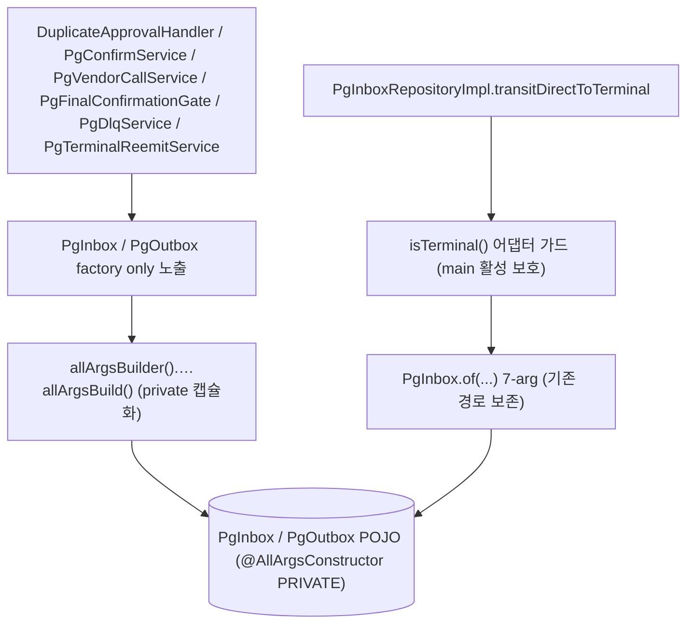
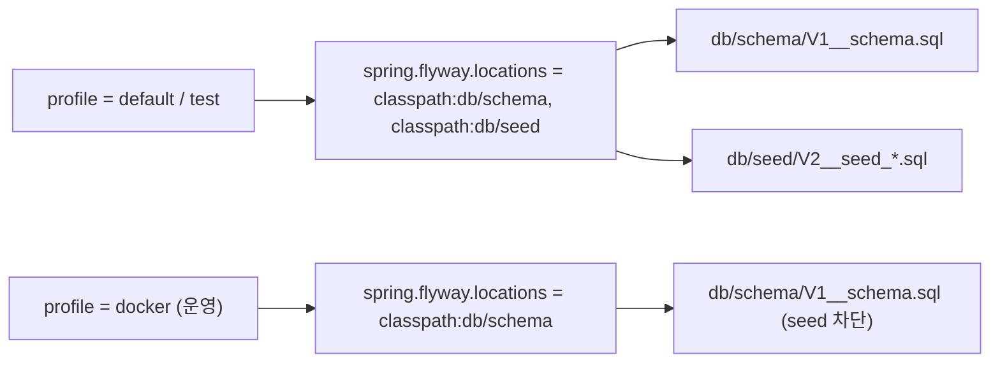
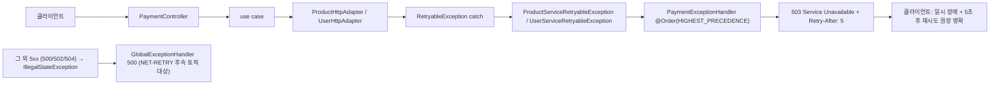

# CLEANUP-BATCH-A 완료 브리핑

> 2026-05-12 완료 · PR 묶음 A (TC-16 + TC-10 + TC-2 + TC-5) · 12 태스크 · 702 PASS

## 작업 요약

직전 토픽 PG-CONFIRM-LISTENER-SPLIT (PR #74) 봉인 후 누적된 짧은 청소 부채 4건을 한 묶음으로 처리한 정리 토픽이다. 도메인 결정 동반 없는 단순 청소지만 영역이 4갈래 (pg-service 도메인 / payment-service ControllerAdvice / product+user-service Flyway) 로 분리되어 한 PR 사이클에 정리할지 별 PR 로 쪼갤지가 discuss 단계 핵심 결정이었다. 사용자 결정으로 **단일 토픽 4 sub-section** (§1.1 ~ §1.4) 으로 묶었고, cross 의존이 0 이라 plan 단계에서 12 태스크를 sub-section 별로 분해해 병렬 안전성을 확보했다.

영역별 작업: (1) pg-service 의 `PgInboxAmountService` 는 main 호출처 0건 dead service 로 단독 테스트와 함께 삭제했고, 두 영구 문서 (CONFIRM-FLOW / PAYMENT-FLOW) 의 dangling reference 도 같이 정리했다. (2) `PgInbox` / `PgOutbox` 도메인 POJO 의 명시 private 생성자 + static factory 패턴을 payment-service 의 `PaymentOutbox` 가 쓰는 `@Builder(builderMethodName="allArgsBuilder", buildMethodName="allArgsBuild") + @AllArgsConstructor(AccessLevel.PRIVATE)` 패턴으로 통일했고, `PgOutbox.create` / `createWithAvailableAt` 의 `Long id` dead parameter (모든 호출처에서 null 박힘) 를 제거하면서 호출처 5 파일 정정. PG-CONFIRM-LISTENER-SPLIT 봉인된 5상태 + factory 4종 + 어댑터 가드 (`PgInboxRepositoryImpl.transitDirectToTerminal:150` 의 `isTerminal()` 체크) 는 모두 보존. (3) product-service / user-service 의 Flyway 디렉토리를 `db/migration/` → `db/schema/` + `db/seed/` 로 물리 분리했고, `application-docker.yml` 에 `spring.flyway.locations: classpath:db/schema` override 를 추가해 운영 docker profile 에서 seed 가 적용되지 않도록 차단. product-service 에 `FlywayDockerProfileTest` Testcontainers 1건 신규 추가로 회귀 보호. user-service 동등 검증은 의도적 갭으로 `[FLYWAY-USER-SEED-GAP]` 후속 등재. (4) payment-service 의 `ProductServiceRetryableException` / `UserServiceRetryableException` 가 클라이언트엔 500 으로 노출되던 것을 `PaymentExceptionHandler` 핸들러 2건 추가로 503 + `Retry-After: 5` 헤더로 정확 매핑.

discuss 라운드 D1 (어댑터 가드 surface 인벤토리 정정) / D2 (`PgInbox.create` 호출처 0건 명시) / D3 (429 시그널 손실 후속 등재) / D4 (Flyway missing-migration 가시화) / D5 (PAYMENT-FLOW.md dangling) 5건 모두 plan 단계에서 태스크에 매핑됐고, plan Round 1 의 critic F1~F5 (commit 묶음 정책 + Architect 인라인 주석 처리) + domain D1~D4 (CONFIRM-FLOW 정정 + PgOutbox 호출처 카운트 + 비-503 5xx 갭 + 어댑터 회귀 acceptance) 도 Round 2 에서 모두 흡수. plan-review 는 clean pass. execute 12 태스크 (4 TDD + 8 비-TDD) 진행. review Round 1 양쪽 pass 로 마무리.

## 핵심 설계 결정

### §1.1 — `PgInboxAmountService` 제거 (TC-16)
**결정**: dead service 본체 + 단독 테스트 2 파일 삭제 + CONFIRM-FLOW / PAYMENT-FLOW 의 dangling reference 도 함께 정리.
**근거**: main 호출처 0건 (PCS-9 봉인 시 포트 메서드 교체로 컴파일 에러 해소만 진행됐고 본체 제거는 별 토픽으로 미뤄 둔 상태). PG-CONFIRM-LISTENER-SPLIT 의 review m1 finding 으로 별 토픽 등재 → 본 토픽에서 정리.
**대안 기각**: dead service 보존 (실제 활성화 시 룰 위반 + 인지 부담).

### §1.2 — `PgInbox` / `PgOutbox` builder 패턴 통일 (TC-10)
**결정**: payment-service `PaymentOutbox` 가 쓰는 `@Builder(builderMethodName="allArgsBuilder", buildMethodName="allArgsBuild") + @AllArgsConstructor(AccessLevel.PRIVATE)` 패턴 적용. **factory only 노출 룰** — 외부 호출자는 정적 factory 4종 (`createPending` / `createDirectInProgress` / `createDirectTerminal` / `of`) 만 호출, builder 는 factory 내부 캡슐화 용도. `PgOutbox.create` / `createWithAvailableAt` 의 `Long id` dead parameter 제거 (호출처 5 파일 정정).
**근거**: payment-service 와 pg-service 의 도메인 POJO 생성자 패턴 비대칭 → 인지 부담. dead parameter 도 코드 노이즈. PG-CONFIRM-LISTENER-SPLIT 봉인 시나리오 의도 (정상 PENDING / 보정 IN_PROGRESS 우회 / 보정 terminal 우회 / DB 복원) 는 factory 시그니처로 보존.
**대안 기각**: (a) pg-service 특화 변형 — payment-service 와 비대칭 유지 비용. (b) builder 외부 공개 — terminal status 가드 등 시나리오 우회 가능성. **Lombok 제약상 builder static 메서드를 private 화 못 함** → JavaDoc + code review 로 강제 (ArchUnit 룰은 별 토픽). 어댑터 가드 (`PgInboxRepositoryImpl.transitDirectToTerminal:150`) 는 main 활성 보호, 도메인 factory 가드는 test 픽스처 이중화로 분리 보존.

### §1.3 — Flyway `db/schema` + `db/seed` 디렉토리 분리 (TC-2)
**결정**: product-service / user-service 의 `db/migration/` 을 `db/schema/` (V1 schema) + `db/seed/` (V2 seed) 로 물리 분리. `application.yml` 의 default / test profile 은 `classpath:db/schema,classpath:db/seed` 둘 다 적용. `application-docker.yml` (운영) 은 `classpath:db/schema` 만 적용 → docker profile 에서 seed 데이터 적용 차단.
**근거**: 기존 구조는 `V2__seed_*.sql` 가 운영 배포에도 같이 적용되는 위험. 학습용 더미 데이터가 운영 DB 에 들어갈 가능성. profile 별 location override 로 명시적 차단.
**대안 기각**: (a) yml override 만 (파일 이동 없음) — 설정 일관성 깨지면 seed 적용 가능성. (b) placeholder + profile activation — 동일 동작이나 의도 명시 떨어짐. (c) `@Profile` 어노테이션 — Flyway 는 yml 설정 우선. 검증 방식은 product-service 측 Testcontainers + `@ActiveProfiles("docker")` 1건 채택, user-service 동등 검증은 의도적 갭으로 후속 등재.

### §1.4 — `Retryable` 예외 503 + `Retry-After: 5` 일괄 매핑 (TC-5)
**결정**: `PaymentExceptionHandler` (`@Order(HIGHEST_PRECEDENCE)`) 에 `ProductServiceRetryableException` / `UserServiceRetryableException` 핸들러 2건 추가. 응답 = HTTP 503 + `Retry-After: 5` 헤더 + 기존 `PaymentErrorCode.PRODUCT_SERVICE_UNAVAILABLE` / `USER_SERVICE_UNAVAILABLE` 재사용. 두 핸들러 공통 로직은 `retryableServiceUnavailable` private helper 로 추출.
**근거**: 클라이언트가 "일시 장애 + 재시도 가능" vs "영구 실패" 구분 못 하던 문제. HTTP 표준 (`503` + `Retry-After`) 로 시그널 명확. Feign `readTimeout=5s` 와 정합되는 5초 default.
**대안 기각**: (a) 429/503 분기 + 원본 status 보존 — Feign ErrorDecoder 가 두 status 를 단일 `RetryableException` 으로 통합한 정보 손실 구조 → 본 토픽 범위 초과. `[NET-RETRY]` 후속 등재. (b) `Retry-After` 동적 backoff — 별 토픽.

## 변경 범위

### 도메인 (pg-service/.../domain)
- `PgInbox.java` — `@Builder + @AllArgsConstructor(PRIVATE)` 적용. 명시 private 생성자 본체 제거. factory 7종 본문을 builder 호출로 교체. JavaDoc 추가 (factory only 노출 룰 + create 4 오버로드 main 호출처 0건 명시 — D2 흡수)
- `PgOutbox.java` — 동일 패턴 + `Long id` dead parameter 제거 (`create` / `createWithAvailableAt` 시그니처에서). `@GeneratedValue(IDENTITY)` 가 INSERT 시 채움

### Application (pg-service / payment-service)
- `pg-service/.../application/service/PgInboxAmountService.java` (삭제) — dead service 본체
- `pg-service/.../application/service/PgVendorCallService.java` — `PgOutbox.create(null, ...)` → `PgOutbox.create(...)` 4건
- `pg-service/.../application/service/PgFinalConfirmationGate.java` — 동 3건
- `pg-service/.../application/service/PgDlqService.java` — 동 1건
- `pg-service/.../application/service/PgTerminalReemitService.java` — 동 1건
- `pg-service/.../application/service/DuplicateApprovalHandler.java` — 동 1건
- `payment-service/.../exception/common/PaymentExceptionHandler.java` — `ProductServiceRetryableException` / `UserServiceRetryableException` 핸들러 2건 + `retryableServiceUnavailable` private helper

### Infrastructure (product-service / user-service)
- `product-service/src/main/resources/application.yml` — `spring.flyway.locations: classpath:db/schema,classpath:db/seed`
- `product-service/src/main/resources/application-docker.yml` (신규) — `spring.flyway.locations: classpath:db/schema` override
- `product-service/src/main/resources/db/migration/V1__product_schema.sql` → `db/schema/V1__product_schema.sql` (git mv)
- `product-service/src/main/resources/db/migration/V2__seed_product_stock.sql` → `db/seed/V2__seed_product_stock.sql` (git mv)
- user-service 측 동일 패턴 (V1 user_schema / V2 seed_user)

### 테스트 (pg-service / payment-service / product-service)
- `pg-service` 단위: `PgInboxTest` (신규 케이스 7건) + `PgOutboxTest` (신규 3건)
- `pg-service` 통합: 변경 없음 (회귀만 보장)
- `pg-service` 삭제: `PgInboxAmountStorageTest.java`
- `payment-service` 신규: `PaymentExceptionHandlerTest.java` (503 + Retry-After 검증 2건)
- `product-service` 신규: `FlywayDockerProfileTest.java` (Testcontainers + `@ActiveProfiles("docker")`) — `flyway_schema_history` row count = 1 (V1 만) + `products` 테이블 row count = 0 (seed 미적용) 검증
- `product-service` build.gradle: Testcontainers 의존성 + `integrationTest` task 신규
- `product-service` test resources: `docker-java.properties` (api.version=1.44)

### 영구 문서 갱신 (docs/context)
- `CONFIRM-FLOW.md` — §7 (line 254) + §13 (line 430) 의 `PgInboxAmountService` 참조 → `AmountConverter.fromBigDecimalStrict` (`PgInboxRepositoryImpl.insertPending` + `DuplicateApprovalHandler.amountMismatch` 경로) 로 정정
- `PAYMENT-FLOW.md` — 컴포넌트 인벤토리 표의 `PgInboxAmountService` dangling 제거 (D5 흡수)
- `STACK.md` — Flyway 운영 가이드 갱신 (db/schema + db/seed 분리, missing-migration 3-step 대응)
- `CONVENTIONS.md` — Lombok 섹션에 Builder 룰 (factory only 노출, 컴파일러 강제 불가 명시) 추가
- `STRUCTURE.md` — 디렉토리 트리에서 `db/migration/` → `db/schema/` + `db/seed/` 정정
- `TODOS.md` — [PR A] 4항목 완료 섹션 이전 + `[NET-RETRY]` (Feign ErrorDecoder 429/503 분기) / `[FLYWAY-USER-SEED-GAP]` (user-service Testcontainers 동등) 신규 등재

## 다이어그램

### pg-service 도메인 POJO 생성자 패턴 (변경 후)

### Flyway profile 별 location

### Retryable 예외 응답 흐름 (변경 후)

## 코드 리뷰 요약

### review Round 1
- **critic**: pass (minor 2) — F1: `DuplicateApprovalHandlerTest:300` 의 `java.time.Instant` 풀 qualifier 가독성. F2: CBA-9 GREEN 커밋 prefix `refactor:` (CBA-6/8 의 `feat:` 와 일관성 미세 차이).
- **domain**: pass (finding 0) — PG-CONFIRM-LISTENER-SPLIT 봉인 정합 유지 확인, 어댑터 가드 보존 확인.
- **흡수**: F1 short fix (Instant import 정리) + F2 PLAN 노트 추가. F2 는 이미 커밋된 메시지라 정정 불가, prefix 결정 의도 노트만 추가.

### plan Round 1 → Round 2
- Round 1 critic revise (major 2 + minor 3) + domain revise (major 1 + minor 3) — 7건 흡수: Architect 인라인 주석 처리, commit 묶음 정책 신설 (CBA-2+4 / CBA-3+5 단일 커밋), CONFIRM-FLOW.md 정정, PgOutbox 호출처 카운트 정정, 비-503 5xx 갭 가시화, 어댑터 회귀 acceptance.
- Round 2 양쪽 pass (carry-over minor 1건: PAYMENT-FLOW.md dangling 도 Planner 한 번 더 흡수).

### discuss Round 1 → Round 2
- Round 1 critic pass (minor 1) + domain revise (major 1 + minor 3) — 4건 흡수: 가드 surface 인벤토리 정정, `PgInbox.create` 호출처 0건 명시, TODOS 후속 등재 명시, missing-migration named volume 시나리오 가시화.
- Round 2 양쪽 pass.

### plan-review
- 1라운드 clean pass (critical/major/minor 0).

## 수치

| 항목 | 값 |
|---|---|
| 태스크 | 12 (CBA-1 ~ CBA-12) |
| 테스트 | 702 PASS / 0 FAIL (이전 698 + 신규 4) |
| 커밋 (브랜치 #75) | 19 (12 GREEN + 4 RED + 3 docs) |
| sub-section | 4 (TC-16 + TC-10 + TC-2 + TC-5) |
| TDD 라운드 | 4 (CBA-6 / CBA-7 / CBA-8 / CBA-9 RED → GREEN) |
| review findings | critical 0 / major 0 / minor 2 (모두 흡수) |
| discuss findings (Round 1 합) | critical 0 / major 1 / minor 4 (모두 흡수) |
| plan findings (Round 1 합) | critical 0 / major 3 / minor 6 (모두 흡수) |
| 영구 문서 갱신 | 6 (CONFIRM-FLOW / PAYMENT-FLOW / STACK / CONVENTIONS / STRUCTURE / TODOS) |

## 후속 작업

- **`[NET-RETRY]`** — Feign ErrorDecoder 429/503 분기 보존 + 비-503 5xx (500/502/504) 매핑. 별 토픽
- **`[FLYWAY-USER-SEED-GAP]`** — user-service Testcontainers 동등 검증 + infra-healthcheck 스크립트 V2 row count=0 체크. 별 토픽
- **PR B (TC-4 + TC-8)** — EXPIRED 정책 + 시간 추상화 표준 결정 동반 묶음
- **PR C (TC-13)** — payment-service EOS 전환 (위키 정합)
