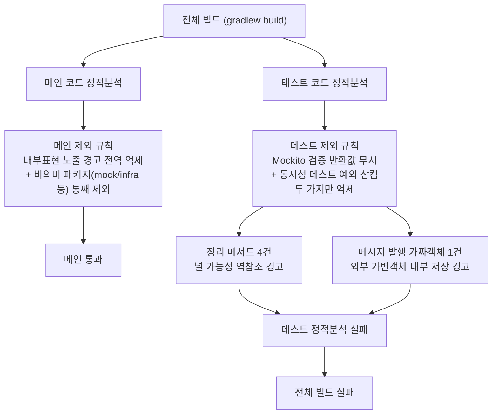
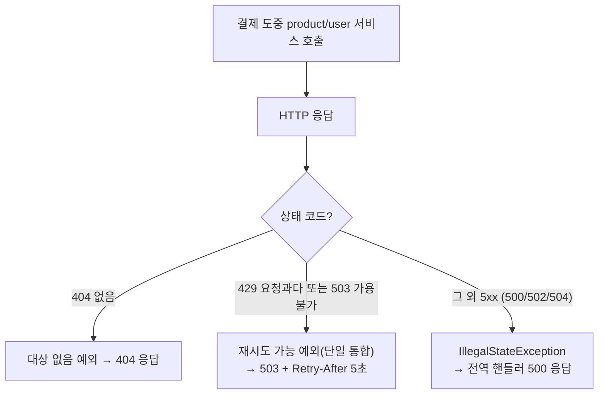
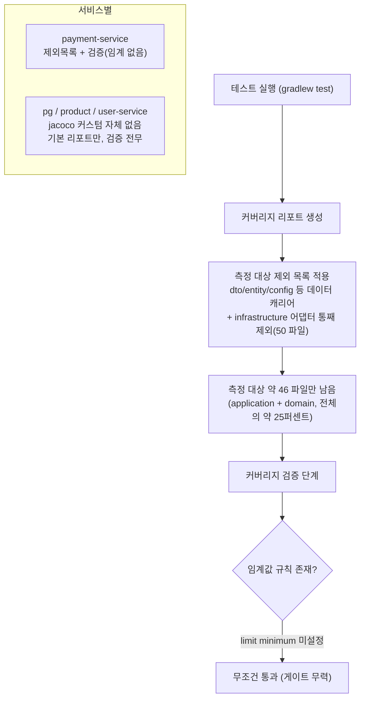
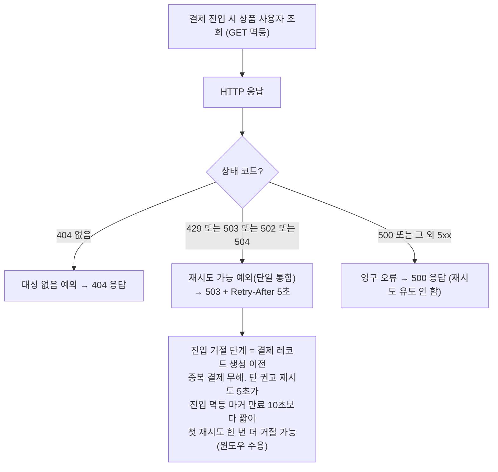
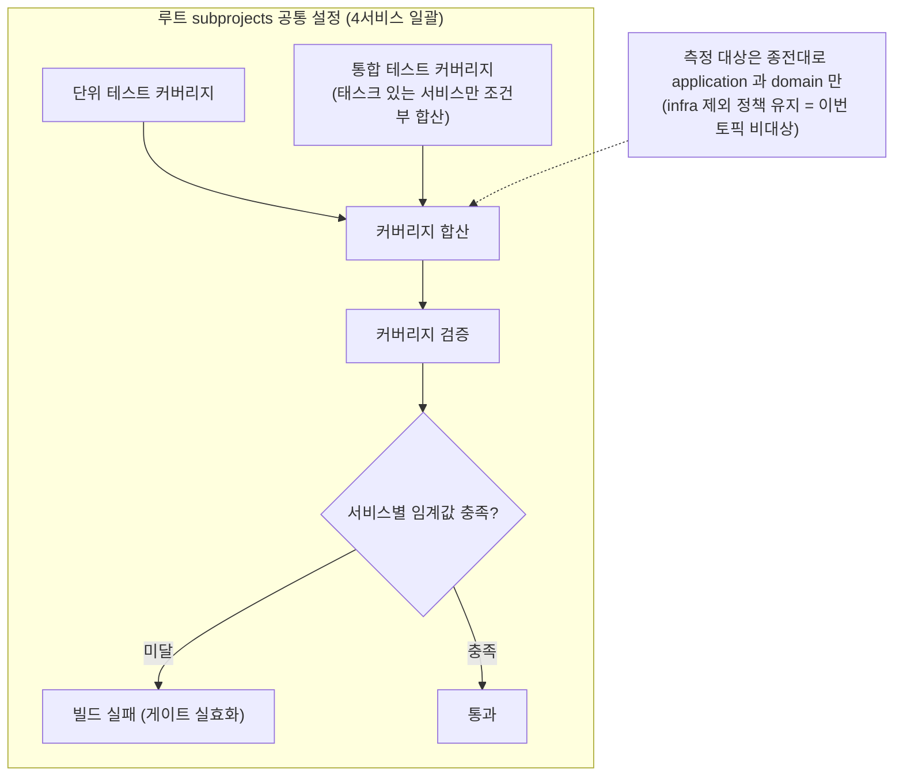

# CLEANUP-BATCH-B

## 사전 브리핑

### 현재 이해한 문제

위생 묶음 세 건이다. (1) payment-service 정적분석 테스트 게이트(`spotbugsTest`)가 5건 위반으로 깨져 있어 `./gradlew build` 전체가 실패한다 — 깨진 CI 게이트라 회복 우선. (2) 서비스 간 HTTP 호출 실패 매핑(Feign ErrorDecoder)이 429/503 을 한 예외로 뭉치고, 그 외 5xx(500/502/504)는 전부 500 으로 노출해 일시적 게이트웨이 장애(502/504)와 영구 오류(500)를 구분하지 못한다. (3) JaCoCo 커버리지 게이트가 사실상 무력하다 — 측정 대상이 전체 188 파일 중 ~46 파일(application/domain)뿐이고(`infrastructure/**` 50 파일이 통째 제외), 검증 규칙에 임계값(`limit`)이 없어 커버리지가 떨어져도 빌드가 안 깨지며, jacoco 커스텀이 payment-service 에만 있어 pg/product/user 는 게이트가 전무하다.

### 현재 시스템 동작 (as-is)

#### 1. spotbugs 게이트 — 왜 테스트 정적분석만 깨지는가

위반 5건 (전부 테스트 코드, 메인 diff 밖 기존 부채):

| # | 위반 패턴 | 위치 | 성격 |
|---|---|---|---|
| 1 | 널 역참조 가능 | `StockCacheRedisAdapterTest:62` (정리 메서드) | 연결 팩토리 체인 반환값 null 미검사 |
| 2 | 널 역참조 가능 | `StockCompensationAtomicLuaTest:57` (정리 메서드) | 동일 |
| 3 | 널 역참조 가능 | `StockDecrementAtomicLuaTest:57` (정리 메서드) | 동일 |
| 4 | 널 역참조 가능 | `StockCompensationRecoveryIntegrationTest:177` (정리 메서드) | 동일 |
| 5 | 외부 가변객체 내부 저장 | `FakeMessagePublisher:82` (가짜 발행기) | `Throwable` 필드 저장 — 메인은 전역 억제 + mock 패키지 제외 대상 |

핵심: 위반 1~4는 `redisTemplate.getConnectionFactory().getConnection()...` 체인에서 중간 반환값 null 미검사. 위반 5는 메인 제외 규칙이라면 이미 억제(`EI_EXPOSE_REP2` 전역 + mock 패키지 제외)됐을 것 — 테스트 제외 규칙에만 빠져 있어 노출.

#### 2. 서비스 간 HTTP 실패 매핑 — 비-503 5xx 갭

문제: 게이트웨이/프록시 일시 장애(502 Bad Gateway, 504 Gateway Timeout)도 영구 서버 오류(500)와 똑같이 500 으로 노출 → 클라이언트가 재시도 가능 여부를 구분 못 함. 또 429(요청 과다)와 503(가용 불가)이 한 예외로 합쳐져 로그/응답에서 원인 구분 불가.

#### 3. JaCoCo 커버리지 게이트 — 측정 협소 + 임계 부재 + 서비스 불균형

핵심 수치 (payment-service main 기준):
- 전체 188 파일 → 측정 대상 약 46 파일(`application/*` + `domain`), 나머지 ~75% 제외
- `**/infrastructure/**` 한 줄로 50 파일 제외 — Redis Lua 어댑터·Kafka producer·JDBC dedupe store·Feign ErrorDecoder·스케줄러 워커 등 실제 로직 거주지
- `jacocoTestCoverageVerification` 에 `limit { minimum }` 없음 → 검증 no-op
- jacoco 커스텀은 payment-service `build.gradle` 에만 존재, 나머지 3 서비스는 jacoco 키워드 0건

PR 리포트 가시성 증상 (PR #80 실측): 변경된 main 소스 23 파일 중 16 파일(70%)이 제외 대상(`infrastructure`/`config`/`domain.enums`)이라 jacoco XML 에 부재 → Madrapps PR 코멘트의 "Files changed" 테이블에서 누락. 이번 작업에서 신규 작성한 핵심 로직(`DedupeCleanupWorker`·`JdbcPaymentEventDedupeStore`·`TraceparentExtractor`)이 전부 빠지고, 측정 대상 7 파일 중 port 인터페이스는 실행 라인 0 이라 추가 생략 → 결국 usecase 클래스 2~3 개만 코멘트에 노출. CI 설정(`ci.yml` Madrapps `paths` 6 서비스 XML)은 정상 — 원인은 리포트 생성 단계의 `classDirectories` 제외 목록. 측정 대상을 넓히면 PR 코멘트가 변경한 실제 코드를 보여주게 됨.

### 이번 discuss에서 결정하려는 것

1. **spotbugs 회복 방식** — 위반 1~4(정리 메서드 널 역참조)를 (a) 테스트 제외 규칙 확장(메인처럼 `infrastructure`/`integration` 패키지·해당 패턴 억제)으로 흡수 vs (b) 테스트 코드 정정(체인을 중간 변수로 분해 + null 단언)으로 해결.
2. **위반 5(가짜 발행기 내부표현 노출)** — 테스트 제외 규칙을 메인과 정합되게 맞출지(`EI_EXPOSE_REP2` 전역 억제 + mock 패키지 제외 추가) — 사실상 메인 정책 미러링 여부.
3. **NET-RETRY: 비-503 5xx 매핑 정책** — 502/504 를 재시도 가능(503 응답)으로 승격할지, 500 은 그대로 둘지.
4. **NET-RETRY: 429 vs 503 분리** — 현재 단일 통합 예외를 상태별로 쪼갤지(로그/메트릭 구분 가치 vs 응답은 동일 503 이라 분리 실익 적음).
5. **커버리지 측정 대상 복원 범위** — `**/infrastructure/**` 통째 제외를 유지할지, 실제 로직이 사는 어댑터(예: cache/scheduler/feign 하위)를 측정 대상으로 되살릴지. 데이터 캐리어(dto/entity/config 등) 제외는 유지 전제.
6. **커버리지 검증 임계 도입** — `jacocoTestCoverageVerification` 에 `limit { minimum }` 을 넣어 게이트를 실효화할지, 임계값을 line/branch 중 무엇으로 몇 %로 둘지(기존 측정 수치 기반 보수적 baseline).
7. **4서비스 정합** — jacoco 정책을 payment-service 에만 둘지, 루트 `subprojects` 블록으로 끌어올려 4서비스 공통 적용할지(공통화 시 서비스별 baseline 편차 수용 여부).
8. **세 항목 PR 묶음 범위** — 한 PR(브랜치)로 같이 갈지 확정(STATE 기준 묶음 A 토픽).

### 열린 질문 / 가정

- (가정) 세 항목 모두 도메인 결정이 거의 없는 위생 작업 — STATE 의 "토픽 A 가볍게 완주" 전제. NET-RETRY 의 5xx 매핑 + 커버리지 임계값만 약한 정책 결정.
- (가정) spotbugs 위반 1~4 는 테스트 정리 코드라, 메인이 이미 `infrastructure` 패키지를 통째 제외하는 것과 정합되게 테스트도 제외하는 게 일관적 — 단 "테스트 코드는 명시 정정 선호" 컨벤션이 있으면 정정으로 간다. (CONVENTIONS 확인 필요)
- (열린 질문) NET-RETRY 에서 새 예외 타입을 늘릴지, 기존 `*ServiceRetryableException` 에 상태 코드만 실어 핸들러에서 분기할지 — 예외 클래스 증식 최소화 관점.
- (열린 질문) 500(순수 서버 오류)을 retryable 로 볼 여지 — 일반적으로 비멱등/영구 오류라 비-retryable 유지가 안전하나, 결제 호출은 GET/검증성이라 재시도 무해할 수도. 도메인 관점 검토 대상.
- (열린 질문) 커버리지 임계 도입 시 baseline 산정 — 측정 대상을 넓히면(infrastructure 일부 복원) 현재 수치가 떨어질 수 있어, 임계값은 "넓힌 후 실측" 기준으로 잡아야 게이트가 즉시 깨지지 않음. 측정 확장과 임계 설정의 선후 관계 결정 필요.
- (열린 질문) 커버리지 확대가 spotbugs 제외 정책과 충돌 — `infrastructure` 를 커버리지 측정엔 포함하면서 spotbugs 에선 제외 유지하면 두 도구의 패키지 정책이 갈라짐. 정합 유지 가치 검토.

---

## 요약 브리핑

### 결정된 접근

세 위생 항목을 한 PR 로 묶되 코드 거주지가 갈려 결합은 없다. (1) **spotbugs 5건 전부 코드 정정** — 정리 메서드 NPE 4건은 연결 팩토리 체인을 변수로 분해 후 `requireNonNull` 단언, 가짜 발행기 1건은 가변 `Throwable` 저장을 예외 공급자(`Supplier`) 저장으로 전환. (2) **NET-RETRY** — 게이트웨이 일시 장애(502/504)를 재시도 가능(503 + Retry-After)으로 승격하고, 영구 오류(500)는 비-재시도 유지, 429/503 은 단일 예외로 통합 유지. (3) **커버리지 게이트 실효화** — 측정 대상 정책(infra 제외)은 유지한 채 검증 임계값을 도입하고, 통합테스트 커버리지를 합산하며, 설정을 루트로 끌어올려 4서비스 공통 적용.

### 변경 후 동작 (to-be)

#### 1. 서비스 간 HTTP 실패 매핑

#### 2. JaCoCo 커버리지 게이트

spotbugs 회복은 흐름 변화가 아니라 위반 5건 제거 → `gradlew build` 전체 GREEN 회복이라 별도 다이어그램 생략.

### 핵심 결정 ID

- **D-SB1 / D-SB1-EI** — spotbugs 5건 코드 정정 (NPE 4 + 가짜 발행기 `Supplier` 전환). 억제 금지.
- **D-NR1a** — 502/504 retryable 승격(503 + Retry-After). **D-NR1b** — 500 비-retryable 유지. **D-NR1c** — 429/503 단일 예외 유지(구분은 로그 status).
- **D-NR1d** — Retry-After(5s) vs 진입 멱등 마커 TTL(10s) 정렬은 비대상, 윈도우 수용(금전 무해 + 자연 만료). 정렬은 후속 위임.
- **D-COV1** — 측정 대상 정책 유지 + LINE 임계값 도입. **D-COV2** — 통합테스트 exec 합산. **D-COV3** — 루트 subprojects 4서비스 공통화(integrationTest 조건부 wiring).

### 알려진 트레이드오프 / 후속 작업

- **(G1) 사용자 원래 관찰 미해소** — 측정 대상 정책을 유지했으므로 "커버리지 수치가 좁게 나옴 / PR 코멘트에 infra 변경 파일이 안 뜸"은 이번 토픽으로 해소되지 않는다. 측정 대상 확대는 별도 토픽 여지.
- **(D-NR1d) 첫 권고 재시도 재거절 윈도우** — 502/504 거절 후 5초 재시도가 10초 진입 멱등 마커에 걸려 한 번 더 거절될 수 있음. 금전 무해라 수용. Retry-After/TTL 정렬은 TODOS/Phase 4 후속.
- **(F2) 504 재시도 폭주(thundering herd)** — 고정 Retry-After 5초만 완화 신호, jitter/지수 백오프/CircuitBreaker 는 Phase 4(T4-D).
- **baseline 값** — 커버리지 임계 구체값은 통합테스트 합산 후 실측-안전마진으로 execute 단계에서 확정.

---

## §1 배경 / 문제

세 건의 build/test 위생 묶음이다. 한 PR(`CLEANUP-BATCH-B`)로 같이 간다. 세 건은 코드 거주지가 갈리고(빌드 스크립트 / 테스트 코드 / Feign 어댑터+핸들러) 도메인 상태에 닿지 않아 서로 결합이 없다.

1. **spotbugsTest 게이트 파손** — payment-service 테스트 코드 정적분석이 위반 5건으로 깨져 `./gradlew build` 전체가 실패한다. 전부 메인 diff 밖 기존 부채(NPE 가능 4 + 외부 가변객체 저장 1). 깨진 CI 게이트라 회복 우선순위가 가장 높다.
2. **NET-RETRY: 비-503 5xx 갭** — payment-service 의 Feign `ErrorDecoder`(`ProductFeignConfig`/`UserFeignConfig`)가 429/503 만 retryable 로 매핑하고, 그 외 5xx(500/502/504)는 전부 `IllegalStateException` → 전역 핸들러 500 으로 노출한다. 게이트웨이/프록시 일시 장애(502/504)와 영구 서버 오류(500)를 클라이언트가 구분하지 못한다.
3. **JaCoCo 게이트 무력** — (a) `jacocoTestCoverageVerification` 에 `limit { minimum }` 이 없어 커버리지가 떨어져도 빌드가 안 깨지고(검증 no-op), (b) `jacocoTestReport` 가 `dependsOn test` 만이라 Testcontainers `integrationTest` exec data 가 합산되지 않아 통합 경로로만 커버되는 usecase 분기가 0 기여, (c) jacoco 커스텀이 payment-service `build.gradle` 에만 있어 pg/product/user 는 게이트 자체가 없다.

문제 정의·as-is 다이어그램·실측 수치는 위 사전 브리핑 본문 참조. 본 §부터는 그 위에 결정·검증·호환성을 쌓는다.

## §2 범위 / non-goals

### in-scope
- 루트 `build.gradle` `subprojects` 블록에 jacoco 공통 설정 이전 — 제외 목록 + `classDirectories` filter + `jacocoTestCoverageVerification` `limit { minimum }` + `integrationTest` exec data 합산. payment-service `build.gradle` 의 개별 jacoco 블록(L121~192)은 공통화와 중복 제거.
- spotbugs 위반 5건 **코드 정정** (억제 금지).
- `ProductFeignConfig` / `UserFeignConfig` `ErrorDecoder` 의 5xx 분기 보강 + `PaymentExceptionHandler` 의 응답 매핑 정합.

### non-goals (최소 1개 — 결정에서 도출)
- **커버리지 측정 대상 확대 안 함** (가정 G1). `**/infrastructure/**`·`dto`·`entity`·`config` 등 제외 목록은 그대로 유지한다. TESTING.md §JaCoCo 정책("infrastructure 는 Testcontainers 로 검증, 라인 커버리지 의미 약함")을 의도된 정책으로 존중한다. 측정 대상 복원은 별도 토픽 여지로 남긴다.
- **PR 코멘트 가시성 / 수치 협소 해소 안 함** (가정 G1) — 측정 대상이 그대로이므로 PR #80 에서 관찰된 "변경 infra 파일이 Madrapps 코멘트에 안 뜸" 증상은 이번 토픽으로 해소되지 않는다.
- **spotbugs 억제(exclude filter / `@SuppressFBWarnings`) 추가 안 함** — 5건 전부 코드 정정.
- **CircuitBreaker / 재시도 자동화 도입 안 함** — NET-RETRY 는 5xx → HTTP 상태 매핑 정확화까지만. 클라이언트 측 자동 재시도 wiring 은 Phase 4(T4-D) 범위.
- **gateway / eureka-server jacoco 게이트** — 비즈니스 로직 거의 없음. `subprojects` 공통 적용 시 자연히 포함되나 baseline 은 0% 허용(아래 §3-3 baseline 절 참조). 별도 임계 설계는 후순위.

## §3 설계 결정

세 항목 모두 build/test 위생이라 도메인 상태·hexagonal layer 에 미치는 영향이 작다. **새 결제 상태 추가 없음. 상태 전이 다이어그램 불필요.** layer 영향은 항목별로 아래 명시한다.

### §3-1 spotbugs 5건 코드 정정 (D-SB1)

layer 영향: **없음** — 전부 `src/test` 코드. main 어댑터/포트 경계 불변.

**위반 1~4 (NP_NULL, tearDown 의 redis flushAll 체인)**
대상: `StockCacheRedisAdapterTest:62` / `StockCompensationAtomicLuaTest:57` / `StockDecrementAtomicLuaTest:57` / `StockCompensationRecoveryIntegrationTest:177`. 공통 패턴은 `redisTemplate.getConnectionFactory().getConnection().serverCommands().flushAll()` 형태로 `getConnectionFactory()` 중간 반환값(`@Nullable`)을 미검사.

- 결정: 체인을 중간 변수로 분해 + null 처리. try 블록 내 외부 변수 재할당 패턴은 금지(MEMORY 피드백)이므로, tearDown 진입부에서 `RedisConnectionFactory factory = Objects.requireNonNull(redisTemplate.getConnectionFactory(), "...")` 로 단언 후 체인 진행. 테스트 셋업상 factory 는 항상 존재하므로 `requireNonNull` 이 의미적으로 정확(없으면 그 자체가 셋업 결함 — fail-fast).
- 기각한 대안: exclude filter 에 `NP_*` 패턴 추가 → Round 0 D-SB1(억제 금지)에 위배. 또 메인은 동일 패턴을 패키지 제외로 흡수하는데 테스트만 정정하면 두 도구 정책이 갈리지만, "테스트 코드 명시 정정 선호" 결정이 우선한다.

**위반 5 (EI_EXPOSE_REP2, `FakeMessagePublisher:82` `setPermanentFailure(Throwable)`)**
`Throwable` 외부 가변 객체를 필드에 그대로 저장. `Throwable` 은 방어적 복사 불가(가정 G3)라 메인의 방어적 복사 관용구를 적용할 수 없다.

- 결정: **저장 대상을 가변 객체 참조에서 불변 공급 표현으로 전환**한다. `Throwable` 필드/`AtomicReference<Throwable>` 대신 `Supplier<? extends Throwable>`(예외 팩토리)를 저장한다. 호출부는 `setPermanentFailure(() -> new RuntimeException(...))` / `setFailure(supplier)` 형태로, fake 는 `send()` 시 `supplier.get()` 으로 매번 새 인스턴스를 만들어 throw 한다. SpotBugs 관점에서 외부 가변 객체 참조 보존이 사라지므로 EI_EXPOSE_REP2 해소. 의미적으로도 "다음 send 가 어떤 예외로 실패할지"를 표현하는 fake 라 공급 방식이 더 자연스럽다.
- 동시성 유지: 기존 `nextFailure`(`AtomicReference`) / `permanentFailure`(`volatile`) 의 thread-safety 보장은 타입만 `Supplier` 로 바뀌고 그대로 유지.
- 호출부 영향: `setFailure`/`setPermanentFailure`/`failNext` 를 부르는 모든 테스트의 인자 형태가 바뀐다. 호출부 일괄 수정이 동반되며, 시그니처 변경은 fake(test fixture)에 한정돼 main 계약(`MessagePublisherPort`)에는 무영향.
- 기각한 대안: (a) `@SuppressFBWarnings` — D-SB1 위배. (b) 테스트 exclude filter 에 `EI_EXPOSE_REP2` + mock 패키지 제외(메인 미러링) — Round 0 가 "코드 정정"으로 확정했으므로 기각. (c) `Throwable` 을 그대로 두고 메시지 문자열만 저장 — 호출부가 임의 예외 타입(checked 포함)을 주입하던 유연성을 잃어 기각.

### §3-2 NET-RETRY: 5xx 매핑 정책 (D-NR1 → D-NR1a/D-NR1b/D-NR1c 로 세분)

layer 배치 (hexagonal):
- `ErrorDecoder` 는 `infrastructure/adapter/http/feign/{Product,User}FeignConfig` — **infrastructure 출력 어댑터**. cross-service 응답(transport)을 도메인 예외로 변환하는 경계. 정책 변경의 1차 거주지.
- 도메인 예외(`*ServiceRetryableException`)는 `exception` 패키지 — `application`/`domain` 이 throw 대상으로 알고, presentation 핸들러가 HTTP 상태로 환원.
- `PaymentExceptionHandler` 는 `exception/common` 의 `@RestControllerAdvice` — **presentation 측 단일 매핑 원천**. 도메인 예외 → HTTP 상태.
- 의존 방향 준수: infrastructure(`ErrorDecoder`) → exception 으로 throw, presentation(`@RestControllerAdvice`) → exception 매핑. application/domain 은 변경 없음. **포트 인터페이스 신설·이동 없음** (`MessagePublisherPort` 와 무관, Feign 어댑터는 기존 `ProductHttpAdapter`/`UserHttpAdapter` 가 구현하는 출력 포트 뒤에 그대로 위치).

**D-NR1a — 502/504 를 retryable 로 승격.**
502 Bad Gateway / 504 Gateway Timeout 은 게이트웨이/프록시 일시 장애로, product/user 인스턴스 교체·LB 재시도로 회복 가능한 transient 오류다. `ErrorDecoder` 에서 503/429 와 같은 `*ServiceRetryableException`(`*_SERVICE_UNAVAILABLE`)으로 매핑 → 핸들러가 `503 + Retry-After: 5` 로 환원.

**D-NR1b — 500 은 비-retryable 유지.**
500 Internal Server Error 는 상대 서비스의 영구/로직 오류 신호. 무분별한 재시도가 같은 결함을 반복 때린다. 현행대로 `IllegalStateException` → 전역 500 유지(retry 유도 안 함). 열린 질문(가정: "조회성 GET 이라 500 재시도 무해할 수도")에 대해서는, 조회는 멱등이라 안전성은 있으나 **500 은 회복 신호가 아니므로 정책상 비-retryable 이 보수적 정답**이라 판단 — 500 retryable 승격은 명시적으로 기각.

**D-NR1c — 429 vs 503 분리하지 않음 (단일 `*ServiceRetryableException` 유지).**
둘 다 응답이 동일한 `503 + Retry-After` 이고, 별도 예외로 쪼개면 핸들러·예외 클래스만 증식한다. 원인 구분이 필요하면 `ErrorDecoder` 의 `LogFmt.warn` 에 `status=` 를 이미 싣고 있으므로 로그/메트릭 레벨에서 식별 가능. **예외 클래스 증식 최소화** 관점에서 status 분기는 어댑터 내부(매핑 조건)에만 두고 예외는 단일 유지.

**D-NR1d — Retry-After(5s) vs IN_PROGRESS_TTL(10s) 정렬은 이번 토픽 비대상 — 윈도우 수용 (Domain Expert F1 대응).**
502/504 를 retryable 로 새로 승격하면, supplier 실패로 winner 가 `createCheckoutResult` 안에서 예외를 던질 때 박힌 `IN_PROGRESS_MARKER` 가 `IN_PROGRESS_TTL_SECONDS=10`(`IdempotencyStoreRedisAdapter.java:38`)초 잔존하는데, 핸들러 권고 `Retry-After:5`(`PaymentExceptionHandler.java:113-116`)가 그보다 짧아 첫 권고 재시도(5초 후)가 stale 마커 윈도우(최대 10초)에 걸려 한 번 더 거절될 수 있다(상세 §7).
- **결정: 윈도우를 수용한다 (정렬 변경 채택 안 함).** 근거: (1) supplier 조회는 결제 레코드 생성(`createNewPaymentEvent`) **이전** 단계라 stale 윈도우 재거절이 **금전 무해**(중복 결제·loss 없음, §7 코드 교차검증). (2) 마커는 10초 후 TTL 자연 만료로 재시도가 회복되므로 별도 보상 로직 불요. (3) 핸들러의 `Retry-After:5` 는 기존 429/503 retryable 경로와 **공유**하는 값이라, 5→10s 이상으로 올리면 502/504 외 기존 모든 retryable 응답의 권고 백오프까지 동시에 바뀐다 — 본 토픽(위생/매핑 정확화)의 minimal-change 원칙을 넘는 범위 확대다.
- **기각한 대안: (a) 핸들러 `Retry-After` 를 IN_PROGRESS_TTL(10s) 이상으로 정렬** → 기존 retryable 경로 전체에 영향, 범위 확대로 이번 토픽 기각. (b) **502/504 거절 시에만 status 별 Retry-After 차등** → 핸들러가 예외 인스턴스에 status 를 실어 분기해야 해 D-NR1c(예외 단일·status 비탑재)와 충돌, 클래스/분기 증식. (c) **winner 예외 경로에서 IN_PROGRESS 마커 즉시 삭제** → checkout 멱등성 store 동작 변경(이번 토픽 in-scope 밖, `IdempotencyStoreRedisAdapter` 는 NET-RETRY 거주지 아님)이라 기각.
- **후속 여지:** Retry-After/TTL 정렬(또는 status 별 차등 권고)은 결제 진입 가용성 개선 항목으로 TODOS/Phase 4 에 남긴다 — 이번 토픽에서는 채택하지 않는다.

종합하면 매핑 후 분기:
| status | 매핑 | 응답 |
|---|---|---|
| 404 | `*NotFoundException` | 404 |
| 429 / 503 / **502 / 504** | `*ServiceRetryableException` | 503 + Retry-After: 5 |
| 500 / 그 외 5xx | `IllegalStateException` | 500 |

기각한 대안: (a) 502/504 전용 새 예외 타입 신설 → D-NR1c 와 충돌, 클래스 증식. (b) status 코드를 예외 필드로 싣고 핸들러에서 코드별 응답 분기 → 응답이 어차피 동일 503 이라 분기 무가치. (c) `ErrorDecoder` 가 아닌 어댑터(`*HttpAdapter`)에서 5xx 분기 → 4xx/5xx 매핑은 `ErrorDecoder` 가 SSOT(INTEGRATIONS.md)인 기존 경계를 흐림.

### §3-3 JaCoCo 게이트 실효화 + 4서비스 공통화 (D-COV1/D-COV2/D-COV3)

layer 영향: **없음** — 빌드 스크립트(`build.gradle`)만. 측정 대상 패키지(application/domain)는 불변(G1).

**D-COV1 — `limit { minimum }` 추가로 게이트 실효화.** `jacocoTestCoverageVerification` `violationRules.rule` 에 `limit { counter='LINE'; value='COVEREDRATIO'; minimum=<baseline> }` 추가. counter 는 **LINE** 기준(branch 는 통합 경로 편차가 커 거짓 실패 위험). 제외 목록(`excludes`)은 현행 유지.

**D-COV2 — integrationTest exec data 합산.** `jacocoTestReport` 에 `executionData` 로 `test` + `integrationTest` 두 태스크의 `.exec` 를 합산하고 `dependsOn test, integrationTest` 로 의존 추가. 합산하지 않으면 통합 경로로만 커버되는 usecase 분기가 미달로 잡혀 limit 게이트가 거짓 실패(D-COV2 근거, 가정 G2).

**D-COV3 — 루트 `subprojects` 공통화.** jacoco 설정 전체(제외 목록 + `classDirectories` filter + verification limit + exec 합산)를 루트 `build.gradle` `subprojects` 블록으로 이전, payment-service 개별 블록 제거. 4서비스 main 패키지가 동일 hexagonal 컨벤션(`domain`/`application`/`infrastructure`/`presentation`/`core`/`exception`)임을 확인했으므로 공통 제외 목록이 그대로 적용 가능. `task integrationTest` 는 현재 **payment / product / pg 3서비스**에 존재하고(`grep -rln 'task integrationTest' --include=build.gradle` 검증, Critic F1), user/gateway/eureka 에는 없다 → 공통 블록은 "`integrationTest` 태스크가 있으면 합산" 형태로 조건부 wiring(`tasks.findByName('integrationTest')` 가드)한다. 이로써 3서비스(payment/product/pg)는 자기 `integrationTest` exec data 가 합산 대상이 되고, integrationTest 부재 서비스(user 등)는 가드가 false 라 자연 스킵되어 깨지지 않는다.

**baseline 산정 절차 (구체 값은 execute 실측 확정).**
1. integrationTest 합산을 먼저 적용한 상태에서 `./gradlew :<svc>:jacocoTestReport` 로 서비스별 LINE COVEREDRATIO 실측.
2. 각 서비스 `minimum` = `floor(실측 - 안전마진)` (마진은 일시적 분기 누락·플래키 여유. 구체 마진폭은 execute 에서 실측 분포 보고 확정).
3. **서비스별 baseline 편차 수용** (Round 0 확정) — 공통 블록에 서비스별 `minimum` 을 주입할 수 있게 한다(예: ext 속성 또는 per-project override). gateway/eureka 처럼 비즈니스 로직이 없어 측정 대상이 0 클래스인 서비스는 JaCoCo 가 검증 대상 없음으로 자연 통과(혹은 `minimum=0.0`).
4. 순서 보장: **측정 확장(D-COV2) → 실측 → 임계 설정(D-COV1)**. 임계를 먼저 박으면 통합 경로 미반영 상태 수치로 잡혀 게이트가 즉시 거짓 실패.

기각한 대안: (a) 측정 대상 확대(infrastructure 복원) → non-goal/G1 위배. (b) 전 서비스 단일 `minimum` 고정 → 서비스별 성숙도 편차로 일부 즉시 실패, Round 0 "편차 수용"과 어긋남. (c) branch counter 사용 → 통합 경로 분기 편차로 거짓 실패 위험.

## §4 결정 ID 목록

| ID | 결정 | 출처 |
|---|---|---|
| D-COV1 | 측정 대상 정책 유지 + `jacocoTestCoverageVerification` 에 LINE `minimum` 추가 (게이트 실효화) | Round 0 |
| D-COV2 | `integrationTest` exec data 를 `jacocoTestReport` executionData 에 합산 | Round 0 |
| D-COV3 | 루트 `subprojects` 공통화로 4서비스 정합, payment-service 개별 블록 제거, integrationTest 합산은 조건부 wiring | Round 0 |
| D-SB1 | spotbugs 5건 전부 코드 정정 (억제 금지) | Round 0 |
| D-NR1 | 비-503 5xx 매핑 정책 — Architect 설계 (아래 a/b/c 로 세분) | Round 0 위임 |
| D-NR1a | 502/504 → retryable 승격 (`*ServiceRetryableException` → 503 + Retry-After) | Architect |
| D-NR1b | 500 / 그 외 5xx → 비-retryable 유지 (IllegalStateException → 500) | Architect |
| D-NR1c | 429 vs 503 분리 안 함 — 단일 `*ServiceRetryableException` 유지 (예외 증식 최소화, 구분은 로그 status= 로) | Architect |
| D-NR1d | Retry-After(5s) vs IN_PROGRESS_TTL(10s) 정렬 비대상 — stale 마커 윈도우 수용(금전 무해 + 10s 자연 만료), 정렬은 TODOS/Phase 4 후속 | Architect (Domain F1) |
| D-SB1-EI | `FakeMessagePublisher` 저장 구조를 `Throwable` → `Supplier<? extends Throwable>` 로 전환 (EI_EXPOSE_REP2 해소, G3) | Architect |

## §5 수락 조건 (관찰 가능)

- `./gradlew build` 전체 **GREEN** — spotbugsTest 위반 0 (위반 5건 회복). 실패 관찰: `spotbugsTest` 태스크 exit≠0 또는 리포트 XML 에 BugInstance 잔존.
- `FakeMessagePublisher` 시그니처 변경 후 전체 `./gradlew test` 회귀 0 (기존 589 PASS 유지, 호출부 일괄 수정 반영).
- NET-RETRY 단위 테스트: `ProductFeignConfigTest` / `UserFeignConfigTest` 가 502 / 504 입력에 `*ServiceRetryableException` 을 반환함을 검증(기존 404/429/503/그외5xx 4분기 → 502/504 케이스 추가). 500 입력은 여전히 `IllegalStateException`. 실패 관찰: 해당 `@Test` red.
- (선택) `PaymentExceptionHandler` 경유 시 `ProductServiceRetryableException` → `503 + Retry-After: 5` 가 유지됨을 기존 핸들러 테스트(있으면)로 회귀 확인. 핸들러 자체는 변경 없으므로 신규 매핑은 ErrorDecoder 레벨에서 종결.
- 커버리지 게이트 동작: `jacocoTestCoverageVerification` 이 **실제로 실행**되고(`finalizedBy` 연결 확인), `minimum` 미달 시 빌드 fail 하는지 음성 검증(임시로 baseline 을 비현실적으로 높여 fail 확인 후 원복 — execute 절차에 명시). 4서비스(payment/pg/product/user) 각각에서 `jacocoTestCoverageVerification` 태스크가 존재·실행됨.
- integrationTest 합산 확인: `jacocoTestReport` 의 LINE COVEREDRATIO 가 합산 전 대비 상승(통합 경로 usecase 반영). 관찰: 리포트 HTML/XML 의 application 패키지 라인 커버리지 증가.

## §6 검증 계획

테스트 계층: **단위 위주.** 본 토픽은 build/test 위생이라 부하 특성·동시성·도메인 상태 전이를 건드리지 않는다.
- **k6 / 벤치마크 불필요** — TPS/latency 에 영향 주는 변경 없음(매핑 정책·빌드 스크립트). 명시적으로 비대상.
- **NET-RETRY**: Feign `ErrorDecoder` 단위 테스트(Mockito `feign.Response` mock). 502/504/500 분기 추가. 통합 테스트 불요 — ErrorDecoder 는 순수 변환 로직.
- **spotbugs**: 코드 정정 후 `./gradlew :payment-service:spotbugsTest` GREEN. 기존 단위/통합 테스트 회귀 0 으로 fake 시그니처 변경 안전성 검증.
- **커버리지 게이트 자체 검증**: (1) `jacocoTestCoverageVerification` 실행 여부 — 태스크 그래프 확인(`--dry-run` 또는 실행 로그). (2) 게이트가 실제로 막는지 — baseline 을 일시 과대 설정해 빌드 fail 재현 후 원복(false-positive/negative 양방향 1회씩). (3) integrationTest 합산 효과 — 합산 전후 application 패키지 LINE % 비교.
- 회귀 게이트: `./gradlew test --rerun-tasks` 전체 PASS (TESTING.md 카운트 기준 회귀 0).

## §7 전체 결제 흐름 호환성 + 도메인 리스크

### 결제 confirm 경로와의 관계
- payment → pg confirm 은 **Kafka 비동기**(`payment.commands.confirm` / `payment.events.confirmed`)다. NET-RETRY 가 건드리는 Feign `ErrorDecoder` 는 **payment → product / user 의 HTTP 조회 경로**(checkout/confirm 진입 시 상품·사용자 검증)에만 적용된다. PG 벤더 confirm 호출과는 무관(그 경로는 pg-service 의 `PgGatewayPort` + 자체 retry/DLQ 가 별도 담당).
- 즉 502/504 retryable 승격은 **결제 상태 전이·멱등성에 직접 닿지 않는다.** product/user 조회 실패는 checkout/confirm 진입 자체를 503 으로 거절(`*_SERVICE_UNAVAILABLE`)할 뿐, 이미 진행 중인 confirm 사이클의 상태를 바꾸지 않는다.

### 멱등성 / 비멱등 재시도 위험 (핵심 점검)
- cross-service 호출은 **`GET /api/v1/products/{id}` / `GET /api/v1/users/{id}` 조회 전용**(INTEGRATIONS.md). GET 은 멱등이므로 502/504 retryable 승격이 **비멱등 POST 재시도 위험을 만들지 않는다.** 이것이 502/504 승격을 안전하게 만드는 전제 — 만약 이 경로가 상태 변경 POST 였다면 retryable 승격은 중복 부수효과 위험을 동반했을 것이고, 그 경우 승격을 보류했을 것이다.
- 응답 측: payment-service 가 클라이언트(브라우저/Gateway)에게 돌려주는 `503 + Retry-After: 5` 는 **payment-service 의 멱등성과 무관**하다 — checkout 은 `Idempotency-Key`(redis-dedupe `IdempotencyStore`)로 멱등 보장되고, 503 은 "진입 자체가 안 됨"이라 결제 레코드 생성 전 단계다. 클라이언트가 Retry-After 후 재요청 시 같은 Idempotency-Key 면 checkout 멱등 store 가 중복 생성을 막는다. 따라서 502/504 → 503 승격이 클라이언트 재시도를 유도해도 **중복 결제 위험 없음.**
- **IN_PROGRESS 마커 잔존 × Retry-After 타이밍 윈도우 (Domain Expert F1, major 반영 — D-NR1d 참조).** supplier(product/user 조회) 실패로 502/504→503 이 나는 시점은 winner 가 `IdempotencyStoreRedisAdapter` 의 `creator.get()`(= `createCheckoutResult`, product/user 조회 포함) 안에서 예외를 던지는 시점이다. 이때 winner 가 SET NX 로 박아둔 `IN_PROGRESS_MARKER` 가 `IN_PROGRESS_TTL_SECONDS=10`(`IdempotencyStoreRedisAdapter.java:38,:59,:26-27` Javadoc)초 동안 **잔존**한다(예외 경로에서 마커 즉시 삭제가 아니라 TTL 자연 만료에 맡김). 반면 핸들러가 내려주는 권고는 `Retry-After: 5`(`PaymentExceptionHandler.java:113-116`)다. **Retry-After(5s) < IN_PROGRESS_TTL(10s)** 이므로, 클라이언트가 권고대로 5초 뒤 같은 Idempotency-Key 로 재시도하면 stale 마커가 아직 남아 있어(잔존 윈도우 최대 10초) 그 재요청이 loser 로 처리되어 polling 후 한 번 더 거절될 수 있다. 즉 502/504 를 "재시도하라"로 새로 켜는 본 토픽 변경이 checkout 진입 멱등 마커 TTL 과 어긋나 **첫 권고 재시도가 한 번 더 거절되는 윈도우**를 만든다.
  - **금전 무해 — 확정.** supplier 조회는 `PaymentCheckoutServiceImpl.java:53-58` 에서 `createNewPaymentEvent`(L58) **이전**에 실행되므로, supplier 실패 시 결제 레코드 자체가 생성되지 않는다(Domain Expert 코드 교차검증). 따라서 stale 마커 윈도우에 걸린 재거절은 **중복 결제·silent loss 등 금전 사고와 무관**하고, 결제 진입 가용성·사용자 재시도 경험에만 닿는다.
  - **자연 회복.** 마커는 최대 10초 후 TTL 로 자연 만료되며, 만료 후 동일 Idempotency-Key 재시도는 정상적으로 winner 로 진입한다. 별도 보상·정리 로직 불요.
  - **승격이 새지 않음 — 확정.** product/user Feign 은 GET 단건 조회 전용(비멱등 POST 0건)이고 `ErrorDecoder` 가 두 GET FeignClient 에만 한정 등록되므로(Domain Expert 코드 교차검증), 502/504 승격이 상태변경 호출로 새지 않는다. confirm 경로(`OutboxAsyncConfirmService`)는 product/user Feign 을 직접 호출하지 않아 진행 중 confirm 사이클과도 무관.
- Gateway 측: 503 + Retry-After 는 표준 신호로, Gateway 가 별도 자동 재시도를 걸지 않는 한(현재 미설정) 그대로 브라우저로 전달된다. Gateway 재시도 자동화는 본 토픽 비대상.

### 장애 시나리오 3종 (NET-RETRY 관점)
1. **product/user 인스턴스 롤링 교체 중 502** — LB 가 죽은 인스턴스로 라우팅 → 502. as-is: 500 노출(클라가 재시도 판단 불가). to-be: 503 + Retry-After → 클라가 잠시 후 재시도, 새 인스턴스로 회복. **개선됨.**
2. **product/user 과부하 504 (gateway timeout)** — to-be: 503 retryable. 단 retryable 승격이 **재시도 폭주(thundering herd)** 를 부를 수 있음 — 완화는 `Retry-After: 5` 고정 헤더로 최소 백오프 신호 제공. 자동 재시도/지수 백오프/CircuitBreaker 는 Phase 4(T4-D) 범위(non-goal). 이번엔 신호 정확화까지.
3. **product/user 영구 로직 오류 500** — to-be: 비-retryable 500 유지. 클라가 무의미한 재시도로 같은 결함을 반복 때리지 않음. **의도된 비승격.**

### baseline / 게이트 거짓 실패 리스크 (커버리지 관점)
- D-COV2(integrationTest 합산) 누락 시 limit 게이트가 거짓 실패하는 리스크는 §3-3 baseline 절차 4(측정 확장 → 실측 → 임계)로 차단. baseline 은 "실측 - 안전마진" 이라 도입 즉시 깨지지 않음.
- PII/민감정보: 본 토픽은 새 로깅·저장 경로를 도입하지 않음. `ErrorDecoder` 의 `body` 로깅은 기존과 동일(신규 PII 유입 없음).
