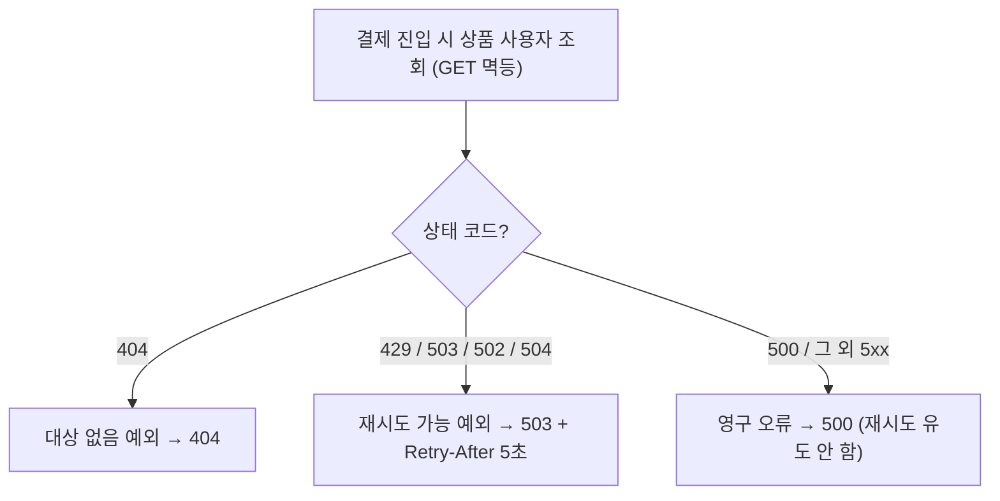
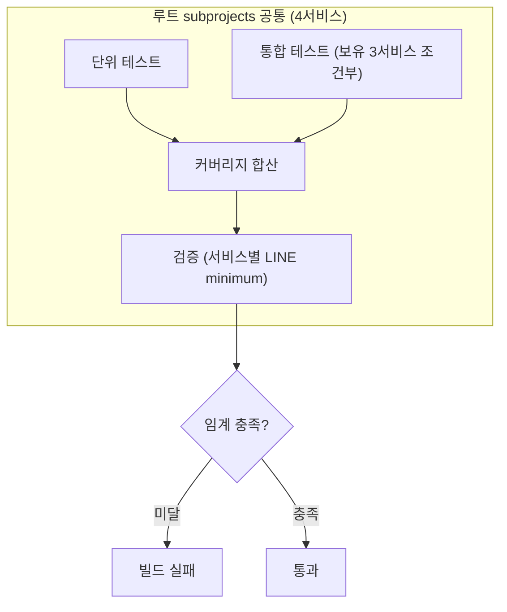

# CLEANUP-BATCH-B 완료 브리핑

> 빌드·테스트 게이트 위생 묶음. 이슈 #81 / 브랜치 #81 / 2026-05-30 ~ 2026-05-31.

## 작업 요약

이 작업은 코드 동작이 아니라 **빌드·테스트 게이트의 위생**을 다룬 세 갈래 묶음이다. 발단은 EOS-FOLLOWUP-CLEANUP verify 중 발견된 깨진 CI 게이트였다. `./gradlew :payment-service:spotbugsTest` 가 위반 5건으로 실패해 `./gradlew build` 전체가 BUILD FAILED 상태였는데, 그동안은 `test` 태스크만 돌려 노출되지 않았다. 여기에 CLEANUP-BATCH-A 후속으로 남아 있던 서비스 호출 실패 매핑 갭(NET-RETRY)과, 세션 중 사용자가 직접 관찰한 커버리지 게이트 무력 문제가 합류해 한 PR로 묶였다.

세 항목은 코드 거주지가 갈려(테스트 코드 / Feign 어댑터 / 빌드 스크립트) 서로 결합이 없지만, 모두 "`./gradlew build` GREEN" 이라는 단일 수락 조건에 수렴한다. (1) **spotbugs 5건**은 정적분석이 잡은 테스트 코드의 널 역참조 가능·외부 가변객체 저장을 가리킨다. (2) **NET-RETRY** 는 product/user-service HTTP 호출의 ErrorDecoder 가 게이트웨이 일시 장애(502/504)를 영구 오류(500)와 똑같이 노출하는 갭이다. (3) **JaCoCo 게이트** 는 검증 임계값이 없어 사실상 무력하고(no-op), 통합테스트 커버리지가 리포트에 반영되지 않으며, 설정이 payment-service 에만 있어 4서비스가 따로 노는 문제다.

접근은 6태스크 TDD/위생 정정으로, 빌드 복구 우선(A) → 독립 TDD(B) → 빌드 스크립트(C) 순서로 진행했다. 핵심 원칙은 **"억제가 아닌 코드 정정"**(spotbugs)과 **"측정 대상 정책 유지, 게이트만 실효화"**(커버리지)였다. 결과적으로 spotbugs 위반 0, 502/504 retryable 승격, 4서비스 커버리지 게이트 실효화를 달성하고 `./gradlew build` 가 4서비스 모두 GREEN 으로 회복됐다.

## 핵심 설계 결정

### D-SB1 / D-SB1-EI — spotbugs 5건 전부 코드 정정 (억제 금지)
- **결정**: exclude filter / `@SuppressFBWarnings` 를 쓰지 않고 코드로 위반을 없앤다.
- **근거**: 억제는 위반을 덮을 뿐 코드 품질을 올리지 않는다. 사용자가 discuss Round 0 에서 명시 확정.
- **구현 함정**: NP_NULL 4건(tearDown 의 `redisTemplate.getConnectionFactory().getConnection()...` 체인)을 처음엔 `Objects.requireNonNull` 로 정정했으나, **SpotBugs 6.0.9 가 `requireNonNull` 을 null-억제자로 인식하지 못해** NP_NULL 이 잔존했다(실측 확인). 명시적 `if (x == null) throw new IllegalStateException(...)` 가드로 바꾸자 SpotBugs 데이터플로우가 인식해 해소됐다.
- **대안 기각**: (a) exclude filter 억제 — D-SB1 위반. (b) `requireNonNull` — SpotBugs 미인식으로 효과 없음.

### D-SB1-EI — FakeMessagePublisher Throwable → Supplier 전환
- **결정**: `EI_EXPOSE_REP2`(외부 가변 `Throwable` 필드 저장)를 저장 구조 변경으로 해소. `AtomicReference<Throwable>`/`volatile Throwable` → `Supplier<? extends Throwable>`.
- **근거**: `Throwable` 은 방어적 복사가 불가능해 메인의 방어 복사 관용구를 못 쓴다. 예외 공급자를 저장하고 `send()` 에서 `supplier.get()` 으로 매번 새 인스턴스를 만들면 외부 가변 참조 보존이 사라진다.
- **대안 기각**: 메시지 문자열만 저장 — 호출부가 임의 예외 타입을 주입하던 유연성 상실.

### D-NR1a/b/c/d — 502/504 retryable 승격
- **D-NR1a**: 502 Bad Gateway / 504 Gateway Timeout 을 `*ServiceRetryableException`(503 + Retry-After:5)로 승격. 게이트웨이·프록시 일시 장애라 transient.
- **D-NR1b**: 500 은 비-retryable 유지(영구 오류, 무의미한 재시도 방지).
- **D-NR1c**: 429/503 분리하지 않고 단일 예외 유지(응답 동일, 예외 클래스 증식 최소화, 구분은 로그 status).
- **D-NR1d**: Retry-After(5s) vs checkout IN_PROGRESS 마커 TTL(10s) 어긋남 윈도우는 **수용**. supplier(product/user 조회)는 결제 레코드 생성 이전 단계라 금전 무해이고, 마커는 10초 후 자연 만료로 회복. Retry-After/TTL 정렬은 기존 retryable 경로 전체에 영향이라 범위 확대 — Phase 4/TODOS 후속.
- **안전 전제**: cross-service 호출이 GET 단건 조회 전용(비멱등 POST 0건)이라 retryable 승격이 중복 부작용을 만들지 않음. Feign 자동 재시도(Retryer) 부재로 자동 재호출도 없음.

### D-COV1/2/3 — 커버리지 게이트 실효화 (측정 대상 정책 유지)
- **D-COV1**: `jacocoTestCoverageVerification` 에 LINE `minimum` 추가(element=BUNDLE). 측정 대상(infra 제외)은 유지 — 사용자가 "정책 유지, 게이트만 실효화" 확정.
- **D-COV2**: `integrationTest` exec 를 `jacocoTestReport` 에 조건부 합산. 합산 없이는 통합 경로로만 커버되는 usecase 분기가 미달로 잡혀 게이트 거짓 실패.
- **D-COV3**: 설정을 루트 `subprojects` 로 공통화해 4서비스 정합, payment 개별 블록 제거.
- **element CLASS→BUNDLE** (구현 중 추가 결정): 클래스별 강제는 테스트 없는 관리 클래스가 0%면 전체 차단 → 번들 합산이 실측 기반 게이트와 의미 정합.
- **baseline**: "통합테스트 합산 실측 - 안전마진", 서비스별 편차 수용(payment 0.89 / pg 0.91 / product 0.40 / user 0.0). 현재 수치 동결이지 시나리오 누락 탐지는 아님.

### Gradle 8.10 → 8.14.4 (전제조건, 독립 커밋)
- 루트 `build.gradle` 수정 시 Groovy 스크립트 재컴파일이 트리거되는데, Gradle 8.10(Groovy 3.0.22 ASM)이 Java 24 bytecode(class major 68)를 읽지 못해 실패. C-1(루트 공통화)의 불가피한 전제. 관심사 분리해 독립 `build:` 커밋(사용자 승인).

## 변경 범위

### 테스트 코드 (spotbugs 정정)
- `StockCacheRedisAdapterTest` / `StockCompensationAtomicLuaTest` / `StockDecrementAtomicLuaTest` / `StockCompensationRecoveryIntegrationTest` — tearDown redis 체인을 중간 변수 분해 + `if-null-throw` 가드, `Objects` import 제거.
- `FakeMessagePublisher` — 저장 타입 `Supplier<? extends Throwable>` 전환, `send()` 에서 `supplier.get()`, `failNext()` lambda 화. main 계약(`MessagePublisherPort.send`) 시그니처 불변.

### Infrastructure (NET-RETRY)
- `ProductFeignConfig` / `UserFeignConfig` ErrorDecoder — 502/504 를 retryable 분기에 추가, 클래스 Javadoc 매핑 목록 갱신. `PaymentExceptionHandler` 무변경(기존 매핑 재사용).
- `ProductFeignConfigTest` / `UserFeignConfigTest` — 502/504 케이스 추가(각 2건).

### 빌드 스크립트 (커버리지)
- 루트 `build.gradle` — `subprojects` 에 jacoco 공통 블록(classDirectories 제외 + report + verification + integrationTest 조건부 합산) 신설.
- `payment-service/build.gradle` — 개별 jacoco 블록 제거, ext minimum 0.89. `pg/product/user build.gradle` — ext minimum 주입.
- `gradle/wrapper/gradle-wrapper.properties` — 8.14.4.

### 범위 밖 사전 부채 (독립 fix 커밋)
- `PgOutboxImmediateWorkerMdcPropagationTest`(NP_NULL) / `FakePgEventPublisher`(EI_EXPOSE_REP) / `FakeEventDedupeStoreTest`(DLS) — 4서비스 `build` 가 드러낸 기존 부채, 전부 코드 정정.

## 다이어그램

### 서비스 호출 실패 매핑 (to-be)

### 커버리지 게이트 (to-be)

## 코드 리뷰 요약

- **Domain Expert: pass** — 결제 정합성 위험 없음. 502/504 승격이 GET 조회 전용 경로에만 적용되고 confirm 사이클·결제 레코드 생성에 닿지 않음을 소스로 교차검증. Feign 자동 재시도 부재로 비멱등 재시도 0.
- **Critic: R1 revise → R2 pass**.
  - **major F1** (해소): C-2 커밋에 build GREEN 을 위한 pg/product 사전 부채 4건이 혼입 → 독립 `fix:` 커밋(19142957)으로 분리, C-2 본체(343a01f0)와 관심사 분리.
  - **minor**: element CLASS→BUNDLE(수용, 합리적) / user 0.0 무게이트(수용, 후속) / TODOS stale(verify 갱신) / infra 커버리지 집계 제외(수용, 테스트는 실행되어 회귀 가드 유효).

## verify CI 단계 발견·수정

verify 의 `./gradlew build` 는 로컬에서 GREEN 이었으나(payment-service UP-TO-DATE 캐시로 통합테스트 미재실행), PR #82 의 CI 에서 `integrationTest` 가 실패했다. 근본 인과는 이번 토픽 자체였다 — **C-1(jacocoTestReport→integrationTest dependsOn)이 ci.yml 의 `test jacocoTestReport` 를 통해 CI 에서 통합테스트를 처음 실행시켰고**, 그동안 CI 에서 안 돌아 숨어 있던 `PaymentEosIntegrationTest` 시나리오 #1 의 cold-start flaky 가 노출됐다. #1만 실패(`expected DONE but was IN_PROGRESS`)하고 #2~5 는 통과 — 첫 시나리오에서 consumer group join + Kafka tx coordinator 초기화 + partition assignment 가 처음 일어나며 `await(15초)` 를 초과한 것. setUp 에 consumer partition assignment 완료 대기를 추가(cold-start 를 await 밖으로 분리)해 해소했고, 부수적으로 ci.yml 에 JUnit 테스트 리포트 액션(`mikepenz/action-junit-report`)을 추가해 테스트 실패가 PR 에 가시화되도록 했다. 재실행 결과 CI 전체(Test & Coverage / Lint / JUnit Test Report) GREEN.

- `4f8bc6f3` test(payment): EOS 통합테스트 consumer assignment 대기 — `ContainerTestUtils.waitForAssignment` 대신 Awaitility 사용(Spring Context 공유로 실제 파티션 수가 가변이라 strict equality 회피)
- `52d42a40` build(ci): 테스트 실패 PR 리포트 코멘트 액션 추가

## 수치

| 항목 | 값 |
|------|---|
| 태스크 | 6개 (A-1/A-2/B-1/B-2/C-1/C-2) |
| 커밋 | 16개 (코드 8 + verify CI 수정 2 + docs 6) |
| 테스트 | payment 416 PASS + integrationTest 27 PASS, **CI 전체 GREEN**(Test & Coverage / Lint / JUnit Test Report) |
| spotbugs | 위반 0 (5건 전부 코드 정정, 억제 0) |
| 커버리지 게이트 | 4서비스 jacocoTestCoverageVerification PASS (음성 검증 완료) |
| 코드 리뷰 findings | critical 0 / major 1(해소) / minor 4 |
| verify CI 수정 | EOS #1 cold-start flaky 해소(consumer assignment 대기) + 테스트 실패 PR 가시화(JUnit 리포트 액션) |
| 후속 | user 게이트 0.0 / deprecated Groovy 문법 / infra 커버리지 집계 / Node.js 20 액션 deprecated (TODOS `[CLEANUP-BATCH-B 후속]`) |
