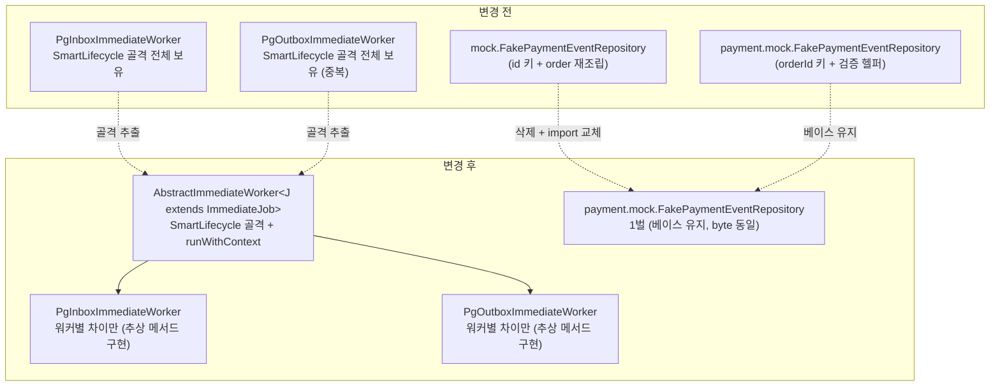

# CLEANUP-BATCH-C 완료 브리핑

> 완료일: 2026-06-13 / 이슈·브랜치 #98 / PR (아래 링크)

## 작업 요약

코드베이스 위생 자체는 양호했다 — TODO/FIXME 0건, 빈 catch 0건, 주석처리 코드 0건, 거대 클래스 없음(최대 337줄). 따라서 이번 작업은 "쓰레기 청소"가 아니라 **참조가 끊긴 미사용 코드 제거 + 반복 보일러플레이트 통합 + 테스트 헬퍼 위치 일관성 교정**이었고, 핵심 제약은 **동작 불변(behavior-preserving)**이었다.

전면 스캔으로 후보를 발굴한 뒤(CLEANUP-BATCH-A 영역분리 / B 게이트위생의 계보), 동작 불변 단일 PR로 5개 태스크를 실행했다: ① pg 벤더 호출 폐기 메서드(`callVendor`) 제거, ② 미사용 메서드 2건(`countTransitionsByStatusWithinWindow`, `PgOutbox.incrementAttempt`) 제거, ③ pg Immediate 워커 2종의 SmartLifecycle 보일러플레이트를 `AbstractImmediateWorker` 공통 base로 추출, ④ 이질 `FakePaymentEventRepository` 2벌을 `payment.mock` 1벌로 통합, ⑤ bounded-context 밖 `paymentplatform.mock` 디렉토리 제거 및 테스트 헬퍼 위치 교정.

결과적으로 데드 코드 3종이 grep 0건으로 사라졌고, 워커 중복 보일러플레이트가 공통 base로 수렴했으며, 테스트 Fake가 `<bounded>.mock` 규칙으로 일원화됐다. 전체 테스트 GREEN, 결제 정합성 동작은 불변(EOS 통합 5 시나리오 재실행 PASS).

## 핵심 설계 결정

| 결정 | 근거 | 기각된 대안 |
|---|---|---|
| 동작 불변 단일 PR | 정리 범위가 1 PR로 관리 가능, 리뷰 1회 | 위험도별 분리 PR |
| 미사용 포트 메서드(`findCurrent`/`findAllByStatus`) 보존 | 향후 조회/디버깅 대비, 호출 0이라 위험 없음(사용자 결정) | 제거 |
| B1 워커 헬퍼는 Immediate 2종 한정 | Polling 2종은 `@Scheduled` 별종 + DB-기반 traceparent 복원으로 메커니즘 상이 — 통합 시 PITFALL 12(부모 trace 단절) 재발 위험 | Polling 포함 4종 공통화 |
| B1은 template method(골격만 base) | 동시성 코드 가독성을 DRY보다 우선 | generic 워커 통합(디버깅 난이도 상승) |
| **B2 벤더 전략 헬퍼 제외** | plan 조사 결과 진짜 벤더 비종속이 상수 4개(`Authorization`/`Basic`/네트워크 에러)뿐 — basicAuth/parseError/parseApprovedAt은 시크릿·record·포매터가 벤더별이라 추출 시 결합 | 상수 4개 공통화(이득 미미 + 벤더가 공통 상수 의존) |
| **C1 Fake 통합은 `payment.mock` 베이스** | 두 Fake가 이질 구현(orderId 키+검증헬퍼 vs id 키+order재조립). 정합성 가드 8개가 `payment.mock` 의존, `mock` 유일 사용처는 mock-특수 의미론 미사용. payment.mock 베이스가 RED 탐지력 보존 + order 중복 append 함정 구조적 회피 | mock superset 베이스(가드 약화 + findByOrderId 중복 append로 amount 대조 오염) |
| 정합성 로직(D) 동작 불변 | EOS atomicity·보상·멱등 가드는 본질 복잡도 | 로직 단순화 |

## 변경 범위

| 영역 | 변경 |
|---|---|
| pg 데드 제거 | `PgVendorCallService.callVendor`(deprecated forRemoval, main 호출 0) 본체+Javadoc+애너테이션, `PgOutbox.incrementAttempt`(전수 스캔 발굴) |
| payment 데드 제거 | `PaymentHistoryRepository.countTransitionsByStatusWithinWindow` 포트+구현(+QueryDSL import 전량) |
| pg 워커 추출(신규) | `AbstractImmediateWorker<J extends ImmediateJob>`(scheduler) + `ImmediateJob` 인터페이스(channel, `InboxJob`/`OutboxJob` 구현) — SmartLifecycle 골격·`runWithContext` 이중 scope 복원을 base로, 워커별 차이는 추상 메서드 위임. Polling 2종 무변경 |
| pg 테스트 이전 | `callVendor` 회귀 테스트 → `invokeVendor`+`applyOutcome` 분리 경로로 동등 보존, `getPhase` characterization 단언 추가 |
| payment 테스트 정리 | `FakePaymentEventRepository` 2벌→`payment.mock` 1벌, `FakeIdempotencyStore`→`payment.mock` 이동, `FakeStockCachePortAtomicTest`→`payment.application` 이동, `paymentplatform.mock` 디렉토리 제거 |

## 다이어그램

## 코드 리뷰 요약

- **discuss 게이트**: 1R revise → 2R pass. 핵심 — C1을 "동일 클래스 중복"으로 오판했으나 이질 구현으로 밝혀져 "plan 1:1 대조 후 판단"으로 재정의, "동작 불변"을 characterization test 선행으로 검증 가능하게 보강, B1 워커 4종·traceparent 메커니즘 차이 정정, B2 추출 후보 정정.
- **plan 게이트**: 1R revise(reviewer) / pass(domain-expert) → 2R 둘 다 pass. 핵심 — Task 4 통합 방향을 `mock` 베이스 → `payment.mock` 베이스로 전환(두 게이트 수렴), B2 SSOT 모순 정정, Task 1 라인·Task 3 추출 범위 정밀화.
- **ship 코드 리뷰**: reviewer + domain-expert **둘 다 pass, findings 0건**. 5커밋 동작 불변 소스 교차검증 + EOS 통합 5 시나리오 강제 재실행 PASS. Task 3 추상화는 template method(generic 통합 아님)로 결정 부합, Task 4 통합본이 기존 payment.mock과 byte 동일, order 중복 append 함정(R3) 구조적 회피.

상세 finding별 처리는 `CLEANUP-BATCH-C-PLAN.md`의 `## plan 게이트 처리` / `## 리뷰 처리`, `CLEANUP-BATCH-C-CONTEXT.md`의 `## discuss 게이트 처리` 참조.

## 수치

- **태스크**: 5개 (전부 tdd=false, 동작 불변)
- **테스트**: 전체 GREEN — payment 512 / pg 310 단위, payment 통합 34 (재실행 GREEN). EOS 통합 5 시나리오 PASS
- **코드 커밋**: 5 (refactor) — `b2011acf` / `acd59cd7` / `1903d9f1` / `ec719a0f` / `096ec1f3`
- **데드 제거**: 3종 grep 0건 (`callVendor`, `countTransitionsByStatusWithinWindow`, `incrementAttempt`)
- **findings**: discuss 1R 5건 / plan 1R 5건 (전부 반영) / **ship 0건**
- **관측 이슈**: 전체 빌드 동시 실행 시 payment 통합테스트 Flyway 경합 flaky(`:payment-service:integrationTest` 격리 실행은 34건 GREEN, 컨테이너 정리로 미해소) → CONCERNS.md C-11 등재. 이번 작업 변경 파일과 무관(dedupe/compensation)
