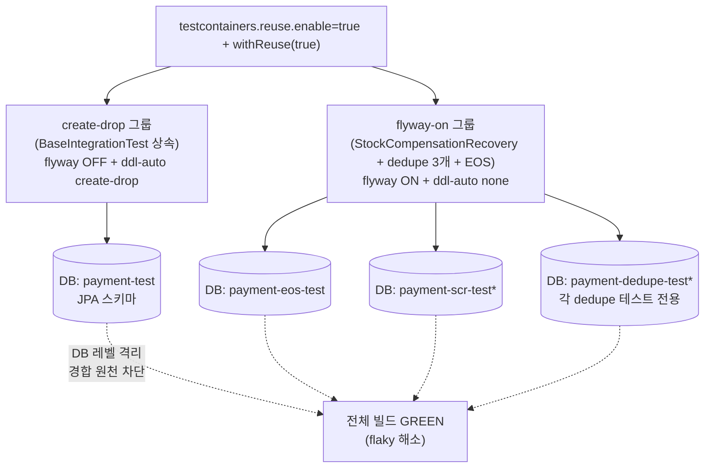
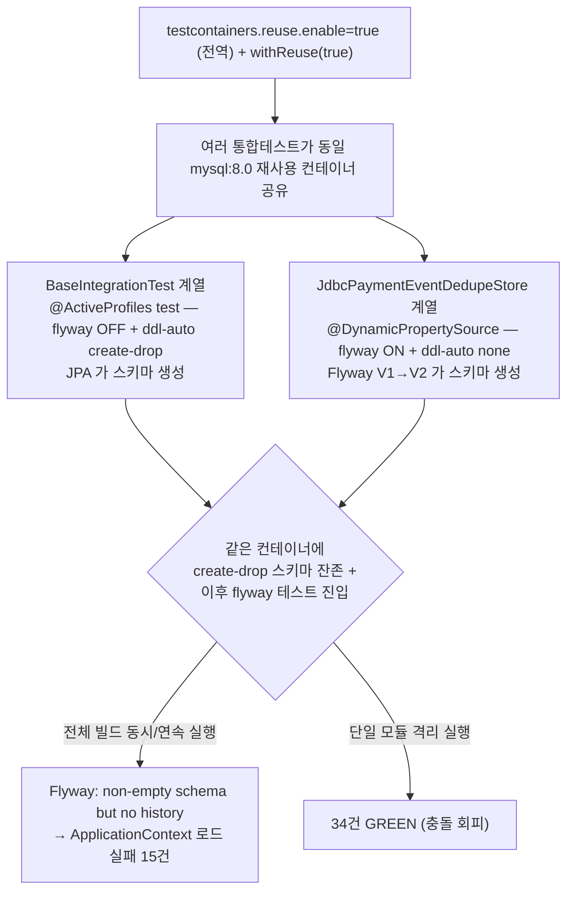

# CLEANUP-BATCH-D — 빌드·테스트 위생 청소 설계

> 최종 수정: 2026-06-14

---

## 요약 브리핑

### 결정된 접근

빌드·테스트 위생 3건 + 게이트 검수에서 발견한 product 운영 누락 1건을 단일 PR 로 정리한다. (1) **C-11** — payment 통합테스트의 Flyway 그룹에 create-drop 그룹(`payment-test`)과 다른 전용 DB명을 부여해 reuse 컨테이너 내 스키마 관리 방식 경합을 DB 레벨에서 격리(`PaymentEosIntegrationTest` 의 `payment-eos-test` 선례 일반화). (2) **GROOVY** — `build.gradle` 5곳의 `events` 공백 할당을 `= [...]` 리스트 할당으로. (3) **SCHED-DOC** — dedupe cleanup 스케줄러의 활성화 게이트(`SchedulerConfig`)와 payment/product 활성 매트릭스를 STACK.md 에 문서화. (4) **product 스케줄러 정상화** — product `application-docker.yml` 에 `scheduler.enabled: true` 를 추가해 운영 docker 에서 만료행 청소가 실제로 돌게 한다(현재 어떤 표준 배포에서도 미기동인 누락 복구).

### 변경 후 동작 (C-11 to-be)

> `*` 구체 DB명은 plan 에서 확정. 원칙: flyway-on 통합테스트는 각자 전용 DB명, create-drop 만 `payment-test` 점유.

### 핵심 결정 목록

- **C-11 = DB명 분리(근본)** — flyway-on 그룹(StockCompensationRecovery + dedupe 3개)에 전용 DB명. create-drop(`payment-test`)·EOS(`payment-eos-test`)는 무변경. baseline-on-migrate(증상 완화)는 마이그레이션 검증 무력화로 기각.
- **dedupe 3개 = 각자 전용 DB명** — `@BeforeEach TRUNCATE` + `COUNT(*)` 전수 카운트라 공유 시 오염 위험.
- **GROOVY = `events` 5곳만** — 전수 스캔 결과 다른 deprecated 패턴 없음.
- **SCHED-DOC = STACK.md** — 게이트는 `SchedulerConfig`(worker 아님), payment(docker/benchmark 활성)/product(현재 전무 → 활성화) 매트릭스 명시.
- **product `scheduler.enabled: true` 추가** — 운영 docker 만료행 청소 정상화(유일한 운영 설정 변경, 도메인 무관).

### 트레이드오프 / 후속 작업

- product 활성화는 **단일 인스턴스 전제**. scale-out 동시 cleanup 은 멱등(돈/재고 무관)이나 분산 락은 후속(TODOS 멀티 인스턴스 묶음).
- "운영 코드 변경 0" 원칙은 product yml 1줄(누락 복구)로 예외 — 도메인/상태전이/멱등성/PG 는 0 라인.
- CI Node20 항목은 이미 해소 → TODOS stale 정정만 동반.
- ship 시 CONCERNS C-11 해소 이동 + TODOS product 청소 봉인 정정.

---

## 사전 브리핑

### 현재 이해한 문제

빌드·테스트 인프라에 누적된 위생 잔여 3건을 정리한다. (1) 전체 빌드에서 여러 통합테스트가 같은 재사용 DB 컨테이너를 공유하다 Flyway baseline 충돌로 간헐 실패(C-11), (2) Gradle 빌드 스크립트의 deprecated 공백 할당 문법 잔여(Gradle 10 제거 예정), (3) 만료행 청소 스케줄러의 활성화 정책이 코드에만 있고 문서화 안 됨. 모두 운영 코드 동작과 무관한 빌드/테스트/문서 레벨 정리다.

### 현재 통합테스트 컨테이너 공유 구조 (as-is, C-11)

### 발굴된 항목 상세

| ID | 항목 | 근거 | 성격 |
|---|---|---|---|
| C-11 | 통합테스트 Flyway 경합 flaky | reuse 컨테이너에 ddl-auto 스키마(history 없음) + flyway 테스트 충돌. 격리 실행은 GREEN, 전체 빌드 15건 실패 | 테스트 인프라 |
| GROOVY | `events "passed", "skipped", "failed"` 공백 할당 5곳 (루트 + payment/pg/product/user build.gradle) | Gradle 8 deprecated, 10 제거 예정 → `= ['passed', ...]` | 빌드 스크립트 |
| SCHED-DOC | `DedupeCleanupWorker` 활성화 정책 미문서화 | payment/product `@ConditionalOnProperty scheduler.enabled`, 기본 프로파일 미기동 — 어느 배포/프로파일에서 켜는지 문서 없음 | 문서화 |

### 이번 discuss에서 결정하려는 것

- **C-11 해결 수위**: (a) 증상 완화 — flyway 켜는 테스트에 `baseline-on-migrate: true` (b) 근본 — 통합테스트 컨테이너 격리/프로파일 일관화 (c) 절충
- **GROOVY 범위**: `events` 5곳만인지, 다른 deprecated 공백 할당까지 전수 스캔할지
- **SCHED-DOC 위치**: 어느 문서에 스케줄러 활성화 정책을 적을지 (STACK / ARCHITECTURE / 운영 가이드)
- **산출물 단위**: 단일 PR
- **브랜치 베이스**: #98(CLEANUP-BATCH-C) 미머지 — main 분기 vs #98 stacked

### 열린 질문 / 가정

- (가정) 모든 변경은 운영 코드 동작 무관 — 빌드/테스트/문서 레벨. `./gradlew build` 전체 GREEN(통합 포함, flaky 없이)이 기준.
- (가정) TOPIC은 `CLEANUP-BATCH-D` (A 영역분리 / B 게이트위생 / C 코드정리 계보).
- ~~(질문) C-11을 어디까지~~ → **DB명 분리(근본)** 로 확정. reuse 유지. (아래 결정 사항)
- ~~(질문) #98 미머지 상태에서 브랜치 베이스~~ → #98(CLEANUP-BATCH-C) **머지 완료** 확인. main 분기.
- ~~(가정) CI Node20 액션 업그레이드~~ → 이미 해소됨(checkout@v6 / setup-java@v5 / upload-artifact@v7 / setup-gradle@v6 / action-junit-report@v6). TODOS 문서만 stale. **본 토픽 범위 밖**, TODOS 정정만 동반.

---

## 문제 정의

빌드·테스트 인프라에 누적된 위생 잔여 3건. 모두 운영 코드 동작과 무관(빌드 스크립트 / 테스트 인프라 / 문서 레벨).

| ID | 문제 | 영향 |
|---|---|---|
| **C-11** | 전체 빌드 시 payment-service 통합테스트가 `Found non-empty schema(s) 'payment-test' but no schema history table` 로 ApplicationContext 로드 실패(연쇄 다수). 단일 모듈 격리 실행은 GREEN | 로컬 전체 빌드 flaky, 회귀로 오인. CI 는 서비스별 fan-out + test-retry 라 영향 적음 |
| **GROOVY** | `events "passed", "skipped", "failed"` 공백 할당 5곳(root + payment/pg/product/user) — Gradle 8 deprecated, 10 제거 예정 | 빌드 경고. Gradle 10 업그레이드 시 빌드 실패 |
| **SCHED-DOC** | dedupe cleanup 스케줄러 활성화 정책 미문서화 **+ product 운영 미작동 누락(게이트 검수에서 발견)**. 활성화 게이트는 `SchedulerConfig`(`@EnableScheduling` + `@ConditionalOnProperty scheduler.enabled`). payment 는 docker/benchmark 에서 활성이나 **product 는 application.yml·application-docker.yml·compose env 어디에도 `scheduler.enabled=true` 가 없어 운영 docker 포함 어떤 표준 배포에서도 영영 미기동** | product `stock_commit_dedupe` 만료행 운영 무한 누적(돈 사고 아님, 멱등성 보존 / 인덱스 비대 → 쿼리 성능 저하). TODOS "product 청소 ✅완료" 봉인과 실제 동작 괴리 |

### C-11 근본 원인 (코드 확인 완료)

payment-service 통합테스트가 두 스키마 관리 방식으로 갈리는데 **같은 reuse 컨테이너의 같은 DB명(`payment-test`)** 을 공유한다.

- **create-drop 그룹** — `BaseIntegrationTest` 상속분. `@ActiveProfiles("test")` → `application-test.yml` 의 `flyway.enabled=false` + `ddl-auto: create-drop`. JPA 가 스키마 생성. DB명 `payment-test`.
- **flyway-on 그룹** — `@DynamicPropertySource` 로 `flyway.enabled=true` + `ddl-auto=none` override. Flyway V1→V2 가 스키마 생성. 대상 4건:
  - `StockCompensationRecoveryIntegrationTest` — DB명 `payment-test` ← **충돌**
  - `JdbcPaymentEventDedupeStoreTest` / `...RoundTripTest` / `...CleanupTest` — DB명 `payment-test` ← **충돌**
  - `PaymentEosIntegrationTest` — DB명 `payment-eos-test` ← **이미 분리됨(선례)**

같은 DB 에 한쪽은 create-drop(history 테이블 없는 스키마), 다른쪽은 Flyway 가 번갈아 진입 → Flyway 가 history 없는 non-empty 스키마를 만나 실패. `PaymentEosIntegrationTest` 가 이미 `payment-eos-test` 로 분리해 회피한 것이 동일 문제의 선례 + 처방 증거다.

### SCHED-DOC 현 동작 (게이트 검수 후 정정, 코드 실측)

- **활성화 게이트 위치**: `DedupeCleanupWorker` 자체는 `@Component` + `@Scheduled` 만 가짐. 활성/비활성을 결정하는 것은 `SchedulerConfig`(`@EnableScheduling` + `@ConditionalOnProperty(name="scheduler.enabled", havingValue="true")`, matchIfMissing 기본 false). `scheduler.enabled=true` 일 때만 `@EnableScheduling` 이 적용되어 그 안의 모든 `@Scheduled` worker 가 동작한다.
- **payment-service**: `application-docker.yml` / `application-benchmark.yml` 에 `scheduler.enabled: true` 존재 → 운영(docker) / 벤치마크에서 활성. default `application.yml`(IDE 로컬)은 미명시 → 비활성(의도).
- **product-service**: `application.yml`·`application-docker.yml`·compose env 어디에도 `scheduler.enabled` 키가 없음(benchmark 프로파일 자체 부재) → **운영 docker 포함 어떤 표준 배포에서도 비활성**. product `stock_commit_dedupe` 만료행이 운영에서 무한 누적된다. 이는 TODOS TC-13-FOLLOW-2/TC-11 "product 청소 ✅완료" 봉인과 어긋나는 **운영 누락**으로 판단 → 본 토픽에서 정상화(아래 결정).

---

## 영향 범위

| 레이어/파일 | 변경 | 비고 |
|---|---|---|
| `payment-service/src/test/.../StockCompensationRecoveryIntegrationTest.java` | `withDatabaseName` 분리 | flyway-on, 현재 `payment-test` |
| `payment-service/src/test/.../infrastructure/dedupe/JdbcPaymentEventDedupeStore{,RoundTrip,Cleanup}Test.java` | `withDatabaseName` 분리 | flyway-on 3건, 현재 `payment-test` |
| `payment-service/src/test/.../core/test/BaseIntegrationTest.java` | **무변경** | create-drop 그룹 SoT. `payment-test` 유지 |
| `payment-service/src/test/.../PaymentEosIntegrationTest.java` | **무변경** | 이미 `payment-eos-test` 분리 (선례) |
| `build.gradle` (root + payment/pg/product/user) | `events` 공백 할당 → `= [...]` | 5곳. eureka/gateway 는 해당 블록 없음 |
| `product-service/src/main/resources/application-docker.yml` | `scheduler.enabled: true` 추가 | **운영 코드(설정) 변경** — product cleanup worker 정상화 |
| `docs/context/STACK.md` | 스케줄러 활성화 정책 절 추가(게이트 = SchedulerConfig, payment/product 활성 매트릭스) | SCHED-DOC |
| `docs/context/TODOS.md` | CI Node20 항목 stale 정정 + product 청소 봉인 정정 | 동반 문서 정리 |
| `docs/context/CONCERNS.md` | C-11 해소 이동, product 청소 누락 관련 정정 | ship 시 동기화 |
| **운영 코드 (main, product yml 외)** | **무관** | 도메인/상태전이/멱등성/PG 0 라인 |

---

## 설계 옵션 비교 (C-11)

| 옵션 | 방식 | 장점 | 단점 | 채택 |
|---|---|---|---|---|
| **A. DB명 분리** | flyway-on 그룹이 create-drop(`payment-test`)과 다른 전용 DB명 사용 | 충돌 원천 차단(DB 레벨 격리), reuse 이득 유지, **선례(`payment-eos-test`)와 일관**, 운영 무관 | DB명만큼 reuse 컨테이너 증가(메모리) | ✅ |
| B. baseline-on-migrate=true | flyway-on 그룹에 옵션 추가 | 최소 변경 | history 없는 스키마를 baseline V1 로 마킹 → V1/V2 미적용 → 마이그레이션 검증 무력화 | ✗ |
| C. reuse 비활성/직렬화 | 통합테스트 reuse off 또는 모듈 직렬 실행 | 충돌 확실 회피 | 컨테이너 매번 재기동 → 빌드 현저히 느려짐 | ✗ |

---

## 결정 사항

| 항목 | 결정 | 이유 |
|---|---|---|
| C-11 처방 | **DB명 분리** — flyway-on 통합테스트는 create-drop 점유 `payment-test`와 다른 전용 DB명 사용 | DB 레벨 격리로 스키마 관리 방식 경합 원천 제거. `PaymentEosIntegrationTest`(`payment-eos-test`) 선례와 일관 |
| C-11 분리 규칙 SSOT | "Flyway 를 켜는 payment 통합테스트는 자기 전용 DB명을 갖는다. create-drop 그룹만 `payment-test` 를 점유한다." | 향후 flyway-on 테스트 추가 시 동일 규칙 적용 → 회귀 방지 |
| create-drop 그룹 | `payment-test` 유지(무변경) | SoT 고정. 변경 최소화 |
| dedupe 3개 DB명 | **각자 전용 DB명 분리** (공유 안 함) | 3개 모두 `@BeforeEach TRUNCATE` + `COUNT(*)` 전수 카운트 검증 → 같은 DB 공유 시 reuse 컨테이너에서 한 클래스 TRUNCATE 가 타 클래스 데이터 오염 → 카운트 단정 흔들림. C-11 SSOT("flyway-on 테스트는 자기 전용 DB명")와 일관. (게이트 양측 minor 수렴) |
| GROOVY 범위 | `events` 공백 할당 5곳만 → `= ['passed', 'skipped', 'failed']`. 전수 스캔 결과 다른 deprecated 패턴 없음(`exceptionFormat` 등은 이미 `=`) | 발굴 완료. 범위 확정 |
| SCHED-DOC 내용 | `SchedulerConfig` 게이트 메커니즘 + payment/product 활성화 매트릭스를 `docs/context/STACK.md` 에 문서화. 서술은 코드 실측 기준(게이트는 SchedulerConfig, worker 아님) | 스케줄러 활성화는 프로파일/배포(운영 설정) 영역 → STACK 자연스러움. 게이트 검수에서 worker/SchedulerConfig 혼동 정정 |
| **product 스케줄러 활성화** | product `application-docker.yml` 에 `scheduler.enabled: true` 추가 → 운영 docker 에서 cleanup worker 정상 기동 | 게이트 검수에서 product 운영 미작동 누락 발견. "이 김에 활성화"(사용자 결정). 만료행 운영 무한 누적 해소 |
| CI Node20 항목 | 본 토픽 범위 밖. TODOS stale 정정만 동반 | 이미 액션 최신화 완료(grep 확인). 재작업 불필요 |
| 산출물 단위 | 단일 PR | 위생 청소 3건 + product 스케줄러 정상화 1건, 영역 분리 |
| 브랜치 베이스 | main (#98 머지 완료) | 분기 충돌 없음 |

---

## 검증 전략

- **C-11**: 핵심은 *전체 빌드*에서 재현되는 flaky. `./gradlew :payment-service:test :payment-service:integrationTest` 단독은 원래 GREEN이라 회귀 가드가 안 됨. **`./gradlew build`(전체 모듈 통합 동시 기동)** 를 기준으로 검증하되, flaky 특성상 캐시 UP-TO-DATE 회피 위해 `--rerun-tasks` 또는 clean build 로 수회 반복 GREEN 확인. (verify 캐시 함정 인지: 통합테스트가 UP-TO-DATE 면 실제 미실행)
- **GROOVY**: `./gradlew help --warning-mode=all` 또는 빌드 시 deprecation 경고에서 `events` 관련 메시지 소거 확인.
- **product 스케줄러 활성화**: `application-docker.yml` 에 `scheduler.enabled: true` 적용 후, product Spring 컨텍스트에서 `SchedulerConfig` 빈이 등록되고 `DedupeCleanupWorker` 가 기동하는지 통합/기동 검증. 기존 product 테스트 회귀 없음 확인(`./gradlew :product-service:test`).
- **SCHED-DOC**: 문서 변경 — 리뷰 검수. 서술이 코드 실측(SchedulerConfig 게이트, payment/product 매트릭스)과 일치하는지 확인.

---

## 제외 범위 (non-goals)

- **운영 코드(도메인/상태전이/멱등성/PG) 변경 0** — payment 도메인 로직, 결제 상태 전이, 멱등 마킹, PG 연동 어느 것도 건드리지 않는다. **유일한 운영 설정 변경은 product `application-docker.yml` 의 `scheduler.enabled: true` 1줄**(누락 복구, 동작 정상화).
- **payment 스케줄러 정책 변경 안 함** — payment 는 현 동작(docker/benchmark 활성, IDE 로컬 비활성) 유지. 문서화만.
- **CI 액션 업그레이드** — 이미 완료됨. 재작업 안 함.
- **다른 모듈(user/pg) 통합테스트 격리** — payment-service C-11 한정. product/user `FlywayDockerProfileTest` 는 현재 충돌 미관측이라 범위 밖.
- **create-drop → Flyway 일원화** — payment 통합테스트 스키마 관리 방식 통일은 변경 범위 과대 + TC-8 시대 결정 번복. 본 토픽은 DB명 분리로 격리만.
- **C-11 의 멀티 모듈 동시 기동 race 자체 제거** — DB명 분리로 *증상(스키마 경합)* 을 제거하는 것이지 Testcontainers 멀티 모듈 동시성 모델을 바꾸지 않는다.
- **product 스케줄러 multi-instance 분산 락** — product 는 `container_name` 미지정(scale-able)이라 scale-out 시 여러 인스턴스가 cleanup worker 를 동시 실행할 수 있다. 단 `deleteExpired(expires_at < now)` 는 멱등(돈/재고 흐름 무관, TTL P8D > Kafka retention 7d 불변식상 삭제 대상은 이미 재배달 윈도우 밖)이라 사고 아님. **단일 인스턴스 운영 전제**, 분산 락은 후속(CONCERNS L-5 계열 / TODOS TC-13-FOLLOW-1 멀티 인스턴스 묶음). 활성화는 multi-instance 안전성을 주장하지 않는다.

---

## 참고

- 근거: `docs/context/CONCERNS.md` C-11, `docs/context/TODOS.md` [CLEANUP-BATCH-B 후속] (Groovy 문법 / CI 액션), [SCHEDULER-ENABLED-GATE]
- 선례: `PaymentEosIntegrationTest` (`payment-eos-test` DB명 분리)
- 계보: CLEANUP-BATCH-A(영역분리) → B(게이트위생) → C(코드정리) → **D(빌드·테스트 위생)**
