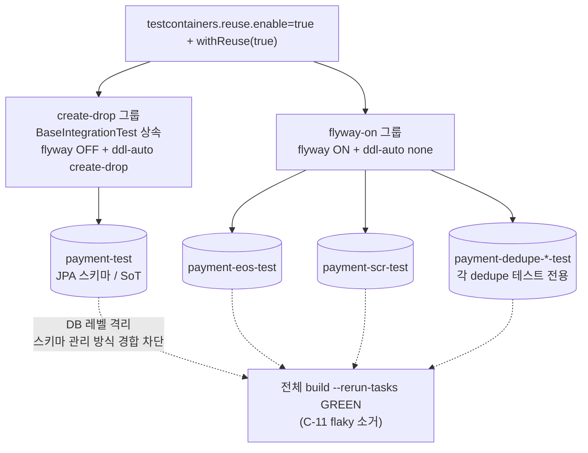

# CLEANUP-BATCH-D — 완료 브리핑

> 봉인: 2026-06-14 / 이슈·브랜치 #100 / 계보: CLEANUP-BATCH-A(영역분리) → B(게이트위생) → C(코드정리) → **D(빌드·테스트 위생)**

## 작업 요약

빌드·테스트 인프라에 누적된 위생 잔여 3건을 정리하는 청소 토픽으로 출발했다. (1) 전체 빌드에서 payment-service 통합테스트가 재사용 DB 컨테이너를 공유하다 스키마 관리 방식 충돌로 간헐 실패하던 flaky(C-11), (2) Gradle 8 deprecated 공백 할당 문법(Gradle 10 제거 예정), (3) 만료행 청소 스케줄러 활성화 정책이 코드에만 있고 문서가 없던 점이다.

discuss 게이트(reviewer + domain-expert) 검수 과정에서 **설계 단계엔 없던 실제 운영 누락**이 드러났다. dedupe cleanup 스케줄러의 활성화 게이트는 worker 가 아니라 `SchedulerConfig`(`@EnableScheduling` + `@ConditionalOnProperty scheduler.enabled`)에 있는데, **product-service 는 `scheduler.enabled=true` 가 `application.yml`·`application-docker.yml`·compose env 어디에도 없어 운영 docker 포함 어떤 표준 배포에서도 cleanup worker 가 기동하지 않았다.** payment 는 docker/benchmark 에서 정상 활성. TODOS 는 TC-11 / TC-13-FOLLOW-2 로 "product 청소 ✅완료" 봉인돼 있었으나 worker·게이트만 구현되고 활성화 플래그가 누락돼 실제로는 운영 미작동이던 것이다. product `stock_commit_dedupe` 만료행이 운영에서 무한 누적되는 상태였다. 사용자 판단으로 "이 김에 활성화"를 본 토픽에 포함해, 위생 청소 3건 + 운영 누락 복구 1건으로 범위가 확정됐다.

C-11 의 근본 원인은 코드 실측으로 확정됐다. payment 통합테스트는 create-drop 그룹(`@ActiveProfiles("test")`, JPA 가 스키마 생성)과 flyway-on 그룹(`@DynamicPropertySource` 로 Flyway 가 스키마 생성)으로 갈리는데, `withReuse(true)` 재사용 컨테이너에서 둘이 같은 DB명 `payment-test` 를 공유했다. create-drop 이 만든 history 테이블 없는 스키마에 Flyway 가 진입하면 `Found non-empty schema but no schema history table` 로 ApplicationContext 로드가 깨진다. `PaymentEosIntegrationTest` 가 이미 `payment-eos-test` 로 DB명을 분리해 회피한 것이 동일 문제의 선례이자 처방 증거였다. 처방은 이 선례를 일반화 — flyway-on 통합테스트가 각자 전용 DB명을 갖고 create-drop 그룹만 `payment-test` 를 점유하도록 DB 레벨에서 격리했다.

execute 는 4태스크 전부 tdd=false·domain_risk=false 로 진행해 GREEN 수렴했고, ship 코드 리뷰에서 STACK.md 스케줄러 절의 문서 정확성 finding(major 2 + minor 1)을 잡아 정정했다. 전체 `./gradlew build --rerun-tasks`(Docker 기동, 캐시 회피)로 C-11 flaky 재현 소거를 확인했다.

## 핵심 설계 결정

| 결정 | 근거 | 기각된 대안 |
|---|---|---|
| C-11 = **DB명 분리**(flyway-on 그룹 전용 DB명, create-drop 만 `payment-test`) | DB 레벨 격리로 스키마 관리 방식 경합 원천 제거. `PaymentEosIntegrationTest` 선례와 일관. reuse 이득 유지, 운영 무관 | **baseline-on-migrate=true**: history 없는 스키마를 baseline V1 로 마킹 → V1/V2 마이그레이션 검증 무력화. **reuse 비활성/직렬화**: 빌드 현저히 느려짐 |
| dedupe 3개 = **각자 전용 DB명** | 3개 모두 `@BeforeEach TRUNCATE` + `COUNT(*)` 전수 카운트라 같은 DB 공유 시 reuse 컨테이너에서 카운트 오염 | DB명 공유(plan 검토 후 기각) |
| product **`scheduler.enabled: true`** 운영 활성화 | 게이트 검수에서 운영 미작동 누락 발견. cleanup 은 `expires_at < now` 멱등 DELETE(TTL P8D > Kafka retention 7d 불변식)라 결제 도메인 무관 | "현 동작 문서화만"(non-goals 고수): 운영 누락을 방치 → 사용자가 활성화 선택 |
| SCHED-DOC = **STACK.md** | 스케줄러 활성화는 프로파일/배포(운영 설정) 영역 | ARCHITECTURE / CONFIRM-FLOW |
| GROOVY = `events` 5곳만 | 전수 스캔 결과 다른 deprecated 공백 할당 없음(`exceptionFormat` 등 이미 `=`) | — |

## 변경 범위

**테스트 (payment-service, C-11)** — flyway-on 통합테스트 4개 `withDatabaseName` 분리:
- `StockCompensationRecoveryIntegrationTest` → `payment-scr-test`
- `JdbcPaymentEventDedupeStoreTest` → `payment-dedupe-test`
- `JdbcPaymentEventDedupeStoreRoundTripTest` → `payment-dedupe-roundtrip-test`
- `JdbcPaymentEventDedupeStoreCleanupTest` → `payment-dedupe-cleanup-test`
- `BaseIntegrationTest`(`payment-test`)·`PaymentEosIntegrationTest`(`payment-eos-test`) **무변경**

**빌드 (GROOVY)** — `build.gradle` 5곳(root + payment/pg/product/user) `events "passed", "skipped", "failed"` → `events = ['passed', 'skipped', 'failed']`

**설정 (운영 누락 복구)** — `product-service/src/main/resources/application-docker.yml` 에 `scheduler.enabled: true` 추가 (운영 코드 변경은 이 1줄이 유일, 도메인/상태전이/멱등성/PG 0라인)

**문서** — STACK.md 스케줄러 활성화 정책 절 신설(게이트=`SchedulerConfig`, 서비스별 활성 매트릭스, 역할별 목록) / TODOS stale·봉인 정정 / CONCERNS C-11 해소 봉인 / TESTING.md Testcontainers reuse 현실 + DB명 분리 규칙 반영

## 다이어그램

## 코드 리뷰 요약

ship 코드 리뷰 (reviewer + domain-expert, 브랜치 #100 diff):

- **domain-expert: pass** (findings 0) — product cleanup 활성화 멱등성(TTL P8D > Kafka retention 7d 불변식)·재고 정합·테스트 커버리지 무손상 확인. 만료행 DELETE 는 돈/재고 흐름 무관.
- **reviewer: revise → 재리뷰 pass** — STACK.md 스케줄러 절 문서 정확성 major 2건:
  1. `OutboxAsyncConfirmService outbox 폴링`(사실 오류, `@Scheduled` 없음) → `OutboxWorker`(outbox PENDING 폴링·Kafka 발행) 정정. 커밋 `527d0272`.
  2. pg-service 스케줄러 누락(pg 는 `PgServiceConfig` `@EnableScheduling` 만, 게이트 없이 항상 활성) → 매트릭스 pg 행 추가 + 서비스×열 재구조. 커밋 `527d0272`.
  - minor 1건: 역할 목록 metrics 클래스 누락 → payment metrics 3종 보강(게이트 종속 뉘앙스 포함). 커밋 `3406803f`.

## 추가 처리 — TESTING.md stale 정정 (ship 후 흡수)

ship 코드 리뷰 중 발견한 TESTING.md stale 2건을 본 PR 에서 함께 정정:
- "LocalDateTimeProvider 주입" 절 → "시각 추상화 — Clock 주입" 으로 교체. 자체 포트 `LocalDateTimeProvider`/`SystemLocalDateTimeProvider` 폐기(grep 0, main 코드 0건 실측) + `Clock` 빈(`ClockConfig`) 주입·도메인 `Instant` 인자 전달·테스트 `TestClock` 고정 반영.
- "현재 테스트 카운트"(589, 2026-04-27) → 2026-06-14 실측(단위 873 / 통합 48)으로 갱신 + 회귀 본질은 카운트가 아닌 pass/fail 임을 명시.

## 수치

- **태스크**: 4 (전부 tdd=false·domain_risk=false)
- **테스트**: `./gradlew build --rerun-tasks` BUILD SUCCESSFUL — payment 512(단위)+34(통합) / product 44+6 / user +1 등 전건 GREEN, C-11 재현 0. 린트(checkstyle/spotbugs) 통과
- **커밋**: 본 작업 8 (discuss/plan docs 2 + execute 4 + ship 수정 2; minor 보강 1 포함 시 3) — execute: `9cc9fa26`(C-11) / `b0ae861d`(GROOVY) / `42e145db`(product scheduler) / `22052ef6`(SCHED-DOC). ship 수정: `527d0272` / `3406803f`
- **findings**: critical 0 / major 2(해소) / minor 1(보강)
