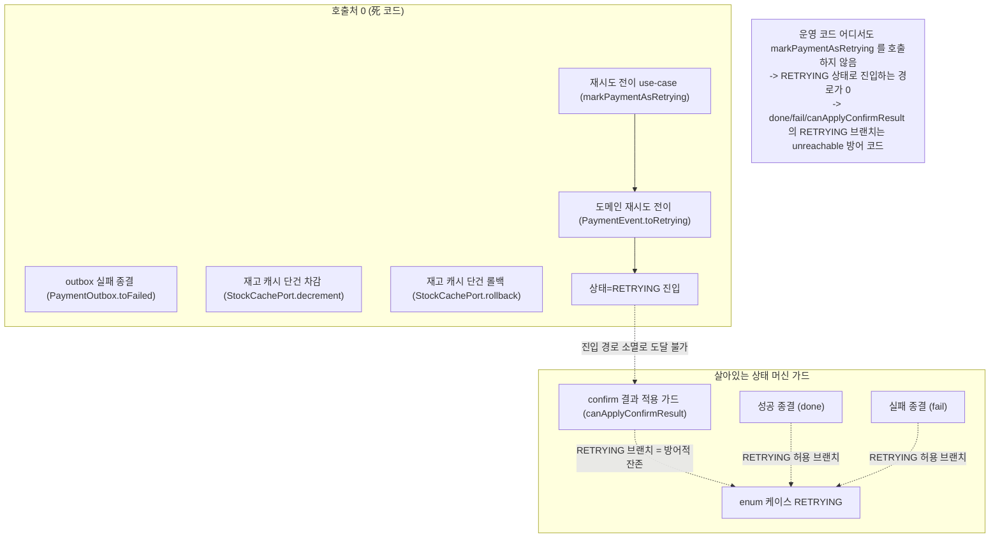
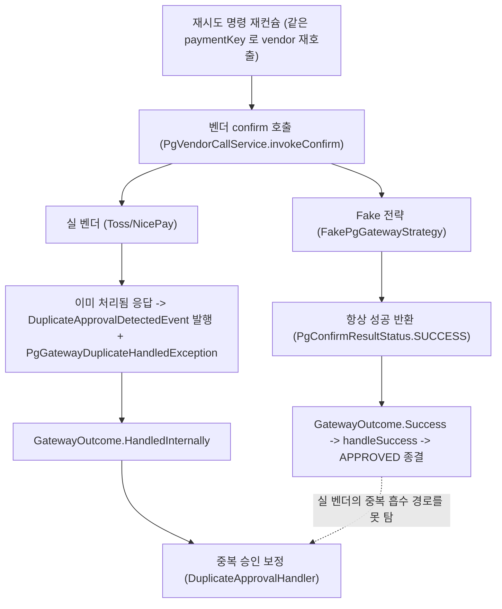
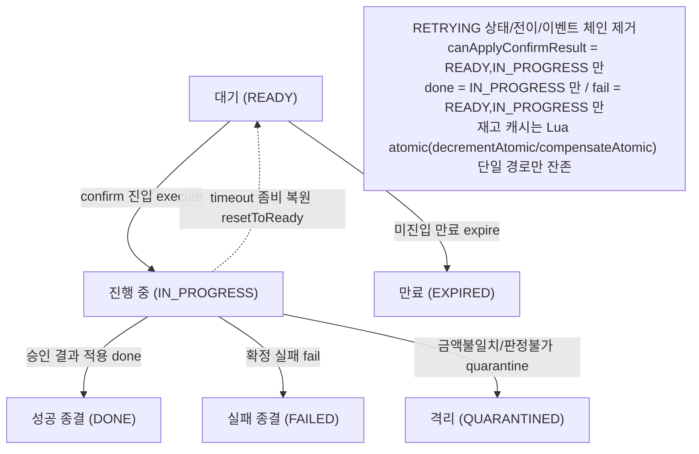
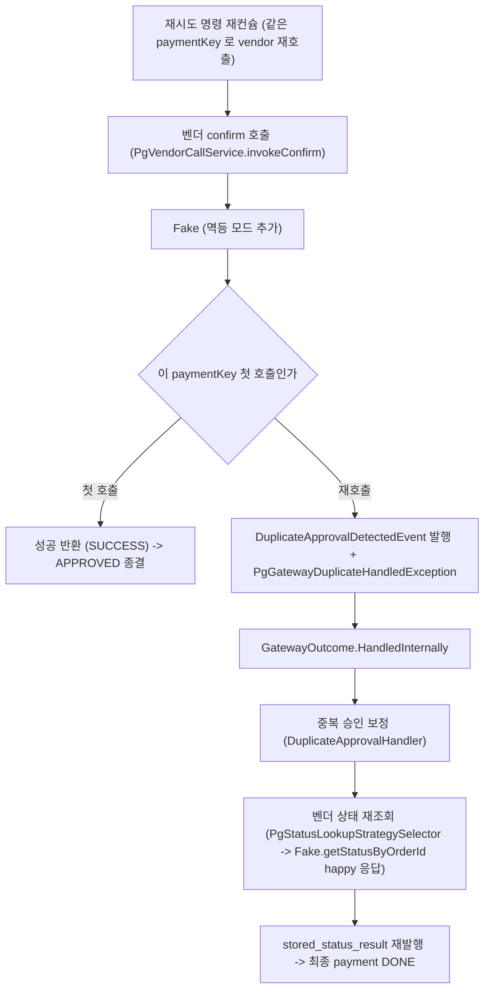

# CLEANUP-BATCH-E 설계

> 최종 수정: 2026-06-21

## 사전 브리핑

### 현재 이해한 문제

두 개의 독립적인 정리 항목을 하나의 cross-service 정리 묶음으로 진행한다 (cleanup-batch-a~d 선례).

- **TQ-8 (payment-service)**: STOCK-COMPENSATION-OTHER-PATHS 작업이 비동기 confirm 상태 머신의 형제 코드를 제거하면서, 그에 딸려 호출처가 0이 된 메서드 층이 남았다. 재시도 전이(`markPaymentAsRetrying` -> `toRetrying`)의 운영 진입 경로가 사라졌고, outbox 실패 종결(`PaymentOutbox.toFailed`)과 재고 캐시 단건 차감/롤백(`StockCachePort.decrement` / `rollback`) 도 운영 호출처가 0이다. 이 死 코드를 어디까지 제거할지가 쟁점이다.
- **TC-9 (pg-service)**: Fake PG 전략(`FakePgGatewayStrategy`)이 같은 paymentKey 재호출에도 항상 성공을 반환해, 실 벤더(Toss/NicePay)의 멱등 응답("이미 처리됨")을 시뮬하지 못한다. 그 결과 재시도 자기루프(IN_PROGRESS self-loop)에서 중복 승인 흡수 경로(`DuplicateApprovalHandler`)가 smoke 환경에서 검증되지 않는다.

### 현재 시스템 동작 (as-is)

#### TQ-8 — 재시도(RETRYING) 전이 경로의 고립

#### TC-9 — confirm 재시도 시 Fake vs 실 벤더의 분기 차이

### 이번 discuss에서 결정하려는 것

1. **TQ-8 제거 범위**: (a) orphan 메서드 4종까지만(`markPaymentAsRetrying`+`toRetrying`, `PaymentOutbox.toFailed`, `StockCachePort.decrement`/`rollback`+어댑터) vs (b) RETRYING enum 케이스 + 도메인 가드(`canApplyConfirmResult`/`done`/`fail`)의 RETRYING 브랜치까지.
2. **TQ-8 enum 제거 시 안전성**: `PaymentEventStatus.RETRYING` 제거가 DB 잔존 row(과거 RETRYING 상태로 저장된 결제)와의 enum 매핑 호환을 깨는지, 상태 머신 SSOT 분석.
3. **TQ-8 재고 단건 메서드 동반 제거 여부**: `decrement`/`rollback` 짝이 死이나, 같은 포트의 `current`/`set`/`findCurrent`는 살아있는지 확인 후 짝 단위로만 제거할지.
4. **TC-9 시뮬 방식**: Fake에 "이미 SUCCESS 처리된 paymentKey 재호출 시 `PgGatewayDuplicateHandledException` + `DuplicateApprovalDetectedEvent` 발행" 모드를 어떻게 도입할지 (상태 보관 위치, smoke happy-path 기본 무영향 보장).
5. **TC-9 검증 범위**: 통합 테스트로 self-loop retry -> duplicate 흡수 경로까지 태울지, 단위 시뮬 검증에 그칠지.

### 열린 질문 / 가정

- (가정) 두 항목 모두 behavior-preserving 정리 — 운영 동작 변화 없음. TQ-8은 死 코드 제거, TC-9는 Fake(테스트 전용 빈) 동작 추가라 production 무영향.
- (열린 질문) TQ-8에서 RETRYING enum까지 제거하려면 DB에 RETRYING row가 실제로 존재할 수 있는지(과거 운영 이력) 확인이 선행. 학습용 플랫폼이라 운영 데이터가 없다면 enum 제거가 안전.
- (열린 질문) TC-9의 Fake 멱등 상태를 인스턴스 필드(in-memory map)로 들지, 별도 보관 없이 paymentKey 접두어 규칙으로 분기할지.
- (가정) TC-9는 `getStatusByOrderId`가 현재 Fake에서 `UnsupportedOperationException`을 던지므로, duplicate 경로를 제대로 시뮬하려면 이 메서드도 happy-path 응답을 반환하도록 함께 조정해야 할 수 있다 (DuplicateApprovalHandler가 vendor 상태 재조회를 하므로).

---

## 요약 브리핑

### 결정된 접근

두 서비스의 behavior-preserving 정리를 한 묶음으로 처리한다. **TQ-8**(payment-service): RETRYING 상태 전이 진입 경로가 운영에서 완전히 소멸했으므로 `RETRYING` enum 케이스 + 상태 머신 가드의 RETRYING 절 + `markPaymentAsRetrying`/`toRetrying` 을 제거하고, 함께 죽은 RETRY_ATTEMPT 이벤트 체인(`action="retry"` 사용처 0)·`PaymentOutbox.toFailed`·재고 캐시 단건 API 5종(`current` 포함)도 정리한다. `retryCount` 필드와 `FAILED` enum 은 다른 의존처가 살아 있어 보존한다. **TC-9**(pg-service): main smoke 빈과 test mock 양쪽 Fake 에 "같은 paymentKey 재호출 시 중복 승인 응답" 시뮬을 추가해, 재시도 자기루프에서 실 벤더의 중복 흡수 경로가 통합 테스트로 검증되게 한다.

### 변경 후 동작 (to-be)

#### TQ-8 — RETRYING 이 사라진 confirm 상태 머신

#### TC-9 — Fake 가 재호출 시 중복 흡수 경로를 태움

### 핵심 결정 목록

- TQ-8 제거 깊이: RETRYING enum + 가드 브랜치 + 동반 死 체인(RETRY_ATTEMPT) 전부 제거.
- 재고 단건 API: `decrement`/`rollback`/`findCurrent`/`set`/`current` 5종 + 어댑터 제거 (atomic 2종만 잔존).
- 보존: `retryCount` 필드 / `FAILED` enum / `INVALID_STATUS_TO_RETRY` 에러코드.
- TC-9: main `FakePgGatewayStrategy` + test mock `FakePgGatewayAdapter` 둘 다 멱등 모드, 통합 테스트로 흡수 경로 검증(단언은 payment DONE + 재고 정합).

### 트레이드오프 / 후속 작업

- `retryCount` 는 증가 경로가 사라져 항상 0 으로 고정 — 死 metric 화. 필드/컬럼 제거는 후속 TODO 로 분리(admin/메트릭 다수 의존).
- enum 제거는 DB 잔존 RETRYING row 0 을 전제 — plan 에서 `SELECT count` 0건 절차 확인.
- TC-9 통합 테스트는 흡수 핸들러의 이벤트+예외 이중 경로로 pg_outbox 2건 INSERT 가능 — 단언을 outbox row 카운트에 의존시키지 않는다.

---

## 문제 정의

`STOCK-COMPENSATION-OTHER-PATHS`(PR #106) 가 비동기 confirm 의 형제 코드를 제거하면서 호출처가 0이 된 死 코드 층이 두 서비스에 남았다. 동시에 pg-service 의 Fake PG 전략이 실 벤더의 멱등 응답을 시뮬하지 못해 중복 승인 흡수 경로가 smoke 에서 검증되지 않는다. 두 항목 모두 운영 동작을 바꾸지 않는 behavior-preserving 정리이므로 한 묶음으로 처리한다.

## 영향 범위

### TQ-8 — payment-service 死 코드 제거 (제거)

| 그룹 | 대상 | 근거 |
|:---:|:---:|:---:|
| RETRYING 상태 전이 | `PaymentEventStatus.RETRYING` enum + `PaymentEvent.toRetrying()` + `done`/`fail`/`canApplyConfirmResult`/`isTerminal` 의 RETRYING 브랜치 + `PaymentCommandUseCase.markPaymentAsRetrying()` | RETRYING 진입 유일 경로(`markPaymentAsRetrying`) 운영 호출처 0. `markPaymentAsRetrying` 은 `@PublishDomainEvent(action = "changed")` 를 달아 STATUS_CHANGE 경로로만 이벤트를 내므로 제거 시 RETRY_ATTEMPT 체인과 무관. enum 타입 참조는 `PaymentEventStatus`+`PaymentEvent` 두 파일에만 국한 |
| RETRY_ATTEMPT 이벤트 체인 (독립 死) | `DomainEventLoggingAspect` 의 `case "retry"` 브랜치 + `PaymentEventPublisher.publishRetryAttempt()` + `PaymentRetryAttemptedEvent` + `PaymentHistoryEventType.RETRY_ATTEMPT` | `markPaymentAsRetrying` 제거와 **무관하게** 이미 死 — `@PublishDomainEvent(action = "retry")` 를 다는 main 코드가 0건이라 `case "retry"` 가 처음부터 도달 불가. RETRYING 제거와 함께 묶어 정리 |
| outbox 실패 종결 | `PaymentOutbox.toFailed()` (메서드만) | IN_FLIGHT->FAILED 전이 호출처 0 |
| 재고 캐시 단건 API | `StockCachePort.decrement`/`rollback`/`findCurrent`/`set`/`current` + `StockCacheRedisAdapter` 구현 5종 | Lua atomic 경로(`decrementAtomic`/`compensateAtomic`)로 완전 대체, 단건 5메서드 모두 운영 호출처 0 (`current` 포함 재확인). 인터페이스에 atomic 2메서드만 잔존 |

### TQ-8 — 보존 (무관 / 의존 잔존)

| 대상 | 보존 이유 |
|:---:|:---:|
| `PaymentEvent.retryCount` 필드 + DB 컬럼 | admin 조회 DTO / `PaymentEventPublisher` / `countByRetryCountGreaterThanEqual` 메트릭 쿼리 / 엔티티 매핑에서 사용. 전이 제거 후 값은 항상 0 으로 고정되나 필드/컬럼은 호환 유지 |
| `PaymentErrorCode.INVALID_STATUS_TO_RETRY` | `PaymentOutbox.incrementRetryCount()` 가 공유 사용 |
| `PaymentOutboxStatus.FAILED` enum 케이스 | `isTerminal()`(DONE\|\|FAILED) SSOT 판별자가 참조 |

### TC-9 — pg-service Fake 멱등 시뮬 (변경 / 신규)

pg-service 에는 Fake 가 둘 존재하며 **둘 다** 멱등 모드를 추가한다.

- **main smoke 빈 `FakePgGatewayStrategy`** (`@ConditionalOnProperty pg.gateway.type=fake`): docker 5-service chain smoke 의 retry 멱등 시뮬.
- **test mock `FakePgGatewayAdapter`** (+ `FakePgGatewayAdapterToss`/`FakePgGatewayAdapterNicepay`): 통합 테스트(`PgConfirmListenerSplitIntegrationTest` 류)가 주입하는 mock. self-loop -> duplicate 흡수 검증의 실제 대상.

| 대상 | 변경 |
|:---:|:---:|
| `FakePgGatewayStrategy.confirm()` (main) | in-memory 처리 기록(paymentKey 단위, `ConcurrentHashMap` + atomic 첫호출 판정) 추가 — 첫 호출 SUCCESS, 동일 paymentKey 재호출 시 `DuplicateApprovalDetectedEvent` 발행 + `PgGatewayDuplicateHandledException` |
| `FakePgGatewayStrategy.getStatusByOrderId()` (main) | `UnsupportedOperationException` → 처리된 orderId 에 대해 happy-path 상태(DONE) 응답 (`PgStatusLookupStrategySelector` 경유로 `DuplicateApprovalHandler` 가 재조회) |
| `FakePgGatewayStrategy` 의존성 (main) | `ApplicationEventPublisher` 주입 (실 벤더 전략과 동일 이벤트 발행 경로) |
| `FakePgGatewayAdapter` (test mock) | "이미 SUCCESS 처리된 paymentKey 재호출 시 duplicate" 모드 추가 — 기존 `throwOnConfirm` 일회성 주입과 별개로, self-loop 자동 재호출을 태우는 상태 기반 모드. duplicate 시 이벤트 발행 + 예외 + `getStatusByOrderId` happy 응답 |

## 설계 옵션 비교

### TQ-8 제거 깊이 — 채택: RETRYING enum 까지 전부

- **A) orphan 메서드까지만**: enum/가드 브랜치 보존. 방어적 코드로 무해하나, 진입 경로가 영구 소멸한 상태를 상태 머신에 남겨 SSOT 와 실제 도달 가능 상태가 불일치.
- **B) RETRYING enum 까지 전부** (채택): 상태 머신을 실제 도달 가능한 상태로 축소. enum 참조가 2개 파일에만 국한돼 연쇄가 닫혀 있고, DB 잔존 row 위험은 학습용 플랫폼 특성상 0에 수렴(아래 장애 시나리오).

### TC-9 시뮬 방식 — 채택: in-memory 상태로 실 벤더 동작 모사

- **A) in-memory 상태** (채택): paymentKey 단위 처리 기록을 인스턴스 맵에 보관, 재호출 시 실 벤더와 동일하게 이벤트 발행 + duplicate 예외. self-loop retry 경로를 실제 흐름대로 재현.
- **B) paymentKey 접두어 규칙**: 상태 없이 접두어로 분기. 단순하나 "첫 호출 성공 후 재호출만 duplicate" 라는 시간 의존 동작을 표현 못해 self-loop 정합 검증 불가.

## 결정 사항

| 항목 | 결정 | 이유 |
|:---:|:---:|:---:|
| TQ-8 제거 깊이 | RETRYING enum + 가드 브랜치 + 동반 死 체인 전부 제거 | 진입 경로 영구 소멸, 연쇄가 2파일에 닫힘, DB 위험 0 수렴 |
| RETRY_ATTEMPT 체인 | 동반 제거 (RETRYING 과 독립이나 같은 묶음) | `action="retry"` 사용처 0 으로 `markPaymentAsRetrying` 과 무관하게 이미 死 |
| `retryCount` 필드 | 보존 | admin/메트릭/엔티티 다수 의존, 값은 0 고정 |
| `PaymentOutbox.toFailed` | 메서드만 제거, FAILED enum 보존 | enum 은 `isTerminal()` 판별자가 참조 |
| 재고 단건 API | `decrement`/`rollback`/`findCurrent`/`set`/`current` 5종 + 어댑터 제거 | Lua atomic 경로로 완전 대체된 死 그룹 (`current` 포함) |
| TC-9 대상 | main `FakePgGatewayStrategy` + test mock `FakePgGatewayAdapter` 둘 다 | smoke retry 시뮬(main) + 통합 테스트 흡수 검증(test mock) 양쪽 필요 |
| TC-9 시뮬 | in-memory 처리 맵(`ConcurrentHashMap`) + 재호출 시 duplicate 예외/이벤트, `getStatusByOrderId` happy 응답 | self-loop retry 의 실 벤더 흡수 경로 재현 |
| TC-9 검증 | 통합 테스트로 self-loop -> duplicate 흡수까지. 단언은 최종 payment DONE + 재고 정합 (pg_outbox row 카운트 강제 금지) | 실제 시나리오 정합 보장. 흡수 핸들러가 이벤트+예외 이중 경로로 outbox 2건 INSERT 가능 — 멱등은 payment dedupe 가 별도 흡수 |

## 장애 시나리오와 대응

| 시나리오 | 위험 | 대응 |
|:---:|:---:|:---:|
| RETRYING enum 제거 후 DB 잔존 row 조회 | `@Enumerated(STRING)` 가 `"RETRYING"` 문자열을 enum 으로 매핑 실패 → 조회 예외 | RETRYING 진입 유일 경로가 호출처 0 이었으므로 정상 운영에서 RETRYING row 가 생성된 적 없음. 학습용 플랫폼이라 영속 운영 데이터 없음. plan 단계에서 enum 제거 전 잔존 row 부재를 재확인 |
| Fake duplicate 모드가 smoke happy-path 오염 | 첫 호출도 duplicate 로 오인 시 5-service chain smoke 깨짐 | 처리 기록은 같은 paymentKey 의 **두 번째 이후** 호출에만 duplicate 적용. 첫 호출은 기존과 동일 SUCCESS — happy-path 무영향 |
| Fake `getStatusByOrderId` 응답 변경이 기존 계약 위반 | 기존엔 호출 시 즉시 예외(설계 오류 감지용) | `DuplicateApprovalHandler` 가 `PgStatusLookupStrategySelector.select(vendorType)` 경유로만 재조회하며, fake 모드에선 Selector 가 Fake 단일 빈을 선택. duplicate 흡수 경로에서만 호출되므로 그 경로에서는 happy 응답이 올바른 계약 |
| Fake 처리 맵 동시성 (self-loop 병렬 재호출) | plain HashMap 이면 race 로 "첫 호출만 SUCCESS" 불변식 깨져 둘 다 SUCCESS 또는 둘 다 duplicate | 처리 기록 맵을 `ConcurrentHashMap` + `putIfAbsent`/`computeIfAbsent` 로 atomic 하게 첫호출/재호출 분기. test 전용이라 사고는 아니나 flaky 예방 |

## 검증 전략

- TQ-8: `./gradlew test` 회귀 0. 死 코드 제거이므로 신규 테스트 없음, 제거 대상의 기존 테스트(`toRetrying_*`, `markPaymentAsRetrying_*`, 재고 단건 어댑터 테스트, `toFailed_*`)도 동반 삭제. 상태 머신 단언 테스트(`done`/`fail`/`canApplyConfirmResult`)에서 RETRYING 케이스 단언 제거. enum 케이스 + `done`/`fail`/`canApplyConfirmResult`/`isTerminal` 의 RETRYING 절은 **한 커밋**에 묶어 제거(exhaustive switch 정합).
- TC-9: self-loop retry -> vendor 재호출 -> duplicate 흡수(DuplicateApprovalHandler) 통합 테스트 신규(test mock `FakePgGatewayAdapter` 기반). 단언은 **최종 payment DONE + 재고 정합**, pg_outbox row 카운트 강제 금지. main `FakePgGatewayStrategy` 는 단위 테스트로 "재호출 시 duplicate 예외/이벤트" 검증.

## plan 인계 노트 (게이트 방어 권고)

plan/execute 진입 시 다음을 절차로 박는다:

- enum 제거 직전 `SELECT count(*) FROM payment_event WHERE status='RETRYING'` 0건 재확인 (학습용 플랫폼이라 영속 데이터 없음이 전제).
- RETRYING enum 케이스와 `done`/`fail`/`canApplyConfirmResult`/`isTerminal` 의 RETRYING 절을 한 커밋에 함께 제거. `done()` 의 READY-거부 동작은 RETRYING 과 무관한 기존 동작이므로 보존 단언 유지.
- 재고 단건 5종 제거 전 `current`/`set`/`findCurrent` 운영 호출처 0 을 grep 으로 최종 재확인.
- Fake 처리 맵은 `ConcurrentHashMap` + atomic 첫호출 판정.
- TC-9 통합 테스트 단언은 payment 종결 상태 + 재고로, outbox row 카운트에 의존하지 않게 작성.

## 제외 범위

- `retryCount` 필드/컬럼 제거 — 다수 의존처가 살아 있어 본 묶음 비대상. 값이 0 고정되는 死 metric 화는 후속 TODO 로 분리.
- pg `pg_inbox` cleanup, payment `payment_outbox` retry 정책(TC-7) 등 측정 의존 항목 — 본 묶음 무관.
- TC-3(재고 reconciler) — 도메인 리스크 큰 신규 구현이라 별도 토픽으로 분리(STATE 재개 메모 결정).

## 참고

- TODOS TQ-8 / TC-9
- COMPLETION-BRIEFING `docs/archive/stock-compensation-other-paths/` (TQ-8 死 코드 출처)
- `docs/context/CONFIRM-FLOW.md` (비동기 confirm 상태 머신), `docs/context/ARCHITECTURE.md` (layer 룰)
