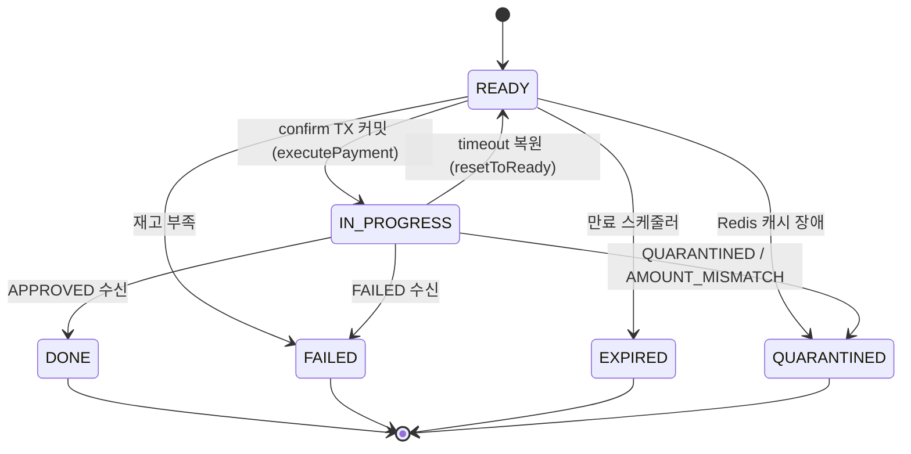
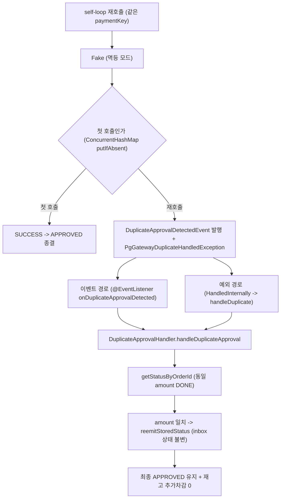

# CLEANUP-BATCH-E 완료 브리핑

> 완료일: 2026-06-21 / 이슈·브랜치: #108

## 작업 요약

`STOCK-COMPENSATION-OTHER-PATHS`(PR #106) 가 비동기 confirm 의 형제 코드를 제거하면서, 그에 딸려 운영 호출처가 0이 된 死 코드 층이 payment-service 에 남았다. 재시도(RETRYING) 상태로 진입하는 유일 경로(`markPaymentAsRetrying`)의 호출처가 사라져 RETRYING 상태 자체가 어떤 운영 경로로도 도달 불가가 됐고, 그에 연결된 상태 머신 가드 분기·이벤트 체인·outbox 실패 종결 메서드·재고 캐시 단건 API 가 모두 미사용으로 남았다. 동시에 pg-service 의 Fake PG 는 실 벤더(Toss/NicePay)의 멱등 응답("이미 처리됨")을 시뮬하지 못해, 재시도 자기루프(self-loop)에서 중복 승인 흡수 경로가 검증 공백이었다.

두 항목을 하나의 behavior-preserving 정리 묶음(cleanup-batch-a~d 선례)으로 처리했다. payment-service 에서는 RETRYING 상태 전이 死 코드와 그 연쇄(RETRY_ATTEMPT 이벤트 체인, `PaymentOutbox.toFailed`, 재고 캐시 단건 API 5종, 그리고 정리 과정에서 함께 死로 드러난 `INVALID_STATUS_TO_FAILED` 에러코드·`stock_decrement.lua`)를 제거했고, `retryCount` 필드·`FAILED` enum·`INVALID_STATUS_TO_RETRY` 에러코드는 다른 의존처가 살아 있어 보존했다. pg-service 에서는 main smoke 빈과 test mock 양쪽 Fake 에 "동일 paymentKey 재호출 시 중복 승인 응답" 멱등 모드를 추가하고, 재시도 자기루프 -> 벤더 재호출 -> `DuplicateApprovalHandler` 흡수 -> 최종 종결 경로를 통합 테스트로 검증했다.

결과적으로 운영 동작 변화 0(死 코드 제거 + 테스트 전용 빈 동작 추가)을 유지하면서, confirm 상태 머신이 실제 도달 가능한 상태로 축소되고 중복 승인 흡수 경로가 통합 테스트로 회귀 가드된다.

## 핵심 설계 결정

| 결정 | 근거 | 기각된 대안 |
|:---:|:---:|:---:|
| RETRYING enum 케이스까지 전부 제거 | 진입 경로 영구 소멸, enum 타입 참조가 `PaymentEventStatus`+`PaymentEvent` 2파일에 닫힘, DB 위험 0 수렴 | orphan 메서드만 제거하고 enum/가드 브랜치 보존 — 도달 불가 상태를 SSOT 에 남겨 실제 도달 가능 상태와 불일치 |
| 재고 캐시 단건 API 5종(`current` 포함) 제거 | Lua atomic(`decrementAtomic`/`compensateAtomic`)로 완전 대체, 단건 5종 모두 운영 호출처 0 | rollback/decrement 짝만 — `current`/`set`/`findCurrent` 도 死라 부분 정리는 일관성 손실 |
| `INVALID_STATUS_TO_FAILED` + `stock_decrement.lua` 동반 제거 | `toFailed`/`decrement` 제거의 직접 파생 死, 같은 작업에서 마저 정리 | TODOS 후속 기록만 — orphan 방치 |
| TC-9 대상 = main `FakePgGatewayStrategy` + test mock `FakePgGatewayAdapter` 둘 다 | smoke retry 시뮬(main) + 통합 테스트 흡수 검증(test mock) 양쪽 필요 | 한쪽만 — 통합 테스트는 test mock, smoke 는 main 빈을 써서 한쪽으로는 검증 공백 |
| Fake 멱등 시뮬: `ConcurrentHashMap` atomic 첫호출 + 이벤트+예외 이중 신호 | 실 벤더(Toss/NicePay)의 "이벤트 발행 후 예외 throw" 계약을 정확히 재현, self-loop 병렬 race 방지 | paymentKey 접두어 규칙 — 시간 의존(첫 호출 성공 후 재호출만 duplicate) 표현 불가 |
| 통합 테스트 단언 = payment 종결 + 재고 1회분 (pg_outbox row 카운트 비의존) | 흡수 핸들러가 이벤트+예외 이중 경로로 outbox 2건 INSERT 가능, 멱등은 payment dedupe 가 별도 layer 로 흡수 | outbox row 카운트 단언 — reemit 횟수에 깨지는 취약한 단언 |

### RETRYING enum 제거의 DB 잔존 row 안전성 (finding 2 논거)

`@Enumerated(EnumType.STRING)` 으로 영속되는 enum 제거 시 DB 잔존 row 가 매핑 실패를 일으킬 수 있으나, RETRYING 은 진입 유일 경로(`markPaymentAsRetrying`)의 운영 호출처가 0 이고 Flyway 마이그레이션에 RETRYING 시드/CHECK 제약이 0(status 는 VARCHAR(50)) 이라 정상 운영에서 RETRYING row 가 생성된 적이 없다. 동반 제거한 `RETRY_ATTEMPT`(payment_history 의 `PaymentHistoryEventType`, 동일 STRING 영속)도 같은 논거 — `@PublishDomainEvent(action="retry")` 발행 경로가 처음부터 0건이라 RETRY_ATTEMPT row 가 생성된 적이 없다. 두 enum 모두 잔존 row 위험은 코드 레벨에서 닫혀 있다.

## 변경 범위

### payment-service (제거)

- **RETRYING 상태 전이**: `PaymentEventStatus.RETRYING` enum + `isTerminal()`/`canApplyConfirmResult()` 의 RETRYING 절 + `PaymentEvent.toRetrying()` + `done()`/`fail()` 허용 집합 축소(done=IN_PROGRESS, fail=READY/IN_PROGRESS) + `PaymentCommandUseCase.markPaymentAsRetrying()`
- **RETRY_ATTEMPT 이벤트 체인**: `DomainEventLoggingAspect` 의 `case "retry"` + `PaymentEventPublisher.publishRetryAttempt()` + `PaymentRetryAttemptedEvent` + `PaymentHistoryEventType.RETRY_ATTEMPT` + `EventType.DOMAIN_EVENT_RETRY_PUBLISHED`
- **outbox 실패 종결**: `PaymentOutbox.toFailed()` (메서드만, `FAILED` enum 보존)
- **재고 캐시 단건 API**: `StockCachePort` 의 `decrement`/`rollback`/`findCurrent`/`set`/`current` 5종 + `StockCacheRedisAdapter` 구현 + `stock_decrement.lua`
- **에러코드**: `INVALID_STATUS_TO_FAILED`

### payment-service (보존)

- `retryCount` 필드/컬럼(admin 조회·메트릭 쿼리 의존, 증가 경로 소멸로 값 0 고정 — 死 metric 은 후속 TODO), `FAILED` enum(`isTerminal()` 참조), `INVALID_STATUS_TO_RETRY`(`PaymentOutbox.incrementRetryCount` 사용)

### pg-service (변경/신규)

- `FakePgGatewayStrategy`(main): `ConcurrentHashMap` 처리 기록 + 재호출 시 `DuplicateApprovalDetectedEvent` 발행 + `PgGatewayDuplicateHandledException`, `getStatusByOrderId` happy 응답(동일 amount DONE), `ApplicationEventPublisher` 주입
- `FakePgGatewayAdapter`(test mock): `enableIdempotentDuplicate()` 멱등 모드 + nullable `ApplicationEventPublisher` setter 로 이벤트 발행
- `PgSelfLoopDuplicateAbsorptionIntegrationTest`(신규): self-loop -> 이벤트 경로(@EventListener) + 예외 경로 둘 다 -> 흡수 -> APPROVED 유지

## 다이어그램

### confirm 상태 머신 (RETRYING 제거 후)

### Fake 멱등 시뮬 + 중복 흡수

## 코드 리뷰 요약

ship 1라운드: reviewer **revise**(major 3) / domain-expert **pass**(findings 0, 돈 새는 경로·이중 종결 없음).

- **[major #1]** Task 3 완료결과가 "TODOS 메모"라 했으나 실제 미기록 — **채택**: `INVALID_STATUS_TO_FAILED` + `stock_decrement.lua` 를 이번에 제거(`9145d80c`).
- **[major #2]** `RETRY_ATTEMPT` enum 제거 시 DB 잔존 row 점검 절차가 RETRYING 과 비대칭 — **채택(문서)**: `action="retry"` 발행 0 으로 row 생성 이력 없음을 본 브리핑에 명시.
- **[major #3]** test mock 멱등 모드가 `DuplicateApprovalDetectedEvent` 미발행(예외만) — **채택**: mock 에 nullable publisher + 이벤트 발행 추가, 통합 테스트가 이벤트 경로도 검증(`ec8df55d`).

ship 2라운드: reviewer **pass**(새 critical 없음) / domain-expert **pass**. critical 0 / minor 0.

## 수치

- 태스크: 5개 (Task 1~3 死 코드 제거, Task 4~5 Fake 멱등 시뮬 + 통합 테스트)
- 테스트: payment-service 450 단위 + 37 통합, pg-service 316 단위 + 8 통합 — 전부 통과 (`--rerun-tasks` 캐시 우회 확인). checkstyle/spotbugs 린트 통과.
- 커밋: 코드 9개(refactor 4 + test/feat 5) + 문서 3개(discuss/plan/최종)
- 리뷰 findings: critical 0 / major 3(전부 처리) / minor 0
