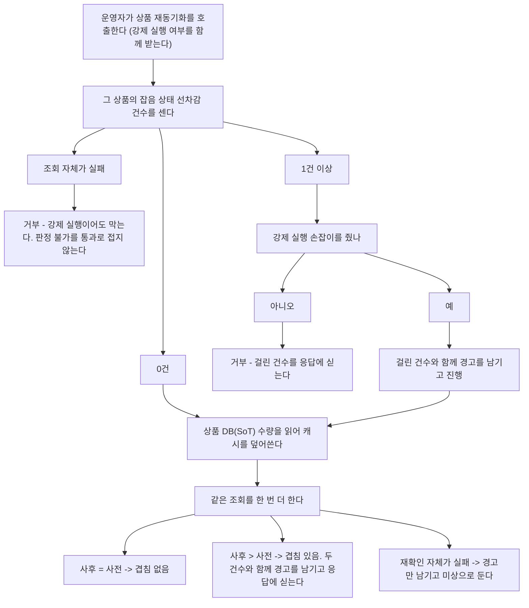
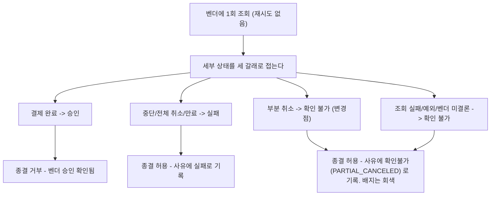

# 가벼운 후속 정리 6건 — 완료 브리핑

> 완료: 2026-09-11 · 이슈 #155 · 브랜치 `#155`

## 작업 요약

후속 목록에 소규모 항목이 쌓여 있었다. 각각은 한 시간이면 끝나는데 서로 무관해서 토픽 하나를 따로 세우기 애매한 것들이다. 여섯 건을 한 묶음으로 처리했다(cleanup-batch-a~e 선례).

모아놓고 보니 공통점이 있었다. **전부 조용히 틀린 것을 말하고 있었다.** 관리자 화면은 부분 취소를 "실패"라고 빨간 배지로 표시했고, 재고 재동기화 도구는 진행 중인 선차감을 아무 말 없이 덮어썼고, 멱등키 테스트는 산출식이 바뀌어도 초록불을 냈고, 테스트용 결제 저장소는 조립하는 순간 예외를 던지는 상태로 잠들어 있었고, 벤치 결과 파일은 처리량 상한을 정하는 조건을 안 남겼고, 가드레일 훅은 무력화돼도 아무도 모르는 구조였다.

접근은 항목마다 가장 작은 변경을 골랐다. 부분 취소는 실패 집합에서 값 하나를 빼는 것으로 끝냈다 — 판정값 자체를 늘리면 두 서비스의 계약과 배포 순서까지 따져야 하는데, 화면이 거짓말하는 것만 멈추는 데는 그게 필요 없었다. 재동기화는 가드를 넣되 확인과 덮어쓰기 사이의 좁은 창은 원자화하지 않고 수용했다. 락으로 묶으려면 confirm 경로가 같은 락을 잡아야 해서, 관리자 도구 하나 때문에 돈 경로에 락이 하나 늘어나는 거래가 되기 때문이다. 대신 덮어쓴 뒤 같은 조회를 한 번 더 해 겹침을 드러내는 쪽을 택했다.

결과는 여섯 건 모두 해소, 전 모듈 테스트 · 통합테스트 · 린트 통과다. 진행 중에 계획에 없던 버그를 하나 잡았다 — 테스트용 저장소가 자식 주문을 공유한 탓에 격리 안전 종결 경로에서 도메인 전이가 두 번 걸려 예외가 나는 상태였다. 그 조합을 조립하는 테스트가 없어서 드러나지 않고 있었고, ship 리뷰가 짚어 고쳤다.

## 핵심 설계 결정

### 부분 취소를 실패 집합에서 빼는 것으로 끝낸다

`PgVendorStatusQueryServiceImpl.FAILED_STATUSES` 에서 `PARTIAL_CANCELED` 만 제거했다. 빠지면 자동으로 확인 불가로 떨어지고, 화면 배지는 빨강에서 회색으로 바뀐다. 원래 상태값은 이미 배지 옆에 찍히고 있어 부분 취소라는 사실은 그대로 보인다. 종결 사유에도 `확인불가(PARTIAL_CANCELED)` 로 남는다.

**기각한 대안** — 전용 판정값을 넷째로 추가하고 격리 종결까지 차단하는 안. 화면에 못박고 종결을 막을 수 있지만 두 서비스가 각자 들고 있는 판정 목록, 계약 테스트, 화면, 종결 가드를 모두 건드려야 한다. 더 중요한 이유는 이 시스템에 취소·환불 포트가 없다는 것이다 — 막아도 운영자가 시스템 안에서 할 수 있는 일이 없다. 취소·환불 경로가 생길 때 함께 본다.

자동 확정 관문(`PgFinalConfirmationGate`)은 같은 상태를 전용 사유(`FCG_PARTIAL_CANCELED`)로 더 세분해 격리시킨다. 관리자 조회는 세 갈래, 관문은 네 갈래로 비대칭이지만 원본 상태값이 양쪽 모두에 실려 은폐되지 않는다 — 의도된 차이다.

### 재동기화 가드는 상품별 미종결 선차감 기록으로 판정한다

선차감 기록(`stock_hold_record`)이 상품별로 미회수 차감을 들고 있으므로, 격리 주문을 새로 조회할 필요 없이 그 상품의 잡음(`NOISE`) 상태 행 수만 세면 된다. 포트에 `countNoiseByProductId` 를 늘리고 JPA 파생 쿼리와 Fake 두 구현을 함께 만들었다.

상품 + 상태 조합 인덱스는 두지 않았다. 운영자가 직접 부르는 단발 조회라 지금은 필요 없다.

### 기본 거부 + 강제 실행 손잡이

예외 없이 막으면 선차감 흔적이 만료돼 영영 닫히지 않는 기록 때문에 그 상품은 재동기화 자체가 불가능해진다. 재동기화는 캐시가 이미 발산했을 때 쓰는 마지막 수단이라 탈출구가 필요하다. `?force=true` 로 넘기되 걸린 건수와 함께 경고를 남긴다.

거부는 새 예외 타입을 만들지 않고 기존 상태 예외(`PaymentStatusException`)를 재사용한다 — 벤더 승인이 확인돼 격리 종결을 거부할 때와 같은 형태이고 그대로 400 으로 매핑된다. 에러 코드만 하나 늘었다(`E03047`).

### 확인~덮어쓰기 창은 막지 않고 드러낸다

가드는 확인하고 나서 덮어쓴다. 확인이 끝난 뒤 새로 진입하는 선차감은 구조상 막지 못한다.

**이미 매달린 선차감은 전부 잡힌다** — confirm 진입이 선차감 기록을 먼저 열고 캐시를 나중에 깎으므로, 확인 시점에 진행 중이던 건은 기록이 먼저 보인다. 격리 종결의 되돌리기와 겹치는 경우도 캐시 복원 후에 기록을 닫아 그 구간 내내 기록이 남는다. 남는 것은 확인 종료 후 새로 진입하는 건뿐이다.

**기각한 대안** — 상품 단위 락으로 확인부터 덮어쓰기까지 묶는 안. 창 자체는 사라지지만 confirm 경로가 같은 락을 잡아야 실효가 있다. 관리자 도구 하나 때문에 돈 경로에 락이 늘어난다.

채택한 것은 덮어쓴 뒤 재확인이다. 사후 건수가 사전보다 크면 경고를 남기고 응답에도 싣는다. 되돌리지는 못해도 조용히 묻히지 않는다. 잡히는 것은 재확인 시점까지 열려 있는 겹침뿐이며(그 사이 닫힌 기록은 두 조회 모두에 안 보인다), 경고가 없다고 겹침이 없었다고 단정할 수 없다. 이 한계는 `CONCERNS.md` L-20 에 등재했다.

### 겹침 판정은 사후 건수 > 사전 건수

plan 게이트에서 보정된 지점이다. 판정을 "사전에 없었는데 생겼으면"으로 두면 **강제 실행 경로에서 절대 성립하지 않는다** — 강제 실행은 애초에 사전 건수가 1 이상이라 필요했던 경우다. 위험이 가장 큰 경로에서 안전장치가 통째로 빠지는 형태였다.

같은 이유로 사전 조회는 강제 실행 여부와 무관하게 항상 선행한다. 강제 실행이 우회하는 것은 건수 판정이지 조회가 아니다 — 조회를 건너뛰면 사후 재확인의 기준값조차 없다. 사전 조회 실패는 강제 실행이어도 거부한다(판정 불가를 통과로 접지 않는다). 반대로 사후 재확인 실패는 삼킨다 — 덮어쓰기가 이미 끝난 뒤라 실패로 보고하면 운영자가 덮어쓰기가 안 됐다고 오인한다.

### 겹침 표시는 세 값짜리 enum

참·거짓 두 값으로 접으면 재확인이 실패한 경우가 "겹침 없음"으로 보고된다 — 없는 안전을 보고하는 셈이다. `OVERLAPPED / CLEAR / UNKNOWN` 으로 구분을 살렸다.

### 훅 자체 검증은 훅을 고치지 않고 테스트만 붙인다

편집 시점 훅이 검사기 준비 실패 시 조용히 넘어가는 것(종료 0)은 의도된 동작이다 — 훅이 작업을 막는 원인이 되면 안 된다. 그래서 그 동작도 기대 동작으로 함께 고정했다. 실패해야 하는 쪽은 테스트다: 위반 케이스를 돌리기 전에 테스트가 검사기 준비 상태를 확인하고, 준비 안 됐으면 케이스를 건너뛰는 대신 테스트를 실패로 끝낸다. 테스트까지 같이 넘어가면 검사기가 꺼진 채로도 초록불이 뜬다.

턴 종료 훅은 변경 모듈의 테스트를 실제로 돌리므로, 픽스처 저장소에 **가짜 `gradlew`** 를 심어 통과·실패를 지시하는 방식으로 그 구간을 대체했다. 실제 빌드 없이 판정 로직 전체를 종료 코드로 확인한다.

**기각한 대안** — Gradle 태스크로 편입. 기존 빌드에 묶여 같이 돌지만 셸 스크립트 검사를 JVM 빌드에 결합시킨다. 훅은 제품 코드가 아니라 에이전트 도구다.

### 벤치 파티션은 브로커에서 되읽는다

환경변수를 그대로 적으면 앱 기동 후 파티션을 늘린 경우 설정과 실제가 어긋난 채 기록된다. 결과를 쓰는 시점에 브로커에 직접 물어보고, 되읽기가 실패하면 값을 지어내지 않고 미상으로 남긴다.

## 변경 범위

### payment-service — 재고 재동기화 가드 (신규/변경)

- `application/port/out/StockHoldRecordRepository` — `countNoiseByProductId` 추가. 기존 미회수 잔량 조회 옆에 둔다
- `infrastructure/repository/JpaStockHoldRecordRepository` · `StockHoldRecordRepositoryImpl` — 파생 쿼리와 위임 구현
- `application/usecase/StockResyncUseCase` — 사전 조회 → 거부/경고 → 덮어쓰기 → 사후 재확인 순서로 재작성
- `application/dto/admin/StockResyncResult` · `StockResyncOverlapStatus` — 신설. 수량 + 세 값짜리 겹침 판정
- `exception/common/PaymentErrorCode` — `STOCK_RESYNC_NOISE_IN_PROGRESS`(E03047)
- `core/common/log/EventType` — 강제 실행 / 겹침 / 재확인 실패 / 사전 조회 실패 4종
- `presentation/port/StockAdminService` · `StockAdminController` · `dto/response/admin/StockResyncResponse` — 강제 실행 파라미터(기본 거짓)와 겹침 필드

### pg-service — 부분 취소 분류 (변경)

- `application/service/PgVendorStatusQueryServiceImpl` — 실패 집합에서 `PARTIAL_CANCELED` 제거 + 제외 사유 Javadoc

### 테스트 인프라 (변경)

- `mock/FakePaymentEventRepository` — 모든 조회가 방어적 복사를 거치게 하고, 자식 주문 원소까지 복사
- `mock/FakePaymentEventRepositoryTest` · `application/service/PaymentReconcilerFakeRepositoryTest` — 신설
- `mock/FakeStockHoldRecordRepository` + 테스트 — 상품별 건수 조회 시맨틱
- 참조 동일성에 기대던 Mockito 검증 4개 파일 — 값 비교 매처(`sameOrder`)로 교체. `PaymentOrder` 에 `equals` 는 추가하지 않았다

### 회귀 가드 (추가)

- `IdempotencyKeyHasherTest` — 고정 입력에 리터럴 기대 해시 1건

### 도구 (신규/변경)

- `scripts/test-hooks.sh` — 신설. 턴 종료 훅 9케이스 + 편집 시점 훅 3케이스
- `.github/workflows/ci.yml` — `hook-guardrail-check` job 신설. 지침 문서 검사 job 과 달리 **실패시킨다**
- `scripts/bench-scaleout-cycle.sh` — 결과 `conditions` 에 파티션(브로커 되읽기)과 pg 컨슈머 동시성 추가

## 다이어그램

### 재동기화 경로 (변경 후)

### 관리자 벤더 조회 판정 (변경 후)

## 코드 리뷰 요약

1라운드에서 reviewer 와 domain-expert 가 **같은 지점을 서로 다른 각도로** 짚었다. 테스트용 결제 저장소가 자식 주문을 공유한 문제다.

- domain-expert 는 설계 문서의 "자식 주문 리스트 깊은 복사" 결정과 구현(컨테이너만 분리)이 어긋나고, 결제 상태 전이가 자식 주문까지 바꾸므로 자식 상태가 저장소로 샌다고 봤다
- reviewer 는 그게 수동적 위험이 아니라 **활성 버그**임을 밝혔다. 격리 안전 종결 경로는 로드한 결제를 재조회 없이 전이 메서드에 넘기는데, 그 전이가 자식 주문을 실패로 바꾼 뒤 조건부 갱신이 복사본을 얻는다. 복사본의 최상위 상태는 아직 격리라 선행조건을 통과하지만 자식 주문은 이미 실패 상태라, 전이가 다시 걸리며 상태 가드에 막혀 예외가 난다. 충돌(false)이 아니라 예상 밖 예외다

처리는 문서를 구현에 맞춰 내리는 대신 구현을 결정에 맞춰 올렸다. 자식 주문까지 실제로 복사하고, 그 전환으로 깨진 참조 동일성 기반 검증 4개 파일을 값 비교 매처로 바꿨다. 도메인 값 객체에 테스트 편의를 위한 `equals` 를 넣는 대신 테스트 쪽을 고쳤다. 그리고 그 조합을 조립하는 회귀 테스트를 추가했다 — 테스트가 없어서 버그가 숨어 있었으므로 그 자리를 채우는 게 수정의 절반이다.

minor 2건도 반영했다. 재동기화 사전 조회 실패가 로그 없이 전파되던 것에 경고를 추가했고(전파 동작 자체는 유지), 깊은 복사 도입으로 매칭이 깨진 스텁 하나를 같은 파일의 나머지처럼 값 매처로 통일했다. 후자는 반환 기본값이 기대값과 우연히 같아 겉보기엔 통과하던 것이다.

재리뷰에서 양쪽 모두 통과. 값 비교 매처가 느슨해지지 않았는지는 실제 어댑터 구현이 참조하는 필드와 대조해 확인했다 — 매처가 빠뜨린 식별자 필드는 어느 어댑터도 쓰지 않는다.

**기각 없음.** 상세는 아카이브된 `CLEANUP-BATCH-F-PLAN.md` 의 `## 리뷰 처리` 절.

## 수치

| 항목 | 값 |
|:---:|:---:|
| 태스크 | 7 |
| 커밋 | 15 (feat 6 / test 5 / fix 2 / docs 2) |
| 변경 파일 | 31 (+1,712 / −55) |
| 테스트 | 전 모듈 통과 (payment-service 737, pg-service 464) · 통합테스트 · 린트 모두 캐시 없이 재실행 |
| 게이트 라운드 | discuss 2 · plan 2 · ship 2 |
| findings | critical 0 / major 2 / minor 2 — 전부 채택, 기각 0 |

## 미결 / 후속

- **라이브 검증 미수행 (의식적 스킵)** — 관리자 재동기화 REST 의 런타임 동작이 바뀌었으나 실스택 기동으로 거부·강제 실행을 눌러보지는 않았다. 가드 네 갈래는 단위 테스트로, 새 조회는 Testcontainers 기반 테스트로 덮여 있으나 그것은 합성 검증이다. 돈 경로가 아닌 관리자 도구이고 실패 시 영향이 거부(400)에 그친다는 판단으로 미뤘다
- **확인~덮어쓰기 창** — 수용한 한계. `CONCERNS.md` L-20
- **선차감 흔적 만료 임박 알람** — 미착수, `TODOS.md` 에 잔존
- **파티션·컨슈머 동시성 기본값 승격 판단** — 이번엔 측정 조건 기록까지만. `TODOS.md` 에 잔존
- **위키의 끊긴 참조 2곳** — 별도 저장소라 이 PR 범위 밖. 후속으로 처리하기로 했다

## 관련 문서

- 설계: `CLEANUP-BATCH-F-CONTEXT.md` (같은 디렉토리)
- 플랜: `CLEANUP-BATCH-F-PLAN.md` (같은 디렉토리)
- 설명 페이지: `.archive/explanations/2026-09-11-cleanup-batch-f.html`
