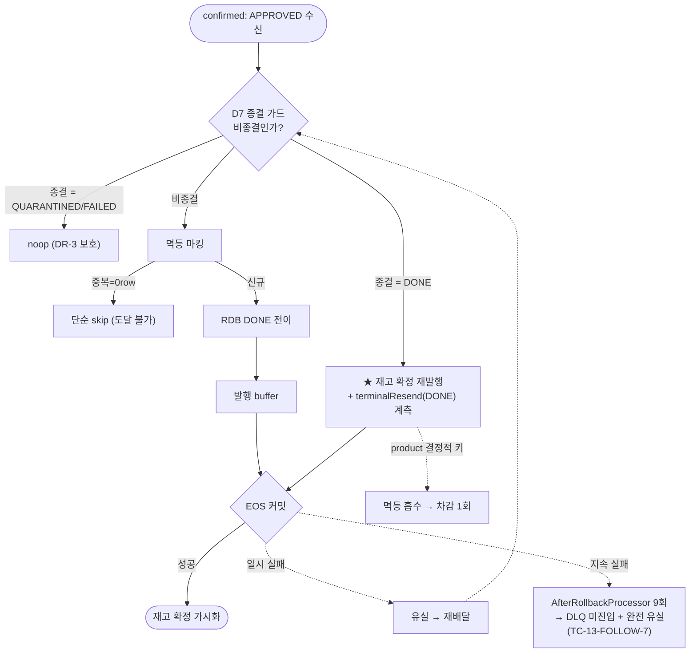

# CONFIRM-APPROVED-RESEND-GAP 완료 브리핑

> 이슈/브랜치: #112 / `#112` · 완료: 2026-06-22

## 작업 요약

비동기 confirm 결과 처리(`PaymentConfirmResultUseCase.handle`)는 결제 상태 전이(JPA 트랜잭션)와 재고 확정 발행(Kafka EOS 트랜잭션)을 별개 트랜잭션으로 운영한다. 컨테이너가 Kafka tx를 바깥(outer), `handle`의 `@Transactional`이 JPA tx를 안쪽(inner)에 두어 **JPA가 먼저 커밋**된다. 그래서 APPROVED 경로에서 `markPaymentAsDone`(RDB DONE) 커밋 성공 후 EOS 커밋(stock-committed 발행 + offset)이 유실되면, 재배달이 D7 종결 가드(`canApplyConfirmResult()==false`)에 막혀 **stock-committed가 영구 유실** → product RDB 재고 차감 누락 → redis 선차감과 RDB 발산 → **오버셀 가능**이라는 정합성 갭이 있었다.

설계 SSOT(CONFIRM-FLOW §5, CONCERNS L-1)는 이 crash 내성을 *"중복 시 stock-committed 발행 항상 진행(handle의 affected==0 분기) + product dedupe 흡수"*가 담당한다고 선언했으나, 정적 분석 결과 **그 분기는 도달 불가능한 dead branch**임이 드러났다 — dedupe 마킹(`markIfAbsent`)과 종결 전이(`markPaymentAsDone`, REQUIRED로 같은 JPA tx 참여)가 원자 커밋되므로 "dedupe됨 + 비종결" 조합이 단일 컨슈머 EOS 흐름에서 발생할 수 없다.

접근: **재배달이 실제 도착하는 D7 종결 가드 분기**에서 `status==DONE && message==APPROVED`(= 정상 첫 도착엔 없는 = 재배달 신호)이면 `sendStockCommittedEvents`를 **재발행**하도록 바꿨다. product-service가 결정적 키 `StockEventUuidDeriver.derive(orderId, productId)`(message eventUuid와 독립)로 멱등 흡수하므로 차감은 정확히 1회 — **under-publish는 위험·over-publish는 무해** 비대칭을 이용한다. 도달 불가 affected==0 발행 분기는 단순 skip으로 정리했고, 재발행 빈도 관측용 `PaymentConfirmTerminalResendMetrics`(카운터 `payment_confirm_terminal_resend_total`)를 추가했다.

결과: 단위 457 + 통합 39 전부 green. 결정적 주입 실증(#6)으로 **일시적 EOS 커밋 실패 → 재배달 → 재발행 → 차감 1회 복구**가 설계대로 증명됐다.

## 핵심 설계 결정

| 결정 | 근거 | 기각된 대안 |
|---|---|---|
| 재발행 위치 = D7 종결 가드 분기, 조건 `status==DONE && APPROVED` | 재배달이 실제 도달하는 유일 지점. 정상 경로엔 없는 조합이라 재배달 신호로 충분 | — |
| 도달 불가 affected==0 발행 분기 제거 → 단순 skip | dedupe 마킹+종결 전이 원자 커밋이라 "dedupe됨+비종결" 불가 → dead branch | (유지) — 재발행 로직 두 곳 중복 |
| 재발행 조건은 eventUuid 비의존 (status+message만) | 흡수 키가 결정적(orderId+productId)이라 같은/새 eventUuid 모두 무해. pg retry가 새 eventUuid를 발행하는 정상 경로도 흡수 | (좁게) 같은 eventUuid 재배달만 — dedupe 조회 포트 추가 불요한 복잡도 |
| 순서 뒤집기(발행 먼저) 미채택 | 발행은 producer tx buffer라 원자성 경계(JPA↔Kafka 커밋) 불변 → 무효. FAILED·QUARANTINED의 즉시 Redis 보상과 성격이 다름 | Option B — 무효라 기각 |
| 흡수 책임 = product `recordIfAbsent`(결정적 키) | over-publish 무해/under-publish만 위험. 기존 구조 유지 | — |
| 실증 = 결정적 주입 시드 | 통합 하니스가 임베디드 Kafka라 Toxiproxy 부적합. `commitTransaction` 1회 실패 주입이 JPA inner 선커밋 → Kafka outer 커밋 실패 윈도우를 결정적 재현 | Toxiproxy(discuss 초안) — 임베디드 Kafka 부적합·윈도우 타이밍 레이스 |

## 변경 범위

- **추가** — `PaymentConfirmTerminalResendMetrics`(`core/common/metrics`, 카운터 `payment_confirm_terminal_resend_total{status}`, eager DONE 1종, throw-free). 테스트 시드 `CommitFailureInjectingProducerPostProcessor`(테스트 스코프, `ProducerPostProcessor`로 `commitTransaction` N회 실패 주입, 운영 코드 무변경).
- **변경** — `PaymentConfirmResultUseCase.handle`: D7 종결 가드 분기에 DONE+APPROVED 재발행 + 계측 + 주석(amount 재검증 생략 의도). affected==0 분기 발행 제거 → 단순 skip. 생성자에 메트릭 주입.
- **교체** — 단위 `PaymentConfirmResultUseCaseTest` 도달 불가 상태 의존 2종 제거 + 신규 6종(DONE+APPROVED 재발행 / 새 eventUuid 비의존 / QUARANTINED·FAILED 미재발행 / affected==0 단순skip / 멀티상품 결정성). 통합 `PaymentEosIntegrationTest` #3 실효 교체(발행 책임 이전 단정)·#4 정상경로만·#5 green 유지 + #6(복구)·#7(지속실패 bound) 신규.
- **문서** — CONFIRM-FLOW §5·§11·§16, CONCERNS L-1, PITFALLS #20, TODOS(TC-13-FOLLOW-6 SSOT + TC-13-FOLLOW-7 신규), ARCHITECTURE 메트릭 목록 정정.

## 다이어그램

## 코드 리뷰 요약

ship Phase A — reviewer·domain-expert 모두 **verdict=pass** (critical·major 코드 결함 0). findings 4건은 doc-sync + 주석:

- **R1** [major→doc-sync]: 제거된 dead branch가 CONFIRM-FLOW §5·§16·CONCERNS L-1에 crash 내성 SSOT로 잔존 → **B2 context-update에서 정정 완료** (crash 내성 = 종결 가드 재발행).
- **R2** [minor→doc-sync]: §5 에러핸들링이 commitTransaction 실패 경로(AfterRollbackProcessor)와 불일치 → **B2 정정 완료** (리스너 예외 vs EOS 커밋 실패 2경로 구분).
- **R3** [minor→briefing]: topic.md S2 반증 가설 → 본 브리핑 "실증 반증" 절에 SSOT 기록(아래).
- **R4** [minor→코드]: 재발행 분기 amount 재검증 생략 의도 주석 → **수정 완료**(`f046f3a3`).

추가: B1 린트 게이트에서 통합 테스트 미사용 import 2건 검출 → 제거(`1700e5eb`).

### 실증이 반증한 S2 가설 (R3 — SSOT 기록)

설계 S2는 *"재발행 커밋 반복 실패 시 5회 후 DLQ + product 중복 차감 0건"*이라 가정했으나, Task 3 #7 실증이 **2중 반증**했다:

1. **DLQ 미진입**: `commitTransaction()` 실패는 우리 `DefaultErrorHandler`(FixedBackOff 5 + DLQ recoverer)가 아니라 컨테이너 디폴트 `DefaultAfterRollbackProcessor`(`SeekUtils.DEFAULT_BACK_OFF` = interval 0, maxAttempts 9, 단순 로그)로 처리된다. 9회 소진 후 DLQ가 아니라 **단순 스킵(오프셋 전진)**. 리스너 도메인 예외와 EOS 커밋 실패의 복구 경로가 다르다.
2. **완전 유실(≠중복0)**: 종결 가드 재발행도 같은 EOS producer tx라, 커밋이 매번 실패하면 재발행 자체가 매번 abort → stock-committed가 read_committed 컨슈머에 단 1건도 가시화 안 됨. "중복 차감 0"이 아니라 **"완전 유실 0"** — payment는 DONE인데 재고 확정 영구 소실.

→ 즉 본 수정은 **일시적 EOS 커밋 실패(crash 윈도우, 실제 버그)는 복구**하나, **지속적 브로커 장애는 못 막고 DLQ도 안 탄다**. 이건 수정이 만든 회귀가 아니라 기존부터 있던 더 심한 별도 실패 모드이며, 처방(컨테이너 팩토리에 `setAfterRollbackProcessor`로 DLQ recoverer 명시 연결)은 **TC-13-FOLLOW-7**로 분리 등재.

## 수치

- **태스크**: 3 (메트릭 / handle 재발행+dead branch 제거 / 결정적 주입 실증)
- **테스트**: 단위 457 + 통합 39 전부 통과 (통합 `--rerun-tasks` 강제 실행 확인, 캐시 아님)
- **커밋**: 9 (docs 2 + RED/GREEN 4 + 실증 1 + 주석 1 + 린트 1) + 마무리 docs 1
- **findings**: critical 0 / major 1(doc-sync) / minor 3 — 전부 해소 또는 정정 완료
- **후속 등재**: TC-13-FOLLOW-7 (EOS 커밋 지속 실패 시 DLQ 경로 + 완전 유실)
