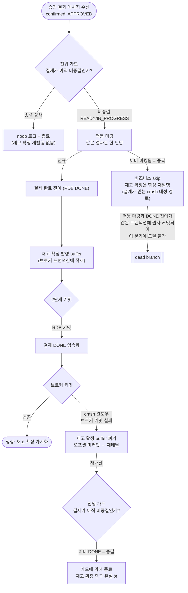
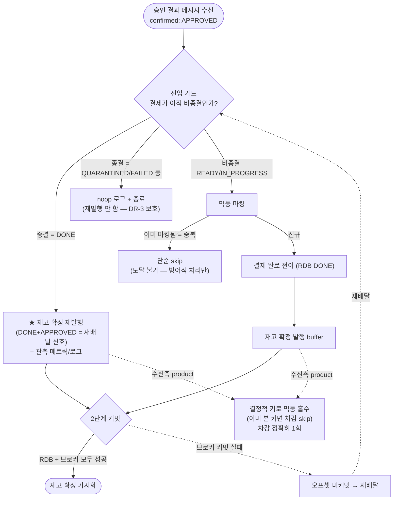

# 비동기 confirm APPROVED 재고 확정 재발행 갭 설계

> 최종 수정: 2026-06-22

## 사전 브리핑

### 현재 이해한 문제

결제 승인 결과를 비동기로 수신해 결제를 완료 처리할 때, 결제 완료 상태(RDB)는 확정되었는데 그에 따른 **재고 확정 통지(stock-committed)** 가 메시지 브로커 커밋 실패로 유실될 수 있다. 이 경우 재배달이 일어나도 이미 종결된 결제라 진입 가드에 막혀 재고 확정이 다시 발행되지 않는다. 결과적으로 상품 서비스의 재고가 차감되지 않아, 선차감해 둔 캐시 재고와 실제 재고가 벌어지고 **오버셀 가능성**이 생긴다. 설계 문서가 "이런 crash 상황은 중복 발행 분기가 막아준다"고 선언했으나, 그 분기는 실제 흐름에서 도달할 수 없는 코드(dead branch)다.

### 현재 시스템 동작 (as-is)



핵심: 멱등 마킹과 결제 완료 전이는 **같은 RDB 트랜잭션**에서 원자적으로 커밋된다. 그래서 "중복으로 마킹되어 있으면서 결제는 아직 비종결"인 상태가 단일 컨슈머 흐름에서 물리적으로 발생할 수 없고, crash 내성을 담당한다던 중복 발행 분기는 영영 실행되지 않는다. 한편 재고 확정 발행은 즉시 부수효과가 아니라 **브로커 트랜잭션에 buffer** 되므로, RDB 커밋(완료)과 브로커 커밋(발행) 사이의 crash 윈도우에서 발행만 통째로 사라진다.

### 이번 discuss에서 결정하려는 것

- 재배달 시 재고 확정을 다시 발행시킬 지점 — 진입 가드의 종결 분기에서 재발행할지, 멱등/가드 순서를 재구성할지, 발행을 완료 전이 앞으로 옮길지
- "단순 순서 뒤집기(발행 먼저, 완료 나중)"가 실패 보상(FAILED/QUARANTINED)의 회피책과 달리 이 문제를 **해결하지 못하는** 이유를 합의하고 문서화
- 재발행을 어떤 조건으로 트리거할지 — 같은 결과 식별자의 재배달만인지, 종결+승인 조합 전체인지 (오발행/이중 발행 빈도 트레이드오프)
- 검증 범위 — 단위 테스트로 dead branch를 실효 분기로 교체하는 선까지인지, crash 주입 실증(Toxiproxy)을 포함/제외할지
- 설계 SSOT 문서(CONFIRM-FLOW §5, CONCERNS L-1) 정정 범위

### 열린 질문 / 가정

- **가정**: confirmed 토픽은 결제 주문 단위로 파티셔닝되어 같은 결제는 단일 컨슈머가 순차 처리한다 (동시성 없음). 재배달은 브로커 커밋 실패 시에만 발생.
- **가정**: 재고 확정의 멱등 키는 결제·상품 조합으로 결정적이라, 같은 결제를 몇 번 재발행해도 상품 서비스가 흡수한다 (오발행 자체는 무해, 빈도만 비용).
- **열린 질문**: 종결+승인 조합 전체에서 재발행을 허용하면, 정상적으로 한참 전에 완료된 결제에 늦게 도착한 동일 메시지에도 재발행이 일어난다 — 이 이중 발행 빈도가 용인 가능한지.
- **열린 질문**: 진입 가드는 격리(QUARANTINED) 결제에 늦게 온 승인을 막아 silent DLQ를 방지하는 책임(DR-3)도 진다. 재발행 분기를 추가하며 이 보호를 깨뜨리지 않는지 확인 필요.
- **범위 가정**: EOS 발행을 outbox로 되돌리는 구조 변경은 비목표 (CLEANUP-BATCH-E에서 outbox 폐기, EOS로 이행한 방향과 충돌).

---

## 요약 브리핑

### 결정된 접근

진입 가드의 **종결 분기**에서 "결제는 DONE인데 승인 결과가 다시 도착"한 경우(= 정상 첫 도착엔 없는 조합 = 재배달 신호) 재고 확정 통지를 **다시 발행**한다. 첫 처리 때 RDB 완료 커밋 후 브로커 커밋이 유실돼도, 재배달이 가드에 막혀 조용히 사라지는 대신 재고 확정을 복구한다. 수신측(product)이 결제·상품 결정적 키로 멱등 흡수하므로 몇 번 재발행해도 차감은 한 번뿐 — **빠뜨리면 위험(under-publish)·더 보내면 안전(over-publish)** 비대칭을 이용한다. 도달 불가능했던 기존 중복 발행 분기는 재배달이 실제 도착하는 종결 가드로 이전한다.

### 변경 후 동작 (to-be)



핵심 변화: 종결(DONE) 분기가 순수 noop에서 **조건부 재발행**으로 바뀌어, 브로커 커밋 유실 후 재배달이 재고 확정을 복구한다. QUARANTINED/FAILED 종결은 그대로 noop(DR-3·보상 멱등 보호 불변). 재발행 자체의 커밋이 또 실패해도 재시도 한도(5회) 후 DLQ로 bounded.

### 핵심 결정 목록

- **재발행 위치 = 종결 가드 분기**, 조건 = `status==DONE && message APPROVED` (재배달이 실제 도달하는 유일 지점)
- **도달 불가 affected==0 발행 분기 제거** → 재발행 지점 일원화 (dedupe 마킹과 종결 전이가 원자 커밋이라 그 분기는 dead)
- **순서 뒤집기(발행 먼저)는 미채택** — 발행이 producer tx buffer라 원자성 경계 불변 → 무효 (오해 문서화)
- **흡수 책임 = product 결정적 키**(`derive(orderId,productId)`, message eventUuid와 독립), DR-1 회귀 가드가 결정성 보존

### 트레이드오프 / 후속 작업

- 종결 가드가 noop에서 조건부 재발행 책임을 일부 가짐(의미 소폭 확장) — DONE+APPROVED 재배달마다 무해한 재발행 1회 발생(product 흡수).
- 재발행 분기는 dedupe 미경유 → 관측 메트릭/로그로 "종결 후 재발행" 빈도 가시화 필요(plan 태스크).
- 회귀 가드 교체: `PaymentEosIntegrationTest` #3(dead branch 검증) → 실효 시나리오, 단위 2종 교체. CONFIRM-FLOW §16·§5·CONCERNS L-1 정정(ship).
- 결정적 EOS 커밋 실패 주입으로 정적 추론을 승격 — 임베디드 Kafka 하니스에 `commitTransaction` 1회 실패 시드(Toxiproxy 대체, plan 확정)가 별도 태스크.

## 문제 정의

비동기 confirm 결과 처리(`PaymentConfirmResultUseCase.handle`)는 결제 상태 전이(JPA 트랜잭션)와 재고 확정 발행(Kafka EOS 트랜잭션)을 **별개 트랜잭션**으로 운영한다. 컨테이너가 Kafka tx를 바깥에, `handle`의 `@Transactional(transactionManager="transactionManager")`가 JPA tx를 안쪽에 두므로, **JPA tx가 Kafka tx보다 먼저 커밋**된다. 따라서 APPROVED 경로에서:

```
markPaymentAsDone → RDB DONE 커밋 성공
  → stock-committed 발행/오프셋 커밋(Kafka tx) 실패  (crash 윈도우)
  → 오프셋 미커밋 → 같은 메시지 재배달
  → 재배달 시 상태 = DONE → D7 종결 가드(canApplyConfirmResult=false)에서 return
  → stock-committed 영구 유실
```

결과적으로 product RDB 재고 차감이 누락되어, payment의 redis 선차감(차감됨)과 product RDB(미차감)가 발산하고 **재고 오버셀**이 가능하다. 돈 직접 손실은 아니나(결제는 정상 DONE) 재고 정합성 결함이다.

설계 SSOT(`CONFIRM-FLOW §5`, `CONCERNS L-1`)는 이 crash 내성을 *"중복 시 stock-committed 발행 항상 진행(handle의 affected==0 분기) + product dedupe 흡수"*가 담당한다고 선언했으나, **그 분기는 도달 불가능한 dead branch**다. dedupe 마킹(`markIfAbsent`)과 종결 전이(`markPaymentAsDone`, REQUIRED로 같은 JPA tx 참여)가 원자 커밋되므로, "dedupe됨 + 상태 비종결" 조합이 단일 컨슈머 EOS 흐름에서 발생할 수 없다 — 그래서 그 분기는 실행되지 않는다.

### 설계 비대칭 (근거)

`handle` Javadoc은 FAILED·QUARANTINED를 *"보상 먼저, RDB 상태 전이 나중"*으로 처리해 같은 함정을 회피한다 — 보상(`compensateAtomic`)은 **즉시 Redis 부수효과**라 종결 커밋 전에 실행되고 Lua dedup token으로 멱등하므로, crash 후 재배달이 비종결 상태를 다시 처리해 복구된다. 그러나 APPROVED의 재고 확정 발행은 **즉시 부수효과가 아니라 producer tx에 buffer**되어 늦은(post-RDB) Kafka 커밋에 묶이므로, 순서를 아무리 바꿔도 같은 회피책이 전이되지 않는다. 회피책이 절반만 적용된 상태다.

## 영향 범위

| 구분 | 대상 | 변경 |
|---|---|---|
| 변경 | `PaymentConfirmResultUseCase.handle` (application) | D7 종결 가드 분기에 DONE+APPROVED 재발행 추가, affected==0 재발행 제거 |
| 무관(불변) | `PaymentEventStatus.canApplyConfirmResult()` (domain) | 종결 판정 로직 변경 없음 — 분기만 추가 |
| 무관(불변) | `sendStockCommittedEvents` / `StockEventUuidDeriver` | 결정적 멱등 키 그대로 재사용 |
| 무관(불변) | product `StockCommitUseCase` / `JdbcEventDedupeStore` | 수신측 멱등 흡수 이미 구현됨 — 변경 없음. 흡수 키 = `derive(orderId,productId)`, message eventUuid와 독립 |
| 교체 | `PaymentConfirmResultUseCaseTest` 단위 2종 (`shouldSkipBusinessWhenMarkIfAbsentReturnsZero`, `shouldSkipBusinessButAlwaysSendWhenMarkIfAbsentReturnsZero`) | 둘 다 IN_PROGRESS 유지 + dedupe 인위 선마킹 = 도달 불가 상태 의존 → 실효 분기(종결 가드 재발행) 테스트로 교체/제거 |
| 교체 | `PaymentEosIntegrationTest` #3·#4 (integration, PET-12 회귀 가드) | #3(`동일 event_uuid 재배달 → affected==0 → 발행 진행`)은 dead branch를 IN_PROGRESS 인위 상태로 검증하던 잘못된 회귀 가드 → 실효 시나리오(DONE+APPROVED 재배달 → 종결 가드 재발행)로 교체. #4 재배달 dedupe skip 부분 조정. **#5(QUARANTINED D7 가드, DR-3)는 green 유지 검증** |
| 신규 | 통합 / Toxiproxy 실증 + D7 재발행 관측 | 재배달→재발행→product 차감 복구 end-to-end. 종결 가드 재발행 분기에 메트릭/로그(silent 반복 발행 가시화) |
| 정정 | `CONFIRM-FLOW §5·§16`, `CONCERNS L-1` | "affected==0 분기가 crash 내성 담당" 서술 정정 + §16 시나리오 #3(DR-5)을 실효 시나리오로 갱신 (ship 단계) |

## 설계 옵션 비교

### Option A — 종결 가드 재발행 (채택)

D7 종결 가드 분기에서 `status==DONE && message==APPROVED`이면 `sendStockCommittedEvents`를 재발행하고 return. 재배달이 실제 도착하는 지점에서 직접 복구한다.

- **장점**: 재배달이 도달하는 유일 지점에서 국소 복구, 최소 변경, product 멱등 흡수 그대로 활용, DR-3(격리 결제 늦은 APPROVED 차단)·FAILED·QUARANTINED 보호 불변, dead branch를 실효 위치로 이전(코드 일원화).
- **단점**: D7 가드가 순수 noop에서 "조건부 재발행" 책임을 일부 가짐(가드 의미 소폭 확장), DONE+APPROVED 재배달마다 무해한 재발행 1회.

### Option B — 발행 먼저, 완료 나중 (순서 뒤집기) (기각)

`handle` 안에서 `sendStockCommittedEvents`를 `markPaymentAsDone` 앞으로 이동.

- **기각 이유**: 재고 확정 발행은 즉시 부수효과가 아니라 **producer tx buffer**라, 두 줄 순서를 바꿔도 원자성 경계(JPA 커밋 ↔ Kafka 커밋)와 crash 윈도우가 그대로다. FAILED·QUARANTINED의 "보상 먼저"(즉시 Redis)와 성격이 달라 회피책이 전이되지 않는다. **순서 뒤집기로 해결된다는 오해를 문서에 못박는다.**

### Option C — dedupe 마킹을 D7 가드 앞으로 이동 (기각)

가드/멱등 순서를 재배치해 affected==0 분기를 실효화.

- **기각 이유**: D7가 거부할 메시지(격리 결제에 늦은 APPROVED 등)도 dedupe 행을 INSERT하게 되어 dedupe 오염 + DR-3 silent DLQ 방지 의미가 흐려진다. 가드/멱등 순서 재배치는 영향 범위가 넓고 회귀 위험이 크다 — Option A가 더 국소적.

### Option D — EOS 밖 즉시 발행 / outbox 복원 (제외 범위)

2단계 커밋 갭 자체를 제거하는 근본 방향이나 EOS 이행 방향(CLEANUP-BATCH-E outbox 폐기)과 충돌. 비목표.

## 결정 사항

| 항목 | 결정 | 이유 |
|---|---|---|
| 재발행 위치 | D7 종결 가드 분기 | 재배달이 실제 도달하는 유일 지점 |
| 재발행 조건 | `status==DONE && message APPROVED` | DONE에 도달한 APPROVED는 ① **같은 eventUuid**(broker 커밋 실패 재배달 / pg DB-존재 dup 재발행 — `reemitStoredStatus`는 원본 payload 보존) ② **새 eventUuid**(vendor retry success / pg DB-부재 dup) — **둘 다 D7 false로 진입**. 흡수 키가 message eventUuid와 독립이라 어느 갈래든 빈도와 무관하게 안전 |
| 기존 affected==0 재발행 | 제거 → 단순 skip | 단일 컨슈머 EOS 흐름서 도달 불가(dedupe+전이 원자 커밋). 재발행 지점 일원화 |
| 발행 순서 뒤집기(Option B) | 미채택 | producer tx buffer라 원자성 경계 불변 → 무효 |
| 멱등 흡수 책임 | product `recordIfAbsent`, 흡수 키 = `derive(orderId,productId)` | over-publish 무해/under-publish만 위험. **흡수 키는 결정적(orderId+productId)이며 message eventUuid와 독립** — DR-1 회귀 가드(PaymentEosIntegrationTest #4)가 이 결정성 보존 책임 |
| D7 재발행 관측 | 메트릭/로그 추가 | 재발행 분기는 dedupe 미경유 → silent 반복 발행 방지 위해 가시화 (plan 보강) |
| 가드 종결 판정 | 변경 없음 | `canApplyConfirmResult()` 그대로, 분기만 추가 |
| 검증 | 단위 교체 + 통합 교체 + 결정적 주입 실증 | 정적 추론을 실증으로 승격. 실증은 임베디드 Kafka 하니스에 `commitTransaction` 1회 실패 주입(Toxiproxy 대체, plan 확정) |

## 장애 시나리오와 대응

| # | 시나리오 | 수정 후 동작 |
|---|---|---|
| S1 | RDB DONE 커밋 → Kafka 커밋 실패 → 재배달 | 종결 가드서 재발행 → product 차감 복구 ✓ |
| S2 | 재발행 자체의 Kafka 커밋도 반복 실패 | 재발행 분기는 dedupe 미경유 → offset 미커밋으로 재배달 반복하나 FixedBackOff 5회 연속 실패 카운트로 bounded → DLQ. 발행량 상한 = **N상품 × 최대 6회(초기 1 + 재시도 5)**, product가 전량 흡수해 차감 추가 0. 관측 메트릭은 "재발행 1회=정상, >1=갭 발생 신호"로 라벨링(plan AC) |
| S3 | DONE 결제에 새 eventUuid APPROVED 도착 (pg retry/중복확인의 정상 복구 경로) | 재발행 → product 멱등 흡수(`derive(orderId,productId)` 결정적 key skip). **희귀가 아니라 정상 발생 가능 — 결정적 키 흡수라 빈도 무관 무해** |
| S4 | 격리(QUARANTINED) 결제에 늦은 APPROVED | status≠DONE → 재발행 안 함 → 기존 D7 noop 유지(DR-3 보호 불변) ✓ |
| S5 | FAILED 결제 재배달 | message≠APPROVED 또는 status≠DONE → 재발행 안 함. 보상은 Redis 멱등 이미 완료 ✓ |

## 검증 전략

- **단위**: 도달 불가 상태(IN_PROGRESS 유지 + dedupe 인위 선마킹)에 의존하는 기존 2종 `shouldSkipBusinessWhenMarkIfAbsentReturnsZero`·`shouldSkipBusinessButAlwaysSendWhenMarkIfAbsentReturnsZero` 제거/교체. 신규 — ① "DONE+APPROVED 재배달 → `sendStockCommittedEvents` 1회(상품 N개), `markPaymentAsDone` 미호출", ② "QUARANTINED/FAILED 종결 + APPROVED → 재발행 안 함" 가드, ③ multi-product 재발행 idempotencyKey 결정성, ④ affected==0 분기는 단순 skip(발행 0건).
- **통합 (`PaymentEosIntegrationTest`)**: #3을 실효 시나리오로 교체 — DONE 결제 + 같은 eventUuid 재배달 → 종결 가드 재발행 → product `stock_commit_dedupe` 흡수 → RDB 차감 1회. #4 DR-1 결정성 보존. **#5(QUARANTINED + APPROVED → 발행 0건, DR-3) green 유지 확인** (재발행 조건이 status==DONE이라 미트리거).
- **결정적 주입 실증**: EOS 커밋 실패 주입 → RDB DONE 후 stock-committed 유실 → 재배달 → 재발행 → product RDB 차감 복구 → redis 선차감과 RDB 수렴 확인. **재발행 커밋 반복 실패 시 5회 후 DLQ + product 중복 차감 0건**도 명시 항목. (※ 통합 하니스가 임베디드 Kafka라 Toxiproxy 부적합 → plan에서 `commitTransaction` 1회 실패 주입 시드로 확정. 실제 브로커·EOS·재배달 그대로, 커밋 실패만 결정적 주입.)
- **관측**: 종결 가드 재발행 분기에 메트릭/로그를 둬 "종결 후 재발행" 빈도를 가시화 (dedupe 미경유 silent 반복 발행 방지).

## 제외 범위

- **EOS → outbox 복원 / 2PC 도입**: 아키텍처 이행 방향(CLEANUP-BATCH-E outbox 폐기)과 충돌. 근본적 갭 제거는 별도 토픽.
- **FAILED/QUARANTINED 경로 변경**: 보상이 즉시 Redis 멱등(Lua dedup token)이라 동일 갭 없음 — 무관.
- **ChainedKafkaTransactionManager 도입**: deprecated, EOS-FOLLOWUP-CLEANUP에서 미채택 결론 유지.
- **redis-stock 선차감 모델 / `canApplyConfirmResult()` 종결 판정 자체 변경**: 무관 — 분기 추가만.

## 참고

- 이슈 #112 (분석 SSOT)
- `PaymentConfirmResultUseCase.handle` (D7 가드 / `markIfAbsent` / affected==0 / `handleApproved` / `sendStockCommittedEvents`)
- `PaymentEventStatus.canApplyConfirmResult()`
- `PaymentCommandUseCase.markPaymentAsDone` (REQUIRED — handle JPA tx 참여)
- product: `StockCommitUseCase.commit` + `JdbcEventDedupeStore.recordIfAbsent` + `StockCommitConsumer`(eventUUID = `message.idempotencyKey()`) — 수신측 멱등 흡수, 흡수 키 = `derive(orderId,productId)` 결정적
- pg: `DuplicateApprovalHandler`(L322 `UUID.randomUUID()` 새 eventUuid APPROVED), `PgVendorCallService`(L228 retry outbox 새 eventUuid) — DONE 결제에 새 eventUuid 도착 경로 근거
- `KafkaConsumerConfig.kafkaListenerContainerFactory` (`setKafkaAwareTransactionManager` — EOS 바깥 tx)
- `PaymentEosIntegrationTest` #3·#4·#5 (PET-12 회귀 가드) / `PaymentConfirmResultUseCaseTest` 단위 2종 (교체 대상)
- `docs/context/CONFIRM-FLOW.md §5·§16` / `docs/context/CONCERNS.md L-1` (정정 대상)
