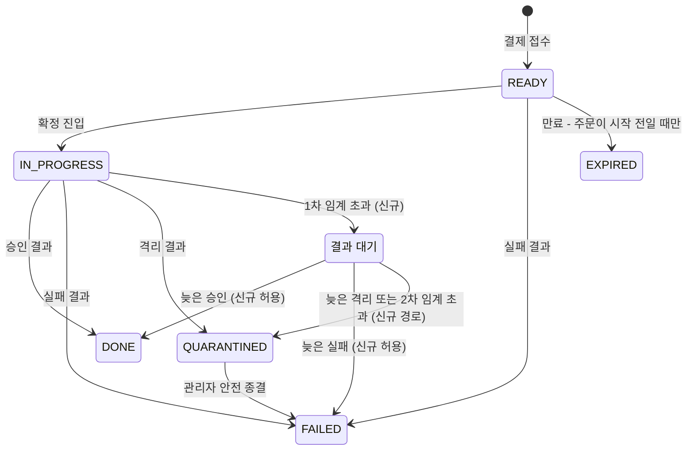

# CONFIRM-RESULT-NONRETRYABLE-STATUS 완료 브리핑

> 2026-09-06 ship 완료 · 이슈/PR #150 · 브랜치 `#150`

## 작업 요약

2026-09-01 스케일아웃 측정 중, 아무것도 고장 나지 않았는데 확정 파이프라인이 스스로 멈추는 경로가 관측됐다. 부하가 지속되면 확정 결과 회신이 리컨실러 임계(300초)를 넘기고, 리컨실러가 그 결제를 READY 로 되돌린다. 그 뒤 도착한 승인 결과는 READY 에서 완료로 갈 수 없어 거부되는데, 그 예외가 비재시도로 분류돼 있지 않아 1초 간격 5회를 다 쓴다. 백오프가 리스너 스레드 위에서 자므로 그 5초 동안 컨슈머가 다음 메시지로 넘어가지 못한다. 막힘이 회신을 늦추고, 늦어진 회신이 되돌릴 대상을 늘리고, 늘어난 만큼 거부가 늘어 더 막힌다. 실측에서 되돌린 건수가 25초 만에 965 에서 1,879 로 두 배가 됐고, 제출 42,281 건 중 완료는 25,539 건에 그쳤으며 16,742 건이 READY 에 영구 잔류했다.

싼 완화는 비재시도 분류 한 줄이었다. 그러나 그것만으로는 되돌아간 결제가 살아나지 않는다 — 벤더는 이미 승인했으므로 pg 가 같은 결과를 다시 보내고 결제는 같은 자리에서 다시 거부한다. 그래서 되돌리기의 도착지 자체를 바꿨다. **결과 대기(`AWAITING_RESULT`)** 는 "이미 확정에 진입했고 결과를 기다린다"만 뜻하는 상태이며, 여기서는 늦게 온 승인도 완료로 갈 수 있다. READY 에서 완료로 가는 길은 끝까지 열지 않았다 — 확정에 진입한 적 없는 결제가 떠도는 승인 메시지로 완료되는 것을 막기 위해서다.

설계 게이트에서 기존 코드의 돈 경로 결함 둘이 드러나 범위에 들어왔다. 리컨실러가 잠금 없이 읽고 전체 컬럼을 덮어써 그 사이 확정된 결제를 되돌리는 경로, 그리고 확정 결과 소비 경로가 같은 방식이라 새로 만든 자동 격리를 지우는 경로다. 둘 다 조건부 전이와 잠금 읽기로 막았다.

라이브 실측으로 닫았다. 운영 기본값에서는 임계에 닿는 결제가 없어 사고 조건이 만들어지지 않으므로, 1차 임계를 30초로 낮춰 되돌리기를 강제한 사이클을 따로 돌렸다. 되돌리기 44,999 건에 상태 예외 0 · DLQ 유입 0 · 미회수 선차감 0, 제출 51,704 건 전부 완료로 종결됐다.

## 핵심 설계 결정

|                결정                 |                              근거                              |                    기각된 대안                     |
|:-----------------------------------:|:--------------------------------------------------------------:|:--------------------------------------------------:|
| 되돌리기 도착지를 결과 대기로 신설 | 되돌려도 주문은 EXECUTING 에 남아 주문 단위 완료 전이가 이미 성립한다. 막고 있던 것은 결제 상태 하나뿐 | READY 에서 완료 허용 — 확정 진입 없는 결제가 떠도는 승인으로 완료된다 |
| 결과가 끝내 오지 않으면 격리 | 벤더 승인 여부를 모르는 채 종결하면 돈이 어긋난다. 판단 보류는 격리의 기존 역할 | 무기한 잔류 — 종결도 만료도 못 하고 아무도 못 보던 옛 상태의 반복 |
| 2차 임계 기준 시각은 상태 변경 시각 | 확정 진입 시각은 한 번 박히고 갱신되지 않아, 그것으로 재면 방금 옮긴 건이 같은 주기에 격리된다 | 기존 조회를 그대로 본뜬 확정 진입 시각 기준 |
| 리컨실러 쓰기를 조건부 전이로 | 읽고 쓰는 사이에 확정된 결제를 옛 스냅샷으로 되돌린다. 배치가 25초에 두 배가 됐다는 것이 그 구간이 수십 초라는 뜻 | 무버전 전체 덮어쓰기 유지 |
| 새 포트는 주문 테이블에 쓰지 않음 | 참고한 기존 전이는 주문까지 동조 갱신한다. 복제하면 같은 사고가 주문 쪽에서 재현 | 기존 전이 형태를 그대로 복제 |
| 위임 메서드 반환은 nullable | 두 AOP 가 반환값을 `instanceof PaymentEvent` 로 판별한다. `Optional` 로 감싸면 성공한 전이까지 감사가 사라진다 | `Optional` 반환(관용 형태) |
| 소비 경로 첫 조회를 잠금 읽기로 | 자동 격리를 소비 경로가 옛 스냅샷으로 지우고 재고 확정까지 발행한다 | 알려진 한계로 기록만 하고 넘기기 |
| 상태 예외를 타입 통째로 비재시도 | 컨슈머 경로에 도달하는 상태 예외는 완료 전이 거부 하나. 재시도가 유효한 관리자 종결 충돌은 관리자 HTTP 경로 전용 | 에러코드 단위 분류자(15종 목록 관리 부담) |

## 변경 범위

|      영역      | 내용 |
|:--------------:|:---|
| 도메인 | `PaymentEventStatus.AWAITING_RESULT` 추가(판별 메서드 둘에 분류). `PaymentEvent.done`/`fail` 허용 상태 확장, `resetToReady` → `resetToAwaitingResult` 개명 + 도착 상태 변경 |
| 포트·어댑터 | 조건부 전이 2종(`resolveInProgressToAwaitingResult`/`resolveAwaitingResultToQuarantine`), 결과 대기 2차 임계 조회, 주문 번호 잠금 읽기 |
| 유스케이스 | `PaymentCommandUseCase` 위임 메서드 2종(nullable 반환), `PaymentConfirmResultUseCase.handle` 첫 조회를 잠금 읽기로 |
| 스케줄러 | `PaymentReconciler` 두 단계 스캔 + 항목별 격리 + 경합/실패 분리 집계, 설정 키 `reconciler.awaiting-result-timeout-seconds`(기본 900) |
| 인프라 설정 | `KafkaErrorHandlerConfig` 비재시도 목록에 `PaymentStatusException` 추가 |
| 관측 | `PaymentReconcilerBatchMetrics` 신설, `PaymentHealthMetrics` 결과 대기 적체 게이지, `PaymentStatusMetricsAspect` 반환값 가드, trigger 상수 `RECONCILER` |
| 측정 도구 | 벤치마크 3종의 미종결 정의에 결과 대기 포함 — 빼고 세면 잔류가 종결된 것처럼 보인다 |
| 외부 문서 | 위키 `payment-recovery-model` 신설 + 스냅샷 2곳 단서, README Phase 6, 포트폴리오 상태 머신 |
| 스키마 | 변경 없음 — 상태가 VARCHAR + `EnumType.STRING` 매핑 |

## 다이어그램

READY 에서 DONE 으로 가는 화살표가 없는 것이 이 설계의 요점이다.

## 부수 효과 — 만료 경로 정상화

`PaymentEventStatus.READY` 를 세팅하는 곳이 결제 접수 하나로 줄었다. 그래서 READY 인 결제는 전부 주문이 NOT_STARTED 이고, 만료 가드를 항상 통과한다. 영영 만료 못 할 건(주문이 EXECUTING 인 READY)을 만료 배치가 매 주기 집어 스킵 지표만 쌓던 원인이 사라졌다. `CONCERNS.md` L-14 의 남은 문제 (1) 이 이것으로 닫혔다.

## 크래시 건은 어떻게 되는가

리컨실러의 원래 목적이던 "크래시로 멈춘 결제"의 처리 경로가 바뀌었다.

|      시점      | 전 | 후 |
|:--------------:|:---|:---|
| 1차 임계 초과 | READY 로 | 결과 대기로 |
| 그 뒤 재처리 | 없음 — 아웃박스는 별개 테이블 기준이라 결제 상태를 보지 않는다 | 결과가 오면 그대로 적용 |
| 결과가 끝내 안 오면 | 만료도 거부됨 → 영구 잔류, 아무도 보지 않음 | 2차 임계 후 격리 → 관리자 목록에 뜬다 |
| 종결 | 불가 | 관리자가 벤더 조회 후 안전 종결 |

주석은 "재시도 스케줄러가 재처리한다"고 적었으나 사실이 아니었다. 되돌리기는 아무 재처리도 부르지 않았고, 그 사실이 이 토픽의 조사에서 드러났다. 지금도 자동 재시도는 없다 — 대신 안 보이던 것이 보이게 됐다.

## 라이브 실측

|         항목          | 2026-09-01 (변경 전) | 2026-09-06 (변경 후) |
|:---------------------:|:--------------------:|:--------------------:|
|         제출          |        42,281        |        51,704        |
|         완료          |    25,539 (60%)      |   51,704 (100%)      |
|      미종결 잔류      |    16,742 (영구)     |        0             |
|       되돌리기        | 965 → 1,879 (자기 강화) |     44,999           |
|       상태 예외       |         838          |        0             |
|       DLQ 유입        |      분당 3건        |        0             |
|      정지 파티션      |      3 중 2          |        0             |
|   미회수 선차감 기록   |          —           |        0             |

운영 기본값으로 돌린 첫 사이클(`awaiting-result-v1`)은 제출 52,530 건이 전건 종결됐으나 임계에 닿는 결제가 없어 되돌리기가 0 건이었다 — 고친 경로가 발동하지 않았다. 그래서 1차 임계를 30초로 낮춘 사이클(`awaiting-result-forced`)을 따로 돌려 되돌리기를 강제했다. 위 표의 변경 후 값은 그 사이클이다.

측정 도구의 미종결 정의가 새 상태를 몰라 결과 대기 잔류가 종결로 보이던 문제를 먼저 고친 뒤 측정했다.

## 코드 리뷰 요약

게이트 라운드가 이례적으로 길었다. discuss 2라운드, plan 4라운드(한도 실패로 재시도 포함), ship 1라운드 + 재리뷰.

|   단계   | 판정 | 주요 지적과 처리 |
|:--------:|:----:|:---|
| discuss 1 | fail | **[critical]** 리컨실러의 무버전 덮어쓰기가 확정된 결제를 되돌린다 → 조건부 전이로 범위 확대. **[major]** 감사 경로 우회 → 위임 메서드 경유 |
| discuss 2 | revise | 조건부 전이 템플릿이 주문까지 갱신하는 형태라 복제 금지, 배치 poison-pill 격리 |
| plan 1~2 | revise | 개명이 다른 테스트를 깨뜨림(2회 연속) → 공통 완료 기준 절 신설로 일반화. `Optional` 반환 시 감사 소실. 2차 임계 앵커 컬럼 |
| plan 3 | revise | 도달 범위 고정 테스트가 아무것도 잠그지 못하는 형태 — 직전 라운드에 내가 낸 수정이 그 자체로 틀렸다 |
| plan 확인 | pass | 세 findings 모두 닫힘 확인 |
| ship | pass | minor 4건 — 가드 통과 상태 테스트 누락 / Fake 별칭 함정 / nullable 근거 주석 / 로그 라벨 정정(스킵) |
| ship 재리뷰 | pass | 채택 3건 해소 확인, Fake 조회 경로는 후속 등재 |

상세는 `CONFIRM-RESULT-NONRETRYABLE-STATUS-PLAN.md` 의 `## 리뷰 처리` 절.

## 수치

- 태스크 11개 / 커밋 26개 / 34파일 2,600줄 추가 178줄 삭제
- 단위 713건 · 통합 718건 전부 통과 (캐시 무시 강제 재실행), 린트 전 서비스 통과
- findings: critical 1 · major 9 · minor 8 (채택 19, 스킵 1)
- 라이브 사이클 2회 (운영 기본값 / 1차 임계 30초 강제)

## 후속

- `FAKE-REPO-FIND-ALIASING` — 테스트용 저장소의 조회가 내부 참조를 그대로 돌려준다. 프로덕션 영향 없음, 실제 리컨실러와 위임 메서드를 조립하는 첫 테스트가 오판할 수 있다
- `OUTBOX-STALE-PUBLISH-AFTER-AWAITING-RESULT` — 발행이 밀린 행이 뒤늦게 확정 명령을 내보내는 경로. 2차 임계로 격리에 도달한 뒤에는 발행 가드가 걸리므로 무기한이던 창에 상한이 생겼다
- 승인으로 확인된 격리를 완료로 되살리는 경로는 여전히 없다(TQ-2 잔여)
- 동시성 1에서 한 레코드의 정지가 파티션 하나만 세우는지 컨슈머가 가진 전부를 세우는지는 미확인 — 이번 측정에서 정지 자체가 없어 확인 기회가 없었다
