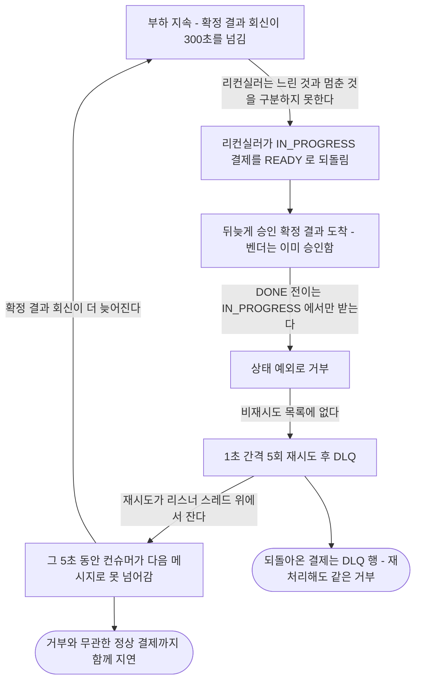
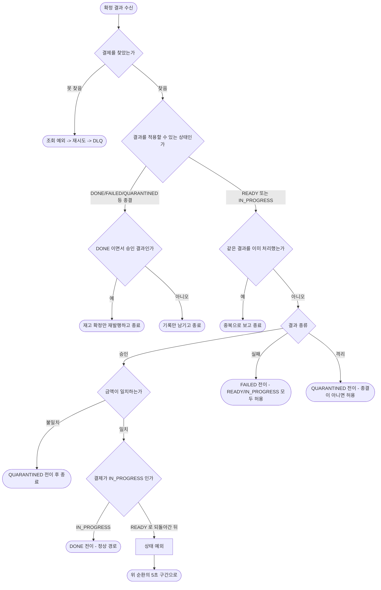
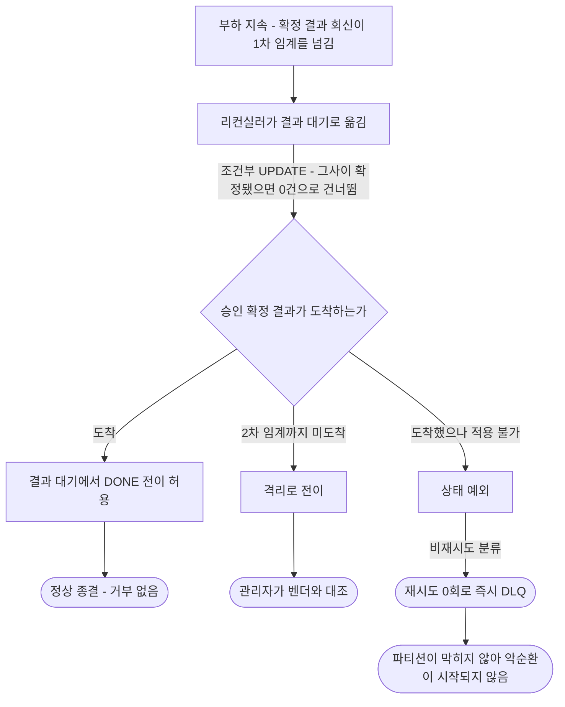
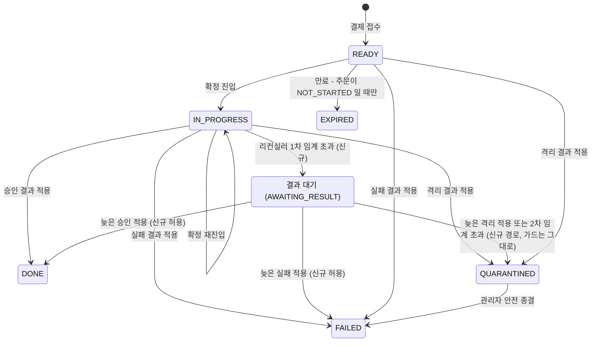

# 적용 불가 상태의 확정 결과 처리 설계

> 최종 수정: 2026-09-05

## 사전 브리핑

### 용어

|      용어      |                                   뜻                                    |
|:--------------:|:-----------------------------------------------------------------------|
|    리컨실러    | IN_PROGRESS 로 오래 멈춰 있는 결제를 주기로 훑어 READY 로 되돌리는 안전망 |
|   확정 결과    | pg-service 가 벤더 승인/실패/격리 판정을 payment-service 로 돌려보내는 메시지 |
|      DLQ       | 재시도로 처리하지 못한 메시지를 따로 모아 두는 격리 큐 |
| 비재시도 분류  | 재시도해도 소용없는 예외를 재시도 없이 바로 DLQ 로 보내도록 지정한 목록 |

결제 상태는 READY(대기) → IN_PROGRESS(승인 진행 중) → DONE(완료) 순으로 간다.

### 현재 이해한 문제

부하가 이어지면 리컨실러가 IN_PROGRESS 결제를 READY 로 되돌린다. 그 뒤 승인 확정 결과가 도착해도 결제는 READY 라서 DONE 으로 갈 수 없어 거부한다. 이 거부는 재시도해도 절대 성공하지 않는데, 비재시도로 분류돼 있지 않아 1초 간격 5회를 다 쓰고 DLQ 로 간다. 그 5초 동안 컨슈머가 다음 메시지로 넘어가지 못한다.

**어디서 일어나는가** — 확정은 payment 가 `payment.commands.confirm` 으로 명령을 보내고 pg 가 벤더 호출 뒤 결과를 `payment.events.confirmed` 로 돌려보내는 왕복이다. 문제는 **돌아오는 메시지를 payment 가 소비하는 구간**에만 있다(`ConfirmedEventConsumer.consume` → `PaymentConfirmResultUseCase.handle`). pg 쪽은 정상이다 — 실측에서 `pg_inbox` 42,281 건이 전부 APPROVED 로 완주했다.

### 현재 시스템 동작 — 부하가 지속될 때

아무것도 고장 나지 않은 상태에서 시작한다. 벤더도 응답하고 DB 도 살아 있다. 부하가 이어지는 것만으로 아래가 돈다.

각 단계가 왜 그렇게 되는지, 그리고 그것을 정하는 것이 무엇인지는 아래와 같다.

| 단계 | 왜 그렇게 되나 | 무엇이 정하나 |
|:---:|:---|:---|
| 되돌리기 | IN_PROGRESS 가 임계를 넘기면 멈춘 것으로 보고 무조건 READY 로 되돌린다. 크래시 복구용 안전망인데, 부하 구간에서는 정상 처리도 임계를 넘는다 | `reconciler.in-flight-timeout-seconds` 운영 기본 300초 |
| 거부 | DONE 전이는 IN_PROGRESS 에서만 받는다. 앞단의 종결 가드는 READY 를 적용 가능으로 통과시키므로, 거부는 가드가 아니라 도메인 전이에서 난다 | `PaymentEvent.done` |
| 5초 | 상태 예외가 비재시도 목록에 없어 백오프를 끝까지 쓴다. 목록에는 역직렬화 실패, 데이터 형식 손상, 불변식 위반 셋뿐이다 | `FixedBackOff(1000ms, 5)` |
| 막힘 | 백오프 재시도가 리스너 스레드 위에서 잔다. 그 스레드는 5초 내내 다음 레코드로 못 간다. 그래서 5초는 거부당한 결제 하나가 아니라 뒤에 줄 선 전부의 5초다 | `DefaultErrorHandler` blocking 재시도 |
| 악순환 | 막혀서 회신이 늦어지면 되돌릴 대상이 늘고, 늘어난 만큼 거부가 늘어 더 막힌다 | 위 넷의 조합 |

**막힘의 원인은 커밋이 아니다.** 커밋이 안 되는 것은 맞지만, 그건 원인이 아니라 같은 원인에서 나온 다른 결과다. 예외가 나면 트랜잭션이 abort 돼 오프셋 커밋 자체가 일어나지 않고(시도했다 실패한 것이 아니다), 동시에 스레드가 재시도에 묶인다. 둘 다 "스레드가 5초간 붙잡혔다"에서 나온다. 예외 없이 느린 조회로 5초를 써도 — 처리가 성공하고 커밋도 정상으로 되는데 — 뒤 메시지는 똑같이 5초를 기다린다.

커밋이 하는 역할은 따로 있다. **같은 메시지가 다시 오게 하는 것**(오프셋이 안 올라가 버려지지 않는다)과, **5회 소진 후 DLQ 발행과 함께 오프셋이 넘어가며 줄이 풀리는 것**이다. 처리는 성공했는데 커밋만 반복 실패하는 상황은 이것과 다른 경로이며 `afterRollbackProcessor` 가 자기 백오프로 따로 처리한다.

실측(2026-09-01)에 이 순환이 그대로 찍혔다. 되돌린 건수가 25초 만에 965 에서 1,879 로 두 배가 됐고, 상태 예외가 838 건 났으며, 파티션 3 개 중 2 개가 멈추고 그 둘에만 DLQ 가 쌓였다. 제출 42,281 건 중 DONE 은 25,539 건, READY 로 되돌아간 채 남은 것이 16,742 건이다.

다만 **피해 범위는 파티션 하나보다 넓을 수 있다.** 컨슈머 동시성이 기본 1이라(`KafkaConsumerConfig.java:103`) 스레드 하나가 파티션 3 개를 모두 든다. 그러면 한 레코드의 5초가 그 파티션이 아니라 그 컨슈머가 가진 파티션 전부를 세운다. 실측에서 파티션 1 이 lag 0 이었던 것은 거기 밀린 것이 없었기 때문일 수도 있어, 파티션 단위로 격리됐다는 근거는 되지 못한다 — 확인이 필요하다.

READY 로 되돌아간 결제는 재처리해도 결과가 같다. 벤더는 이미 승인했으므로 pg 가 같은 승인 결과를 다시 보내고, 결제는 같은 자리에서 다시 거부한다.

### 거부가 나는 지점

위 순환의 세 번째 단계를 메시지 한 건 기준으로 펼치면 이렇다. 실패/격리 결과는 왜 같은 문제를 안 겪는지도 여기서 갈린다.

승인 결과만 이 자리를 통과하지 못한다. FAILED 전이는 READY 와 IN_PROGRESS 를 모두 받고 종결이면 조용히 넘어가며, QUARANTINED 전이는 종결일 때만 거부하는데 그 앞의 종결 가드가 이미 걸러낸다. READY 로 되돌아간 결제에 도착하는 것이 하필 승인 결과라 거부가 나는 것이고, 부하 구간에서는 그게 대부분이다.

### 이번 discuss 에서 결정하려는 것

- 비재시도 분류를 어느 단위로 걸지 — 예외 타입 통째로 / 에러코드 단위로 가르기 / 거부 지점에서 다른 예외로 갈라 던지기
- DLQ 로 보낸 결제를 어떻게 되살릴지. 실측에서 16,742 건이 READY 에 남았고 재처리로는 풀리지 않았다
- 관리자 격리 종결의 충돌 예외는 재시도가 유효한데, 같은 예외 타입이라 함께 묶일 위험이 있는지
- 이번 범위를 여기서 끊을지, 리컨실러가 느림과 멈춤을 구분하는 근본 수정까지 끌고 갈지
- 고친 뒤 무엇으로 확인할지 — 재현 조건과 관찰 지표

### 열린 질문 / 가정

- **사전 조사로 좁혀진 것**: 컨슈머 경로에서 실제로 터지는 상태 예외는 DONE 전이 거부 하나로 보인다. FAILED 전이는 READY 와 IN_PROGRESS 를 모두 받고 종결이면 조용히 넘어가며, QUARANTINED 전이는 종결일 때만 거부하는데 그 앞의 종결 가드가 이미 걸러낸다. 관리자 격리 종결의 충돌은 관리자 HTTP 경로에서만 던져진다. 게이트 전에 이 셋을 근거까지 확정한다
- **가정**: READY 로 되돌아간 결제가 DLQ 로 가는 것 자체는 지금도 일어나는 일이고, 이번 변경은 거기 도달하는 시간을 5초에서 0초로 줄인다. 결과가 사라지는 것은 아니다
- **확인 필요 (미해소)**: 동시성 1 에서 한 레코드의 정지가 파티션 하나만 세우는지, 그 컨슈머가 가진 파티션 전부를 세우는지. 피해 범위 추정이 달라진다. 채택안의 방향은 바꾸지 않으므로 라이브 검증에서 함께 확인한다

> 이 아래 설계 절이 위 결정 항목에 답한다. 브리핑 시점에 범위 밖 후보로 적었던 "별도 상태를 두는 근본 수정"은 인터뷰에서 범위 안으로 들어왔고, DLQ 잔류분 복구를 어떻게 할지의 미결도 그 결정에 흡수됐다.

## 요약 브리핑

### 결정된 접근

리컨실러가 IN_PROGRESS 결제를 되돌릴 때 READY 가 아니라 **결과 대기** 상태로 둔다. 그 상태에서는 늦게 도착한 승인도 완료로 갈 수 있어 거부 자체가 사라지고, READY 에 묶여 있던 잔류분 문제도 함께 풀린다. 비재시도 분류는 그대로 넣어 남은 거부의 비용을 0으로 만든다.

게이트에서 지금 코드의 결함이 하나 드러나 같이 고친다. 리컨실러가 락 없이 읽고 전체 컬럼을 덮어써, 읽고 쓰는 사이에 확정된 완료 결제를 옛 값으로 되돌린다. 두 전이 모두 조건부 UPDATE 로 바꾸고 감사 경로로 태운다.

### 변경 후 동작

### 핵심 결정

- 되돌리기 도착 상태를 결과 대기로 바꾼다. READY 에서 완료로 가는 길은 열지 않는다 — 확정에 진입한 적 없는 결제가 떠도는 승인으로 완료되면 안 된다
- 결과 대기에서 완료와 실패 전이를 허용한다. 격리 전이는 이미 비종결을 다 받으므로 코드 변경이 없다
- 리컨실러의 두 쓰기를 조건부 UPDATE 로 바꾸고, 주문 테이블에는 쓰지 않는다
- 리컨실러 전이를 감사 경로로 태우되, 건너뛴 건에는 이력이 남지 않게 반환으로 가른다
- 배치는 항목별로 실패를 격리해 한 건이 나머지를 막지 않게 한다
- `PaymentStatusException` 을 타입 통째로 비재시도 분류하고, 도달 범위를 테스트로 못박는다

### 트레이드오프와 후속

- 상태가 하나 늘어 판별 메서드와 지표, 관리자 표시가 그만큼 넓어진다. 스키마 변경은 없다
- 결과 대기에 머무는 동안 선차감 재고가 잠긴다. 주기 회수는 종결된 결제만 훑기 때문이며, 방향은 안전한 쪽이다
- 승인으로 확인된 격리를 완료로 되살리는 경로는 여전히 없다. 이번 설계는 그런 격리를 만들지 않는 쪽으로 막고, 복구 경로는 기존 후속에 남긴다
- 동시성 1에서 정지 범위가 파티션 하나인지 전부인지는 라이브 검증에서 확인한다
- domain-expert 포함 대상이다 — 결제 상태 전이와 복구 경로를 건드린다

---

## 문제 정의

부하가 지속되면 리컨실러가 IN_PROGRESS 결제를 READY 로 되돌리고, 뒤늦게 도착한 승인 확정 결과가 `PaymentEvent.done` 에서 거부된다. 이 거부는 재시도해도 성공하지 않는데 비재시도로 분류돼 있지 않아 레코드당 5초를 쓰고, 그 5초 동안 컨슈머가 다음 메시지로 넘어가지 못한다. 막힘이 회신을 늦추고 늦어진 회신이 되돌리기를 늘리는 악순환이 실측으로 확인됐다.

조사에서 두 가지가 더 드러났다.

**되돌리기는 재처리를 유발하지 않는다.** `resetToReady` 의 주석은 재시도 스케줄러가 READY 를 재처리한다고 적었으나, `OutboxWorker` 가 집는 것은 `payment_outbox` 의 PENDING 행이고 `payment_event` 상태와 무관하다. 되돌리기의 실제 효과는 만료 대상이 되는 것과 확정 결과를 받을 수 있는 상태가 되는 것뿐이다.

**되돌아간 결제는 만료도 되지 않는다.** `PaymentOrder.expire` 는 NOT_STARTED 에서만 허용되는데, 확정에 진입한 주문은 이미 EXECUTING 이다. 그래서 만료 배치가 집어도 전이가 거부된다. 실측의 16,742 건이 READY 에 영구 잔류한 이유다.

세 번째 사실이 설계의 근거가 된다. **되돌아가도 주문은 EXECUTING 에 그대로 남는다.** `resetToReady` 는 `PaymentEvent` 의 상태만 바꾸고 주문은 건드리지 않는다. 늦게 온 승인이 주문을 SUCCESS 로 올리는 것은 지금도 성립한다 — 막고 있는 것은 결제 쪽 상태 하나뿐이다.

## 영향 범위

|                  대상                   |  성격  | 내용 |
|:---------------------------------------:|:------:|:---|
| `PaymentEventStatus`                    | 변경 | 결과 대기 상태 추가. 판별 메서드 둘(`isTerminal` 비종결 / `canApplyConfirmResult` 적용 가능)에 분류 |
| `PaymentEvent.done`                     | 변경 | 결과 대기에서도 허용 (지금은 IN_PROGRESS 전용) |
| `PaymentEvent.fail`                     | 변경 | 결과 대기에서도 허용 (지금은 READY/IN_PROGRESS 명시 체크) |
| `PaymentEvent.quarantine`               | 무관 | 종결만 막고 나머지는 통과시켜 결과 대기를 이미 받는다 |
| `PaymentEvent.resetToReady`             | 변경 | 도착 상태를 결과 대기로 바꾸고 이름도 그에 맞춘다 |
| `PaymentReconciler`                     | 변경 | 되돌리기와 2차 임계 격리 둘 다 조건부 UPDATE + 감사 경로 경유 |
| `PaymentCommandUseCase`                 | 변경 | 리컨실러 전이용 위임 메서드 신설 (감사 AOP 부착) |
| `PaymentEventRepository`                | 변경 | 조건부 UPDATE 포트 추가 + 결과 대기 2차 임계 초과 조회 포트 추가 |
| `KafkaErrorHandlerConfig`               | 변경 | `PaymentStatusException` 을 비재시도 목록에 추가 |
| `PaymentHealthMetrics`                  | 변경 | 멈춘 결제 게이지가 재는 대상이 바뀐다 (결정 사항 참고) |
| 관리자 조회 / 상태 지표                  | 변경 | 새 상태의 표시와 집계 |
| `PaymentConfirmResultUseCase`           | 변경 | 종결 가드 판정은 그대로 두되, 첫 조회를 잠금 읽기로 바꾼다 |
| `OutboxRelayService`                    | 무관 | 발행 직전 가드도 같은 판별 메서드를 쓴다. 결과 대기는 비종결이라 기존 READY 와 똑같이 통과한다 |
| `PaymentScheduler` / 만료 서비스         | 무관 | 결과 대기는 만료 대상이 아니다 |
| `OutboxWorker`                          | 무관 | `payment_outbox` 기준이라 결제 상태와 무관 |
| Flyway                                  | 무관 | `status` 가 VARCHAR + EnumType.STRING 이라 마이그레이션 불필요 |

## 상태 전이

신규 표시가 이번에 추가되는 전이다. `IN_PROGRESS -> READY` 는 사라진다.

READY 에서 DONE 으로 가는 화살표는 없다. 그것이 이 설계의 요점이다 — 확정에 진입한 적 없는 결제가 떠도는 승인 메시지로 완료되는 길을 열지 않는다. CANCELED / PARTIAL_CANCELED 는 이 경로들이 만들지 않는 종결 상태라 그림에서 뺐다.

## 설계 옵션 비교

### 되돌리기를 미룬다 (기각)

확정 결과 소비 적체가 임계 이상이면 이번 주기는 되돌리지 않는다. 상태 모델을 안 건드려 가장 가볍다.

기각 이유는 거부를 없애지 못하기 때문이다. 적체가 풀리면 결국 되돌리고, 그 뒤 늦은 결과가 오면 같은 자리에서 같은 거부가 난다. 확률을 낮출 뿐이고 임계라는 튜닝 값이 하나 더 생긴다. READY 에 잔류한 결제를 되살리지도 못한다.

### 임계를 적체에 연동한다 (기각)

300초 고정 대신 적체 깊이에 따라 임계를 늘린다. 위와 성격이 같고 연속적으로 움직일 뿐이라 같은 이유로 기각한다.

### 늦은 결과를 받아주는 상태를 둔다 (채택)

되돌릴 때 READY 가 아니라 **결과 대기** 상태로 둔다. 이 상태에서는 늦게 도착한 승인도 DONE 으로 갈 수 있어 거부 자체가 사라지고, 잔류분 문제도 함께 풀린다.

READY 의 의미를 건드리지 않는 것이 이 안의 핵심이다. READY 는 확정에 진입하기 전을 뜻하므로, 거기서 DONE 을 허용하면 승인받은 적 없는 결제가 떠도는 승인 메시지로 완료될 수 있다. 별도 상태는 그 위험 없이 "이미 확정에 진입했고 결과를 기다린다"만 표현한다.

## 결정 사항

|              항목              |                          결정                          | 이유 |
|:------------------------------:|:------------------------------------------------------:|:---|
| 되돌리기 도착 상태 | READY 가 아닌 결과 대기 상태 | READY 는 확정 진입 전을 뜻한다. 거기서 완료를 허용하면 승인 없는 결제가 떠도는 메시지로 완료될 수 있다 |
| 결과 대기에서의 완료 전이 | 허용 | 주문이 EXECUTING 에 남아 있어 주문 단위 완료 전이가 이미 성립한다. 막고 있던 것은 결제 상태 하나뿐이다 |
| 결과 대기에서의 실패 전이 | 허용 (코드 변경) | 늦게 오는 결과가 승인만은 아니다. `fail` 은 READY/IN_PROGRESS 를 명시 체크하므로 손봐야 한다 |
| 결과 대기에서의 격리 전이 | 허용 (코드 변경 없음) | `quarantine` 은 종결만 막고 나머지는 통과시킨다. 결과 대기가 비종결이므로 이미 성립한다 |
| 리컨실러의 상태 쓰기 | 조건부 UPDATE (`WHERE id, status`) 로 바꾸고 0건이면 건너뜀 | 지금은 락 없이 읽고 전체 컬럼을 덮어써, 읽고 쓰는 사이에 확정된 DONE 을 옛 스냅샷으로 되돌린다. 주문의 SUCCESS 까지 같이 되돌아간다. 관리자 격리 종결이 쓰는 조건절 형태를 참고한다 |
| 새 포트가 건드리는 테이블 | `payment_event` 만. `payment_order` 에는 어떤 경우에도 쓰지 않는다 | 리컨실러의 두 전이는 도메인상 주문 상태를 바꾸지 않는다. 참고한 격리 종결은 주문까지 동조 갱신하는 형태라 그대로 베끼면 이벤트는 지켜지고 주문만 옛 값으로 덮이는, 같은 사고가 주문 쪽에서 재현된다 |
| 리컨실러의 전이 경로 | `PaymentCommandUseCase` 위임 메서드 경유 | 지금은 도메인 메서드를 직접 부르고 저장해 이력이 안 남는다. 자동 격리와 벤더 판정 격리를 관리자가 구분할 수 없고, 사고가 나도 재구성이 안 된다 |
| 위임 메서드의 반환 계약 | 옮겼으면 결제를 반환하고, 조건부 UPDATE 가 0건이면 아무 것도 반환하지 않는다 | 감사 이벤트 발행 AOP 가 반환값을 보고 발행 여부를 정한다. 옮기지 않은 건에 이력이 남으면 안 된다. 참고한 격리 종결은 충돌 시 예외를 던져 롤백으로 발행을 막지만, 배치는 예외를 던지면 안 되므로 반환으로 가른다 |
| 소비 경로의 결제 조회 | 잠금 읽기로 바꾼다 | 소비 경로는 잠금 없이 읽고 전체를 덮어쓰며 버전 컬럼도 없다. 자동 격리 직후 도착한 확정 결과가 옛 스냅샷으로 커밋되면 격리 판정이 지워지고, 승인이면 재고 확정까지 발행돼 되돌릴 수 없다. 잠금 아래에서 종결 가드를 판정하면 어느 순서로 겹쳐도 결과가 맞다 |
| 배치 루프의 예외 처리 | 항목별로 감싸 충돌·실패를 격리하고, 건너뛴 수를 카운터와 경고 로그로 남긴 뒤 나머지를 계속 처리 | 이 토픽의 전제가 배치가 크게 잡히는 상황이라 충돌 확률도 높다. 한 건이 나머지를 막으면 복구가 다음 주기로 통째로 밀린다. 만료 배치가 이미 같은 문제를 겪고 건별 격리로 고친 전례가 있다 |
| 멈춘 결제 게이지 | 결과 대기를 세는 게이지를 따로 둔다 | 되돌아간 결제가 기존 게이지에서 빠져 나가므로, 그대로 두면 적체가 줄어든 것처럼 보인다 |
| 결과 대기의 만료 | 대상에서 제외 | 주문이 EXECUTING 이라 만료 전이 자체가 거부된다. 대상에 넣어도 매 주기 실패만 쌓인다 |
| 결과가 끝내 오지 않을 때 | 2차 임계 초과 시 격리로 전이 | 벤더 승인 여부를 모르는 채 종결하면 돈이 어긋난다. 판단 보류는 기존 설계에서 격리의 역할이다 |
| 2차 임계 대상 조회 | 결과 대기 + 경과시간 조회 포트를 신설하고 기존 리컨실러 주기(`scan`) 안에서 1차와 함께 돈다 | 두 스캔이 같은 주기를 공유하면 순서가 정해져 같은 건이 한 주기에 두 번 옮겨지지 않는다. 별도 스케줄은 그 순서를 잃는다 |
| 2차 임계 설정 키 | `reconciler.awaiting-result-timeout-seconds` (1차 `reconciler.in-flight-timeout-seconds` 와 짝) | 1차와 값을 따로 움직여야 한다. 2차는 pg 왕복이 끝날 시간을 충분히 준 뒤여야 하므로 1차보다 크다 |
| 비재시도 분류 단위 | `PaymentStatusException` 타입 통째로 | 컨슈머 경로에 도달하는 상태 예외는 완료 전이 거부 하나이고, 재시도가 유효한 격리 종결 충돌은 관리자 HTTP 경로에서만 던져진다 |
| 분류의 안전장치 | 도달 범위를 고정하는 테스트 | 타입 단위 분류는 도달 범위가 바뀌면 조용히 깨진다. 관리자 경로 예외가 컨슈머 에러 핸들러에 닿지 않음을 테스트로 못박는다 |
| 두 변경의 관계 | 둘 다 적용 | 리컨실러 수정이 거부를 없애고, 비재시도 분류가 남은 거부의 비용을 0으로 만든다. 앞이 뚫려도 뒤가 파이프라인 정지를 막는다 |
| DB 마이그레이션 | 없음 | `status` 가 VARCHAR + EnumType.STRING 이라 새 값 추가에 스키마 변경이 필요 없다 |

## 장애 시나리오와 대응

|                시나리오                 | 대응 |
|:---------------------------------------:|:---|
| pg 가 결과를 끝내 발행하지 못함 | 결과 대기로 남는다. 2차 임계를 넘기면 격리로 보내 사람이 벤더와 대조한다 |
| 늦게 온 승인의 금액이 불일치 | 기존 경로 그대로 격리. 금액 대조는 완료 전이 앞에 있어 새 상태와 무관하다 |
| 같은 결과가 재배달 | 기존 멱등 처리 그대로. 종결 가드와 중복 표시가 먼저 흡수한다 |
| 결과 대기 상태에서 관리자가 개입 | 격리 종결 경로는 격리 상태만 받는다. 결과 대기는 대상이 아니며, 개입이 필요하면 격리를 거쳐야 한다 |
| 비재시도 분류 후에도 거부가 발생 | 재시도 없이 즉시 격리 큐로 간다. 파티션은 막히지 않고 관리자 재주입 대상이 된다 |
| 결과 대기 상태가 예상보다 오래 쌓임 | 상태별 지표로 관측한다. 2차 임계와 격리 전이가 상한을 준다 |
| 리컨실러가 읽은 뒤 쓰기 전에 그 결제가 확정됨 | 조건부 UPDATE 가 0건으로 끝나 건너뛴다. 지금은 DONE 을 덮어써 주문의 SUCCESS 까지 되돌리는 경로다 |
| 잘못 격리된 완료 결제 | 위 조건부 UPDATE 로 애초에 만들지 않는다. 만들어지면 관리자 종결이 벤더 승인 확인으로 거부되고 격리에서 완료로 돌아오는 경로가 없어 빠져나갈 길이 없다 |
| 자동 격리된 건이 8일을 넘김 | 선차감 흔적이 만료돼 재고가 복원되지 않는다. 방향은 안전한 쪽이나 사람이 대사해야 한다. 흔적 만료 임박 알람은 별건으로 이미 등재돼 있다 |
| 결과 대기 중인 결제의 선차감 기록 | 주기 회수는 종결된 결제만 훑으므로 결과 대기와 격리는 건드리지 않는다. 진행 중 재고를 되살리는 사고는 나지 않되, 관리자가 종결할 때까지 그만큼 재고가 잠긴다 |
| 자동 격리 직후 확정 결과가 도착 | 소비 경로가 잠금 읽기로 읽어 격리를 보고 물러난다. 잠금이 없으면 격리 판정이 지워지고 승인분의 재고 확정이 그대로 나간다 |
| 배치 도중 한 건이 경합으로 실패 | 그 건만 건너뛰고 카운터와 경고를 남긴 뒤 나머지를 계속 처리한다. 막으면 복구가 통째로 다음 주기로 밀린다 |

## 검증 전략

- **단위** — 결과 대기에서 완료/실패/격리 전이가 허용되고 READY 에서는 완료가 여전히 거부되는지
- **통합** — 되돌아간 결제에 승인 결과가 도착하면 완료로 종결되는지, 확정 결과 소비 경로에서 상태 예외가 재시도 없이 격리 큐로 가는지, 관리자 격리 종결의 충돌 예외가 컨슈머 에러 핸들러 경로에 닿지 않는지
- **경합 (통합)** — 리컨실러가 읽은 뒤 쓰기 전에 그 결제가 DONE 으로 확정되면 조건부 UPDATE 가 0건으로 끝나고 상태와 주문이 그대로 남는지. 2차 임계 격리 쪽도 같은 형태로 고정한다. 건너뛴 건에 감사 이력이 남지 않는 것도 같이 본다
- **배치 격리 (통합)** — 배치 중 한 건이 경합으로 실패해도 나머지가 처리되는지. 만료 배치의 같은 성격 테스트를 본으로 삼는다
- **라이브 (ship 단계 1회)** — 실측과 같은 조건으로 부하를 건다. 비교 대상은 2026-09-01 `post-2-v8` 사이클

라이브 판정선은 아래와 같이 둔다.

|            항목            |           통과 기준           | 실측 당시 값 |
|:--------------------------:|:-----------------------------:|:---:|
| 확정 결과 소비 정지 파티션 | 0 개 | 3 개 중 2 개 |
| 되돌리기 건수 증가 | 연속 두 주기 사이 2배 미만 | 25초 만에 965 -> 1,879 (2배) |
| 상태 예외 1건당 점유 | 재시도 0회 | 1초 간격 5회 (약 5초) |
| 종결되지 못한 잔류 | 부하 종료 후 0 으로 수렴 | 16,742 건 영구 잔류 |

- **관찰 지표** — 상태별 결제 수(결과 대기 포함), 확정 결과 소비 적체, 격리 큐 유입, 되돌리기 건수

## 제외 범위

- **리컨실러 임계의 적체 연동** — 채택안이 거부를 없애므로 임계 튜닝의 이득이 줄었다. 결과 대기가 과도하게 쌓이면 그때 다시 본다
- **기존 READY 잔류 데이터 정리** — 학습용 환경이고 측정마다 초기화한다. 운영 데이터 이관 절차는 두지 않는다
- **확정 요청 멱등키 도입** — 주문 접수에만 있고 확정에는 없는 문제다. 이 토픽이 만들어낸 후속이 아니라 이전부터 별건으로 추적 중이며 `docs/STATE.md` 재개 메모가 그 자리다(재고 게이트 작업에서 주문 단위 선점으로 대응했고 헤더 도입은 그때도 범위 밖이었다). 이번 작업이 이 문제를 키우지도 줄이지도 않아 후속 목록으로 옮기지 않는다
- **격리에서 완료로 돌아오는 복구 경로** — 승인으로 확인된 격리를 되살리는 길은 지금도 없다. 이번 설계는 그런 격리를 만들지 않는 쪽으로 막고, 복구 경로 자체는 기존 후속(TQ-2 잔여)에 남긴다
- **파티션/컨슈머 동시성 기본값 승격** — 되돌릴 수 없는 변경이라 별도 판단이 필요하다
- **DLQ 조건부 자동 재시도** — 격리 큐 회수는 관리자 수동 재주입을 그대로 쓴다

## 참고

- `docs/context/CONCERNS.md` L-19 — 실측 수치와 자기 강화 경로
- `docs/context/TODOS.md` — 이 토픽의 출처 두 항목
- `docs/context/CONFIRM-FLOW.md` — 비동기 확정 사이클
