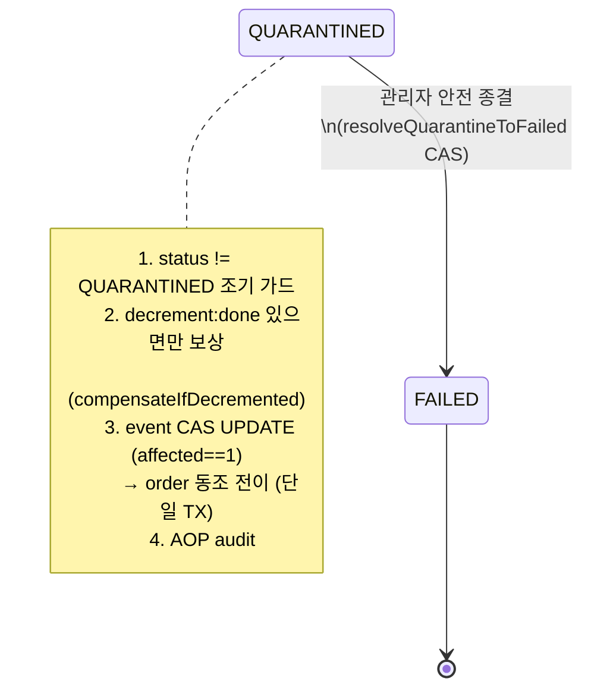

# DLQ-QUARANTINE-RECOVERY 완료 브리핑

> 이슈/브랜치 #122 · 2026-07-10 ~ 2026-07-11 · 17커밋 (discuss/plan 각 1 docs + 실행 15)

---

## 작업 요약

**배경.** 시스템에는 두 종류의 "멈춘 결제"가 존재했다. (1) `QUARANTINED` 상태 — CACHE_DOWN(재고 캐시 장애)이나 PG 판단 불가로 격리된 결제. `isTerminal()=false`라 `GET /status` 폴링이 PROCESSING 에서 영원히 끝나지 않고, 상태를 되돌릴 운영 수단이 없었다. (2) `payment.events.confirmed.dlq` 적체 메시지 — EOS 커밋 지속 실패 등으로 DLQ 에 쌓인 결과 메시지를 **가시화**(DLQ-REACHABILITY, #114)까지는 했으나, 실제로 되돌려 재처리할 자동/수동 경로가 없었다(TQ-1 후속으로만 남아 있었다).

**문제.** 두 경우 모두 "코드가 자동으로 못 푸는, 사람이 판단해야 하는 잔여"였고, 판단을 내려도 실행할 도구가 없었다. 특히 격리 결제를 어느 방향으로 종결할지는 **돈이 잡혔는지(capture)** 에 달렸는데, QUARANTINED 로 가는 경로(CACHE_DOWN / 판단 불가)는 벤더 승인 확정 전이라 돈이 잡히지 않은 상태다.

**접근.** 자동 복구를 만들지 않고 **관리자 수동 복구 도구**로 범위를 좁혔다. 격리 결제는 **DONE 되살리기를 배제하고 FAILED 안전 종결만** 지원한다 — 돈이 안 잡힌 결제를 DONE 으로 올리면 유령 매출(phantom revenue)이 되기 때문. 종결 시 재고는 `decrement:done` 토큰이 있을 때만 보상해 유령 재고(phantom stock)를 막고, event↔order 를 CAS 로 동조 전이한다. DLQ 는 별도 자동 소비 컨슈머를 만들지 않고 **원 토픽 재발행**으로 기존 EOS 컨슈머 파이프라인을 그대로 재사용하되, 뒤늦은 재주입을 나이 게이트로 차단한다. 진입은 Thymeleaf 관리자 상세 화면의 버튼 2종(POST).

**결과.** 격리 결제를 감사 기록과 함께 FAILED 로 안전 종결하고, DLQ 적체분을 원 토픽으로 되돌려 재처리하는 관리자 경로가 생겼다. 단위 504 + 통합 48 PASS + checkstyle/spotbugs 통과. 남은 잔여(격리 DONE 복구·조건부 자동 재시도·토큰 만료 후 미복원 등)는 보수적 방향(언더셀)이라 CONCERNS/TODOS 에 한계로 등재.

---

## 핵심 설계 결정

### 1. 범위 — 격리 결제는 FAILED 안전 종결만, DONE 복구는 배제
- **근거**: QUARANTINED 진입 경로(CACHE_DOWN / PG 판단 불가)는 벤더 승인 확정 **이전**이라 돈이 잡히지 않았다. 이를 DONE 으로 되살리면 매출은 잡혔는데 실제 캡처는 없는 **유령 매출**이 된다. 종결 방향을 안전한 FAILED 로만 고정.
- **기각한 대안**: DONE 복구 동시 지원 → payment→pg 상태 조회 포트 + 재고 원장 write-back(stock-committed 재발행·redis 재정렬)이 선결이라 별도 후속 토픽(TQ-2)으로 미룸.

### 2. 토큰 조건부 재고 보상 (`compensateIfDecremented`)
- **결정**: 보상 Lua(`stock_compensation_if_decremented.lua`)가 `decrement:done:{orderId}` **존재를 먼저 확인**하고, 없으면 `NO_DECREMENT` 로 early return(보상 안 함). 있을 때만 `compensation:done` SETNX + 재고 INCR.
- **근거**: `stock_decrement_atomic.lua` 소스 확인 결과 INSUFFICIENT 경로는 `decrement:done` 을 DELETE, OK 경로만 유지 → 토큰은 **실제 차감의 정확한 SoT**다. 사유 무관 통일 보상(어떤 격리 사유든 같은 종결 경로)을 유지하면서도, 실제 차감이 없었던 결제엔 보상을 안 해 유령 재고를 막는다.
- **기각한 대안**: 사유 무관 무조건 보상 → discuss R2 critical(차감 없이 격리된 결제 종결 시 재고 +N 유령 재고)로 반증돼 폐기.

### 3. CAS 조건부 전이 (`resolveQuarantineToFailed`)
- **결정**: `@Modifying UPDATE ... WHERE status='QUARANTINED'` 로 event 를 전이하고, `affected==1` 일 때만 같은 `@Transactional` 안에서 order 를 `failByPaymentEventId` 로 동조 전이.
- **근거**: 관리자 종결과 뒤늦은 confirm 회신이 경합해도, CAS 가 실패(affected==0)하면 이미 다른 경로가 상태를 바꿨다는 뜻이라 덮어쓰지 않는다. event/order 원자 동조.

### 4. 상태 가드를 보상 **앞**에 (ship critical fix)
- **결정**: `QuarantineResolveUseCase` 가 결제 로드 직후 `status != QUARANTINED` 조기 가드 → 그 **다음**에 `compensateIfDecremented`.
- **근거**: 초기 구현은 보상을 가드보다 먼저 실행해, 비격리(특히 DONE) orderId 로 호출되면 결정 2가 닫았던 유령 재고 실패 모드가 **호출 순서로 재개방**됐다. redis 보상은 비가역이라 가드가 반드시 선행해야 한다. 비격리 전 상태 전수에 `never-compensate` 테스트로 고정.

### 5. DLQ 원 토픽 재주입 + 나이 게이트
- **결정**: `events.confirmed.dlq` 페이로드를 원 토픽 `events.confirmed` 로 재발행해 기존 EOS 컨슈머가 재처리. 나이 게이트 = 이미 DONE 이고 종결시각+P8D(8일) 초과면 차단.
- **근거**: 별도 자동 소비 컨슈머 대신 검증된 소비 파이프라인 재사용. 나이 게이트는 dedupe/retention 윈도우를 벗어난 뒤늦은 재주입이 재차감을 일으키는 것을 막는다.
- **기각한 대안**: 조건부 자동 재시도(상시 자동 소비) → 관리 도구 범위 밖, TQ-1 후속.

### 6. DLQ 스캔 — 타임아웃 vs 없음 구분 (major B, 부분 채택)
- **결정**: `KafkaDlqReprocessAdapter` 가 발행을 `send().get(timeout)`(`sendAndAwaitAck`)로 동기 확인하고, 스캔 결과를 `DlqScanResult(payload, completed)` 로 반환해 **스캔 미완료(read-timeout)와 진짜 없음을 구분**한다.
- **근거**: fire-and-forget 발행은 broker 미도달 silent failure(PITFALLS §4). 전량 스캔(`seekToBeginning`)이 대량 적체 시 타임아웃 내 미도달이면 "없음"으로 오판할 수 있어, 미완료를 별도 신호로 노출.
- **기각/보류**: 완전 역방향 탐색(`offsetsForTimes`)은 관리 도구 사용 빈도 대비 과잉으로 보류. 스캔 미완료+매치 조합의 warn 로그 부재 등 관측성 갭은 CONCERNS L-17 로 등재.

### 7. DLQ retention 10d > 나이 게이트 P8D 8d
- **결정**: `KafkaTopicConfig` / `create-topics.sh` 의 DLQ 토픽 `retention.ms=864000000`(10d).
- **근거**: 재주입 가능 윈도우(나이 게이트 8일)보다 retention 이 길어야, 되돌릴 수 있는 메시지가 retention 축출로 먼저 사라지지 않는다. 부등식(retention > 게이트)을 명시 동조.

---

## 변경 범위

**도메인 (payment-service)**
- `PaymentEvent.failFromQuarantine(reason, Instant)` — QUARANTINED 가드 + FAILED 전이 + `paymentOrderList.forEach(fail)`.

**애플리케이션**
- `QuarantineResolveUseCase` — 로드 → 상태 가드 → 토큰 조건부 보상 → CAS 전이 오케스트레이션.
- `DlqReprocessUseCase` + `DlqReprocessPort` — 나이 게이트 사전검사 + 재주입 이력.
- `PaymentCommandUseCase.markPaymentAsFailFromQuarantine` — `@Transactional @PublishDomainEvent @PaymentStatusChange` (AOP audit).
- 포트 확장: `PaymentEventRepository.resolveQuarantineToFailed`(CAS), `StockCachePort.compensateIfDecremented`(+ `StockRecoveryCompensationResult`).
- `PaymentRecoveryAdminService`(port) + `PaymentRecoveryAdminServiceImpl`.

**인프라**
- `KafkaDlqReprocessAdapter` — offset 미커밋 스캔(타임아웃/없음 구분) + 원 토픽 재발행. 비트랜잭션 `confirmedKafkaTemplate`(실패 EOS tx 와 분리).
- `PaymentEventRepositoryImpl` + `JpaPaymentEventRepository`/`JpaPaymentOrderRepository` — CAS UPDATE + order 동조.
- `StockCacheRedisAdapter` + `lua/stock_compensation_if_decremented.lua` — 토큰 조건부 보상.
- `KafkaTopicConfig` / `scripts/smoke/create-topics.sh` — DLQ retention 10d.
- `PaymentDlqReprocessMetrics`(`payment_dlq_reprocess_total`), `EventType`/`PaymentErrorCode` 확장.

**표현**
- `PaymentAdminController` — POST `resolve-quarantine` / `reprocess-dlq`(사유 필수, 검증 실패 시 `redirect ?error=` + flash).
- `templates/admin/payment-event-detail.html` — 안전 종결 버튼(QUARANTINED 전용) + 재주입 버튼(DONE/IN_PROGRESS/QUARANTINED 노출, 나이 게이트 서버 차단).

---

## 다이어그램

### 격리 결제 안전 종결 상태 전이



### DLQ 원 토픽 재주입 흐름

```mermaid
flowchart LR
    ADMIN[관리자 POST\nreprocess-dlq] --> UC[DlqReprocessUseCase\n나이 게이트 사전검사]
    UC -->|DONE + 종결+P8D 초과| BLOCK[차단]
    UC -->|통과| ADP[KafkaDlqReprocessAdapter\noffset 미커밋 스캔]
    ADP -->|타임아웃| INCOMPLETE[스캔 미완료 신호\n재시도 안내]
    ADP -->|없음| NOTFOUND[대상 없음]
    ADP -->|발견| REPUB[원 토픽 events.confirmed\nsend().get(timeout)]
    REPUB --> EOS[기존 EOS 컨슈머 재처리]
    REPUB --> M[payment_dlq_reprocess_total +1]
```

---

## 코드 리뷰 요약

ship 코드 리뷰 R1 — reviewer·domain-expert 양쪽 fail → 수정 후 재리뷰 pass(신규 critical 0).

- **Critical (채택·수정)**: `QuarantineResolveUseCase` 가 상태 가드 **전**에 비가역 redis 보상을 실행 → 비격리(특히 DONE) orderId 호출 시 유령 재고 +N(discuss R2 에서 닫은 실패 모드가 호출 순서로 재개방). → 로드 직후 `status != QUARANTINED` 조기 가드(보상 앞) + 비격리 전 상태 `never-compensate` 테스트.
- **Major A (채택)**: `KafkaDlqReprocessAdapter` fire-and-forget 발행(PITFALLS §4 broker 미도달 silent failure) → `send().get(timeout)` 동기 확인 + 실패 예외 전파.
- **Major B (부분 채택)**: 전량 스캔(`seekToBeginning`)이 대량 적체 시 타임아웃 내 미도달 → "없음" 오판 → 스캔 미완료 vs 진짜 없음 구분(`DlqScanResult`) + 성능 한계 CONCERNS L-17 등재. 완전 역방향 탐색은 사용 빈도 대비 과잉으로 보류.
- **Minor (채택)**: 재주입 버튼을 DONE/IN_PROGRESS 에도 노출(나이 게이트 서버 차단), 안전 종결 버튼은 QUARANTINED 전용 유지 / admin POST 검증 실패 raw JSON 400 → `redirect ?error=` + flash 상세 복귀.
- **Minor (스킵)**: audit annotation 리플렉션 테스트 → 기존 컨벤션(`OutboxImmediateEventHandlerTest`) 재사용, 범위 밖.

CONCERNS 등재 3건(모두 보수적 언더셀/관측성 한계): L-15(`decrement:done` P8D 만료 후 복구 시 실차감분 미복원), L-16(복구 종결 후 늦은 confirm 재요청 재차감·보상 불가), L-17(DLQ 전량 스캔 성능·관측성 갭).

---

## 수치

- **태스크**: 8/8 완료
- **테스트**: 단위 504 + 통합 48 PASS, checkstyle/spotbugs(Main/Test) 통과
- **커밋**: 17 (discuss 1 docs + plan 1 docs + 실행 15)
- **findings**: critical 1(해소) / major 2(채택 1·부분 채택 1) / minor 4(채택 3·스킵 1)
- **영구 문서 갱신**: 6 (CONCERNS/TODOS/CONFIRM-FLOW/ARCHITECTURE/PAYMENT-FLOW-GUIDE/PITFALLS)

## 미결 / 후속

- **격리 DONE 복구 (TQ-2)** — 정상 결제를 DONE 으로 되살리기. payment→pg 상태 조회 포트 + 재고 원장 write-back + 동시성 선결.
- **DLQ 조건부 자동 재시도 (TQ-1)** — 벤더 일시 실패의 자동 재발행(상시 자동 소비 컨슈머).
- **Task 7 브로커 retention 실측** — 로컬 Kafka 미기동으로 절차만 문서화, 실측 미수행.
