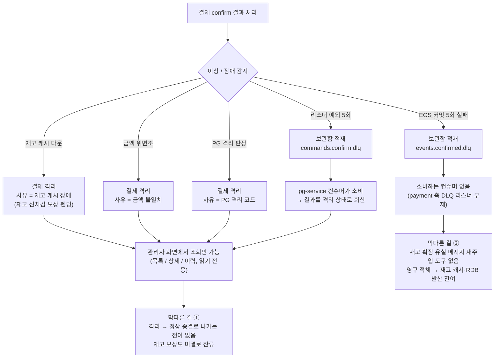
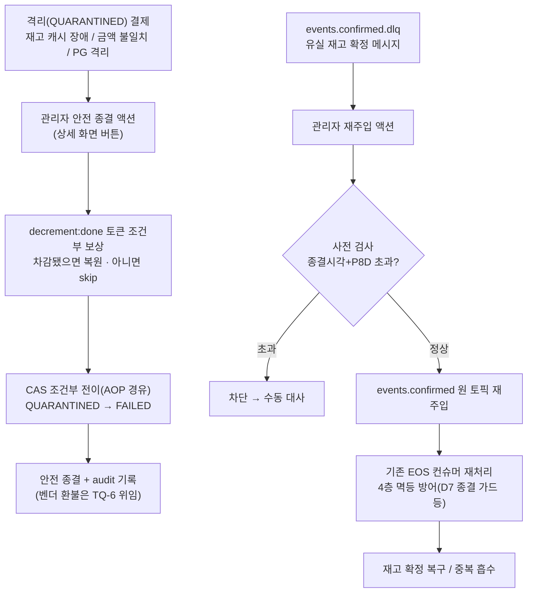

# DLQ / QUARANTINED 운영 복구 도구 설계

> 최종 수정: 2026-07-10

## 사전 브리핑

### 현재 이해한 문제

결제 confirm 사이클은 이상·장애를 만나면 결제를 **격리(QUARANTINED)** 하거나 메시지를 **격리 보관함(DLQ)** 으로 보낸다.
관측(사유별 메트릭·알람)과 조회(관리자 화면)까지는 갖춰졌지만, **격리된 결제를 정상 종결로 되돌리거나 보관함 메시지를 다시 흘려보낼 복구 수단이 없다** — 격리는 들어가면 못 나오는 대기 상태이고, 보관함 메시지는 소비할 컨슈머가 없어 영구 적체된다.

### 현재 시스템 동작 (as-is)

### 이번 discuss에서 결정하려는 것

- **격리 사유별 복구 정책 분류** — 재고 캐시 장애(캐시 회복 후 재확정 가능?) / 금액 불일치(위변조 의심이라 사람 판단 필수?) / PG 격리 코드 각각에 대해 "관리자 강제 전이만 허용" vs "조건부 자동 재시도 허용" 을 가른다.
- **격리 결제의 출구 상태** — QUARANTINED 에서 어떤 종결 상태(DONE / FAILED)로, 어떤 재고·보상 정합 조건 아래 전이를 허용할지. 도메인 엔티티에 전이 메서드를 신설한다.
- **DLQ 복구 경로** — 실제 갭은 `events.confirmed.dlq`(재고 확정 유실 메시지, payment 측 소비자 없음)다. `commands.confirm.dlq` 는 pg-service 가 이미 소비한다. 이 유실 메시지를 원 토픽으로 재주입할지 전용 복구 엔드포인트로 처리할지, 재발행 멱등성(이미 종결된 결제로의 중복 재발행 차단)을 무엇으로 보장할지.
- **복구 액션의 형태와 범위** — 관리자 수동 트리거(HTTP/화면 버튼)만인지, 조건부 자동 재시도 워커까지인지.
- **audit trail** — 누가·언제·왜 복구했는지 기록 수단(기존 PaymentHistory 확장 vs 신규).

### 확정된 가정 / 열린 질문

**확정 (사용자 결정)**
- **자동 재시도 스코프**: 이번 범위는 **관리자 수동 복구만**. 벤더 5xx 같은 조건부 자동 재시도는 후속 토픽으로 미룬다.
- **UI 형태**: HTTP API + **기존 Thymeleaf 관리자 화면에 복구 버튼**까지 얹는다.

**확인된 사실 (코드 조사)**
- 격리(QUARANTINED)는 도메인 전이 메서드(`done`/`fail`/`resetToReady`)가 모두 다른 상태만 허용해 **나가는 문이 없다** → 복구용 신규 전이 메서드가 필요.
- DLQ 2종 중 `commands.confirm.dlq` 는 pg-service 가 이미 소비(→ 격리 회신). payment 측 미소비 갭은 `events.confirmed.dlq` 뿐.

**열린 질문**
- **인증/인가**: 관리자 인증은 이 학습 프로젝트 범위 밖으로 가정(엔드포인트 노출까지만). — 확인 필요.
- **DLQ 소비 방식**: `events.confirmed.dlq` 를 상시 컨슈머로 자동 트리아지할지, 관리자 트리거 시 on-demand 로 읽을지.
- 격리 3사유 외에 실제 코드에 다른 진입 경로가 더 있는지(인터뷰에서 코드로 재확인).

## 요약 브리핑

### 결정된 접근

격리(QUARANTINED) 결제를 관리자가 **안전하게 실패 종결**로 되돌리고, 유실된 재고 확정 메시지(`events.confirmed.dlq`)를 **원 흐름으로 재주입**하는 수동 복구 도구를 세운다. "격리된 정상 결제를 DONE 으로 살리는" 복구는 payment→pg 상태 조회 포트·재고 원장 write-back 이 선결이라 후속 토픽으로 분리했다(게이트 R1 발견). 안전 종결의 재고 정리는 **`decrement:done` 토큰(실제 차감의 SoT)에 조건화한 보상**으로 유령 재고를 막고, 재주입은 원 토픽 경유로 기존 EOS 컨슈머의 4층 멱등 방어를 그대로 재사용한다.

### 변경 후 동작 (to-be)

### 핵심 결정 목록

- **스코프**: FAILED 안전 종결 + DLQ 재주입 (DONE 복구는 PG 조회 포트 선결로 후속 토픽).
- **보상**: `decrement:done` 토큰 조건부 — 토큰 부재(미차감) 시 skip 으로 유령 재고 방지. 사유 무관 통일 유지.
- **재주입**: `events.confirmed` 원 토픽 경유 → D7 종결 가드 등 4층 멱등 체인 흡수. 나이(종결시각+P8D) 초과 사전 차단.
- **동시성**: 도메인 전이(AOP 경유) → CAS 조건부 UPDATE 로 race 차단 + audit 우회 방지.
- **audit**: `PaymentHistory` 재사용(원 격리 사유 보존).

### 트레이드오프 / 후속 작업

- **DONE 복구(정상 살리기)** — 별도 후속 토픽(PG 상태 조회 포트 + 재고 write-back).
- **벤더 환불 실행** — TQ-6(Cancel/Refund) 위임. 이번은 실패 종결 + 재고 정리까지.
- **CONCERNS 수용 한계 2건**(모두 보수적 언더셀) — `decrement:done` P8D 만료 후 복구 미복원 / 복구 종결 결제에 늦은 confirm 재차감.
- **조건부 자동 재시도** — 후속 토픽.

---

# 설계

> 최종 수정: 2026-07-10 (discuss 게이트 R1 fail 반영 — 스코프를 안전 종결 + 재주입으로 축소)

## 문제 정의

결제 confirm 사이클은 이상·장애를 만나면 결제를 격리(QUARANTINED)하거나 메시지를 격리 보관함(DLQ)으로 보낸다. 관측(사유별 메트릭·알람)과 조회(관리자 화면)까지는 갖춰졌으나, **격리를 벗어날 도메인 전이가 없고**(`done`/`fail`/`resetToReady` 전부 QUARANTINED 진입 시 예외), **`events.confirmed.dlq` 를 소비할 컨슈머가 없다**. 결과적으로 격리 결제는 영구 대기, 유실 메시지는 적체로 남는다.

관리자가 (1) 격리 결제를 **안전하게 실패 종결**(FAILED)로 내리고 그 과정에서 재고 선차감을 정리하며, (2) 유실 메시지를 **원 흐름으로 되흘려보내는** 복구 수단을 세운다. "격리된 정상 결제를 DONE 으로 살리는" 복구는 이번 범위에서 제외한다 — discuss 게이트가 이 경로의 실제 비용(payment→pg 상태 조회 포트 부재, 재고 원장 write-back, 동시성)을 밝혔고, 별도 후속 토픽으로 분리한다.

## 격리 사유별 돈·재고 상태 (설계의 뼈대)

세 격리 사유는 격리 시점의 **돈(PG 캡처) / 재고(redis 선차감) / product RDB** 상태가 전부 다르다. 안전 종결 설계는 이 표에서 출발한다.

| 격리 사유 | 격리 시점 | PG 돈 | redis 선차감 | product RDB | 근거 |
|---|---|---|---|---|---|
| 재고 캐시 장애 | confirm TX **진입 전**(DECR 예외 직후) | **미캡처** (confirm 커맨드 미발행) | 차감 불확실 | 미차감 | `OutboxAsyncConfirmService.confirm` L67-73, `PaymentTransactionCoordinator` L61-65 |
| 금액 불일치 | confirm 결과 수신, 위변조 감지 | **캡처됨** (벤더 APPROVED) | 차감 유지·**보상 미수행** | 미차감 | `PaymentConfirmResultUseCase.handleApproved` mismatch 경로 L189-200 (compensate 미호출) |
| PG 격리 코드 | confirm 결과 수신 QUARANTINED | 불명 (벤더 상태 미상) | **보상 완료** | 미차감 | `handleQuarantined` L293-299 (`compensateAtomic` 호출) |

**핵심 관찰**: 세 사유 모두 **product RDB(SoT) 미차감**이다(RDB 차감은 DONE 에서만 `stock-committed` 로 발생). 따라서 FAILED 종결은 RDB 관점에서 항상 안전하고, 정리 대상은 **redis 선차감뿐**이다.

## 안전 종결(FAILED) 설계

- **복구 전용 도메인 전이**: `failFromQuarantine(reason, ...)` 신설 — QUARANTINED 에서만 호출 가능. 정상 `fail()`(READY/IN_PROGRESS 전용)과 물리적으로 분리한다.
- **redis 보상은 "실제 차감 여부"에 원자 조건화**: 전이 전에 보상을 호출하되, 기존 `stockCachePort.compensateAtomic`(`stock_compensation_atomic.lua`)은 `decrement:done` 확인 없이 **무조건 INCRBY**("보상은 재고 검증 불필요 — 항상 복원")라 CACHE_DOWN(DECR 미실행 = `decrement:done` 부재) 건에 **유령 재고 +N** 을 만든다. 따라서 **복구 전용 보상은 `decrement:done:{orderId}` 토큰 존재를 Lua 안에서 원자 검사**해, 부재 시 INCR 을 생략(`NO_DECREMENT` no-op)한다. 이 토큰이 **실제 차감의 SoT** 이므로 사유 분기 없이 통일이 유지된다: CACHE_DOWN(토큰 부재)=skip, 타임아웃-후-실행·재확정 interleaving(토큰 존재)=복원, 금액 불일치(토큰 존재·보상 미수행)=복원, PG 격리(`compensation:done` 존재)=`ALREADY_DONE` no-op.
- **보상 edge 한계**: `decrement:done` TTL(P8D) 만료 후 복구하는 실차감 건은 토큰 소멸로 미복원 — 보수적 언더셀(재고 과소) 방향이라 안전 측 누수. P8D 초과 격리는 수동 대사로 우회하고 이 한계를 CONCERNS 에 등재한다.
- **보상 → 전이 순서**: 보상을 먼저 커밋 시도하고 성공 후 상태 전이(SCR-6 "보상 먼저" 원칙).
- **환불 한계 명시**: 금액 불일치·PG 격리는 벤더가 돈을 캡처했을 수 있으나, cancel/refund 실행 포트가 미구현(TQ-6, CONCERNS L-9)이라 이번 복구는 **환불을 수행하지 않는다**. 관리자가 벤더 상태를 확인한 결과를 audit reason 에 기입하고, 실제 환불은 TQ-6 후속에 위임한다.

## DLQ 재주입 설계

- **원 토픽 경유 강제**: `events.confirmed.dlq` 메시지를 `events.confirmed` 원 토픽으로 republish 하여 **기존 EOS 컨슈머가 재처리**하게 한다. DLQ 를 직접 소비해 처리하는 전용 경로는 **명시 기각** — 기존 4층 멱등 방어(아래)를 우회하게 되기 때문.
- **멱등은 dedupe 단독이 아니라 4층 체인이 흡수**: ① `PaymentConfirmResultUseCase.handle` 의 종결 가드(D7, `markIfAbsent` 보다 **먼저** 실행) ② `payment_event_dedupe` INSERT IGNORE(비종결 재배달) ③ product `stock_commit_dedupe` 결정적 키 ④ redis 토큰. 특히 **이미 DONE 인 건에 재주입하면 no-op 이 아니라 `stock-committed` 를 재발행**하며(종결 가드 재발행 경로), 그 중복은 product 결정적 키(③)가 흡수한다.
- **on-demand 트리거**: 상시 DLQ 컨슈머(자동 재주입)는 사실상 자동 재시도라 스코프 밖. 관리자 액션 시에만 읽어 발행한다.
- **재주입 사전 검사(시간창 가드)**: DLQ retention(현재 브로커 7일)과 dedupe TTL(P8D) 부등식 때문에, **경과가 큰 메시지의 재주입은 product `stock_commit_dedupe` 만료로 이중 차감**될 수 있다. 판정 기준은 DLQ 레코드 나이가 아니라 **결제 종결 시각**(DONE 의 `lastStatusChangedAt` + P8D = `stock_commit_dedupe` 만료 시점)이다 — 이 시각을 넘긴 건 + 위험 상태를 재주입 전 검사해 차단하고 수동 대사로 우회시킨다. DLQ 토픽 retention 을 명시 설정하고, 연장 시 dedupe TTL 부등식을 재설계한다.
- **재주입 이력 가시화**: 반복 재주입(성공 후 P8D 경과 뒤 같은 레코드 재재주입 = 이중 차감의 실질 트리거)을 탐지하려면 재주입 행위(횟수·결과)를 로그+메트릭으로 남긴다.

## 영향 범위

| 구분 | 레이어 | 대상 | 내용 |
|---|---|---|---|
| 신규 | domain | `PaymentEvent` | 복구 전용 전이 `failFromQuarantine`(QUARANTINED→FAILED 만). |
| 신규 | application | 격리 안전 종결 유스케이스 | `compensateAtomic` 일괄 호출 → CAS 조건부 전이. audit reason 기록. |
| 신규 | application | DLQ 재주입 유스케이스 + `port.out` | 재주입 경계 포트(예: `DlqReprocessPort`)를 application 이 정의. 나이/상태 사전 검사 포함. |
| 신규 | infrastructure | DLQ 읽기·재발행 어댑터 | `port.out` 구현 — on-demand DLQ 읽기 + `events.confirmed` KafkaTemplate 발행. |
| 변경 | presentation | `PaymentAdminController` | POST 액션 2종(격리 실패 종결 / DLQ 재주입) + 상세 화면 버튼. |
| 변경 | presentation | Thymeleaf `payment-event-detail` 뷰 | 복구 버튼 렌더링(격리 건에 한해). |
| 신규 | infrastructure | 복구 전용 보상 Lua + `StockCachePort` 메서드 | `decrement:done` 존재 시에만 INCR(예: `compensateIfDecremented`), 부재 시 `NO_DECREMENT` no-op. **`NO_DECREMENT` 시 `compensation:done` 토큰은 심지 않음**(INSUFFICIENT 분기의 DEL 롤백과 동형 — 늦은 confirm 재차감 시 수동 대사 여지 보존). 기존 `compensateAtomic`(무조건 INCRBY)은 정상 흐름 전용으로 유지. |
| 재사용 | domain/application | `PaymentHistory` | 복구 전이가 기존 이력 이벤트로 기록(previous=QUARANTINED + 원 사유 보존). |
| 무관 | pg-service | `PaymentConfirmDlqConsumer` | `commands.confirm.dlq` 는 pg 가 이미 소비 — 손대지 않음. |
| 제외 | — | DONE 복구 경로 | PG 조회 포트·재고 write-back 선결, 별도 후속 토픽. |

## 설계 옵션 비교

### 격리 출구의 도메인 표현

- **기존 전이 가드 확장 방식** — `fail()` 의 허용 상태 목록에 QUARANTINED 추가. 재사용은 크지만 정상 실패와 복구 실패가 한 메서드에 섞여 나중에 복구만 떼어내기 어렵다.
- **복구 전용 전이 신설 방식 (채택)** — `failFromQuarantine` 을 QUARANTINED 에서만 호출 가능하게 신설. 정상 흐름과 분리돼 삭제·교체 비용이 낮고, 복구라는 예외적 개입이 도메인에 명시된다.

### DLQ 재주입 처리 경로

- **전용 엔드포인트 직접 처리 방식** — DLQ 를 읽어 재고·상태를 직접 조작. 통제력은 높으나 종결 가드·결정적 키 등 기존 4층 방어를 우회해 중복 흡수 층이 사라진다.
- **원 토픽 재주입 방식 (채택)** — `events.confirmed` 로 되돌려 기존 EOS 컨슈머가 처리. 방어 층을 그대로 재사용, 재주입 코드는 발행만 담당.

### 복구 전이 동시성 제어

- **낙관적 락(`@Version`) 신설 방식** — `PaymentEventEntity` 에 버전 컬럼 추가. 범용적이나 스키마 변경 + 기존 전 경로 영향.
- **상태 조건부 UPDATE(CAS) 방식 (채택)** — 복구 전이를 `WHERE status='QUARANTINED'` 조건부 UPDATE 로 원자화, 영향 0건이면 패배 요청에 명확한 충돌 오류. 더블클릭/2관리자 race 를 복구 경로에 국소적으로 차단.

### 복구 이력(audit) 표현

- **기존 이력 reason 재사용 방식 (채택)** — 복구 전이가 `PaymentHistory`(previous/current/reason)로 기록되며 reason 에 복구 맥락 + 벤더 상태 확인 결과를 담는다. 스키마 무변경. 인증이 범위 밖이라 actor 원천도 없다.
- **actor 컬럼 신설 방식** — "누가" 를 정식 컬럼으로. Flyway 마이그레이션 + 인증 부재로 값이 비어 plan 단계 재검토 대상.

## 결정 사항

| 항목 | 결정 | 이유 |
|---|---|---|
| 복구 스코프 | 관리자 수동 **FAILED 안전 종결** + **DLQ 재주입** | DONE 복구는 PG 조회 포트 선결로 후속 (게이트 R1) |
| 격리 출구 | 사유 무관 **FAILED 단일** | 세 사유 모두 product RDB 미차감이라 실패 종결이 원장 안전. DONE(정상 살리기)은 벤더 승인 확인 수단 부재로 제외 |
| redis 보상 | 전이 전 보상을 **`decrement:done` 토큰 존재에 원자 조건화**(복구 전용 Lua) | 기존 무조건 INCRBY 는 CACHE_DOWN(토큰 부재)에 유령 재고 생성. 토큰이 실제 차감 SoT → 사유 무관 통일 유지, 부재 시 skip |
| 보상 edge 한계 | `decrement:done` P8D 만료 후 복구는 미복원(보수적 언더셀) | P8D 초과 격리는 수동 대사 + CONCERNS 등재 |
| 보상·전이 순서 | 보상 먼저 성공 후 상태 전이 | SCR-6 |
| 환불 한계 | 벤더 캡처분 환불 미수행, audit 에 벤더 상태 기입 | cancel/refund 포트 미구현(TQ-6, CONCERNS L-9) |
| 도메인 전이 | 복구 전용 `failFromQuarantine`(QUARANTINED→FAILED) 신설 | 정상 `fail()` 과 분리, 삭제 비용↓ |
| DLQ 복구 | `events.confirmed` 원 토픽 on-demand 재주입 | 기존 EOS 컨슈머 4층 방어 재사용 |
| 재주입 멱등 | 원 토픽 경유 → D7 종결 가드·결정적 키 등 4층 체인 흡수 | dedupe 단독 아님. DONE+APPROVED 재주입은 stock-committed 재발행(no-op 아님)이며 결정적 키가 중복 흡수 |
| 재주입 사전 검사 | 종결 시각(DONE `lastStatusChangedAt`+P8D) 초과 + 위험 상태 건 차단 | dedupe TTL 초과 재주입은 product 이중 차감 위험 |
| 재주입 이력 | 재주입 횟수·결과 로그+메트릭 가시화 | 반복 재주입(이중 차감 실질 트리거) 탐지 |
| DLQ retention | 명시 설정(연장 시 dedupe TTL 부등식 재설계) | 현재 7d → 적체 메시지 소멸("영구 적체" 전제 정정) |
| 동시성 | load → `failFromQuarantine()` 도메인 전이(AOP 경유) → 저장 시 상태 조건부 UPDATE(`WHERE status='QUARANTINED'`, 0건이면 충돌 예외·동일 TX 라 history 함께 롤백) | `@Version` 부재; race 차단 + AOP audit 우회 방지 |
| DLQ 재주입 포트 | `port.out` 을 application 이 정의, infra 가 구현 | hexagonal 의존성 역전(ARCHITECTURE) |
| audit | `PaymentHistory` 재사용(previous=QUARANTINED, 원 사유 보존). 복구 API 는 reason(벤더 상태 확인 결과 포함)을 **필수 파라미터**로 강제 | 복구도 상태 전이, 스키마 무변경. 캡처분의 유일한 흔적이라 기입 누락 방지 |
| UI | `PaymentAdminController` POST + Thymeleaf 버튼 | 사용자 결정 |

## 장애 시나리오와 대응

- **더블클릭 / 2 관리자 동시 복구** → CAS 조건부 UPDATE 로 1 건만 성공, 패배 요청은 충돌 오류(상태·재고 양방향 발산 차단).
- **재고 캐시 장애(DECR 미실행) FAILED 복구** → `decrement:done` 부재라 복구 보상이 INCR 을 skip, 유령 재고 +N 없음.
- **재고 캐시 장애 타임아웃-후-실행(DECR 반영됨) FAILED 복구** → `decrement:done` 존재라 정상 보상 복원.
- **금액 불일치 FAILED 복구 — redis −N 잔존** → `decrement:done` 존재라 복구 보상이 실제 −N 복원.
- **PG 격리(이미 보상됨) FAILED 복구** → `compensation:done` 존재로 `ALREADY_DONE` no-op, 재고 이중 복원 없음.
- **복구로 FAILED 종결된 결제에 늦은 confirm 재요청 도착** → `validateConfirmRequest` 가 종결·격리 상태를 차단하지 않아 재차감 후 retention 유지 + `compensation:done` 존재로 보상 불가 = 보수적 언더셀(재고 과소) 누수. 기존 갭이라 CONCERNS 등재, confirm 진입 조기 거부 가드는 후속.
- **재주입했는데 결제가 이미 DONE** → 원 토픽 D7 가드가 `stock-committed` 재발행(정상 복구), 중복 RDB 차감은 product 결정적 키가 흡수.
- **적체 메시지가 P8D 초과 후 재주입** → 사전 검사가 차단 + 수동 대사로 우회(product 이중 차감 방지).
- **벤더 캡처분을 FAILED 종결** → 환불 미수행 한계를 audit 에 명시, 실제 환불은 TQ-6.
- **복구로 FAILED 종결된 결제에 늦은 APPROVED 도착** → 기존 종결 가드(`canApplyConfirmResult`=false)로 noop, 침묵 DLQ 재현 없음.

## 검증 전략

- **domain**: `failFromQuarantine` `@ParameterizedTest @EnumSource` — QUARANTINED 에서만 허용, 그 외 상태 호출 시 예외. FAILED 전이 후 `PaymentOrder` 상태·원 사유 보존 확인.
- **application**: 복구 보상의 토큰 조건화 — `decrement:done` 부재 시 INCR skip(유령 재고 0) / 존재 시 복원 / `compensation:done` 존재 시 `ALREADY_DONE` no-op. CAS 패배 경로(동시 요청 1 건만 성공) + audit reason 기록.
- **integration (`@EmbeddedKafka`)**: `events.confirmed.dlq` 적재 → 관리자 재주입 → 원 토픽 EOS 재처리 → (미종결)정상 재확정 / (DONE)`stock-committed` 재발행이 product 결정적 키로 **1 회만** 반영. P8D 초과 메시지 재주입 사전 검사 차단.

## 제외 범위

- **DONE 복구(격리된 정상 결제 살리기)** — payment→pg 상태 조회 포트 + 재고 원장 write-back(`stock-committed` 재발행·redis 재정렬) 선결. 별도 후속 토픽(게이트 R1 발견).
- **조건부 자동 재시도**(벤더 5xx 등) — 후속. 이번은 수동만.
- **`commands.confirm.dlq` 처리** — pg-service 가 이미 담당.
- **환불 / 취소 실행** — cancel/refund 포트 미구현(TQ-6). 이번은 실패 종결 + 재고 정리까지, 벤더 환불은 위임.
- **관리자 인증/인가** — 학습 프로젝트 범위 밖(엔드포인트 노출까지만).
- **QUARANTINED → READY 재시도 루프** — 기각(재격리 루프 위험).

**CONCERNS 등재(수용 한계 — 모두 보수적 언더셀 방향)**: (1) `decrement:done` P8D 만료 후 복구 시 실차감분 미복원, (2) 복구 종결 결제에 늦은 confirm 재요청 시 재차감·보상 불가(`validateConfirmRequest` 상태 미검사, confirm 진입 조기 거부 가드는 후속).

## 참고

- `docs/context/CONFIRM-FLOW.md` §5·§6·§16 — 격리·DLQ 진입 경로, 종결 가드, 재배달 시나리오
- `docs/context/PITFALLS.md` §9(dedupe TTL) · §20(오버셀 구조) · §22(결정적 키) · SCR-6(보상 순서)
- `docs/context/CONCERNS.md` L-9(refund 부재)
- `docs/context/INTEGRATIONS.md` — PG 상태 조회 포트는 pg-service 소유(payment 미보유)
- `docs/context/TODOS.md` — TQ-1(DLQ admin) / TQ-2(QUARANTINED admin recovery) / TQ-6(Cancel·Refund)
- 코드: `PaymentEvent`·`OutboxAsyncConfirmService`·`PaymentConfirmResultUseCase`·`PaymentTransactionCoordinator`(격리 진입), `StockCachePort.compensateAtomic`(멱등 보상), `PaymentEventDedupeStore`(멱등), `KafkaErrorHandlerConfig`(DLQ 발행)
