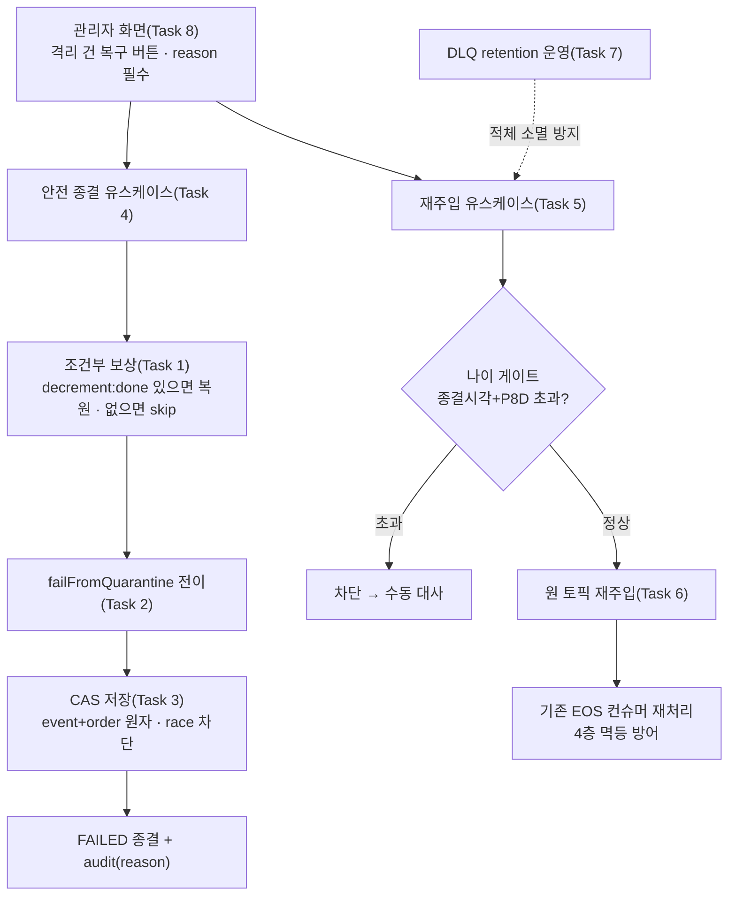

# 격리 결제·유실 메시지 수동 복구 도구 구현 플랜

> 작성일: 2026-07-10

## 요약 브리핑

### Task 목록

1. **복구 전용 조건부 보상** — `decrement:done` 토큰이 있을 때만 재고 복원(유령 재고 방지), 없으면 skip
2. **격리 복구 도메인 전이** `failFromQuarantine` — QUARANTINED → FAILED (정상 `fail`과 분리)
3. **CAS 조건부 저장** — event + order 행 원자 전이, 동시 복구 race 차단
4. **격리 안전 종결 유스케이스** — 보상 먼저 → 전이 → 저장(단일 TX), audit reason 필수
5. **DLQ 재주입 포트 + 유스케이스** — 종결시각+P8D 나이 게이트 + 재주입 이력
6. **DLQ 읽기·재발행 어댑터** — `events.confirmed` 원 토픽 재주입(기존 EOS 컨슈머 재사용)
7. **DLQ retention 운영 적용** — `create-topics.sh` + 브로커 실측
8. **관리자 복구 API + 화면 버튼** — 안전 종결/재주입 POST(reason 필수) + 격리 건 버튼

### 변경 후 전체 플로우차트

### 핵심 결정 → Task 매핑

| 설계 결정 | Task |
|---|---|
| 격리 출구 FAILED 단일 + 도메인 전이 신설 | 2 |
| `decrement:done` 조건부 보상(유령 재고 방지) | 1 |
| 보상 먼저 순서 + audit reason 필수 | 4 |
| 동시성 CAS + event·order 동조 | 3 |
| DLQ 원 토픽 재주입 + 4층 멱등 | 5, 6 |
| 재주입 나이 게이트 + 이력 | 5 |
| DLQ retention 운영 | 7 |
| 관리자 API / 버튼 | 8 |

### 트레이드오프 / 후속 작업

- **DONE 복구(정상 살리기)** — PG 상태 조회 포트 + 재고 write-back 선결, 별도 후속 토픽.
- **벤더 환불 실행** — TQ-6(Cancel/Refund) 위임.
- **CONCERNS 등재 2건**(보수적 언더셀) — ship context-update 에서 `CONCERNS.md` 반영.
- **조건부 자동 재시도** — 후속 토픽.

## 목표

격리(QUARANTINED) 결제를 관리자가 **안전 실패 종결**(재고 정리 포함)로 되돌리고, `events.confirmed.dlq` 유실 메시지를 **원 토픽으로 재주입**하는 수동 복구 경로가 API + 관리자 화면 버튼으로 동작하면 완료.

## 컨텍스트

- 설계 문서: `docs/topics/DLQ-QUARANTINE-RECOVERY.md`
- 주요 변경 파일:
  - `payment/domain/PaymentEvent.java` (복구 전이)
  - `payment/application/port/out/StockCachePort.java` + `infrastructure/cache/StockCacheRedisAdapter.java` + 신규 `lua/stock_compensation_if_decremented.lua` (조건부 보상)
  - `payment/application/port/out/PaymentEventRepository.java` + `infrastructure/repository/*` (CAS 조건부 저장)
  - `payment/application/usecase/PaymentCommandUseCase.java` + 신규 안전 종결 유스케이스 (AOP audit)
  - 신규 `DlqReprocessPort` + 재주입 유스케이스 + `infrastructure` 어댑터
  - `infrastructure/config/KafkaTopicConfig.java` (DLQ retention)
  - `presentation/PaymentAdminController.java` + `templates/admin/payment-event-detail` (액션·버튼)
- **CONCERNS 등재(코드 태스크 아님)**: 설계의 수용 한계 2건(`decrement:done` P8D 만료 미복원 / 복구 종결 결제에 늦은 confirm 재차감)은 ship 단계 context-update 에서 `docs/context/CONCERNS.md` 에 등재한다.

## 진행 상황

- [x] Task 1: 복구 전용 조건부 보상 (포트 + Lua + 어댑터)
- [x] Task 2: 격리 복구 도메인 전이 `failFromQuarantine`
- [x] Task 3: CAS 조건부 저장 (event + order 행)
- [x] Task 4: 격리 안전 종결 유스케이스 (AOP audit + 보상·전이 순서)
- [x] Task 5: DLQ 재주입 포트 + 유스케이스 (사전검사 + 이력)
- [x] Task 6: DLQ 읽기·재발행 어댑터
- [x] Task 7: `events.confirmed.dlq` retention 운영 적용
- [x] Task 8: 관리자 복구 API + Thymeleaf 버튼

## 태스크

### Task 1: 복구 전용 조건부 보상 (포트 + Lua + 어댑터) [tdd=true] [domain_risk=true]

**테스트 (RED)**
- Testcontainers Redis 통합 테스트 (`StockCacheRedisAdapterRecoveryTest` 또는 기존 어댑터 통합 테스트 확장):
  - `decrement:done` 부재 → `NO_DECREMENT` 반환 + `stock:{productId}` 불변 + `compensation:done` 미생성
  - `decrement:done` 존재 + `compensation:done` 부재 → `OK` + 재고 +N 복원 + `compensation:done` 생성
  - `decrement:done` 존재 + `compensation:done` 존재 → `ALREADY_DONE` + 재고 불변
  - `decrement:done` 부재 + `compensation:done` 존재(보상이 차감보다 늦은 P8D 창 끄트머리) → `NO_DECREMENT` + 재고 불변 (EXISTS 검사 순서 회귀 고정)

**구현 (GREEN)**
- 신규 결과 enum `StockRecoveryCompensationResult { OK, ALREADY_DONE, NO_DECREMENT }` (application/port/out)
- `StockCachePort.compensateIfDecremented(String orderId, List<PaymentOrder>)` 선언
- 신규 `lua/stock_compensation_if_decremented.lua`: `EXISTS decrement:done` → 없으면 `NO_DECREMENT`(INCR·compensation 토큰 생략) / 있으면 `SETNX compensation:done`(0이면 `ALREADY_DONE`) → INCRBY + TTL → `OK`
- `StockCacheRedisAdapter`에 static script 로드 + 메서드 구현 (기존 `compensateAtomic` 패턴 준용)
- **`FakeStockCachePort.compensateIfDecremented` 구현** — 기존 `decrement:done` 토큰 Set 을 SoT 로 재사용(부재 시 `NO_DECREMENT`). 포트 새 추상 메서드라 Fake 미구현 시 컴파일 깨짐.

**완료 기준**
- 위 4 케이스 통합 테스트 pass, `./gradlew :payment-service:test` 회귀 없음

**완료 결과**
> `StockRecoveryCompensationResult{OK,ALREADY_DONE,NO_DECREMENT}` 신설 + `StockCachePort.compensateIfDecremented` 선언 + `lua/stock_compensation_if_decremented.lua`(EXISTS decrement:done 우선 판정 → SETNX compensation:done → INCRBY+TTL) + `StockCacheRedisAdapter` 구현(기존 compensateAtomic 패턴 준용, KEYS=[decrement:done, compensation:done, stock...]) + `FakeStockCachePort.compensateIfDecremented`(decrementDedupTokens SoT 재사용). `StockCacheRedisAdapterTest`에 Testcontainers Redis 통합 테스트 4케이스 추가(토큰 부재 skip+compensation 미생성 / 존재+미보상 복원 / 존재+보상됨 ALREADY_DONE / decrement 부재+compensation 존재에도 NO_DECREMENT — EXISTS 우선 순서 회귀 고정). `./gradlew :payment-service:test` 471 전체 PASS(신규 4건 포함, 회귀 없음). RED `test(payment)` c3d2ab83 → GREEN `feat(payment)` (본 커밋).

---

### Task 2: 격리 복구 도메인 전이 `failFromQuarantine` [tdd=true] [domain_risk=true]

**테스트 (RED)**
- `PaymentEventTest` — `@ParameterizedTest @EnumSource(PaymentEventStatus.class)`:
  - QUARANTINED → `failFromQuarantine` 호출 시 FAILED 전이 + `statusReason` 갱신 + `PaymentOrder` 전부 fail
  - QUARANTINED 외 전 상태 → `PaymentStatusException`(신규 `INVALID_STATUS_TO_FAIL_FROM_QUARANTINE` 또는 기존 코드 재사용)

**구현 (GREEN)**
- `PaymentEvent.failFromQuarantine(String reason, Instant lastStatusChangedAt)` — `status != QUARANTINED` 가드, FAILED 전이, `paymentOrderList.forEach(PaymentOrder::fail)`
- 정상 `fail()`과 물리적으로 분리 (재사용 금지)

**완료 기준**
- 파라미터라이즈드 테스트 pass, 회귀 없음

**완료 결과**
> `PaymentEvent.failFromQuarantine(String reason, Instant lastStatusChangedAt)` 신설 — `status != QUARANTINED` 가드(위반 시 신규 `PaymentErrorCode.INVALID_STATUS_TO_FAIL_FROM_QUARANTINE`(E03035)로 `PaymentStatusException`) → FAILED 전이 + `statusReason` 갱신 + `paymentOrderList.forEach(PaymentOrder::fail)`. 정상 `fail()`(READY/IN_PROGRESS 전용, terminal no-op)과는 재사용 없이 물리적으로 분리된 별도 메서드. `PaymentEventTest`에 `@ParameterizedTest @EnumSource(PaymentEventStatus.class)` 2벌 추가 — QUARANTINED 단일값에서 FAILED 전이+statusReason+주문 전체 FAIL 성공, 나머지 7개 전 상태(READY/IN_PROGRESS/DONE/FAILED/CANCELED/PARTIAL_CANCELED/EXPIRED)에서 `PaymentStatusException`(코드까지 단정) exhaustive 회귀 고정. `./gradlew :payment-service:test` 479 전체 PASS(신규 8건 포함, 회귀 없음). RED `test(payment)` 61ad5eb2 → GREEN `feat(payment)` (본 커밋).

---

### Task 3: CAS 조건부 저장 (event + order 행) [tdd=true] [domain_risk=true]

**테스트 (RED)**
- `PaymentEventRepositoryImpl` 통합 테스트 (또는 JPA slice):
  - QUARANTINED 레코드에 조건부 전이 저장 → 1건 반영 + **`payment_order` 자식 행 상태 = FAIL**
  - 이미 FAILED로 바뀐 레코드에 조건부 전이 저장 → 0건(충돌) → 명확한 예외/결과, order 행 불변
  - 동시 2회 호출 시 1건만 성공

**구현 (GREEN)**
- `PaymentEventRepository.resolveQuarantineToFailed(...)` — 조건부 게이트(`@Modifying @Query("UPDATE payment_event SET status=FAILED, ... WHERE id=:id AND status='QUARANTINED'")`, affected rows 반환) → **affected=1 일 때만 같은 TX 에서 `payment_order` 자식 행 상태 반영**. 기존 `saveOrUpdate`(`PaymentEventRepositoryImpl.java:57-69`)가 event·order 를 **별도 두 단계**로 save 하므로(cascade 아님), event 만 갱신하면 `payment_event=FAILED` + `payment_order=EXECUTING/NOT_STARTED` 불일치가 영구 잔존 → 후속 취소/환불(TQ-6) 오판.
- 0건이면 상위(유스케이스)가 충돌 예외 던지도록 계약 명시
- **`FakePaymentEventRepository.resolveQuarantineToFailed` 구현** — 포트 새 추상 메서드라 미구현 시 컴파일 깨짐(다수 기존 테스트가 이 Fake 소비).

**완료 기준**
- 조건부 저장 통합 테스트 pass (event=FAILED **+ order=FAIL** + 충돌 시 0건·불변), 회귀 없음

**완료 결과**
> `PaymentEventRepository.resolveQuarantineToFailed(Long paymentEventId, String reason, Instant lastStatusChangedAt)` 신설 — `JpaPaymentEventRepository`에 `@Modifying @Query("UPDATE ... WHERE id=:id AND status='QUARANTINED'")`(affected rows int 반환) + `JpaPaymentOrderRepository`에 자식 order 동조용 `failByPaymentEventId`(`WHERE payment_event_id=:id AND status IN ('NOT_STARTED','EXECUTING')` → FAIL, `PaymentOrder.fail()` 도메인 가드와 동일 조건). `PaymentEventRepositoryImpl.resolveQuarantineToFailed`에 `@Transactional` 부여해 두 `@Modifying` 쿼리를 단일 TX로 묶음(개별 리포지토리 메서드는 기본적으로 각자 단일-오퍼레이션 TX를 열므로 명시 없이는 원자성 미보장) — affected=0 이면 즉시 false 반환(자식 order 미터치), affected=1 일 때만 order 동조 갱신 후 true. `FakePaymentEventRepository.resolveQuarantineToFailed`는 저장소 현재 상태가 QUARANTINED 일 때만 `PaymentEvent.failFromQuarantine` 도메인 전이를 그 자리에서 적용(자식 order 포함)해 true, 아니면 무변경 false. `PaymentEventRepositoryImplTest`에 Testcontainers MySQL 통합 테스트 3케이스 추가 — QUARANTINED 1건 반영+order 전부 FAIL 동조 / 이미 FAILED 0건 충돌+event·order 불변 / 동시 2회 호출 시 성공 합계 정확히 1(`ExecutorService`+`CountDownLatch` race 가드). `./gradlew :payment-service:test`(단위 479) + `:payment-service:integrationTest`(46) 전건 PASS(신규 3건 포함, 회귀 없음) — 최초 결합 실행(`test integrationTest` 한 커맨드)에서 관계없는 15건이 "Table 'payment-test.payment_event' doesn't exist"로 실패했으나, `docs/context/TESTING.md`에 문서화된 기존 known flaky(재사용 MySQL 컨테이너를 공유하는 create-drop 그룹 여러 컨텍스트 간 스키마 생성/드롭 경합)로 확인 — `integrationTest` 단독 재실행에서 즉시 46/46 재현 GREEN, 내 변경과 무관. RED `test(payment)` 8d083194 → GREEN `feat(payment)` (본 커밋).

---

### Task 4: 격리 안전 종결 유스케이스 (AOP audit + 보상·전이 순서) [tdd=true] [domain_risk=true]

**테스트 (RED)**
- Mockito 단위 (`QuarantineResolveUseCaseTest`):
  - load → `compensateIfDecremented` **먼저** 호출 → 도메인 전이 → CAS 저장 순서 검증 (SCR-6)
  - 보상 결과 3종(OK/ALREADY_DONE/NO_DECREMENT) 모두 전이 진행
  - CAS 0건(충돌) → 전이 실패 예외 + 로그
  - `reason` 누락 시 거부 (필수)
- `PaymentCommandUseCase.markPaymentAsFailFromQuarantine` audit 기록 검증 (AOP 경유 — `@PublishDomainEvent`/`@PaymentStatusChange` 부착)

**구현 (GREEN)**
- `PaymentCommandUseCase.markPaymentAsFailFromQuarantine(PaymentEvent, @Reason String)` — 도메인 `failFromQuarantine` 위임 + 애노테이션(audit)
- 신규 유스케이스 (안전 종결 오케스트레이션): 보상 먼저 → command 전이 → CAS 저장
- **TX 경계**: redis 보상은 `@Transactional` **밖** 선행(외부 호출 커넥션 점유 회피, PITFALLS §3) → 전이 + CAS 저장 + AOP history INSERT 는 **단일 `@Transactional`**(CAS 0건 충돌 시 history 동일 TX 롤백 보장)
- `reason` 필수 파라미터 계약

**완료 기준**
- 단위 테스트 pass (순서·조건·audit), 회귀 없음

**완료 결과**
> `PaymentCommandUseCase.markPaymentAsFailFromQuarantine(PaymentEvent, @Reason String)` 신설 — `@Transactional @PublishDomainEvent(action="changed") @PaymentStatusChange(toStatus="FAILED", trigger="manual")` 부착(기존 `markPaymentAsFail`/`markPaymentAsQuarantined` AOP audit 패턴 준용). 구현은 도메인 `failFromQuarantine(reason, now)` in-memory 전이 직후 같은 TX 안에서 `paymentEventRepository.resolveQuarantineToFailed(id, reason, now)` CAS 저장 — false(0건 충돌) 시 신규 `PaymentErrorCode.QUARANTINE_RESOLVE_CONFLICT`(E03037)로 `PaymentStatusException` 던져 TX 롤백(`@PublishDomainEvent` 가 발행한 history 이벤트도 `@TransactionalEventListener(BEFORE_COMMIT)` 도달 전에 롤백되어 audit 우회 없음). 신규 오케스트레이션 `QuarantineResolveUseCase.resolve(orderId, reason)` — reason null/blank 시 신규 `PaymentErrorCode.QUARANTINE_RESOLVE_REASON_REQUIRED`(E03036)로 `PaymentValidException` 즉시 거부(어떤 협력자도 미호출) → `paymentLoadUseCase` 로드 → `stockCachePort.compensateIfDecremented`(TX 밖, 보상 결과 OK/ALREADY_DONE/NO_DECREMENT 무관 항상 진행) → `paymentCommandUseCase.markPaymentAsFailFromQuarantine` 위임(TX 경계는 이 메서드 자체의 `@Transactional`이 형성 — 보상은 이 호출 이전이라 자연히 TX 밖). `PaymentCommandUseCaseTest`에 3케이스 추가(CAS 성공 반환, CAS 충돌 예외, 리플렉션 기반 AOP 애노테이션 부착 검증 — `OutboxImmediateEventHandlerTest` 선례 패턴 준용). 신규 `QuarantineResolveUseCaseTest`(Mockito, `QuarantineCompensationHandlerTest` 선례 패턴) 5케이스 — 보상→전이 순서(`InOrder`), 보상 결과 3종 모두 전이 진행(`@EnumSource`), CAS 충돌 예외 전파, reason 누락(null/빈문자/공백) 3종 모두 거부+무호출. `./gradlew :payment-service:test` 490 전체 PASS(신규 11건 포함, 회귀 없음) + checkstyle/spotbugs(Main·Test) 통과. DB/Redis/Kafka 변경 없어 통합테스트 불필요. RED `test(payment)` 41477278 → GREEN `feat(payment)` (본 커밋).

---

### Task 5: DLQ 재주입 포트 + 유스케이스 (사전검사 + 이력) [tdd=true] [domain_risk=true]

**테스트 (RED)**
- Mockito 단위 (`DlqReprocessUseCaseTest`):
  - 종결 시각(DONE `lastStatusChangedAt`) + P8D 초과 건 → 재주입 차단 + 수동 대사 안내
  - **미종결 건 → 나이 무관 통과**(원 토픽 발행 포트 호출)
  - **DONE + P8D 이내 → 통과**(재발행은 product 결정적 키가 흡수)
  - 재주입 이력(횟수·결과) 기록 검증

**구현 (GREEN)**
- `DlqReprocessPort` (application/port/out) — DLQ 읽기 + 원 토픽 발행 경계
- 재주입 유스케이스: 사전검사(나이·상태) → `DlqReprocessPort` 발행 → 이력 로그+메트릭

**완료 기준**
- 단위 테스트 pass (사전검사 차단/통과·이력), 회귀 없음

**완료 결과**
> 신규 `DlqReprocessPort`(application/port/out) — `reprocess(String orderId)` 단일 메서드로 DLQ 읽기 + 원 토픽(`events.confirmed`) 재발행 경계를 캡슐화(구현은 Task 6). 신규 `PaymentDlqReprocessMetrics`(core/common/metrics, `PaymentQuarantineMetrics` 패턴 준용) — `payment_dlq_reprocess_total` 카운터를 `result` 태그(`reprocessed`/`blocked_age_gate`)로 분리 계측. `PaymentErrorCode.DLQ_REPROCESS_AGE_GATE_EXCEEDED`(E03038) + `EventType.PAYMENT_DLQ_REPROCESS_{BLOCKED,SUCCESS}` 신설. 신규 `DlqReprocessUseCase.reprocess(orderId)` — `paymentLoadUseCase` 로드 → 나이 게이트(`status==DONE && now > lastStatusChangedAt + 8일` 일 때만 차단, product `stock_commit_dedupe` TTL과 동일 P8D — `PaymentConfirmResultUseCase.STOCK_COMMITTED_TTL`과 동조) → 차단 시 메트릭(`blocked_age_gate`)+경고 로그+`PaymentValidException` 던져 중단, 통과 시 `DlqReprocessPort.reprocess` 호출 → 메트릭(`reprocessed`)+정보 로그. DONE 이 아닌 모든 상태(READY/IN_PROGRESS/QUARANTINED/FAILED/CANCELED/PARTIAL_CANCELED/EXPIRED)는 나이 무관 통과. `DlqReprocessUseCaseTest`(Mockito, `Clock.fixed` 수동 생성 — `PaymentLoadUseCaseClockTest` 선례 패턴) 3케이스 — P8D 초과 DONE 차단(포트 미호출+메트릭 `blocked_age_gate` 검증), P8D 이내 DONE 통과(포트 호출+메트릭 `reprocessed`), DONE 제외 전 상태(`@EnumSource(EXCLUDE)`) 365일 전이어도 통과. `./gradlew :payment-service:test` 499 전체 PASS(신규 9건 포함, 회귀 없음) + checkstyle/spotbugs(Main·Test) 통과. 새 포트라 기존 Fake/Mock 소비처 없음(Task 6이 어댑터 구현). RED `test(payment)` a2d51f0f → GREEN `feat(payment)` (본 커밋).

---

### Task 6: DLQ 읽기·재발행 어댑터 [tdd=true] [domain_risk=true]

**테스트 (RED)**
- `@EmbeddedKafka` 통합 테스트:
  - `events.confirmed.dlq` 적재 → 재주입 → `events.confirmed` 원 토픽 EOS 컨슈머 재처리 → 미종결 정상 재확정
  - DONE 건 재주입 → `stock-committed` 재발행이 product 결정적 키로 1회만 반영(멱등)

**구현 (GREEN)**
- `DlqReprocessPort` 구현 (infrastructure) — on-demand DLQ 읽기 + `events.confirmed` 발행 KafkaTemplate (기존 EOS producer와 분리된 non-tx 템플릿 재사용/신설)
- **읽기 커서 전략**: offset commit 없이 지정 범위 조회(반복 노출은 멱등 체인 + 재주입 이력이 흡수, 재주입 판단은 관리자가 쥔다) — 조회 범위·커밋 여부를 구현 명세에 확정.

**완료 기준**
- 통합 테스트 pass, 회귀 없음

**완료 결과**
> `DlqReprocessPort` 유일 Kafka 구현체 `KafkaDlqReprocessAdapter`(infrastructure/messaging/publisher) 신설 —
> 매 `reprocess(orderId)` 호출마다 새 `KafkaConsumer` 를 생성해 `events.confirmed.dlq` 전 파티션을
> `assign()` + `seekToBeginning()` 으로 끝까지 스캔(오프셋 커밋 없음, 그룹 코디네이션 미참여)하고,
> 대상 orderId 의 레코드 중 timestamp 기준 가장 최근 payload 하나만 `payment.events.confirmed`
> 원 토픽으로 재발행한다(같은 orderId 로 DLQ 에 여러 건 쌓여 있어도 최신 1건만 재발행 — 중복 재처리
> 방지). `KafkaProducerConfig` 에 non-tx 신규 빈 `confirmedKafkaTemplate`(String→String, EOS
> `stockCommittedProducerFactory` 와 분리된 별도 ProducerFactory) 추가 — 재주입은 관리자 on-demand
> 액션이라 EOS 트랜잭션 경계에 참여하지 않는다. 성공 로그(`PAYMENT_DLQ_REPROCESS_SUCCESS`)는 호출자
> `DlqReprocessUseCase` 가 이미 담당하므로 어댑터는 저수준 발행 사실만 `KAFKA_PUBLISH_SUCCESS` 로
> debug 기록(중복 로그 방지). 신규 `DlqReprocessIntegrationTest`(`@EmbeddedKafka`, PaymentEosIntegrationTest
> 컨테이너·헬퍼 패턴 준용) 2케이스 — #1 IN_PROGRESS 결제의 DLQ 메시지 재주입 → 원 토픽 EOS 컨슈머
> 재처리 → 정상 재확정(DONE) + dedupe 1 row + stock-committed 1건, #2 이미 DONE 종결 + dedupe row
> 존재 상태에서 동일 event_uuid 메시지 DLQ 재주입 → 종결 가드 재발행 경로로 흡수돼 stock-committed
> 결정적 idempotencyKey 로 정확히 1건만 재발행(product 멱등 전제) + payment DONE·dedupe row 불변.
> `./gradlew :payment-service:test`(단위 499) + `:payment-service:integrationTest`(48, 신규 2건 포함)
> 전건 PASS(회귀 없음) + checkstyle/spotbugs(Main·Test) 통과. RED `test(payment)` 2b99141a →
> GREEN `feat(payment)` (본 커밋).

---

### Task 7: `events.confirmed.dlq` retention 운영 적용 [tdd=false] [domain_risk=true]

**구현 (GREEN)**
- `KafkaTopicConfig.paymentEventsConfirmedDlq()` 에 `retention.ms` config 명시 (선언 SoT — 테스트/임베디드용)
- **`scripts/smoke/create-topics.sh` 에 `--config retention.ms=...` 추가** (실제 토픽 생성 SoT — `auto.create.topics.enable=false` 환경) + 이미 존재하는 토픽용 `kafka-configs --alter` 절차 문서화
- retention 값과 재주입 나이 게이트 P8D 부등식 관계 주석

**완료 기준**
- 브로커 `topic describe` 로 실제 `payment.events.confirmed.dlq` retention 값 확인(선언 Bean 존재만으로는 불충분), 회귀 없음

**완료 결과**
> `KafkaTopicConfig.paymentEventsConfirmedDlq()`(선언 SoT — 테스트/임베디드 환경용)에
> `TopicConfig.RETENTION_MS_CONFIG=864000000`(10일) 추가. `scripts/smoke/create-topics.sh`(실제
> 토픽 생성 SoT — 로컬/프로덕션 Compose `auto.create.topics.enable=false` 환경)의
> `payment.events.confirmed.dlq` 생성 커맨드에만 `--config retention.ms=864000000` 조건부 부여(다른
> 4개 운영 토픽은 브로커 기본 retention 유지, DLQ만 명시). 두 값(864000000ms=10일)은 소스 코드
> 중복이라 스크립트 내 상수(`DLQ_RETENTION_MS`)와 Java 상수(`EVENTS_CONFIRMED_DLQ_RETENTION_MS`)를
> 각각 문서화 주석에서 상호 참조 — 값 변경 시 양쪽 동시 갱신 필요(빌드 타임 공유 불가, 별도
> 런타임/스크립트 경계). retention(10일) > 재주입 나이 게이트(P8D=8일, `DlqReprocessUseCase`
> `STOCK_COMMIT_DEDUPE_TTL`) 부등식 근거를 양쪽 주석에 명시 — retention 이 게이트보다 짧으면
> "게이트는 열려 있는데(재주입 허용 구간) 브로커가 메시지를 먼저 삭제"하는 사각이 생기므로 반드시
> 커야 한다. 이미 존재하는 토픽(선행 배포로 retention 미설정 상태로 생성된 경우)을 위한
> `kafka-configs --alter --add-config retention.ms=864000000` + `--describe` 확인 절차를 스크립트
> 상단 주석으로 문서화(스크립트는 최초 생성시에만 config 적용, 기존 토픽 config 재적용은 멱등 스킵
> 로직상 자동 수행 안 됨 — 별도 alter 필요함을 명시).
> **실측 미수행**: 로컬에 `payment-kafka` 컨테이너가 기동돼 있지 않아(`docker ps` 확인, 실행 중
> 컨테이너 없음) 브로커 `kafka-topics --describe` 실측을 이번 세션에서 수행하지 못했다 —
> 인프라 전체 기동은 이 설정+스크립트 변경 검증만을 위해서는 과함(PLAN 완료 기준의 "과하면 실측
> 방법 문서화"에 해당). 실측 방법: `docker-compose.infra.yml up -d` 로 카프카 기동 →
> `bash scripts/smoke/create-topics.sh` 실행(신규 생성 시 `[CREATE] ... retention.ms=864000000`
> 로그로 1차 확인) → `docker exec payment-kafka kafka-topics --bootstrap-server localhost:9092
> --describe --topic payment.events.confirmed.dlq` 출력의 `retention.ms=864000000` 로 최종 확인.
> `./gradlew :payment-service:test` 499 전체 PASS(테스트 수 불변 — 설정값 변경만, 신규 테스트
> 없음, tdd=false 태스크), checkstyle/spotbugs(payment-service Main) 통과, 회귀 없음.

---

### Task 8: 관리자 복구 API + Thymeleaf 버튼 [tdd=false] [domain_risk=false]

**테스트 (RED, 최소)**
- 컨트롤러 슬라이스/통합: 안전 종결 POST·재주입 POST 가 유스케이스 호출 + `reason` 필수 검증

**구현 (GREEN)**
- `PaymentAdminController` POST 2종 (`/admin/payments/events/{eventId}/resolve-quarantine`, `.../reprocess-dlq`) — `reason` 필수 파라미터
- `AdminPaymentService`(presentation port) 또는 유스케이스 연결 (`StockAdminController` 패턴 준용)
- `admin/payment-event-detail` 뷰: 격리 건에 한해 복구 버튼 렌더링

**완료 기준**
- 컨트롤러 테스트 pass, 관리자 화면에서 격리 건 버튼 노출, 회귀 없음

**완료 결과**
> 신규 presentation 포트 `PaymentRecoveryAdminService`(`resolveQuarantine(orderId, reason)` /
> `reprocessDlq(orderId)`) — 조회 전용 `AdminPaymentService`/`AdminPaymentServiceImpl` 패턴과
> 동일하게 presentation 은 포트 인터페이스에만 의존하고, application 계층의 신규
> `PaymentRecoveryAdminServiceImpl` 이 그 포트를 구현하며 각각 `QuarantineResolveUseCase.resolve`
> / `DlqReprocessUseCase.reprocess` 로 단순 위임한다(façade 자체는 트랜잭션 애노테이션 없음 — 두
> 유스케이스가 이미 각자 TX 경계를 스스로 관리하므로 `AdminPaymentServiceImpl` 의 class-level
> `@Transactional(readOnly = true)` 를 write 경로에 재사용하지 않음). `PaymentAdminController` 에
> POST 2종 추가 — `/admin/payments/events/{eventId}/resolve-quarantine`(`orderId`+`reason` 필수
> 폼 파라미터, `reason` 누락 시 Spring 기본 `MissingServletRequestParameterException` → 400,
> 공백 값은 `QuarantineResolveUseCase` 가 `QUARANTINE_RESOLVE_REASON_REQUIRED` 로 거부) /
> `.../reprocess-dlq`(`orderId` 필수, 나이 게이트 초과 시 `DlqReprocessUseCase` 가
> `DLQ_REPROCESS_AGE_GATE_EXCEEDED`(메시지에 "수동 대사가 필요합니다" 포함, 기존
> `PaymentExceptionHandler` 가 그대로 400 JSON 으로 노출 — 별도 컨트롤러 처리 불필요)로 거부) —
> 둘 다 성공 시 이벤트 상세 화면으로 redirect. `admin/payment-event-detail.html` 에 격리
> (`event.status.name() == 'QUARANTINED'`) 건에 한해서만 렌더링되는 "Quarantine Recovery" 카드
> 추가 — 안전 종결 사유 입력 폼(`reason` 필수, `orderId` 는 hidden input 으로 이미 로드된
> `event.orderId` 재사용 — 별도 조회 호출 없음) + DLQ 재주입 버튼, 둘 다 JS `confirm()` 확인창
> 부착(재고 보상 비가역/재주입 부작용 경고). 신규 `PaymentAdminControllerTest`(`@WebMvcTest`,
> `PaymentControllerMvcTest` 슬라이스 패턴 준용) 5케이스 — resolve-quarantine 성공 위임+redirect,
> reason 파라미터 자체 누락 시 400+유스케이스 미호출, reason 공백값에 대한 유스케이스 거부 예외
> 그대로 전파, reprocess-dlq 성공 위임+redirect, 나이 게이트 초과 거부 예외 전파.
> `./gradlew :payment-service:test` 504 전체 PASS(신규 5건 포함, 회귀 없음) +
> checkstyle/spotbugs(Main·Test) 통과. DB/Redis/Kafka 변경 없음(tdd=false, 최소 컨트롤러 테스트).

## 리뷰 처리

ship 코드 리뷰 R1 — reviewer·domain-expert 양쪽 fail.

**Critical (채택·수정)**
- `QuarantineResolveUseCase.resolve` 가 상태 가드 전 비가역 redis 보상 실행 → 비격리(특히 DONE) orderId 호출 시 유령 재고 +N(R2 에서 닫은 실패 모드가 호출 순서로 재개방). → load 직후 `status != QUARANTINED` 조기 가드(보상 **전**), 비격리 전 상태 `never-compensate` 테스트.

**Major**
- A. `KafkaDlqReprocessAdapter` fire-and-forget 발행(PITFALLS §4, broker 미도달 silent failure) → **채택**: `send().get(timeout)` 동기 확인 + 실패 예외 전파.
- B. 재발행 전체 스캔(`seekToBeginning`)이 대량 적체 시 read-timeout 내 미도달 → 존재 메시지 "없음" 오판 → **부분 채택(사용자 선택)**: 스캔 미완료(타임아웃) vs 진짜 없음 구분(별도 예외·재시도 안내) + 성능 한계 CONCERNS 등재(B2). 완전 역방향 탐색(`offsetsForTimes`)은 관리 도구 사용 빈도 대비 과잉으로 보류.

**Minor**
- 재주입 버튼 QUARANTINED 카드 전용 렌더 → **채택(사용자 선택)**: DONE/IN_PROGRESS 에도 노출(나이 게이트 서버 차단). 안전 종결 버튼은 QUARANTINED 전용 유지.
- admin POST 검증 실패 raw JSON 400 노출 → **채택(사용자 선택)**: `redirect ?error=` + flash 로 상세 화면 복귀.
- Task 7 retention 브로커 실측 미수행 → B1 최종 검증에서 실측 시도, 불가 시 후속 등재.
- audit annotation 리플렉션 테스트(구조 미러링) → **스킵**: 기존 컨벤션(`OutboxImmediateEventHandlerTest`) 재사용, 이번 범위 밖.
