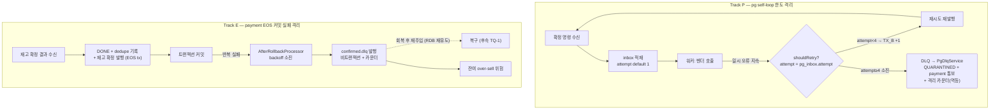

# DLQ 도달 보장 — 완료 브리핑

> 토픽: DLQ-REACHABILITY / 이슈·브랜치: #114 / 봉인: 2026-06-25

## 작업 요약

비동기 confirm 사이클에는 "일시 장애가 **지속**될 때 메시지가 격리 보관함(DLQ)에 도달하지 못하는" 두 갭이 양쪽 서비스에 따로 존재했다. **pg-service**는 외부 PG 벤더의 일시 오류가 계속되면 같은 확정 명령을 약 6초 간격으로 무한히 되돌려 보냈다 — 시도횟수(`attempt`)가 런타임에서 항상 1로 고정돼(재발행 릴레이가 헤더를 빈 맵으로 발행 + `pg_inbox`에 attempt 컬럼 부재) 재시도 한도(4회) 도달 분기가 dead branch가 됐기 때문이다. 결제는 영영 처리 중 상태로 남고 격리 알림도 누락됐다. **payment-service**는 EOS 커밋(`commitTransaction()`)이 반복 실패하면 메시지가 컨테이너 디폴트 롤백 처리기로 빠져 9회 소진 후 조용히 건너뛰어졌고(skip), 같은 EOS 트랜잭션에서 발행되는 재고 확정 이벤트도 함께 abort돼 결제는 완료로 보이나 재고 확정 신호는 영구 소실됐다.

두 갭을 한 토픽으로 묶어, **"장애 지속 시 격리 보관함에 도달시키고 메트릭으로 가시화한다"**를 공통 목표로 잡았다. pg-service는 시도횟수를 `pg_inbox.attempt` 컬럼 하나가 소유하게 해 워커가 결과 반영 트랜잭션에서 증가시키고, 한도 소진 시 이미 완성돼 있던 DLQ 격리 체인(→ QUARANTINED + payment 통보)으로 진입시켰다. payment-service는 컨테이너 리스너에 `AfterRollbackProcessor`를 명시 연결해, EOS 커밋 반복 실패 메시지를 실패하는 트랜잭션과 분리된 비트랜잭션 DLQ 템플릿으로 발행했다. 두 경로 모두 격리 도달을 카운터로 가시화했다.

결과: pg self-loop은 시도횟수 1→2→3→4 누적 후 한도 도달로 자동 격리되고, payment EOS 커밋 지속 실패는 backoff 소진 후 `events.confirmed.dlq`로 도달한다. 다만 payment 측은 **재고 확정 이벤트 유실 자체(over-sell)**는 복구하지 않는다 — 이는 설계 단계에서 "가시화까지"로 합의한 수용 한계이며, 자동 복구(DLQ 재주입)는 후속(TQ-1)으로 분리했다.

## 핵심 설계 결정

| 결정 | 근거 | 기각된 대안 |
|---|---|---|
| pg 시도횟수를 `pg_inbox.attempt`(Flyway V5) SoT로 영속, 워커가 retry 분기에서 `incrementAttempt`(TX_B `UPDATE attempt=attempt+1`) | 끊긴 헤더 라운드트립을 복원하는 대신 소유를 DB 한 곳으로 모아 재발 여지를 구조적으로 제거. 삭제·교체 비용이 낮다 | **헤더 라운드트립 복원 방식**(릴레이가 `headers_json`→Kafka 헤더 전파 + consumer→inbox 전파): 전파 경로가 길어 한 곳만 끊겨도 재발 |
| 격리 도달 metric을 `PgDlqService` QUARANTINED 전이 성공(non-terminal CAS true) 지점에서 증가 | terminal CAS가 1회만 통과 → 멱등. 소진 후 IN_PROGRESS 잔류 window에서 좀비 재진입이 DLQ outbox를 중복 INSERT해도 격리 카운트는 부풀지 않음. 의미상 "DLQ 도달 = 격리 완료" | `PgVendorCallService.insertDlqOutbox`에서 증가 — 중복 INSERT 시 over-count로 alert 임계 오염 |
| payment EOS 커밋 실패에 `AfterRollbackProcessor` 명시 연결(공유 DLQ recoverer + 신규 `payment.kafka.after-rollback.backoff.*`) | EOS 커밋 실패는 리스너 예외 경로(`DefaultErrorHandler`)와 별개라 명시 연결해야 DLQ 도달. DLQ 템플릿이 비트랜잭션이라 실패 EOS tx와 분리돼 커밋 실패 중에도 발행 가능 | **재고 확정 이벤트 EOS 결합 해소**(유실 자체 복구): 변경 범위·복잡도 큼 → 범위 밖 |
| 재고 확정 이벤트 유실 자동 복구는 범위 밖(가시화까지) | 발생 조건(코디네이터 지속 장애)은 희귀하고 DLQ 메시지 재주입(코디네이터 회복 후 RDB에서 재유도)으로 복구 가능 | — (over-sell 잔여 위험은 명시적 수용) |
| attempt over-count(동시 진입)는 수용 한계 | self-loop 즉시 워커 + 좀비 폴링 동시 진입 시 한 논리 재시도에 2 증가 가능하나, 방향이 **조기 격리**(DLQ 누락·무한 루프·금전 손실 없음). 완전 제거는 벤더 HTTP를 lock 안에 넣어야 해 기존 TX-split 아키텍처와 충돌 | lock TX 안 read-modify-write 강제 — 아키텍처 충돌 |

## 변경 범위

**Track P — pg-service (추가/변경)**
- `db/migration/V5__add_pg_inbox_attempt.sql` 신규 — `attempt INT NOT NULL DEFAULT 1`.
- `domain/PgInbox.java` — `attempt` 필드 + `ofWithId`(DB 복원값) / 나머지 factory `.attempt(1)`.
- `infrastructure/entity/PgInboxEntity.java` — `attempt` 컬럼 매핑 + `toDomain` 전달.
- `application/port/out/PgInboxRepository.java` + `infrastructure/repository/{Jpa,}PgInboxRepositoryImpl.java` — `incrementAttempt(orderId)` 포트·구현(상태 가드 확장 Javadoc 노트).
- `application/service/PgInboxProcessor.java` — `resolveAttempt`가 `inbox.getAttempt()` 반환(하드코딩 1 제거).
- `application/service/PgVendorCallService.java` — retry 분기에서 `incrementAttempt`(TX_B) 호출.
- `application/service/PgDlqService.java` + `core/common/metrics/PgDlqReachMetrics.java`(신규) — QUARANTINED 전이 성공 시 `pg_retry_exhausted_quarantine_total` 증가(멱등).

**Track E — payment-service (변경/추가)**
- `infrastructure/config/KafkaErrorHandlerConfig.java` — inline `DeadLetterPublishingRecoverer`를 빈으로 추출(공유).
- `infrastructure/config/KafkaConsumerConfig.java` — `factory.setAfterRollbackProcessor(...)` 명시 연결(공유 recoverer + 신규 backoff).
- `core/common/metrics/PaymentEosCommitFailureMetrics.java`(신규) — `payment_eos_commit_failure_dlq_total`.
- `resources/application.yml` — `payment.kafka.after-rollback.backoff.{interval:1000, max-attempts:5}` 신규 키.

**테스트**
- pg 단위: `PgInboxProcessorTest`/`PgVendorCallServiceTest`(1→2→3→4 누적·DLQ 경계)/`PgDlqServiceTest`·`PgDlqReachMetricsTest`(신규, metric 멱등).
- pg 통합: `PgSelfLoopRetryExhaustionIntegrationTest`(신규) — self-loop 한도 도달 → QUARANTINED 종단.
- payment: `PaymentEosIntegrationTest` #7 갭-문서화→갭-수정-검증 전환(DLQ 도달 + DONE + dedupe row + stock 0건 + metric), `KafkaErrorHandlerConfigTest` 시그니처 정합.

## 다이어그램

## 코드 리뷰 요약

- **discuss 게이트**: reviewer pass(minor 3: metric layer·데드링크·dead param 정리 → plan 반영) / domain-expert R1 revise(major 2: DLQ 가시화≠복구·over-sell 심각도 격상, minor 2) → R2 pass. §미해결 위험에 over-sell·DLQ 라이프사이클 명시로 해소.
- **plan 게이트**: reviewer R1 revise(major 2: Fake attempt 보존·backoff↔#7 단정 정합, minor 1: 좀비 window) → R2 pass(minor 1: metric 주입처 문구) / domain-expert R1 revise(major 2: over-count 동시진입·stale read, minor 2: DLQ outbox·#7 가드) → R2 pass(minor 2). over-count 수용 한계 명시 + metric을 QUARANTINED 전이 지점으로 이동(멱등)으로 해소.
- **ship 코드 리뷰**: reviewer revise(major 1) / domain-expert pass(minor 2). major는 코드 결함이 아니라 영구 문서(CONFIRM-FLOW 3곳 + TODOS 2항목)가 옛 동작을 서술하던 모순 → **B2 context-update에서 해소**(CONFIRM-FLOW/PITFALLS/CONCERNS/ARCHITECTURE/PAYMENT-FLOW/INTEGRATIONS/TODOS/PAYMENT-FLOW-GUIDE 갱신). minor — ① `incrementAttempt` IN_PROGRESS 가드 Javadoc 채택(`de10068b`) ② AfterRollbackProcessor 영구 장애 시 DLQ 중복 발행은 수용 한계(alerting 후속 메모).

## 수치

- **태스크**: 4 (Task 1 영속 기반 / Task 2 누적·DLQ 분기·metric / Task 3 통합 / Task 4 payment AfterRollbackProcessor)
- **테스트**: pg 단위 324 + 통합 9, payment 단위 458 + 통합 39 — 전체 `./gradlew test integrationTest checkstyle spotbugs --rerun-tasks` BUILD SUCCESSFUL
- **커밋**: 10 (+ 최종 ship 문서 커밋) — docs 4 / feat 3 / test 2 / docs(pg 주석) 1
- **findings**: discuss R2 pass / plan R2 pass / ship critical 0 · major 1(doc-sync, B2 해소) · minor 2(1 채택 / 1 수용)
- **잔여**: over-sell 자동 복구(TQ-1), 격리 metric alerting(TC-13-FOLLOW-3·4), backoff·한도 값 측정 튜닝(Phase 5)
