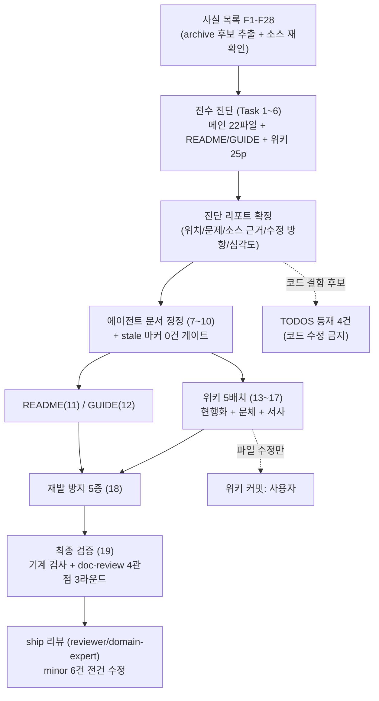

# DOCS-CONSISTENCY-OVERHAUL — 완료 브리핑

> 완료: 2026-07-07 / 이슈·브랜치 #120 / 문서 전용 토픽 (소스 코드 무변경)

## 작업 요약

에이전트 작업용 영구 문서(`docs/context/` 17파일 + `docs/smoke/` 5파일)와 사람 독자용 문서(README, PAYMENT-FLOW-GUIDE, 깃헙 위키 25페이지)가 코드보다 늦게 갱신되어 코드-문서 불일치·문서 간 모순·완료 항목 잔존이 누적된 상태였다. 표본 조사에서 코드와 반대인 트랜잭션 매니저 서술, 폐기된 RETRYING 상태를 현행처럼 쓰는 위키, 완료 항목이 대부분인 후속 대장 등 12건을 확인하고 토픽으로 승격했다.

접근은 "진단 먼저, 정정은 그다음"의 2단 분리다. 최근 봉인 토픽들의 변경 사실 28건(F1~F28)을 소스에서 재확인해 사실 목록을 만들고, 문서군별 전수 진단으로 진단 리포트(DIAGNOSIS)를 확정한 뒤, 리포트 항목만 반영하는 정정 태스크를 돌렸다. 모든 참·거짓 판정 근거는 소스 파일:라인만 인정했다 — 이 룰은 discuss 게이트에서 실증됐는데, 메인이 만든 기준 예문이 stale 한 CONFIRM-FLOW 서술을 인용해 위키의 참인 문장(outbox 발행 실패 시 롤백으로 PENDING 복귀)을 "틀린 사실"로 뒤집을 뻔한 것을 domain-expert 가 critical 로 잡았다. 문서가 문서를 베끼면 오류가 정본화된다는 이 토픽의 문제의식이 게이트에서 그대로 재현된 셈이다.

결과적으로 메인 저장소 23파일(+1,949/−394)과 위키 20파일(+782/−579, 커밋은 사용자)이 정정됐다. 위키는 본문 현행화(폐기된 RecoveryDecision·RETRYING·FCG 연결·Elasticsearch 스택 서술 제거) + 구조 불변 문장 단위 문체 교정 + 실제 이력 기반 서사 섹션을 적용했고, README 는 옛 배너(Phase 6 진행 중·589 PASS·정합 경고)를 실측 기준으로 교체했다. 후속 대장(TODOS·CONCERNS)은 3분류 삭제로 슬림화(TODOS 24건·CONCERNS 8건 전체 삭제, 혼합 항목은 문장 단위 제거, 수용된 한계는 보존)했고, 진단 중 발견된 코드 결함 후보 4건은 코드를 건드리지 않고 TODOS 등재만 했다. 재발 방지로 ship 체크리스트·context-update·workflow-ship·writing 컨벤션·doc-review 5종에 유지 규칙을 명문화했다.

## 핵심 설계 결정

| 결정 | 근거 | 기각된 대안 |
|---|---|---|
| 사실 판정 근거는 소스 파일:라인만 — docs/context·archive·위키 상호 인용 불인정 | discuss 게이트 critical 실증 (기준 예문이 stale 문서 인용으로 사실 반전) | briefing·기존 문서 기반 사실 목록 — 오류 정본화 경로라 기각 |
| 진단(리포트 확정)과 정정(반영) 태스크 분리 | 오류 주입 차단 — 정정자는 근거 대장만 따름 | 파일별 진단+정정 일체형 — 근거 없는 즉흥 수정 여지로 기각 |
| TODOS/CONCERNS 3분류 삭제 — (a)해소+archive 전체 삭제 (b)혼합은 문장만 제거 (c)수용 한계·회피된 우려 보존 | 살아있는 리스크 대장(over-sell 잔여, L-14 READY 잔류 등) 오삭 방지 | 완료 항목 일괄 삭제 — 혼합 항목의 기각 근거까지 지워 기각 |
| 위키 본문 현행화 (리포트성 Benchmark-Report 만 시점 기록 유지) | 독자가 배너 없이 본문만 읽어도 현행을 알 수 있어야 함 | 배너 정정만 — 폐기 서술이 본문에 남아 기각 |
| 문체 교정은 구조 불변 + 문장·단어 단위만 (불릿·표·헤더·명사형 종결 유지) | 사용자와 실제 위키 구절 3회 왕복으로 캘리브레이션 — 불릿 가독성은 자산 | 산문형 재작성 — "너무 구림" 교정으로 기각 |
| 서사 섹션은 실제 이력(PITFALLS·archive) 기반만, 창작 금지 | 포트폴리오 문서의 신뢰성 — ship 리뷰에서 "실측" 창작 2곳을 잡아 실증 | 자유 서사 — 역사 왜곡 위험으로 기각 |
| 코드 수정 금지, 결함 후보는 TODOS 등재만 | 문서 토픽에서 코드 회귀 위험 차단 (Minimal change) | 발견 즉시 수정 — 검증 부담 확대로 기각 |
| 위키는 파일 수정까지만, 커밋은 사용자 | 별도 git 저장소 — 사용자 최종 검토가 게이트 | — |

## 변경 범위

| 영역 | 내용 |
|---|---|
| `docs/context/` (17파일) | outbox 발행 실패 복구 stale 클러스터(REQUIRES_NEW 선점·IN_FLIGHT 유지 → 단일 TX 롤백·PENDING 복귀) 전면 정정, FAILED dead-terminal·attempt SoT·stock-committed key(productId) 등 사실 동기화, STRUCTURE↔STACK 모순 2건 해소, PITFALLS 헤더·dangling 참조 정리, S4 중복의 SSOT 몰기 |
| `docs/context/TODOS.md`·`CONCERNS.md` | 3분류 정리로 완료 항목 32건 삭제·혼합 항목 문장 단위 정리. 신규 등재 4건: payment_outbox IN_FLIGHT 경로 실효성, 구조화 로깅 마스킹 소실 의심, 메트릭 트리거 감지 dead branch, pg 재시도 백오프 off-by-one |
| `README.md` | 배너 사실화(Phase 6 완료·단위 861/통합 59), 삭제된 복구 개념(RecoveryDecision·재고 복구 가드) 현행 메커니즘으로 교체, 약어 각주, 시크릿 키 안내 정정 |
| `PAYMENT-FLOW-GUIDE.md` | outbox 복구 서술 5곳 정정, 결제 흐름 "Phase"→"단계" 개칭(개발 시기 축과 분리), 내부 ID 제거, 문체 정규화 |
| 위키 20파일 (미커밋) | 본문 현행화 + 문체 교정 + 서사 섹션 9곳 + 링크·슬러그 정합. structured-logging 은 삭제된 Logstash/Elasticsearch/마스킹 스택 서술을 Loki/Promtail 현행으로 전면 재작성, state-management 는 RETRYING/RecoveryDecision 시대 본문을 역사 절로 강등하고 EOS 컨슈머 모델 절 신설 |
| `.claude/skills/` 5종 | ship-ready 체크리스트·context-update·workflow-ship·writing 컨벤션·doc-review 에 3분류 삭제 룰·헤더 동기화·소스-온리 근거·문체 기준 명문화 |
| 산출물 | `DOCS-CONSISTENCY-OVERHAUL-DIAGNOSIS.md` — 사실 목록 28건 + 문서별 판정 + 스킵 결정 9건 + doc-review 3라운드 기록 (본 아카이브로 이동) |

## 다이어그램

## 코드 리뷰 요약

- **discuss 게이트 (2라운드)**: reviewer revise(진단 리포트 아티팩트 미정의) + domain-expert **fail(critical — 기준 예문이 stale 문서 인용으로 참인 위키 서술을 반전)** → 소스-온리 룰 신설·예문 소스 검증본 재작성으로 2R 양측 pass. 이 critical 이 토픽 방법론(소스-온리)의 직접 근거가 됨.
- **plan 게이트 (2라운드)**: reviewer revise(workflow-ship 보강 누락, 통짜 태스크 과대) + domain-expert revise(pg-strategy·tx-scope 의 domain_risk=false 배치 갭) → 19태스크 재편으로 2R 양측 pass.
- **doc-review (3라운드, execute 내)**: R1 에서 기술 정확성 FAIL 17건(attempt 헤더 동행 주장, 백오프 수치, dedupe skip 등)·규격 13축·서사 9축·독자 3축 → 수정 2회 → R2~R3 전 관점 PASS. 잔존 soft(한 줄 2문장 등)는 컨벤션 해석 사유와 함께 스킵 9건 기록.
- **ship 리뷰**: reviewer pass(minor 2) + domain-expert pass(minor 4 — 위키 "실측" 창작 2곳, architecture 주석 오기술, TODOS 현황 재기술, stock-committed key 오기) → **6건 전건 채택·수정, 스킵 0** (`ff4f52ee`). 재리뷰는 원 판정 pass + 1줄 치환급 수정이라 생략.

## 수치

- 태스크: 19 / 19 완료 (진단 6 · 정정 6 · 위키 5배치 · 재발 방지 1 · 최종 검증 1)
- 커밋: 25 (discuss·plan 산출물 2 + execute 22 + ship 수정 1, 마무리 커밋 별도)
- 테스트: 단위 861 · 통합 59 전체 PASS (코드 무변경 확인 겸 스냅샷)
- 진단: 사실 목록 28건 · 사전 표본 12건 · 스킵 결정 9건 (전건 사유 기록)
- findings: discuss critical 1·major 3·minor 3 / plan major 3·minor 3 / doc-review R1 FAIL 4관점(정확성 17건 포함) / ship minor 6 — 미해소 0
- 코드 확인 필요 TODOS 등재: 4건 (IN_FLIGHT 경로·마스킹 소실·트리거 감지·백오프 off-by-one)
- 위키: 20파일 수정, 커밋 대기 (사용자 검토 후 push)
