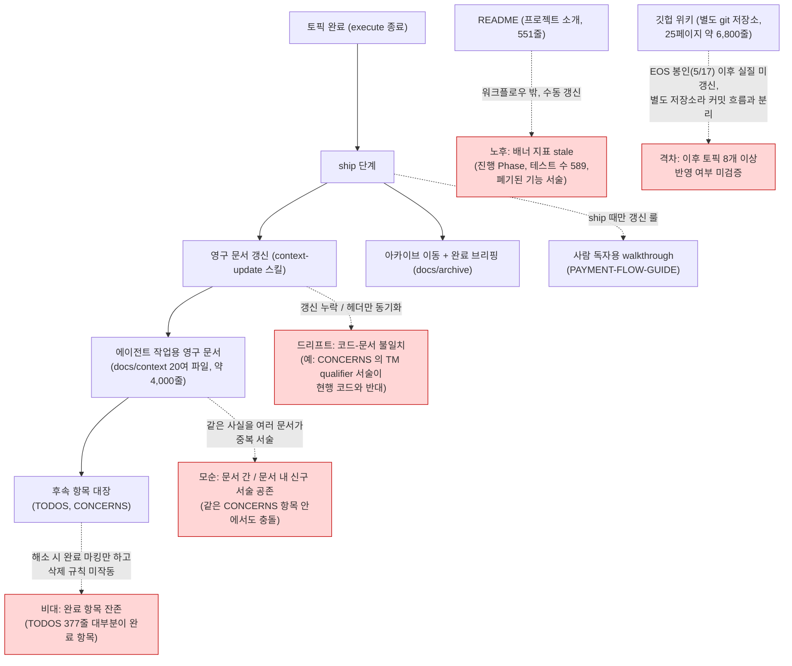
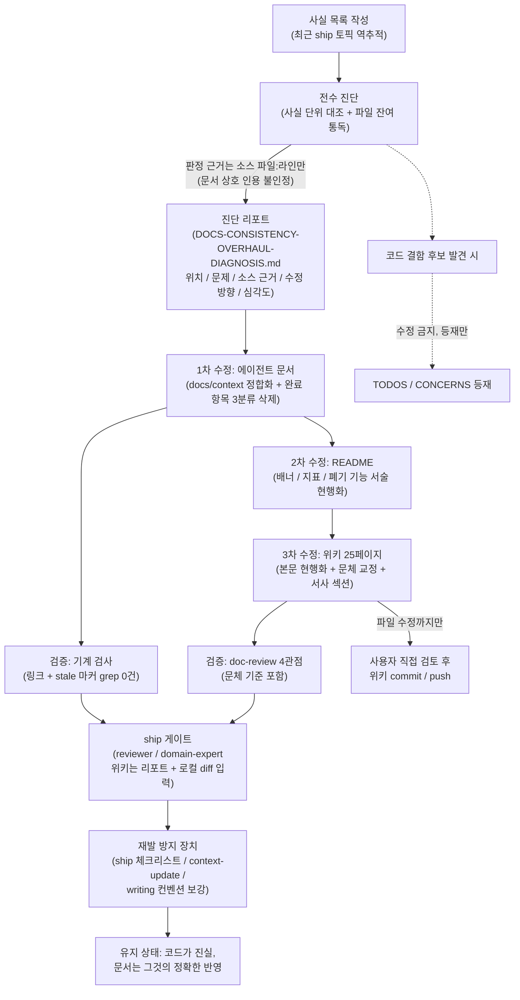

# 문서 전수 정합 개선 (DOCS-CONSISTENCY-OVERHAUL) 설계

> 최종 수정: 2026-07-02

## 사전 브리핑

### 현재 이해한 문제

- 문서 두 묶음 — 에이전트 작업용 영구 문서(`docs/context/` 20여 파일, 약 4,000줄)와 사람 독자용 문서(README + PAYMENT-FLOW-GUIDE + 깃헙 위키 25페이지, 약 7,700줄) — 가 코드보다 느리게 갱신되어 코드-문서 불일치, 문서 간 모순, 완료 항목 잔존 비대가 쌓여 있다.
- 목표는 전수 진단으로 문제 목록을 만들고, 우선순위에 따라 수정해 "코드가 진실이고 문서가 그것을 정확·간결하게 반영하는 상태" 를 만드는 것.
- 사용자 확인 완료: 대상 = 두 묶음 모두, 진행 = 워크플로우 4단계 정식 진행.

### 현재 문서 생태계 동작 (as-is)

### 사전 진단 표본 (이미 확인된 문제)

전수 진단 전에 표본 조사로 확인한 실제 사례. 진단 기준을 정하는 근거로 쓴다.

| # | 위치 | 문제 | 유형 |
|---|---|---|---|
| 1 | `CONCERNS.md` L-1 | "`@Transactional` qualifier 미명시로 선택한다" 서술 — 실제 코드는 qualifier 명시(`PaymentConfirmResultUseCase.java:116`). 같은 항목 후반의 "qualifier 명시 완료" 문장·`CONFIRM-FLOW.md` §5 와도 충돌 | 코드-문서 불일치 + 문서 내 모순 |
| 2 | `CONFIRM-FLOW.md` §12 | "TTL 정리 스케줄러는 후속 항목" — 정리 스케줄러(`DedupeCleanupWorker`)는 2026-05-29 도입 완료 | 완료 반영 누락 |
| 3 | `PITFALLS.md` 헤더 | 최종 갱신 2026-05-17 로 표기 — 본문 #24 는 2026-06-27 산출물 | 헤더-본문 불일치 |
| 4 | `TODOS.md` 전체 | 377줄 중 대부분이 완료 항목. 자체 규칙("토픽 종결 시 항목 삭제")과 모순, 매 discuss 진입 시 에이전트 컨텍스트 낭비 | 완료 항목 잔존 비대 |
| 5 | `README.md` 배너 | "진행 중 Phase 6 / 589 PASS / 코드 sync 진행 중" — 테스트 수 873+, 폐기된 기능(재고 복원 가드) 서술 잔존 | 노후 |
| 6 | README ↔ 내부 문서 | 페이즈 번호 이원화 — README Phase 1~7 vs 내부 문서 Phase 0~5 (README Phase 7 = 내부 Phase 4 로 추정) | 용어 불일치 |
| 7 | `TESTING.md` | 테스트 카운트 스냅샷(2026-06-14, 873/48)이 최근 STATE 수치와 불일치 — 스냅샷 선언은 있으나 갱신 시점 불명 | 노후 (경미) |
| 8 | 깃헙 위키 | 마지막 실질 갱신이 EOS 봉인(2026-05-17) + "수정" 커밋 2건. 이후 8개 이상 토픽 ship 미반영 여지 | 격차 미검증 |
| 9 | 위키 `structured-logging.md` | Logstash 경유 Elasticsearch 인덱싱 서술 — 현행 스택은 Promtail/Loki | 코드-문서 불일치 |
| 10 | 위키 `state-management.md` | 폐기된 RETRYING 상태(CLEANUP-BATCH-E, 2026-06-21 제거)를 현행처럼 서술. 상단 "이후 진화함" 배너도 FCG 미연결·재고 복구 가드 폐기를 반영 못 함 | 코드-문서 불일치 |
| 11 | 위키 `outbox-pattern.md` | "## 표기 규칙" 빈 섹션 (내용 없는 헤더 잔존) | 구조 결함 (경미) |
| 12 | `CONFIRM-FLOW.md` §3·§4·§9·§11 + `PAYMENT-FLOW.md` Phase 3·장애 복원 포인트 | payment_outbox 발행 실패 복구를 "선점이 REQUIRES_NEW 로 별도 커밋 → 실패 시 IN_FLIGHT 유지 → 타임아웃 회수"로 서술 — 실제 코드는 `OutboxRelayService.relay:49` 단일 `@Transactional` 안 선점이라 실패 시 롤백으로 **PENDING 복귀** 후 OutboxWorker 5초 주기 재픽업 (Javadoc `OutboxRelayService.java:47` 명시). REQUIRES_NEW 선점(`PaymentOutboxUseCase.claimToInFlight`)·`incrementRetryOrFail` 은 프로덕션 호출처 0. **1라운드 게이트 domain-expert 가 검출 — 기준 예문이 이 stale 서술을 인용해 위키의 참인 문장을 "틀린 사실"로 뒤집을 뻔함.** S1 최우선 정정 대상 | 코드-문서 불일치 (critical) |

### 인터뷰로 확정된 요구 (2026-07-02)

- **위키는 정합 + 내용 개선 둘 다** — 코드 대조 정정에 그치지 않고 콘텐츠 품질 자체를 끌어올린다. 25페이지 전수 대조.
- **위키 설계 페이지는 본문 현행화** — 현재 코드 기준으로 본문을 다시 쓰고, 진화 과정은 서사 섹션으로 흡수. `Benchmark-Report` 같은 리포트성 페이지만 시점 기록 유지.
- **위키 문체는 AI체 배제, 사람이 쓴 글처럼** — 구조는 불변, 문장·단어 단위 어색함만 교정. 확정 기준은 아래 "문체 수정 기준" 절 참조 (예시 3회 왕복으로 캘리브레이션 완료).
- **위키는 직접 커밋 금지** — 파일 수정까지만 수행하고 commit/push 는 사용자가 직접 한다 (위키는 별도 git 저장소).
- **README 도 대상.**
- **TODOS/CONCERNS 완료 항목은 완전 삭제** — 이력은 `docs/archive/` 가 SSOT.
- **드리프트 재발 방지 장치 포함** — ship 체크리스트·context-update 스킬 보강을 이번 범위에 넣는다.

---

## 요약 브리핑

### 결정된 접근

- 최근 ship 토픽들의 변경 사실 목록을 먼저 만들어 관련 문서를 한 번에 대조(사실 단위 역추적)하고, 파일 단위 잔여 통독으로 보완하는 전수 진단을 수행한다.
- 모든 참·거짓 판정은 **소스 코드 파일:라인만** 근거로 인정한다 — 게이트 1라운드에서 문서끼리 베낀 오류(outbox 발행 실패 복구 서술)가 위키로 정본화될 뻔한 것을 실증으로 잡았다.
- 수정은 에이전트 문서 → README → 위키 순서. 위키는 본문 현행화 + 문장·단어 단위 문체 교정 + 서사 섹션을 적용하되 커밋은 사용자가 직접 한다.
- 재발 방지로 ship 체크리스트·context-update 스킬·writing 컨벤션에 유지 규칙을 명문화한다.

### 변경 후 동작 (to-be)

### 핵심 결정 목록

- 사실 판정 근거는 소스 파일:라인만 — `docs/context/`·archive·위키 상호 인용 불인정
- 진단 리포트는 `docs/DOCS-CONSISTENCY-OVERHAUL-DIAGNOSIS.md` 단일 파일, ship 시 archive 이동 — 위키 재검증의 SSOT
- TODOS/CONCERNS 완료 항목은 3분류 삭제 (전체 삭제 / 혼합 항목 문장 단위 제거 / 수용된 한계·회피된 우려 삭제 금지)
- 위키는 본문 현행화(리포트성 페이지 예외) + 구조 불변 문장 단위 문체 교정 + 실제 이력 기반 서사 섹션, 커밋은 사용자
- 문체 기준은 실제 위키 구절 예시 3회 왕복으로 캘리브레이션 완료 (기준 예문 포함)
- 코드는 이 토픽에서 수정하지 않음 — 결함 후보는 TODOS 등재만

### 트레이드오프 / 후속

- 위키 전수 25페이지 + 내부 문서 4,000줄 대조는 비용이 크지만 "최고의 상태" 목표에 부합 — plan 에서 태스크를 심각도·문서 묶음 단위로 분해해 관리
- 발견된 코드 결함 후보(REQUIRES_NEW 선점 경로·`incrementRetryOrFail` 호출처 0, 발행 실패 무백오프 5초 재시도)는 이번에 고치지 않고 등재 — 데드 판정은 사용자 확인 필요
- 게이트 2R 잔여 minor 2건(예문 retry 카운트 불릿 재검증, "기본값" 층위 명시 규칙)은 plan/execute 에서 흡수

---

## 문제 정의

문서가 코드를 따라가지 못해 세 가지 실질 비용이 발생하고 있다.

1. **에이전트 오판 위험**: `docs/context/` 는 매 토픽에서 에이전트가 작업 기준으로 읽는다. 코드와 반대인 서술(표본 #1)은 잘못된 설계 판단의 입력이 된다.
2. **컨텍스트 낭비**: 완료 항목이 대장 파일(TODOS 377줄)의 대부분을 차지해, discuss 진입 때마다 유효 항목 탐색 비용이 커진다.
3. **독자 신뢰 손상**: README 가 스스로 "정합이 안 맞을 수 있음" 배너를 달고 있고, 위키는 폐기된 상태 머신을 현행처럼 서술한다. 포트폴리오 독자에게 최신 상태를 전달하지 못한다.

## 영향 범위

| 구분 | 대상 | 작업 |
|---|---|---|
| 수정 | `docs/context/` 전체 (영구 문서 11 + conventions 5 + stack 1), `docs/smoke/` 5 | 코드 대조 정정 + 완료 잔존 삭제 + 중복·모순 해소 |
| 수정 | `docs/context/TODOS.md`, `CONCERNS.md` | 완료 항목 완전 삭제 (이력은 archive 위임) |
| 수정 | `README.md`, `docs/context/PAYMENT-FLOW-GUIDE.md` | 배너·지표·기능 서술 현행화 + AI체 기준 적용 |
| 수정 | 위키 25페이지 (`payment-platform.wiki/`, 별도 저장소) | 본문 현행화 + AI체 제거 + 서사 섹션 (커밋은 사용자) |
| 보강 | `.claude/skills/context-update/`, `workflow-ship`, `_shared/checklists/ship-ready.md`, `_shared/conventions/writing.md` | 재발 방지 규칙 명문화 |
| 무관 | 소스 코드, `docs/archive/`, `docs/STATE.md` 형식 | 코드 결함 발견 시 TODOS/CONCERNS 등재만 |

## 진단·수정 방법 옵션 비교

**진단 단위** — 두 방식을 비교했다.

| 방식 | 내용 | 장점 | 단점 |
|---|---|---|---|
| 파일 단위 통독 대조 | 문서 한 파일씩 통독하며 서술마다 코드 확인 | 누락 없음, 파일별 완결 | 같은 사실을 문서마다 반복 확인 — 중복 노동, 문서 간 모순을 놓치기 쉬움 |
| 사실 단위 역추적 (채택) | 최근 ship 토픽들의 변경 사실 목록(예: attempt SoT 영속, TM qualifier 명시, RETRYING 폐기)을 먼저 만들고, 각 사실이 언급되는 모든 문서를 한 번에 대조. 이후 파일 단위 잔여 통독으로 보완 | 문서 간 모순을 구조적으로 잡음, 코드 확인 1회로 여러 문서 정정 | 사실 목록에 없는 오류는 잔여 통독에 의존 |

**수정 순서** — 에이전트 문서를 먼저 정합화해 SSOT 로 만든 뒤, 그 위에서 사람 독자용 문서(README → 위키)를 재작성한다. 역순이면 위키를 두 번 고치게 된다.

## 결정 사항

| 항목 | 결정 | 이유 |
|---|---|---|
| 진실 원천 | 코드. 문서-코드 충돌 시 문서를 고치고, 코드 결함 판명 시 이 토픽에서 코드를 건드리지 않고 TODOS/CONCERNS 등재만 | Minimal change 원칙 — 문서 토픽에서 코드 회귀 위험 차단 |
| **사실 판정 근거 (게이트 1R 반영)** | S1/S2 참·거짓 판정 근거는 **소스 파일:라인만 인정** — `docs/context/`·archive·위키의 상호 인용은 근거 불인정 | 기준 예문이 stale 한 CONFIRM-FLOW §3 을 인용해 위키의 참인 서술을 뒤집을 뻔한 실증 (표본 #12) — 문서끼리 베끼면 오류가 정본화됨 |
| 진단 리포트 (게이트 1R 반영) | `docs/DOCS-CONSISTENCY-OVERHAUL-DIAGNOSIS.md` 단일 파일. 항목 형식: 문서 위치 / 문제 서술 / 소스 근거(파일:라인) / 수정 방향 / 심각도. execute 내내 갱신, ship 시 archive 로 이동 | 검증 전략 4곳이 인용하는 아티팩트의 위치·형식·보존을 확정. 특히 위키는 메인 저장소 diff 가 없어 이 리포트 + 위키 로컬 커밋 전 diff 가 게이트 재검증 수단 |
| 진단 단위 | 사실 단위 역추적 + 파일 단위 잔여 통독 | 문서 간 모순을 구조적으로 검출 |
| 수정 순서 | 에이전트 문서 → README → 위키 | 정합화된 내부 문서를 위키 재작성의 근거로 사용 (단 사실 근거는 항상 소스) |
| 심각도 분류 | S1 코드-문서 불일치 / S2 문서 간·내 모순 / S3 완료 잔존·노후 / S4 중복·비대 / S5 문체(AI체) | 수정 우선순위와 게이트 판정 기준으로 사용 |
| TODOS/CONCERNS 완료 항목 (게이트 1R 반영) | 3분류 삭제 기준 — (a) ✅ 해소 마킹 + archive briefing 경로가 있는 항목만 **전체 삭제** (b) 부분 해소·혼합 항목(예: CONCERNS L-1, L-14)은 **해소분 문장만 제거**하고 잔여 한계·기각 근거 보존 (c) 수용된 한계 L-* 현행분과 "회피된 우려" 표는 **삭제 금지** | 살아있는 도메인 리스크 대장(잔여 over-sell, resetToReady 기각 기록 등)을 완료 이력과 함께 지우는 오삭 방지 |
| 위키 정합 방식 | 설계 페이지 본문 현행화, 리포트성 페이지(Benchmark-Report)만 시점 기록 유지 | 독자가 배너 없이 본문만 읽어도 현행을 알 수 있어야 함 |
| 문체 수정 기준 (위키·README) | 구조 불변 + 문장·단어 단위 교정만. 상세는 아래 "문체 수정 기준" 절 (기준 예문 포함) | 사용자가 실제 위키 구절 예시 3회 왕복으로 확정 — 불릿·표 구조는 가독성 자산이라 재편 금지 |
| 서사 섹션 | 페이지별 자율 위치(도입 동기형 또는 말미 회고형). 내용은 PITFALLS·archive briefing 에 기록된 실제 이력 기반으로만 — 창작 금지. **작성 순서: 해당 사실의 에이전트 문서 정정이 끝난 뒤** (plan 태스크 의존관계로 강제) | 본문은 중립 유지, 사람 목소리는 전용 섹션에. 오염된 근거 문서에서 서사를 먼저 쓰면 오류가 재수입됨 (게이트 1R) |
| 위키 커밋 | 파일 수정까지만. commit/push 는 사용자 | 사용자 지시 (위키는 별도 git 저장소) |
| 페이즈 표기 | 진단에서 README(1~7)·내부(0~5) 실태를 전수 파악 후 통일안을 plan 에서 확정 | 표기 통일은 실태 파악 없이 결정하면 재작업 위험 |
| 재발 방지 | context-update 스킬·ship 체크리스트에 "완료 항목 삭제·헤더-본문 동기화·대장 파일 슬림 유지" 명문화, writing 컨벤션에 AI체 기준 반영 | 고친 상태가 다음 토픽에서 유지되게 |
| PAYMENT-FLOW-GUIDE | 이번 토픽 execute 범위에 포함 | "ship 때만 갱신" 룰의 취지는 토픽 중간 churn 방지 — 문서가 곧 산출물인 본 토픽에서는 execute 가 곧 그 갱신 |

## 문체 수정 기준 (위키·README)

사용자와 실제 위키 구절로 캘리브레이션해 확정한 기준. 뼈대는 기존 writing 컨벤션(`.claude/skills/_shared/conventions/writing.md`)의 전면 적용이고, 그 위에 문장·단어 단위 교정을 얹는다.

1. **정합** — 본문을 현행 코드 기준으로 정정. 확실치 않은 사실은 쓰지 않고, 수정마다 코드 근거를 진단 리포트에 기록.
2. **구조 불변** — 헤더·불릿·표(가운데 정렬)·Mermaid 유지. 유일한 구조 변경 허용: 한 불릿이 너무 길어지면 하위 뎁스로 분해.
3. **문장·단어 교정** —
   - 평가·과시 형용사 제거 ("가장 정밀한 모델이다" → 사실 비교·이유)
   - 번역투·교과서투 제거 ("~를 통해", "~함으로써", "방식을 사용한다" → 구체 동사)
   - 문법이 꼬인 구절 교정 ("타임아웃 회수가 백오프 적용해 되돌림" 류)
   - 짧은 단정문 연발 금지 — 관련 절은 연결어미로 이어 자연스러운 길이로
   - 유지: `~다.` 본문 종결, 불릿 명사형 종결, 명사화 표현, 한 줄 한 문장
4. **writing 컨벤션 전면 준수** — 식별자 4단계 룰, 동의어 통일 표, 약어 풀어쓰기. 위키가 어기는 곳도 함께 정정.
5. **서사는 전용 섹션으로만** — 본문에 스며들지 않게.

### 기준 예문 (`outbox-pattern.md` payment_outbox 절)

**전**:

> 가장 정밀한 모델이다.
> 다중 인스턴스 환경에서 같은 outbox row 를 두 Worker가 동시에 픽업하지 않도록 선점 방식을 사용한다.
>
> ### 핵심 동작
> - `PENDING → IN_FLIGHT` 는 atomic UPDATE 로 단 한 Worker만 선점 보장
> - 발행 실패는 TX 롤백으로 PENDING 유지 → 다음 cycle 재시도. worker 가 IN_FLIGHT 로 잡고 죽으면 일정 시간 이후 타임아웃 회수가 백오프 적용해 PENDING 으로 되돌림
> - 결제 명령은 무조건 발행돼야 하므로 자동 FAILED 종결은 사실상 도달하지 않는다 — retry 카운트는 백오프 강도 조절과 운영 알람용으로 고려 중

**후** (게이트 1R critical 반영 — 사실은 소스 검증본):

> 두 outbox 중 상태를 더 잘게 쪼갠 쪽으로, 다중 인스턴스가 같은 row 를 동시에 집으면 명령이 두 번 나가기 때문에 픽업 전에 선점 단계를 둔다.
>
> ### 핵심 동작
> - `PENDING → IN_FLIGHT` 선점은 원자 UPDATE — 여러 Worker 가 같은 row 를 봐도 한 명만 잡는 구조
> - 발행 실패 시 예외가 relay TX 를 롤백해 선점까지 함께 되돌리므로 row 는 PENDING 복귀
>   - 발행 의도를 잃지 않는 것이 outbox 의 존재 이유라, 실패 복구를 별도 상태 관리 없이 롤백 하나로 처리
>   - OutboxWorker(5초 주기)가 PENDING 을 다시 픽업해 재발행
> - 결제 명령은 포기 불가 메시지라 자동 FAILED 종결 경로 없음 — retry 카운트는 백오프 조절과 운영 알람용

적용 포인트: 도입 두 단문을 한 문장으로 연결, 평가 형용사 제거, 가장 길던 불릿을 하위 뎁스로 분해, 불릿 명사형 종결·구조 유지. 사실 근거는 소스만 — `OutboxRelayService.java:47-54` (단일 `@Transactional` 선점+발행, Javadoc "실패 시 rollback 으로 PENDING 유지"), `application.yml:147` (fixed-delay-ms 5000), `incrementRetryOrFail` 호출처 0 (자동 FAILED 미도달). 1라운드에서 이 예문이 CONFIRM-FLOW §3 의 stale 서술("IN_FLIGHT 유지 + 5분 타임아웃 회수")을 인용해 위키의 참인 문장을 뒤집을 뻔했다 — "사실 판정 근거는 소스만" 룰의 실증 사례 (표본 #12).

## 리스크와 대응

| 리스크 | 대응 |
|---|---|
| 현행화 과정에서 새 오류 주입 (잘못 이해하고 고침) | 모든 S1/S2 수정에 코드 근거(파일:라인)를 진단 리포트에 남기고, ship 코드리뷰 게이트에서 reviewer·domain-expert 가 대조 |
| TODOS/CONCERNS 대량 삭제 시 유효 항목 오삭 | 항목별 삭제 근거(해소 토픽) 확인 후 삭제, diff 를 게이트에서 검토 |
| 위키 본문 현행화로 과거 맥락 유실 | 서사 섹션이 진화 이유를 보존, 상세 이력은 archive briefing 링크 |
| AI체 제거가 과교정되어 기존 컨벤션(헤더·표·명사형 종결) 훼손 | writing 컨벤션에 "유지 목록 / 제거 목록" 을 먼저 명문화하고 그 기준으로만 수정 |
| 위키 수정이 메인 저장소 커밋 흐름과 엉킴 | 위키는 별도 저장소에서 파일 수정만, 커밋·push 는 사용자 — 메인 PR 에 위키 diff 요약만 첨부 |

## 검증 전략

1. **기계 검사**: 상대 링크 검사 스크립트(현재 0건 유지) + stale 마커 grep — 폐기 식별자(RETRYING, StockOutbox, `EventDedupeStore`(payment 측), Elasticsearch/Logstash 등)가 현행 서술로 남은 곳 0건.
2. **코드 대조**: 진단 리포트(`docs/DOCS-CONSISTENCY-OVERHAUL-DIAGNOSIS.md`)의 S1/S2 항목마다 **소스 코드** 근거(파일:라인) 명시 — 문서 상호 인용은 근거 불인정. 수정의 참/거짓을 게이트가 소스로 재검증 가능하게.
3. **doc-review 스킬 검수**: 사람 독자용 문서(README·GUIDE·위키)는 4관점(규격/서사/기술 정확성/독자 친화) 병렬 검수 — AI체 기준을 규격 관점에 추가해 적용.
4. **게이트**: discuss/plan 게이트 + ship 리뷰에서 reviewer(문서 품질)·domain-expert(도메인 사실 정확성 — 돈 흐름·상태 전이·멱등성 서술) 병렬 판정. **위키 변경분은 메인 저장소 diff 에 없으므로** 진단 리포트 + 위키 로컬 저장소의 커밋 전 diff(`git -C <wiki> diff`)를 게이트 입력으로 명시 전달.
5. **위키 최종 확인**: 수정 완료 후 사용자가 직접 검토·커밋 — 커밋 전 상태가 최종 게이트.

## 제외 범위 (non-goals)

- **소스 코드 수정** — 진단 중 코드 결함 발견 시 TODOS/CONCERNS 등재만 (별 토픽).
- **`docs/archive/` 정리** — 이력 보존용, "에이전트 미참조" 선언으로 충분 (CONCERNS C-8).
- **위키 신규 페이지 작성** — 기존 25페이지 개선이 범위. EOS 이후 신설 체계(알람 등)를 다룰 새 페이지가 필요하다고 진단되면 plan 에서 포함 여부 결정.
- **Alertmanager 도입 등 기능 작업** — 문서 토픽 아님.
- **`docs/STATE.md` 형식 변경** — 워크플로우 스킬이 SSOT.

## 코드 확인 필요 항목 (execute 에서 TODOS 등재 예정)

이번 게이트 조사에서 나온 코드 결함 후보 — 본 토픽 룰대로 코드는 건드리지 않고 등재만 한다. 데드 판정은 사용자 확인 필요 사안.

- `PaymentOutboxUseCase.claimToInFlight`(REQUIRES_NEW)·`incrementRetryOrFail` 프로덕션 호출처 0. 현행 단일 TX relay 구조에서는 IN_FLIGHT 가 단독 커밋될 경로가 사실상 없어 `recoverTimedOutInFlightRecords` 회수와 `nextRetryAt` 백오프가 실효하지 않고, 발행 실패 시 5초 주기 무백오프 재시도가 됨 — 의도된 단순화인지 회귀인지 확인 필요.

## 게이트 2R 잔여 minor (plan/execute 에서 흡수)

- 기준 예문 마지막 불릿("retry 카운트는 백오프 조절과 운영 알람용")은 위 코드 확인 항목의 결론에 따라 실반영 전에 소스 재검증 — 설계 의도 서술로 남길지, 실효 기준으로 고칠지 함께 결정.
- 진단 리포트 항목 형식에 "기본값 인용 시 층위(코드 fallback vs 프로파일 yml) 명시" 규칙 추가 — 예: `parallel-enabled` 는 코드 fallback false, default profile yml true. plan 에서 반영.

## 참고

- 사전 진단 표본: 본 문서 상단 표 12건
- 검수 도구: `.claude/skills/doc-review/SKILL.md` (4관점), `.claude/skills/wiki-access/SKILL.md` (위키 경로·커밋 규칙), `.claude/skills/_shared/conventions/writing.md` (작성 컨벤션)
- 최근 ship 토픽 (사실 목록의 출처): DLQ-REACHABILITY(6/25) / ALERTING-RULES-AND-FAULT-DRILL(6/27) / FAULT-INJECTION-RESILIENCE(6/30) / TC-3 재고 resync(7/1) 외 — `docs/archive/README.md`
