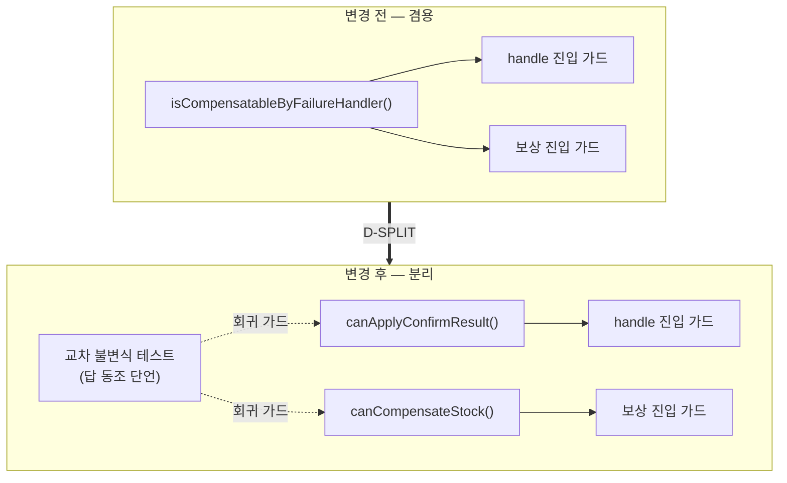
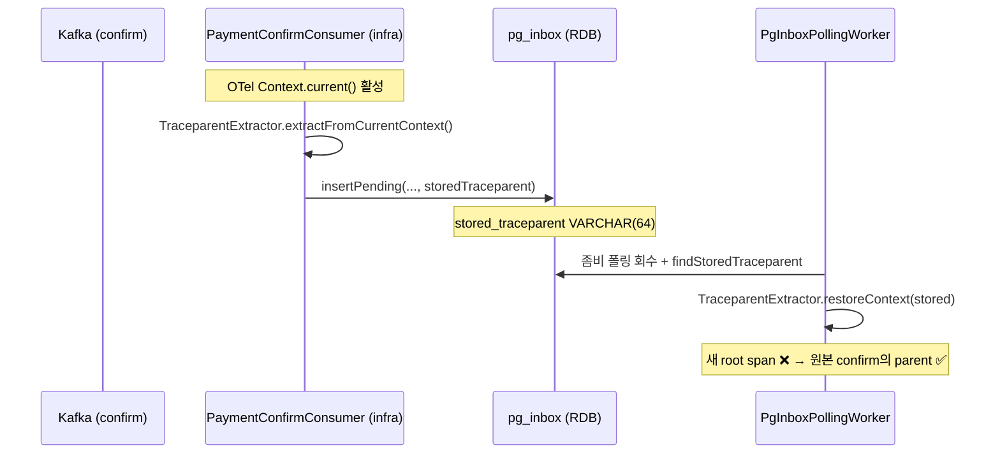

# EOS-FOLLOWUP-CLEANUP — 완료 브리핑

> 봉인: 2026-05-29 · 이슈 #79 · 브랜치 #79 · 14 태스크 전체 완료 · `./gradlew test` 746 PASS

이 파일 하나로 작업의 전모를 파악할 수 있도록 정리한다. 세부는 같은 디렉토리의 `EOS-FOLLOWUP-CLEANUP-CONTEXT.md`(설계)와 `EOS-FOLLOWUP-CLEANUP-PLAN.md`(실행 계획) 참조.

---

## 작업 요약

payment-service가 발행 보장 모델을 outbox에서 Kafka EOS로 빅뱅 전환(PAYMENT-EOS-TRANSITION)한 직후, 그 전환이 남긴 정합 부채와 결제 비동기 경로의 청소 미비 항목을 한 묶음으로 해소하는 후속 작업이다. 다섯 갈래의 독립 문제가 모였다.

첫째, EOS 전환으로 `PaymentConfirmResultUseCase.handle`은 바깥 Kafka 트랜잭션 안에서 도는 유일한 컨슈머 진입 DB 트랜잭션이 됐는데, 이 중첩 구조가 코드에 드러나지 않아 다음 유지보수자가 `@Transactional`이 어느 트랜잭션 매니저를 잡는지 오해할 위험이 있었다(FOLLOW-6). 둘째, `PaymentEventStatus`의 단일 판별 메서드 `isCompensatableByFailureHandler`가 "컨슈머가 결과를 반영해도 되는가"와 "재고 보상에 진입해도 정당한가"라는 의미가 다른 두 질문에 겸용되고 있어, 한쪽 정책이 바뀌면 다른 쪽이 함께 깨질 수 있었다(FOLLOW-5). 셋째·넷째, payment와 product의 dedupe 테이블(`payment_event_dedupe` / `stock_commit_dedupe`)에 만료 행 청소 메커니즘이 없어 행이 무한 누적됐다(FOLLOW-2 / TC-11). 다섯째, pg-service의 좀비 폴링 회수가 새 OTel root span으로 시작돼 원본 결제 confirm의 분산 추적과 끊겼다(TC-15 항목3).

접근은 "떼어내기 쉬운 경계"와 "의도를 깨질 위험이 있는 코드 옆에 둔다"는 두 원칙으로 일관했다. 트랜잭션 매니저 의도는 위험 지점 한 곳(`handle`)에만 qualifier로 명시하고 나머지 자명한 13곳+는 건드리지 않았다. 겸용 메서드는 두 술어로 분리하되 정답표가 우연히 같은 현 상태를 교차 불변식 테스트로 고정해 드리프트를 회귀 가드로 잡았다. dedupe 청소는 각 테이블을 이미 소유한 어댑터의 책임으로 두고 `@Scheduled` 워커를 서비스별로 독립 신설했다. 분산 추적은 pg_inbox에 traceparent 컬럼을 더해 RDB에 보관하고 폴링 회수 시 부모로 복원하되, OTel 의존은 infrastructure에 가뒀다.

결과적으로 14개 태스크 31개 커밋으로 전 모듈 746 테스트가 통과했고, 코드 리뷰에서 critical/major 0건으로 봉인됐다.

---

## 핵심 설계 결정

### D-TM-QUALIFIER — TM qualifier는 위험 지점 한 곳만 명시 (FOLLOW-6)
- **결정**: `PaymentConfirmResultUseCase.handle`의 `@Transactional`에만 `transactionManager = "transactionManager"` qualifier를 박고, 나머지 단일 `@Primary` 매니저를 쓰는 13곳+는 무변경.
- **근거**: `handle`은 바깥 Kafka tx 안에서 도는 유일한 컨슈머 진입 DB tx다. 이 한 곳만 "여기 DB tx는 Kafka tx와 별개의 `@Primary` JPA 매니저로 돈다"를 코드에 드러내면 EOS 중첩 구조의 의도가 읽힌다.
- **기각**: (a) 전체 일괄 명시 — 의도 표현 이득 대비 변경 면적·리뷰 비용 과다, 사용자 기각. (b) 코드 변경 0 + 문서만 — `handle`의 중첩 tx만은 코드에서 안 보이면 오해 위험이 가장 큰 지점.

### D-TM-API — deprecated 설정 API 교체 (FOLLOW-6)
- **결정**: `KafkaConsumerConfig`의 `setTransactionManager(PlatformTransactionManager)`(deprecated) → `setKafkaAwareTransactionManager(KafkaAwareTransactionManager)`.
- **근거**: `KafkaTransactionManager`는 `KafkaAwareTransactionManager`를 구현하므로 현재 주입 빈 타입 그대로 호출 가능 — 동작 동일, 컴파일 경고 제거. spring-kafka 3.3.4에 실재 확인.

### D-1PC-DOC — best-effort 1PC 한계는 위험을 만드는 코드 옆에 문서화 (FOLLOW-6)
- **결정**: Kafka tx와 DB tx가 별개 매니저로 도는 best-effort 1PC 한계를 `handle`/EOS wiring 옆 Javadoc에 명시.
- **근거**: 의도 표현은 "그 의도가 깨질 위험이 있는 코드 옆"에 둔다. 트랜잭션 경계 결정은 application 책임이므로 use-case 클래스 주석이 정당한 위치.

### D-SPLIT — 겸용 판별 메서드를 두 술어로 분리 (FOLLOW-5)
- **결정**: `isCompensatableByFailureHandler` → `canApplyConfirmResult`(결과 반영 가능성) + `canCompensateStock`(보상 정당성). 동사 `can*`로 통일해 서로 다른 행위를 허가하는 술어임을 명확히 함. 두 호출처 동시 갱신 + 기존 메서드 완전 제거(grep 0건).
- **근거**: 두 메서드의 정답표는 현재 우연히 같지만(READY/IN_PROGRESS/RETRYING만 true) 의미가 다르다. 분리하면 한쪽 정책이 바뀌어도 다른 쪽이 영향받지 않아 삭제·교체 비용이 낮아진다.
- **기각**: (a) 메서드 유지 + 주석만 — 컴파일러가 분기 변경 파급을 못 막음. (b) 두 메서드를 application 서비스에 두기 — 상태 판별이 domain 밖으로 새, hexagonal 룰 위반.

### D-SPLIT-3 — 교차 불변식 회귀 테스트 (FOLLOW-5)
- **결정**: 두 메서드가 종결/QUARANTINED/EXPIRED에서 답이 동조(둘 다 false)함을 명시 단언하는 회귀 테스트 신설(`PaymentEventStatusCrossInvariantTest`). 기존 `PaymentEventStatusEosGuardTest`는 삭제, 역할을 `PaymentEventStatusSplitMethodTest`로 이전.
- **근거**: 분리 후 컴파일러는 한쪽 정답표만 바뀐 것을 막지 못한다. 컨슈머 가드에서 QUARANTINED를 true로 바꾸면 늦은 APPROVED가 `markPaymentAsDone` not-retryable 예외 → DLQ silent로 빠지는 D7 침묵 DLQ 사고(PITFALLS §21)가 재현된다. 답 동조 단언만이 이 드리프트를 잡는다.

### D-CLEANUP-PORT — dedupe 청소는 기존 포트에 메서드 추가 (FOLLOW-2 / TC-11)
- **결정**: 기존 `PaymentEventDedupeStore` / `EventDedupeStore` 포트에 `deleteExpired(Instant, int): int` 1개 추가. 별도 `CleanupPort` 신설 안 함.
- **근거**: dedupe 삭제는 이미 그 테이블을 소유한 어댑터의 책임 범위다. 새 포트를 만들면 동일 자원에 포트가 둘 생겨 SoT가 갈라진다.

### D-CLEANUP-WORKER — 서비스별 독립 `@Scheduled` 워커 (FOLLOW-2 / TC-11)
- **결정**: payment·product 각각 `infrastructure/scheduler/DedupeCleanupWorker`(@Scheduled) 독립 신설. 공통 추상화 안 만듦.
- **근거**: `@Scheduled`는 Spring Scheduler 의존이라 infrastructure(ARCHITECTURE 비동기 어댑터 룰). 공유 라이브러리/베이스 클래스는 서비스 간 결합이 생겨 DB per service 격리 원칙과 상충.
- **안전성**: 만료 조건 DELETE(`expires_at < now`)는 멱등 — 동시 실행돼도 두 번째는 0 row, 무해. dedupe TTL P8D > Kafka retention 7d 관계상, 행이 삭제 대상이 되는 시점엔 원본 메시지가 이미 retention 만료로 재배달 물리 불가 → 멱등 SoT 비파괴.

### D-PGINBOX-제외 — pg_inbox 청소는 범위 제외 (Round 1 Domain Expert critical 대응)
- **결정**: payment·product 두 dedupe만 청소. pg_inbox는 제외.
- **근거**: pg_inbox의 종결 행은 confirm 재배달 멱등의 SoT라 조기 삭제 시 중복 처리 위험.

### D-TRACE-COLUMN — pg_inbox에 traceparent 컬럼 보관 (TC-15 항목3)
- **결정**: Flyway `V4__add_pg_inbox_stored_traceparent.sql`로 `stored_traceparent VARCHAR(64) NULL` 추가(기존 `db/migration/` 경로 유지).
- **근거**: traceparent는 회수 시점에 원본 추적을 이어붙일 유일한 근거다. pg_inbox가 이미 회수 SoT이므로 같은 행에 둔다. VARCHAR(64) — W3C traceparent는 55자(`00-<32hex>-<16hex>-<2hex>`), 여유분 포함.

### D-TRACE-LAYER — OTel 의존은 infrastructure에 격리 (TC-15 항목3)
- **결정**: 추출 로직을 `infrastructure/trace/TraceparentExtractor`(OTel `W3CTraceContextPropagator` 래핑)에 두고 consumer가 호출. application 포트(`insertPending`)는 불투명한 문자열 토큰만 전달.
- **근거**: application이 OTel API를 직접 부르면 추적 인프라에 결합된다(application→infra 역의존). Round 1 Critic critical 대응으로 추출을 consumer(infra)에 재배치.
- **부모 복원 근거**: 좀비 회수는 원본 confirm의 인과적 연속(같은 결제 처리의 지연된 후속)이므로 span link가 아닌 parent 복원이 도메인상 정확(Round 1 Domain Expert 판정 확정).

---

## 변경 범위

### Domain (payment)
- `PaymentEventStatus` — `isCompensatableByFailureHandler()` 제거, `canApplyConfirmResult()` / `canCompensateStock()` 신설(둘 다 READY/IN_PROGRESS/RETRYING만 true).

### Application (payment)
- `PaymentConfirmResultUseCase` — `handle`의 진입 가드를 `canApplyConfirmResult`로 교체, `@Transactional(transactionManager = "transactionManager", timeout = 5)` qualifier 명시, 1PC 한계·TM 분리 원칙 Javadoc 추가.
- `PaymentTransactionCoordinator` — 보상 가드를 `canCompensateStock`로 교체.
- `PaymentEventDedupeStore` 포트 — `deleteExpired(Instant, int): int` 추가.

### Application (product / pg)
- product `EventDedupeStore` 포트 — `deleteExpired` 추가.
- pg `PgInboxRepository` 포트 — `insertPending` 시그니처에 `storedTraceparent` 추가, `findStoredTraceparent` 추가. `PgConfirmService` / `PgInboxPendingService` 전달 사슬 갱신.

### Infrastructure (payment)
- `KafkaConsumerConfig` — `setKafkaAwareTransactionManager` 교체.
- `JdbcPaymentEventDedupeStore` — `deleteExpired` 구현(`DELETE ... WHERE expires_at < :now LIMIT :batchSize`).
- `infrastructure/scheduler/DedupeCleanupWorker` 신설(@Scheduled, `LocalDateTimeProvider` 주입).
- `JpaConfig` — `transactionManager` 빈 Javadoc 상호 참조 추가.

### Infrastructure (product)
- `JdbcEventDedupeStore` — `deleteExpired` 구현(NamedParameterJdbcTemplate, `stock_commit_dedupe` 만료행 DELETE).
- `infrastructure/scheduler/DedupeCleanupWorker` + `infrastructure/config/SchedulerConfig`(@EnableScheduling + @ConditionalOnProperty "scheduler.enabled") 신설. `EventType`에 `EVENT_DEDUPE_CLEANUP` / `SCHEDULER_ENABLED` 추가.

### Infrastructure (pg)
- Flyway `V4__add_pg_inbox_stored_traceparent.sql` + `PgInboxEntity.storedTraceparent` 필드.
- `infrastructure/trace/TraceparentExtractor` 신설(`extractFromCurrentContext` / `restoreContext`, INVALID·형식오류 시 root 폴백).
- `PaymentConfirmConsumer` — `extractFromCurrentContext()` 추출 추가.
- `PgInboxPollingWorker` — `processWithRestoredContext` 헬퍼로 저장 traceparent 부모 복원, Javadoc 의도 갱신.
- `JpaPgInboxRepository` / `PgInboxRepositoryImpl` — INSERT 컬럼 + `findStoredTraceparentById` 갱신.

### 설정
- payment / product `application.yml` — `scheduler.dedupe-cleanup-worker.*` 키 추가.

---

## 다이어그램

### 판별 메서드 분리 (FOLLOW-5)

### 폴링 회수 시 분산 추적 복원 (TC-15 항목3)

---

## 코드 리뷰 요약

review 단계 1라운드 — Critic + Domain Expert 병렬, **둘 다 pass**(critical 0 / major 0).

- **Critic minor 2건**: (1) PRODUCT-TIME-ABSTRACTION — product `DedupeCleanupWorker`가 `Instant.now()` 직접 호출(payment는 `LocalDateTimeProvider` 주입). product에 시간 추상화 자체가 부재하고 기존 `StockCommitConsumer`도 동일 — 서비스 내부 패턴과는 정합. (2) SCHEDULER-ENABLED-GATE — `scheduler.enabled=true` 미설정 시 기본 프로파일에서 미기동(기존 `PgInboxPollingWorker`와 동일 게이트, by-design).
- **Domain Expert minor 2건**: 위 (1)과 동일 + CLEANUP-FAILURE-COUNTER(cleanup 실패 메트릭 부재).
- **금전 영향 핵심 확인**: dedupe 만료 청소 vs 재배달 윈도우 — TTL P8D > Kafka retention 7d라 이중 차감/이중 보상 시나리오 성립 불가, 멱등 SoT 비파괴 확정.

처리: 3건 모두 회귀가 아닌 기존 서비스 패턴 차이/by-design이라 **수정 없이 TODOS.md에 후속 등재**(PRODUCT-TIME-ABSTRACTION / SCHEDULER-ENABLED-GATE / CLEANUP-FAILURE-COUNTER). 사용자 승인.

---

## 수치

| 항목 | 값 |
|------|---|
| 태스크 | 14개 (A-1~A-3, B-1~B-2, C-1~C-3, D-1~D-3, E-1~E-5) |
| 테스트 | 746 PASS / 0 FAIL (payment 412 · pg 307 · product 22 · 기타 5) |
| 커밋 | 31개 (TDD test/feat + plan/discuss docs) |
| 코드 리뷰 findings | critical 0 / major 0 / minor 3 (전부 후속 등재) |
| Flyway 마이그레이션 | pg V4 1건 (stored_traceparent 컬럼) |
