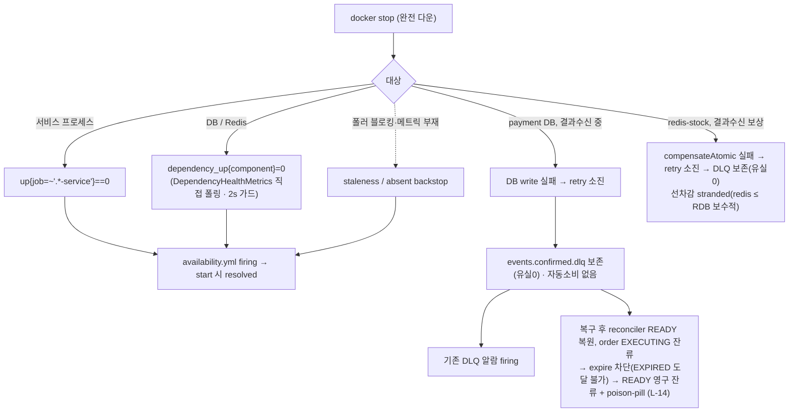

# FAULT-INJECTION-RESILIENCE 완료 브리핑

> 작업 기간: 2026-06-28(discuss) ~ 2026-06-30(ship) / 이슈·브랜치: #118

## 작업 요약

직전 토픽(ALERTING-RULES-AND-FAULT-DRILL)은 Kafka 지연 **1종**만 드릴로 검증했고, 서비스 프로세스·DB·Redis 가용성에는 **탐지 알람 자체가 없었다**. prometheus가 각 서비스를 scrape하지만 `up{job}` 규칙이 없어 프로세스 다운조차 안 보였고, docker stop으로 의존성만 죽이면 `up=1`이라 DB/Redis 다운은 어떤 신호로도 드러나지 않았다. 또한 그 장애에서 백스톱이 정합을 유지하는지(돈이 새지 않는지)가 미검증이었다.

이 토픽은 (1) 서비스/DB/Redis 가용성을 직접 신호화해 알람 사각을 메우고, (2) docker stop **완전 다운**에서의 실제 전이를 통합테스트 단정으로 고정해 "백스톱이 정합 유지"라는 거짓 양성을 차단하며, (3) 신규 복구 로직은 만들지 않고 위험을 드러내고 탐지하는 데까지를 범위로 했다(자동 복구는 TQ-1/TC-3 위임).

**가장 큰 수확은 검증 과정에서 나온 두 발견이다.** ① execute 중 implementer가 통합테스트를 GREEN으로 만들려고 결제 상태 전이 도메인(`resetToReady`)을 바꿨는데, domain-expert가 이를 "돈 새는 EXPIRED 종결을 막던 가드 제거"로 판정(critical)해 롤백했다 — 그 과정에서 **설계가 전제한 "IN_PROGRESS→READY→EXPIRED 2단 마스킹"이 실제 코드에선 발생하지 않음**(order EXECUTING 잔류로 `expire()` 차단 → READY 영구 잔류 + 만료 batch poison-pill)을 실측해 CONCERNS L-14로 등재했다. ② ship 라이브 드릴이 **stale jar 배포 갭**(bootJar 선행 없이 docker 기동 시 옛 jar COPY → 신규 게이지 빈 미생성 → 가용성 게이지 전무)과 **user-service `@EnableScheduling` 누락**(폴러 미실행 → 알람 영구 오발화)을 잡았다 — 둘 다 promtool·통합테스트로는 보이지 않는 배포 결함이었다.

## 핵심 설계 결정

| 결정 | 근거 | 기각된 대안 |
|---|---|---|
| 의존성 health를 **actuator 대신 직접 폴링 게이지**(DataSource·RedisConnectionFactory 직접 조회)로 노출 | payment redis 2팩토리(dedupe/stock)를 `redis-dedupe`/`redis-stock` 2컴포넌트로 분리해야 하는데 actuator composite는 단일 redis로 묶여 dead branch 유발 | actuator HealthContributorRegistry 브리지(composite 분리 불가) |
| **2s 타임아웃 가드**(VirtualThread executor + `Future.get`) | Hikari connectionTimeout(30s) 등 블로킹으로 폴러 직렬화 시 게이지 stale-UP false-negative 방지 | 무가드 직접 조회 |
| **staleness(`last_poll_timestamp`) + `absent()` backstop** 이중화 | 폴러 블로킹/스레드 사망(stale)과 메트릭 미등록·오타(absent)는 다른 축 — `==0`·`time()-x>N` 단독은 시리즈 부재 시 dead branch(PITFALLS §24) | DOWN 신호 단일 축 |
| no-divergence(redis ≤ RDB over-sell 0) 단정 **제외** | `resetToReady` 단독은 §18 발산 3전제 미충족이라 violation 불가능한 공허 단정. exactly-once는 기존 `PaymentEosIntegrationTest`가 가드 | 안전방향 회귀 가드로 포함(discuss안 — plan에서 번복) |
| 통합테스트 = **`@EmbeddedKafka` + 전용 MySQL + `@MockitoSpyBean doThrow`** | 공유 `withReuse(true)` 컨테이너 `stop()`/DataSource 단절은 Hikari 30s×5로 비결정적(flaky). DLQ 유실0은 시간 무관 단정 | 컨테이너 stop 재현 |
| **신규 복구 로직 없음** — 기존 거동 단정 고정만 | 가용성 토픽 범위. EXPIRED 재라우팅·재고 재동기는 TQ-1/TC-3 | 복구 로직 추가(스코프 위반) |

## 변경 범위

- **앱(관측 전용, 돈 경로 무접촉)**: payment/pg/product/user 각 `infrastructure/metrics/DependencyHealthMetrics.java`(폴링 게이지) + user `infrastructure/config/SchedulerConfig.java` 신설(`@EnableScheduling`) + 각 `application.yml` 설정값 + `EventType` 로그 enum.
- **관측**: `observability/prometheus/rules/availability.yml`(ServiceDown/DependencyDown/DependencyHealthStale) + `rules/tests/availability_test.yml`(9케이스).
- **드릴/가이드**: `scripts/smoke/alert-firing-availability.sh`(4시나리오 + promtool 격하 폴백) + `alert-rules-promtool.sh` 확장 + `docs/smoke/alert-firing-check.md` availability 절.
- **테스트**: payment `ConfirmedDbDownIntegrationTest`(DB다운 DLQ유실0 + 마스킹 가로질러 DLQ 생존), `RedisStockCompensationFailureIntegrationTest`(보상실패 DLQ유실0 + 선차감 stranded).
- **도메인**: **무변경** — Task 6 도메인 변경(`resetToReady`→order 복원)은 critical 판정으로 롤백, `PaymentOrder`/`PaymentEvent`는 main 대비 무변경(공백줄만).
- **문서**: CONCERNS L-14 등재, topic/PLAN 설계 전제 정정(EXPIRED 마스킹→expire 차단 READY 잔류), STACK/ARCHITECTURE 동기화.

## 다이어그램

## 코드 리뷰 요약

- **discuss 게이트(R3)**: domain-expert가 no-divergence 단정의 vacuous를 지적 → "안전방향 회귀 가드"로 격하·존치(plan에서 재검증 조건부).
- **plan 게이트(R2)**: reviewer **fail(critical 1)** — no-divergence를 PLAN이 거부된 "공허" 논거로 번복했는데 topic.md SoT 미갱신(자기모순). domain-expert는 제외 자체는 도메인상 타당 판정. → topic.md §98·§171·§184·§193 + 요약 브리핑 3곳을 "검증 포함→제외"로 reconcile, 번복 기록. 추가로 Task 6 베이스(@EmbeddedKafka)·absent 분기·EXPIRED 술어·redis-stock 단정·redis-dedupe fail-closed 정정. R2 통과.
- **execute 중 도메인 critical(롤백)**: Task 6 implementer가 스코프("기존 거동 고정") 밖 도메인 변경(`resetToReady`→order NOT_STARTED 복원, EXPIRED 종결 활성화)을 Rule 1로 처리 → domain-expert critical 판정(EXPIRED terminal + D7 가드가 TQ-1 복구 봉쇄 = 더 나쁨) → 롤백(`03067514`) + 통합테스트를 실제 거동(expire 차단·READY 잔류)으로 재작성 + 설계 전제 정정 + L-14 등재. Rule 2 에스컬레이션이었어야 함을 기록.
- **ship 코드 리뷰(R2)**: R1 reviewer **fail(critical 1)** — user `@EnableScheduling` 누락(폴러 미실행 → 알람 영구 오발화), 단위테스트가 `poll()` 직접 호출이라 미검출. domain-expert pass(minor 2: 재시도 경로 서술·L-14 blast radius). → user `SchedulerConfig` 신설(`56f9a6f9`) → R2 pass. minor는 문서 동기화에서 완화.
- **ship 라이브 드릴**: stale jar 배포 갭 발견(bootJar 선행 후 게이지 7개 전부 노출, user 포함 = `@EnableScheduling` 수정 실효성 입증). ServiceDown·DependencyDown{db}·DependencyDown{redis-dedupe} 라이브 firing/해소 실측. 연속 드릴의 redis 2종 미발화는 서비스 재기동 직후 폴러 안정화 + 60s 타임아웃 빠듯한 스크립트 artifact(단독 재현 시 firing) — 코드·규칙 정상.

## 수치

- **태스크**: 7 (① payment ② pg ③ product+user 게이지 → ④ availability.yml+promtool → ⑤ 드릴+런북 → ⑥ DB다운 통합테스트 → ⑦ redis-stock 보상실패 통합테스트)
- **테스트**: payment 단위 465 + 통합 42, pg 330, product 50, user 9 전체 통과(강제 재실행 확인). promtool availability 9케이스(전체 25케이스). spotbugsMain/Test·checkstyle 통과.
- **게이트 findings**: discuss R3 / plan R2(critical 1 reconcile) / execute 도메인 critical 1(롤백) / ship 코드리뷰 R2(critical 1 user scheduler · minor 4) / 라이브 드릴 갭 2(stale jar · redis artifact).
- **라이브 실증**: ServiceDown·DependencyDown{db,redis-dedupe} firing/해소, 게이지 7종 노출.
- **신규 함정 기록**: CONCERNS L-14(expire 차단 READY 영구 잔류 + 만료 batch poison-pill, L-10 정책 갭 실측).
