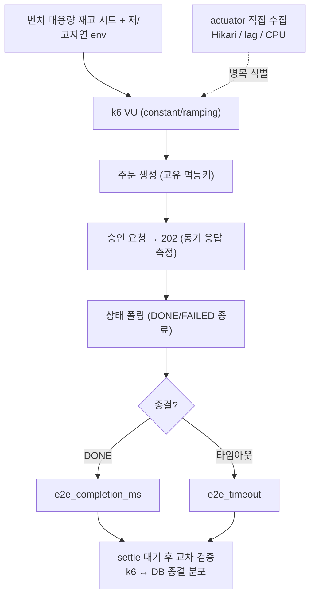

# K6-ASYNC-BENCHMARK 완료 브리핑

> 봉인: 2026-06-15 / 이슈·브랜치 #102

## 작업 요약

Phase 5(부하 측정) 진입 시점에 비동기 결제 경로(checkout → confirm 202 → status 폴링 DONE)를 측정할 k6 자산이 전무했다(과거 동기 vs 비동기 비교 스크립트는 전략 폐지로 삭제됨). baseline이 없으면 후속 측정 의존 작업(장애 주입·자원 정밀화)의 비교 기준이 빈다.

이에 (1) k6 측정 자산을 신규 작성하고, (2) Fake 벤더 지연을 저/고 2환경으로 주입해 "비동기 진입이 벤더 지연을 흡수하는가"를 검증했으며, (3) 사용자 요청으로 부하 sweep을 통한 **병목 분석 사이클**(식별 → 수치 진단 → 처방 → 재측정 개선)까지 진행했다.

결과: **비동기 흡수 가설 입증**(벤더 지연 5배 증가에도 confirm 동기 응답 p95 38→21ms 불변, e2e 완료만 582ms→1.62s 증가, 유실 0). 병목 분석에선 **동기 confirm 경로의 Hikari DB 풀 병목**(knee ~150 req/s)을 식별해 풀 30→60 처방으로 knee를 300까지 밀고 p95를 65~87% 개선했으며, **비동기 파이프라인 자체는 처리량 병목이 없음**(큐 모두 ≈0)을 확인했다. 다만 측정 과정에서 reconciler 과단축이 유발한 중복 events + DLT 토픽 suffix 갭으로 consumer가 블로킹되는 cascade를 발견하고 처방했다.

## 핵심 설계 결정

| 결정 | 근거 | 기각된 대안 |
|---|---|---|
| 전체 e2e 단일 시나리오 + 단계 태깅 | 사용자 경험 반영 + 부분 경로 지표 동시 확보 | confirm만 측정(사용자 경험 누락) |
| 벤더 지연 저/고 2환경(Fake latency env) | 비동기 강점은 저↔고 대비로만 드러남 | 단일 지연(대비 근거 약함) |
| k6 + DB 종결 카운트 교차 검증 | silent loss 탐지 | k6 메트릭만(유실 미탐지) |
| 측정 오염 차단(매 iteration 고유 멱등키 / 대용량 재고 시드 / baseline failRate=0 / 폴링 종료 DONE·FAILED) | 멱등키 충돌·재고 고갈·QUARANTINED 폴링 맹점이 측정을 무효화 | 무방비 측정(오염) |
| sweep은 constant-arrival-rate + actuator 직접 수집 | steady-state 병목 식별 + 관측성 풀스택 없이 메모리 절약 | ramping(knee 부정확) / Prometheus(메모리 부족) |

## 변경 범위

전부 측정 인프라/스크립트 — **Java 애플리케이션 코드 무변경**.

- **신규 측정 자산**: `scripts/k6/helpers.js`(메트릭·요청 헬퍼·constant/skip-poll·VU·부하곡선 env), `scripts/k6/async-payment.js`(e2e 시나리오), `scripts/k6/run-benchmark.sh`(저/고 2환경 오케스트레이션), `scripts/k6/verify-settlement.sh`(교차 검증), `scripts/k6/sweep.sh`(병목 분석 sweep), `scripts/bench-seed-stock.sh`(대용량 재고 시드)
- **신규 인프라**: `docker/docker-compose.benchmark.yml`(payment benchmark profile + JVM heap 상한 + 포트 노출 + Hikari/reconciler env, pg fake gateway 재사용)
- **문서**: 설계(CONTEXT)·플랜(PLAN)·측정 결과(REPORT) + `.gitignore`(results/)
- **영구 문서**: CONCERNS.md C-12(DLT suffix 갭) 등재

## 다이어그램 — 측정 플로우

## 코드 리뷰 요약

- **discuss 게이트**: R1 양쪽 revise(7 findings — 멱등키 충돌·재고 고갈·QUARANTINED 폴링 맹점·지연종결 settle·fake gateway 경로·폴링 타임아웃·폴링 종료 조건) → R2 reviewer pass + domain 잔여 minor 반영(settle scan 주기·QUARANTINED 인과·env 표기).
- **plan 게이트**: R1 양쪽 revise(8 findings — checkout 중복은 HTTP 200/201·재고 부족 400·confirm 동기 TX 후 202·reconciler scan 누락 등 코드 사실 오류) → R2 양쪽 pass.
- **ship 리뷰**: reviewer pass / domain-expert pass. critical·major 0건, **minor 3건 전부 스킵**(verify 단일케이스 vs 누적 DB 한계 — REPORT 명시 / 일부 스크립트 set -e 미사용 — 명시 검증으로 보완 / sweep DURATION s 접미사 가정 — 사용법 문서화). domain-expert가 측정 오염 차단·cascade 기록·DLT 갭을 코드 교차검증으로 확인, 도메인 부작용 없음.
- **실환경 디버깅 수정 6건**(측정 중): 컨테이너명 동적 탐색 / `{data:...}` 응답 래퍼 파싱 / JVM heap 상한·포트 노출(OOM) / k6 threshold 허용 / bench-seed 멱등 / VU·부하곡선 env화.

## 수치

- 태스크: 7개(Task 1~7) + 병목 분석 사이클 2개
- 커밋: 11
- 테스트: Java 무변경(test gate n/a)
- findings: discuss 7 + plan 8(전부 R2 전 해소) / ship critical 0·major 0·minor 3(스킵)
- 측정: 저/고 baseline(confirm 각 1889, checks 100%, 유실 0) + 동기 sweep(knee 150→300, p95 65~87%↓) + 비동기 sweep(파이프라인 큐 ≈0)

## 후속 과제 (다음 목표)

REPORT `§후속 과제` 참조:
1. payment scale-out 처리량 측정 — 비동기 수평 확장 입증(메모리·gateway·EOS transactional.id 멀티 검증 선행, 운영급 환경)
2. DLT 토픽 suffix 갭 버그 수정 — CONCERNS C-12 (consumer 블로킹 잠재)
3. status 폴링 → push 측정 개선 — 폴링 자가 부하 제거

## 환경 한계 (재현 시 인지)

로컬 Docker 7.65GB 단일 인스턴스에서 측정. baseline 100→200→400 req/s는 OOM으로 재현 불가 → JVM heap 상한 + gateway 우회 + 관측성 미기동 + peak 하향으로 안정화. **절대 TPS는 무의미, 상대 비교(처방 전후, 동기 vs 비동기)만 유효.** clean 재구성 시 docker profile은 `db/schema`만 적용해 user/product seed 수동 삽입 필요.
