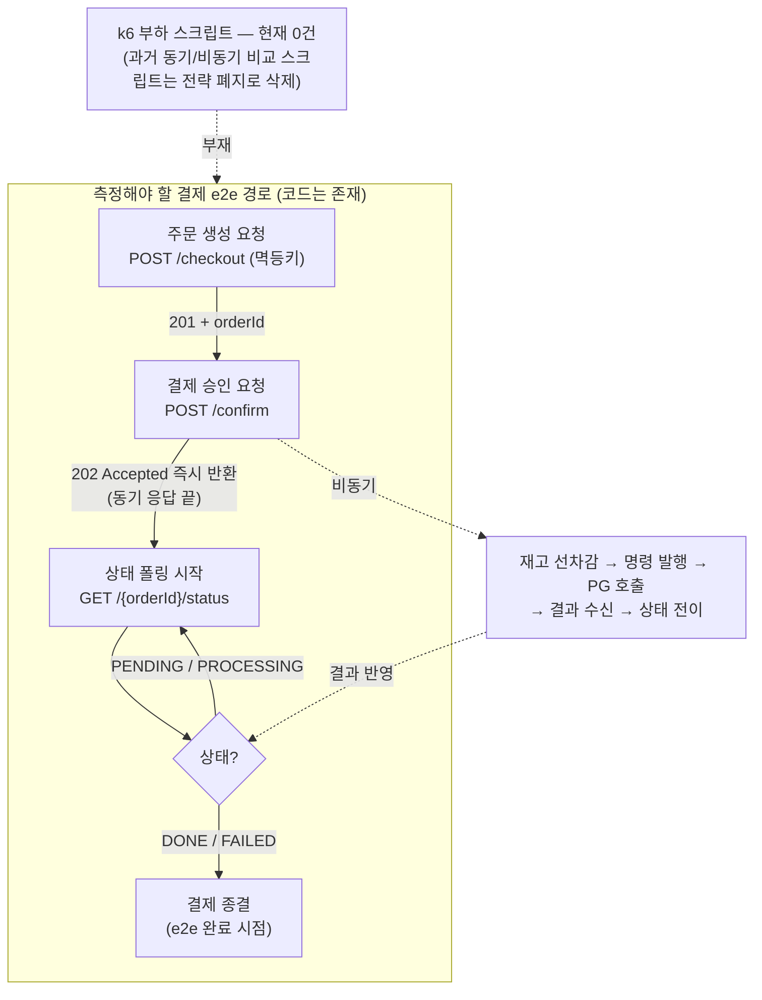
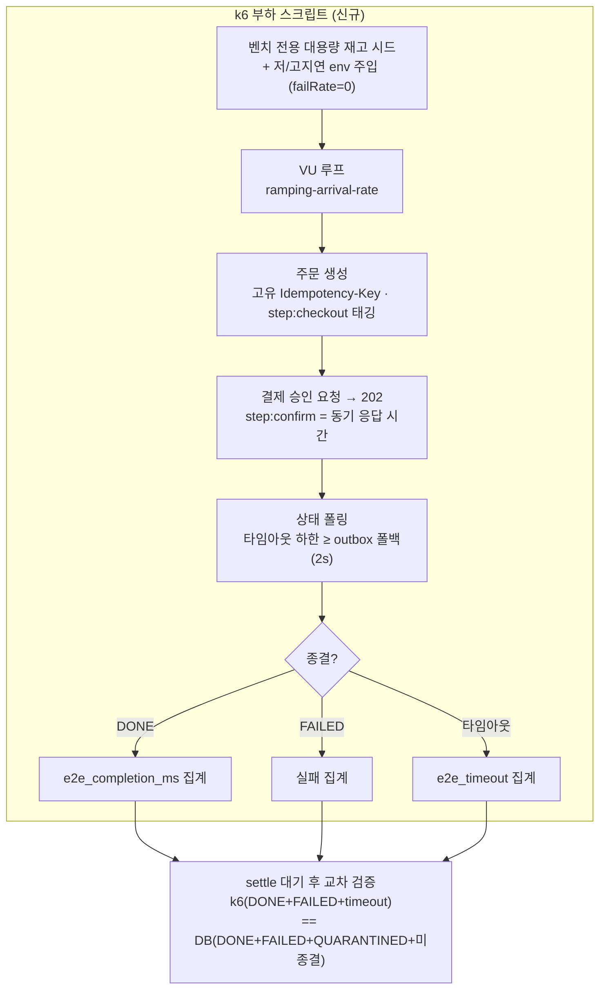

# K6 비동기 부하 측정 시나리오 재설계 설계

> 최종 수정: 2026-06-14

## 사전 브리핑

### 1. 현재 이해한 문제

비동기 단일 경로(결제 요청 → 비동기 승인 → 상태 폴링)의 부하 특성을 측정할 k6 스크립트가 현재 **0건**이다. 과거 스크립트(`scripts/k6/*.js`)는 동기 vs 비동기 전략 비교 시절 산출물로, 단일 비동기 경로로 전환되며 폐기됐다. 결과적으로 처리량(TPS)·지연(p95/p99)·실패율을 정량화할 baseline이 없어, 장애 주입(Toxiproxy)·자원 정밀화(워커 풀·채널 용량·재시도 정책) 같은 후속 측정 의존 작업의 비교 기준이 비어 있다.

### 2. 현재 시스템 동작 (측정 대상 경로, as-is)



### 3. 이번 discuss에서 결정하려는 것

- **측정 시나리오 범위**: 단일 e2e 시나리오 1개인가, 부분 경로(checkout만 / confirm만)도 분리 측정에 포함하는가
- **측정 지표 정의**: 동기 응답 시간(confirm 202까지) vs e2e 완료 시간(202 → status DONE) 구분, TPS·p95·p99·failure rate 산출 방법
- **부하 모델**: ramping-arrival-rate 단계(목표 RPS 곡선) + VU 할당 + status 폴링 간격/타임아웃 정책
- **벤더 지연 환경**: Fake PG 지연을 저지연/고지연으로 외부화할지, 단일 baseline만 둘지
- **산출물**: `scripts/k6` 신규 구조, 결과 JSON / Grafana testid 태깅, 실행 스크립트, 결과 기록 문서

### 4. 열린 질문 / 가정

- **paymentKey 확보 방법**: PG SDK 없이 confirm으로 진입하려면 Fake vendor 전제 paymentKey 생성/주입이 필요. 과거 스크립트 방식은 삭제돼 미확인 — 코드/벤치 profile에서 재확인 필요
- **실행 환경**: 로컬 docker compose `benchmark` profile, 단일 인스턴스 가정인지
- **checkout 의존**: checkout이 user/product 서비스 HTTP를 호출 — 이들이 측정 병목/잡음이 되는지, 측정 범위에서 격리할지
- **결과 기록처**: 과거 `BENCHMARK-REPORT.md`(archive)를 대체할 결과 문서 위치/형식

---

## 요약 브리핑

### 1. 결정된 접근

비동기 단일 경로(주문 생성 → 결제 승인 즉시 접수 → 상태 폴링 완료)를 k6 **단일 e2e 시나리오**로 측정한다. 한 VU가 checkout→confirm→status 폴링을 한 흐름으로 돌며 단계별 메트릭을 분리 태깅하고, Fake 벤더 응답 지연을 **저/고 2환경**으로 주입해 비동기 처리의 고지연 내성을 대비 측정한다. 측정 오염원(멱등키 충돌·재고 고갈·격리 폴링 맹점)을 전제로 차단하고, 부하 후 결제 종결 카운트를 k6 결과와 **교차 검증**해 조용한 유실을 검출한다.

### 2. 변경 후 동작 (to-be)



### 3. 핵심 결정 목록

- 측정 단위: 전체 e2e 단일 시나리오 + checkout/confirm/status 단계별 태깅
- 지표 분리: 동기 응답(confirm 202까지) / e2e 완료(DONE 폴링까지) / TPS / p95·p99 / 실패율
- 벤더 지연 저/고 2환경(fake latency env), baseline `FAKE_FAIL_RATE=0`
- 측정 오염 차단: 매 iteration 고유 멱등키 + 벤치 전용 대용량 재고 시드 + REJECTED≈0 assertion
- 폴링 종료 = DONE/FAILED, 타임아웃 하한 ≥ outbox 폴백(2s) + backoff 여유
- 검증: k6 ↔ DB 종결 카운트 교차식(QUARANTINED/지연종결 분해) + settle 대기 스냅샷
- 산출물: `scripts/k6/*` + `docker-compose.benchmark.yml` override + 토픽 결과 리포트

### 4. 트레이드오프 / 후속 작업

- 단일 인스턴스 baseline (멀티 인스턴스 EOS fencing 검증은 Phase 5 별도)
- 재고(redis-stock ↔ product RDB) 정합성 교차는 이번 범위 밖 (스냅샷 도구 필요)
- 부하 곡선 최종값·폴링 타임아웃·reconciler 단축값 구체화는 plan/execute에서 실측 보정
- 본 측정의 후속 입력: Toxiproxy 장애 주입(T4-A), 자원 정밀화(TC-15 워커 풀·채널 cap / TC-7 outbox retry / TC-6 bulkhead), 오토스케일러(T4-C)/CircuitBreaker(T4-D)

---

## 문제 정의

비동기 단일 경로의 부하 특성(처리량·지연·실패율)을 정량화할 k6 스크립트가 0건이다. baseline이 없으면 후속 측정 의존 작업(Toxiproxy 장애 주입, 워커 풀·채널 용량·재시도 정책 정밀화)의 비교 기준이 비어 있고, "비동기 전환이 고지연 환경에서 실제로 처리량을 유지하는가"라는 본 프로젝트의 핵심 가설을 수치로 보일 수 없다.

## 영향 범위

| 구분 | 대상 | 비고 |
|---|---|---|
| **신규** | `scripts/k6/helpers.js` | 공통 상수·메트릭 정의·요청 헬퍼 |
| **신규** | `scripts/k6/async-payment.js` | 단일 e2e 시나리오(checkout→confirm→status 폴링) |
| **신규** | `scripts/k6/run-benchmark.sh` | 저/고지연 2환경 순차 실행 + testid 태깅 + 결과 JSON 분리 |
| **신규** | 결과 리포트(토픽 산출물) | 측정 후 수치 기록, ship 시 archive 동행 |
| **신규** | `docker/docker-compose.benchmark.yml` override | payment `benchmark` profile + pg `gateway.type=fake` + 컨테이너 키 `PG_GATEWAY_FAKE_LATENCY_MIN_MILLIS/MAX_MILLIS`·`PG_GATEWAY_FAKE_FAIL_RATE`(host shim `FAKE_LATENCY_MIN/MAX`·`FAKE_FAIL_RATE`로 매핑 — smoke override `${FAKE_LATENCY_MIN:-20}` 패턴 동일) + settle 창 결정론화를 위한 `RECONCILER_IN_FLIGHT_TIMEOUT_SECONDS` + `RECONCILER_FIXED_DELAY_MS`(scan 주기) 단축 override. smoke와 분리(측정 의도 명확화) |
| **신규** | 벤치 전용 재고 시드 단계(`run-benchmark.sh` 내) | 측정 상품 stock을 부하 총량보다 크게 SET(redis-stock + product RDB). 단일 상품 qty=100으로는 부하 중 고갈 |
| **무관** | 애플리케이션 도메인/application/infra 코드 | 측정 전용. Fake latency는 이미 환경변수(`PG_GATEWAY_FAKE_LATENCY_*`)라 코드 변경 불필요 |

## 설계 옵션 비교

핵심 갈래는 discuss 인터뷰에서 확정됐다. 채택 근거만 요약한다.

- **측정 단위**: (A) 전체 e2e 한 흐름 + 단계 태깅 ⟵ 채택 / (B) confirm+status만 / (C) 세 경로 독립 시나리오. → A 채택: 실제 사용자 경험(주문→승인→완료) 반영 + 단계별 태깅으로 checkout 의존(user/product HTTP) 지연이 분리돼 비동기 confirm 지표가 격리됨.
- **벤더 지연**: (A) 저/고지연 2환경 ⟵ 채택 / (B) 고지연 단일 / (C) 지연 0. → A 채택: 비동기 경로의 강점(고지연에서도 VT 병렬로 처리량 유지)은 저↔고 대비로만 드러남.
- **e2e 완료 측정 방식**: (A) k6 VU가 confirm 202 직후 status를 폴링해 DONE까지의 wall-clock을 커스텀 Trend로 측정 ⟵ 채택 / (B) 서버 메트릭(outbox age 등)으로 간접 추정. → A 채택: 클라이언트 체감 완료 시간이 측정 목표.

## 결정 사항

| 항목 | 결정 | 이유 |
|---|---|---|
| 측정 단위 | 전체 e2e 단일 시나리오, checkout/confirm/status **단계별 태깅** | 사용자 경험 반영 + 부분 경로 지표 동시 확보 |
| 동기 응답 시간 | `http_req_duration{step:confirm}` — confirm HTTP 202 반환까지 | confirm은 재고 차감 + confirm TX까지 **동기 수행 후** 202 반환(외부 PG 호출만 비동기) — 동기 구간 latency 측정 |
| e2e 완료 시간 | 커스텀 Trend `e2e_completion_ms` — confirm 202 시각 ~ status **DONE** 폴링 성공 시각. DONE만 성공 Trend에 집계 | 클라이언트 체감 결제 완료 시간 |
| **checkout 멱등키** | k6 VU가 **매 iteration 고유 `Idempotency-Key`** 전송(예: `${VU}-${ITER}-${uuid}`) | 헤더 없으면 서버가 `hash(userId, productList)`로 키 생성 → 10s TTL 내 동일 키가 같은 orderId 재반환(`IdempotencyStoreRedisAdapter`)되어 winner 1건만 진짜 결제, 나머지 캐시 hit으로 측정 오염 |
| **측정 재고** | 벤치 전용 시드로 측정 상품 stock을 **부하 총량보다 크게** SET(redis-stock + product RDB 동시) | 시드 단일 상품 qty=100은 지속 부하 중반부터 고갈→REJECTED로 측정 무효화 |
| 처리량(TPS) | confirm 요청 Counter rate | 비동기 경로의 핵심 처리량 지표 |
| p95/p99 | 위 Trend들에 threshold 설정 | 꼬리 지연 가시화 |
| 실패율 | `checks` rate + e2e 폴링 타임아웃 Counter(`e2e_timeout`) | 미완료(영영 PROCESSING)를 실패로 명시 집계 |
| 부하 모델 | `ramping-arrival-rate` 목표 RPS 곡선. baseline은 과거값(100→200→400 req/s) 계승, **측정하며 조정**(plan/execute) | 로컬 Mac 단일 인스턴스 + Hikari 30 기준이라 실측 보정 전제 |
| status 폴링 | 종료 조건 = **DONE 또는 FAILED**(둘 다 terminal). 폴링 간격 + 최대 폴링 시간(타임아웃) 명시, **타임아웃 하한 = outbox 폴백 주기(2s) + pg 재시도 backoff 여유**. 타임아웃 시 `e2e_timeout` 집계 후 다음 iteration | DONE만 보면 FAILED가 불필요 폴링; 타임아웃 과소 설정 시 정상 완료가 미완료로 오집계(2s @Scheduled 폴백이 p99에 개입) |
| QUARANTINED 처리 | baseline `FAKE_FAIL_RATE=0`에서 **QUARANTINED 0 보장**(fake 경로엔 QUARANTINED 도달 수단 부재 — fail 주입은 FAILED를 만들고, CACHE_DOWN/AMOUNT_MISMATCH/DLQ 소진도 미발생). fail 주입 `testid`의 기대 종결 분포 = **FAILED**(폴링이 terminal로 정상 종결) | QUARANTINED는 status에서 PROCESSING으로 흡수(`PaymentStatusServiceImpl` default 분기)되어 폴링이 종결 못 잡고 `e2e_timeout`에 섞임 → baseline 오염 방지 |
| 벤더 지연 2환경 | pg fake `PG_GATEWAY_FAKE_LATENCY_MIN_MILLIS/MAX_MILLIS`(host shim `FAKE_LATENCY_MIN/MAX`)를 저지연(예 100/300)·고지연(예 800/1500) 2값으로 재기동, `testid`로 분리 | 저↔고 대비로 비동기 강점 입증. 기존 smoke override의 fake env 패턴 재사용 |
| paymentKey | k6에서 임의 문자열 생성 주입 | 첫 confirm은 저장 paymentKey가 null이라 대조 통과(`PaymentEvent:155`) |
| 실행 환경 | 로컬 docker compose, **`docker-compose.benchmark.yml` override 신설**(payment `benchmark` profile + pg `gateway.type=fake` + fake latency env), **단일 인스턴스** | smoke와 분리해 측정 의도 명확화. baseline은 단일 인스턴스 가정(멀티 인스턴스는 Phase 5 별도) |
| 산출물 | `scripts/k6/*` 신규 + 결과 리포트(토픽 산출물). 영구 문서·Grafana 패널 제외 | 결과 안정화 전까지 토픽 단위 생명주기 |
| 검증 | k6 메트릭 + 부하 후 DB 결제 종결 카운트 ↔ k6 카운트 **교차식 분해**(아래 검증 전략). settle 대기 후 스냅샷 | silent loss(조용한 유실) 탐지. 재고 정합성은 이번 범위 밖 |

## 장애 시나리오와 대응

| 시나리오 | 측정 영향 | 대응 |
|---|---|---|
| **checkout 멱등키 충돌** | 동일 키 캐시 hit → winner 1건만 진짜 결제, 나머지 오염 | 매 iteration 고유 `Idempotency-Key`. smoke run에서 checkout 응답 **status==201**(중복은 200, body에 isDuplicate 필드 없음) 비율 100% 확인 |
| **재고 고갈**(시드됐으나 부하 중 소진) | 중반부터 재고 부족 confirm → 후반 측정 무효 | 벤치 전용 대용량 재고 시드. 측정 중 재고 부족 confirm(**status==400**, `PaymentOrderedProductStockException`) 카운트 ≈ 0 assertion |
| redis-stock 미시드 | confirm REJECTED 폭증 → 측정 무효 | 측정 전 `scripts/seed-stock.sh` 선행 + smoke run 성공률 확인 |
| user/product 서비스 다운 | checkout 503 → 시나리오 진입 불가 | 측정 전 의존 서비스 헬스체크(`docs/smoke/infra-healthcheck.md`) |
| Kafka/consumer 미기동 | status가 영영 PROCESSING | 사전 의존성 체크 + `e2e_timeout`으로 미완료 가시화 |
| status 폴링 타임아웃 | 완료 못 잡음 | 타임아웃 하한 = outbox 폴백(2s) + backoff 여유. 초과 시 `e2e_timeout` 집계, 무한 루프 방지 |
| QUARANTINED 증가 | status가 PROCESSING으로 흡수 → `e2e_timeout`에 섞여 종결 카운트 불일치 | baseline `FAKE_FAIL_RATE=0`. 검증 교차식에 QUARANTINED 항 분리, DB 분포 함께 기록 |
| **지연 종결**(k6 timeout분이 Reconciler/OutboxWorker로 늦게 DONE) | 측정 직후 스냅샷 시 silent loss 오탐 | settle 대기 하한 = reconciler in-flight-timeout(기본 300s) + **scan 주기(기본 120s)** + relay/pg 여유 ≈ 7~8분. 벤치 override로 `RECONCILER_IN_FLIGHT_TIMEOUT_SECONDS` **와 `RECONCILER_FIXED_DELAY_MS`(scan 주기)를 함께** 낮춰야 settle 창이 결정론적으로 좁혀짐(timeout만 줄이면 scan 틱이 settle 창 좌우, 구체값 plan) |

## 검증 전략

1. **소규모 smoke run**(스크립트 자체 정합성 선확인):
   - 낮은 RPS로 폴링→DONE 정확성 확인
   - checkout 응답 status==201 비율 == 100% (중복 200 없음 → 멱등키 충돌 없음)
   - 측정 중 재고 부족 confirm(status==400) 카운트 ≈ 0 (재고 고갈 없음)
   - baseline `FAKE_FAIL_RATE=0`에서 성공률 100% (QUARANTINED 0)
2. **본 측정 후 교차 검증** (settle 대기 후 DB 스냅샷 1회 확정 — 기본값 기준 ~7~8분, 벤치 override로 reconciler in-flight-timeout 단축 시 그만큼 단축):

   ```
   k6(DONE) + k6(FAILED) + k6(e2e_timeout)
     == DB(DONE) + DB(FAILED) + DB(QUARANTINED) + DB(미종결)
   ```

   - `k6(DONE) == DB(DONE)`이 baseline 정상. 어긋나면 silent loss 또는 폴링 타임아웃 과다
   - `k6(e2e_timeout)` 중 settle 후 DB에서 DONE으로 종결된 분은 "지연 종결"(유실 아님), 남는 비종결분만 진짜 유실 후보로 트리아지
   - DB QUARANTINED 분포는 필수 기록 항목
3. **재현성**: 동일 조건 재실행으로 지표 분산 확인(단일 실행 결과 과신 방지).

## 제외 범위

- **Toxiproxy 장애 주입**(T4-A) — baseline 확보 후 별도 토픽
- **멀티 인스턴스 측정** — 단일 인스턴스 가정(Phase 5 멀티 인스턴스 별도)
- **재고(redis-stock ↔ product RDB) 정합성 교차 검증** — 이번 검증 범위 밖(스냅샷 도구 필요)
- **영구 벤치 가이드 문서 / Grafana 패널** — 결과 안정화 후 별도 판단
- **측정 결과 기반 자원 정밀화**(TC-15 워커 풀·채널 cap / TC-7 outbox retry / TC-6 bulkhead) — 본 측정의 후속 입력
- **오토스케일러(T4-C) / CircuitBreaker(T4-D)** — 별도 토픽
- **부하 곡선 최종값 확정** — 측정하며 조정(plan/execute 단계)

## 참고

- 측정 대상 엔드포인트: `PaymentController` (checkout/confirm/status)
- paymentKey 대조: `PaymentEvent.validateConfirmRequest` (`:155` — null이면 통과)
- Fake 벤더: `FakePgGatewayStrategy` (fail 주입=FAILED, latency env `PG_GATEWAY_FAKE_LATENCY_MIN_MILLIS/MAX_MILLIS`, `pg.gateway.type=fake`)
- 정합 스캐너: `PaymentReconciler` (`reconciler.in-flight-timeout-seconds` 기본 300s + `fixed-delay-ms` 120s)
- 비동기 경로 전모: `docs/context/PAYMENT-FLOW.md` / `docs/context/CONFIRM-FLOW.md`
- 과거 설계(폐지된 동기 vs 비동기 비교): `docs/archive/k6-benchmark/`

---

## 게이트 리뷰 처리 (R1)

R1에서 reviewer + domain-expert 모두 revise. 7 findings 전부 설계 반영.

| # | 출처 | 등급 | finding | 반영 |
|---|---|---|---|---|
| 1 | domain | major | checkout 멱등키 충돌(동일 키 캐시 hit으로 측정 오염) | 결정 사항 "checkout 멱등키" 행 + 장애/검증에 매 iteration 고유 키 + isDuplicate=false 100% assertion |
| 2 | domain | major | 재고 고갈(시드 qty=100, 부하 중 소진) | 결정 사항 "측정 재고" 행 + 영향 범위 벤치 전용 시드 + REJECTED≈0 assertion |
| 3 | domain | major | QUARANTINED 폴링 맹점(PROCESSING 흡수 → e2e_timeout 오분류) | 결정 사항 "QUARANTINED 처리" 행(baseline failRate=0) + 검증 교차식 QUARANTINED 항 분해 |
| 4 | domain | minor | 지연 종결(timeout분이 Reconciler로 늦게 DONE) | 장애 "지연 종결" 행 + 검증 settle 대기 ≥2분 후 스냅샷 |
| 5 | reviewer | major | 저/고지연 fake gateway 주입 경로 미결 | 결정 사항 "실행 환경"/벤더 지연 행 + 영향 범위에 `docker-compose.benchmark.yml` 신설 확정 |
| 6 | reviewer | major | 폴링 타임아웃이 outbox 폴백(2s) 미인지 시 오집계 | 결정 사항 "status 폴링" 행에 타임아웃 하한 = 폴백 2s + backoff 여유 명시 |
| 7 | reviewer | minor | 폴링 종료가 DONE만 명시(FAILED 누락) | 결정 사항 "status 폴링" 종료 조건 = DONE 또는 FAILED |

## 게이트 리뷰 처리 (R2)

R2: **reviewer pass**, domain-expert revise(잔여 major 1 + minor 1). 잔여는 설계 방향 변경이 아닌 수치·표기 정정이라 메인이 반영(2라운드 게이트 소진 후 처리).

| # | 출처 | 등급 | finding | 반영 |
|---|---|---|---|---|
| 8 | domain | major | settle 대기 "≥2분"이 reconciler 회수 하한(in-flight-timeout 300s + scan 120s ≈ 7~8분)과 어긋나 정상 지연분을 silent loss로 오탐 | 장애 "지연 종결" 행 + 검증 2단계: settle 하한 ~7~8분 명시 + 벤치 override로 `RECONCILER_IN_FLIGHT_TIMEOUT_SECONDS` 단축해 결정론화 |
| 9 | domain | minor | "fail 주입=QUARANTINED" 인과 오류(실제 fake fail 주입은 FAILED) | 결정 사항 "QUARANTINED 처리" 행: QUARANTINED 0 근거를 "fake 경로 도달 수단 부재 + CACHE_DOWN/AMOUNT_MISMATCH/DLQ 미발생"으로 정정, fail testid 기대 분포=FAILED |
| 10 | reviewer | minor | fake latency env 변수명 표기 3종 불일치(`_MILLIS` 누락 위험) | 영향 범위/결정 사항/참고 전반 `PG_GATEWAY_FAKE_LATENCY_MIN_MILLIS/MAX_MILLIS`(host shim `FAKE_LATENCY_MIN/MAX`)로 통일 |
