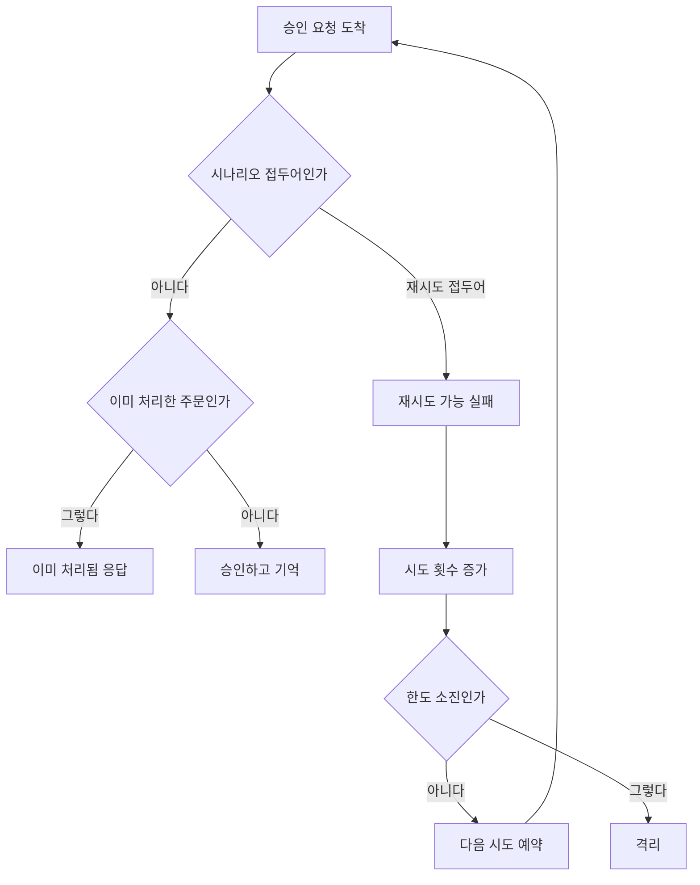
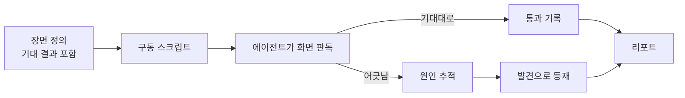

# 라이브 검증 체계 정식화 — 완료 브리핑

> 작업 기간: 2026-07-28 ~ 2026-07-29 · 이슈/브랜치 #128

## 작업 요약

결제 전 구간을 실제로 구동해 확인하는 일이 한 번의 이벤트로 끝나 있었다. 절차와 도구는 실측 전용 브랜치에만 있어 평소에는 발동하지 않았고, 다시 돌리려면 그 브랜치의 존재를 아는 사람이 이동부터 해야 했다. 산출물(리포트와 캡처 25MB)은 코드 이력에 함께 실려 있었다.

문제는 접근성만이 아니었다. 절차에 **기대 결과와 판정이 없었다.** 화면을 찍고 서술하는 데서 끝나니 결과물이 "잘 도는 것을 보여주는 기록"이지 "제대로 도는지 확인한 결과"가 아니었다. 직전 회차의 근거 두 곳이 로그 조회 화면과 터미널 수치였던 것도 같은 뿌리다 — 읽는 쪽에서 검증할 수 없는 근거였다.

그래서 두 가지를 했다. 자산을 main 계보로 옮겨 브랜치 이동 없이 발동하게 하고, 절차를 **장면마다 기대 결과를 먼저 정의하고 실제와 대조해 판정하는** 구조로 다시 썼다. 판정의 상당 부분은 화면을 읽어야 나오므로 — 패널이 비었는지, 숫자가 앞뒤로 맞는지 — 그 판독을 에이전트의 일로 명시하고, 결정적으로 확인 가능한 결제 구동만 스크립트로 묶었다.

그 체계로 검증을 수행해 여덟 장면을 통과시켰고, **그 과정에서 결함 네 건을 잡았다.** 검증이 실제로 작동한다는 증거이기도 하다.

## 핵심 설계 결정

| 결정 | 근거 | 기각된 대안과 이유 |
|---|---|---|
| 실측 자산을 main 계보로, 실측 브랜치는 폐기 | 브랜치를 찾아 이동해야 발동하는 절차는 체계가 아니다 | 브랜치 유지 — 산출물 격리는 무시 규칙으로 충분한데 절차까지 함께 갇힌다 |
| 리포트와 캡처 원본은 저장소에서 제외, 로컬 보관 | 캡처가 회차마다 수십 MB 씩 쌓인다. 리포트는 특정 시점의 기록이라 코드와 함께 진화할 이유가 없다 | **저장소에 함께 커밋** — 직전 회차에 이미 25MB가 쌓였고 반복할수록 커진다. **별도 저장소** — 저장소가 늘고 코드와 시점을 맞추는 부담이 생긴다 |
| 판정을 장면 정의 안에 둔다 | 기대와 실제가 같은 자리에 있어야 대조가 강제되고, 장면을 추가할 때 기대를 빼먹기 어렵다 | **별도 검증 체크리스트** — 장면과 따로 놀아 시간이 지나면 어긋난다 |
| 화면 판독은 에이전트가, 결제 구동만 스크립트 | 비어 있는 패널·어긋난 숫자·예상과 다른 상태는 캡처 파일이 생겼다는 사실만으로는 드러나지 않는다 | **자동 단언으로 코드화** — 화면 상태를 읽어야 하는 판정이 많아 옮기면 깨지기 쉽다. 이 판단이 이 체계가 단순 자동화와 갈리는 지점이다 |
| 캡처는 자동화하지 않고 실행 명령만 기록 | 화면이 특정 상태일 때 찍어야 해 대기 조건을 전부 코드로 박으면 깨진다 | 전면 자동화 — 재현성은 높지만 타이밍 처리 비용이 이득을 넘는다 |
| 중복 결제는 주문 생성 멱등키로 검증 | 승인 동시 재호출은 정상 차단인데도 재고 미회수 신호를 남긴다. 검증이 가짜 신호를 만들면 나중에 그 지표로 실제 사고를 판단할 때 뒤섞인다 | 승인 재호출 경로 — 위 이유로 배제하고 오탐 자체를 후속으로 등재 |
| 재고 경합은 전용 상품으로 | 선차감 캐시와 확정 재고는 기동 시 1회만 맞춰지고 이후 동기화가 없다. 앞선 장면이 소비한 상품을 쓰면 "정확히 100" 전제가 깨진다 | **실행 직전 재시드** — 사람이 기억해야 하는 단계라 순서가 바뀌면 깨진다 |
| 모의 벤더 오배포 위험은 문서화로 닫는다 | 부팅 차단 가드를 만들려면 어떤 환경을 정상으로 볼지 먼저 정해야 하고, 그것은 배포 환경 논의다 | 이번에 가드 구현 — 범위를 넘고, 위험 구조 자체는 이번에 생긴 것이 아니다 |

## 변경 범위

**결제대행 서비스 — 시나리오 장치**

| 영역 | 내용 |
|---|---|
| 변경 | 모의 벤더에 결제 키 접두어 분기 추가 — 확정 실패 / 재시도 소진 / 자가 회복. **중복 승인 판정보다 앞에** 배치 |
| 추가 | 단위 테스트 5건 — 세 접두어의 예외 종류, 주문별 카운터 독립, 자가 회복 횟수와 재시도 한도의 관계 고정 |

**결제 서비스 — 관측**

| 영역 | 내용 |
|---|---|
| 변경 | 발행 대기 분포 지표 등록을 순회 안에서 생성자로 이동. 대기 행이 0건일 때도 시계열이 존재해 "적체 없음"과 "계측 고장"이 구분된다 |
| 추가 | 단위 테스트 2건 — 대기 행 0건에서의 등록, 기존 기록 동작 유지 |

**관측 대시보드**

| 영역 | 내용 |
|---|---|
| 제거 | 결제대행 발행 재시도 분포 패널 — 쿼리가 찾는 이름이 실제 지표와 어긋나 처음부터 맞은 적이 없고, 그 지표도 앞선 작업에서 제거됨 |
| 추가 | 재고 선차감 미회수 누적 패널 — 코드에는 있었으나 화면이 없었다. **누적 원값**으로 노출(시간 창 증가율로 그리면 창을 지나면 0으로 보여 오판) |

**검증 체계**

| 영역 | 내용 |
|---|---|
| 이관 | 실측 스킬 일체와 캡처용 관측 override 를 main 계보로 |
| 재작성 | 스킬 본문을 검증 관점으로 — 목적, 기준 다섯, 화면 판독을 에이전트의 일로 명시 |
| 추가 | 기존 다섯 장면에 기대 결과와 판정 도입, 신규 장면 둘(재고 경합·중복 결제 차단), 구동 스크립트 2종 |
| 수정 | 재고 시드 스크립트 — 루프 안 `docker exec -i` 가 herestring 의 남은 줄을 먹어 첫 상품만 반영되던 버그 |
| 제외 | 리포트와 캡처 원본을 무시 규칙으로 저장소 밖에 |

**무관 (건드리지 않음)**: 결제 상태 전이 도메인, 재고 선차감·보상 로직, 승인 경로 전반, 실 벤더 연동 경로.

## 다이어그램

### 시나리오 분기가 중복 판정보다 앞에 있어야 하는 이유

분기를 중복 판정 뒤에 두면, 재시도로 돌아온 요청이 이미 처리됨으로 흡수돼 시도 횟수가 늘지 않고 격리까지 도달하지 못한다.

### 검증 흐름

## 검증 결과

여덟 장면 전부 통과. 캡처 42장.

| 장면 | 확인한 것 |
|---|---|
| 출발선 | 결제 0건, 지표 전부 0, 알람 없음 |
| 결제 성공 | 다섯 서비스와 메시지 왕복을 지나 완료, 추적 아홉 구간, 재고 확정 차감(화면) |
| 실패와 보상 | 실패 사유 표시, 잡아둔 재고 되돌림(로그 — 화면에 안 드러나는 것은 한계로 기록) |
| 재시도와 격리 | 시도 이력 5행, 마지막이 소진. 간격 6→16→58초. 알람 발화·통지·운영자 종결 |
| 자가 회복 | 격리 없이 완료, 추적이 두 갈래로 갈림(폴링 워커가 재시도의 뿌리) |
| 재고 경합 | 재고 100에 200건 동시 — 성공 100 / 거절 100 / 확정 재고 0 / 미회수 0. **과매도 0** |
| 중복 결제 차단 | 같은 밀리초 두 요청에 주문 하나 |
| 인프라 장애 | 캐시 35초 / 서비스 82초 / 브로커 151초 / DB 26초·폴러 71초 발화, 통지 도달, 복구 후 해소, 결제 재개 |

## 검증이 잡아낸 결함

| 발견 | 처리 |
|---|---|
| 재고 시드가 첫 상품만 캐시에 반영 — 루프 안 `docker exec -i` 가 남은 입력을 소비. 상품이 하나뿐인 동안 드러나지 않았다 | 수정 (`a5e409a2`) |
| 경합 집계가 재고 부족 거절(400)을 409로 찾아 100건을 "기타"로 흘림 | 수정 + 코드별 분포 출력 (`3f5888cb`) |
| 대시보드 패널이 없어진 지표를 참조 / 계측이 대기 행 없으면 등록조차 안 됨 | 수정 (`e354e3ba`, `76d16012`) |
| 동시 구동 스크립트가 요청 유실을 감지 못함 — 판정을 도구 출력에 맡기는 구조인데 도구가 "안 나간 것"과 "거절된 것"을 구분 못 함 | 수정 (`4db0fc8b`, 리뷰 finding) |

## 코드 리뷰 요약

ship 리뷰 1라운드 — reviewer revise(major 1 / minor 2), domain-expert pass(minor 2). critical 없음. **전건 채택**, 재리뷰 통과(새 결함 없음).

| finding | 처리 |
|---|---|
| [major] 동시 구동 스크립트가 요청 유실을 감지 못한다 | 결과 줄 수를 기대 건수와 대조, 어긋나면 "판정 근거로 쓸 수 없다" 경고 |
| [minor] 주문 생성 파싱 실패 시 안내 대신 파이썬 오류 | 다른 두 곳과 가드 패턴 통일 |
| [minor] 리뷰 처리 섹션 공란 | 작성으로 해소 |
| [minor] 재시드 선행 확인(진행 중 결제 없음) 누락 | 장면 정의에 절차 추가 |
| [minor] 자가 회복과 전역 실패율 병용 시 회복 회차가 다시 실패 | 병용 금지 규칙 명시 |

discuss 게이트에서도 실행 중 조용히 깨질 전제 다섯을 미리 막았다 — 자가 회복 횟수와 재시도 한도의 결합, 재고 경합의 동시성 증거, 경합 전용 상품, 미회수 패널의 누적 표기, 좀비 회수의 구조적 한계.

## 남긴 한계와 후속

**리포트에 한계로 명시한 것**
- 재고 되돌림은 캐시 안에서만 일어나 화면에 드러나지 않는다
- 시도 이력의 결과 열은 벤더 호출 실행 여부만 나타내며 회차별 실패 사유는 담지 않는다
- 중복 여부는 응답 본문이 아니라 상태 코드로만 드러난다
- 브로커가 하나뿐이라 코디네이터 관련 알람은 발화 조건이 만들어지지 않는다
- 좀비 회수는 모의 벤더가 처리 상태를 메모리에만 둬 "벤더는 승인했는데 우리 쪽만 죽은" 분기가 재현되지 않는다 — 이번 검증에서 다루지 않았다

**후속으로 등재** (`docs/context/TODOS.md` 섹션 E)
- 모의 벤더 로드 시 환경 조합 검사 가드
- 승인 동시 재호출이 남기는 가짜 재고 미회수 신호
- 주문 생성 응답에 중복 여부가 실리지 않음

**수용된 한계로 등재** (`docs/context/CONCERNS.md` L-18)
- 모의 벤더 오배포 위험 — 설정값이 잘못 배포되면 실제 승인 없이 결제가 완료된다. 이번에 만든 구조가 아니라 이미 운영 중이던 것

## 수치

| 항목 | 값 |
|---|---|
| 태스크 | 14개 |
| 커밋 | 26개 |
| 단위·통합 테스트 | 전체 통과 (캐시 없이 강제 재실행, 13분) |
| 린트 | checkstyle·spotbugs (main·test) 통과 |
| 신규 테스트 | 7건 (모의 벤더 5 / 계측 2) |
| 검증 장면 | 8개 전부 통과 |
| 캡처 | 42장 (저장소 밖) |
| 리뷰 findings | critical 0 / major 1 / minor 4 — 전건 채택 |
| 검증이 잡은 결함 | 4건 (전부 수정) |
