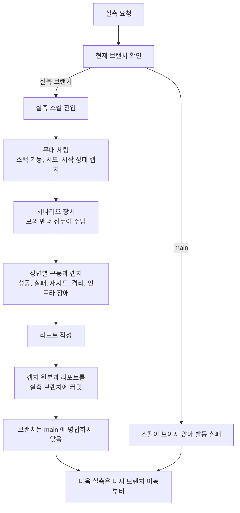
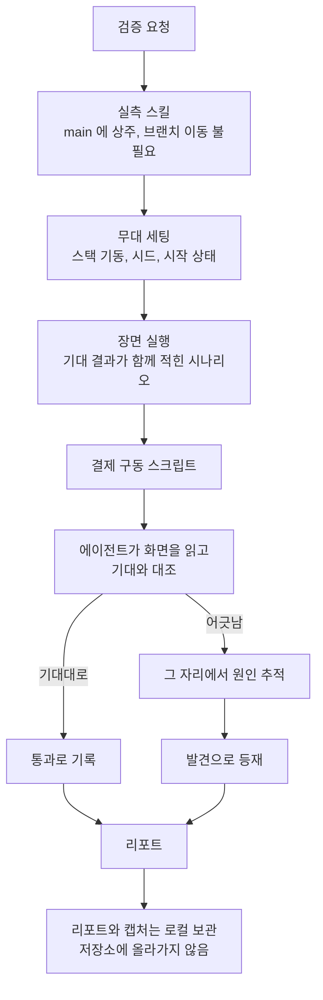

# 라이브 실측 체계 정식화 설계

> 최종 수정: 2026-07-28

## 사전 브리핑

### 현재 이해한 문제

결제 전 구간을 실제로 구동해 검증한 작업이 **일회성 이벤트로 끝났다.** 절차와 도구는 실측 전용 브랜치에만 있어 평소 작업 중에는 보이지 않고, 산출물(리포트와 캡처 원본 25MB)이 코드 이력에 함께 실려 있다. 다시 돌리려면 그 브랜치의 존재를 아는 사람이 이동부터 해야 한다.

동시에, 1차 실측이 남긴 리포트는 근거 두 곳이 **개발자가 뒤져 찾은 것**이었다. 그 지적이 관리자 화면 확충으로 이어져 이제 운영자 화면으로 대체할 수 있게 됐다.

### 현재 동작 (as-is)

### 이번 discuss 에서 결정하려는 것

- main 에 무엇을 올리고 무엇을 뺄지 — 실측 절차와 도구, 모의 벤더 시나리오, 계획 문서는 올리고 리포트와 캡처 원본은 제외
- 실측 산출물(리포트, 캡처)을 앞으로 어디에 어떻게 둘지
- 실측 스킬을 어떤 관점으로 다시 쓸지 — 손이 가는 일을 대신하는 도구가 아니라, **제품이 실제로 동작하는지 검증하는 체계**로
- 계획 문서와 재개 문서를 어떤 형태로 재작성할지 — 1차 계획은 이미 끝났고 재개 메모는 낡았다
- 2차 실측의 범위 — 교체할 장면, 새로 넣을 장면, 손대지 않을 장면

### 대화에서 이미 정해진 것

| 항목 | 결정 |
|---|---|
| 실측 브랜치 | 폐기. 자산은 main 으로, 리포트와 캡처는 git 밖으로 |
| 리포트 개편 범위 | 개선 루프를 별도 섹션으로 세운다 (측정이 제품을 바꾼 과정) |
| 죽은 대시보드 패널 | 원인 규명 완료(아래 참조). pg 쪽은 패널 삭제, payment 쪽은 계측 등록 시점 수정 |
| 재현 범위 | 결제 구동은 스크립트로, 캡처는 직접 찍되 실행 명령을 순서대로 기록 |
| 부하 측정 | 이번 범위에서 제외 |

이 작업이 만족해야 할 세 목적과 그로부터 나온 기준은 아래 「검증 체계의 기준」에 정리했다.

### 열린 질문 해소 (2026-07-28)

| 질문 | 결정 |
|---|---|
| 1차 캡처를 개선 전 근거로 남길지 | **폐기한다.** 1차에서 얻은 교훈만 기준으로 삼고, 리포트는 새 실측만으로 처음부터 구성한다 |
| 모의 벤더 시나리오 접두어를 main 에 둘지 | **둔다.** `pg.gateway.type=fake` 일 때만 로드되는 클래스라 실제 벤더 경로에 영향이 없다 |
| 실측 산출물 보관 | **로컬 보관으로 우선 간다.** 외부 공개 경로는 필요해지면 그때 정한다 |

이 결정으로 리포트의 개선 루프 서사는 **캡처 대비가 아니라 서술**로 다룬다. 화면 두 벌을 나란히 놓는 대신, 각 장면에서 "이 근거를 화면으로 볼 수 있게 되기까지 무엇이 있었나"를 글로 남기고 현재 화면만 보인다. 리포트가 1차와 2차로 갈리지 않고 하나의 완결된 기록이 된다.

## 요약 브리핑

### 결정된 접근

결제 전 구간을 실제로 구동해 확인하는 일을, 브랜치에 갇힌 일회성 이벤트에서 **main 에 상주하는 검증 체계**로 옮긴다. 절차와 도구는 main 으로 가고, 리포트와 캡처 원본은 저장소 밖 로컬에 남는다.

핵심은 성격의 전환이다. 지금은 화면을 찍고 서술하는 데서 끝나 "잘 돌아가는 것을 보여주는 기록"이 된다. 앞으로는 **장면마다 기대 결과를 먼저 적고 실제와 대조해 판정한다.** 그 판정의 상당 부분은 화면을 읽어야 나오므로 — 패널이 비었는지, 숫자가 앞뒤로 맞는지 — 에이전트가 맡고, 결정적으로 확인 가능한 구동만 스크립트가 맡는다.

### 변경 후 동작 (to-be)

### 핵심 결정

- 실측 자산은 main 으로, 실측 브랜치는 폐기. 리포트와 캡처는 저장소에서 제외하고 무시 규칙으로 재발을 막는다
- 1차 산출물은 폐기하고 교훈만 남긴다. 리포트는 새 실측만으로 처음부터 구성한다
- 판정은 장면 정의 안에 둔다 — 기대와 실제가 갈라지지 않게
- 검증 시나리오에 재고 경합과 중복 결제 차단을 더한다. 재고 경합은 성공 건수 하나가 아니라 네 가지로 판정한다
- 중복 결제는 주문 생성 멱등키로 검증한다. 승인 동시 재호출 경로는 정상 차단인데도 재고 누수 신호를 남겨 쓰지 않는다
- 관측 대시보드 빈 패널 둘을 이번에 처리한다 — 하나는 삭제, 하나는 계측 등록 시점 수정

### 트레이드오프와 후속

- **캡처 자동화를 포기했다.** 화면 상태 대기 조건을 전부 코드로 박으면 깨지기 쉬워, 실행한 캡처 명령을 기록하는 선에서 재현 경로만 남긴다
- **리포트를 남에게 보여줄 경로가 없다.** 로컬 보관으로 우선 가고 필요해지면 그때 정한다
- **모의 벤더 오배포 위험은 문서화로만 닫는다.** 부팅 차단 가드는 어떤 환경을 정상으로 볼지 정해야 해서 후속으로 뺀다
- 승인 동시 재호출이 남기는 가짜 누수 신호는 별도 후속으로 등재한다

---

## 문제 정의

두 가지가 겹쳐 있다.

**체계가 없다.** 결제 전 구간을 실제로 구동해 검증한 일이 한 번의 이벤트로 끝났다. 절차와 도구가 실측 전용 브랜치에만 있어 평소에는 보이지 않고, 산출물이 코드 이력에 섞여 있다. 다시 돌리려면 그 브랜치를 아는 사람이 이동부터 해야 한다.

**검증이 아니다.** 현재 절차는 화면을 찍고 서술하는 데서 끝난다. 장면마다 무엇을 기대하는지가 적혀 있지 않고, 실제가 기대와 달랐는지 판정하는 단계가 없다. 결함을 만나면 그때그때 상의하라고만 돼 있다. 결과물이 "잘 돌아가는 것을 보여주는 기록"이지 "제대로 도는지 확인한 결과"가 아니다.

## 영향 범위

| 구분 | 대상 |
|---|---|
| 이관 (실측 브랜치 → main) | 실측 스킬 일체, 모의 벤더 시나리오 접두어, 캡처용 관측 도구 설정 |
| 개편 | 스킬 서술 전반 — 검증 관점으로 재작성, 기대 결과와 판정 도입 |
| 신규 | 결제 구동 스크립트, 캡처 명령 기록, 무시 규칙(리포트와 캡처 원본), 모의 벤더 접두어 단위 테스트 |
| 수정 | 관측 대시보드 빈 패널 2건 — pg 쪽 패널 삭제, payment 쪽 계측 등록 시점 수정 |
| 문서 등재 | 모의 벤더 오배포 위험(`CONCERNS`), 부팅 차단 가드와 승인 재호출 오탐(`TODOS`) |
| 폐기 | 실측 전용 브랜치, 1차 계획 문서와 재개 메모, 1차 캡처와 리포트 |
| 무관 | 결제 상태 전이, 재고 선차감과 보상, 승인 경로 전반. 실제 벤더 연동 경로 |

모의 벤더 시나리오 접두어는 `pg.gateway.type` 이 `fake` 일 때만 로드되는 클래스에 들어간다. 실제 벤더를 쓰는 구동에서는 빈 자체가 등록되지 않아 승인 경로에 영향이 없다. **다만 그 조건은 설정값 하나에 걸려 있다** — 아래 잔여 위험 참조.

### 모의 벤더의 잔여 위험 — 이번에 처음 문서화한다

빈 등록 조건은 코드 실수를 막지, **설정 오배포를 막지 못한다.** `pg.gateway.type` 이 잘못 배포되면 모의 벤더가 로드되고, 이 전략은 벤더 종류를 가리지 않고 모두 받아들이므로(`FakePgGatewayStrategy.supports()`) **실제 승인 없이 결제가 완료되고 재고가 확정 차감된다.** 구체적으로는 `pg-service/src/main/resources/application-docker.yml` 의 `pg.gateway.type: ${PG_GATEWAY_TYPE:toss}` 가 환경변수로 덮이는 구조라, 스모크 구동용 값이 배포 파이프라인에 남으면 그대로 적용된다. 탐지 수단은 부팅 시 경고 로그 하나뿐이다.

**이 위험은 이번에 새로 생기는 것이 아니다.** 모의 벤더 전략 자체는 이미 main 에 있고 스모크 구동이 활성화해 쓴다. 이번 작업이 옮기는 것은 시나리오 접두어 세 개뿐이며, 오배포 시 무조건 승인되는 구조는 이미 상시 노출돼 있다. 다만 지금까지 어느 문서에도 수용된 한계로 적히지 않았다.

그래서 이번에 `docs/context/CONCERNS.md` 에 등재한다 — 환경변수 오배포 경로와, 이 코드가 이번에 만든 것이 아니라 이미 운영 중이라는 사실을 함께 적어 우선순위 판단을 흐리지 않는다. 부팅 시 환경 조합을 검사해 차단하는 가드는 후속으로 등재한다(`docs/context/TODOS.md`) — 어떤 환경을 정상으로 볼지 먼저 정해야 하고, 그것은 배포 환경 논의라 이 작업의 범위를 넘는다.

## 검증 체계의 기준

이 체계는 세 가지를 동시에 만족해야 한다. 하나만 채우면 나머지가 무너진다.

| 목적 | 이 목적이 요구하는 것 |
|---|---|
| **이해** — 만든 것을 스스로 설명할 수 있게 | 무엇이 일어나는지에 더해 왜 그렇게 설계했는지 |
| **보여주기** — 직접 한 과정을 드러내기 | 결과 스냅샷이 아니라 판단과 시행착오의 기록 |
| **반복** — 다시 돌릴 수 있는 검증 | 같은 장면을 재현할 수 있을 것 |

여기서 나온 기준 다섯이 매 실측에 적용된다. 특정 회차의 계획이 아니라 체계의 규칙이므로 스킬에 싣는다.

1. **화면이 말하게 한다** — 모든 주장에 그 주장을 보여주는 캡처가 붙는다. 못 붙이면 "여기는 볼 수단이 없다"고 적는다
2. **운영자 화면이 우선** — 로그, 터미널, DB 조회는 화면으로 안 될 때만 쓴다. 쓰게 되면 그 자체를 관측 공백으로 기록한다
3. **결과가 아니라 판단을 남긴다** — 무엇을 봤나에 더해, 왜 그렇게 했고 무엇이 어긋났나
4. **다시 돌릴 수 있다** — 같은 장면을 명령으로 재현할 수 있고, 리포트에서 그 경로를 가리킨다
5. **못한 것을 적는다** — 한계를 감추면 나머지 근거의 신뢰도까지 떨어진다

1차 실측이 이 기준에 못 미친 지점이 이번 작업의 출발점이다. 재시도 경과는 로그 조회 화면으로, 재고 변화는 터미널 수치를 옮겨 적어 보여줬다 — 기준 1과 2 위반이고, 읽는 사람이 검증할 수 없는 근거였다.

## 설계 옵션 비교

### 실측 산출물을 어디에 둘 것인가

| 방식 | 장점 | 단점 |
|---|---|---|
| **로컬 보관** (채택) | 코드 이력이 깨끗하다. 캡처가 수십 MB 씩 쌓여도 저장소가 커지지 않는다 | 남에게 보여주려면 별도 경로가 필요하다 |
| 저장소에 함께 커밋 | 리포트와 캡처가 코드와 같은 곳에 있다 | 1차에서 이미 25MB 가 쌓였다. 실측을 반복할수록 커진다. 리포트는 특정 시점의 기록이라 코드와 함께 진화할 이유가 없다 |
| 별도 저장소 | 이력이 남고 공유가 쉽다 | 저장소가 하나 늘고, 코드와 리포트의 시점을 맞추는 부담이 생긴다 |

외부 공개 경로는 필요해질 때 정한다 — 지금 정하면 쓰지도 않을 구조를 미리 만드는 셈이다.

### 검증 판정을 어디에 둘 것인가

| 방식 | 장점 | 단점 |
|---|---|---|
| **장면 정의에 기대 결과를 함께 적는다** (채택) | 기대와 실제가 같은 자리에 있어 대조가 강제된다. 장면을 추가할 때 기대를 빼먹기 어렵다 | 장면 정의가 길어진다 |
| 별도 검증 체크리스트 | 판정 항목을 한눈에 본다 | 장면과 체크리스트가 따로 놀아 시간이 지나면 어긋난다 |
| 자동 단언(assertion)으로 코드화 | 사람 손이 없어도 판정된다 | 화면 상태를 읽어야 하는 판정이 많아 코드로 옮기기 어렵고, 옮기면 깨지기 쉽다 |

세 번째를 택하지 않은 이유가 이 작업의 성격을 드러낸다. **판정의 상당 부분은 화면을 읽어야 나온다** — 패널이 비어 있는지, 숫자가 앞뒤로 맞는지, 상태가 예상한 단계인지. 이번 준비 과정에서 죽은 대시보드 패널을 찾아낸 것도 캡처 이미지를 읽어서였다. 이 판단을 에이전트가 맡고, 결정적으로 확인 가능한 것만 스크립트가 맡는다.

## 결정 사항

| 항목 | 결정 | 이유 |
|---|---|---|
| 실측 자산 위치 | main | 브랜치를 찾아 이동해야 발동하는 절차는 체계가 아니다 |
| 실측 브랜치 | 폐기 | 자산을 main 으로 옮기면 남을 이유가 없다 |
| 리포트와 캡처 원본 | 저장소에서 제외, 로컬 보관 | 코드 이력을 무겁게 하지 않는다. 무시 규칙으로 재발 방지 |
| 1차 산출물 | 폐기 | 교훈만 기준으로 남기고 리포트는 새 실측만으로 구성한다 |
| 스킬 성격 | 검증 체계로 재작성 | 기대 결과와 판정이 없으면 "보여주기"에 머문다 |
| 판정 위치 | 장면 정의 안 | 기대와 실제가 갈라지지 않게 한다 |
| 화면 판독 | 에이전트가 수행 | 비어 있는 패널, 어긋난 숫자, 예상과 다른 상태는 스크립트로 잡히지 않는다 |
| 결제 구동 | 스크립트화 | 결정적으로 재현 가능한 부분은 사람 손을 뺀다 |
| 캡처 | 에이전트가 수행, 실행 명령을 기록 | 화면이 특정 상태일 때 찍어야 해 전면 자동화는 깨지기 쉽다. 명령 기록으로 재현 경로만 남긴다 |
| 모의 벤더 접두어 | main 에 포함하되 단위 테스트를 함께 추가 | 모의 벤더 모드에서만 로드되어 승인 경로에 영향이 없다. 다만 접두어 분기와 자가 회복 횟수 경계가 라이브로만 검증되면, 인접 변경으로 조용히 깨진 채 실측이 진행되고 리포트가 틀린 장면을 정상으로 기록한다 |
| 모의 벤더 오배포 위험 | 수용된 한계로 등재, 부팅 차단은 후속 | 빈 등록 조건은 설정 오배포를 막지 못한다. 가드 설계는 배포 환경 논의라 범위를 넘는다 |
| 중복 결제 검증 경로 | 주문 생성 멱등키 재사용 | 승인 재호출은 정상 차단인데도 재고 누수 신호를 남긴다 (아래 참조) |
| 관측 대시보드 빈 패널 | 이번 작업에 포함 | pg 쪽은 삭제, payment 쪽은 계측 등록 시점 수정. 후자는 승인 적체의 조기 관측 채널이라 비워둘 수 없다 |
| 1차 계획 문서와 재개 메모 | 폐기, 알맹이는 스킬로 흡수 | 절차는 스킬이 정본이다. 문서가 둘이면 어긋난다 |
| 실측 기준 5개 | 스킬로 이전 | 매 실측에 적용되는 원칙이므로 특정 회차 문서에 둘 것이 아니다 |

## 새로 넣는 검증 시나리오

기존 장면(성공, 실패와 보상, 재시도와 격리, 자가 회복, 인프라 장애)에 두 가지를 더한다. 둘 다 **결과가 숫자로 떨어져 판정이 명확한** 시나리오다.

### 재고 경합 — 동시에 몰려도 과매도가 없는가

재고 100 인 상품에 동시 200 건의 승인을 넣는다.

판정은 성공 건수 하나로 하지 않는다. **확정 단계에서 실패한 요청은 선차감한 재고를 되돌리지 않는 것이 이 시스템의 의도된 정책**이라(과매도 0 을 위해 감수한 트레이드오프), 성공도 거절도 아닌 요청이 생기면 재고 한 칸이 판매 불가로 묶인다. 200 건 동시 요청은 정확히 그 경계를 때린다.

| 확인 | 기대 |
|---|---|
| 성공 건수 | 정확히 100 |
| 성공 + 거절 합계 | 200 — 어느 쪽에도 안 잡힌 요청이 있으면 그 자체가 발견 |
| 상품 서비스 DB 확정 재고 | 0 — 응답 카운트가 아니라 정본 기준 |
| 재고 미회수 지표 | 0 — 0 이 아니면 묶인 재고가 있다는 뜻이고, 그것도 유효한 발견 |

### 중복 결제 차단 — 같은 요청을 두 번 보내면

**주문 생성 단계의 멱등키 재사용**으로 검증한다. 같은 키로 두 번 요청해 주문이 하나만 생기는 것을 관리자 목록에서 확인한다.

**승인 재호출 경로는 쓰지 않는다.** 같은 주문으로 승인을 **순차로** 다시 보내면 이미 처리된 건으로 흡수되어 조용히 끝난다. 문제는 **동시에** 보낼 때다. 둘 다 흡수 판정을 통과한 뒤 각자 발행 행을 만들려 하고, 주문번호에 걸린 유니크 제약(`PaymentOutboxEntity.java:42`)에 진 쪽이 예외를 맞는다. 그 예외를 받는 코드가 원인을 구분하지 않고(`OutboxAsyncConfirmService.java:97` — `catch (RuntimeException)`) **재고 미회수 신호**를 기록한다(`stockRetentionMetrics.record()` + `STOCK_RETENTION_UNRECOVERED`).

이긴 쪽이 정상 처리돼 실제 누수는 없는데도 누수 경보가 남는 것이다. 검증 목적으로 이 경로를 돌리면 리포트에 해명이 필요한 가짜 신호가 생기고, 나중에 이 지표로 실제 사고를 판단할 때 드릴 잔재와 뒤섞인다.

이 오탐 자체는 **이번 작업에서 발견한 사안**으로 `docs/context/TODOS.md` 에 등재한다 — 그 catch 는 원래 "확정 실패 시 재고를 되돌리지 않는다"는 정책을 가시화하려는 것인데, 중복 차단으로 진 요청까지 같은 신호로 묶어 관측의 정확성을 떨어뜨린다.

## 관측 대시보드 빈 패널 — 원인과 처방

실측 준비 중 대시보드에서 데이터가 나오지 않는 패널 둘을 발견했다. 재시도가 실제로 도는 순간에도 비어 있었다. 원인은 서로 다르다.

| 패널 | 원인 | 처방 |
|---|---|---|
| `pg_outbox.attempt_count 분포` | 패널 쿼리가 `pg_outbox_attempt_count_bucket` 을 찾는데 실제 지표 이름은 `..._histogram_bucket` 이었다. 이름이 어긋나 처음부터 맞은 적이 없고, 그 지표는 죽은 컬럼을 읽던 것이라 2026-07-28 제거됐다 | 패널 삭제. 되살릴 대상이 없다 |
| `payment_outbox.attempt_count 분포` | `PaymentOutboxMetrics.recordAttemptHistogram()` 이 대기 중인 발행 행을 순회하며 그 안에서만 분포 지표를 등록한다. 행이 하나도 없으면 등록 자체가 일어나지 않아 시계열이 존재하지 않는다 | 등록을 생성자로 옮겨 1회 수행. 기록은 지금처럼 순회에서 |

payment 쪽을 삭제하지 않는 이유가 있다. 이 패널은 **승인 발행이 밀려 적체됐을 때 그것을 알려주는 통로**다. 지금 구조에서는 "적체가 없어 비어 있다"와 "계측이 죽어 비어 있다"가 화면에서 같아 보인다. 등록을 미리 해두면 적체가 없을 때 0 으로 보이고, 그때 비로소 패널이 신호 역할을 한다.

수정 대상을 `PaymentOutboxMetrics` 로 못박아 둔다 — 같은 패키지에 이름이 비슷한 `OutboxPendingAgeMetrics` 가 있으나 어디서도 호출되지 않고 대시보드에도 걸려 있지 않은 별개 클래스다.

## 검증 전략

이 작업 자체의 완료 판정이다.

| 확인할 것 | 방법 |
|---|---|
| 실측 스킬이 main 에서 발동한다 | 브랜치 이동 없이 스킬 목록에 잡히는지 |
| 리포트와 캡처 원본이 저장소에 올라가지 않는다 | 실측 후 `git status` 에 잡히지 않는지 |
| 실측 브랜치가 사라져도 잃는 자산이 없다 | 삭제 **전에** 브랜치 트리와 (main + 로컬 보관) 을 파일 단위로 대조 |
| 각 장면에 기대 결과가 있고 판정이 남는다 | 스킬의 장면 정의와 리포트 양쪽 |
| 개발자만 볼 수 있는 근거가 남지 않는다 | 리포트 전수. 남으면 한계로 명시됐는지 |
| 결제 구동을 다시 돌릴 수 있다 | 스크립트 재실행 |
| 모의 벤더 접두어가 의도대로 분기한다 | 신규 단위 테스트 — 세 접두어의 예외 종류와 자가 회복 횟수 경계 |

모의 벤더 접두어는 실측 브랜치를 main 위로 재배치한 시점에 컴파일을 확인했다. **main 자체에는 아직 반영되지 않았으므로**, 이관 시 컴파일과 전체 테스트로 다시 확인한다.

관측 대시보드 수정은 payment 서비스 계측 코드에 손을 대므로, 그 변경은 코드 리뷰에서 도메인 관점 검토를 함께 받는다.

## 제외 범위

| 제외 | 이유 |
|---|---|
| 부하 측정 | 목적이 생겼을 때 별도로 한다. 지금 넣으면 측정 환경 논의가 이 작업을 삼킨다 |
| 캡처까지 포함한 전면 자동화 | 화면 상태 대기 조건을 전부 코드로 박아야 해 깨지기 쉽다. 재현 경로를 남기는 선까지만 |
| 리포트 외부 공개 경로 | 로컬 보관으로 우선 가고, 필요해지면 그때 정한다 |
| 결제 취소와 만료 시나리오 | 취소는 공개 API 가 없고, 만료는 대기 시간 대비 얻는 것이 적다 |
| 승인 재호출로 중복 차단 검증 | 정상 차단인데도 재고 누수 신호를 남긴다. 오탐 자체는 후속으로 등재 |
| 모의 벤더 오배포 부팅 차단 가드 | 어떤 환경을 정상으로 볼지 먼저 정해야 한다. 배포 환경 논의라 범위 밖 |

### 실측 중 판단 (제외가 아님)

| 항목 | 판단 시점 |
|---|---|
| 처리 중 프로세스 사망 → 좀비 회수 | 회수 결과가 화면에 드러나는지 실측 중 확인. 드러나면 장면으로 넣고, 로그로만 보이면 관측 공백으로 리포트에 기록 |

## 참고

- 1차 산출물 보관: `.archive/live-drill-round1/` (저장소 밖 — 리포트, 캡처 48장, 1차 계획 문서)
- 관련 후속 등재: `docs/context/TODOS.md` 의 재시도 워커 추적 구간, 좀비 회수 타임아웃 겹침
- 근거가 된 코드: `OutboxAsyncConfirmService.java:93-105`(확정 실패 시 재고 미회수 신호), `PaymentOutboxEntity.java:42`(주문번호 유니크), `PaymentOutboxMetrics.java:87-97`(분포 지표 등록 시점), `FakePgGatewayStrategy.java`(모의 벤더 로드 조건과 벤더 수락 범위)
