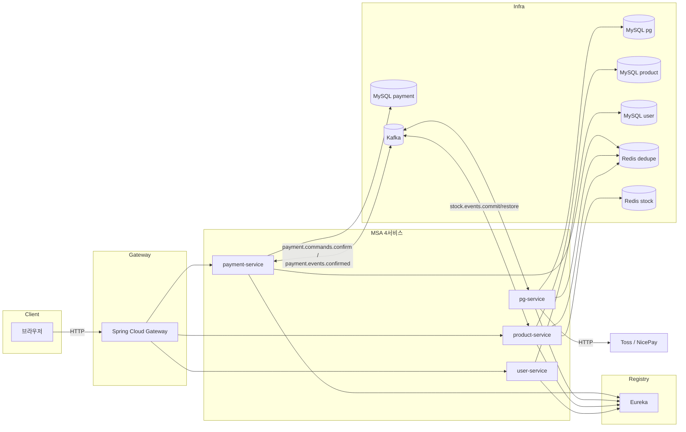

# MSA-TRANSITION 완료 브리핑

## 작업 요약

모놀리식 단일 애플리케이션을 4개 마이크로서비스(`payment-service` / `pg-service` / `product-service` / `user-service`) + Eureka 서비스 레지스트리 + Spring Cloud Gateway 로 전면 분해했다. 결제 confirm 흐름은 **payment-service → Kafka(`payment.commands.confirm`) → pg-service → 실제 PG 호출 → Kafka(`payment.events.confirmed`) → payment-service** 로 비동기 양방향 메시지 왕복으로 재설계되었으며, 재고 정산은 별도 Kafka 토픽(`stock.events.commit` / `stock.events.restore`) 으로 product-service 에 위임된다. 각 서비스는 독립 MySQL 인스턴스(payment / pg / product / user)와 두 개의 Redis(dedupe / stock cache) 를 공유한다.

총 5단계 게이트(Phase 0~3.5) 로 진행했고, 각 단계는 `docs/archive/msa-transition/scripts/phase-N-gate.sh` (시점 의존 검증 스크립트, archive 동행) 와 `phase-gate/phase-N-gate.md` (게이트 보고서) 로 기록되어 있다.

## 단계별 인덱스

| Phase | 범위 | 게이트 보고서 | 게이트 스크립트 |
|---|---|---|---|
| 0 | 인프라 기반 (compose, MySQL×4, Kafka, Redis×2, Eureka, Gateway 골격) | `phase-gate/phase-0-gate.md` | `scripts/phase-0-gate.sh` |
| 1 | 결제 코어 분리 — payment-service 독립화 (T1-01~T1-18) | `phase-gate/phase-1-gate.md` | `scripts/phase-1-gate.sh` |
| 2.a | pg-service 골격 + outbox 파이프라인 (T2a-01~T2a-06) | `phase-gate/phase-2a-gate.md` | `scripts/phase-2a-gate.sh` |
| 2.b | business inbox 5상태 + 벤더 어댑터 (T2b-01~T2b-05) | `phase-gate/phase-2b-gate.md` | `scripts/phase-2b-gate.sh` |
| 2.c | 전환 스위치 + 잔존 코드 삭제 (T2c-01~T2c-02) | `phase-gate/phase-2c-gate.md` | `scripts/phase-2c-gate.sh` |
| 2 (통합) | PG 분리 + ADR-30 Kafka 양방향 통합 검증 | `phase-gate/phase-2-gate.md` | `scripts/phase-2-gate.sh` |
| 3 | 상품/사용자 서비스 분리 + Saga 보상 왕복 (T3-01~T3-07) | `phase-gate/phase-3-gate.md` | `scripts/phase-3-gate.sh` |
| 3.5 | Pre-Phase-4 안정화 (T3.5-01~T3.5-13) | `phase-gate/phase-3-5-gate.md` | `scripts/phase-3-5-gate.sh` |
| 3.5 통합 smoke | compose-up 기반 배선 회귀 (시나리오 A~H 해피 패스) | `phase-gate/phase-3-integration-smoke.md` | `scripts/phase-3-integration-smoke.sh` |

## 핵심 ADR (인덱스만)

| ADR | 제목 | 적용 위치 |
|---|---|---|
| ADR-04 | 비동기 confirm 아키텍처 | payment-service `OutboxAsyncConfirmService` + Kafka 양방향 |
| ADR-13 | 격리 트리거 + Redis CACHE_DOWN 경로 | `QuarantineCompensationHandler` |
| ADR-15 | AMOUNT_MISMATCH 양방향 방어 | pg-service `ConfirmedEventPayload` + payment-service `handleApproved` |
| ADR-22 | HTTP 어댑터 외부 호출 회복성 | `ProductHttpAdapter` / `UserHttpAdapter` (CircuitBreaker 는 Phase 4 예정) |
| ADR-23 | DB 분리 시작 | 4개 MySQL 인스턴스 분리 |
| ADR-30 | Kafka 토픽 + dedupe TTL 정책 | `payment.commands.confirm` / `payment.events.confirmed` / `stock.events.{commit,restore}` |

## 주요 토폴로지 (Phase 3.5 종결 시점)

## 수치

| 항목 | 값 |
|---|---|
| 태스크 | T0-Gate ~ T3.5-Gate 총 60+ |
| 테스트 (Phase 3.5 종결 시) | 461+ PASS (eureka·gateway·payment·pg·product·user 합산) |
| 신설 서비스 | 4 (payment / pg / product / user) + 2 (eureka / gateway) |
| 신설 인프라 | 4 MySQL + 2 Redis + Kafka + Prometheus + Grafana |
| 새 Kafka 토픽 | 4 (commands.confirm / events.confirmed / stock.commit / stock.restore) + 2 DLQ |
| 봉인 시각 | 2026-04-24 (Phase 3.5 게이트 통과) |
| 후속 토픽 | `PRE-PHASE-4-HARDENING` (사고 재구성 가능성 + 회귀 저항성 보강 — 같은 archive 안 별도 토픽) → `PHASE-4` (Toxiproxy + k6 + 오토스케일러) |

## 인덱스

- 완료 태스크 상세: `MSA-TRANSITION-PLAN-COMPLETED.md` (Phase 0~3 발췌)
- 본 plan 전체: `MSA-TRANSITION-PLAN.md` (Phase 0~3.5 + 후속 계획)
- 토픽 컨텍스트: `MSA-TRANSITION-CONTEXT.md`
- Phase 3 통합 스모크 가이드: `INTEGRATION-SMOKE.md`
- 라운드 로그: `rounds/`
- 게이트 보고서: `phase-gate/`
- 시점 의존 검증 스크립트: `scripts/`
