# Phase 3 Integration Smoke — `phase-3-integration-smoke.sh`

> T3.5-11 산출물. 단위 테스트가 못 잡는 compose-up 기반 배선 회귀를 자동화 레이어로 확보한다.

## 목적

- **DI 순환** (T3-Integration-Closure 1·2 실경험: `DuplicateApprovalHandler ↔ PgGatewayPort`, `@Lazy` 잔재) 탐지
- **Flyway MySQL 문법 호환** (V2 `ADD INDEX` 문법 오류 실경험) 탐지
- **Kafka 토픽 누락 + 파티션 수 불일치** (`stock.events.restore` 누락 실경험, 불변식 6b) 탐지
- **`@ConditionalOnProperty` 분기 오동작** — matchIfMissing 조정 후 회귀 방지
- **Kafka 직렬화/역직렬화 갭** — `StockSnapshotEvent` 수동 직렬화 누락 실경험 방지
- **`spring.application.name` 오타** → Eureka 등록 실패 (`payment-platform` → `payment-service` 교정 실경험)
- **Kafka W3C `traceparent` 자동 전파** (T3.5-13 회귀 방지)

## 실행 모델

| 모드 | 명령 | 소요 시간 | 용도 |
|---|---|---|---|
| 기본 | `bash scripts/phase-gate/phase-3-integration-smoke.sh` | ≤ 60s | 이미 compose-up 된 스택에서 스모크만 |
| 완전 자동 | `bash scripts/phase-gate/phase-3-integration-smoke.sh --with-compose-up` | ≤ 10min | CI / 1-커맨드 검증 |
| Tempo 없이 | `bash ... --skip-tempo` | ≤ 60s | Tempo 미기동 환경 |
| 상세 로그 | `bash ... --verbose` | + | 디버깅 |

## 전제

- `scripts/compose-up.sh` 가 실행된 상태(infra + apps + observability healthy).
- **pg-service 는 반드시 `PG_GATEWAY_TYPE=fake` 로 기동**되어야 한다 — `docker-compose.smoke.yml` override 가 그 책임을 진다.
- 실 Toss/NicePay 샌드박스 키는 불필요. placeholder 만 주입되어도 FakePgGatewayStrategy 가 모든 confirm 을 APPROVED 로 응답.

## 시나리오

`PAYMENT-FLOW-BRIEFING.md` §Phase 1~5 의 해피 패스를 E2E 로 1:1 재현한다. 격리 상태 관련 재고 복구 경로는 T3.5-07 로 제거되어 본 스모크에서 다루지 않는다.

```mermaid
flowchart TD
    A["A. Eureka 5/5 UP<br/>+ Gateway health"] --> D["D. Kafka 토픽 6종<br/>+ 파티션 수 동일(불변식 6b)"]
    D --> B["B. POST /checkout 201<br/>orderId 추출"]
    B --> C1["C. POST /confirm 202<br/>paymentKey=fake-smoke-&#123;orderId&#125;"]
    C1 --> C2["C. /status 폴링 30s<br/>DONE 대기"]
    C2 --> E["E. Kafka traceparent 헤더<br/>trace-header-check.sh 위임"]
    E --> F["F. Tempo span tree<br/>5-service chain"]
    F --> H["H. /internal 403<br/>InternalOnlyGatewayFilter"]
```

### 각 섹션 수락 기준

| 섹션 | 체크 | PASS 조건 |
|---|---|---|
| A-1 | Gateway `/actuator/health` | `status=UP` |
| A-2 | Eureka `/eureka/apps` | GATEWAY, PAYMENT-SERVICE, PG-SERVICE, PRODUCT-SERVICE, USER-SERVICE 모두 UP |
| D-1 | Kafka 토픽 존재 | 6종 (confirm, confirm.dlq, confirmed, stock-committed, stock.restore, stock-snapshot) |
| D-2 | 파티션 수 동일 | confirm 계열 3개 토픽 partition 수 단일 값 |
| B-1 | `POST /api/v1/payments/checkout` | HTTP 201, `orderId` 추출 가능 |
| C-1 | `POST /api/v1/payments/confirm` | HTTP 202 |
| C-2 | `/status` 폴링 | 30s 내 `status=DONE` |
| E | `trace-header-check.sh` | exit 0 — `payment.commands.confirm` 토픽에 traceparent 헤더 1건 이상 |
| F | Tempo trace | Loki 로 trace_id 추출 → Tempo API → 3 이상 서비스 span |
| H | `/internal/pg/health` | HTTP 403 |

### paymentKey 위조 — 브라우저 PG SDK 대체

실 프로덕션에선 브라우저가 PG SDK 를 띄워 Toss/NicePay 서버와 사용자 상호작용으로 `paymentKey` 를 발급받는다. 스모크는 브라우저가 없으므로 다음과 같이 대체한다:

1. `PG_GATEWAY_TYPE=fake` 로 pg-service 기동 → `FakePgGatewayStrategy` 가 `PgConfirmPort` 구현으로 로드.
2. 스크립트가 `paymentKey=fake-smoke-<orderId>` 를 confirm 요청에 주입.
3. `FakePgGatewayStrategy.confirm()` 은 paymentKey 검증 없이 APPROVED 반환.

## FAIL 원인·조치 가이드

| 실패 항목 | 가장 빈번한 원인 | 1차 조치 |
|---|---|---|
| A-1 Gateway health | 라우트 설정 / Eureka 연결 | `docker logs gateway` 로 `EurekaClient` 등록 여부 확인 |
| A-2 Eureka 미등록 | `spring.application.name` 오타, `eureka.client.enabled=false` | 각 서비스 `application.yml` `spring.application.name` 확인 |
| D-1 토픽 누락 | `scripts/phase-gate/create-topics.sh` 누락 | `bash scripts/phase-gate/create-topics.sh` 재실행 |
| D-2 파티션 수 불일치 | create-topics.sh 에서 `--partitions` 누락 | create-topics.sh 의 confirm 계열 3개 토픽 파티션 수 동기화 |
| B-1 checkout 201 실패 | product-service / user-service 미등록, Redis 장애 | `docker logs payment-service` — `PRODUCT_SERVICE_UNAVAILABLE` 등 예외 확인 |
| C-1 confirm 202 실패 | PaymentConfirmEvent publish 경로, Redis 재고 DECR 실패 | payment-service 로그 — `markStockCacheDown` / `handleStockFailure` 등 |
| C-2 DONE 미도달 (30s) | Kafka consume 경로 끊김, pg-service fake strategy 미활성, product-service stock commit 실패 | `docker logs pg-service` — `FAKE PG STRATEGY ACTIVE` 배너 확인. 없으면 `PG_GATEWAY_TYPE=fake` 주입 실패 |
| E traceparent 없음 | T3.5-13 `spring.kafka.template.observation-enabled` 회귀 | `application.yml` observation-enabled=true 확인 + KafkaTemplate 수동 빈 `setObservationEnabled(true)` 확인 |
| F Tempo chain 미확인 | Tempo 미기동, sampling.probability=0 잔재, Loki 파서 | `management.tracing.sampling.probability` 확인 + Tempo healthy 확인 |
| H /internal 403 실패 | InternalOnlyGatewayFilter 제거 회귀 | `InternalOnlyGatewayFilter` 존재 + `@Order(HIGHEST_PRECEDENCE+1)` 확인 |

## 확장 범위 (차후)

- FAIL 경로 스모크(재고 부족 → 409, 재고 복원 기대): FAILED 경로는 Phase 4 Toxiproxy 에서 정돈해 주입한다.
- 멀티 인스턴스 가정: 현재 스모크는 단일 인스턴스 가정. 파티션 rebalance 는 별도 수단으로.

## 아카이브

스모크 실행 결과는 `docs/phase-gate/phase-3-integration-smoke-<YYYYMMDD>.md` 로 날짜별 스냅샷을 남긴다 (선택).
