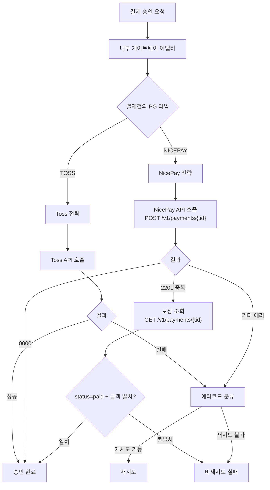
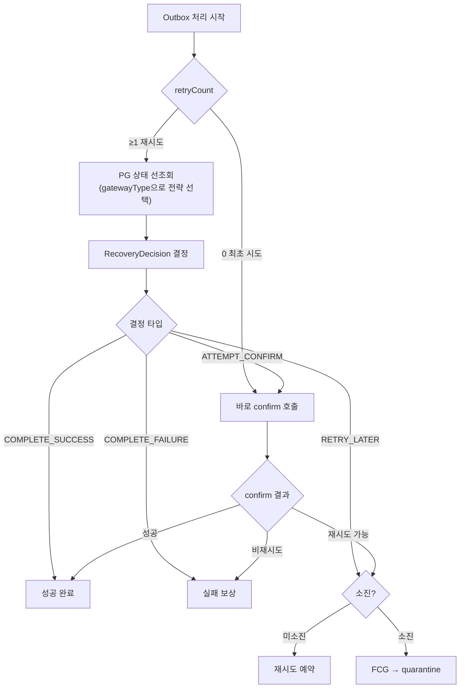

# NICEPAY-PG-STRATEGY 완료 브리핑

## 작업 요약

기존 결제 플랫폼은 Toss Payments 단일 PG만 지원했다. 포트폴리오에 "멀티 PG 연동"을 기재하기 위해, 나이스페이먼츠(NicePay)를 두 번째 PG 전략으로 추가하는 작업을 수행했다. NicePay는 Toss와 동일한 서버 인증(confirm) 패턴을 사용하므로 기존 Strategy 패턴에 자연스럽게 맞았다.

핵심 과제는 세 가지였다. 첫째, 예외 클래스와 에러코드에서 Toss 종속 명칭을 제거하여 벤더 중립 인프라를 만드는 것. 둘째, 결제건마다 어떤 PG로 결제했는지 기록(`PaymentEvent.gatewayType`)하여 복구 사이클에서 올바른 PG API를 호출하는 것. 셋째, NicePay의 멱등성 키 부재를 중복 승인 에러(2201) 감지 후 조회 API 보상 패턴으로 해결하는 것이었다.

작업 과정에서 복구 사이클의 불필요한 PG 선조회도 발견하여 최적화했다. 최초 시도(retryCount==0)에서는 confirm을 보낸 적이 없으므로 PG 상태 조회가 무의미하여, 바로 confirm으로 진행하도록 변경했다. 또한 `HttpNicepayOperator`가 WebClient 기반인데 RestTemplate 예외를 catch하고 있던 버그도 수정했다.

## 핵심 설계 결정

**D1. tid를 paymentKey로 매핑**: NicePay의 거래 식별자 tid를 기존 paymentKey 필드에 매핑하여, Toss의 paymentKey와 동일한 역할을 하게 했다. 대안으로 별도 tid 필드를 추가하는 방법이 있었으나, 도메인 모델 변경을 최소화하고 기존 confirm/cancel 인터페이스를 그대로 사용하기 위해 기각했다.

**D2. 벤더 중립 예외 체계**: `PaymentTossRetryableException` → `PaymentGatewayRetryableException`, `PaymentTossNonRetryableException` → `PaymentGatewayNonRetryableException`으로 rename. 에러코드도 `TOSS_RETRYABLE_ERROR` → `GATEWAY_RETRYABLE_ERROR`로 변경. 각 PG 전략이 벤더별 에러를 이 공통 예외로 변환하는 구조.

**D3. gatewayType 결제건별 저장**: `PaymentEvent`에 `gatewayType` 필드를 추가하고 `payment_event` 테이블에 `gateway_type` 컬럼을 Flyway 마이그레이션으로 추가. 복구 사이클에서 `paymentEvent.getGatewayType()`을 읽어 올바른 PG 전략을 선택. 기존 레코드(null)는 `InternalPaymentGatewayAdapter.resolveGatewayType()`에서 `properties.getType()` 폴백으로 처리.

**D4. NicePay 2201 멱등성 보상**: NicePay는 Toss와 달리 Idempotency-Key 헤더를 지원하지 않는다. 중복 승인 시 에러코드 2201을 반환하며, 이를 감지하면 tid로 PG 상태를 재조회하여 status==paid AND 금액 일치를 검증한 뒤 SUCCESS로 처리한다.

**D5. 최초 시도 PG 선조회 제거**: retryCount==0이면 confirm을 보낸 적이 없으므로 PG 상태 조회가 불필요. 바로 confirm을 호출하도록 최적화. Toss와 NicePay 모두 동일하게 적용.

**D6. TossPaymentStatus → PaymentGatewayStatus**: 도메인 DTO의 결제 상태 enum을 벤더 중립 이름으로 변경. `paymentgateway` 모듈 내부의 Toss 전용 `TossPaymentStatus`는 유지.

## 변경 범위

**도메인 레이어**:
- `PaymentEvent`: `gatewayType` 필드 추가, `create()` 메서드에 gatewayType 파라미터 추가
- `RecoveryDecision`: retryCount==0 + PG IN_PROGRESS 시 ATTEMPT_CONFIRM 반환 분기 추가
- `PaymentGatewayType` enum: `infrastructure/gateway/` → `domain/enums/`로 이동, NICEPAY 추가
- `PaymentCancelRequest`: `orderId` 필드 추가
- `TossPaymentStatus` → `PaymentGatewayStatus` rename

**Application 레이어**:
- `PaymentCommandUseCase`: `confirmPaymentWithGateway()`에서 `PaymentGatewayStatus.DONE` 사용
- `PaymentGatewayPort`: `getStatus`, `getStatusByOrderId` 시그니처에 `gatewayType` 파라미터 추가
- Request DTO들: `gatewayType` 필드 추가

**Infrastructure 레이어**:
- `NicepayPaymentGatewayStrategy` (신규): confirm/cancel/getStatus/getStatusByOrderId 구현
- `InternalPaymentGatewayAdapter`: confirm/cancel에서 결제건별 `gatewayType`으로 전략 선택
- `PaymentEventEntity`: `gateway_type` 컬럼 매핑
- 예외 클래스 rename: `PaymentToss*Exception` → `PaymentGateway*Exception`

**paymentgateway 모듈** (신규):
- `NicepayOperator` 포트, `HttpNicepayOperator` 구현체
- `NicepayApiCallUseCase`, `NicepayGatewayInternalReceiver`
- NicePay DTO 전체 (request/response/domain)

**Presentation 레이어**:
- `NicepayReturnController` (신규): NicePay JS SDK returnUrl POST 수신 → success.html redirect
- Admin 페이지: PG 타입(TOSS/NICEPAY) 배지 표시

**Scheduler**:
- `OutboxProcessingService`: retryCount==0 최초 시도 분기 추가, gatewayType 전파

## 다이어그램

## 코드 리뷰 요약

**라운드 1** (critic + domain-expert):
- [major] TOSS_ prefix ErrorCode 잔존 → GATEWAY_ prefix로 rename
- [minor] catch(Exception e) 범위 과도 → catch(RuntimeException e)로 축소
- [minor] 전략 인터페이스에 불필요한 gatewayType 파라미터 → 제거

**라운드 2** (critic pass, domain-expert revise):
- [major] parseApprovedAt 파싱 실패 시 null → DONE 전이 불가 → log.warn + LocalDateTime.now() fallback
- [major] cancel 요청에 orderId 누락 → PaymentCancelRequest에 orderId 추가
- [minor] TossPaymentStatus.DONE 하드코딩 → PaymentGatewayStatus rename
- [minor] NicepayReturnController URL에 tid 노출 → 주석 추가 (Toss와 동일 패턴)

**라운드 3**: critic + domain-expert 모두 pass (0 findings)

## 수치

| 항목 | 값 |
|------|---|
| 태스크 | 17개 |
| 테스트 | 355개 통과 |
| 커밋 | 33개 |
| 코드 리뷰 findings | critical 0 / major 3 / minor 4 |
| 커버리지 | line 86.67% / branch 88.78% |
