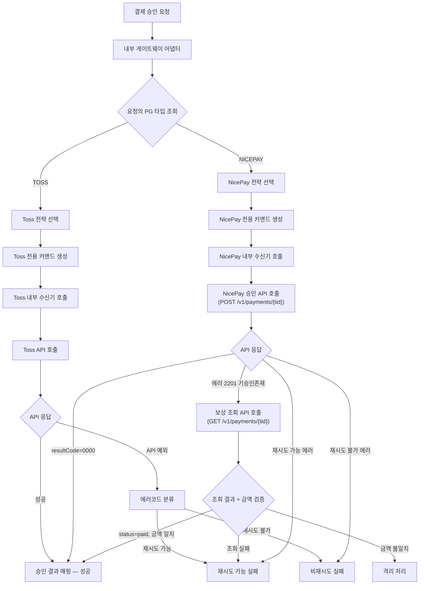
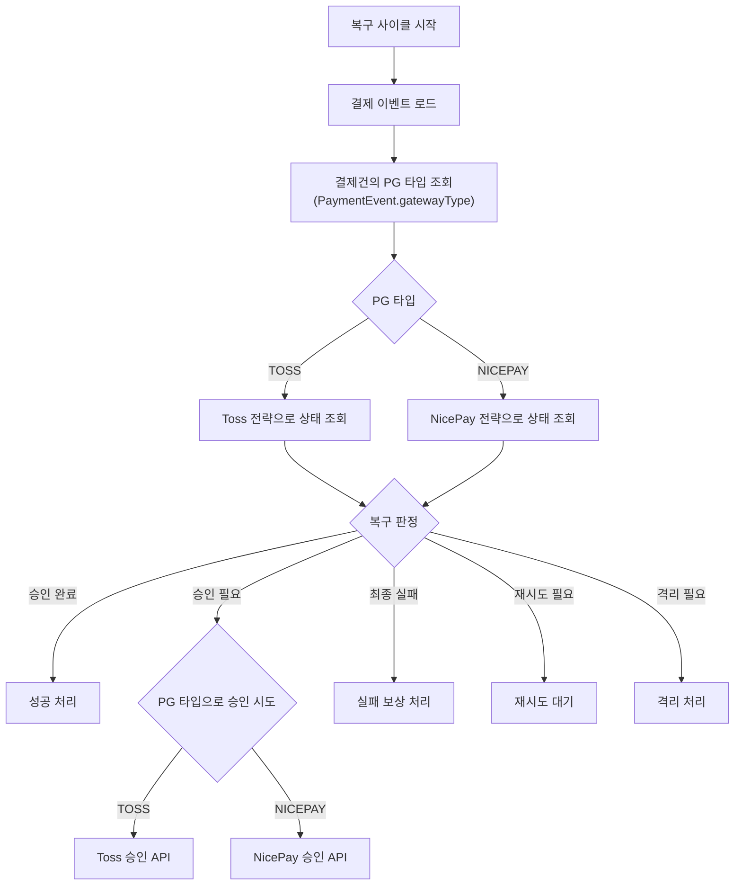
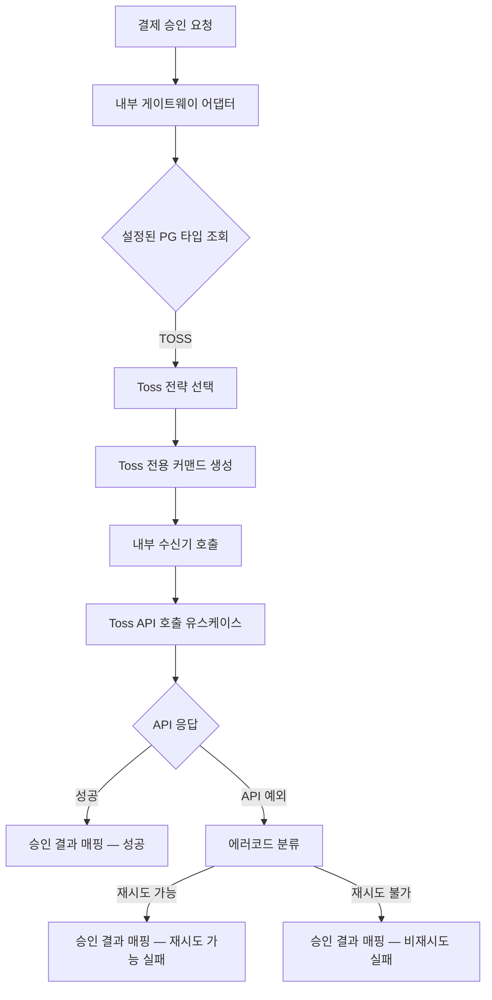
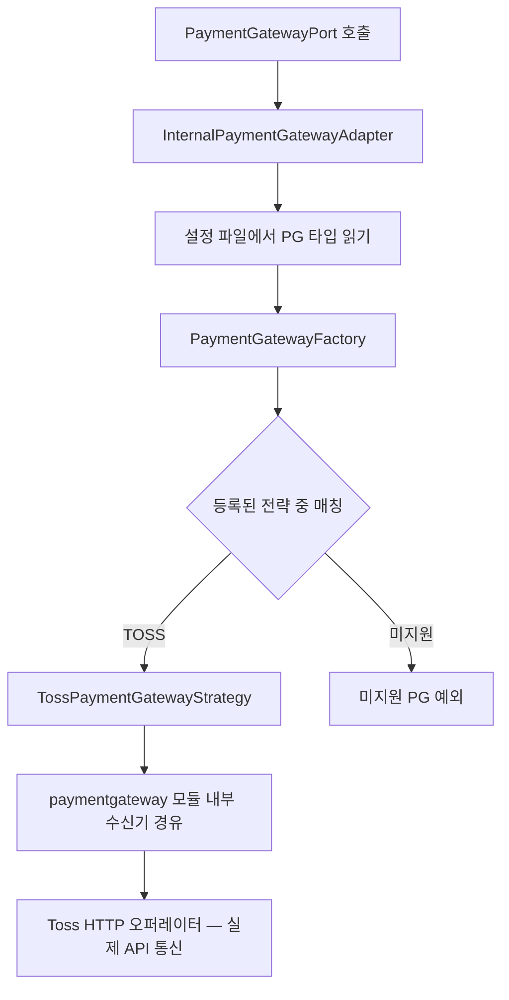
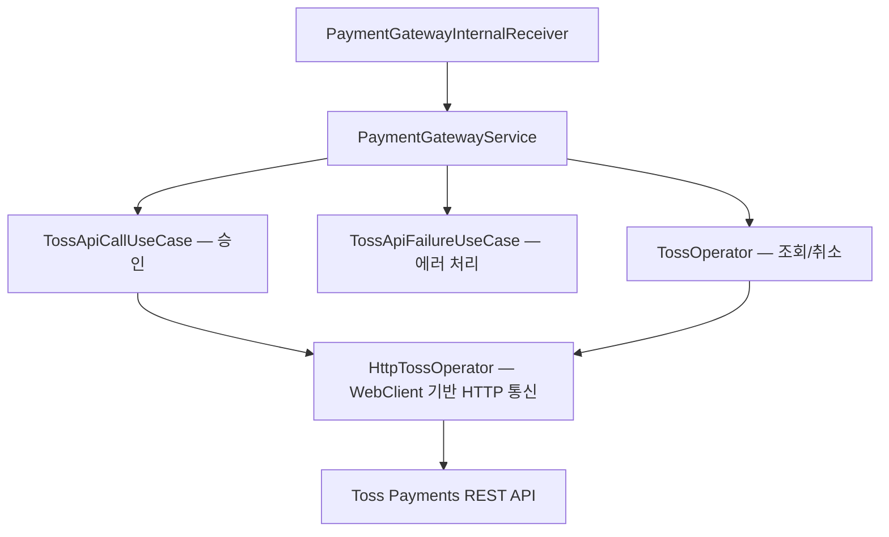
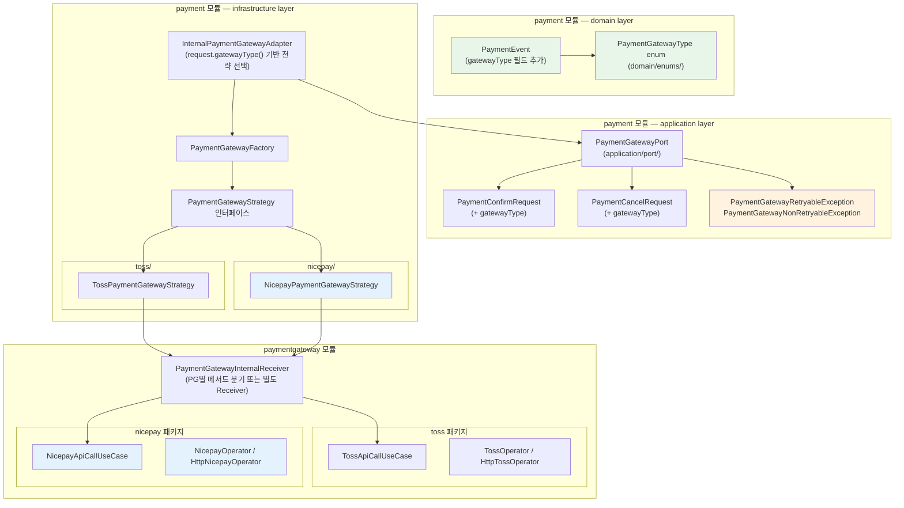
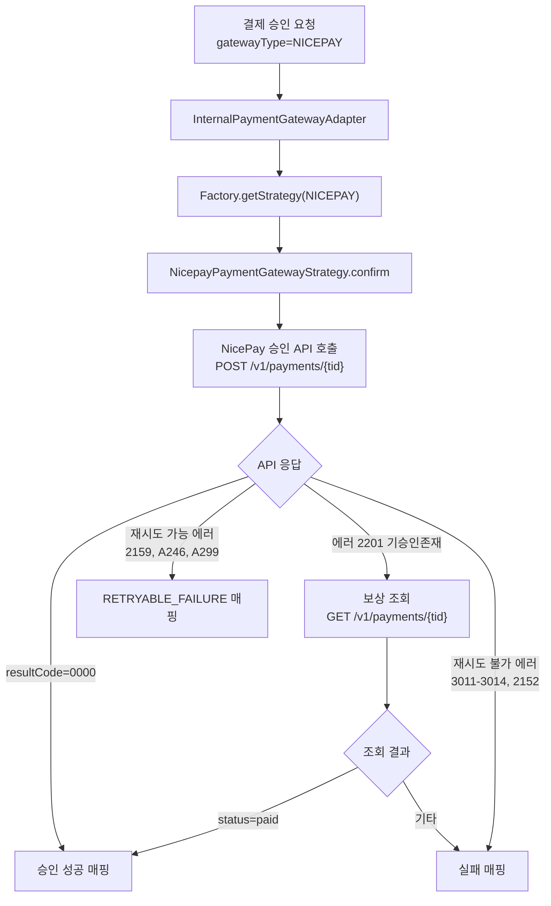
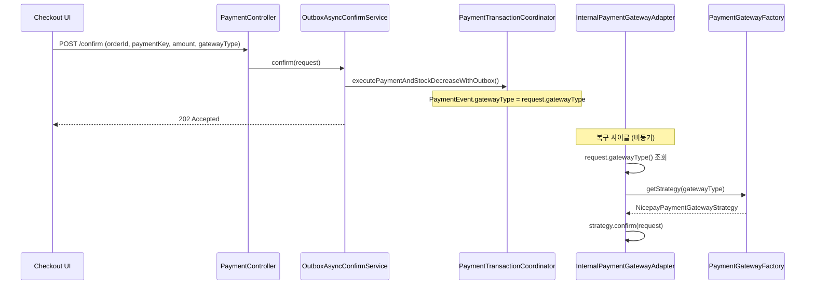

## 요약 브리핑

### 결정된 접근

나이스페이먼츠를 두 번째 PG 전략으로 추가한다. 예외 클래스를 벤더 중립으로 rename하고, `PaymentGatewayType`을 도메인 레이어로 이동하여 `PaymentEvent`에 결제건별 PG 정보를 기록한다. 복구 사이클에서도 결제건의 `gatewayType`을 읽어 올바른 PG API를 호출하도록 포트 시그니처를 변경한다. NicePay의 멱등성 키 부재는 중복 승인 에러(2201) 감지 후 조회 API 보상 패턴으로 해결한다.

### 변경 후 동작 — 결제 승인 흐름

### 변경 후 동작 — 복구 사이클 PG 라우팅

### 핵심 결정 ID 목록

- **D1**: NicePay `tid` → 시스템 `paymentKey` 필드 매핑
- **D2**: returnUrl POST를 클라이언트에서 파싱하여 기존 confirm API 재사용
- **D3**: 멱등성 보상 — 2201 에러 시 조회 API + 금액 교차 검증 (불일치 시 QUARANTINE)
- **D4**: 예외 범용화 — `PaymentTossRetryableException` → `PaymentGatewayRetryableException`
- **D5**: `PaymentGatewayType`을 domain/enums로 이동, `PaymentEvent.gatewayType` 추가, 결제건별 PG 선택
- **D6**: 복구 사이클 포트 시그니처에 `gatewayType` 파라미터 추가

### 알려진 트레이드오프 / 후속 작업

- `paymentKey` 필드명에 Toss 색채가 남지만 이번 범위에서 rename하지 않음
- `PaymentConfirmCommand`(application DTO)에도 `gatewayType` 전파 필요 — plan 단계에서 태스크로 명시
- NicePay Fake(벤치마크용)는 비범위 — 추후 성능 테스트 시 추가
- NicePay Webhook 수신 엔드포인트는 비범위

---

## 사전 브리핑

### 현재 이해한 문제

현재 결제 승인/취소/상태 조회는 Toss Payments 단일 PG에만 연결되어 있다. 전략 패턴 골격(Factory + Strategy 인터페이스)은 갖춰져 있지만, 구현체가 하나뿐이라 멀티 PG 전환이 실제로 동작함을 증명하지 못하고 있다. 나이스페이먼츠 전략을 추가하여 포트폴리오에 "멀티 PG 연동"을 기재한다.

나이스페이먼츠는 Toss와 동일한 confirm 패턴(결제창 인증 → 서버 승인 API 호출)을 사용하므로, `PaymentGatewayStrategy.confirm()` 인터페이스에 자연스럽게 맞는다.

### 현재 시스템 동작 (as-is)

#### 결제 승인 흐름

#### PG 전략 선택 구조

#### paymentgateway 모듈 내부 구조 (Toss 전용)

---

## 1. Context

### 문제 정의

결제 플랫폼이 단일 PG(Toss Payments)에만 의존하고 있다. 전략 패턴 골격(`PaymentGatewayFactory` + `PaymentGatewayStrategy`)이 존재하지만 구현체가 `TossPaymentGatewayStrategy` 하나뿐이므로, 멀티 PG 전환이 실제로 동작한다는 증거가 없다. 나이스페이먼츠를 두 번째 전략으로 추가하여 전략 패턴의 유효성을 증명하고, 추후 PG 교체/추가 비용을 낮추는 것이 목표다.

### As-Is 요약

| 구성 요소 | 현재 상태 | 문제 |
|---|---|---|
| `PaymentGatewayType` | `TOSS` 단일 값, `infrastructure/gateway/` 패키지 | 도메인 엔티티(`PaymentEvent`)가 참조할 수 없다 (layer 위반) |
| `PaymentGatewayStrategy` | throws 절에 `PaymentTossRetryableException` 등 벤더 종속 예외 | 포트 인터페이스가 특정 PG에 결합 |
| `InternalPaymentGatewayAdapter` | `properties.getType()`으로 글로벌 PG 선택 | 결제건별 PG 분기 불가 |
| `paymentgateway` 모듈 | Toss 전용 DTO/UseCase/Operator | NicePay 추가 시 별도 서비스 필요 |
| Checkout UI | Toss JS SDK만 사용 | NicePay SDK(`AUTHNICE.requestPay`) 미지원 |

---

## 2. Decision Drivers

1. **멀티 PG 증명**: 전략 패턴이 실제로 교체 가능하다는 것을 코드로 증명한다.
2. **삭제 비용 최소화**: NicePay 전략을 나중에 떼어내도 Toss 흐름에 영향이 없어야 한다. 공유 코드를 최소화하고, PG별 패키지를 격리한다.
3. **기존 흐름 무변경**: Toss confirm/cancel/recovery 경로의 동작이 바뀌어서는 안 된다. 예외 클래스 rename만 허용, 시그니처 의미 변경은 불허.
4. **hexagonal layer 준수**: `PaymentGatewayType`은 도메인 엔티티가 참조하므로 `domain/enums/`로 이동한다. 포트 인터페이스의 throws 절은 벤더 중립 예외로 교체한다.
5. **NicePay 멱등성 부재**: NicePay는 멱등성 키를 지원하지 않는다. 중복 승인 에러(2201)를 잡아 조회 API로 보상하는 패턴이 필수다.

---

## 3. Explored Alternatives

### A1: PortOne(구 아임포트) 사용

- **기각 사유**: PortOne은 PG 추상화 레이어를 이미 제공하므로, 우리 시스템의 전략 패턴 구조를 검증하는 데 적합하지 않다. PG 직접 연동 경험을 쌓는 것이 목적이므로 탈락.

### A2: paymentgateway 모듈을 PG별 독립 모듈로 분리 (paymentgateway-toss, paymentgateway-nicepay)

- **기각 사유**: 현재 규모에서 모듈 분리는 빌드 복잡도만 높인다. 패키지 수준 격리(`toss/`, `nicepay/`)로 충분히 교체 가능한 경계를 만들 수 있다.

### A3: PaymentGatewayType을 infrastructure에 유지하고 도메인에서는 String으로 참조

- **기각 사유**: 타입 안전성이 사라진다. 도메인 엔티티가 PG 종류를 알아야 하므로 enum을 domain layer로 올리는 것이 hexagonal 원칙에 부합한다.

---

## 4. Key Decisions

### D1: tid를 paymentKey 필드에 매핑

- **결정**: NicePay의 `tid`(거래 키)를 시스템의 `paymentKey` 필드에 매핑한다.
- **근거**: `paymentKey`는 "PG사가 부여한 거래 식별자"라는 범용 의미를 갖는다. Toss의 `paymentKey`와 NicePay의 `tid`는 동일한 역할이므로 1:1 대응이 자연스럽다.
- **트레이드오프**: `paymentKey`라는 이름에 Toss 냄새가 남지만, 지금 rename하면 변경 범위가 과도하다. 이번 범위에서는 유지한다.

### D2: returnUrl POST 콜백 처리

- **결정**: NicePay 결제 완료 후 `returnUrl`로 전송되는 POST 응답을 `checkout-nicepay.html` 페이지에서 받아 클라이언트 측에서 기존 confirm API(`POST /api/v1/payments/confirm`)를 호출한다.
- **근거**: 서버 측 POST 엔드포인트를 추가하면 기존 confirm 흐름과 병렬 경로가 생겨 복잡도가 높아진다. 클라이언트에서 POST 결과(tid, orderId, amount)를 파싱하여 confirm API를 호출하면 기존 흐름을 재사용할 수 있다.
- **트레이드오프**: 클라이언트 JS에 약간의 로직이 추가되지만, 서버 코드 변경이 최소화된다.

### D3: 멱등성 보상 로직 (중복 승인 처리)

- **결정**: `NicepayPaymentGatewayStrategy.confirm()` 내부에서 에러 코드 `2201`("기승인존재")을 잡으면 즉시 조회 API(`GET /v1/payments/{tid}`)를 호출하여 실제 결과를 가져와 성공으로 매핑한다. 복구 사이클(`getStatusByOrderId`)에서도 동일한 보상 패턴을 적용한다.
- **근거**: NicePay는 멱등성 키를 지원하지 않으므로, 재시도/복구 시나리오에서 중복 승인 에러가 반드시 발생한다. 이를 "이미 성공"으로 해석하고 조회로 보상하는 것이 유일한 안전한 방법이다.
- **트레이드오프**: confirm 경로에 조회 API 호출이 추가되어 최악의 경우 2배의 네트워크 비용이 발생한다. 그러나 이 경로는 재시도 시에만 발동하므로 정상 흐름에는 영향 없다.
- **금액 교차 검증**: 2201 보상 조회 후 반환된 `PaymentStatusResult.amount`와 원래 confirm 요청의 `amount`를 비교한다. 불일치 시 `QUARANTINE`으로 분류하여 수동 확인 경로로 보낸다. 이는 tid 조작이나 부분 승인 등 비정상 상태를 감지하는 안전망이다.
- **기각된 대안**: "2201을 받으면 무조건 성공으로 간주하고 조회 없이 반환" — 금액 불일치 등 예외 상황을 감지할 수 없어 위험.

### D4: 예외 범용화

- **결정**: `PaymentTossRetryableException` → `PaymentGatewayRetryableException`, `PaymentTossNonRetryableException` → `PaymentGatewayNonRetryableException`으로 rename한다. `PaymentGatewayPort`, `PaymentGatewayStrategy`의 throws 절을 범용 예외로 변경한다.
- **근거**: 포트 인터페이스(`application/port/`)의 시그니처에 특정 벤더명이 포함되면 hexagonal layer 규칙 위반이다. application layer가 infrastructure 구현 세부를 알게 된다.
- **트레이드오프**: 기존 Toss 관련 코드의 import 경로가 일괄 변경된다. 그러나 rename이므로 동작은 동일하다.

### D5: PaymentGatewayType enum 위치 이동 및 결제건별 PG 선택

- **결정**:
  - `PaymentGatewayType`을 `infrastructure/gateway/` → `domain/enums/`로 이동하고 `NICEPAY` 값을 추가한다.
  - `PaymentEvent`에 `gatewayType` 필드를 추가한다. `PaymentEventEntity`에 `gateway_type` 컬럼(VARCHAR, NOT NULL, default `TOSS`)을 추가한다.
  - `InternalPaymentGatewayAdapter`는 `properties.getType()` 대신 request에서 `gatewayType`을 받아 전략을 선택한다.
  - `PaymentConfirmRequest`, `PaymentCancelRequest`에 `gatewayType` 필드를 추가한다.
- **근거**: 결제건별 PG 선택이 필요하다. 글로벌 설정으로는 기존 Toss 결제와 NicePay 결제를 동시에 처리할 수 없다. `PaymentGatewayType`을 도메인으로 올려야 `PaymentEvent`가 이 enum을 참조할 수 있다 (domain layer는 infrastructure에 의존할 수 없다).
- **트레이드오프**: `PaymentGatewayProperties.type`(글로벌 기본값)은 checkout 시 기본 PG를 결정하는 용도로 유지한다. 결제 실행 이후에는 `PaymentEvent.gatewayType`이 SSOT(Single Source of Truth)가 된다.
- **NicePay 상태 매핑과 RecoveryDecision 호환성**: Interview D5에서 확정된 NicePay `failed` → `PaymentStatus.ABORTED` 매핑은 기존 `RecoveryDecision.from()`의 `PG_TERMINAL_FAIL_STATUSES` 집합에 `ABORTED`가 포함되어 있으므로 `COMPLETE_FAILURE` → `executePaymentFailureCompensationWithOutbox()` 경로를 그대로 탄다. Toss의 `ABORTED` → `COMPLETE_FAILURE` 경로와 동일하며, 별도 분기 추가가 필요하지 않다.

### D6: 복구 사이클 gatewayType 라우팅

- **결정**: 복구 사이클(`OutboxProcessingService`)에서 PG API를 호출할 때, 글로벌 설정(`properties.getType()`) 대신 해당 결제건의 `PaymentEvent.gatewayType`을 사용하여 전략을 선택한다.
  - `PaymentGatewayPort.getStatusByOrderId(String orderId)` → `getStatusByOrderId(String orderId, PaymentGatewayType gatewayType)` 시그니처 변경.
  - `PaymentGatewayPort.getStatus(String paymentKey)` → `getStatus(String paymentKey, PaymentGatewayType gatewayType)` 시그니처 변경.
  - `PaymentGatewayPort.cancel(PaymentCancelRequest request)` — request 내부에 이미 `gatewayType`이 포함되므로 시그니처 변경 불필요 (D5에서 `PaymentCancelRequest`에 `gatewayType` 추가 확정).
  - `InternalPaymentGatewayAdapter`는 `getStatusByOrderId`, `getStatus` 호출 시 파라미터의 `gatewayType`으로 `factory.getStrategy()`를 호출한다. `properties.getType()` 글로벌 폴백은 제거하지 않되, 결제건별 값이 전달되면 이를 우선한다.
  - `PaymentCommandUseCase.getPaymentStatusByOrderId(String orderId)` → `getPaymentStatusByOrderId(String orderId, PaymentGatewayType gatewayType)` 시그니처 변경.
  - `OutboxProcessingService.resolveStatusAndDecision()`과 `resolveFcgStatusAndDecision()`에서 `PaymentEvent.getGatewayType()`을 읽어 포트 호출 시 전달한다.
- **근거**: 현재 `InternalPaymentGatewayAdapter`는 모든 PG API 호출에 `properties.getType()` 글로벌 설정을 사용한다. NicePay 결제건이 복구 사이클에 진입하면 Toss API에 조회를 보내게 되어 NOT_FOUND → `NonRetryableException` → `ATTEMPT_CONFIRM` → Toss confirm 시도 → 실패 → 재고 이중 복원이라는 돈 새는 경로가 열린다.
- **트레이드오프**: 포트 시그니처 변경으로 `PaymentGatewayPort`의 모든 구현체와 호출부를 수정해야 한다. 그러나 변경 범위는 `InternalPaymentGatewayAdapter`, `PaymentCommandUseCase`, `OutboxProcessingService`, 테스트 코드로 한정되며 모두 한정된 호출 체인이다. `PaymentGatewayProperties.type`을 완전히 제거하지 않으므로 checkout 등 결제건 미확정 시점의 기본값 용도는 보존된다.

---

## 5. Target Architecture

### 범위 (In-scope)

1. 예외 범용화 (D4): 포트/전략 인터페이스의 벤더 종속 예외 제거
2. `PaymentGatewayType` enum 이동 (D5): `domain/enums/`로 이동, `NICEPAY` 추가
3. 결제건별 PG 선택 (D5): `PaymentEvent.gatewayType`, request DTO에 `gatewayType` 추가
4. `paymentgateway` 모듈 NicePay 패키지 추가: `nicepay/` 하위에 Operator, UseCase, DTO
5. `NicepayPaymentGatewayStrategy` 구현: confirm, cancel, getStatus, getStatusByOrderId
6. 멱등성 보상 로직 (D3): confirm 내 2201 처리 + 조회 보상 + 금액 교차 검증
7. Checkout UI: `checkout-nicepay.html`, `success.html` 분기
8. DB 마이그레이션: `payment_event.gateway_type` 컬럼 추가
9. 복구 사이클 gatewayType 라우팅 (D6): `PaymentGatewayPort` 시그니처 변경, `OutboxProcessingService`가 결제건별 PG로 API 호출

### Non-goals (비범위)

1. **Toss 코드의 구조적 리팩터링**: 이번 작업은 NicePay 추가에 집중한다. Toss 전략/UseCase의 내부 구조 개선은 범위 밖이다.
2. **PG 라우팅 엔진**: 수수료/가용성 기반 자동 PG 선택 로직은 구현하지 않는다. checkout UI에서 사용자가 명시적으로 PG를 선택한다.
3. **paymentgateway 모듈의 범용 공통 DTO 추출**: Toss 전용 DTO(`TossPaymentInfo`, `TossPaymentDetails` 등)의 접두사 제거/범용화는 이번 범위가 아니다. NicePay는 자체 DTO를 갖는다.
4. **Webhook 수신 엔드포인트**: NicePay 웹훅 처리는 이번 범위에 포함하지 않는다.
5. **Benchmark 프로파일의 NicePay Fake**: `FakeTossHttpOperator`에 대응하는 NicePay Fake는 이번 범위가 아니다.
6. **paymentKey 필드 이름 변경**: D1에서 결정한 대로, 이번 범위에서는 유지한다.

### To-Be 모듈 구조

### NicePay 승인 흐름 (confirm)

### 결제건별 PG 선택 시퀀스

---

## 6. Migration & Compatibility

### 기존 Toss 흐름 영향 분석

| 변경 사항 | Toss 흐름 영향 | 증명 방법 |
|---|---|---|
| 예외 rename (`PaymentTossRetryableException` → `PaymentGatewayRetryableException`) | 클래스명만 변경, 동작 동일 | 기존 Toss 테스트 전체 통과 |
| `PaymentGatewayType` 위치 이동 | import 경로 변경, enum 값 동일 | 컴파일 성공 + 테스트 통과 |
| `PaymentConfirmRequest`에 `gatewayType` 추가 | 기존 호출부에서 `TOSS` 명시 | 기존 테스트 수정 후 통과 |
| `InternalPaymentGatewayAdapter` 전략 선택 변경 | `request.gatewayType()` 기반이지만, 기존 요청은 모두 `TOSS` | 기존 Toss 테스트 통과 |
| `PaymentEvent.gatewayType` 필드 추가 | 기존 데이터는 default `TOSS` | DB 마이그레이션 스크립트 |

### DB 마이그레이션

`payment_event` 테이블에 `gateway_type` 컬럼을 추가한다.

- 컬럼: `gateway_type VARCHAR(20) NOT NULL DEFAULT 'TOSS'`
- 기존 레코드: default 값으로 자동 채워짐
- 인덱스: 현 시점에서는 불필요 (PG별 조회 쿼리가 없으므로)
- DDL 방식: `hibernate.ddl-auto: update`에 의해 자동 생성 (docker 프로파일). 운영 환경에서는 별도 마이그레이션 스크립트 필요 (현재 운영 환경 없음).

---

## 7. Risks & Mitigations

### R1: NicePay 멱등성 부재로 인한 이중 결제

- **위험**: confirm 재시도 시 NicePay가 실제로 이중 차감할 가능성
- **완화**: D3 보상 로직 — 2201("기승인존재") 감지 시 조회 API로 실제 상태를 확인. NicePay 자체가 동일 tid로의 재승인을 차단하므로 이중 차감은 발생하지 않는다. 보상 로직은 이 차단을 "성공"으로 올바르게 해석하는 역할이다.

### R2: paymentgateway 모듈의 Receiver 비대화

- **위험**: `PaymentGatewayInternalReceiver`에 NicePay용 메서드가 추가되면서 단일 클래스가 두 PG의 진입점 역할을 하게 된다.
- **완화**: NicePay 전용 Receiver(`NicepayGatewayInternalReceiver`)를 별도로 만들어 PG별 격리를 유지한다. 기존 Receiver는 Toss 전용으로 남긴다. 이 방식이 "떼어내기 쉬운 경계" 원칙에 부합한다.

### R3: 예외 rename으로 인한 기존 테스트 깨짐

- **위험**: `PaymentTossRetryableException`을 참조하는 모든 테스트와 프로덕션 코드가 컴파일 에러 발생
- **완화**: IDE rename refactoring으로 일괄 변경. 모든 참조를 추적 가능하므로 누락 위험이 낮다. 변경 후 `./gradlew test`로 회귀 확인.

### R4: 복구 사이클에서 NicePay 조회 API 실패

- **위험**: confirm 보상 로직(D3)에서 조회 API도 실패하면 결제 상태를 확정할 수 없다.
- **완화**: 조회 실패 시 `RETRYABLE_FAILURE`로 분류하여 기존 retry/quarantine 경로를 그대로 탄다. 별도 처리가 필요하지 않다 — 기존 복구 사이클의 FCG(Final Confirmation Gate)가 최종 안전망 역할을 한다.

### R5: 복구 사이클에서 잘못된 PG로 API 호출 (gatewayType 라우팅 누락)

- **위험**: `OutboxProcessingService`가 `getStatusByOrderId`를 호출할 때 결제건의 `gatewayType`을 전달하지 않으면, 글로벌 설정(`properties.getType()`)으로 PG를 선택한다. NicePay 결제건이 Toss API에 조회되어 NOT_FOUND → `ATTEMPT_CONFIRM` → Toss confirm → 실패 → 재고 이중 복원이라는 돈 새는 경로가 열린다.
- **완화**: D6에서 설계한 대로 `PaymentGatewayPort.getStatusByOrderId`, `getStatus`에 `gatewayType` 파라미터를 추가하고, `OutboxProcessingService`가 `PaymentEvent.getGatewayType()`을 읽어 전달한다. `InternalPaymentGatewayAdapter`는 파라미터의 `gatewayType`으로 전략을 선택한다.

### R6: Checkout UI 보안 — POST returnUrl에서 tid 조작

- **위험**: 클라이언트에서 tid(paymentKey)를 조작하여 다른 결제 건의 승인을 시도할 수 있다.
- **완화**: 기존 `PaymentEvent.validateConfirmRequest()`가 orderId, amount, userId를 모두 검증한다. tid가 조작되더라도 orderId/amount 불일치로 승인이 거부된다.

---

## 8. Validation Strategy

### 단위 테스트

- `NicepayPaymentGatewayStrategy`: 상태 매핑(paid→DONE, failed→ABORTED 등), 에러 코드 분류(재시도 가능/불가), 2201 보상 로직
- `PaymentGatewayFactory`: `NICEPAY` 타입으로 올바른 전략 반환
- 범용화된 예외: 기존 테스트가 새 예외 클래스명으로 동작

### 통합 테스트 (수동)

- NicePay Sandbox API 키로 실제 confirm/cancel/조회 동작 확인
- checkout-nicepay.html에서 결제 → confirm → 성공 화면까지 E2E 흐름

### 회귀 확인

- `./gradlew test` 전체 통과
- 기존 Toss checkout 흐름 수동 확인

---

## 9. Acceptance Criteria

1. `PaymentGatewayType.NICEPAY`로 결제 승인 요청을 보내면 NicePay API를 통해 승인이 처리되고, `PaymentEvent.status`가 `DONE`으로 전이된다.
2. NicePay 승인 후 동일 tid로 재승인 요청 시 2201 에러를 잡아 조회 API로 보상하여 `SUCCESS`를 반환한다.
3. 기존 Toss 결제 흐름(`PaymentGatewayType.TOSS`)이 모든 테스트에서 동일하게 동작한다.
4. `PaymentGatewayPort`, `PaymentGatewayStrategy`의 throws 절에 벤더 종속 예외가 없다.
5. `PaymentGatewayType` enum이 `domain/enums/`에 위치하며, `PaymentEvent`가 이를 참조한다.
6. `payment_event` 테이블에 `gateway_type` 컬럼이 존재하고, 기존 레코드는 `TOSS`로 채워진다.
7. checkout-nicepay.html에서 NicePay JS SDK로 결제를 시작하고, returnUrl POST를 거쳐 confirm API가 호출된다.
8. `PaymentGatewayPort.getStatusByOrderId`, `getStatus` 시그니처에 `PaymentGatewayType` 파라미터가 존재하고, `OutboxProcessingService`가 `PaymentEvent.getGatewayType()`을 읽어 전달한다 (D6).
9. NicePay 2201 보상 조회 시 `amount` 불일치가 감지되면 `QUARANTINE`으로 분류된다 (D3 금액 교차 검증).

---

## 10. Transaction Boundary Principles

이번 변경은 기존 트랜잭션 경계를 변경하지 않는다.

- `PaymentTransactionCoordinator`의 TX 범위는 동일하게 유지된다.
- NicePay API 호출(HTTP I/O)은 기존 Toss API 호출과 동일한 위치(TX 외부)에서 발생한다 — `OutboxProcessingService.process()` 내부의 Step 4/5에서 TX 없이 호출.
- `gatewayType` 필드는 `executePaymentAndStockDecreaseWithOutbox()` TX 내에서 `PaymentEvent`에 설정되므로, 별도 TX가 필요하지 않다.
