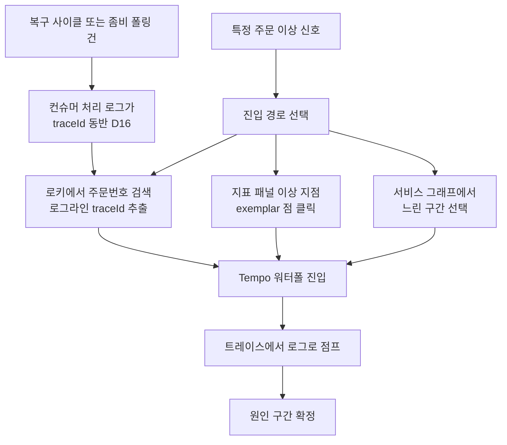
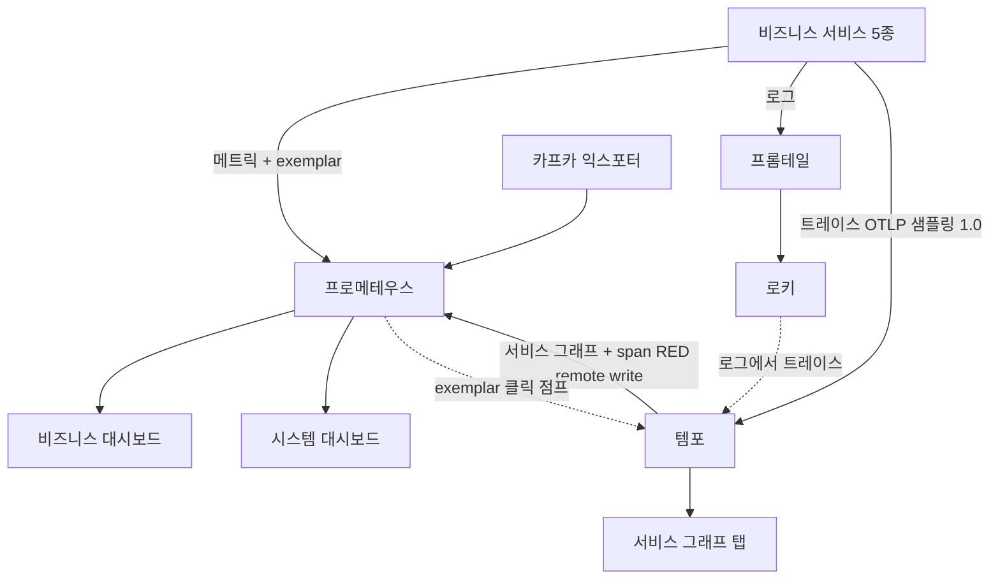

# OBSERVABILITY-COMPLETION 완료 브리핑

> 이슈/브랜치 #94 · 2026-06-10 ~ 2026-06-11 · 관측성 완성(대시보드 2종 + 로그 기반 추적 진입 + 신규 메트릭)

## 작업 요약

이 결제 플랫폼은 Prometheus·Grafana·Tempo·Loki·Promtail·kafka-exporter 라는 관측 백엔드를 이미 모두 띄워 두고 있었다. 그런데 운영자가 던지는 세 가지 질문 — "지금 결제가 정상으로 흐르고 있나", "어느 서버가 아픈가", "이 주문에 무슨 일이 있었나" — 에 즉답하지 못했다. 원인은 백엔드 부재가 아니라 **연결의 마지막 한 칸씩이 비어 있는 것**이었다. 코드에는 메트릭이 쌓였는데 대시보드는 옛 상태였고, 트레이스 워터폴은 잘 뜨지만 거기까지 가려면 추적 ID를 로그에서 손으로 찾아야 했으며, 지표 패널에서 트레이스로 점프하는 exemplar 와 서비스 토폴로지 그래프가 꺼져 있었다.

접근은 "새로 만들기"가 아니라 "마지막 칸 채우기"였다. (1) 코드에 이미 등록된 결제 메트릭을 전수 노출하는 **비즈니스 대시보드**와 6서비스 시스템 자원을 보는 **시스템 대시보드**로 2분할하고, (2) 추적 진입을 — discuss 중 사용자 결정으로 — span 속성 부착이라는 침습적 방식 대신 **로그 기반**(주문번호로 로그 검색 → 그 로그의 추적 ID → Tempo 점프)으로 잡되 컨슈머 처리 로그도 추적 ID를 달도록 listener observation 한 줄을 켰고, (3) exemplar·서비스 그래프·전량 샘플링을 활성화했으며, (4) 종결 가드 스킵·청소 실패·코디네이터 활동 카운터를 더했다. 결제 상태 머신·돈 흐름·메시지 계약은 일절 건드리지 않고 관측 계층만 보강했다.

결과적으로 라이브 스택을 fake 모드로 띄워 confirm 1건을 흘린 뒤, 비즈니스/시스템 대시보드의 모든 패널이 기동 직후 메트릭 시리즈를 갖고(이상 카운터도 eager 등록으로 0 노출), 로그→트레이스 점프가 컨슈머 경로까지 이어지며(payment listener 경로 traceId 13건 실증), exemplar 와 서비스 그래프(`traces_service_graph_request_total`)가 동작함을 확인했다. 벤더 latency 만 fake 모드라 비어 있는데, 이는 실 PG 호출이 없으면 데이터가 없는 게 정상이라 수용했다.

## 핵심 설계 결정

- **D2 — 추적 진입을 로그 기반으로 (span 속성 미부착)**: 무엇을 = orderId/userId 를 span 에 새기지 않고, orderId 가 이미 LogFmt 로그에 + MDC 추적 ID 동반이라는 점 + Loki derivedFields(traceId→Tempo) 기활성을 이용해 "로그 검색 → 점프"로 진입. 근거 = 코드 변경 0으로 동일 목적 달성. 기각 = span 속성 부착(`SpanBusinessAttributes` 헬퍼 + 인바운드 어댑터 2곳)은 가장 침습적이고, TraceQL 직접 검색이라는 이득이 로그 경로 대비 한계 효용뿐이라 discuss 중 사용자가 제거 결정.
- **D16 — 컨슈머 listener observation 활성**: 무엇을 = `KafkaConsumerConfig` 커스텀 EOS factory 에 `setObservationEnabled(true)` 1줄. 근거 = 안 켜면 confirmed 컨슈머(복구·좀비 폴링) 처리 로그가 추적 ID 없이 찍혀, 정작 사고조사가 절실한 경로에서 로그→트레이스가 끊긴다. 기각 = `application.yml` 의 listener observation 설정만 신뢰 — 커스텀 빈에 auto-config configurer 가 닿지 않아 무효.
- **D15 — 코디네이터 가용성 = EOS producer Micrometer 리스너 + 조합 패널**: 무엇을 = `KafkaProducerConfig` EOS factory 에 `MicrometerProducerListener` 1줄 → `kafka_producer_txn_*` 노출. 근거 = 커스텀 factory 라 리스너 미부착 시 txn 메트릭이 안 나옴(실측). 기각 = 전용 probe 지표 신설(합성 producer 가 coordinator 에 부하 추가하는 역설).
- **D12 — 대시보드 2분할**: 비즈니스/시스템 관심사 혼합을 막기 위해 분리. 기존 단일 `payment-dashboard.json` 흡수 후 폐기. 서비스별 3분할은 단일 인스턴스 환경에서 과분할이라 기각.
- **D13/D14 — 신규 카운터**: 종결 상태 가드 스킵(`payment_confirm_guard_skip_total{status}`, noop 분기 가시화)·청소 실패(`*_dedupe.cleanup_failed_total`). 라벨은 저카디널리티만(orderId/userId 메트릭 라벨 금지 = D7 불변식).
- **D3 — 샘플링 기본 1.0**: 학습/데모는 트레이스가 "있을 수도"면 추적 동선이 무의미. env 하향 경로 유지.
- **(verify) 발행/종결 funnel 카운터 신규**: review 에서 대시보드가 참조하던 `payment_event_published_total`/`terminal_total` 이 코드에 등록처 0건(옛 대시보드의 죽은 참조)임이 드러나, 카운터를 실제 구현. 발행=`PaymentCreateUseCase` READY 저장 후, 종결=`PaymentStatusMetricsAspect` 가 `PaymentEventStatus.isTerminal()` SSOT 위임(QUARANTINED 제외).

## 변경 범위

- **payment-service (코드)**: `PaymentEventFlowMetrics`(발행/종결 funnel, eager·무라벨) 신규 / `PaymentConfirmGuardSkipMetrics`(가드 스킵, eager 6종) 신규 + `PaymentConfirmResultUseCase.handle` noop 분기 계측 / `PaymentStatusMetricsAspect` 종결 계측(`isTerminal()` 위임) / `PaymentCreateUseCase` 발행 계측 / `DedupeCleanupWorker` cleanup_failed_total / `KafkaConsumerConfig` observation 1줄(D16) / `KafkaProducerConfig` Micrometer 리스너 1줄(D15). 모두 never-throw·결제 흐름 비참여.
- **product-service (코드)**: `DedupeCleanupWorker` cleanup_failed_total.
- **설정(yml)**: 5서비스 `application.yml` 샘플링 1.0 / payment·pg percentiles-histogram(exemplar) / `tempo.yml` metrics_generator + remote_write / `prometheus.yml` out-of-order window / `datasources.yml` serviceMap·exemplarTraceIdDestinations / `docker-compose.observability.yml` exemplar-storage flag.
- **대시보드**: `business-dashboard.json` 신규(8행+격리 stat) / `system-dashboard.json` 신규(7행, `$application`) / `payment-dashboard.json` 폐기.
- **무변경**: 결제 상태 머신, Kafka 계약, EOS 트랜잭션 경계, 도메인 enum.

## 다이어그램

### 운영자 조사 동선 (to-be)

### 관측 데이터 수집 경로

## 코드 리뷰 요약

review 3라운드(Critic + Domain Expert)로 수렴. critical 0.
- **major (해소)**: ① 대시보드 funnel·in-flight 패널이 등록처 0건 메트릭(`payment_event_published/terminal_total`)을 참조 → 카운터 신규 구현. ② confirmed.dlq 패널이 컨슈머 없는 토픽을 consumer-consumed 로 조회 → kafka-exporter `kafka_topic_partition_current_offset` 로 교체(commands.confirm.dlq 는 pg 컨슈머 존재로 유지). ③ `PaymentStatusMetricsAspect` 가 종결 집합을 enum SSOT 와 별개로 복제 → `isTerminal()` 위임으로 단일화.
- **minor (처리/이연)**: 가드 스킵 테스트 6종 강화, aspect 종결 분기 직접 테스트, in-flight 근사값 한계 명시. 가드 스킵 eager 등록은 verify 에서 사용자 "구동 즉시 관측" 요구로 해소.
- **verify 라이브 보정**: `payment_state_current_total`→`payment_state_current`(Gauge 노출명), 코디네이터 패널 placeholder→`kafka_producer_txn_*` 실명, 두 lazy 카운터 eager 등록.

## 수치

| 항목 | 값 |
|------|---|
| 태스크 | T0~T10 (11개) |
| 테스트 | payment 512 / product 44 PASS (전체 BUILD SUCCESSFUL) |
| 커밋 | ~25개 (discuss/plan/plan-review docs + T0~T9 + review 수정 3 + verify 보정) |
| 코드 리뷰 findings | critical 0 / major 2(해소) / minor 다수(처리·이연) |
| 라이브 스모크 | AC1~AC6 PASS (AC7 BUILD SUCCESSFUL), 벤더 latency 는 prod 트래픽 의존 |
| 후속 | 없음 (TODOS [GUARD-SKIP-EAGER-REGISTER] 는 verify 에서 해소) |
