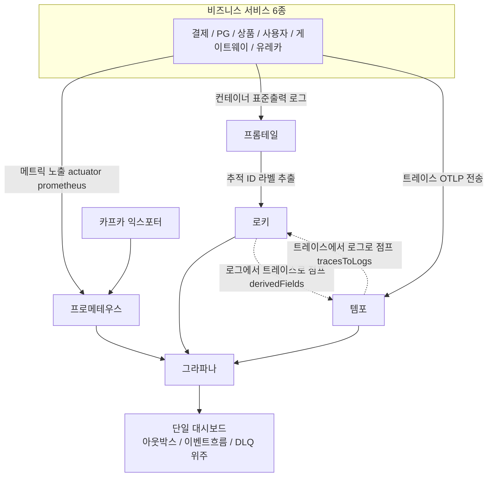
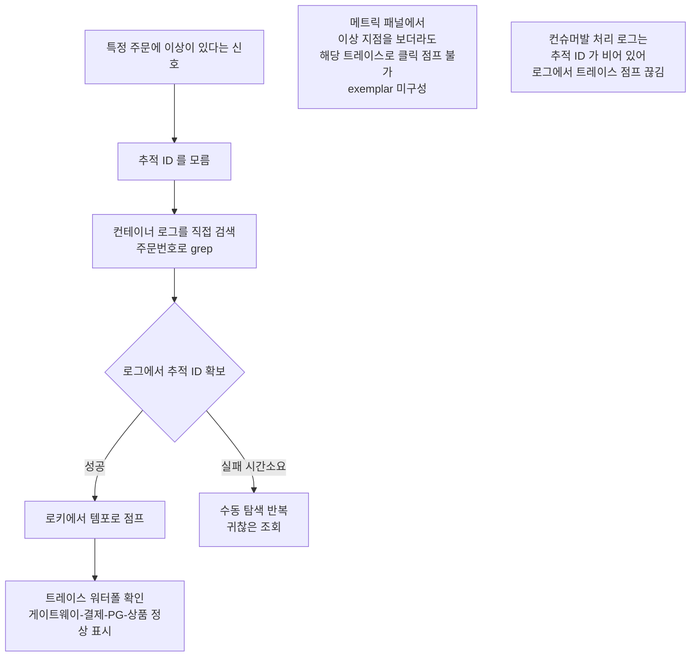
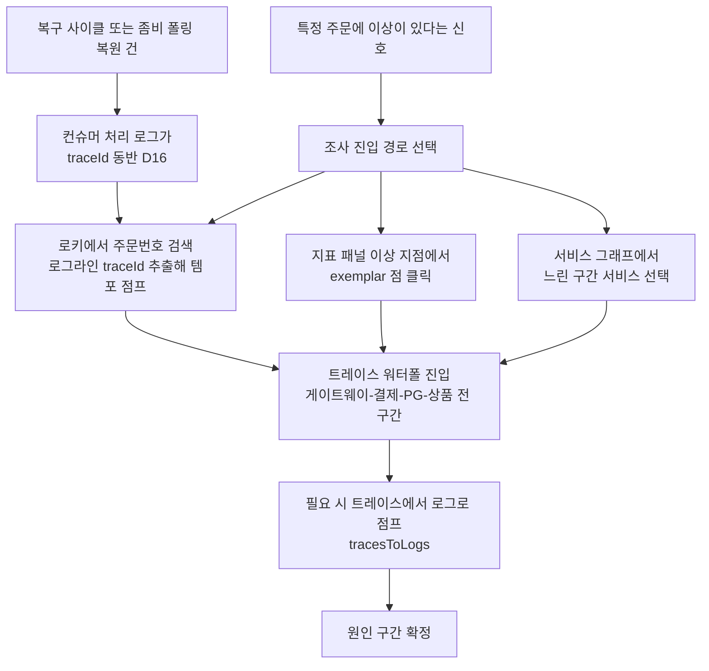
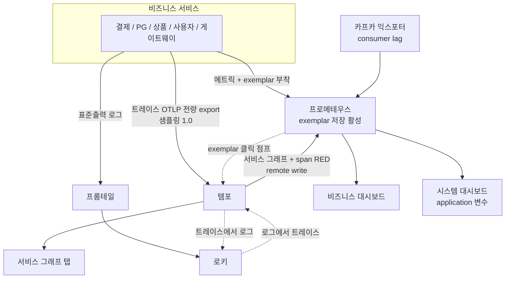
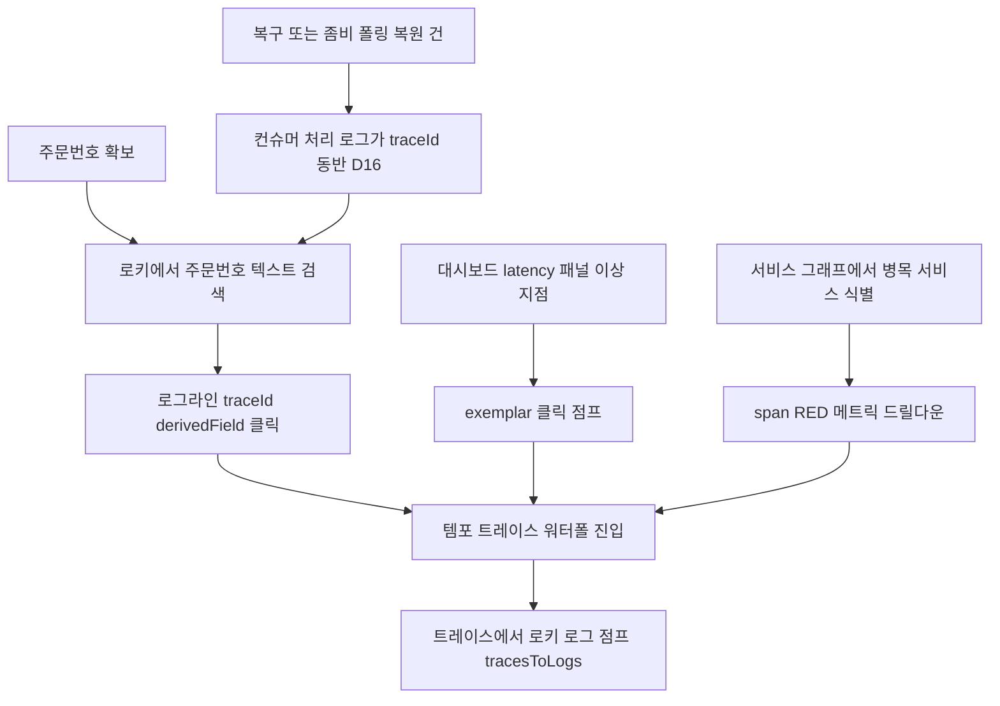

# OBSERVABILITY-COMPLETION

> discuss 단계 진행 중. 토픽명 잠정 — 백엔드 스택(Prometheus·Grafana·Tempo·Loki·Promtail)은 이미 떠 있고,
> 이를 **운영에서 실제로 쓸모 있게 완성**하는 작업이라 "ACTIVATION" 대신 "COMPLETION" 으로 잡음. 정정 가능.

## 사전 브리핑

### 1. 현재 이해한 문제

분산 결제 플랫폼의 관측 백엔드(메트릭·로그·트레이스 수집기 + Grafana)는 이미 구성돼 있으나, **세 가지 운영 질문에 즉답하지 못한다**:
(1) "지금 결제가 정상으로 흐르고 있나" — 비즈니스 지표가 한 화면에 모이지 않음(격리·상태전이·벤더 응답시간이 코드엔 있으나 대시보드 미노출),
(2) "어느 서버가 아픈가" — 6개 서비스의 시스템 자원(메모리·GC·커넥션풀·컨슈머 지연)을 서버별로 보는 화면이 없음,
(3) "이 주문에 무슨 일이 있었나" — 주문번호 로그 검색에서 트레이스로 점프하는 경로(로키 derivedFields)는 HTTP 발 경로에선 성립하나, **컨슈머발 처리 로그는 추적 ID 가 비어** 점프가 끊기고, 메트릭 이상 지점에서 트레이스로 가는 클릭 점프(exemplar)와 서비스 그래프도 없다.

### 2. 현재 시스템 동작 (as-is)

#### 2-1. 관측 데이터 수집 경로

#### 2-2. 운영자가 한 건을 조사하는 현재 동선 (마찰 지점)

**확정된 근본 마찰 3가지**
- **컨슈머발 처리 로그에 추적 ID 부재** — HTTP 발 경로는 주문번호 로그 검색 → traceId → 템포 점프가 성립하나, 복구·좀비 폴링 등 컨슈머발 처리 로그는 traceId 가 N/A → 사고 조사가 가장 절실한 케이스에서 로그→trace 점프 끊김
- 프로메테우스 **exemplar 미구성** → latency 패널의 이상 지점에서 트레이스로 클릭 점프 불가
- 템포 **metrics_generator 부재** → 서비스 그래프(MSA 토폴로지 자동 시각화)·span 기반 RED 메트릭 없음

### 3. 이번 discuss에서 결정하려는 것

- **대시보드 분할 구조**: 비즈니스 대시보드 / 시스템(서버별) 대시보드 2분할이 맞는지, 각각 어떤 패널·행 구성으로 갈지
- **span 비즈니스 속성**: 어떤 키를 붙일지(주문번호/결제키/사용자/벤더/금액), 어디서(어느 경계에서) 붙일지, 카디널리티 등급(검색 가능한 속성 vs 메트릭 라벨 금지) — *(결정 결과: span 미부착, 로그 기반 진입으로 확정. 요약 브리핑 §3 D2 참조)*
- **추적 진입 편의 수단**: exemplar 활성 + 템포 metrics_generator(서비스 그래프) 켜는 범위, 운영자 진입 동선 표준화
- **신규 메트릭 3종 시맨틱**: D7 가드 스킵 카운터 / dedupe cleanup 실패 카운터 / Kafka 트랜잭션 코디네이터 가용성 지표 — 이름·라벨·집계 정의
- **샘플링 정책**: 트레이스 샘플링 기본값을 학습/데모 환경 기준 어떻게 둘지(현재 기본 0)
- **알람 포함 여부**: 이번 범위에 Prometheus 알람 rule/SLO 를 baseline 값으로 포함할지, 별도 토픽으로 분리할지

### 4. 열린 질문 / 가정

- (가정) 측정 인프라(k6 부하·Toxiproxy 장애주입) 없이 완결 가능한 범위로 한정 — 알람 임계치는 측정 전이므로 baseline placeholder
- (가정) 로그 포맷은 현재 텍스트(%X traceId) 유지. JSON 구조화 로그 전환은 이번 범위 밖으로 보는데, 로키 라벨 추출 정밀화가 필요하면 재논의
- (해소) span 비즈니스 속성 부착 자체를 하지 않기로 결정 — PII/카디널리티 질문 자연 소멸. 추적 진입은 로그(주문번호) 경유 (요약 브리핑 §3 D2)
- (질문) 시스템 대시보드의 "서버별" 단위를 컨테이너 인스턴스 단위로 할지 서비스(application 라벨) 단위로 할지 — 현재 단일 인스턴스 가정
- (질문) Kafka tx coordinator 가용성을 별도 지표로 만들지, 기존 kafka-exporter/JMX 메트릭 조합으로 패널만 구성할지

---

## 요약 브리핑

> discuss 3라운드 갱신 — Round 3 에서 사용자 결정(span 비즈니스 속성 미부착, 로그 기반 진입 채택)을 반영. 후처리(이슈/브랜치/커밋) 전 결과 확인용.

### 1. 결정된 접근

관측 백엔드는 이미 떠 있으므로 **연결의 마지막 한 칸씩만 채운다**. (1) 코드에 이미 등록된 결제 메트릭(격리·상태전이·상태분포·벤더 응답시간·cleanup)을 전수 노출하는 **비즈니스 대시보드**와 6서비스 시스템 자원(JVM·GC·커넥션풀·컨슈머 지연)을 보는 **시스템 대시보드**로 2분할한다. (2) 추적 진입은 **로그 기반**으로 확정한다 — 주문번호가 이미 LogFmt 로그에 찍히고 로키의 traceId 연결(derivedFields)이 켜져 있어 "로키에서 주문번호 검색 → 로그라인 traceId 클릭 → 템포 점프"가 코드 변경 없이 성립하며, 컨슈머발 처리 로그에도 traceId 가 실리도록 observation 1줄(D16)을 더해 복구 경로에서도 같은 동선을 보장한다. 여기에 지표 패널에서 트레이스로 클릭 점프(exemplar)와 서비스 토폴로지 자동 그림(metrics_generator)을 켠다. (3) 신규 카운터 3종(종결 상태 가드 스킵·청소 실패·트랜잭션 코디네이터 활동)을 더한다. 결제 상태 머신·돈 흐름·메시지 계약은 **읽기만** 하고 일절 바꾸지 않는다.

핵심 발견: 커스텀 EOS 컨슈머/프로듀서 팩토리가 자동 관측 설정을 무효화해, 컨슈머 처리 로그의 traceId 와 코디네이터 메트릭이 **침묵 실패**하던 것을 코드 실측으로 확인 — 관측 설정 1줄씩 두 곳(D15·D16)을 본 범위에 포함했다.

### 2. 변경 후 동작 (to-be)

#### 2-1. 운영자가 한 건을 조사하는 새 동선

#### 2-2. 관측 데이터 수집 경로 (보강분 굵게)

### 3. 핵심 결정 ID

- **D2** span 비즈니스 속성 부착 안 함 — 추적 진입은 로그(주문번호 검색) 경유 traceId 로 템포 점프, 로키 derivedFields 기활성 (주문번호/사용자 식별자의 메트릭 라벨 금지는 **D7** 불변식으로 유지)
- **D3** 트레이스 샘플링 기본 1.0 전량(env 하향 가능)
- **D10/D11** Tempo metrics_generator(서비스 그래프) + exemplar 3점 연결
- **D12** 대시보드 2분할(비즈니스 / 시스템), 기존 단일 대시보드 흡수 후 폐기
- **D13/D14** 종결 상태 가드 스킵 카운터 + 청소 실패 카운터
- **D15** 코디네이터 가용성 = EOS 프로듀서 팩토리에 메트릭 리스너 1줄 + 조합 패널(부재 시 fallback)
- **D16** confirmed 컨슈머 listener observation 활성 1줄 — 컨슈머 처리 로그 traceId 연속성 확보, 로그 기반 진입이 복구 경로에서도 성립

### 4. 알려진 트레이드오프 / 후속

- **템포 직접 검색 불가**(D2): 트레이스 진입이 항상 로그 경유 1단계 — 마찰 실측 시 span 속성 부착 재논의 §6-1
- **코디네이터 패널 수동성**(D15): 무트래픽 시 tx 활동 미표시, `kafka_brokers` liveness 가 보완. 브로커 JMX 기반 직접 지표는 TODOS 위임
- **알람 rule 제외**(D1): 측정(k6) 후 별도 토픽
- **plan T0 선행 실측**(§5-0): build.gradle 버전 + `/actuator/prometheus` 스냅샷으로 exemplar 타이머·kafka 프로듀서 메트릭명 확정 후 패널 expr 고정
- **벤더 중립 rename 보류**: `toss.api.call.*` 기존 메트릭 호환 유지, rename 은 TODOS

---

# 설계 (Architect Round 3)

> Round 0 인터뷰(`docs/rounds/observability-completion/discuss-interview-0.md`)의 확정 가정 6건 + 불변식 1건을 결정 D1~D7 로 정착하고, 그 위에 설계 결정 D10~D16 을 쌓는다.
> **Round 2 변경**: Domain Expert Round 1 major 2건을 코드 실측으로 해소 — D15 수정(EOS producer Micrometer 리스너 1줄 + fallback 분기), D16 신설(컨슈머 listener observation 1줄). minor 2건 + Critic minor(plan T0 실측 태스크 고정, §5-0) 반영.
> **Round 3 변경 (사용자 결정)**: span 비즈니스 속성 부착을 범위에서 제거 — 구 D8(core 헬퍼 + 어댑터 2곳 부착)·D9(baggage 논의) 삭제, D2 를 **로그 기반 추적 진입**(orderId→Loki 검색→traceId→Tempo 점프, derivedFields 기활성)으로 재정의. D16 은 존치하되 명분을 "컨슈머 로그 traceId 연속성"으로 재서술(§3-3).
> **표기 주의**: 본 문서의 D번호는 본 토픽 로컬이다. PAYMENT-EOS-TRANSITION 토픽의 "D7 진입 가드"(종결 상태 가드)와 무관하며, 그 가드는 본 문서에서 "종결 상태 가드"로 풀어 쓴다.

## §1 문제정의 + 범위

### 1-1. 문제

관측 백엔드 6종(Prometheus·Grafana·Tempo·Loki·Promtail·kafka-exporter)은 모두 떠 있으나, 세 가지 운영 질문에 즉답하지 못한다(사전 브리핑 §1). 원인은 백엔드 부재가 아니라 **연결의 마지막 한 칸씩이 비어 있는 것**이다:

| 운영 질문 | 비어 있는 칸 |
|---|---|
| 지금 결제가 정상으로 흐르나 | 코드엔 메트릭이 있으나 대시보드 미노출 (§2 갭 표) |
| 어느 서비스가 아픈가 | 시스템 자원(JVM·Hikari·consumer lag) 대시보드 자체가 없음 |
| 이 주문에 무슨 일이 있었나 | 컨슈머발 처리 로그 traceId 부재(로그→trace 점프 끊김) + exemplar 없음 + 서비스 그래프 없음 |

### 1-2. 범위 (in-scope) — 3기둥 + 신규 메트릭 3종

1. **비즈니스 지표 대시보드** — 기존 메트릭 전수 노출 + 신규 메트릭 패널
2. **시스템 지표 대시보드** — 서비스(application) 단위 JVM/HTTP/Hikari/consumer lag
3. **추적 진입 편의** — 로그 기반 추적 진입(orderId→Loki 검색→traceId→Tempo 점프, derivedFields 기활성) + 컨슈머 로그 traceId 연속성(D16) + exemplar + Tempo metrics_generator(서비스 그래프·span RED) + 샘플링 기본 1.0
4. **신규 메트릭 3종** — 종결 상태 가드 스킵 카운터 / dedupe cleanup 실패 카운터 / Kafka tx coordinator 가용성 패널(§3-7, 전용 지표 신설 안 함 — D15)

**건드리는 모듈/경계**:

| 영역 | 변경 |
|---|---|
| `observability/` (tempo.yml, prometheus 컨테이너 flag, datasources.yml, dashboards/) | 설정 + 대시보드 2종 |
| `docker/docker-compose.observability.yml` | Prometheus exemplar feature flag |
| 5서비스 `application.yml` (payment/pg/product/user/gateway — eureka 는 tracing 설정 자체 없음) | 샘플링 기본값 1.0 |
| payment-service | `core/common/metrics` 가드 스킵 카운터 + `infrastructure/scheduler` cleanup 실패 카운터 + **`infrastructure/config` Kafka wiring 2줄** — KafkaConsumerConfig listener observation 활성(D16, 컨슈머 로그 traceId 연속성) / KafkaProducerConfig EOS factory Micrometer 리스너(D15) |
| product-service | `infrastructure/scheduler` cleanup 실패 카운터 |
| pg-service / user-service / gateway | **코드 변경 0** (yml 만) |

도메인(`domain`)·애플리케이션 비즈니스 로직·결제 상태 전이·PG 연동 계약은 **일절 변경하지 않는다**.

### 1-3. 비범위 (non-goals)

- **Prometheus alert rule / SLO** — 측정(k6) 후 별도 토픽 (D1)
- **k6 부하·Toxiproxy 장애주입 기반 검증** — 측정 인프라 무관 완결
- **JSON 구조화 로그 전환** — 텍스트 `%X{traceId}` 유지 (D4)
- **멀티 인스턴스 검증** — 변수 분해 여지만 남김 (D5)
- **span 비즈니스 속성 부착 전반 (Tempo TraceQL 직접 검색)** — 부착 안 함 (D2, 사용자 결정). 추적 진입은 로그 기반으로 대체 — §3-3, 한계는 §6-1
- **`toss.api.call.*` 메트릭의 벤더 중립 rename** — 기존 메트릭 호환 유지, TODOS 위임 (§6-6)

## §2 현황 인벤토리 — 코드 메트릭 vs 대시보드 노출 갭

코드에 등록돼 있는 메트릭 전수 조사 결과 (`core/common/metrics/*`, `infrastructure/metrics/*`, pg `infrastructure/aspect/TossApiMetrics`):

| 메트릭 (Micrometer 이름) | 서비스 | 현 대시보드 노출 | 갭 |
|---|---|---|---|
| `payment_event_published_total` / `payment_event_terminal_total` | payment | O (이벤트 흐름·in-flight) | — |
| `payment_outbox.*` (pending/future/oldest_age/attempt histogram) | payment | O | — |
| `pg_outbox.*` (동일 4종) | pg | O | — |
| DLQ consumed (`kafka_consumer_records_consumed_total{topic=...dlq}`) | — | 부분 — commands.confirm.dlq 만 | **events.confirmed.dlq 미노출** |
| `payment_quarantined_total` | payment | **미노출** | 격리 발생 추세 안 보임 |
| `payment_transition_total` / `payment_transition_duration_seconds` | payment | **미노출** | 상태 전이율·전이 소요 안 보임 |
| `payment_state_current_total` | payment | **미노출** | 상태 분포(READY/IN_PROGRESS/DONE/FAILED/QUARANTINED 등) 안 보임 |
| `payment_health_*_total` (Gauge 군) | payment | **미노출** | 헬스 게이지 안 보임 |
| `toss.api.call.duration` / `toss.api.call.total` | pg | **미노출** | 벤더 latency/호출량 안 보임 |
| `payment_event_dedupe.cleanup_deleted_total` | payment | **미노출** | cleanup 처리량 안 보임 |
| `stock_commit_dedupe.cleanup_deleted_total` | product | **미노출** | 동일 |
| JVM / HTTP server / Hikari / kafka consumer (Boot actuator 자동) | 6서비스 | **전부 미노출** | 시스템 대시보드 부재 |
| `kafka_consumergroup_lag` (kafka-exporter) | — | **미노출** | consumer 지연 안 보임 |

**인프라 측 부재 3건** (사전 브리핑 §2-2 확정):

1. **span 비즈니스 속성 0** — `Span.current()` 사용처는 pg `TraceparentExtractor`(컨텍스트 복원 전용)뿐. 단, **Tempo 직접 검색은 본 토픽이 메우는 공백이 아님**(사용자 결정, D2) — 추적 진입은 로그 기반(orderId→Loki→traceId→Tempo)으로 대체, 부착 코드 없음 유지
2. **exemplar 미구성** — 앱(histogram exemplar)·Prometheus(`--enable-feature=exemplar-storage`)·Grafana(Prometheus datasource `exemplarTraceIdDestinations`) 세 곳 모두 미설정
3. **Tempo metrics_generator 부재** — `tempo.yml` 에 블록 자체가 없음. 서비스 그래프·span RED 메트릭 없음. 단, Prometheus 컨테이너에 `--web.enable-remote-write-receiver` 가 **이미 켜져 있어** remote_write 수신 준비는 끝나 있음

**커스텀 Kafka wiring 공백 2건 (Round 2 코드 실측 — Domain Expert major 2건 확인 결과)**:

4. **confirmed 컨슈머 listener observation 미적용** — 커스텀 EOS `kafkaListenerContainerFactory`(`payment-service/.../infrastructure/config/KafkaConsumerConfig.java:53-66`)가 Boot auto-config 빈을 동명 교체하면서 `getContainerProperties().setObservationEnabled(true)` 를 호출하지 않는다. `application.yml:63-64` 의 `spring.kafka.listener.observation-enabled: true` 는 auto-config configurer 경로 전용이라 커스텀 팩토리에 닿지 않는다. `ConfirmedEventConsumer.consume`(:49) 은 traceparent 수동 복원도 없음 — 결과적으로 컨슈머 처리 중 current span 스코프가 없어 listener 스레드 MDC 에 traceId 가 복원되지 않고, 컨슈머와 그 하위 호출의 모든 LogFmt 로그라인이 `traceId:N/A`(logback 패턴 `%X{traceId:-N/A}` 실측) — **로그 기반 추적 진입(D2)이 컨슈머발 경로(복구·좀비 폴링)에서 끊긴다**. `trace-continuity-check.sh` 는 payment listener 경로 traceId 미발견을 **WARN(:303)으로만 처리**하므로 스크립트 통과가 observation 동작의 방증이 되지 못한다 → D16 으로 해소
5. **EOS producer 클라이언트 메트릭 미노출** — `stockCommittedProducerFactory`(`payment-service/.../infrastructure/config/KafkaProducerConfig.java:60-71`)는 커스텀 `DefaultKafkaProducerFactory` 라 Boot 의 `MicrometerProducerListener` 자동 부착(auto-config 팩토리 전용, `@ConditionalOnMissingBean` back-off)이 적용되지 않고, 파일 내 메트릭 리스너 wiring 도 0건. 현 상태로는 `kafka_producer_*`(txn 계열 포함) 메트릭이 존재하지 않는다 → D15 수정으로 해소

또한 트레이스 샘플링 기본값이 5서비스 모두 `${TRACING_SAMPLING_PROBABILITY:0.0}` — **env 미지정 시 트레이스가 아예 없다**.

## §3 설계

### 3-1. 비즈니스 대시보드 (`business-dashboard.json`)

기존 `payment-dashboard.json` 의 패널(outbox·이벤트 흐름·DLQ)을 흡수해 재구성하고, 기존 파일은 폐기한다(D12). 행 구성:

| 행 | 패널 | 소스 |
|---|---|---|
| 1. 결제 흐름 개요 | confirm 진입률(http_server_requests, uri=confirm) / 발행 vs 종결(`payment_event_published_total`·`terminal_total`) / in-flight(차) | 기존 + HTTP |
| 2. 상태 전이 | 전이율(`payment_transition_total` by from·to) / 전이 소요 p50·p95·p99(`payment_transition_duration_seconds`, **exemplar 링크**) / 상태 분포(`payment_state_current_total`) | 신규 노출 |
| 3. 격리 | `payment_quarantined_total` increase + `payment_health_*` 게이지 군 | 신규 노출 |
| 4. 벤더 latency | `toss.api.call.duration` p50·p95·p99(**exemplar 링크**) + `toss.api.call.total` 호출량/결과 분포 | 신규 노출 |
| 5. DLQ | commands.confirm.dlq + **events.confirmed.dlq** consumed (양쪽 모두) | 기존 + 보강 |
| 6. Outbox | payment_outbox·pg_outbox pending/future/oldest_age/attempt (기존 패널 이관) | 기존 |
| 7. 신규 메트릭 | 가드 스킵(`payment_confirm_guard_skip_total`) / cleanup deleted+**failed** 쌍 / Kafka tx coordinator 패널(§3-7-C) | 신규 |

### 3-2. 시스템 대시보드 (`system-dashboard.json`)

- **템플릿 변수**: `$application` = `label_values(application)` (multi-select). 모든 패널 expr 이 `application=~"$application"` 필터 — 멀티 인스턴스 전환 시 `$instance` 변수만 추가하면 되는 구조(D5)
- 행 구성: JVM(heap used/max, GC pause p99, 스레드) / CPU(process·system) / HTTP server(요청률·p95·5xx율, **exemplar 링크**) / Hikari(active·pending·timeout — `conventions/transactions.md` 의 pool 고갈 관측 보완) / Kafka consumer lag(`kafka_consumergroup_lag` by group·topic, kafka-exporter)
- eureka-server 는 tracing 없이 메트릭만 — `$application` 변수에 자연 포함

### 3-3. 추적 진입 경로 — 로그 기반 (D2, D16)

**결정 (D2, Round 3 재정의)**: span 에 비즈니스 속성을 부착하지 않는다. 추적 진입은 **로그 검색 경유**로 확정한다 — 이미 성립해 있는 연결 3개를 그대로 쓴다 (코드 실측):

1. orderId 는 `LogFmt`(`core/common/log/LogFmt.java`)로 주요 처리 지점 로그라인에 `orderId=...` 형태로 찍힌다 — `OutboxAsyncConfirmService`·`PaymentCheckoutServiceImpl`·`PaymentHistoryServiceImpl`·`ConfirmedEventConsumer` 등
2. 로그 패턴(`logback-spring.xml`)이 모든 라인에 MDC `[traceId:%X{traceId:-N/A}]` 를 동반한다
3. Loki datasource 에 `derivedFields`(matcherRegex `traceId:(...)` → Tempo) 가 **이미 연결**돼 있다

운영자 동선: **Loki 에서 orderId 텍스트 검색 → 로그라인의 traceId derivedField 클릭 → Tempo 워터폴 진입**. HTTP 발 경로(checkout·confirm·status)는 위 3연결이 전부 기활성이라 **코드 변경 0으로 즉시 성립**한다.

**컨슈머발 경로의 공백과 보완 (D16)**: 복구 사이클·좀비 폴링 복원 건은 HTTP 컨트롤러를 거치지 않고 confirmed 컨슈머에서 시작한다. 코드 실측(§2 공백 4번) 결과 커스텀 EOS 컨테이너 팩토리에 observation 이 적용되지 않아 컨슈머 처리 로그가 전부 `traceId:N/A` — 사고 조사가 가장 절실한 케이스에서 위 동선이 끊긴다. `KafkaConsumerConfig.kafkaListenerContainerFactory` 에 `factory.getContainerProperties().setObservationEnabled(true)` 1줄을 추가하면:

- spring-kafka 컨테이너가 ApplicationContext 에서 `ObservationRegistry` 를 자체 조회해 listener 호출을 observation 으로 감싸고, 메시지 헤더의 traceparent 를 추출해 **부모 트레이스를 연속**시킨다 — pg-service 가 `pg_inbox.stored_traceparent` 복원 후 발행하므로 좀비 회수 건도 원 트레이스에 연결된다
- observation span 스코프가 열려 있는 동안 micrometer-tracing 이 listener 스레드 MDC 에 traceId 를 복원한다 — `ConfirmedEventConsumer` 와 그 동기 하위 호출(use case 포함)의 LogFmt 로그라인 전부가 traceId 를 동반. VT/Async 분기 승계는 기존 `ContextAwareVirtualThreadExecutors` + `MdcContextPropagationConfig`(`Slf4jMdcThreadLocalAccessor` 등록)가 담당
- EOS 동작(`setKafkaAwareTransactionManager` wire-in)과 observation 은 독립 속성이라 트랜잭션 경계에 영향 없음

적용 검증은 AC3 의 컨슈머발 로그 traceId 케이스가 담당한다 — 기존 `trace-continuity-check.sh` 는 이 경로를 WARN 처리라 가드 불충분(§2 공백 4번).

**기각 대안 — span 비즈니스 속성 부착 (구 D8/D9, Round 3 제거)**: 이전 라운드에서 `core/common/trace` 헬퍼(never-throw 계약) + 인바운드 어댑터 2곳 1줄 호출로 설계했으나 사용자 결정으로 제거. 근거: 로그 기반 동선이 코드 변경 0(설정 기활성 + D16 1줄)으로 동일 수용 기준(orderId 로 워터폴 진입)을 충족하는 반면, span 속성안은 신규 클래스 + 어댑터 결합 + never-throw 계약 테스트라는 **영구 코드 표면**을 만든다 — 삭제·교체 비용 관점에서 열위. baggage(다운스트림 전파, 구 D9)는 전제가 소멸해 자연 폐기. Tempo TraceQL 직접 검색이라는 잔여 이점의 포기는 §6-1 한계로 기록.

**변경 후 운영자 동선 (to-be)**:

### 3-4. Tempo metrics_generator 활성 (D10)

- `tempo.yml` 에 `metrics_generator` 블록 추가: processor **service-graphs + span-metrics**, `remote_write` → `http://prometheus:9090/api/v1/write` (`send_exemplars: true`). Prometheus 측 수신 flag 는 이미 켜져 있음(§2)
- `overrides` 로 두 processor 활성
- `datasources.yml`: Prometheus datasource 에 `uid: prometheus` 명시 + Tempo datasource 에 `serviceMap.datasourceUid: prometheus` 추가 — 서비스 그래프 탭 활성 (nodeGraph 는 이미 enabled)
- 산출 메트릭(`traces_service_graph_*`, `traces_spanmetrics_*`)은 서비스 그래프 렌더용. 대시보드 패널로의 적극 활용(RED 패널)은 본 범위에서 서비스 그래프 탭 확인까지만 — 추가 RED 대시보드는 후속(§6-4)

### 3-5. exemplar 활성 (D11)

세 곳을 한 번에 연결해야 동작한다:

1. **앱(Micrometer)** — exemplar 는 histogram bucket 에 실리므로, exemplar 대상 타이머에 `management.metrics.distribution.percentiles-histogram` 활성 필요: `http.server.requests`(시스템 대시보드), `toss.api.call.duration`, `payment_transition_duration_seconds`(이미 histogram_quantile 사용 중 — 기존 설정 실측 후 부족분만 추가). tracing 활성 시 Boot 가 SpanContext 공급자를 자동 구성하므로 샘플링 1.0(D3)과 결합해 exemplar 가 채워진다 — 정확한 키/버전별 동작은 plan 단계에서 실측 확정
2. **Prometheus** — `docker-compose.observability.yml` command 에 `--enable-feature=exemplar-storage` 추가
3. **Grafana** — Prometheus datasource `jsonData.exemplarTraceIdDestinations: [name: trace_id, datasourceUid: tempo]` + 대상 패널 exemplar 표시 켬

### 3-6. 샘플링 기본 1.0 (D3)

5서비스(payment/pg/product/user/gateway) `application.yml` 의 `management.tracing.sampling.probability` 기본값을 `${TRACING_SAMPLING_PROBABILITY:0.0}` → `${TRACING_SAMPLING_PROBABILITY:1.0}` 으로 변경. env override 경로 유지 — k6 벤치마크 프로필 실행 시 하향 가능(§5 장애 시나리오 S3). eureka-server 는 tracing 설정 없음 — 대상 외.

### 3-7. 신규 메트릭 3종 시맨틱

**A. 종결 상태 가드 스킵 카운터 (D13)**

| 항목 | 값 |
|---|---|
| 이름 | `payment_confirm_guard_skip_total` |
| 타입 | Counter |
| 라벨 | `status` — 스킵 시점의 `PaymentEventStatus` enum 값. **최대 6종** = `canApplyConfirmResult()==false` 집합 전체(DONE/FAILED/CANCELED/PARTIAL_CANCELED/EXPIRED/QUARANTINED, `PaymentEventStatus.java:45` 실측). enum 닫힌 집합이라 상한 고정 — 저카디널리티 |
| 부착 지점 | `PaymentConfirmResultUseCase.handle` 의 종결 상태 가드 noop 분기 (`canApplyConfirmResult()==false`, 현 112행 근방) |
| 배치 | 카운터 등록 클래스는 `core/common/metrics` (기존 `PaymentQuarantineMetrics` 와 동일 패턴), use case 에서 호출 — core 는 전 layer 사용 가능 |
| 의미 | 재배달·중복 회신이 가드에 흡수되는 빈도. DLQ 급증 전 조기 신호 |

orderId 는 라벨 금지(D7) — 이미 같은 분기의 LogFmt warn 로그에 orderId 가 찍히므로 개별 추적은 로그→트레이스 동선으로 해결.

**B. dedupe cleanup 실패 카운터 (D14)**

| 항목 | payment | product |
|---|---|---|
| 이름 | `payment_event_dedupe.cleanup_failed_total` | `stock_commit_dedupe.cleanup_failed_total` |
| 타입 | Counter (라벨 없음) | Counter (라벨 없음) |
| 부착 지점 | `DedupeCleanupWorker.executeDeleteExpired` catch 분기 (현재 ERROR 로그만 남기고 0 반환하는 자리) | 동일 |

기존 `*.cleanup_deleted_total` 과 dot 네이밍 대칭. deleted 가 계속 0인데 failed 가 증가하면 청소 정체 → TTL(8일) 경과 전 수동 개입 신호. 대시보드에서 deleted/failed 쌍 패널로 노출(§3-1 행 7).

**C. Kafka tx coordinator 가용성 — 전용 지표 신설 안 함, EOS factory 메트릭 리스너 1줄 + 기존 메트릭 조합 패널 (D15, Round 2 수정)**

| 선택지 | 평가 |
|---|---|
| (기각) 전용 probe 지표 신설 — `@Scheduled` 로 transactional producer `initTransactions` 핑 | 합성 producer 가 coordinator 에 transactional.id 상태를 주기 생성 — 관측이 대상 시스템에 부하를 더하는 역설. 코드·테스트·청소 비용 발생. 떼어내기 비용 최대 |
| (기각) 메트릭 조합 패널만 — 신규 코드 0 (Round 1 채택안) | **전제 붕괴 실측**(§2 공백 5번): 커스텀 `stockCommittedProducerFactory` 에 Micrometer 리스너 미부착이라 `kafka_producer_txn_*` 가 노출되지 않음 — 패널이 빈 채로 L-1(EOS coordinator 의존) 가시화가 침묵 실패 |
| (채택) **EOS factory 에 `addListener(new MicrometerProducerListener<>(meterRegistry))` 1줄 부착** + 메트릭 조합 패널 | 신규 코드 = `KafkaProducerConfig` 내 1줄(infrastructure/config 한정, 제거 비용 1줄). 클라이언트 tx 메트릭(commit/abort/init 활동) + kafka-exporter `kafka_brokers`(단일 브로커라 coordinator 생존 프록시) 조합. 부착 대상은 **EOS factory 만** — tx coordinator 가시화에 필요한 유일한 factory. 나머지 factory(commandsConfirm·DLQ) 메트릭 부착은 비범위(TODOS) |

채택안의 한계: 수동적 — confirm 트래픽이 흐를 때만 tx 활동이 보인다. 보완으로 `kafka_brokers` 패널이 무트래픽 시 liveness 를 담당한다.

**fallback (메트릭 부재 시)**: 리스너 부착 후에도 plan T0 실측(§5-0)에서 txn 계열 메트릭이 확인되지 않으면, 패널을 (1) `kafka_brokers` liveness + (2) 기활성 KafkaTemplate observation 의 발행 타이머(`spring.kafka.template` 계열 — 발행 실패율/지연 프록시) 조합으로 구성하고, "tx 활동 직접 신호 없음" 한계를 §6 에 기록 + TODOS(브로커 JMX 기반 coordinator 메트릭 검토) 위임한다. 정확한 노출 메트릭 이름·expr 은 plan T0 의 `/actuator/prometheus` 실측 후 확정한다.

## §4 핵심 결정

**Round 0 정착분**

| ID | 결정 | 근거 / 기각 대안 |
|---|---|---|
| D1 | 알람 rule / SLO 제외 | 임계치는 측정(k6) 후에만 의미. placeholder 알람은 노이즈 → 별도 토픽 |
| D2 | **(Round 3 재정의)** span 비즈니스 속성 부착 안 함 — 추적 진입은 로그(orderId) 검색 후 traceId 로 Tempo 점프 (Loki derivedFields 기활성) | 로그 기반 동선이 코드 변경 0으로 수용 기준 충족 — §3-3. span 속성안(구 D8)은 영구 코드 표면 대비 이득 없음(사용자 결정). Tempo 직접 검색 불가 한계는 §6-1. orderId/userId 메트릭 라벨 금지(D7)는 유지 |
| D3 | 샘플링 기본 1.0 + env override 유지 | 학습/데모 환경 — 트레이스가 "있을 수도"면 추적 동선 자체가 무의미. 운영/벤치 시 env 하향 |
| D4 | 로그 텍스트 포맷 유지 | Promtail traceId 추출이 현 포맷에서 동작 중. JSON 전환은 독립 토픽 |
| D5 | 시스템 대시보드 = application 단위, `$application` 변수 | 현 단일 인스턴스(CONCERNS L-3). 인스턴스 분해는 변수 추가만으로 가능한 구조 유지 |
| D6 | 검증 = 수동 스모크 + 단위 테스트 | 측정 인프라 무관 완결 (§5) |
| D7 | **불변식**: orderId/userId 를 메트릭 라벨로 금지 | 시계열 카디널리티 폭발 방지. span 속성은 무해(시계열 아님) |

**본 라운드 설계 결정**

| ID | 결정 | 근거 / 기각 대안 |
|---|---|---|
| ~~D8/D9~~ | 제거됨 (Round 3, 사용자 결정: span 속성 미부착, 로그 기반 진입 채택) — 부착 헬퍼·어댑터 호출·never-throw 계약·baggage 논의 전부 범위 제외 | 추적성 기록용 — 기각 경위는 §3-3 기각 대안 참고 |
| D10 | Tempo metrics_generator = service-graphs + span-metrics, remote_write → Prometheus | 수신 flag 기활성으로 변경 표면 최소. 대안(별도 collector 경유) 과설계 기각 |
| D11 | exemplar 3점 연결(앱 histogram + Prometheus flag + Grafana datasource) | 셋 중 하나라도 빠지면 무동작 — 한 토픽에서 일괄 |
| D12 | 대시보드 2분할, 기존 `payment-dashboard.json` 흡수 후 폐기 | 단일 파일 유지 시 비즈니스/시스템 관심사 혼합 재발. 3분할(서비스별)은 단일 인스턴스 환경에서 과분할 기각 |
| D13 | `payment_confirm_guard_skip_total{status}` Counter, use case 가드 분기 + core 메트릭 클래스 | 기존 `PaymentQuarantineMetrics` 패턴 답습. status 만 라벨 — 최대 6종(가드 false 집합 전체), enum 닫힌 집합이라 저카디널리티 |
| D14 | `payment_event_dedupe.cleanup_failed_total` / `stock_commit_dedupe.cleanup_failed_total` Counter, 워커 catch 분기 | 기존 deleted 카운터와 dot 네이밍·배치 대칭. 라벨 없음 |
| D15 | **(Round 2 수정)** Kafka tx coordinator = EOS factory 에 Micrometer 리스너 1줄 부착 + 기존 메트릭 조합 패널. 전용 probe 지표 신설 안 함 | Round 1 "신규 코드 0" 전제가 실측에서 붕괴(커스텀 factory 에 리스너 미부착 — §2 공백 5번). 1줄 wiring 으로 전제 복구, 부재 시 fallback(`kafka_brokers` + 발행 타이머 프록시) 명시 — §3-7-C |
| D16 | **(Round 2 신설·Round 3 재서술)** confirmed 컨슈머 listener observation 활성 — `KafkaConsumerConfig` 에 `setObservationEnabled(true)` 1줄. 명분 = **컨슈머 로그 traceId 연속성** | 커스텀 EOS 팩토리가 auto-config observation 설정(`application.yml` listener.observation-enabled)을 무효화 — 미적용 시 컨슈머 처리 로그가 `traceId:N/A` 로 남아 로그 기반 진입(D2)이 복구·좀비 폴링 경로에서 끊김. 실측 근거 §2 공백 4번, 동작 원리 §3-3. 대안(yml 설정만 신뢰) 기각 — configurer 경로가 커스텀 빈에 닿지 않음 |

### 상태 전이

**신규 상태·기존 전이 변경 없음.** 본 토픽은 결제 상태 머신(`PaymentEventStatus`)을 읽기만 한다 — 가드 스킵 카운터(D13)는 기존 noop 분기의 관측일 뿐 분기 조건·전이를 바꾸지 않으며, span 속성·대시보드·인프라 설정은 상태 머신 비참여. 따라서 상태 전이 다이어그램 갱신 대상 없음.

### 전체 결제 흐름 호환성

checkout → confirm(202) → Kafka 양방향 → status 폴링 흐름의 **어느 단계에도 새 I/O·분기·계약 변경이 없다.** `ConfirmedEventMessage` 계약 불변. 신규 코드는 카운터 증가(in-memory)와 Kafka wiring 2줄(D15 producer 메트릭 리스너·D16 listener observation)뿐 — 둘 다 관측 계층 전용으로 EOS 트랜잭션 wiring(`setKafkaAwareTransactionManager`·transactional.id)과 직교하며 commit/abort 경로를 변경하지 않는다. 샘플링 1.0 은 이미 전파 인프라가 완비된 경로의 export 만 활성화한다 — `trace-continuity-check.sh` 가 회귀 가드(§5). 단, 동 스크립트는 payment listener 경로 traceId 미발견을 WARN 으로만 처리하므로 D16 유효성은 AC3 의 컨슈머발 로그 traceId 케이스가 별도 담당한다.

### 트랜잭션 경계 원칙 (PG I/O 와 DB TX 관계)

본 토픽은 PG I/O·DB TX 경계를 **변경하지 않으며, 어느 TX 안에도 새 I/O 를 추가하지 않는다**:
- Micrometer 카운터 증가는 in-memory 연산 — DB TX 참여 0, PG 호출 경로 참여 0. D16 observation 의 span 생성·MDC 복원도 in-memory(export 는 외부 비동기)
- 가드 스킵 카운터는 `@Transactional` use case 안에서 증가하지만, 해당 분기는 읽기 후 즉시 return(쓰기 없음)이라 롤백 불일치 자체가 없다. 일반 원칙: **메트릭은 best-effort 관측치이며 회계 SoT 가 아니다** — TX 롤백 시 카운터가 선증가로 남는 것을 허용한다 (기존 전 메트릭과 동일 원칙)
- OTLP/스크랩 export 는 전부 앱 외부 비동기 — Tempo/Prometheus 다운이 결제 TX 에 역류하지 않는다(§5 장애 시나리오)

## §5 검증 전략

### 5-0. plan 선행 실측 태스크 (T0 — plan 첫 태스크로 고정)

discuss 가 결정할 수 없는 런타임 상수를 plan 의 **명시 첫 태스크(T0)** 로 못 박는다. 결정(D11·D15·D16)은 본 문서에서 확정됐고, T0 는 환경 의존 상수만 채운다:

1. `build.gradle` 의 Micrometer/Spring Boot 버전 확인 + D15·D16 wiring 2줄 적용 후 `/actuator/prometheus` 스냅샷 실측으로
   (a) percentiles-histogram 적용 타이머 목록과 exemplar(OpenMetrics) 노출 확인 — D11 expr 확정,
   (b) `kafka_producer_*`(txn 계열 포함) 실제 메트릭명 확정 — 부재 시 §3-7-C fallback 분기 발동
2. D16 적용 후 컨슈머발 경로 실측 — confirmed 메시지 소비(복구·좀비 폴링 이벤트 포함) 시 컨슈머 처리 LogFmt 로그라인이 MDC traceId 를 동반하는지 + Loki orderId 검색 → derivedField → Tempo 점프 동선 성립 확인 (AC3 컨슈머발 케이스의 사전 검증)

### 5-1. 장애 시나리오 및 대응 (관측 경로 자체의 장애)

| ID | 시나리오 | 영향 | 대응 / 수용 근거 |
|---|---|---|---|
| S1 | Tempo 다운 (OTLP export 실패) | 트레이스 유실, 앱은 배치 export 실패 로그만 | 결제 흐름 영향 0 — exporter 는 비동기 배치 드롭. 스모크에서 Tempo 정지 후 confirm 1건 성공 확인 |
| S2 | Prometheus 다운 — metrics_generator remote_write 실패 | 서비스 그래프 메트릭 유실 | Tempo 트레이스 저장은 계속(경로 독립). 복구 시 자동 재개. 수용 |
| S3 | 샘플링 1.0 + 고부하(k6) 시 export 오버헤드 | span 생성·전송 비용 증가 | 학습 환경 평시 트래픽 미미. 벤치마크 시 `TRACING_SAMPLING_PROBABILITY` 하향 — env 경로가 D3 에서 보존되는 이유 |
| S4 | exemplar 저장 메모리 증가 | Prometheus 메모리 | exemplar storage 는 고정 크기 circular buffer — 무한 증식 없음. §6-3 |
| S5 | cleanup 실패 지속 (신규 failed 카운터가 잡는 상황) | dedupe 행 누적 | failed 증가 + deleted 정체 패널이 신호. TTL 8일 > Kafka retention 7일 불변식 덕에 단기 무해 — 수동 개입 시간 확보 |

### 5-2. 멱등성·재시도 (domain risk 체크 대응)

- **멱등성**: 신규 관측 신호는 멱등성 메커니즘에 비참여·비변경. 메시지 재배달 시 카운터가 중복 증가할 수 있으나(메트릭 = 추세 관측, 회계는 RDB·payment_history) 이는 기존 전 카운터와 동일하게 수용. 가드 스킵 카운터는 오히려 기존 멱등 가드의 **작동 횟수를 드러내는** 지표다
- **재시도 정책**: 신규 재시도 경로 없음. OTLP exporter 기본 배치 재시도만 — 비즈니스 재시도 정책(외부 PG retry·DLQ)과 무관, 변경 0
- **PII**: 신규 노출 데이터 없음 — span 속성 부착이 범위에서 제거돼(D2) 트레이스에 새 비즈니스 값이 실리지 않는다. 로그의 orderId 는 기존 노출분 그대로

### 5-3. 수락 조건 (관찰 가능한 형태)

수동 스모크 — `docker compose up`(인프라+observability+6서비스) 후 confirm 1건 흘림:

1. [AC1] 비즈니스 대시보드: 격리·전이·상태분포·벤더 latency·DLQ 2종·outbox·신규 메트릭 패널이 데이터와 함께 렌더
2. [AC2] 시스템 대시보드: `$application` 변수로 6서비스 JVM/GC/CPU/HTTP/Hikari/consumer lag 표시
3. [AC3] **핵심**: Loki 에서 orderId 텍스트 검색 → 로그라인의 traceId derivedField 클릭 → Tempo 트레이스 워터폴 진입 (gateway~payment~pg~product span 포함). **컨슈머발 케이스 포함**: 복구·좀비 폴링 복원 건의 컨슈머 처리 로그가 traceId 를 동반해 동일 동선이 성립하는지 확인 — D16 유효성 검증(trace-continuity-check 가 WARN 처리하는 공백을 이 케이스가 커버)
4. [AC4] latency 패널 exemplar 점 클릭 → 해당 트레이스로 점프
5. [AC5] Tempo 서비스 그래프 탭에서 서비스 토폴로지 렌더
6. [AC6] `scripts/.../trace-continuity-check.sh` 통과 (기존 추적 연속성 무회귀)
7. [AC7] `./gradlew test` 전체 green — 신규 카운터 3종(가드 스킵 1 + cleanup failed 2)은 단위 테스트 선행(TDD): 가드 분기 진입 시 status 라벨 증가 / cleanup 예외 시 failed 증가·정상 시 미증가

**실패 관찰 수단**: AC1·AC2 = 패널 "No data" 육안, AC3~AC5 = Grafana UI 동선, AC6 = 스크립트 exit code, AC7 = 테스트 결과. 운영 중 실패는 S1~S5 시나리오별 로그·패널로 관찰.

### 5-4. 테스트 계층

- **단위**: 신규 카운터 3종 (Mockito + SimpleMeterRegistry 패턴 — 기존 DedupeCleanupWorker 테스트 답습)
- **통합/k6**: 안 함(D6) — 수동 스모크로 대체. 통합 테스트가 관측 백엔드를 요구하게 만들지 않는다

## §6 트레이드오프 / 후속

1. **Tempo 직접 검색 불가(D2)의 한계**: 트레이스 진입이 항상 로그 경유 1단계를 거친다 — Loki 다운 시 traceId 를 따로 아는 경우 외 진입 수단이 없고, PG 벤더 콘솔 기준 식별자(paymentKey)도 로그·DB 역변환을 거친다. 운영에서 이 마찰이 실측되면 span 속성 부착(구 D8 설계가 §3-3 기각 대안으로 보존됨)을 재논의
2. **컨슈머발 추적 진입의 D16 의존**: 컨슈머 처리 로그의 traceId 는 listener observation 활성에 전적으로 의존한다 — 컨테이너 팩토리 재작성 등으로 observation 이 회귀하면 복구 경로 진입이 다시 끊기는데, `trace-continuity-check.sh` 는 이 경로를 WARN 처리라 자동으로 잡지 못한다. AC3 컨슈머발 케이스가 수동 가드, 자동화는 TODOS (f)
3. **exemplar 저장 부하**: Prometheus 메모리 상주 버퍼 + OpenMetrics 스크랩 페이로드 증가. 단일 노드 학습 환경에서 무시 가능 수준이나, 벤치마크 토픽에서 스크랩 지연이 보이면 대상 메트릭 축소
4. **metrics_generator 리소스**: Tempo 가 span 스트림에서 메트릭을 추가 생성 — CPU/메모리 증가 + Prometheus 시계열 증가(서비스 6개 × 경로라 소규모). span-metrics 기반 RED 대시보드 본격 활용은 후속 여지
5. **D15 fallback 발동 시 한계 (조건부)**: 리스너 부착 후에도 txn 메트릭이 노출되지 않아 §3-7-C fallback 으로 가면, tx coordinator 패널은 `kafka_brokers` liveness + 발행 타이머 프록시뿐 — **tx commit/abort 활동의 직접 신호가 없다.** coordinator 부분 장애(브로커 생존하나 tx 정체) 조기 경보는 공백으로 남으며 TODOS(브로커 JMX 기반 검토)로 위임
6. **TODOS 위임 (post-phase 에서 기록)**: (a) 알람 rule/SLO 토픽 — k6 측정 후, (b) `toss.api.call.*` → 벤더 중립 이름 rename (NicePay 호출 계측 공백 해소 포함), (c) JSON 구조화 로그 전환 검토, (d) 멀티 인스턴스 시 시스템 대시보드 `$instance` 변수 추가, (e) EOS 외 producer factory(commandsConfirm·DLQ) Micrometer 리스너 부착 검토 — §3-7-C 비범위분, (f) `trace-continuity-check.sh` 의 payment listener 경로 traceId 검사를 D16 적용 후 WARN → FAIL 승급 검토 — §6-2 회귀 가드 자동화
