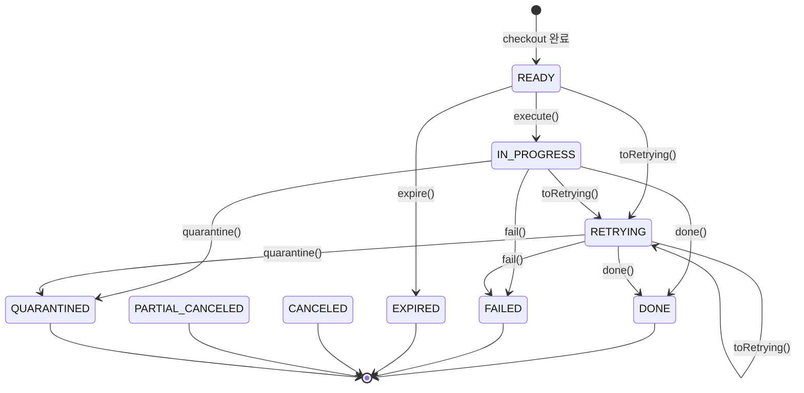
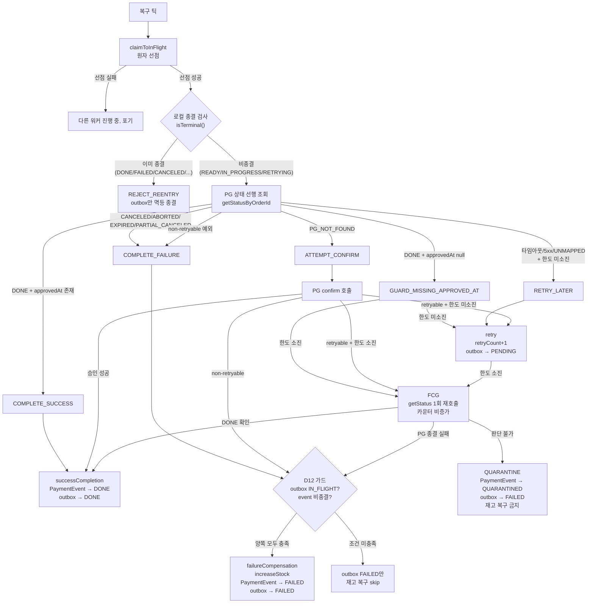

# PAYMENT-DOUBLE-FAULT-RECOVERY 완료 브리핑

## 작업 요약

기존 결제 플랫폼의 복구 사이클(`OutboxProcessingService`)은 PG 상태를 확인하지 않고 맹목적으로 confirm을 재발행하는 구조였다. Toss의 Idempotency-Key 덕분에 금전 중복은 막히지만, "PG에서 이미 DONE인 건을 로컬이 인지하지 못하는" 경우와 "PG에 없는 주문을 불필요하게 confirm 재시도하는" 경우를 동일한 방식으로 처리하고 있었다. 매핑되지 않는 Toss 응답 상태는 `PaymentStatus.UNKNOWN`으로 조용히 흡수되어 누구도 이를 알아차리지 못했고, 반복 판단 불가 상황에 대한 종결 경로가 없어 IN_FLIGHT timeout 복구를 통해 무한히 재진입하는 구조적 문제가 있었다.

이 작업은 16개 이중장애 케이스를 전수 분석한 뒤, 복구 사이클을 "getStatus 선행 조회 → RecoveryDecision 도메인 판단 → 결정 적용"이라는 단일 진입점 구조로 전면 재작성했다. PG 상태를 항상 먼저 확인하므로 로컬이 놓친 DONE/FAILED를 즉시 동기화할 수 있고, 판단 불가한 건은 새로 도입한 QUARANTINED 상태로 격리하여 자동 복구 사이클에서 영구 이탈시킨다. 재고 복구는 D12 가드(TX 내 재조회 기반 이중 조건)를 통해 "outbox가 IN_FLIGHT이고 PaymentEvent가 비종결"일 때만 실행되도록 제한하여, 보상 트랜잭션 중복 진입으로 인한 재고 이중 복구를 원천 차단한다.

결과적으로 65개 파일에 걸쳐 4,828줄 추가 / 304줄 삭제가 이루어졌으며, 모든 복구 결정이 순수 도메인 값 객체(`RecoveryDecision`)에 집중되어 Spring 의존 없이 테스트 가능한 구조가 되었다.

## 핵심 설계 결정

### D1 — getStatus 선행 단일 진입점

`OutboxProcessingService.process()`가 confirm을 먼저 발행하는 대신, `getStatusByOrderId`를 항상 먼저 호출하여 PG의 실제 상태를 확인한 뒤 분기한다. 이를 통해 복구 결정의 근거가 "맹목적 재시도 결과"가 아닌 "PG의 현재 상태"가 된다.

- **근거**: Idempotency-Key로 confirm 재호출이 "안전"하긴 하지만, "안전하다"와 "옳다"는 다르다. PG가 이미 DONE인데 confirm을 재발행하는 것은 불필요한 PG 호출이며, 로컬이 놓친 DONE 상태를 복구할 기회를 지연시킨다.
- **기각된 대안**: (a) confirm 우선/실패 시만 getStatus — 현 구조와 동일해서 UNKNOWN 재생산. (b) confirm/getStatus 병행 — Toss 요청량 2배. (c) 초회만 confirm, 재진입만 getStatus — 동일 코드 경로에 두 분기가 생겨 유지보수 비용 증가.

### D5 — QUARANTINED 상태 도입

`PaymentEventStatus`에 QUARANTINED를 추가하여, 한도를 소진하고도 판단이 불가능한 건을 자동 복구 사이클에서 영구 이탈시킨다. 격리 건은 메트릭/로그/DB 쿼리로만 관측되며 복구 사이클은 해당 건을 다시 선점하지 않는다.

- **근거**: `PaymentEventStatus`는 결제 건의 생명주기를 표현한다. "사람 개입 필요"는 생명주기상의 터미널 상태이므로 여기에 둔다. `PaymentOutboxStatus`는 배치 처리 레인이므로 격리 건은 FAILED로 표현하고, "왜 빠졌는지"는 `PaymentEvent.status = QUARANTINED` + `statusReason`으로 표현한다(D6).
- **기각된 대안**: `PaymentStatus`에 추가 — PG 응답 매핑 enum이지 로컬 의사결정이 아님. `PaymentOutboxStatus`에 추가 — 배치 큐 단일 책임 위반. `UNRECOVERABLE`/`NEEDS_REVIEW` 등 — 의미가 과하거나 애매.

### D7 — Final Confirmation Gate(FCG)

retry 한도 소진 시 무조건 격리하는 대신, `getStatusByOrderId`를 1회 더 호출하여 최종 판단 기회를 부여한다. 이 마지막 조회에서 DONE이면 성공 처리, PG 종결 실패이면 실패 처리, 여전히 판단 불가하면 그제서야 QUARANTINED로 격리한다.

- **근거**: confirm retryable 실패(타임아웃/5xx)는 "PG 처리 여부 미상"이다. 한도 소진 시점의 마지막 confirm 호출이 실제 PG 승인을 유발했을 수 있고, getStatus 재확인 없이 COMPLETE_FAILURE + 재고 복구로 직진하면 "돈은 나갔는데 로컬은 FAILED + 재고 환원"이라는 이중장애 창이 열린다.
- **기각된 대안**: 마지막 RecoveryDecision 사유만으로 자동 분기 — confirm 타임아웃 직후 PG 체결된 건을 FAILED로 확정하는 케이스를 못 막음. 한도 소진 시 무조건 QUARANTINE — 1차 장애(PG에도 없는 주문)로 실패한 건까지 수동 개입 큐에 쌓이고 재고가 장기간 점유됨.

### D10 — RecoveryDecision 값 객체

복구 결정 로직을 순수 도메인 값 객체에 집중시켰다. `RecoveryDecision.from(event, pgStatus)`는 PG 상태 + 로컬 상태를 입력받아 7가지 결정(COMPLETE_SUCCESS, COMPLETE_FAILURE, ATTEMPT_CONFIRM, RETRY_LATER, GUARD_MISSING_APPROVED_AT, QUARANTINE, REJECT_REENTRY) 중 하나를 반환한다.

- **근거**: Spring 의존 없이 테스트 가능하며, 모든 복구 분기가 하나의 팩토리 메서드에 집중되어 카탈로그 16건의 방어선이 코드 한 곳에서 확인된다.

### D12 — 재고 복구 가드

`executePaymentFailureCompensationWithOutbox` 내부에서 TX 시작 시점에 outbox와 PaymentEvent를 다시 조회하여, (1) outbox가 IN_FLIGHT이고 (2) PaymentEvent가 비종결일 때만 `increaseStockForOrders`를 호출한다.

- **근거**: 보상 TX 커밋 직후 응답 처리 전에 프로세스가 죽어 재선점되는 경우, TX 원자성만으로는 "이미 종결된 건에 재고가 또 더해지는" 사고를 막지 못한다. 상태 조건으로 이중 차단하는 것이 이중장애 복구의 원칙에 부합한다.
- **기각된 대안**: `PaymentOrder`에 재고 복구 완료 플래그 — 도메인 엔티티에 배치 재진입 상태를 새기는 것은 경계 오염. `PaymentOutbox`에 `stockRestoredAt` 컬럼 — outbox IN_FLIGHT 판정 하나로 충분하며 migration 비용만 증가.

## 변경 범위

### 도메인 (domain)

- **`PaymentEventStatus`**: QUARANTINED 추가. `isTerminal()` 메서드 신설 — exhaustive switch로 종결 여부 판정의 단일 진실 원천(SSOT) 역할. 기존 3곳의 `LOCAL_TERMINAL_STATUSES` / `NON_TERMINAL_STATUSES` Set 중복을 제거.
- **`PaymentEvent`**: `quarantine(reason, timestamp)` 메서드 추가 (허용 source: READY/IN_PROGRESS/RETRYING). `done(approvedAt)` 메서드에 approvedAt null 가드 추가 (D10). `fail()` 메서드에 종결 상태 no-op 방어 추가.
- **`RecoveryDecision`**: 신규 값 객체. `from(event, pgStatus, retryCount, maxRetries)` 팩토리와 `fromException(exception, retryCount, maxRetries)` 팩토리로 7가지 결정을 생산.
- **`RecoveryReason`**: 신규 enum. 결정의 사유를 표현 (PG_TERMINAL_FAIL, GATEWAY_STATUS_UNKNOWN, UNMAPPED, STATUS_UNKNOWN, GUARD_MISSING_APPROVED_AT).
- **`PaymentStatus`**: UNKNOWN 값 삭제. `of()` 매핑 실패 시 `PaymentGatewayStatusUnmappedException` throw.
- **`PaymentGatewayStatusUnmappedException`**: 신규 unchecked 예외. 매핑 실패를 조용한 흡수 대신 명시적 예외로 승격.

### Application (application)

- **`PaymentTransactionCoordinator`**: `executePaymentQuarantineWithOutbox` 신규 TX 메서드 추가. `executePaymentFailureCompensationWithOutbox` 시그니처 변경 — D12 가드 적용 (TX 내 outbox/event 재조회 후 조건부 재고 복구). `NON_TERMINAL_STATUSES` Set 제거, `isTerminal()` 사용으로 전환.
- **`PaymentQuarantineMetrics`**: 신규. `payment_quarantined_total` Micrometer 카운터 (tag: reason).

### Infrastructure (infrastructure)

- **`TossPaymentGatewayStrategy`**: `getStatusByOrderId` 예외 매핑 정비. retryable(타임아웃/5xx)은 `PaymentTossRetryableException`, non-retryable(4xx/PG_NOT_FOUND)은 `PaymentTossNonRetryableException`으로 분류.

### Scheduler (scheduler)

- **`OutboxProcessingService`**: 전면 재작성. `process()` → `resolveStatusAndDecision()` → `applyDecision()` → `handleFinalConfirmationGate()` 구조. getStatus 선행, RecoveryDecision 기반 분기, FCG 경로, 로컬 종결 시 REJECT_REENTRY 처리. `LOCAL_TERMINAL_STATUSES` Set 제거, `isTerminal()` 사용으로 전환.

### 도메인 상태 전이 확장

- `toRetrying()` 허용 source에 READY 추가 (D11). 복구 사이클이 READY 상태의 건도 RETRYING으로 전이 가능.

## 다이어그램

### PaymentEventStatus 상태 머신

### 복구 사이클 플로우 (OutboxProcessingService.process)

## 코드 리뷰 요약

Review 단계에서 Critic과 Domain Expert가 각각 1라운드 교차 리뷰를 수행했다. 총 3건의 major와 7건의 minor가 식별되었으며, 전부 해소되었다.

### Major findings (3건)

1. **F-01: GUARD_MISSING_APPROVED_AT 소진 경로 무한 재시도 위험** (Critic)
   — `RecoveryDecision.from()`에서 retryCount/maxRetries를 고려하지 않고 무조건 GUARD_MISSING_APPROVED_AT를 반환하여, PG가 지속적으로 DONE+null approvedAt을 반환하면 무한 retry 루프 발생 가능.
   → **해소**: `RecoveryDecision.from()`에서 `retryCount >= maxRetries`일 때 GUARD_MISSING_APPROVED_AT 대신 QUARANTINE을 직접 반환하도록 수정. `applyDecision`의 GUARD_MISSING_APPROVED_AT 분기에도 소진 검사를 추가하여 FCG로 연결. 테스트 추가.

2. **F-02: LOCAL_TERMINAL_STATUSES 3중 중복 — 불변식 동기화 위험** (Critic)
   — 종결 상태 집합이 `RecoveryDecision`, `OutboxProcessingService`, `PaymentTransactionCoordinator` 3곳에서 독립 정의. 향후 종결 상태 추가 시 동기화 실패 위험.
   → **해소**: `PaymentEventStatus.isTerminal()` 메서드를 신설하여 exhaustive switch 기반 단일 진실 원천으로 통합. 3곳의 Set 상수를 모두 제거하고 `isTerminal()` 호출로 대체.

3. **DE-1: FCG COMPLETE_SUCCESS 경로에서 stale paymentEvent 사용** (Domain Expert)
   — FCG에 도달하기까지 retry TX를 거치면 DB의 PaymentEvent는 RETRYING이지만 메모리 객체는 IN_PROGRESS. JPA merge 시 audit trail에 잘못된 previousStatus 기록 가능.
   → **해소**: `handleFinalConfirmationGate()`에서 paymentEvent 파라미터를 제거하고, 메서드 내부에서 DB로부터 fresh reload하도록 변경.

### Minor findings (7건)

- **F-03**: `catch (Exception e)` convention 위반 → 기존 코드 패턴이므로 TODOS.md 기록으로 처리
- **F-04**: RecoveryReason의 미사용 enum 값(PG_NOT_FOUND, CONFIRM_RETRYABLE_FAILURE) → dead code 제거
- **F-05**: NonRetryable 예외 시 retryCount 무관 ATTEMPT_CONFIRM 반환 → `RecoveryDecision.fromException()` Javadoc에 3-exception 계약 명시 (의도적 설계임을 문서화)
- **DE-2**: GUARD_MISSING_APPROVED_AT 무한 재시도 → F-01과 동일 이슈, 함께 해소
- **DE-3**: FCG COMPLETE_FAILURE에서 stale paymentOrderList → D12 가드가 TX 내 재조회하므로 실질 위험 없음, 현 상태 유지
- **DE-4**: rejectReentry에서 TX 경계 밖 도메인 변경 → claimToInFlight 선점으로 동시성 배제되어 실질 위험 없음. TX 경계 의도 주석 추가
- **DE-5**: fromException의 checked/unchecked 혼합 수신 → Javadoc 보강으로 처리

## 수치

| 항목 | 값 |
|------|---|
| 태스크 | 11개 |
| 테스트 | 324개 통과 |
| 커밋 | 39개 (TDD RED/GREEN + review 수정 포함) |
| 코드 리뷰 findings | critical 0 / major 3 / minor 7 (전부 해소) |
| 변경 규모 | 65 files, +4,828 / -304 |
| 방어 케이스 | 16건 전수 커버 |
