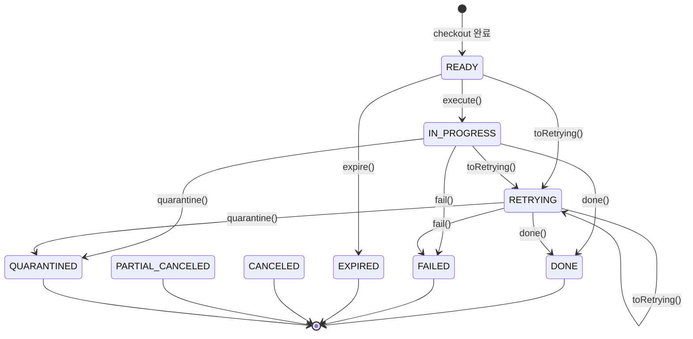
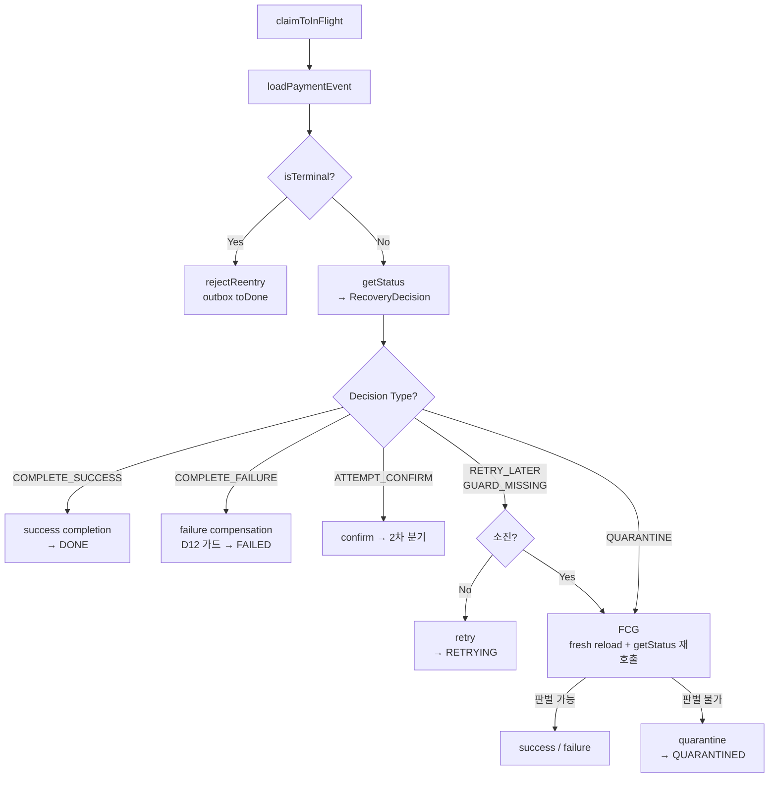

# PAYMENT-DOUBLE-FAULT-RECOVERY 완료 브리핑

## 작업 요약

기존 OutboxProcessingService의 "confirm 먼저 호출 → 결과 분기" 구조를 "PG 상태 선행 조회 → RecoveryDecision → 분기" 복구 사이클로 전면 재작성했다. PG가 이미 결제를 완료했지만 로컬이 인지하지 못한 이중장애 상황에서 돈이 새거나 재고가 잘못 복원되는 경로를 차단하고, 판단 불가한 건은 QUARANTINED 상태로 격리해 수동 확인 대상으로 분리한다.

## 핵심 결정

- **D1 — getStatus 선행 조회**: confirm 전에 PG 상태를 먼저 확인해 이미 DONE인 건의 중복 confirm을 방지
- **D5 — QUARANTINED 상태**: 기존 FAILED와 분리. 판단 불가한 건을 정상 실패와 구별해 관리자가 식별 가능
- **D7 — Final Confirmation Gate(FCG)**: retry 소진 시 getStatus 1회 재호출로 최종 판단 기회 부여. 성공/실패 판별 가능하면 정상 처리, 불가하면 격리
- **D10 — RecoveryDecision 값 객체**: 복구 결정 로직을 순수 도메인에 표현. Spring 의존 없이 테스트 가능
- **D12 — 재고 복구 가드**: TX 내 outbox/event 재조회 후 IN_FLIGHT + 비종결 조건 충족 시에만 재고 복구. 보상 중복 실행 방지

## 상태 머신

## 복구 사이클 플로우

## 수치

| 항목 | 값 |
|------|---|
| 태스크 | 11개 |
| 테스트 | 324개 통과 |
| 커밋 | 37개 (TDD RED/GREEN + review 수정 포함) |
| 코드 리뷰 findings | critical 0 / major 3 / minor 7 (전부 해소) |
