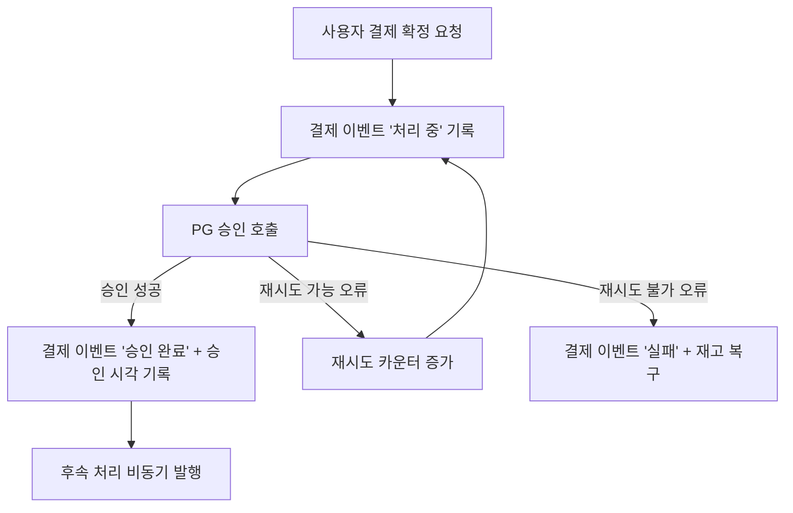
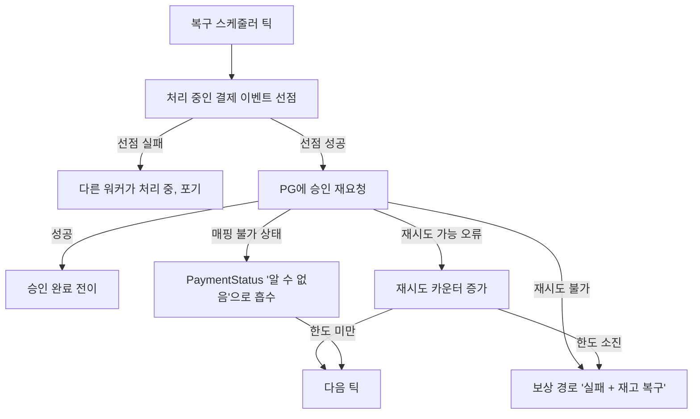
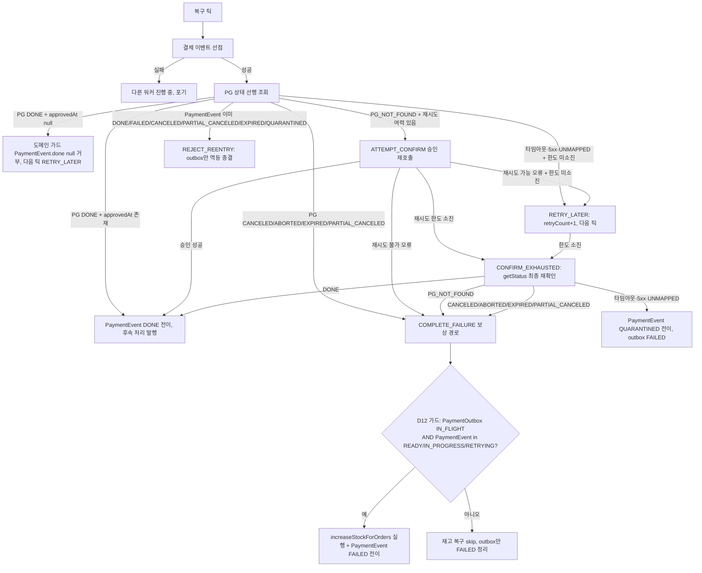
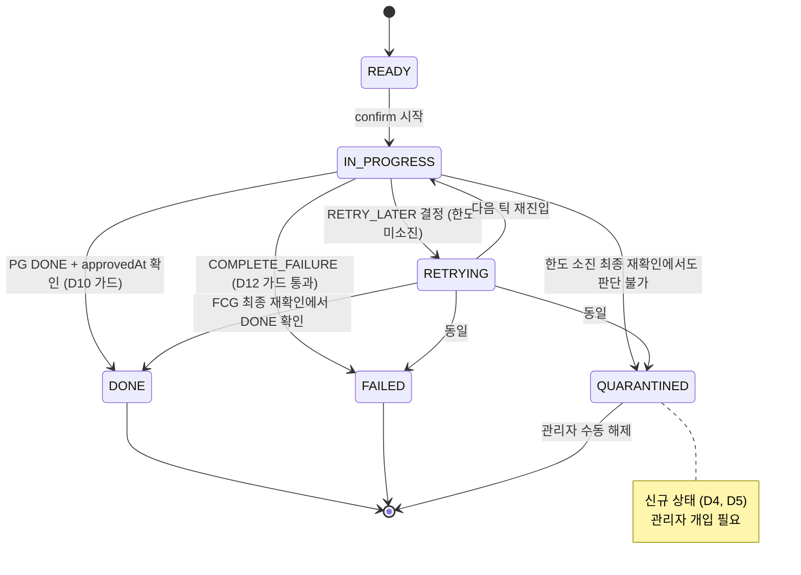

# PAYMENT-DOUBLE-FAULT-RECOVERY — discuss 사전 브리핑

## 1. 현재 이해한 문제

결제 처리 도중 서버가 언제 죽어도 데이터가 유실되지 않고, 재기동 후 복구 사이클이 같은 건을 안전하게 마무리할 수 있어야 한다. 현재는 복구 시 무조건 승인 재요청을 돌리고, 판단 불가 상황은 "알 수 없음"으로 정상 흐름에 섞여 있다.

## 2. 현재 시스템 동작 (as-is)

### 2-1. 정상 승인 경로

### 2-2. 서버 재기동 후 복구 사이클

**핵심 문제점 (현재 동작)**:
- 복구 시 **PG 상태 조회 없이 바로 승인 재호출** — PG 실제 상태와 어긋날 수 있음
- `PaymentStatus.UNKNOWN`이 정상 흐름의 한 갈래 — 관리자가 볼 수 없음
- `RETRYING` 상태 enum은 존재하나 실제 진입 경로 없음
- 한도 소진 건이 **격리(사람 개입 필요)** 와 **실패 확정(자동 보상)** 중 어느 쪽인지 케이스별로 갈리는데 현재는 일률 보상

## 3. 이번 discuss에서 결정하려는 것

- **복구 사이클의 공통 진입점**: getStatus 선행 조회를 넣어 모든 이중장애 케이스를 한 메서드에서 분기할 것인가 (사용자 요구: "한 곳에서 유지보수 용이")
- **재시도 가능/불가 오류의 분류 기준과 한도 N**: 몇 회, 어떤 오류가 재시도 대상인가
- **`RETRYING` 상태의 의미 확정**: "재시도 진입 된 건만"으로 제한 — 진입/이탈 규칙
- **`UNKNOWN` / 격리 상태의 용도 재정의**: 한도 소진 후 관리자 개입 필요 건만, 정상 흐름에서 제거
- **Toss idempotency(orderId pass-through) 활용 방식**: 동일 승인 호출을 안전 재호출로 쓸 수 있는 범위, getStatus 선행과의 조합

## 4. 열린 질문 / 가정

- 재시도 한도 N 기본값은 얼마로 둘 것인가 (3? 5?) — 틱 주기와 함께 결정 필요
- 격리 상태의 네이밍: `UNKNOWN` 재활용 vs 신규 상태(`QUARANTINED` 등) 도입
- "승인 시각 없는 승인 완료"는 PG 응답에서 발생 가능한가, 아니면 우리 코드 경로에서만 만들어지는가 — 차단 지점 결정에 영향
- 보상 중 부분 실행(재고만 복구됨)의 재개 기준: 결제 이벤트 상태를 소스 오브 트루스로 볼 것인가
- 케이스 카탈로그 16개 전부를 discuss 범위에 포함할 것인가, 일부를 후속 작업으로 미룰 것인가

---

# PAYMENT-DOUBLE-FAULT-RECOVERY — discuss 완료 브리핑

Round 1 → 2에서 critic/domain-expert 모두 pass. 설계 문서 `docs/topics/PAYMENT-DOUBLE-FAULT-RECOVERY.md` 확정.

## 1. 결정된 접근

복구 사이클을 **"PG 상태 먼저 조회 → 결과에 따라 분기"** 단일 메서드로 통합한다. 재시도 한도 내에서는 자동 재시도(3회, 기존 Toss retryable 분류 재사용), 한도 소진 시점에서도 **반드시 PG 상태를 한 번 더 재확인**한 뒤 결과에 따라 승인 완료/실패 확정/격리로 갈라진다. "알 수 없음" 상태는 정상 흐름에서 제거하고, 판단 불가 건만 신규 **격리 상태**로 옮겨 관리자가 보게 한다. 재고 복구는 배치 진행 중이고 결제 이벤트가 종결되지 않은 경우에만 수행하는 가드를 둔다.

## 2. 변경 후 동작 (to-be)

### 2-1. 복구 사이클 플로우 (단일 진입점)

### 2-2. 상태 모델 변경 (PaymentEventStatus)

## 3. 핵심 결정 ID

- **D1** — 복구 진입점은 단일 메서드, `getStatusByOrderId` 선행
- **D2** — 재시도 한도 N=3, 기존 Toss retryable/non-retryable 분류 재사용
- **D3** — `PaymentStatus.UNKNOWN` 완전 제거 (매핑 실패는 예외로 승격)
- **D4 / D5** — 신규 격리 상태 `QUARANTINED`를 `PaymentEventStatus`에 추가
- **D6** — 격리 시 outbox 표현: `PaymentOutbox=FAILED` + `PaymentEvent=QUARANTINED`
- **D7** *(R2 수정)* — 한도 소진 시 `getStatus` 최종 재확인 필수. 결과별 분기 (완료/실패/격리)
- **D8** — Idempotency-Key = orderId pass-through 유지
- **D9** — 기존 `claimToInFlight` 유지, 가능하면 DB 원자 연산 강화
- **D10** — `PaymentEvent.done()` 가드: 승인 시각 null이면 전이 거부
- **D11** — 계층 배치 (도메인 `RecoveryDecision`, application coordinator, 포트 재사용)
- **D12** *(R2 신규)* — 재고 복구 재진입 방지 가드: `outbox.status==IN_FLIGHT && event 비종결`일 때만 재고 복구 실행. 둘 중 하나라도 "이미 끝난 건"의 신호이므로, AND로 묶어 아직 아무도 손대지 않은 건임이 확실할 때만 재고를 복구한다
- Micrometer `payment_quarantined_total{reason}` 카운터 in-scope

## 4. 알려진 트레이드오프 / 후속 작업

- **복구 사이클당 PG 호출 1회 추가** (getStatus 선행) — 돈 정확성과 교환, 비용 수용
- **D6 관측 한계**: outbox만 보면 실패와 격리 구분 불가 — 메트릭으로 보완, 필요 시 후속 라운드에서 `PaymentOutboxStatus.QUARANTINED` 도입 재논의
- **plan 단계 이월 3건 (minor)**:
  - D12 "event 비종결" 판정 시점 — TX 내 재조회로 명시
  - 한도 소진 최종 getStatus 재확인의 retry 카운터 취급 — 비증가 단발 호출, 실패 시 QUARANTINE 즉시 환원 명시
  - 이미 종결된 `PaymentEvent`에 `markPaymentAsFail` 호출 시 동작 (no-op vs 예외) 소스 검증
- `markPaymentAsRetrying` 허용 source 상태 매트릭스는 §6에 명시됨
- QUARANTINED 수동 해제 UI/운영 절차는 본 작업 범위 밖
