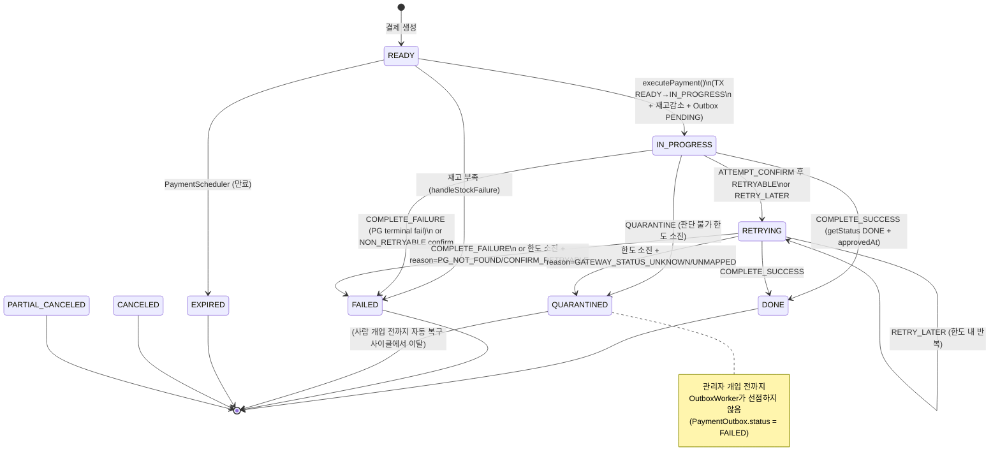
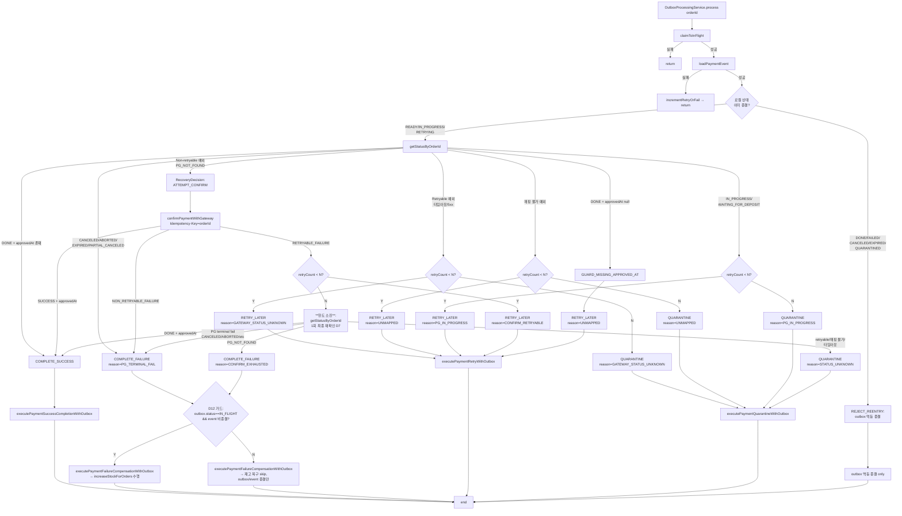

# PAYMENT-DOUBLE-FAULT-RECOVERY

> Round 1 architect 초안. 이전 discuss/plan 아카이브 내용은 참조하지 않음.
> 입력 재료: `docs/topics/PAYMENT-DOUBLE-FAULT-RECOVERY-CASES.md`, `docs/rounds/payment-double-fault-recovery/discuss-interview-0.md`

---

## §1 문제 정의 — 이중장애 복구

### 1.1 "이중장애"의 의미

본 토픽에서 "이중장애(double fault)"란 **로컬 DB 상태와 PG 실제 상태가 불일치하는 모든 상황**을 가리킨다. 단순한 1차 장애(PG 호출 실패)는 기존 retry/compensation 경로로 이미 처리되지만, 아래 같은 조합은 현재 코드가 안전하게 회복하지 못한다.

- 로컬 트랜잭션 직전/직후 프로세스 종료 → PG 상태 미상
- PG 호출 직후 응답 수신 전 프로세스 종료 → PG에는 결과 존재, 로컬은 IN_FLIGHT
- 보상 트랜잭션 부분 실행(재고 복구 완료, PaymentEvent 전이 실패 등)
- PG 조회/승인 반복 판단 불가 응답 → 로컬이 어디로도 전이할 수 없음

### 1.2 이번 작업의 범위

**in-scope**
- 카탈로그 16건(= 파일 내 14개 케이스 + 케이스 묘사 안에 포함된 세부 2분기) 전수에 대한 방어선 결정
- 복구 진입 경로의 단일화(`getStatus` 선행 → 응답 기반 분기)
- `PaymentStatus.UNKNOWN` 제거, 격리 상태 `QUARANTINED` 도입
- `PaymentEventStatus.RETRYING` 의미 정의(재시도 진입 건 전용)
- 기존 retryable/non-retryable 분류 재사용
- Toss Idempotency-Key(= orderId pass-through) 기반 안전한 재호출
- QUARANTINED 진입 최소 관측: Micrometer counter 1개(`payment_quarantined_total`, tag=`reason`) — 격리 빌드업 추적을 위한 최저선 *(Round 2 승격)*

**non-goals**
- 복구 사이클 주기(`OutboxWorker` fixedDelay) 재튜닝
- 재시도 백오프 전략 변경(기존 `RetryPolicy` FIXED/EXPONENTIAL 그대로)
- 관리자 UI/알림 채널 신설 — QUARANTINED 건은 로그/메트릭/DB 조회로만 노출
- 다중 PG 벤더 추가
- `claimToInFlight`를 분산락/큐 기반으로 교체 — DB 원자 업데이트 강화만 시도, 실패 시 현 상태 유지
- `PaymentConfirmChannel` 용량/워커 수 변경
- 신규 상태의 관리자 복구 API(격리 건 수동 재처리) — 후속 작업

---

## §2 현재 시스템 상태 (as-is)

### 2.1 관련 파일/컴포넌트

| 계층 | 파일 | 역할 |
|---|---|---|
| scheduler | `OutboxProcessingService` | 복구 사이클 공유 처리 로직 (`claimToInFlight` → `confirmPaymentWithGateway` → 성공/재시도/실패) |
| scheduler | `OutboxWorker` | `@Scheduled` 폴백. `recoverTimedOutInFlightRecords` 후 PENDING 배치 처리 |
| scheduler | `OutboxImmediateWorker` | 정상 경로 VT/PT 워커. `PaymentConfirmChannel.take()` → `OutboxProcessingService.process` |
| application | `PaymentTransactionCoordinator` | 모든 TX 경계. `executePayment*WithOutbox` 메서드 보유 |
| application/port | `PaymentGatewayPort` | `confirm`, `cancel`, **`getStatusByOrderId`**(현재 **사용처 없음**) |
| infrastructure/gateway | `TossPaymentGatewayStrategy` | `getStatusByOrderId` 구현체 존재 |
| domain | `PaymentEvent`, `PaymentEventStatus` | `READY`, `IN_PROGRESS`, `RETRYING`, `DONE`, `FAILED`, `CANCELED`, `PARTIAL_CANCELED`, `EXPIRED` |
| domain | `PaymentStatus`(PG 응답 매핑 enum) | `DONE`, `IN_PROGRESS`, `CANCELED`, `PARTIAL_CANCELED`, `ABORTED`, `EXPIRED`, `WAITING_FOR_DEPOSIT`, **`UNKNOWN`** |
| domain | `PaymentOutbox`, `PaymentOutboxStatus` | `PENDING`, `IN_FLIGHT`, `DONE`, `FAILED` |

### 2.2 현재 복구 사이클

1. `OutboxWorker`가 틱마다 `claimToInFlight(orderId)` → 원자 UPDATE PENDING→IN_FLIGHT
2. 성공 시 `confirmPaymentWithGateway`를 **무조건 재호출**(= 매번 `POST /v1/payments/confirm`)
3. 결과로 `PaymentConfirmResultStatus`(SUCCESS/RETRYABLE/NON_RETRYABLE) 분기
4. `getStatusByOrderId`는 포트/구현체만 있고 호출되지 않는다
5. 매핑되지 않는 Toss 응답 상태는 `PaymentStatus.UNKNOWN`으로 fallback 되어 조용히 흡수된다

### 2.3 현재 구조가 안고 있는 취약점

- 동일 orderId에 대해 confirm이 맹목적으로 반복 발행된다. Toss Idempotency-Key가 같은 응답을 주므로 "금전 중복"은 막히지만, **PG 상태를 먼저 보는 절차가 없어** "이미 DONE인데 로컬을 전이할 기회를 놓치는" 경우와 "PG에는 없는데 로컬이 불필요하게 confirm 재시도" 경우를 같은 방식으로 취급한다.
- `UNKNOWN`이 enum에 있는 한, 매핑 누락이 "정상 흐름의 한 갈래"로 취급될 여지가 남는다.
- `RETRYING` 상태는 "실제 retry 대기 중"이라는 명확한 의미 없이 여러 경로에서 설정된다.
- 반복 판단 불가 상황에 대한 종결 경로가 없다 → IN_FLIGHT timeout 복구를 통해 무한히 재진입한다.

---

## §3 목표 상태 (to-be)

### 3.1 단일 복구 진입점

`OutboxProcessingService.process(orderId)`를 다음 구조로 **단일화**한다 (분기가 나뉘어 있는 "confirm 경로"와 "recovery 경로"를 두지 않는다).

```
process(orderId):
  claim     = claimToInFlight(orderId)          // 원자 선점
  event     = loadPaymentEvent(orderId)         // 실패 → incrementRetryOrFail
  snapshot  = paymentGatewayPort.getStatusByOrderId(orderId)   // ★ 선행 조회
  decision  = RecoveryDecision.from(event, snapshot)            // 도메인 판단
  apply(decision)                                                // TX 경계 진입
```

- `getStatusByOrderId`는 **항상 먼저 호출**된다. confirm 요청을 먼저 발행하지 않는다.
- 판단과 전이는 도메인(`RecoveryDecision`)이 수행한다. 어댑터/서비스는 번역/위임만 한다.
- `apply(decision)`은 결정 종류에 따라 기존 `PaymentTransactionCoordinator`의 메서드(`executePaymentSuccessCompletionWithOutbox`, `executePaymentFailureCompensationWithOutbox`, `executePaymentRetryWithOutbox`) 또는 신규 격리 메서드(`executePaymentQuarantineWithOutbox`)로 매핑된다.

### 3.2 `RecoveryDecision`(도메인)

포트 응답(`PaymentStatus` + 부가 필드)을 입력받아, 다음 중 하나로 환원한다.

| Decision | 의미 | TX 경로 |
|---|---|---|
| `COMPLETE_SUCCESS` | PG DONE + approvedAt 존재 | `executePaymentSuccessCompletionWithOutbox` |
| `COMPLETE_FAILURE(reason)` | PG 취소/중단/만료/부분취소 등 종결 실패 | `executePaymentFailureCompensationWithOutbox` |
| `ATTEMPT_CONFIRM` | PG에 주문 없음(진짜 없음) 또는 승인 미착수 | `confirmPaymentWithGateway` → 결과 재평가 |
| `RETRY_LATER(reason)` | PG 진행 중 / 조회 오류(타임아웃/5xx) / confirm RETRYABLE_FAILURE | `executePaymentRetryWithOutbox` (한도 내) |
| `QUARANTINE(reason)` | 한도 소진 && 누적 판단 불가 (매핑 불가 포함) | `executePaymentQuarantineWithOutbox` |
| `REJECT_REENTRY` | 로컬이 이미 종결(`DONE`/`FAILED`/`CANCELED`/`EXPIRED`) | outbox만 멱등 종결, 상태머신 미접촉 |
| `GUARD_MISSING_APPROVED_AT` | PG가 DONE인데 approvedAt이 비어있음 | 도메인에서 예외 — `PaymentEvent.done()` 진입 차단 |

### 3.3 상태 모델 변경

- `PaymentStatus.UNKNOWN` **제거**. Toss 응답 enum 매핑이 실패하면 도메인 예외 `PaymentGatewayStatusUnmappedException`을 던지고, 복구 사이클은 이를 `RETRY_LATER(UNMAPPED)` 또는 한도 소진 시 `QUARANTINE(UNMAPPED)`로 환원한다. "알 수 없음"을 정상 흐름에 두지 않는다.
- **`QUARANTINED`는 `PaymentEventStatus`에 추가**한다. (§4 D5 참조)
- `PaymentEventStatus.RETRYING`은 **`ATTEMPT_CONFIRM` 또는 confirm 결과가 `RETRYABLE_FAILURE`여서 다음 틱을 기다리는 건에만** 부여된다. 단순 `getStatus` 조회 실패로 한 틱 쉬는 건도 retry 한도를 공유하되, `RETRYING`으로 전이한다(= "재시도 사이클에 진입했음"의 의미 유지).
- `PaymentOutbox`에는 신규 상태를 추가하지 않는다. QUARANTINED 건은 `PaymentOutbox.status = FAILED` + `PaymentEvent.status = QUARANTINED`로 표현하거나(= §4 D6), 필요 시 후속 라운드에서 outbox 전용 상태를 논의한다. 1안(D6 채택)으로 진행한다.

### 3.4 에러 분류 재사용

- Toss 어댑터의 기존 `PaymentTossRetryableException` / `PaymentTossNonRetryableException` 분류를 `getStatusByOrderId` 경로에도 **동일하게 적용**한다. 타임아웃/5xx → retryable, 4xx(주문 없음 포함) → non-retryable.
- "PG에 없는 주문" 은 non-retryable이지만 **`RecoveryDecision`에선 `ATTEMPT_CONFIRM`으로 환원**된다 (PG에 아직 승인 시도가 안 된 것이지, 실패가 아니기 때문). 이 구분은 도메인 책임이다.
- 1차 confirm 경로의 분류는 그대로 `PaymentConfirmResultStatus`를 사용한다.

---

## §4 핵심 결정(Decision Log)

> 각 결정은 "선택 / 근거 / 기각된 대안"을 포함한다.

### D1 — 복구 진입점은 단일 메서드, getStatus 선행

**선택**: `OutboxProcessingService.process(orderId)` 내부에서 `getStatusByOrderId`를 항상 먼저 호출한 뒤 분기한다.
**근거**: Idempotency-Key 덕분에 confirm 재호출이 "안전"하긴 하지만, "안전하다"와 "옳다"는 다르다. 현재 코드는 PG 상태를 전혀 보지 않고 맹목적으로 confirm을 발행하기 때문에, 로컬이 놓친 DONE/FAILED 상태를 "자기만의 사이클"로 복구한다. getStatus 선행은 복구 결정을 도메인 단일 지점(`RecoveryDecision`)으로 모으기 위한 전제다.
**기각**: (a) confirm 우선·실패 시만 getStatus — 현재 구조와 동일해서 UNKNOWN 재생산. (b) confirm/getStatus 병행 — Toss 요청량 2배. (c) 초회만 confirm 직행, 재진입만 getStatus 선행 — 동일 코드 경로에 두 분기가 생겨 유지보수 비용 증가.

### D2 — 재시도 한도 N = 3, 분류는 기존 Toss retryable/non-retryable 재사용

**선택**: `RetryPolicyProperties.maxAttempts` 기본값을 3으로 쓰되, 복구 사이클(getStatus + confirm) **양쪽이 같은 카운터를 공유**한다.
**근거**: 분리 카운터를 두면 "getStatus는 3회 실패하고 confirm은 2회 실패" 같은 총 5회 호출이 발생. 사용자는 "재시도 한도 3회"를 한 건 단위로 이해한다.
**기각**: getStatus와 confirm에 별도 한도. → 누적 호출 폭증.

### D3 — `PaymentStatus.UNKNOWN` 완전 제거

**선택**: enum 값 삭제 + 매핑 fallback 제거. 매핑 실패는 `PaymentGatewayStatusUnmappedException`(unchecked, domain 예외)로 승격.
**근거**: "알 수 없음"을 정상 enum에 두는 한, 매핑 누락을 누구도 알아차리지 못한다. 예외로 승격하면 기본 동작은 "판단 불가 → 다음 틱" + 한도 소진 시 격리가 되어, 관측에 반드시 노출된다.
**기각**: `UNKNOWN`을 유지하되 메트릭 alert만 추가. → 휴먼 실수 재발 여지.

### D4 — 격리 상태 도입, 이름은 `QUARANTINED`

**선택**: 관리자 개입이 필요한 건 전용. 자동 복구 사이클에서 **영구 이탈**.
**근거**: "한도 소진 후에도 무한히 try하는" 현재의 암묵적 동작을 끊는다. 격리 건은 메트릭/로그/DB 쿼리로만 관측되며, 복구 사이클은 해당 건을 다시 선점하지 않는다.
**기각**: `UNRECOVERABLE`, `NEEDS_REVIEW`, `STUCK` 등. → 의미가 과하거나 애매.

### D5 — `QUARANTINED`는 `PaymentEventStatus`에 추가 (not `PaymentStatus`, not `PaymentOutboxStatus`)

**선택**: `PaymentEventStatus.QUARANTINED` 신규 enum 값.
**근거**:
1. `PaymentStatus`는 **PG 응답 매핑** enum이다. 격리는 로컬 의사결정이지 PG 상태가 아니다.
2. `PaymentOutboxStatus`는 **배치 처리 레인** enum이다. 격리는 "배치 레인에서 이탈" 의미로는 `FAILED`와 동치다.
3. `PaymentEventStatus`는 **결제 건의 생명주기**다. "사람 개입 필요"는 생명주기 상의 터미널 상태다.
**기각**: 모든 계층에 공유된 `RecoveryStatus` 신설 — 경계가 흐려진다. `PaymentOutboxStatus.QUARANTINED` — outbox는 "배치 큐"라는 단일 책임을 지켜야 한다.

### D6 — 격리 시 outbox 표현: `PaymentOutbox.status = FAILED` + `PaymentEvent.status = QUARANTINED`

**선택**: outbox 자체는 "배치 레인에서 빠진다"는 의미로 `FAILED`를 재사용하고, "왜 빠졌는지"는 `PaymentEvent.status = QUARANTINED` + `status_reason` 필드로 표현한다.
**근거**: outbox에 새 상태를 넣으면 `findPendingBatch` 인덱스/쿼리/metrics 경로가 모두 늘어난다. 현재 `FAILED` 는 "이 배치 레인에서 종결"의 의미를 이미 갖는다.
**기각**: `PaymentOutboxStatus.QUARANTINED` 추가 — 레인 종결 의미로는 중복.

### D7 — 한도 소진 시 케이스별 분기 규칙 *(Round 2 수정)*

**선택**: 한도 소진 시점에서 **무조건 `getStatusByOrderId`를 1회 더 호출해 최종 확인**한 뒤, 그 응답을 기준으로 분기한다. "마지막 RecoveryDecision의 사유"만으로 자동 실패 확정하지 않는다.

- `getStatus` 최종 응답이 `DONE + approvedAt` → `COMPLETE_SUCCESS` (한도 소진과 무관하게 승격 전이)
- `getStatus` 최종 응답이 PG 종결 실패(`CANCELED`/`ABORTED`/`EXPIRED`/`PARTIAL_CANCELED`) → `COMPLETE_FAILURE(PG_TERMINAL_FAIL)` + 재고 복구 (D12 가드 적용)
- `getStatus` 최종 응답이 non-retryable `PG_NOT_FOUND`이고 **직전까지 누적된 사유가 순수 1차 장애**(`CONFIRM_RETRYABLE_FAILURE` 또는 `PG_NOT_FOUND` 반복)인 경우 → `COMPLETE_FAILURE(CONFIRM_EXHAUSTED)` + 재고 복구 (D12 가드 적용)
- 그 외 판단 불가(`GATEWAY_STATUS_UNKNOWN`/`UNMAPPED`/`STATUS_UNKNOWN`/타임아웃) → `QUARANTINE(reason)` (재고 복구 금지)

**근거**: confirm retryable(타임아웃/5xx)은 "PG 처리 여부 미상"이다. 한도 소진 시점의 마지막 confirm 호출이 실제 PG 승인을 유발했을 수 있고, 이 상태에서 getStatus 재확인 없이 `COMPLETE_FAILURE` + 재고 복구로 직진하면 "돈은 나갔는데 로컬은 FAILED + 재고 환원" 이중장애 창이 열린다. D1("getStatus 선행")의 철학은 한도 소진 경계에서도 동일하게 적용되어야 한다. getStatus 1회 추가 호출 비용은 돈 정확성에 비해 무시할 수 있다.

**기각**:
- "마지막 RecoveryDecision의 사유만으로 자동 분기" (Round 1안) — confirm 타임아웃 직후 PG 체결된 건을 로컬 FAILED로 확정하는 케이스를 못 막는다.
- 한도 소진 시 무조건 `QUARANTINE` — 진짜 1차 장애(PG에도 없는 주문)로 실패한 건까지 수동 개입 큐에 쌓이고 재고가 장기간 점유된다.
- getStatus 최종 확인도 실패(타임아웃/매핑 불가)할 경우 `QUARANTINE`으로 환원 — "판단 불가 → 격리"의 기본 원칙 유지.

### D8 — Idempotency-Key = orderId, pass-through 유지

**선택**: Toss `Idempotency-Key` 헤더는 현재대로 `orderId`를 그대로 보낸다. 복구 사이클이 confirm을 재발행해도 같은 key이므로 PG는 동일 응답을 돌려준다.
**근거**: 재호출 금전 안전성의 유일한 근거. 변경 시 영향 반경이 지나치게 크다.
**기각**: 호출마다 새 key 발급 — 재호출 = 새 승인 시도. 위험.

### D9 — 동시성: 기존 `claimToInFlight` 유지 + DB 원자 연산 강화 시도

**선택**: 현재 `UPDATE … WHERE status='PENDING'` 기반 원자 선점을 유지한다. 실행 시점에 row version(`updated_at` or optimistic lock)을 추가 조건으로 넣을 수 있으면 강화한다. 강화가 복잡하면 현 상태 유지.
**근거**: "정확히 하나만 이긴다"는 이미 `claimToInFlight`로 달성된다. 강화는 멀티 인스턴스 환경에서 clock skew 여유를 주는 용도 정도.
**기각**: 분산락(Redis/ZK) 도입 — 인프라 추가 비용. 본 토픽 범위 초과.

### D10 — `PaymentEvent.done()` 가드: `approvedAt == null`이면 전이 거부

**선택**: `PaymentEvent.done(approvedAt)` 진입 시 `approvedAt` null이면 `PaymentStatusException` throw. "승인 완료 + 승인 시각 없음" 상태를 domain이 원천 차단.
**근거**: Toss 결제 규격상 `status == DONE`이면 `approvedAt`은 반드시 존재하므로, 현재 Toss 어댑터(`TossPaymentGatewayStrategy.convertToPaymentStatusResult`, confirm 응답 매핑) 정상 동작 조건에서는 **"DONE + approvedAt null"** 조합은 발생하지 않는다. 카탈로그의 해당 케이스도 "현재 구조의 알려진 구멍"이 아니다.

D10이 실제로 방어하는 것은 다음 경로다: (a) PG 계약 위반 — Toss가 엣지 케이스(부분 취소 직후, 대사 지연 등)에서 계약을 어기고 `DONE` + 공백/null approvedAt을 내려주는 경우, (b) DTO 매핑 회귀 — `PaymentInfrastructureMapper`가 필드 이름 변경·null 전파 등으로 `approvedAt`을 떨어뜨리는 회귀(`convertToPaymentStatusResult`는 상태와 시각의 일관성을 검증하지 않음), (c) 미래 PG adapter 추가 — `PaymentGatewayPort` 구현체가 다른 PG로 확장될 때 해당 PG의 계약이 Toss와 달라도 도메인 가드가 일관된 방어선 역할을 함, (d) confirm 응답 경로 — D10은 `PaymentEvent.done()` 진입점에 걸리므로 getStatus/confirm 어느 경로에서 흘러들어와도 동일하게 보호된다.

즉 D10은 "지금 뚫려 있는 구멍"이 아니라 **"승인 완료 + 승인 시각 부재라는 불가능해야 할 상태를 도메인이 원천 거부한다"**는 멱등 안전망이다. adapter나 application 레이어의 회귀·미래 변경에 무관하게 domain entity의 invariant로 보장된다.

**기각**: adapter에서만 검증 — 다른 경로/미래 adapter에서 동일 실수 재현 가능. 도메인 invariant로 고정하는 것이 일관됨.

### D11 — 계층 배치

**선택**:
- `RecoveryDecision` → `payment/domain/` (pure, Spring 의존 없음)
- `PaymentGatewayStatusUnmappedException` → `payment/exception/`
- `executePaymentQuarantineWithOutbox` → `PaymentTransactionCoordinator` (모든 TX 경계는 여기)
- `getStatusByOrderId` 호출자 → `OutboxProcessingService` (scheduler 계층, 기존 confirm 호출자와 동일)
- 신규 port 추가 없음 — `PaymentGatewayPort.getStatusByOrderId` 재사용

**근거**: 의존 방향 `port → domain → application → infrastructure → scheduler`를 유지. 복구 결정이 도메인에 있고, TX 경계가 application coordinator에 있고, PG 호출이 infrastructure 어댑터에 있다. scheduler는 순수 오케스트레이션.

### D12 — 재고 복구 재진입 방지 가드 *(Round 2 신규)*

**선택**: `PaymentTransactionCoordinator.executePaymentFailureCompensationWithOutbox`는 다음 **두 조건이 모두 참일 때에만** `orderedProductUseCase.increaseStockForOrders(paymentOrderList)`를 호출한다.
1. 메서드 진입 시점 `outbox.status == IN_FLIGHT` (= 이 호출이 현재 사이클에서 선점한 건임)
2. `paymentEvent.status`가 비종결(`READY` / `IN_PROGRESS` / `RETRYING`) — 즉 아직 `FAILED`/`CANCELED`/`EXPIRED`/`QUARANTINED`/`DONE`으로 전이되지 않음

두 조건 중 하나라도 거짓이면 `increaseStockForOrders` 호출을 건너뛰고 outbox 종결 및 `markPaymentAsFail` 전이만 수행한다(이 역시 이미 종결이면 no-op).

**근거**: 현재 `executePaymentFailureCompensationWithOutbox`는 무방어로 재고 복구를 실행한다(`PaymentTransactionCoordinator.java:61-71`). 메서드 자체가 `@Transactional`이므로 **"TX 중간 사망으로 재고만 복구되고 event는 전이되지 않는"** 부분 실행 시나리오는 현재 구조에서는 발생하지 않는다 — outbox 상태 변경, `increaseStockForOrders`, `markPaymentAsFail` 모두 하나의 DB 트랜잭션에서 커밋되거나 같이 롤백된다.

D12가 실제로 방어하는 것은 **TX 커밋 이후의 중복 진입**이다: (a) 보상 TX가 커밋된 직후 응답 처리 전에 죽어 재선점 로직이 다시 같은 건을 잡는 경우, (b) 선점/타임아웃 로직의 버그 또는 `claimToInFlight` 강화 이전의 race window에서 두 워커가 동일 건의 보상을 호출하는 경우, (c) 운영 중 수동 개입(outbox 상태 복원, QUARANTINED 수동 해제 등)으로 보상 경로가 재진입하는 경우, (d) D7 `CONFIRM_EXHAUSTED` 경로 추가로 `COMPLETE_FAILURE` 결정 지점이 늘어났을 때의 논리 버그. 이들 중 어느 하나라도 발생하면 TX 단위 원자성만으로는 **"이미 종결된 건에 재고가 또 더해지는"** 사고를 막지 못한다.

즉 D12는 "현재 구조의 알려진 구멍"이 아니라 **"재고 사이드이펙트는 어느 경로에서든 outbox 선점 + event 비종결 AND 가드 뒤에서만 일어난다"**를 Decision 레벨로 못박는 **멱등 안전망**이다. 이중장애 복구 토픽의 철학상, 재고 회계가 망가질 경로를 TX 경계 하나에만 의존해 닫지 않고 상태 조건으로 이중 차단하는 것이 원칙에 맞다.

**기각**:
- 도메인 `PaymentOrder`에 "재고 복구 완료 플래그"를 두어 중복 호출을 무시 — 도메인 엔티티에 배치 재진입 상태를 새기는 것은 경계 오염. D6가 정의한 "outbox = 배치 레인 상태"와 중복.
- `PaymentOutbox`에 별도 `stockRestoredAt` 컬럼 추가 — 한 가지 판정(= outbox가 여전히 IN_FLIGHT인가)으로 충분. 컬럼 추가는 migration 비용.
- application 레벨 분산락 — 가드는 단일 DB 트랜잭션 내에서 outbox 상태 읽기만으로 달성 가능.

**연관 결정**: D1(getStatus 선행으로 `COMPLETE_FAILURE` 결정이 섣부르지 않도록), D6(outbox `FAILED` 재사용), D7(CONFIRM_EXHAUSTED 경로 재진입 시 가드가 안전망).

---

## §5 케이스별 방어선 매트릭스

> 카탈로그의 14개 헤더 + 8번/13번은 "판단 불가 한도 소진"이 격리/실패로 갈리는 두 하위 케이스를 포함하므로 총 16건.

| # | 케이스 (카탈로그 인용) | 현재 동작 | 방어선 | 도달 경로 | 결정 ID |
|---|---|---|---|---|---|
| 1 | 사용자 요청이 PG에 도달하기 전에 서버가 죽었다 | `OutboxWorker`가 IN_FLIGHT 타임아웃 복구 → confirm 직행 | getStatus 선행 → `PG_NOT_FOUND` → `ATTEMPT_CONFIRM` → confirm 발행 | `OutboxProcessingService.process` 1회 사이클 | D1, D7 |
| 2 | PG까지 요청은 갔지만 응답 수신 전에 서버가 죽었다 | 동일하게 confirm 재발행 (Idempotency-Key로 같은 결과 복제) | getStatus 선행 → 실제 상태에 따라 `COMPLETE_SUCCESS`/`COMPLETE_FAILURE`/`RETRY_LATER` | 동일 사이클 | D1, D8 |
| 3 | PG는 승인 성공, 로컬 DB 반영 전 서버 사망 | confirm 재호출 → Idempotency-Key로 DONE 응답 → 로컬 전이 | getStatus → `DONE + approvedAt` → `COMPLETE_SUCCESS` (confirm 재호출 **없음**) | 동일 사이클 | D1, D8 |
| 4 | PG DONE, 로컬도 이미 DONE (후속 처리만 재실행) | outbox가 재진입 가능 | getStatus → DONE + 로컬 종결 → `REJECT_REENTRY` → outbox 멱등 종결 | 동일 사이클 | D1 |
| 5 | PG DONE인데 approvedAt 없음 | 방어 없음. 로컬이 `done(null)` 전이 가능 | 도메인 가드: `PaymentEvent.done(approvedAt)` null 거부 → `GUARD_MISSING_APPROVED_AT` → `RETRY_LATER(UNMAPPED)` 취급 | 도메인 가드 트리거 | D10 |
| 6 | PG가 CANCELED/ABORTED/EXPIRED/PARTIAL_CANCELED 보고 | `UNKNOWN` fallback 또는 retryable 반복 가능 | getStatus → `COMPLETE_FAILURE(reason=PG_TERMINAL_FAIL)` → `executePaymentFailureCompensationWithOutbox` (재고 복구 **정확히 1회** — `PaymentOutbox.status` 가드) | 동일 사이클 | D1 |
| 7 | PG 조회 결과 "없는 주문" | 미호출. confirm 재호출만 반복 | getStatus → non-retryable(PG_NOT_FOUND) → `ATTEMPT_CONFIRM` → confirm 결과 재평가 | 동일 사이클 내 2-step | D1, D7 |
| 8a | PG 조회 타임아웃/5xx/네트워크 오류 (한도 미소진) | `UNKNOWN` 또는 무한 retry | retryable → `RETRY_LATER(GATEWAY_STATUS_UNKNOWN)` → outbox PENDING + nextRetryAt | `executePaymentRetryWithOutbox` | D2 |
| 8b | 위 케이스가 한도 소진 | 무한 반복 | `QUARANTINE(GATEWAY_STATUS_UNKNOWN)` → `PaymentEvent.status = QUARANTINED` + outbox FAILED, 재고 미복구 | `executePaymentQuarantineWithOutbox` | D4, D5, D6, D7 |
| 9 | PG가 모르는 상태 문자열 반환 (enum 매핑 실패) | `PaymentStatus.UNKNOWN` fallback, 조용히 흡수 | 매핑 예외 → `RETRY_LATER(UNMAPPED)` → 한도 내 재시도, 소진 시 `QUARANTINE(UNMAPPED)` | 동일 사이클 | D3, D4, D7 |
| 10 | 같은 건을 두 워커가 동시에 잡는다 | 기존 `claimToInFlight`로 차단 | `claimToInFlight` + (가능하면) row version 조건 | 현 구조 유지 | D9 |
| 11 | 승인 성공 후 같은 건에 또 승인 루틴이 돈다 | 재진입 가능 | getStatus → DONE + 로컬 DONE → `REJECT_REENTRY` (outbox만 멱등 종결) | 동일 사이클 | D1 |
| 12 | 보상 트랜잭션이 부분 실행되고 죽었다 | IN_FLIGHT 타임아웃 복구로 재진입 가능, 재고 이중 복구 위험 | getStatus → PG CANCELED/etc → `COMPLETE_FAILURE`. D12 가드: `outbox.status == IN_FLIGHT && event 비종결`일 때만 `increaseStockForOrders` 수행 | 동일 사이클 | D1, **D12** |
| 13a | 한도 내 PG가 계속 판단 불가 (타임아웃/5xx 지속) | 무한 retry | `RETRY_LATER(GATEWAY_STATUS_UNKNOWN)` 반복 | 기존 retry 경로 | D2 |
| 13b | 위 한도 소진 | — | `QUARANTINE(GATEWAY_STATUS_UNKNOWN)` (자동 실패 금지) | `executePaymentQuarantineWithOutbox` | D4, D7 |
| 14 | 순수 1차 장애(없는 주문) 승인 재시도 한도 소진 | `FAILED` 전이는 되지만 기준이 불명 | 한도 소진 시점 `getStatus` 최종 재확인 → `PG_NOT_FOUND` 확정 시에만 `COMPLETE_FAILURE(CONFIRM_EXHAUSTED)` + 재고 복구(D12 가드 적용). `DONE`이면 `COMPLETE_SUCCESS` 승격, 판단 불가면 `QUARANTINE` | `executePaymentFailureCompensationWithOutbox` or `executePaymentQuarantineWithOutbox` | **D7**, D12 |
| 15 | (세부) `RETRYING` 의미 재정의 — 재시도 진입된 건만 | 현재 경로에서 부정확하게 설정될 수 있음 | `ATTEMPT_CONFIRM` 또는 `RETRY_LATER` 결정 시에만 `markPaymentAsRetrying` 호출. 그 외 결정은 `RETRYING`으로 전이하지 않음 | `PaymentTransactionCoordinator` | D11 |
| 16 | (세부) PG DONE + approvedAt null 가드 재생산 방지 | `PaymentEvent.done(null)` 가능 | D10 가드로 상태 자체를 거부 | domain guard | D10 |

---

## §6 상태 머신 (Mermaid)



**`markPaymentAsRetrying` source 상태 매트릭스** *(Round 2 추가)*

`PaymentCommandUseCase.markPaymentAsRetrying(paymentEvent)` 호출은 `RecoveryDecision`이 `ATTEMPT_CONFIRM`(1차 confirm 진입) 또는 `RETRY_LATER`(한도 내 재시도)로 환원된 경우에만 발생하며, 허용되는 source `PaymentEventStatus`는 다음으로 한정한다.

| Source 상태 | 전이 허용? | 비고 |
|---|---|---|
| `READY` | O | 최초 `ATTEMPT_CONFIRM` 직전(정상 경로에서 confirm 채널 take 직후 재진입 케이스) |
| `IN_PROGRESS` | O | 정상 경로에서 이미 `IN_PROGRESS`로 전이된 뒤 confirm이 retryable 실패한 경우 |
| `RETRYING` | O (self-loop) | 한도 내 재진입 — `RETRY_LATER` 반복 |
| `DONE` / `FAILED` / `CANCELED` / `PARTIAL_CANCELED` / `EXPIRED` / `QUARANTINED` | X | 종결 상태. `REJECT_REENTRY`로 환원되어 `markPaymentAsRetrying`을 호출하지 않음 |

이 매트릭스는 plan 단계에서 `PaymentEvent` 엔티티의 가드(`markPaymentAsRetrying` 혹은 상응 메서드) 내부 검증으로 강제한다. 종결 상태 source에 대한 retry 전이 요청은 `PaymentStatusException`을 던진다.

---

## §7 복구 사이클 플로우 (Mermaid)



---

## §8 트레이드오프 / 위험 / 후속 작업

### 8.1 트레이드오프

- **Toss 호출 수 증가**: 정상 1회 사이클당 `getStatusByOrderId` 1회가 무조건 추가된다(최악의 경우 이어 confirm 1회). 기존 "confirm만 1회"보다 호출량이 최대 2배. 대응: 이는 복구 사이클(재진입) 경로에 국한되며, 최초 confirm()의 HTTP 1회 경로는 영향 없음.
- **도메인 표면 확장**: `RecoveryDecision`, `PaymentGatewayStatusUnmappedException`, `PaymentEventStatus.QUARANTINED`, `executePaymentQuarantineWithOutbox` 모두 신규. 도메인 테스트 매트릭스 확장 필요.
- **QUARANTINED 빌드업 리스크**: 자동 복구에서 이탈하므로, 운영에서 빌드업을 모니터링해야 한다. Round 2에서 최소 Micrometer counter(`payment_quarantined_total{reason}`)를 in-scope로 승격했다. 대시보드/알람 임계값 구성은 §8.3 후속.

### 8.2 위험

- **D6(outbox = FAILED + event = QUARANTINED) 설계**가 "outbox만 보면 진짜 실패와 격리를 구분 못 함"이라는 관측 단점을 남긴다. 필요 시 후속 라운드에서 `PaymentOutboxStatus.QUARANTINED` 추가를 재논의.
- **D10 가드 도입**이 `PaymentEvent.done()` 호출부(기존 테스트/경로)의 회귀를 부를 수 있다. 기존 성공 경로가 approvedAt을 반드시 전달하는지 검증 필요.
- **PG 조회가 종결 상태를 오판**(예: 일시적 5xx를 NOT_FOUND처럼 돌려주는 경우)하는 PG-side 버그에 본 설계가 무력하다. 이는 에러 분류 재사용(D2) 전제에 의존.
- **동시성 강화(D9)** 의 범위가 애매하다. plan 단계에서 "강화 가능 여부 조사"를 별도 태스크로 두고, 불가하면 명시적으로 기각한다.

### 8.3 후속 작업(이번 범위 아님)

- 관리자 UI / 수동 재처리 API: QUARANTINED 건을 재점검/강제 재처리/강제 실패로 돌리는 경로.
- `PaymentOutboxStatus.QUARANTINED` 신설 재논의.
- 재시도 한도 N의 프로퍼티 노출(현 `payment.retry.max-attempts`와 공유하는지 별도 키를 둘지).
- QUARANTINED/UNMAPPED 메트릭 대시보드/알람 임계값 구성 (최소 counter는 이번 범위).

---

Round 1 architect 작성 완료
