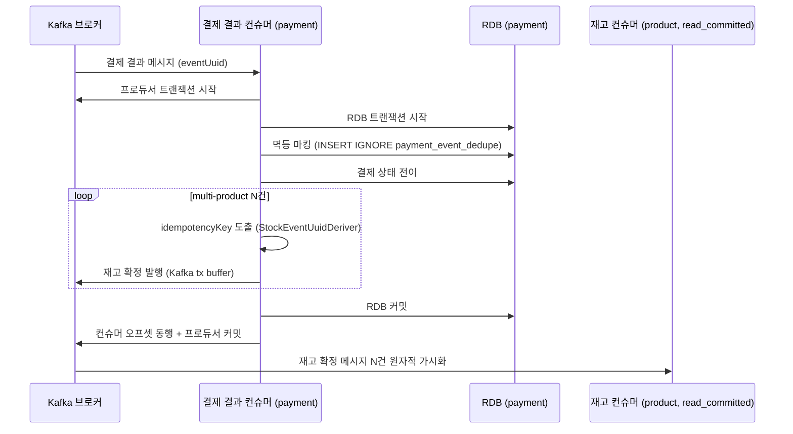
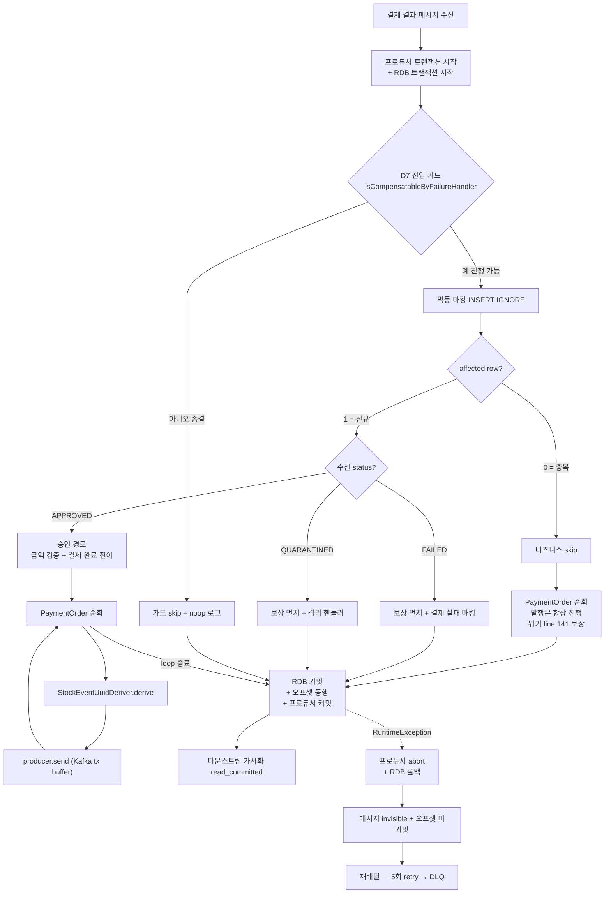
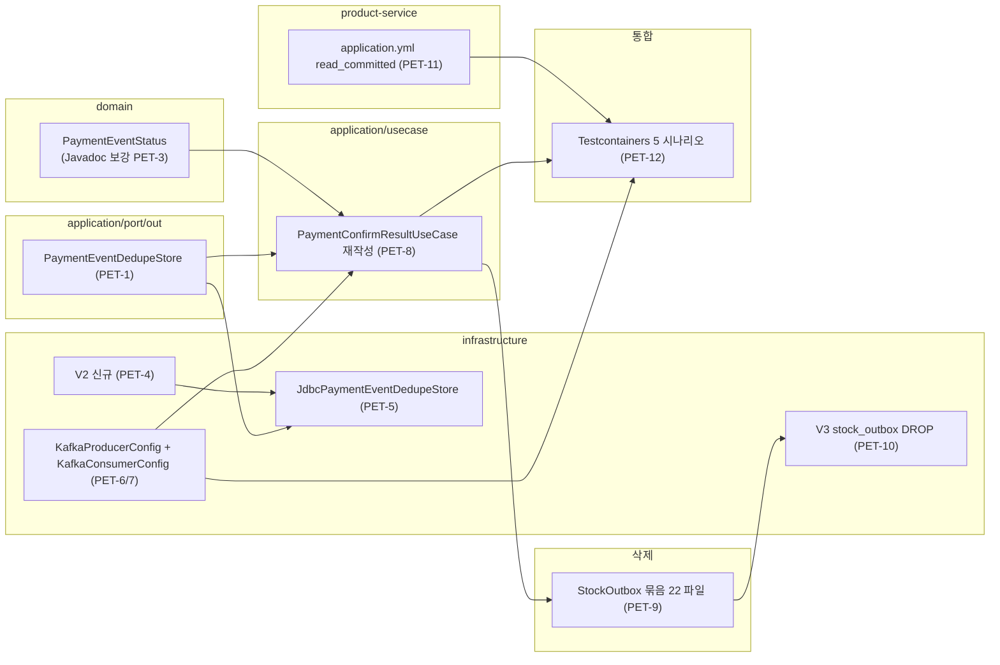

# PAYMENT-EOS-TRANSITION — 완료 브리핑

> 봉인일: 2026-05-18 · PR #77 · 브랜치 `#77` · 14 PET (PET-1~PET-14) + review R1 fix 4 커밋

---

## 작업 요약

payment-service 의 결제 결과 컨슈머가 위키 (`message-delivery-and-dedupe.md` / `outbox-pattern.md` / `architecture.md`) 가 봉인해둔 Kafka EOS (Exactly-Once Semantics) 안과 어긋나 있었다. 위키는 "consumer offset commit + producer send 가 Kafka 트랜잭션 한 단위로 묶인다 + 같은 트랜잭션 안에서 RDB 멱등 테이블 INSERT IGNORE" 를 명시했지만, 현재 코드는 직전 토픽들의 진화 끝에 `StockOutbox` 묶음 (도메인 + 레포지토리 + 팩토리 + 즉시 발행 리스너 + 폴링 워커 + Kafka 퍼블리셔 + 테이블) 17 클래스가 살아 있고, 컨슈머는 명시 ack 모델 + `@Transactional` 만 잡혀 있어 Kafka 트랜잭션과 무관하게 동작했다.

직전 STOCK-COMPENSATION-RECOVERY (PR #72) 가 결제 결과 컨슈머의 회복 layer 를 Lua atomic dedup token + Spring Kafka native 에러 핸들러 둘로 응축하면서 application 측 회복 책임을 통째로 들어냈고, 그 결과 `EventDedupeStore` port 와 `PaymentConfirmDlqPublisher` 가 orphan 으로 정리됐다. application 코드가 위키의 "Kafka EOS 안" 형태에 한 발 더 다가갔지만 발행 보장 모델 자체 (outbox vs EOS) 는 손대지 않은 상태였다. 본 토픽은 그 잔여 갭, 즉 "발행 보장 모델을 위키의 EOS 안으로 옮기는" 작업이다.

빅뱅 전략 (1 PR 안에 EOS 도입 + StockOutbox 묶음 전체 drop + product-service `read_committed` 동시 적용) 으로 처리. 14 PET 로 분해해 layer 의존 순서 (port → domain → Flyway → JDBC → config → use case → 삭제 → DROP → downstream yml → 통합 → 위키 → 영구 문서) 로 실행. review R1 에서 양쪽 페르소나 모두 revise (Critic 의 integrationTest 23건 중 12 FAIL 발견 + Domain Expert 의 EOS atomicity SSOT 미명시 지적) → fix 과정에서 hidden bug 3건 동시 노출 + clean fix → R2 양쪽 pass.

결과: payment-service `test` 708/708 + `integrationTest` 23/23 PASS, DR-1~5 모두 통합 회귀 가드 protected, 위키-코드 정합 봉인 (위키 4개 파일 "Phase 6 작업 중" 마커 제거).

---

## 핵심 설계 결정 (D1~D8)

### D1 — 위키 EOS 안 채택 (코드를 위키로 끌어올림)

**결정**: 위키 `message-delivery-and-dedupe.md` 의 EOS 안 (Kafka tx + INSERT IGNORE `payment_event_dedupe`) 으로 코드를 전환. 위키 `outbox-pattern.md` line 163~171 의 "stock-committed 발행은 outbox 가 아니다 — Kafka EOS" 마커 유지.

**근거**: stock-committed 발행은 후속에 외부 부수효과 (PG 벤더 호출 등) 가 없고 RDB 변경 + Kafka 발행만 있는 경로. 이런 경로는 Kafka EOS 가 정합 — outbox 의 "이중 발행 허용 + at-least-once" 모델보다 "consumer offset + producer send 한 단위 commit" 모델이 도메인 의미와 직접 매칭.

**기각 대안**: 위키를 코드에 맞춰 후퇴 — 위키가 가까운 본질을 표현하고 있다면 코드를 위키로 끌어올리는 것이 학습용 프로젝트의 본 의도. verify 단계에서 위키 line 99 의 "Phase 6 작업 중" 마커 제거.

### D2 — 빅뱅 1 PR 마이그레이션

**결정**: 1 PR 안에 EOS 도입 + StockOutbox 묶음 전체 drop + product-service `read_committed` 동시 적용. 14 PET 로 review 가능 단위 분해.

**근거**: 학습용 프로젝트 + EOS 도입과 stock_outbox 묶음 제거는 한 단위로만 정합. 병행 운영하려면 양쪽 경로가 한동안 같이 발행 → 중복 발행 폭주 위험. EOS 가 들어가면 outbox 는 동시에 죽어야 한다.

**기각 대안**: 병행 운영 + feature flag — 백업 경로가 사라지는 두려움을 다룰 수 있지만 학습용 프로젝트에서 추가 layer 의 비용이 크다.

### D3 — Kafka tx coordinator 의존 수용 (가용성 약화)

**결정**: 수용. broker / tx coordinator 죽으면 처리 자체가 멈춘다. `CONCERNS.md` L-1 에 명시 등재.

**근거**: 본 토픽의 본질은 정합성 강화. 학습용 프로젝트 특성상 가용성 약화의 비용은 운영 모니터링으로 충분히 가시화 가능.

**기각 대안**: outbox 묶음 남기고 EOS 만 도입 — dual-write 가 또 다른 형태로 살아남음.

### D4 — `transactional.id = ${spring.application.name}-${HOSTNAME:local}` (단일 인스턴스 가정)

**결정**: producer `transactional.id` 는 `${spring.application.name}-${HOSTNAME:local}` 패턴. 본 토픽 범위는 **단일 인스턴스 가정**. 다중 인스턴스 확장 시 `docker-compose hostname: payment-service` 라인 충돌 — L6 / TC-13-FOLLOW-1 후속.

**근거**: Kafka EOS 의 fencing 메커니즘은 같은 transactional.id 의 새 producer 등장 시 outdated fence. 재시작 시 같은 id 복구 + 다중 인스턴스에서 유일성 모두 만족하는 패턴이 HOSTNAME 기반.

**기각 대안**: 본 토픽에서 docker-compose 수정까지 atomic 포함 — 다중 인스턴스 검증이 본 토픽 범위 밖이라 검증 없는 변경이 됨.

### D5 — `payment_event_dedupe` 스키마 (6컬럼)

**결정**:
```sql
CREATE TABLE IF NOT EXISTS payment_event_dedupe (
    event_uuid  VARCHAR(64) NOT NULL,
    order_id    BIGINT      NOT NULL,
    status      VARCHAR(32) NOT NULL,
    received_at TIMESTAMP   NOT NULL,
    expires_at  TIMESTAMP   NOT NULL,
    created_at  TIMESTAMP   DEFAULT CURRENT_TIMESTAMP,
    PRIMARY KEY (event_uuid),
    INDEX idx_expires_at (expires_at)
) ENGINE = InnoDB;
```
TTL = 8일 (Kafka retention 7일 + 복구 버퍼 1일).

**근거**: product-service `stock_commit_dedupe` 패턴 차용. status 컬럼은 운영 질의 / 디버깅용. TTL 정리 스케줄러는 본 토픽 범위 밖 (TC-13-FOLLOW-2 / TC-11 통합).

### D6 — product-service consumer `isolation.level=read_committed` 본 PR 동시 적용

**결정**: product-service `application.yml` 에 `spring.kafka.consumer.properties.isolation.level: read_committed` 추가. payment-service 도 동일 (자기 자신 발행 메시지 컨슘 안 하지만 일관성).

**근거**: EOS 의 강제 전제. payment-service abort 메시지가 product-service consumer 에서 invisible 보장. 본 PR 안에 두 서비스 변경이 묶여야 정합. 운영 rolling deploy 시 product-service 먼저.

### D7 — `handle` 진입 가드 정책 (`isCompensatableByFailureHandler`)

**결정**: `PaymentConfirmResultUseCase.handle` 진입에 `paymentEvent.getStatus().isCompensatableByFailureHandler()` 가드. false (종결 6 상태 — DONE/FAILED/CANCELED/PARTIAL_CANCELED/EXPIRED/QUARANTINED) → `LogFmt.warn` + noop return. true (READY/IN_PROGRESS/RETRYING) → 진행.

**근거**: QUARANTINED 상태에서 늦은 APPROVED 도착 시 `markPaymentAsDone` → `PaymentEvent.done()` → `PaymentStatusException` (IllegalStateException 상속) → Spring Kafka `DefaultErrorHandler` not-retryable 목록 → 즉시 DLQ silent 분기 위험. D7 가드로 사전 차단.

**기각 대안**: `isTerminal` 단순 가드 — QUARANTINED 도 종결로 보고 skip 하면 위 시나리오는 막히지만 시맨틱이 흐려짐. `isCompensatableByFailureHandler` SSOT 재사용 (SCR 도입) 으로 두 진입점 (보상 핸들러 + EOS 컨슈머) 의 가드 통일.

### D8 — 두 종류 UUID 역할 분리 (수신 측 vs 발행 측)

**결정**: 명확히 두 가지 UUID 가 살아있음:
- **수신 측 `event_uuid`** — payment-service 가 받은 `payment.events.confirmed` 메시지의 UUID. `payment_event_dedupe` 의 PK 로 INSERT IGNORE 멱등 마킹.
- **발행 측 `idempotencyKey`** — payment-service 가 발행하는 `payment.events.stock-committed` 메시지의 UUID. `StockEventUuidDeriver.derive(orderId, productId, "stock-commit")` 로 productId 별 결정적 도출. product-service `stock_commit_dedupe` 에서 dedupe.

**근거**: 같은 "event_uuid" 라는 단어가 두 역할을 동시에 가지면 multi-product 결제에서 idempotencyKey 가 깨질 위험. DR-1 critical 흡수. `StockEventUuidDeriver` 는 `StockOutbox` 묶음 삭제 (PET-9) 와 무관하게 보존.

---

## 변경 범위

### Port (신규 1)
- `application/port/out/PaymentEventDedupeStore.java` — 단일 메서드 `int markIfAbsent(String eventUuid, long orderId, String status, Instant expiresAt)`. 0 row = 중복, 1 row = 신규.

### Domain (변경 없음 / Javadoc 보강만)
- `domain/enums/PaymentEventStatus.java` — `isCompensatableByFailureHandler()` Javadoc 보강 (두 사용처 명시 + DLQ silent 영향 경고). enum 값 / 메서드 시그니처 변경 없음.

### Application (1 클래스 재작성)
- `application/usecase/PaymentConfirmResultUseCase.java` — `handle` 진입 가드 추가 + 멱등 마킹 추가 + `handleApproved` 본문을 multi-product loop 안에서 `StockEventUuidDeriver.derive` + 직접 `stockCommittedKafkaTemplate.send` 로 재작성. 의존성: 제거 (`ApplicationEventPublisher`, `StockOutboxRepository`) + 추가 (`PaymentEventDedupeStore`, `KafkaTemplate<String, String> stockCommittedKafkaTemplate`).

### Infrastructure (신규 1 + 변경 3)
- 신규 `infrastructure/dedupe/JdbcPaymentEventDedupeStore.java` — `NamedParameterJdbcTemplate` 기반 INSERT IGNORE. `LocalDateTimeProvider.nowInstant()` 주입 (PITFALLS #6 정합).
- 변경 `infrastructure/config/KafkaProducerConfig.java` — `KafkaTransactionManager` 빈 + EOS-aware `ProducerFactory` (`transactional.id` + `enable.idempotence=true`) + stock-committed 전용 EOS `KafkaTemplate`. `commandsConfirmProducerFactory` 명시 등록 (review R1 fix Rule 1 — Spring auto-config 의 default factory 가 EOS-aware 로 잘못 잡혀 commands.confirm 까지 EOS tx 안에 묶이는 위험 차단).
- 신규 `infrastructure/config/KafkaConsumerConfig.java` — listener container factory 에 `KafkaTransactionManager` wire-in + `isolation.level=read_committed`. auto-config `ConsumerFactory` 그대로 주입받아 `isolation.level` 은 yml 흡수.
- 변경 `core/config/JpaConfig.java` — `JpaTransactionManager` `@Primary` 명시 등록 (review R1 fix Rule 1 — KafkaTransactionManager 도입 후 Spring TX manager 선택 모호성 해소).

### Flyway (V2 신규 + V3 DROP)
- 신규 `db/migration/V2__payment_event_dedupe.sql` — D5 스키마 그대로.
- 신규 `db/migration/V3__drop_payment_stock_outbox.sql` — `DROP TABLE IF EXISTS stock_outbox` (V1 DDL 의 실제 테이블명 `stock_outbox` 사용, FK 없음 확인).

### 삭제 (StockOutbox 묶음 17 main + 5 test = 22 파일)
- main: `domain/StockOutbox`, `application/util/StockOutboxFactory`, `application/service/StockOutboxRelayService`, `application/event/StockOutboxReadyEvent` + `package-info`, `application/port/out/StockOutboxRepository` + `StockOutboxPublisherPort`, `infrastructure/repository/StockOutboxRepositoryImpl` + `JpaStockOutboxRepository`, `infrastructure/listener/StockOutboxImmediateEventHandler`, `infrastructure/entity/StockOutboxEntity`, `infrastructure/scheduler/StockOutboxWorker`, `infrastructure/messaging/publisher/StockOutboxKafkaPublisher`, `KafkaProducerConfig` 의 `stockOutboxKafkaTemplate` 빈
- test: `mock/FakeStockOutboxRepository`, `domain/StockOutboxTest`, `application/service/StockOutboxRelayServiceTest` + `StockOutboxRelayServiceClockTest`, `infrastructure/listener/StockOutboxImmediateEventHandlerTest`, `infrastructure/scheduler/StockOutboxWorkerTest`

### 보존 (DR-1 핵심)
- `application/util/StockEventUuidDeriver.java` — multi-product idempotencyKey 결정성. PET-8 의 multi-product loop 안에서 직접 호출 site 가 됨.
- `application/dto/event/StockCommittedEvent.java` (또는 동등) — EOS 발행 payload.
- `application/messaging/PaymentTopics.java` — stock-committed 토픽 상수.

### product-service
- `application.yml` — `spring.kafka.consumer.properties.isolation.level: read_committed` 추가. Java 코드 변경 없음.

### Hidden Bug Fix (review R1 fix 부수효과)
- `gatewayType=null` DB NOT NULL 위반 — 기존에 `BaseIntegrationTest` 환경이 가렸던 도메인 무결성 결함. fix.
- `CheckoutResult` Jackson `is` prefix 직렬화 — `@JsonProperty("duplicate")` 명시로 API contract 안정화.
- `IdempotencyStoreRedisAdapter` 동시 GET null 시 모든 thread가 creator 를 호출하는 race — IN_PROGRESS marker + loser polling 으로 동시 creator 호출 1회 보장. PG / 외부 API 이중 호출 silent 위험 봉인.

### 통합 테스트 (신규 5 시나리오)
- `integration/PaymentEosIntegrationTest.java` — Testcontainers Kafka (`partitions=2`) + MySQL 환경:
  - 정상 commit (Kafka tx 한 단위 가시화)
  - abort invisibility (RDB rollback + read_committed)
  - 중복 INSERT IGNORE (비즈니스 skip + 발행 진행 — 위키 line 141 보장)
  - multi-product idempotencyKey 결정성 (DR-1)
  - QUARANTINED D7 가드 (DR-3)

### 위키 (별 git repo)
- `message-delivery-and-dedupe.md` / `outbox-pattern.md` / `event-driven-choreography.md` / `architecture.md` — "🚧 Phase 6 작업 중" 마커 제거. `architecture.md` 의 `JdbcEventDedupeStore` → `JdbcPaymentEventDedupeStore` 명명 정정.

### 영구 문서 (8개 갱신)
- `CONFIRM-FLOW.md` — payment-service EOS 안 재작성 + 통합 시나리오 5건 등재 + §5 "위키 line 141 룰이 정합 SSOT" 명시
- `ARCHITECTURE.md` — EOS 구조 + `JdbcPaymentEventDedupeStore` 어댑터 + 영역 변경 표
- `STRUCTURE.md` — 디렉토리 트리 (dedupe 신설 / StockOutbox 폐기 / StockEventUuidDeriver 보존)
- `PITFALLS.md` — EOS 함정 4건 등재 (INSERT IGNORE 0 row 시 발행 진행 / D7 가드 / multi-product idempotencyKey / rolling deploy 순서)
- `CONCERNS.md` — L-1 (가용성 약화) + L5 (회복 비대칭) + L6 (multi-instance hostname 충돌) 등재
- `TODOS.md` — TC-13 완료 마킹 + TC-13-FOLLOW-1~6 후속 등재 + TC-7 의 stock_outbox 부분 폐기 반영
- `CONVENTIONS.md` — StockOutbox 예시 3건 정리
- `PAYMENT-FLOW.md` — line 140 분기 다이어그램 + line 187 시계열 요약 EOS 흐름으로 갱신

---

## 다이어그램

### 변경 후 정상 commit 흐름 (EOS)



### 분기 흐름 전체



### Layer 별 변경 영역



---

## 코드 리뷰 요약

### discuss 단계
- Round 1: Critic pass / Domain Expert fail (DR-1 critical + DR-2/3/4 high + DR-5/6/7 medium + DR-8 minor)
- Round 2: Architect 가 critical/high 4건 + medium 3건 흡수, §12 deploy 순서 신설 → Critic pass / Domain Expert **pass**

### plan 단계
- Round 1: Critic pass (minor 4) / Domain Expert pass (minor 2 — PD1-1 `EventDedupeStore` 동명 재사용 / PD1-2 EOS wiring 단위 검증 부재). 1라운드 만에 양쪽 pass.

### plan-review 단계
- Plan Reviewer pass (minor 2 → execute 단계 implementer 판단으로 forward-fix).

### execute 단계
- 14 PET 순차 실행. PD1-1 → (b) `PaymentEventDedupeStore` 분리 명명 채택 (PET-1 implementer 결정). PD1-2 → 선택지 A (PET-12 통합 테스트로 사후 검증).
- Rule 1 SUT 수정 2건 (PET-12 안에서 자동 흡수): `JpaTransactionManager @Primary` + `commandsConfirmProducerFactory` 명시 등록.

### review 단계
- Round 1: Critic revise (major 2 — `gradle integrationTest` 12 FAIL, PET-8 회귀 분리 미확인 + minor 3 — Javadoc/명명/FQN) / Domain Expert revise (major 1 — EOS atomicity SSOT 미명시 + minor 2 — Clock 직접 호출, partitions=1)
- R1 fix 4 커밋:
  - `8a60b79e` — SCR 회복 layer 회귀 fix + minor 묶음 + Clock 주입 + partitions=2
  - `bef3d033` — EOS atomicity SSOT 명시 (CONFIRM-FLOW + CONCERNS + TODOS)
  - `c6ce6368` — checkout 500 회귀 fix (hidden bug 3건 — gatewayType=null / Jackson is-prefix / IdempotencyStore race)
- Round 2: Critic pass (minor 2) / Domain Expert pass (critical 0 / major 0 / minor 0, DR-1~5 모두 protected)

---

## 수치

| 항목 | 값 |
|------|---|
| 태스크 | 14 (PET-1 ~ PET-14) |
| 커밋 | 32 (discuss 1 + plan 1 + plan-review 1 + execute 14 + execute 위키/문서 4 + review R1 fix 4 + review R2 산출물 2 + 기타) |
| 테스트 (payment-service) | unit 385 PASS + integrationTest 23 PASS |
| 테스트 (전체) | test 708 PASS + integrationTest 23 PASS / 0 FAIL |
| 코드 변경 | +5735 / -1635, 71 파일 |
| 신규 파일 | 8 (port + Fake + JdbcAdapter + KafkaConsumerConfig + Flyway V2 + V3 + 통합 테스트 + 가드 회귀 테스트) |
| 삭제 파일 | 22 (StockOutbox 묶음 17 main + 5 test) |
| Hidden bug fix | 3 (gatewayType=null / Jackson is-prefix / IdempotencyStore race) |
| discuss findings | critical 1 + high 3 + medium 3 + minor 1 → R2 양쪽 pass |
| plan findings | minor 4 (Critic) + minor 2 (Domain Expert) |
| plan-review findings | minor 2 |
| review findings | R1 major 3 + minor 5 → R2 minor 2 / 0 |
| 영구 문서 갱신 | 8 (CONFIRM-FLOW / ARCHITECTURE / STRUCTURE / PITFALLS / CONCERNS / TODOS / CONVENTIONS / PAYMENT-FLOW) |
| 위키 정합 갱신 | 4 (message-delivery-and-dedupe / outbox-pattern / event-driven-choreography / architecture) |

---

## 알려진 한계 / 후속 작업

### 수용된 한계 (CONCERNS.md 등재)

| ID | 한계 | 처리 |
|---|---|---|
| L-1 | Kafka tx coordinator 의존 — broker 죽으면 처리 멈춤 | 수용 (D3) + 운영 메트릭 가시화 + SSOT 명시 (위키 line 141 룰) |
| L2 | TTL 정리 스케줄러 부재 — `payment_event_dedupe` row 누적 | TC-11 통합 토픽 후속 |
| L3 | 다중 인스턴스 동시 운영 검증 부재 | Phase 5 자물쇠 (k6 부하 측정 후) |
| L5 | 회복 비대칭 — abort 시 RDB rollback 은 자동, Redis 보상 lease 는 미회복 | SCR L7 cascade 평가 결과 — 빈도 낮음, 수용 |
| L6 | EOS multi-instance 확장 시 docker-compose `hostname: payment-service` 라인 충돌 | 사용 트리거 시 별 토픽 |

### 후속 작업 (TODOS.md 등재)
- TC-13-FOLLOW-1: multi-instance 확장 시 docker-compose hostname 라인 제거 또는 `INSTANCE_ID` 환경변수 도입 (DR-2 / L6)
- TC-13-FOLLOW-2: `payment_event_dedupe` TTL 정리 스케줄러 (TC-11 통합)
- TC-13-FOLLOW-3: Kafka tx coordinator 가용성 모니터링 대시보드
- TC-13-FOLLOW-4: D7 가드 분기 알람 SLO (DM2-3)
- TC-13-FOLLOW-5: D7 시맨틱 SSOT 정리 (DM2-2 — Javadoc 보강은 PET-3 에 포함, 후속 정리 별 항목)
- TC-13-FOLLOW-6: `@Transactional` 한정자 명시 또는 ChainedKafkaTransactionManager 검토 (RD1-2 SSOT 보강 후속)
