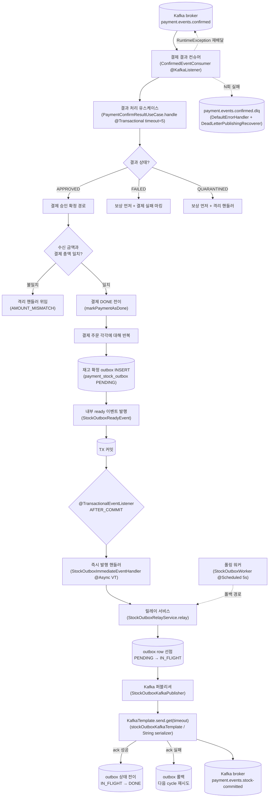
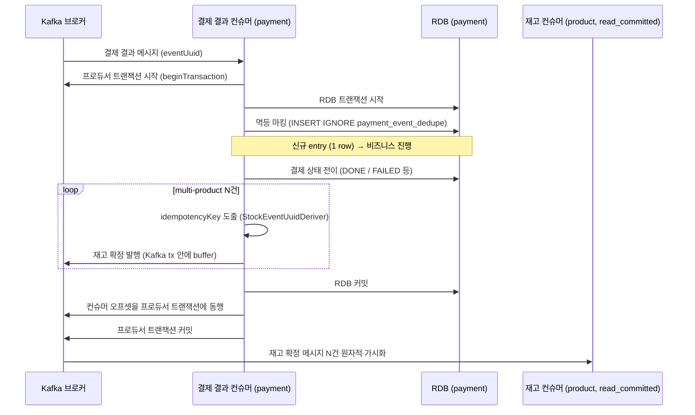
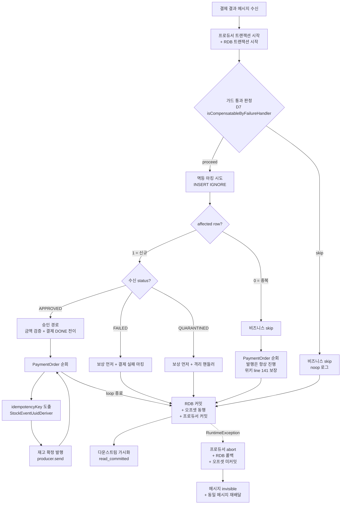
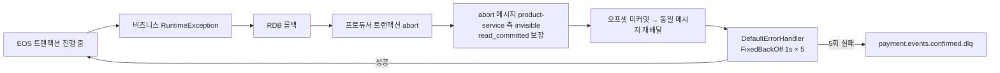
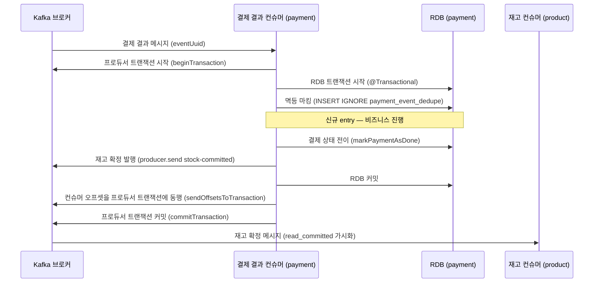
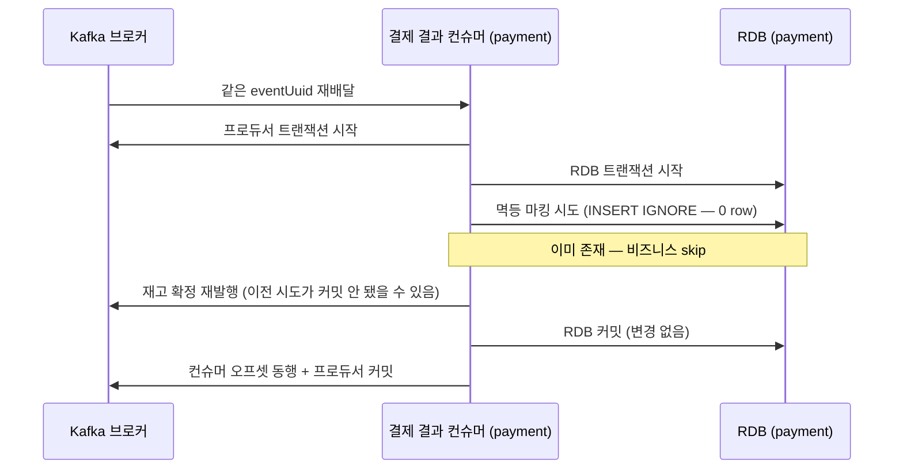
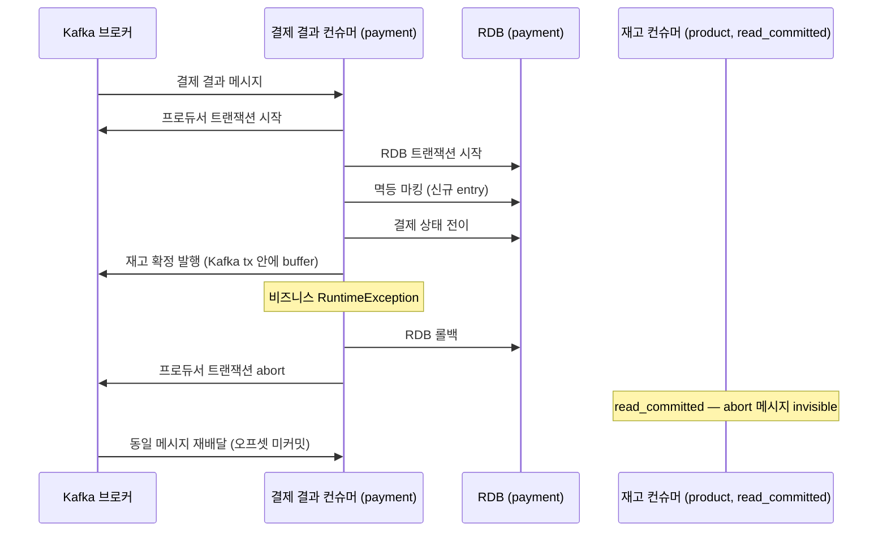
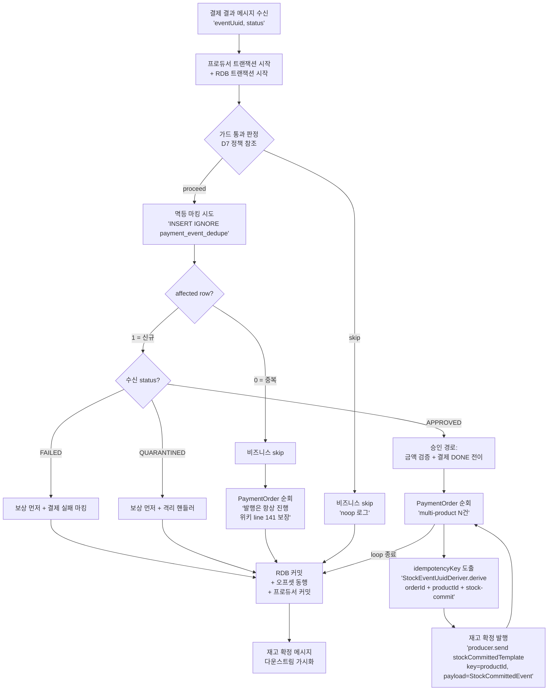
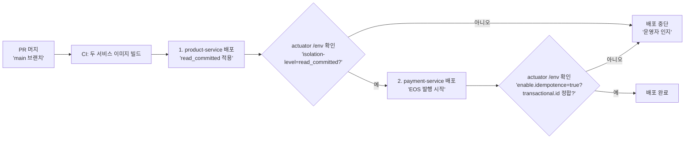

# PAYMENT-EOS-TRANSITION — payment-service 결제 결과 컨슈머 EOS 전환

## 사전 브리핑

### 현재 이해한 문제

payment-service 가 결제 결과 메시지를 소비할 때 위키는 "Kafka 트랜잭션 한 단위로 컨슈머 오프셋 커밋 + 재고 확정 발행을 묶고, 같은 트랜잭션 안에서 RDB 멱등 테이블에 이벤트 UUID 를 INSERT IGNORE 한다" 는 EOS (exactly-once semantics) 안으로 봉인되어 있다. 그러나 현재 코드는 직전 토픽들의 진화 끝에 `stock_outbox` 묶음 (도메인 + 레포지토리 + 팩토리 + 즉시 발행 리스너 + 폴링 워커 + Kafka 퍼블리셔 + 테이블) 7+ 클래스가 살아 있고, 컨슈머는 명시 ack 모델 + `@Transactional` 만 잡혀 있어 Kafka 트랜잭션과 무관하게 동작한다. 위키 결정과 코드 사이의 잔여 갭을 메우는 것이 이번 토픽의 본질.

### 현재 시스템 동작 (as-is)

#### 결제 결과 메시지 컨슘 + 재고 확정 발행 흐름



#### 멱등성 측면 (현재)

- 결제 결과 메시지의 dedupe 는 **결제 도메인 자체의 종결 가드** (`paymentEvent.getStatus().isTerminal()`) 가 부분적으로 담당. FAILED / QUARANTINED 경로에서 isTerminal 가드가 노옵 스킵.
- APPROVED 경로는 isTerminal 가드 없음 — `markPaymentAsDone` 의 도메인 상태 전이 검증이 두 번째 호출을 막는 형태. event UUID 기반 명시적 멱등 테이블은 **없음**.
- 즉, 같은 결제 결과 메시지가 두 번 배달되면 도메인 상태에 따라 노옵 스킵되거나 도메인 예외로 막힘 — 위키가 말하는 INSERT IGNORE 패턴은 아직 없음.

#### Producer 설정 (현재)

- `KafkaProducerConfig` 가 토픽별 타입드 KafkaTemplate 3개 등록 (commands.confirm / stock_outbox / dlq).
- `enable.idempotence` 명시 없음 (Kafka 클라이언트 3.x 기본값이 true 라 사실상 활성, 다만 명시는 안 됨).
- `transactional.id` 미설정. Spring `KafkaTransactionManager` 빈 없음. 따라서 EOS 모드 아님.

#### Consumer 설정 (현재 + 다운스트림)

- payment-service `ConfirmedEventConsumer` 는 default isolation level (read_uncommitted) 로 동작 — abort 된 트랜잭션 메시지를 볼 수 있음.
- product-service `StockCommitConsumer` 도 마찬가지 — 만약 payment-service 가 EOS 로 바뀌고 abort 가 발생하면 product-service 가 abort 된 메시지를 처리해버릴 위험.

### 이번 discuss 에서 결정하려는 것

1. **EOS 전환 자체의 가부** — 위키 정합을 위해 정말 전환할지, 아니면 위키를 코드에 맞춰 후퇴시킬지. 위키는 Phase 6 작업 중 미반영 표시가 있어 후자도 선택지.
2. **가용성 결 트레이드오프 수용 폭** — EOS 는 Kafka 트랜잭션 코디네이터 의존이라 broker 가 죽거나 트랜잭션 코디네이터가 응답 못 하면 처리 자체가 멈춤. 현재 outbox 모델은 RDB 만 살아있으면 처리 큐가 쌓이고 broker 복구 후 자동 회수. 가용성 약화를 수용할지.
3. **`transactional.id` 부여 정책** — Kafka EOS 는 인스턴스별 결정적 id 필요 (같은 id 의 outdated producer fencing 위해). 현재 payment-service 는 단일 인스턴스 가정인지, 다중 인스턴스 가정인지 + id 부여 방식 (hostname / pod uid / app config) 결정.
4. **마이그레이션 전략** — 빅뱅 전환 (한 PR 로 stock_outbox 전체 drop + EOS 도입) vs 병행 운영 기간 둘지. 학습용 프로젝트 특성상 빅뱅이 자연스럽지만, drop 한 후 다시 돌릴 백업 경로가 사라진다는 점 고려.
5. **`payment_event_dedupe` 테이블 스키마 + 정리 정책** — UNIQUE INSERT IGNORE 테이블의 컬럼 구성 (event_uuid PK + received_at + 추가 메타?), TTL / 정리 스케줄러 신설 여부.
6. **다운스트림 영향 처리** — product-service `StockCommitConsumer` `isolation.level=read_committed` 적용 범위, abort 메시지 누락 방어, 위키 동기화.

### 열린 질문 / 가정

- **가정**: payment-service 는 단일 인스턴스 운영. 다중 인스턴스로 가는 경우 (전체 시스템 부하 측정 후) 는 PHASE 후속으로 미룬다 — 그러나 `transactional.id` 부여 방식은 다중 인스턴스 확장 가능하게 설계해야 함.
- **질문**: 직전 PR #72 (STOCK-COMPENSATION-RECOVERY) 에서 `EventDedupeStore` 포트를 명시적으로 폐기했는데, 이번 토픽에서 `payment_event_dedupe` JDBC 어댑터를 신설하면 비슷한 추상화를 다시 들이는 셈 — 이름·인터페이스 재사용 vs 별 어댑터 분리 결정 필요.
- **질문**: 위키 안에서는 stock-committed 발행이 "RDB 변경 + Kafka 발행만 있고 외부 부수효과가 없다" 라서 EOS 채택 근거. 그러나 보상 경로 (`stockCachePort.compensateAtomic`) 는 Redis 부수효과가 있는데, 이 경로는 RDB tx 안에 있고 Kafka tx 와 무관 — EOS 전환이 이 경로에 영향을 줄지 검토 필요.
- **가정**: `StockOutbox` 묶음의 죽음은 정말 EOS 도입과 함께만 가능하다. EOS 없이 outbox 만 제거하면 dual-write 문제 재발.
- **질문**: 위키 / 코드 동기 방향 — 위키가 옳다고 보고 코드를 맞추는 게 기본 방향. 그러나 위키 자체가 "Phase 6 작업 중" 표시이므로 토론 라운드에서 "위키도 함께 정밀화" 옵션을 열어둘 가치.

---

## 요약 브리핑

### 결정된 접근

payment-service 결제 결과 컨슈머의 발행 보장 모델을 **outbox → Kafka EOS** 로 옮긴다. 1 PR 빅뱅 — `payment_event_dedupe` UNIQUE INSERT IGNORE 멱등 테이블 + `KafkaTransactionManager` 통합 컨슈머 + 직접 `producer.send(stock-committed)` 발행이 한 Kafka 트랜잭션 단위 (consumer offset commit + producer send) 로 commit/abort 된다. 동시에 `StockOutbox` 묶음 16+ 파일 + `payment_stock_outbox` 테이블 전체 drop. product-service `StockCommitConsumer` 는 `isolation.level=read_committed` 적용으로 abort 메시지 invisible 보장.

### 변경 후 동작 (to-be)

#### 정상 흐름 — Kafka 트랜잭션 한 단위 commit



#### 분기 흐름 전체 (flowchart)



#### Abort 경로 — 양쪽 rollback 후 재배달



### 핵심 결정 ID 목록

| ID | 결정 |
|---|---|
| **D1** | 위키 EOS 안 채택 (위키를 코드로 끌어올림) |
| **D2** | 빅뱅 1 PR 마이그레이션 (EOS 도입 + StockOutbox 묶음 drop 동시) |
| **D3** | Kafka tx coordinator 의존 수용 (가용성 약화 명시 등재) |
| **D4** | `transactional.id = ${spring.application.name}-${HOSTNAME:local}` (단일 인스턴스 가정) |
| **D5** | `payment_event_dedupe` 스키마 (event_uuid PK + order_id + status + received_at + expires_at) |
| **D6** | product-service consumer `isolation.level=read_committed` 본 PR 동시 적용 |
| **D7** | `handle` 진입 가드 정책 (`PaymentStatus.isCompensatableByFailureHandler` 기반 분기 — QUARANTINED 상태 늦은 APPROVED 도 DLQ silent 회피) |
| **D8** | 두 종류 UUID 역할 분리 (수신 측 `event_uuid` vs 발행 측 stock-committed `idempotencyKey`) |

### 알려진 트레이드오프 / 후속 작업

#### 수용된 한계 (CONCERNS.md 등재 예정)

| ID | 한계 | 처리 |
|---|---|---|
| L1 | Kafka tx coordinator 의존 — broker 죽으면 처리 멈춤 | 수용 (D3) + 운영 메트릭 가시화 |
| L2 | TTL 정리 스케줄러 부재 — `payment_event_dedupe` row 누적 | TC-11 후속 (cleanup 스케줄러 통합 토픽) |
| L3 | 다중 인스턴스 동시 운영 검증 부재 | Phase 5 자물쇠 (k6 부하 측정 후) |
| L5 | 회복 비대칭 — abort 발생 시 RDB rollback 은 자동, Redis 보상 lease 는 미회복 | SCR L7 cascade 평가 결과 — 빈도 낮음, 수용 |
| L6 | EOS multi-instance 확장 시 docker-compose `hostname: payment-service` 라인 충돌 | 사용 트리거 시 별 토픽 (`hostname:` 라인 제거 또는 `INSTANCE_ID` 환경변수 도입) |

#### 후속 작업 (TODOS.md 등재)

- TC-13-FOLLOW-1: EOS multi-instance 확장 (L6 트리거 시 처리)
- TC-13-FOLLOW-2: `payment_event_dedupe` TTL 정리 스케줄러 (TC-11 통합)
- TC-13-FOLLOW-3: Kafka tx coordinator 가용성 모니터링 대시보드
- TC-13-FOLLOW-4: D7 가드 분기 알람 SLO (Domain Expert R2 minor DM2-3)
- TC-13-FOLLOW-5: D7 `PaymentStatus.isCompensatableByFailureHandler` 도메인 SSOT 시맨틱 정리 (Domain Expert R2 minor DM2-2)

#### 라운드 합의

- Round 1: Critic pass / Domain Expert fail (1 critical + 3 high + 3 medium + 1 minor)
- Round 2: Architect 가 critical/high 4건 + medium 3건 흡수, §12 deploy 순서 신설
- Round 2: Critic pass / Domain Expert **pass** (Round 1 critical/high 모두 resolved, 새 critical 없음)

---

## §1 배경 (Why)

### 위키-코드 잔여 갭 5가지 (TC-13 인용)

`docs/context/TODOS.md` TC-13 섹션 line 39~45 에 정리된 그대로:

1. **컨슈머 EOS 통합** — `ConfirmedEventConsumer` 가 `KafkaTransactionManager` 통합 안 됨 (여전히 명시 ack 모델)
2. **Producer EOS 설정** — `transactional.id` (인스턴스별 결정적 id) + `enable.idempotence=true` 미적용
3. **`payment_event_dedupe` 테이블 신규** — 위키는 UNIQUE INSERT IGNORE 테이블 기준. Flyway migration + JDBC 어댑터 신규 필요
4. **`stock_outbox` 묶음 제거** — 위키 EOS 에서는 직접 `producer.send(stock-committed)` 로 대체. 현재는 7+ 클래스 살아 있음. `payment_stock_outbox` 테이블 drop 필요
5. **downstream 영향** — `product-service` `StockCommitConsumer` consumer config `isolation.level=read_committed` 누락 시 abort batch 노출

### 직전 SCR 토픽 봉인 후 잔여 작업이라는 맥락

STOCK-COMPENSATION-RECOVERY (브랜치 #71, 2026-05-08 봉인) 가 결제 결과 컨슈머의 회복 layer 를 (a) Lua atomic dedup token + (b) Spring Kafka native 에러 핸들러 둘로 응축했다. SCR 가 application 측 회복 책임 (`compensateStockCache try/catch`, `dedupe lease wrapper`, 직접 DLQ publish) 을 통째로 들어낸 결과로 `EventDedupeStore` port 와 `PaymentConfirmDlqPublisher` 가 orphan 이 되어 정리됐고, application 의 코드가 위키의 "Kafka EOS 안" 형태에 한 발 더 다가갔다. 그러나 SCR 은 회복 책임 정리만 했고 **발행 보장 모델 자체 (outbox vs EOS) 는 손대지 않았다.** 본 토픽은 SCR 봉인 직후 남은 잔여 갭, 즉 "발행 보장 모델을 위키의 EOS 안으로 옮기는" 작업이다.

### 본 토픽이 결제 도메인에서 차지하는 의미

도메인 정합성과 가용성의 결 트레이드오프 결정이다.

- **얻는 것 (도메인 정합성)**: consumer offset commit + `stock-committed` 발행이 Kafka 트랜잭션 한 단위로 commit/abort 된다. RDB tx rollback 시 stock-committed 메시지가 downstream (read_committed) 에서 invisible — 보상 누락 / 이중 발행 silent loss 가 봉쇄된다.
- **잃는 것 (가용성)**: Kafka 트랜잭션 코디네이터 의존이 도입된다. broker / tx coordinator 가 죽으면 처리 자체가 멈춘다. 현재 outbox 모델은 RDB 만 살아있으면 처리 큐가 쌓이고 broker 복구 후 자동 회수 — 가용성 결이 강하다.

이 트레이드오프는 학습용 프로젝트 + 위키 정합성 우선이라는 사용자 판단으로 §4 D3 에서 수용으로 결정됐다.

---

## §2 범위 (Scope)

### 영향 모듈/패키지

**payment-service**
- `application/port/out/EventDedupeStore` — 신규 출력 포트
- `application/usecase/PaymentConfirmResultUseCase` — `handleApproved` 본문 재작성 (outbox INSERT + ApplicationEvent → `markIfAbsent` + 직접 `producer.send`), `handle` 진입에 `isTerminal` 가드 추가
- `infrastructure/dedupe/JdbcEventDedupeStore` — 신규 JDBC 어댑터
- `infrastructure/config/KafkaProducerConfig` — `transactional.id` + `enable.idempotence=true` + `KafkaTransactionManager` 빈 신규 + stock-committed 전용 `KafkaTemplate` 신규
- `infrastructure/config/KafkaConsumerConfig` (또는 기존 wiring 위치) — `kafkaListenerContainerFactory` 에 `KafkaTransactionManager` wire-in, `isolation.level=read_committed`
- `infrastructure/messaging/consumer/ConfirmedEventConsumer` — `containerFactory` 참조는 그대로, 명시 ack 흔적 없음 확인
- `application.yml` — `eureka.instance.instance-id` 패턴 변경 (random.uuid → HOSTNAME 기반)
- Flyway `db/migration/V2__payment_event_dedupe.sql` 신규
- Flyway `db/migration/V3__drop_payment_stock_outbox.sql` 신규
- **삭제 대상 16+ 파일** — §6 참조

**product-service**
- `application.yml` (+ `application-docker.yml`) — `spring.kafka.consumer.isolation-level=read_committed` 신규 라인. EOS 발행자 (payment-service) 가 abort 한 메시지를 보지 않도록 강제.

**docker-compose (영향 인지만, 본 토픽에서 수정 안 함 — DR-2 / §11 L6 참조)**
- `docker/docker-compose.apps.yml:30` 의 `hostname: payment-service` 고정 라인은 단일 인스턴스 가정에서는 OK. 다중 인스턴스 확장 시 transactional.id 충돌이라 §11 L6 + TODOS 등재로 deferred. 본 토픽은 라인 수정하지 않음.

### Non-goals (명시)

다음은 본 토픽 범위 밖이다. 각 항목은 별 토픽 / 후속 라인으로 이관한다.

1. **`payment_event_dedupe` TTL 정리 스케줄러** — `expires_at` 컬럼은 도입하되 cleanup 스케줄러는 본 토픽에서 만들지 않는다. TC-11 (dedupe cleanup 일괄 도입) 로 이관.
2. **payment-service 다중 인스턴스 동시 운영 검증** — `transactional.id` 가 인스턴스별 유일하면 fencing 이 동작한다는 설계만 본 토픽에서 보장. 실제 다중 인스턴스 부하 측정은 Phase 5 (T4-D 인접) 로 이관.
3. **payment-service Flyway `db/schema` + `db/seed` 분리** — 현재 payment-service 는 `db/migration` 단일 디렉토리만 가지고 있다 (product-service 와 다른 구조). 분리 자체는 별 토픽 (FLYWAY-USER-SEED-GAP 라인) 으로 묶는다. 본 토픽은 기존 `db/migration` 디렉토리에 V2/V3 를 더하는 데서 멈춘다.
4. **k6 부하 측정** — Phase 5 자물쇠. 본 토픽 verify 는 Testcontainers 통합 테스트까지로 한정.
5. **stock-committed 토픽 재처리 / DLQ 정책 신설** — 본 토픽은 발행 모델만 바꾼다. consumer 측 (`product-service StockCommitConsumer`) 의 retry / DLQ 정책은 기존 그대로.

---

## §3 변경 후 동작 (To-Be)

### 정상 commit 시퀀스



### 중복 (재배달) 시퀀스 — INSERT IGNORE 0 row



발행을 항상 재실행하는 이유는 위키 line 141 의 보장 — RDB commit 은 됐는데 `producer.commitTransaction` 이 실패했을 가능성을 가정해야 한다. INSERT IGNORE 의 0 row 신호는 "비즈니스만 skip" 의 의미지 "발행도 skip" 의 의미가 아니다. 이 룰을 위반하면 발행 누락 silent loss 가 발생한다.

### Abort 시퀀스 — RuntimeException 으로 인한 양쪽 rollback



### 분기 흐름 전체 (flowchart)



**multi-product 발행 의도**: 한 결제가 N개 `PaymentOrder` 를 가진 경우, for-loop 으로 N회 `producer.send` 가 같은 Kafka 트랜잭션 안에 buffer 된다. 한 번의 `commitTransaction` 으로 N개 메시지가 원자적으로 가시화되거나, 한 번의 `abortTransaction` 으로 N개 모두 invisible 된다. 각 메시지의 `idempotencyKey` 는 `StockEventUuidDeriver.derive(orderId, productId, "stock-commit")` 로 productId 별 결정적 도출 — 동일 메시지 재발행 시 같은 키, 다른 productId 는 다른 키. 이 도출이 깨지면 product-service `stock_commit_dedupe` 가 multi-product 결제의 첫 메시지만 차감하고 나머지를 skip 하는 silent 재고 사고가 발생한다 (DR-1 회귀 경로).

---

## §4 결정 사항 (Decisions)

### D1 — 위키 정합 방향: EOS 안 채택

**결정**: 위키 `message-delivery-and-dedupe.md` 의 EOS 안 (Kafka tx + INSERT IGNORE `payment_event_dedupe`) 으로 코드를 전환한다. 위키 자체는 본질에 가깝다고 보고, 위키 `outbox-pattern.md` line 163~171 의 "stock-committed 발행은 outbox 가 아니다 — Kafka EOS" 마커도 그대로 유지된다.

**근거**: stock-committed 발행은 후속에 외부 부수효과 (PG 벤더 호출 등) 가 없고 RDB 변경 + Kafka 발행만 있는 경로다. 이런 경로는 Kafka EOS 가 정합 — outbox 의 "이중 발행 허용 + at-least-once" 모델보다 "consumer offset + producer send 한 단위 commit" 모델이 도메인 의미와 직접 매칭된다.

**기각 대안**: 위키를 코드에 맞춰 후퇴 — 위키가 가까운 본질을 표현하고 있다면 코드를 위키로 끌어올리는 것이 학습용 프로젝트의 본 의도. verify 단계에서 위키 line 99 의 "Phase 6 작업 중" 마커를 제거한다.

### D2 — 마이그레이션 전략: 빅뱅 1 PR

**결정**: 빅뱅 — 1 PR 안에 다음 모두 수행:

1. `KafkaTransactionManager` 빈 + producer EOS 설정 (`transactional.id` / `enable.idempotence=true`)
2. stock-committed 발행 전용 `KafkaTemplate<String, String>` 을 EOS-aware 한 ProducerFactory 로 신설 (기존 `stockOutboxKafkaTemplate` 와 다른 빈)
3. `payment_event_dedupe` 테이블 신규 (Flyway V2)
4. `PaymentConfirmResultUseCase.handleApproved` 의 `stock_outbox INSERT` + `StockOutboxReadyEvent` publish 를 직접 `producer.send(stock-committed)` 로 교체
5. `handle` 진입에 가드 추가 (가드 의미는 D7 — `isCompensatableByFailureHandler` 기반 단순 통과/skip 분기). 현재 APPROVED 분기 가드 누락이 본 토픽에서 해소된다.
6. `EventDedupeStore` port + `JdbcEventDedupeStore` 어댑터 신설
7. §6 의 삭제 대상 16+ 파일 일괄 제거 (테스트 포함)
8. `payment_stock_outbox` 테이블 drop (Flyway V3)
9. `ConfirmedEventConsumer` 가 `KafkaTransactionManager` 통합된 `kafkaListenerContainerFactory` 사용
10. product-service `StockCommitConsumer` 측 `application.yml` 에 `spring.kafka.consumer.isolation-level=read_committed` 적용

**근거**: 학습용 프로젝트 + EOS 도입과 stock_outbox 묶음 제거는 한 단위로만 정합. 병행 운영하려면 양쪽 경로가 한동안 같이 발행 → 중복 발행 폭주 위험. EOS 가 들어가면 outbox 는 동시에 죽어야 한다.

**기각 대안**: 병행 운영 + feature flag — 백업 경로가 사라지는 두려움을 다룰 수 있지만 학습용 프로젝트에서 추가 layer 의 비용이 크다.

### D3 — 가용성 트레이드오프: Kafka tx coordinator 의존 수용

**결정**: 수용. 학습용 프로젝트 + 위키 정합성 우선. broker / tx coordinator 죽으면 처리 자체가 멈춘다는 점을 명시적으로 `docs/context/CONCERNS.md` 에 등재 (변경 후 한계 항목으로). 운영 인지 (visibility) 강화로 부분 완화한다.

**근거**: 본 토픽의 본질은 정합성 강화이고, 학습용 프로젝트 특성상 가용성 약화의 비용은 운영 모니터링으로 충분히 가시화할 수 있다. CONCERNS.md 등재로 "수용된 한계" 임을 문서에 박는다.

**기각 대안**: outbox 묶음을 남겨두고 EOS 만 도입 — dual-write 가 또 다른 형태로 살아남는다. 발행 보장 모델 두 개 공존은 운영 부담만 늘린다.

### D4 — transactional.id 정책: `${spring.application.name}-${HOSTNAME:local}` (단일 인스턴스 가정)

**결정**: producer `transactional.id` 는 `${spring.application.name}-${HOSTNAME:local}` 패턴. **본 토픽 범위는 단일 인스턴스 가정만 다룬다.** 다중 인스턴스 확장은 §11 L3 + TODOS 등재로 deferred.

- Kubernetes / Docker compose 환경의 HOSTNAME 환경변수 사용
- 단일 인스턴스 운영에서 컨테이너 재시작 시 같은 transactional.id 로 이전 transaction 을 복구
- fallback: HOSTNAME 미설정 환경 (로컬 IDE 직접 실행) → Spring property default 문법으로 `payment-service-local` 부여

**docker-compose 고정 hostname 과의 충돌 (DR-2 흡수)**:

현재 `docker/docker-compose.apps.yml:30` 의 `hostname: payment-service` 라인은 다음 두 가지 결을 만든다.

| 시나리오 | 동작 | 정합성 |
|---|---|---|
| 단일 인스턴스 (`docker compose up`) | HOSTNAME=`payment-service` → transactional.id=`payment-service-payment-service` | 안정 id 확보, 재시작 시 같은 id 복구 — 정합 |
| 다중 인스턴스 (`docker compose --scale payment-service=N`) | N개 컨테이너 모두 HOSTNAME=`payment-service` → transactional.id 충돌 → 새 인스턴스가 직전 인스턴스 producer fence → 진행 중 트랜잭션 abort 무한 반복 | **fencing 의도 정반대 동작** |

**본 토픽의 처리**:

1. 단일 인스턴스 가정 명시 (위 결정 첫 줄)
2. 다중 인스턴스 확장 트리거 시 (`--scale payment-service=N` 사용 또는 K8s Deployment replicas≥2) 다음 중 하나가 **선행** 필요:
   - (a) `docker-compose.apps.yml` 의 `hostname: payment-service` 라인 **제거** → compose 가 컨테이너별 자동 고유 hostname (`<project>-payment-service-<n>`) 부여 → HOSTNAME 환경변수도 자동 분기 → transactional.id 자동 고유화
   - (b) `INSTANCE_ID` 환경변수 명시 도입 (`{{.Task.Slot}}` / pod uid) + transactional.id 패턴을 `${spring.application.name}-${INSTANCE_ID:HOSTNAME:local}` 로 fallback chain
3. 본 토픽 verify 단계에서 `docs/context/CONCERNS.md` + `docs/context/TODOS.md` 에 신규 항목 등재: "EOS multi-instance 확장 시 docker-compose hostname 라인 제거 또는 INSTANCE_ID 환경변수 도입 필요"

**관련 변경**: `eureka.instance.instance-id` 도 `${spring.application.name}:${random.uuid}:${server.port}` (현재) 에서 `${spring.application.name}:${HOSTNAME:local}:${server.port}` 로 통일 — random.uuid 가 transactional.id 와 결이 다른 결정성을 만들어 혼란 유발. EOS 의 fence 의미와 일치시킨다.

**근거**: Kafka EOS 의 fencing 메커니즘은 같은 transactional.id 의 새 producer 가 등장하면 outdated producer 가 fence 된다. 인스턴스 재시작 시 같은 id 를 다시 사용해야 이전 트랜잭션을 복구할 수 있고, 다중 인스턴스에서는 인스턴스별로 유일해야 한다. HOSTNAME 패턴이 단일 인스턴스 가정에서만 둘 모두 만족.

**기각 대안**: 본 토픽에서 docker-compose 수정까지 atomic 으로 포함 — 다중 인스턴스 검증이 본 토픽 범위 밖 (§2 non-goals 2번) 이므로 docker-compose 수정만 들어가는 것은 검증 없는 변경. 사용 트리거 시점에 별 토픽으로 분리.

### D5 — dedupe 테이블 스키마

**결정**:

```sql
CREATE TABLE IF NOT EXISTS payment_event_dedupe
(
    event_uuid  VARCHAR(64)  NOT NULL,
    order_id    BIGINT       NOT NULL,
    status      VARCHAR(32)  NOT NULL,           -- APPROVED / FAILED / QUARANTINED
    received_at TIMESTAMP    NOT NULL,
    expires_at  TIMESTAMP    NOT NULL,
    created_at  TIMESTAMP    DEFAULT CURRENT_TIMESTAMP,
    PRIMARY KEY (event_uuid),
    INDEX idx_expires_at (expires_at)
) ENGINE = InnoDB
  DEFAULT CHARSET = utf8mb4
  COLLATE = utf8mb4_unicode_ci;
```

**컬럼 의미**:

| 컬럼 | 의미 | 근거 |
|---|---|---|
| `event_uuid` | 결제 결과 메시지의 멱등 키. `ConfirmedEventMessage.eventUuid()` 값. PK 자체가 UNIQUE 제약 — INSERT IGNORE 로 중복 감지 | pg-service 가 결과 발행 시 채워 보내는 메시지 단위 식별자 |
| `order_id` | 결제 식별자. 운영 / 디버깅용 join 키 | 같은 orderId 의 결과가 여러 번 도착했는지 사후 분석 가능 |
| `status` | 수신 결과 상태 — APPROVED / FAILED / QUARANTINED. 운영 분석용 | 메시지 단위 dedupe 가 어떤 분기로 처리됐는지 추적 |
| `received_at` | 메시지 처리 시작 시각. `localDateTimeProvider.now()` | 응답 지연 분석용 |
| `expires_at` | Kafka retention (7일) + 복구 버퍼 (1일) = 8일 후. cleanup 스케줄러가 참조할 키 | TC-11 에서 도입할 cleanup 스케줄러가 이 컬럼 기반으로 삭제 |
| `created_at` | row 삽입 시각 (DB default). `received_at` 와 보통 동일 | DB 측 audit trail |

**INDEX `idx_expires_at`**: TC-11 에서 도입할 cleanup 스케줄러가 `WHERE expires_at < NOW()` 로 만료 row 를 batch DELETE 할 때 full scan 회피. 현재 토픽 시점에서는 사용처가 없지만 후속에서 즉시 활용 가능하도록 미리 설치.

**패턴 출처**: product-service `stock_commit_dedupe` (V1__product_schema.sql line 39~52) 와 동일 구조. 컬럼만 도메인에 맞춰 변경. 양쪽 dedupe 테이블이 같은 모델을 따라 운영 학습 곡선 단축.

**TTL 정리 스케줄러는 본 토픽 범위 밖** — TC-11 (dedupe cleanup 일괄 도입) 로 이관. 본 토픽은 INSERT IGNORE 만 적용.

### D6 — downstream isolation.level: read_committed

**결정**:

- `product-service` `application.yml` 에 `spring.kafka.consumer.isolation-level=read_committed` 추가
- `payment-service` 측 `ConfirmedEventConsumer` (자기 자신이 발행한 stock-committed 를 소비하지는 않지만 정합성 일관성 차원에서) 도 동일 설정 추가

**근거**: payment-service 가 EOS 모드로 발행한 메시지 중 abort 된 메시지를 product-service 가 보면 안 된다. consumer 의 `isolation.level` 기본값은 `read_uncommitted` 라 abort 된 트랜잭션 메시지도 본다. `read_committed` 로 강제하지 않으면 D1 의 정합성 효과가 downstream 에서 깨진다 — EOS 의 강제 전제.

**기각 대안**: payment-service producer 만 EOS 도입 후 product-service consumer 는 그대로 둠 — abort 메시지로 인한 spurious 재고 차감 위험. EOS 와 read_committed 는 한 단위로만 의미가 있다.

### D7 — handle 진입 가드 정책 (DR-3 흡수)

**결정**: `handle` 진입 가드는 `paymentEvent.getStatus().isCompensatableByFailureHandler()` 부재를 skip 신호로 사용한다. 즉 **READY / IN_PROGRESS / RETRYING 만 비즈니스 진행, 그 외 모두 skip**.

**기존 `isTerminal` 가드와의 차이**:

| 상태 | `isTerminal` | `isCompensatableByFailureHandler` | D7 가드 결과 |
|---|---|---|---|
| READY | false | true | proceed |
| IN_PROGRESS | false | true | proceed |
| RETRYING | false | true | proceed |
| DONE | true | false | skip (멱등) |
| FAILED | true | false | skip (멱등) |
| CANCELED | true | false | skip |
| PARTIAL_CANCELED | true | false | skip |
| EXPIRED | true | false | skip |
| **QUARANTINED** | **false** | **false** | **skip (LogFmt.warn)** |

**핵심 차이는 QUARANTINED 처리**: 결제가 QUARANTINED 상태에서 늦은 APPROVED 메시지가 도착하는 시나리오 (pg-service DLQ replay 후 정상 결과 늦게 도착 등) 가 실재한다. 이전 `isTerminal` 만 사용하던 가드는 QUARANTINED 를 통과시켜 `markPaymentAsDone` → `PaymentEvent.done()` 호출 → status≠IN_PROGRESS/RETRYING/DONE 이라 `PaymentStatusException.of(INVALID_STATUS_TO_SUCCESS)` throw 했다.

**`PaymentStatusException` 의 분류 (코드 확인 결과)**:
- `PaymentStatusException extends RuntimeException` (IllegalStateException 상속 아님)
- `DefaultErrorHandler` not-retryable 화이트리스트 (`MessageConversionException`, `IllegalArgumentException`, `IllegalStateException`) 에 직접 매칭되지 않음
- 따라서 즉시 DLQ 가 아니라 **FixedBackOff 5회 retry 모두 같은 도메인 예외 재발 후 DLQ** 분기
- 결과적으로 회복 경로 없음 + 운영 noise (5회 retry + DLQ + Kafka tx 5회 abort) + payment_event_dedupe 무거뜬 entry 없음 (rollback) — 의도와 다른 silent DLQ 분기

**D7 가드 정책의 효과**:
1. QUARANTINED 상태의 결제는 LogFmt.warn 후 노옵 skip — Kafka tx commit (offset 진행) + RDB tx commit (변경 없음). 메시지 소비는 정상 진행되지만 비즈니스는 no-op.
2. 운영자가 Loki 에서 `event_type=PAYMENT_EOS_GUARD_QUARANTINED_SKIP` 라벨로 격리 후 늦은 결과 도착 빈도를 추적 가능.
3. QUARANTINED 결제의 후속 복구는 별도 reconciler 책임 (PHASE 후속) — 본 토픽 범위 밖.

**기각 대안**:
- (A) `isTerminal` 만 — QUARANTINED 늦은 APPROVED 가 5회 retry 후 DLQ 분기로 빠짐. silent DLQ 비용 수용 불가.
- (B) `isTerminal` + QUARANTINED 명시 분기 — `if (isTerminal || QUARANTINED) return;` 두 가드를 OR 로 표현. 결과는 D7 과 같지만 도메인 enum 의 SSOT (`isCompensatableByFailureHandler`) 를 재사용하는 D7 이 추상화 측면에서 더 깔끔.
- (C) INSERT IGNORE 가 먼저 막아주므로 가드 자체 제거 — 신규 entry 일 때만 비즈니스 진행하지만 QUARANTINED 신규 entry 도 markPaymentAsDone 호출로 이어져 같은 PaymentStatusException 분기 발생. 가드 위치를 markIfAbsent 전후 어디로 옮기든 가드 자체는 필요.

**근거**: `isCompensatableByFailureHandler` 는 이미 `PaymentEventStatus.java:34` 에 도메인 enum 의 SSOT 판별자로 존재 (직전 SCR 토픽 도입). 가드 의미를 도메인 enum 의 기존 메서드로 표현하면 enum 변경 시 가드도 자동 정합. 신규 boolean 메서드 추가 불필요.

### D8 — 두 종류 UUID 의 역할 분리 (DR-1 흡수)

**결정**: 본 토픽 코드 안에 등장하는 UUID 는 두 종류이며 역할이 다르다. 명시적으로 분리한다.

| UUID 종류 | 소스 | 사용처 | 역할 |
|---|---|---|---|
| **수신 메시지 `event_uuid`** | `ConfirmedEventMessage.eventUuid()` — pg-service 가 결과 발행 시 채워 보내는 UUID | `payment_event_dedupe.event_uuid` PK + INSERT IGNORE | **소비 측 멱등** — 같은 결과 메시지의 재배달을 차단 |
| **발행 stock-committed `idempotencyKey`** | `StockEventUuidDeriver.derive(orderId, productId, "stock-commit")` — payment-service 측 결정적 도출 | `StockCommittedEvent.idempotencyKey` 필드 + product-service `stock_commit_dedupe.idempotency_key` PK | **발행 측 결정성** — multi-product 결제의 productId 별 고유 키 보장 |

**왜 분리해야 하는가**:

1. **수신 측 멱등 (event_uuid)**: pg-service 가 같은 결과를 두 번 발행하거나 Kafka 재배달이 일어나도 payment-service 가 비즈니스를 두 번 실행하지 않게 한다. 메시지 단위.
2. **발행 측 결정성 (idempotencyKey)**: payment-service 가 같은 결제 결과 메시지를 (retry 등으로) 두 번 처리하더라도 product-service 가 같은 productId 에 대해 두 번 차감하지 않게 한다. PaymentOrder 단위.
3. 만약 둘이 합쳐지면 (예: 수신 event_uuid 를 그대로 stock-committed idempotencyKey 로 사용) multi-product 결제에서 N개 메시지가 같은 idempotencyKey 를 가지게 되어 product-service `stock_commit_dedupe` 가 첫 메시지만 차감 + 나머지 N-1 개 skip — **silent 재고 사고**.

**산출 룰**:

- `payment_event_dedupe.event_uuid` 는 **항상 수신 메시지의 eventUuid 그대로** (생성하지 않음, 그대로 박음)
- `StockCommittedEvent.idempotencyKey` 는 **항상 `StockEventUuidDeriver.derive(orderId, productId, "stock-commit")` 결과** (수신 eventUuid 와 무관)
- 두 값은 서로 다른 도출 규칙을 따르며 의도적으로 다른 공간

**근거**: 위키 EOS 안의 "INSERT IGNORE 0 row 면 비즈니스 skip + 발행은 항상 진행" 룰은 두 UUID 의 역할 분리를 전제한다. 발행 측 idempotencyKey 가 수신 측 event_uuid 와 결합되면 발행 재실행이 무의미해진다 (downstream 도 같은 키로 보고 skip). 두 UUID 의 분리가 위키 line 141 보장의 전제 조건.

**관련 산출물 코드 변경**: `StockEventUuidDeriver` 는 **유지** (§6 삭제 대상에서 제외). 호출 위치만 `StockOutboxFactory.buildStockCommitOutbox` (삭제) 에서 `PaymentConfirmResultUseCase.handleApproved` 내부 for-loop (신설) 로 이동. derivation 규칙 자체는 변경 없음.

---

## §5 hexagonal layer 배치

| 컴포넌트 | 위치 | 종류 | 근거 |
|---|---|---|---|
| `EventDedupeStore` | `payment-service/.../application/port/out/` | 신규 출력 포트 (interface) | application 이 정의하고 infrastructure 가 구현. 직전 SCR 에서 폐기한 동명 port (lease 기반 two-phase) 와 시그니처 다름 — lease 없음, INSERT IGNORE 1회로 단순. 같은 이름을 재사용해도 OK (시그니처가 다른 새 port 로서 새 책임) |
| `JdbcEventDedupeStore` | `payment-service/.../infrastructure/dedupe/` | 신규 어댑터 (port 구현) | `NamedParameterJdbcTemplate` 기반. 같은 RDB tx 안에 들어가야 하므로 `@Transactional` 전파에 자연스럽게 묶이는 JDBC 어댑터로 둠. JPA 가 아닌 이유: INSERT IGNORE 는 JPA 추상화로 명료하게 표현 안 됨 (native query 필수) |
| `KafkaProducerConfig` 변경 | `payment-service/.../infrastructure/config/` | 기존 빈 + 신규 빈 | `transactional.id` + `enable.idempotence=true` 가 들어간 EOS-aware ProducerFactory 추가. 기존 `commandsConfirmKafkaTemplate` (outbox 경로) 는 EOS 와 직교 — 별 ProducerFactory 로 분리 유지. stock-committed 전용 `KafkaTemplate<String, String>` 신규 (기존 `stockOutboxKafkaTemplate` 빈은 §6 에서 삭제) |
| `KafkaTransactionManager` 빈 | `payment-service/.../infrastructure/config/` | 신규 빈 | producer transactional.id 를 가진 ProducerFactory 와 wiring. consumer 측 listener container factory 에 주입돼 메시지 처리 트랜잭션 경계 형성 |
| Consumer container factory 변경 | `payment-service/.../infrastructure/config/` (기존 wiring 위치 — Boot auto-config 의존이면 신규 `KafkaConsumerConfig` 클래스) | 변경 | `kafkaListenerContainerFactory` 가 `KafkaTransactionManager` 를 통합. `isolation.level=read_committed` 도 같이 |
| Flyway `V2__payment_event_dedupe.sql` | `payment-service/src/main/resources/db/migration/` | 신규 | D5 의 CREATE TABLE 그대로 |
| Flyway `V3__drop_payment_stock_outbox.sql` | `payment-service/src/main/resources/db/migration/` | 신규 | `DROP TABLE IF EXISTS payment_stock_outbox`. V2 와 V3 는 같은 PR 안에서 한 번에 적용 (V2 부터 시작하는 이유: 기존 V1 은 payment 단일 스키마 파일) |
| `StockEventUuidDeriver` (유지) | `payment-service/.../application/util/` | 유지 | D8 의 발행 측 결정성 보장. `StockOutboxFactory` 가 §6 에서 삭제되지만 deriver 자체는 새 use case for-loop 안에서 직접 호출되며 살아남는다. 본 토픽 코드 변경 없음 — 호출 위치만 이동. |

### 트랜잭션 경계 원칙 (PG I/O 와 DB TX 관계)

**룰**: payment-service 의 `PaymentConfirmResultUseCase.handle` 은 Kafka 메시지 처리 트랜잭션 안에서 PG 벤더를 직접 호출하지 않는다. 이 use case 는 pg-service 의 결과를 받아 RDB 상태 전이 + stock-committed 발행만 한다. 외부 부수효과가 없는 경로 — Kafka tx + RDB tx 두 자원만 묶는다.

**예외**: `compensateAtomic` (Redis Lua 호출) 은 Kafka tx 와 무관한 부수효과지만, 직전 SCR 토픽의 결정 (보상 먼저 → RDB 나중) 에 따라 멱등성이 dedup token 으로 보장됨. EOS 전환 후에도 그대로 유지 (§10 참조).

---

## §6 삭제 대상 (Removal list)

### main 코드 (10 파일)

| 파일 | 죽는 근거 |
|---|---|
| `payment/application/event/StockOutboxReadyEvent.java` | AFTER_COMMIT 트리거 ApplicationEvent. 직접 `producer.send` 로 교체되면 사용처 0 |
| `payment/application/port/out/StockOutboxPublisherPort.java` | 출력 포트. `StockOutboxRelayService` 가 호출자였음 |
| `payment/application/port/out/StockOutboxRepository.java` | outbox CRUD 포트. RDB 테이블이 drop 되면 사용처 0 |
| `payment/application/service/StockOutboxRelayService.java` | claim → 발행 → done 비즈니스 로직. EOS 에서는 use case 가 직접 `producer.send` |
| `payment/application/util/StockOutboxFactory.java` | outbox row 생성 헬퍼. outbox 도메인 죽으면 사용처 0. **`StockEventUuidDeriver.derive` 호출은 use case for-loop 으로 이전 (D8 참조)** — deriver 자체는 유지 |
| `payment/domain/StockOutbox.java` | outbox 도메인 entity |
| `payment/infrastructure/entity/StockOutboxEntity.java` | JPA entity |
| `payment/infrastructure/listener/StockOutboxImmediateEventHandler.java` | AFTER_COMMIT 리스너 — VT 비동기 발행 트리거. ApplicationEvent 가 죽으면 트리거 없음 |
| `payment/infrastructure/messaging/publisher/StockOutboxKafkaPublisher.java` | `StockOutboxPublisherPort` 구현체. 포트가 죽으면 구현도 죽음 |
| `payment/infrastructure/repository/JpaStockOutboxRepository.java` | JPA repository — entity 가 죽으면 사용처 0 |
| `payment/infrastructure/repository/StockOutboxRepositoryImpl.java` | `StockOutboxRepository` 구현체 |
| `payment/infrastructure/scheduler/StockOutboxWorker.java` | `@Scheduled` 폴링 워커. relay service 가 죽으면 호출자 0 |

### test 코드 (5 파일)

| 파일 | 죽는 근거 |
|---|---|
| `payment/application/service/StockOutboxRelayServiceTest.java` | relay service 단위 테스트. SUT 사라짐 |
| `payment/application/service/StockOutboxRelayServiceClockTest.java` | relay service 시간 추상화 검증 |
| `payment/domain/StockOutboxTest.java` | 도메인 entity 테스트 |
| `payment/infrastructure/listener/StockOutboxImmediateEventHandlerTest.java` | 리스너 단위 테스트 |
| `payment/infrastructure/scheduler/StockOutboxWorkerTest.java` | 워커 단위 테스트 |
| `payment/mock/FakeStockOutboxRepository.java` | repository 포트 Fake. 포트가 죽으면 사용처 0 |

### 부산물 (generated)

- `payment/infrastructure/entity/QStockOutboxEntity.java` — QueryDSL 생성물. `StockOutboxEntity` 가 죽으면 다음 빌드에 자동 재생성 안 됨. `build/generated/` 아래라 명시 삭제 불필요 (clean 시 자동).

### DB 스키마

- `payment_stock_outbox` 테이블 — Flyway V3 가 DROP

### KafkaProducerConfig 의 `stockOutboxKafkaTemplate` 빈

- 현재 KafkaProducerConfig line 58~71 의 `stockOutboxKafkaTemplate` 빈 — 사용처는 `StockOutboxKafkaPublisher` 한 곳뿐. publisher 가 죽으면 빈도 죽음. 새 EOS-aware stock-committed 전용 빈으로 대체.

### 합계

- main 10 + test 5 + Fake 1 + DB 1 + Bean 1 = **17 단위** (파일 + DB + Bean 합산). 사용자 사전 명시 "16+" 부합.

### 유지 대상 (보존 이유 명시 — DR-1 흡수)

다음 클래스는 `StockOutboxFactory` 와 인접해 있지만 **본 토픽에서 살아남는다**:

| 파일 | 보존 사유 |
|---|---|
| `payment/application/util/StockEventUuidDeriver.java` | D8 의 발행 측 결정성 보장. multi-product 결제의 productId 별 고유 `idempotencyKey` 도출 규칙. 호출 위치만 `StockOutboxFactory.buildStockCommitOutbox` → `PaymentConfirmResultUseCase.handleApproved` 내부 for-loop 으로 이동. derivation 규칙 자체는 변경 없음. 이 파일을 같이 삭제하면 product-service `stock_commit_dedupe` 가 multi-product 결제 회귀 — silent 재고 사고 (DR-1) |
| `payment/application/dto/event/StockCommittedEvent.java` | use case 가 직접 `producer.send` 호출 시 payload 직렬화 대상 record. `StockOutboxFactory.serialize` 가 ObjectMapper 로 JSON 직렬화하던 동일 record. 본 토픽에서 호출 위치만 이동, record 자체는 그대로 유지 |
| `payment/application/messaging/PaymentTopics.java` | 토픽 이름 상수 (`EVENTS_STOCK_COMMITTED` 포함). use case for-loop 안에서 직접 참조하므로 유지 |

---

## §7 수락 조건 (Acceptance Criteria)

### 관찰 가능한 형태 (성공 판정)

1. **`./gradlew test` 전체 PASS** — payment-service + product-service + 공유 모듈 모두
2. **payment-service 신규 통합 테스트 5개 이상 PASS**
   - EOS commit 정상 흐름 — consumer offset commit + stock-committed 발행이 한 tx 단위로 commit 됨을 Testcontainers Kafka 위에서 확인
   - EOS abort 흐름 — RDB tx rollback 시 stock-committed 메시지가 product-service (read_committed) 측에서 invisible
   - 중복 INSERT IGNORE 흐름 — 같은 event_uuid 두 번 도달 시 비즈니스 skip + 발행은 진행 (위키 line 141 보장)
   - **multi-product 결제 (DR-1 회귀 가드)** — productId 2개 이상의 결제 APPROVED 처리 시 `stock_commit_dedupe` 에 productId 별로 다른 idempotencyKey 의 row 2개 박힘 + product RDB 두 상품 모두 차감 + product-service consumer 가 2개 메시지 모두 처리. 같은 메시지 재배달 시 dedupe 가 2건 모두 skip.
   - **QUARANTINED 결제의 늦은 APPROVED (D7/DR-3 가드)** — payment_event 가 QUARANTINED 상태에서 APPROVED 메시지 발행 → D7 가드로 노옵 skip + LogFmt.warn 1건 + Kafka tx commit (offset 진행) + DLQ 0건. PaymentStatusException 미발생.
3. **위키 시퀀스 ↔ 코드 시그니처 1:1 매핑** — `message-delivery-and-dedupe.md` line 105~123 의 mermaid sequenceDiagram 의 각 step 이 `PaymentConfirmResultUseCase.handle` + `KafkaTransactionManager` 통합 container factory + `EventDedupeStore.markIfAbsent` 호출 사이트로 명확히 매핑됨
4. **`docs/context/CONCERNS.md` 에 가용성 한계 + multi-instance 한계 등재** — "Kafka tx coordinator 의존" + "EOS multi-instance 확장 시 docker-compose hostname 라인 충돌" 두 항목이 새로 박힘
5. **위키 마커 제거** — `message-delivery-and-dedupe.md` line 99 의 "Phase 6 작업 중" 마커 + 관련 위키 (`outbox-pattern.md` 등) 의 동일 마커가 제거됨
6. **삭제 대상 17 단위 모두 제거됨** — `find` / `git rm` 명령으로 사후 확인 가능. **유지 대상 (`StockEventUuidDeriver` 등) 은 그대로 살아있고 새 use case for-loop 안에서 참조됨**.
7. **deploy 순서 의무 명시** — §12 의 deploy 순서가 PR description + verify 단계 PR 본문에 명시. CI 빌드 통과 후 staging deploy 시 product-service 먼저 (read_committed 적용 확인) → payment-service 나중 (EOS 발행 시작) 순서를 운영자가 확인.

### 실패 관찰 방식

- **테스트**: 위 통합 테스트 3개가 RED 면 즉시 회귀
- **로그**: `EventType.PAYMENT_CONFIRM_RESULT_*` 로그가 새 분기 (`PAYMENT_DEDUPE_DUPLICATE_SKIP` 등 새 EventType 추가) 를 포함. Loki 에서 `event_type` 라벨로 확인
- **지표**: Micrometer counter `payment_event_dedupe_duplicate_total` 신설 (선택). 중복 메시지 도착 비율을 운영 모니터에서 가시화. 본 토픽 필수는 아니지만 추천

---

## §8 검증 계획 (Verification Plan)

### 단위 테스트

`PaymentConfirmResultUseCase` 단위 테스트 (`PaymentConfirmResultUseCaseTest`) 신규 / 갱신:

| 시나리오 | 검증 포인트 |
|---|---|
| APPROVED 정상 | `EventDedupeStore.markIfAbsent` 호출 → 1 반환 → `markPaymentAsDone` + 직접 `producer.send` 흐름 |
| APPROVED 중복 (markIfAbsent 0) | `markPaymentAsDone` 호출 안 됨 + `producer.send` 는 호출됨 (위키 line 141 보장) |
| APPROVED D7 가드 (isCompensatableByFailureHandler 부재) | 이미 종결된 결제 (DONE/FAILED/CANCELED/PARTIAL_CANCELED/EXPIRED) 와 QUARANTINED 결제는 markIfAbsent 호출 전에 skip + LogFmt.warn (현재 APPROVED 가드 누락 → 본 토픽에서 D7 정책으로 추가) |
| FAILED 정상 | 보상 먼저 → `markPaymentAsFail` 나중 (SCR 결정 유지). markIfAbsent 통과 시점 |
| QUARANTINED 정상 | 보상 먼저 → quarantineHandler (SCR 결정 유지) |
| AMOUNT_MISMATCH | 격리 핸들러 위임 (markPaymentAsDone 호출 안 됨) |
| markIfAbsent 충돌 (FAILED/QUARANTINED) | 중복 메시지면 보상도 skip (Lua dedup token 이 별도 layer 로 보호하지만 dedupe 가드도 거름) |

Mock 대상: `EventDedupeStore`, `KafkaTemplate<String, ConfirmedEventPayload>`, `PaymentCommandUseCase`, `StockCachePort`, `QuarantineCompensationHandler`.

### 통합 테스트 (Testcontainers Kafka + MySQL)

`PaymentEosIntegrationTest` 신규:

1. **EOS commit 정상 흐름**
   - Given: payment_event (IN_PROGRESS 상태) + Kafka broker (Testcontainers)
   - When: `payment.events.confirmed` 토픽에 APPROVED 메시지 발행
   - Then: payment_event_dedupe row 1개 추가 + payment_event 상태 DONE + `payment.events.stock-committed` 토픽에 메시지 1건 가시화 (read_committed consumer 로 확인)
2. **EOS abort 흐름**
   - Given: 같은 setup + `markPaymentAsDone` 내부에 강제 RuntimeException 주입 (test profile)
   - When: APPROVED 메시지 발행
   - Then: payment_event_dedupe row 0개 (rollback) + payment_event 상태 변경 없음 + stock-committed 토픽이 read_committed consumer 로 폴링 시 0건 (abort 메시지 invisible). DLQ 에 재시도 5회 후 메시지 1건
3. **중복 INSERT IGNORE 흐름**
   - Given: payment_event_dedupe 에 이미 같은 event_uuid 박힌 상태
   - When: 같은 event_uuid 의 APPROVED 메시지 재배달
   - Then: payment_event 상태 변경 없음 (markPaymentAsDone 호출 안 됨) + stock-committed 토픽에 메시지 가시화 (발행은 항상 진행 — 위키 line 141)
4. **multi-product 결제 (DR-1 회귀 가드)**
   - Given: payment_event (IN_PROGRESS) + PaymentOrder 2건 (productId=100 / productId=200) + Kafka broker
   - When: APPROVED 메시지 발행
   - Then: payment_event_dedupe row 1개 (수신 메시지 단위) + payment_event DONE + stock-committed 토픽에 메시지 **2건** 가시화. 각 메시지의 `idempotencyKey` 가 `StockEventUuidDeriver.derive(orderId, 100, "stock-commit")` 와 `derive(orderId, 200, "stock-commit")` 두 다른 값. product-service consumer (read_committed) 가 두 메시지 모두 처리 → `stock_commit_dedupe` row 2개 + product RDB 두 상품 모두 차감.
   - **재배달 검증**: 같은 APPROVED 메시지를 다시 발행. payment-service 측에서 INSERT IGNORE 0 row → 비즈니스 skip → stock-committed 토픽에 2건 재발행 (D8 위키 line 141). product-service consumer 가 두 메시지 모두 `stock_commit_dedupe` PK conflict 로 skip → product RDB 차감 변동 없음.
5. **QUARANTINED 결제의 늦은 APPROVED (D7/DR-3 가드)**
   - Given: payment_event (QUARANTINED 상태) + Kafka broker
   - When: APPROVED 메시지 발행 (예: pg-service DLQ replay 후 늦게 도착하는 정상 결과)
   - Then: D7 가드로 노옵 skip — payment_event_dedupe row 0개 (INSERT IGNORE 호출 전 가드 통과 skip) + payment_event 상태 QUARANTINED 유지 + stock-committed 토픽 0건 + DLQ 0건 + LogFmt.warn 1건 (`event_type=PAYMENT_EOS_GUARD_QUARANTINED_SKIP`) + Kafka offset 정상 진행 (재배달 없음).

### k6 부하 측정

본 토픽 범위 밖. Phase 5 (T4-D) 에서 EOS 도입 후 throughput / latency 영향 측정. 사용자 합의 사항.

---

## §9 도메인 리스크 (Domain Expert 용)

### 멱등성 전략

| 항목 | 값 | 근거 |
|---|---|---|
| `event_uuid` 소스 | `ConfirmedEventMessage.eventUuid()` — pg-service 가 결과 메시지 발행 시 채우는 UUID. **수신 측 멱등 키 (D8 분리 룰 참조)** | 메시지 단위 식별자. 같은 결과 메시지의 재배달은 같은 event_uuid 를 가진다 |
| 발행 stock-committed `idempotencyKey` 소스 | `StockEventUuidDeriver.derive(orderId, productId, "stock-commit")` — payment-service 측 결정적 도출. **발행 측 결정성 키 (D8 분리 룰 참조)** | productId 별 고유 — multi-product 결제에서 product-service `stock_commit_dedupe` 가 N개 모두 독립 dedupe |
| 수명 (expires_at) | `received_at + 8일` (Kafka retention 7일 + 복구 버퍼 1일) | 현재 `STOCK_OUTBOX_TTL = Duration.ofDays(8)` 와 동일 결. Kafka 가 메시지를 잊은 이후에는 dedupe row 도 의미 없음 |
| 충돌 처리 | INSERT IGNORE → affected row 0 면 비즈니스 skip, 단 `producer.send(stock-committed)` 는 항상 진행 | 위키 line 141 보장 — RDB commit 후 producer commit 전 crash 시 메시지 누락 방지. 이 룰은 §3 도 명시 |
| INSERT IGNORE row 신호의 의미 한계 (DR-5 흡수) | 1 row (= 신규) 신호가 비즈니스 진행을 보장하지 않는다. partition rebalance 짧은 윈도우에 두 consumer 가 같은 메시지를 시간차로 처리하면 한쪽 RDB commit (status → DONE) 후 다른 쪽이 findByOrderId 시점에 아직 IN_PROGRESS 로 봐서 INSERT IGNORE 신규 1 row → markPaymentAsDone 호출 → `done()` 의 DONE 자기전이 가드로 no-op 진행. dedupe row 박혔는데 실제로는 noop. | TC-11 cleanup 스케줄러 SLO 계산 시 이 잡음 (dedupe row count ≠ 처리량) 고려 필요. 운영자가 dedupe row count 로 처리량 직접 추정 금지 |
| dedupe table cleanup | 본 토픽 범위 밖 (TC-11 이관) | 본 토픽 시점에는 row 가 무한 누적. 운영 영향은 P8D 후에야 가시화 |

### 장애 시나리오 (≥ 4)

| # | 시나리오 | 회복 동작 |
|---|---|---|
| a | RDB commit 직후 / producer commit 직전 crash | 재배달 시 INSERT IGNORE 0 row → 비즈니스 skip + 발행 재실행. 이전 시도가 abort 됐는지 commit 됐는지 알 수 없으므로 항상 재발행 (위키 line 141) |
| b | producer commit 직후 / consumer offset commit 직전 crash | 같은 시나리오. offset 미커밋이라 재배달. INSERT IGNORE 가 비즈니스 skip + 발행은 진행 |
| c | Kafka tx coordinator 응답 불능 | 처리 자체가 멈춤 (가용성 한계 — `CONCERNS.md` 등재). consumer 가 retry 5회 소진 후 DLQ. broker 복구 후 운영자가 DLQ replay |
| d | abort 발생 시 product-service consumer | product-service `isolation.level=read_committed` 이므로 abort 메시지 invisible. abort 후 재배달 + 정상 commit 시점에 메시지 가시화 → 재고 정상 차감 |
| e | (보너스) markIfAbsent 후 markPaymentAsDone 직전 GC pause + Kafka tx timeout | producer transaction timeout 초과 → 자동 abort. INSERT 한 row 도 RDB rollback 으로 사라짐 → 재배달 시 신규로 처리 |
| f | **QUARANTINED 결제에 늦은 APPROVED 도착 (D7 / DR-3)** | D7 가드 (`isCompensatableByFailureHandler` 부재) 가 markIfAbsent 호출 전에 LogFmt.warn 후 노옵 skip. Kafka tx commit (offset 진행) + RDB tx commit (변경 없음). DLQ 미발생. QUARANTINED 결제의 후속 복구는 별 reconciler 책임. |
| g | **`transactional.id` fencing 충돌 (DR-2 / 단일 인스턴스 가정 위반)** | docker-compose `--scale payment-service=N` 시 N개 컨테이너 모두 HOSTNAME=`payment-service` → transactional.id 동일 → 새 인스턴스 startup 시 직전 인스턴스 producer fence → 진행 중 트랜잭션 무한 abort. 본 토픽 단일 인스턴스 가정 위반 시 발생. §11 L3 + CONCERNS.md 등재로 운영자가 인지. 회복: 단일 인스턴스로 회귀 또는 D4 의 (a)/(b) 옵션 적용. |

### 재시도 정책

기존 `DefaultErrorHandler` (`KafkaErrorHandlerConfig` line 49~61) 그대로 유지:
- `FixedBackOff(1000ms, 5)` — 1초 간격 5회 retry
- not-retryable 화이트리스트 (`MessageConversionException`, `IllegalArgumentException`, `IllegalStateException`) — 즉시 DLQ
- 한도 초과 시 `DeadLetterPublishingRecoverer` 가 `payment.events.confirmed.dlq` 로 발행

EOS 와 직교 — Kafka tx 의 abort 는 RDB tx 의 rollback 과 함께 일어나므로 비즈니스 RuntimeException 의 retry 의미가 그대로 유지된다.

**`PaymentStatusException` 분류 (DR-3 흡수)**:
- `PaymentStatusException extends RuntimeException` (`IllegalStateException` 상속 아님 — 코드 확인 결과)
- not-retryable 화이트리스트에 직접 매칭되지 않음 → 5회 retry 후 DLQ 분기
- D7 가드 도입 전: QUARANTINED 결제의 늦은 APPROVED 가 `done()` 의 `INVALID_STATUS_TO_SUCCESS` 분기로 빠져 5회 retry 모두 같은 도메인 예외 재발 → DLQ. 결국 silent DLQ.
- D7 가드 도입 후: 가드 단계에서 LogFmt.warn + skip 으로 막혀 DLQ 도달 안 함. 분기 발생 빈도 0.

### PII

새로 도입되는 PII 없음. `event_uuid` 는 비식별 UUID. `order_id` 는 내부 결제 식별자. `status` 는 enum 상수. `received_at` / `expires_at` 은 timestamp.

---

## §10 전체 결제 흐름 호환성 (CONFIRM-FLOW.md 와 정합)

### end-to-end 흐름 변화

CONFIRM-FLOW.md 의 "개요" (line 14~25) 흐름에서 다음 두 step 이 본 토픽으로 변경:

**변경 전 (현재)**:
```
ConfirmedEventConsumer
    → PaymentConfirmResultUseCase.handle (@Transactional timeout=5)
    → handleApproved: stock_outbox INSERT + StockOutboxReadyEvent publish (TX 내부)
    → TX commit
    → StockOutboxImmediateEventHandler (AFTER_COMMIT VT)
    → StockOutboxRelayService.relay → KafkaTemplate.send(stock-committed)
```

**변경 후 (EOS)**:
```
ConfirmedEventConsumer (KafkaTransactionManager 통합 listener container)
    → 프로듀서 트랜잭션 시작 (auto, by KafkaTransactionManager)
    → PaymentConfirmResultUseCase.handle (@Transactional timeout=5)
    → handle 진입에서 isTerminal 가드
    → EventDedupeStore.markIfAbsent (INSERT IGNORE)
    → handleApproved: markPaymentAsDone + 직접 producer.send(stock-committed)
    → RDB TX commit
    → consumer offset 을 producer tx 에 동행
    → 프로듀서 트랜잭션 commit
```

AFTER_COMMIT 비동기 워커 layer 가 사라지고 발행이 use case 의 동기 흐름 안으로 들어온다. CONFIRM-FLOW.md 의 본 섹션은 verify 단계에서 동기 갱신 대상.

### 직전 SCR 토픽의 보상 순서 가드 유지 확인

SCR 의 D6 (`handleFailed` 호출 순서: 보상 → RDB) 는 그대로 유지된다.
- `stockCachePort.compensateAtomic` 은 Redis Lua 호출 (외부 자원). Kafka tx 와 무관 — Kafka tx 가 abort 돼도 Redis 의 보상 효과는 남는다.
- 그러나 보상 자체가 dedup token (Lua SETNX `compensation:done:{orderId}` P8D) 으로 멱등 → 재배달 시 ALREADY_DONE 반환 → markPaymentAsFail 재진행 → 정합 보장.
- 이 패턴은 EOS 와 직교 — EOS 가 Kafka 자원 안에서만 atomic 을 보장하고, Redis 보상은 별 자원에서 dedup token 으로 별도 보장한다.

`handleQuarantined` 도 같은 패턴 — 보상 먼저 → quarantineHandler. EOS 전환 영향 없음.

**SCR L7 (markPaymentAsFail 영구 실패 cascade) 빈도 평가 (DR-7 흡수)**:

직전 SCR 토픽 봉인 시 `docs/archive/stock-compensation-recovery/COMPLETION-BRIEFING.md` L7 가 다음 cascade 를 인지했다:
- markPaymentAsFail 5회 retry 실패 → DLQ 영구 격리 → Reconciler `resetToReady` → 새 confirm 사이클 → PG 멱등성으로 일반 차단.

EOS 도입 후 이 cascade 의 트리거 가능성:

| 평가 항목 | EOS 전 (outbox) | EOS 후 | 결론 |
|---|---|---|---|
| Kafka broker 일시 장애 시 markPaymentAsFail 영구 실패 가능성 | outbox 가 폴링 워커로 흡수 — broker 복구 시 자동 재발행. retry 5회는 RDB tx 실패만 막음 | Kafka tx coordinator 의존 → broker 5초 이상 응답 불능이면 retry 5회 안에 회복 어려움 → DLQ | **빈도 증가** (broker 불안정 시) |
| RDB 일시 lock contention 시 markPaymentAsFail 영구 실패 | retry 5회 안에 보통 회복 | 동일 — RDB 결은 변경 없음 | **빈도 무변** |
| Redis 보상 (compensateAtomic) 실패 시 cascade | 외부 자원이라 Kafka tx 와 무관, retry 5회 안에 회복 | 동일 | **빈도 무변** |
| 도메인 예외 (`PaymentStatusException`) 분기 | not-retryable 아니지만 5회 모두 같은 예외 → DLQ | D7 가드로 사전 차단 → DLQ 도달 안 함 | **빈도 감소** (D7 가드 효과) |

**총평**: EOS 도입은 broker 불안정 시 L7 cascade 빈도를 marginal 하게 증가시킨다 (Kafka tx coordinator 의존 추가). 다만 본 프로젝트의 Kafka 는 KRaft 모드 단일 broker 라 broker 가 죽으면 어차피 시스템 전체 정지 — L7 cascade 가 격리된 문제가 아니라 광역 장애의 일부가 된다. D7 가드는 도메인 예외 분기를 사전 차단하므로 다른 axis 에서 L7 빈도를 감소시킨다. 두 효과의 net 은 **무변에 가까운 marginal 증가** — 운영 모니터링 SLO 변경 불필요.

### 직전 PG-CONFIRM-LISTENER-SPLIT 와의 직교성

pg-service 측 (PG-CONFIRM-LISTENER-SPLIT 토픽 결과) 은 본 토픽 영향 0:
- pg-service consumer 가 `payment.events.confirmed` 를 발행하는 측 — 본 토픽은 그 발행자 측 EOS 가 아닌 **소비자 측** (payment-service) EOS
- pg-service 의 inbox / outbox 모델은 그대로 유지 — 본 토픽이 정리한 것은 payment-service 의 `stock_outbox` (다른 outbox)
- pg-service producer 의 `transactional.id` 는 본 토픽에서 손대지 않음 — payment-service 와 별 서비스라 별도 결정

### product-service consumer 측 영향

- `application.yml` 에 `spring.kafka.consumer.isolation-level=read_committed` 1줄 추가
- `StockCommitConsumer` 자체 코드는 변경 없음
- 기존 dedupe 모델 (`stock_commit_dedupe` 테이블 + JdbcEventDedupeStore) 은 그대로 — EOS 와 직교
- read_committed 로 바뀌면 spurious abort 메시지가 보이지 않으므로 dedupe table 의 row 증가 속도가 오히려 감소 (긍정 효과)

---

## §11 알려진 한계 / 후속

### L1 — 가용성 약화 (CONCERNS.md 등재 대상)

**한계**: Kafka tx coordinator 또는 broker 가 죽으면 결제 결과 메시지 처리 자체가 멈춘다. 현재 outbox 모델은 RDB 만 살아있으면 처리 큐가 쌓이고 broker 복구 후 자동 회수 — 그 가용성 결이 사라진다.

**완화**:
- Kafka tx coordinator 의 가용성은 broker 가용성과 같다 — 별도 단일 장애 지점이 아니다 (KRaft 모드)
- `DefaultErrorHandler` 의 retry 5회 + DLQ 가 broker 일시 장애에 대한 짧은 marginal 흡수
- 운영 모니터링 — `kafka_consumer_records_consumed_total` 등 지표로 처리 정지 감지
- verify 단계에서 `CONCERNS.md` 에 명시 등재 — "수용된 한계" 임을 문서화

### L2 — TTL 정리 스케줄러 부재

**한계**: `payment_event_dedupe.expires_at` 컬럼은 도입하지만 cleanup 스케줄러는 본 토픽에서 만들지 않는다. row 가 무한 누적 → P8D 후 운영 부담 가시화.

**후속**: TC-11 (dedupe cleanup 일괄 도입) 라인업. `payment_event_dedupe` + `stock_commit_dedupe` + 기타 dedupe 테이블 한 번에 cleanup 스케줄러 도입. `idx_expires_at` 인덱스는 본 토픽에서 미리 설치.

### L3 — 다중 인스턴스 동시 운영 검증 부재

**한계**: `transactional.id` 가 인스턴스별 유일 (`HOSTNAME` 기반) 하면 fencing 이 동작한다는 설계만 본 토픽에서 보장. 실제 다중 인스턴스에서 같은 partition 을 두 consumer 가 잡을 때 fencing 이 정확히 의도대로 동작하는지의 부하 측정은 수행 안 함.

**후속**: Phase 5 (T4-D 인접) — 멀티 인스턴스 배포 + 부하 측정 + fencing 동작 검증.

### L4 — Producer 트랜잭션 timeout 명시

**한계**: 기존 producer 설정에 `transaction.timeout.ms` 가 명시되지 않음. EOS 도입 시 default (60s) 가 적용된다. Kafka consumer 의 `@Transactional(timeout=5)` (5s) 와 정렬되지 않으면 RDB tx 만 rollback 됐는데 Kafka tx 는 살아있는 비대칭 윈도우 발생 가능.

**후속**: 본 토픽 plan 단계에서 `transaction.timeout.ms` 명시값 결정 (10s 권장 — RDB 5s timeout × 2 마진). Architect 가 plan-review 에서 확인.

### L5 — 빅뱅 PR 의 회복 비대칭 (DR-6 흡수)

**한계**: 본 토픽 D2 의 빅뱅 결정은 회복 비대칭을 만든다.

- **이득 (정합성)**: stock_outbox 묶음 제거 + EOS 도입이 한 PR 에서 atomic 으로 적용 → 위키-코드 정합 달성
- **비용 (회복)**: PR 머지 후 운영 사고 발견 시 outbox 모델로 회귀 불가:
  - Flyway 는 down migration 미지원이 기본 — V3 (`DROP TABLE payment_stock_outbox`) 의 down 스크립트 없음. 코드 revert 만으로는 테이블이 복원되지 않음
  - 17 단위 삭제된 클래스를 동시에 복원해야 outbox 경로가 다시 동작. revert PR 사이즈가 빅뱅과 같음
  - 머지 후 broker 일시 장애로 처리 정지 시 outbox 의 "RDB 만 살아있으면 큐가 쌓이고 broker 복구 시 자동 회수" 결이 사라진 상태

**완화**:
- verify 단계 PR 본문에 회복 비대칭 명시 + 머지 직후 24시간 운영 모니터링 SLO 명시:
  - `kafka_consumer_records_consumed_total{topic=payment.events.confirmed}` 처리 정지 알람
  - DLQ 토픽 inbound rate > 0 알람
  - `payment_event_dedupe` row 증가 추세 모니터
- 회귀 판정 메트릭: 머지 후 60분 안에 위 세 지표 중 하나라도 anomaly 발생 시 즉시 운영자 인지 + 의사결정 (revert vs forward-fix) 회의

**후속**: 본 토픽 verify 단계에서 `docs/context/CONCERNS.md` 에 회복 비대칭 항목 등재.

### L6 — Multi-instance 확장 시 docker-compose hostname 충돌 (DR-2 흡수)

**한계**: D4 의 `transactional.id = ${spring.application.name}-${HOSTNAME:local}` 정책은 단일 인스턴스 가정에서만 유효. 현재 `docker/docker-compose.apps.yml:30` 의 `hostname: payment-service` 라인이 `--scale payment-service=N` 시 N개 컨테이너 모두 HOSTNAME=`payment-service` 로 강제 → transactional.id 인스턴스별 공유 → fencing 의도 정반대 동작 (인스턴스 추가될수록 직전 producer fence 무한 반복).

**왜 본 토픽에서 수정하지 않는가**:
- 본 토픽 §2 non-goals 2번 — 다중 인스턴스 동시 운영 검증은 Phase 5 (T4-D 인접) 이관
- docker-compose hostname 수정만 들어가면 검증 없는 변경 + 다중 인스턴스 정합성을 본 토픽이 보장하지 않음

**완화 / 후속**:
- verify 단계에서 `docs/context/CONCERNS.md` 에 "EOS multi-instance 확장 시 docker-compose hostname 라인 충돌" 등재
- `docs/context/TODOS.md` 에 신규 항목 등재: "EOS multi-instance 확장 트리거 시 docker-compose `hostname:` 제거 또는 `INSTANCE_ID` 환경변수 도입 (D4 의 (a)/(b) 옵션)"
- §9 장애 시나리오 (g) 로 등재 — 운영자가 시나리오 인지 가능

### 후속 작업 목록

| 후속 | 트리거 | 라인업 |
|---|---|---|
| `payment_event_dedupe` cleanup 스케줄러 | 본 토픽 봉인 후 | TC-11 (dedupe cleanup 일괄 도입) |
| payment-service Flyway `db/schema` + `db/seed` 분리 | 본 토픽 봉인 후 | FLYWAY-USER-SEED-GAP 라인 |
| 다중 인스턴스 부하 측정 + fencing 검증 | Phase 5 | T4-D 인접 |
| stock-committed 발행 throughput / latency 측정 | Phase 5 | T4-D |
| 위키 동기화 (Phase 6 작업 중 마커 제거) | 본 토픽 verify 단계 | 본 토픽 내 |
| `CONCERNS.md` 등재 (L1) | 본 토픽 verify 단계 | 본 토픽 내 |
| `CONFIRM-FLOW.md` 갱신 (§10 의 변경 후 흐름 반영) | 본 토픽 verify 단계 | 본 토픽 내 |
| `ARCHITECTURE.md` 비동기 어댑터 위치 표 갱신 (StockOutbox 묶음 제거 반영) | 본 토픽 verify 단계 | 본 토픽 내 |
| `CONCERNS.md` 등재 (L5 회복 비대칭) | 본 토픽 verify 단계 | 본 토픽 내 |
| `CONCERNS.md` 등재 (L6 multi-instance hostname 충돌) | 본 토픽 verify 단계 | 본 토픽 내 |
| `TODOS.md` 등재 (EOS multi-instance 확장 시 docker-compose hostname 라인 제거 또는 INSTANCE_ID 도입) | 본 토픽 verify 단계 | 신규 TC-NN |
| docker-compose `hostname:` 라인 제거 + 다중 인스턴스 fencing 검증 | Phase 5 multi-instance 확장 트리거 시 | T4-D 인접 |

---

## §12 배포 순서 (Deploy Order — DR-4 흡수)

### 왜 배포 순서가 결정 단위인가

본 토픽 D2 빅뱅 결정은 한 PR 안에 다음 두 가지 변경을 같이 묶는다:

1. **payment-service**: producer EOS 도입 (transactional.id + `enable.idempotence=true` + `KafkaTransactionManager`) + stock_outbox 17 단위 삭제 + 직접 `producer.send(stock-committed)` 발행
2. **product-service**: consumer `isolation.level=read_committed` 적용

두 변경이 단일 PR 머지 시점에 atomic 으로 코드 베이스에 들어가도 **운영 배포 시점에는 atomic 이 아니다**. CI 가 두 서비스 컨테이너 이미지를 각각 빌드하고 staging / production 환경에서 rolling deploy 가 발생한다. 두 서비스의 배포 완료 시점 사이에 짧은 윈도우가 존재한다.

### 잘못된 순서의 위험 (DR-4 회귀 시나리오)

| 시점 | payment-service | product-service | 결과 |
|---|---|---|---|
| t0 | EOS 도입 후 (직접 `producer.send` + Kafka tx commit/abort) | 기존 default `read_uncommitted` 유지 (재배포 전) | abort 메시지가 product consumer 에 가시화 → spurious 재고 차감 |
| t1 (수십초 후) | 동일 | `read_committed` 적용 (재배포 완료) | 정상 |

t0 ~ t1 사이 windows 동안 payment-service 가 RDB tx rollback + Kafka tx abort 한 메시지가 product-service 에서 보이게 된다 — 정확히 EOS 도입의 정합성 효과가 깨지는 silent 사고.

### 결정: 배포 순서

**룰**: 운영 / staging 환경 배포 시 다음 순서를 **강제**:

1. **product-service 먼저 배포** — `isolation.level=read_committed` 적용 완료를 actuator `/actuator/env` 로 확인. `spring.kafka.consumer.isolation-level` 값이 `read_committed` 로 박혀 있어야 함.
2. **확인 후 payment-service 배포** — EOS-aware producer 가 첫 `commitTransaction` / `abortTransaction` 을 호출하기 전에 모든 product-service 인스턴스가 read_committed consumer 로 동작 중인지 확인.



### 단일 PR 안에 묶는 이유 (기각 대안과의 비교)

**기각 대안**: D6 (consumer 측 `read_committed`) 을 별 선행 PR 로 분리 + 본 PR 은 producer EOS 만.

- 장점: 머지/배포 순서가 자연스럽게 강제됨. 선행 PR 머지 → product-service 배포 완료 → 본 PR 머지 → payment-service 배포.
- 단점: 두 PR 사이에 양쪽 다 정합인 중간 상태가 존재 — product-service `read_committed` 인데 payment-service 는 outbox 발행 (Kafka tx 미사용) → `read_committed` 가 무의미한 노옵 (outbox 발행은 commit/abort 자체가 없음). 중간 상태가 무해해 보이지만 운영자가 "왜 read_committed 가 있는데 abort 차단이 안 보이지?" 같은 혼란 가능.

**채택 이유**: 단일 PR + 배포 순서 강제가 의도를 더 명확히 표현. 배포 순서 의무는 verify 단계 PR 본문 + 운영 배포 체크리스트에 박는다.

### Acceptance Criteria 영향

§7 항목 7번 — deploy 순서 의무가 PR 본문 + verify 단계 체크리스트에 명시. 운영 환경 배포 시 위 mermaid 의 순서를 따랐다는 evidence 가 PR review 의 일부.

### 후속 작업 목록 영향

운영 배포 체크리스트 (현재 별도 문서 없음 — 본 PR 머지 후 신설) 에 위 순서를 박는 작업이 verify 단계 산출물에 포함.
