# 결제 재시도 상태 전략 설계

> 최종 수정: 2026-04-07

---

## 문제 정의

현재 재시도 관련 코드에 세 가지 구조적 불명확함이 있다.

### 1. PaymentEvent 상태 — 재시도 중을 구분할 수 없음

`RETRYING` 상태가 없어서 "첫 시도 전"과 "재시도 대기 중"이 모두 `IN_PROGRESS`로 표현된다.
`PaymentEvent.retryCount` 필드는 존재하지만 실제로 사용되지 않는다.

```
현재: READY → IN_PROGRESS(재시도 0회) ··· IN_PROGRESS(재시도 4회) → DONE / FAILED
           (외부에서 재시도 진행 여부를 알 수 없음)
```

### 2. 재시도 정책 — 하드코딩, Backoff 없음

`RETRYABLE_LIMIT = 5`가 `PaymentEvent`와 `PaymentOutbox` 양쪽에 중복 하드코딩되어 있다.
폴링 간격(5초)도 고정이라 일시적 장애 시 게이트웨이에 부하가 집중될 수 있다.
`PaymentOutbox`에 `nextRetryAt` 개념이 없어 FIXED 이외의 Backoff 전략을 지원할 수 없다.

### 3. 실패 분류 — 예외 타입으로 인코딩되어 흐름이 불명확

`PaymentConfirmResult`(domain dto)에 `RETRYABLE_FAILURE | NON_RETRYABLE_FAILURE` 분류가 이미 있음에도
`PaymentCommandUseCase`가 이를 `PaymentTossRetryableException` / `PaymentTossNonRetryableException`으로 변환하여 던지고,
`OutboxProcessingService`가 catch로 분기하는 구조다.
도메인 결과값이 있음에도 예외 타입이 분류 기준 역할을 하고 있어 흐름을 파악하기 어렵다.

---

## 상태 머신 다이어그램

### PaymentEvent 상태 (신규 설계)

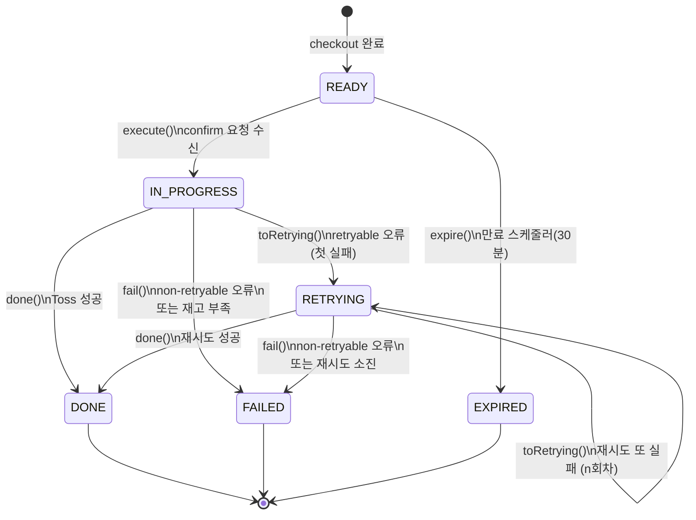

> **guard 업데이트 필요:**
> - `done()`: 현재 `IN_PROGRESS || DONE` → `IN_PROGRESS || RETRYING || DONE` 으로 확장
> - `fail()`: 현재 `READY || IN_PROGRESS` → `READY || IN_PROGRESS || RETRYING` 으로 확장
> - `toRetrying()`: 신규 메서드, `IN_PROGRESS || RETRYING` 허용

### PaymentOutbox 상태

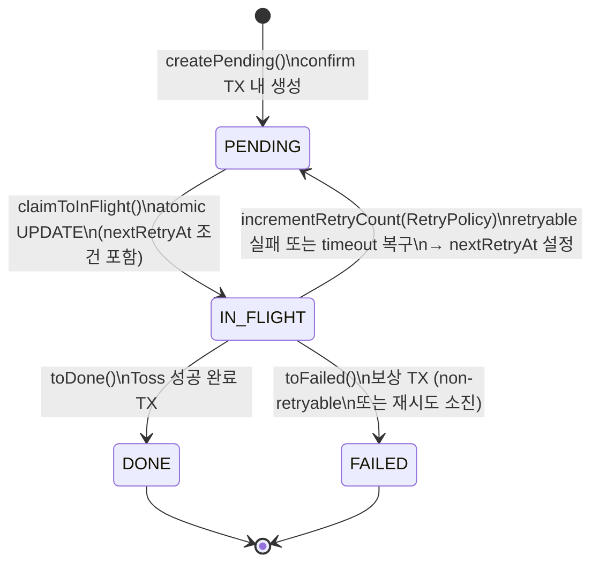

---

## 전체 처리 흐름

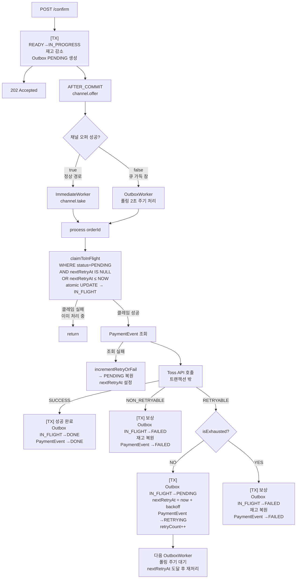

---

## 재시도 한계치 도달 시 처리 흐름

두 가지 경로에서 소진에 도달할 수 있다.

### 경로 1: 일반 retryable 실패 소진

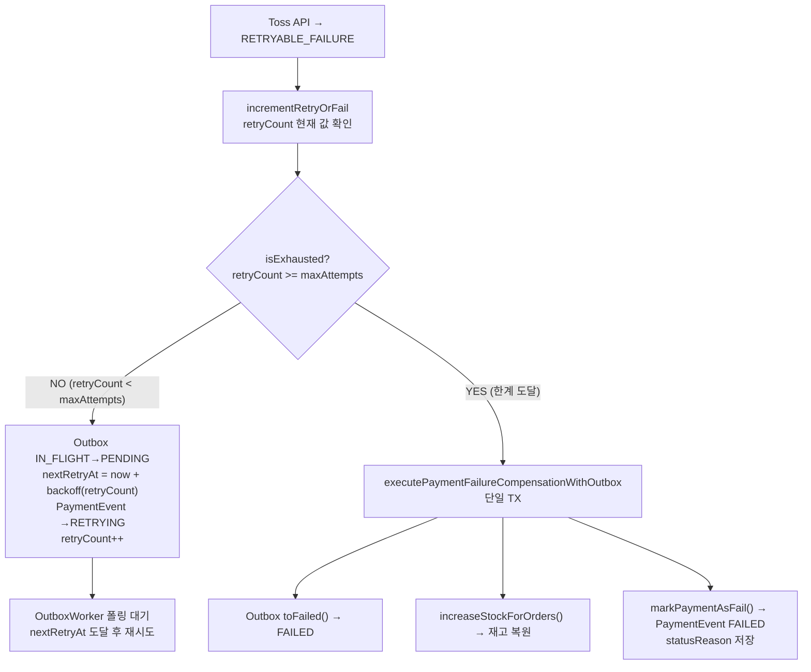

### 경로 2: IN_FLIGHT timeout 복구 후 소진

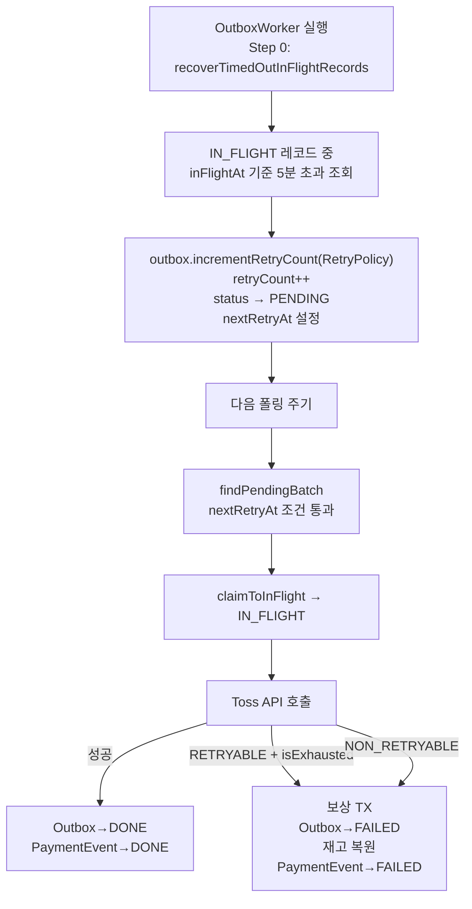

> **timeout 복구의 특성:**
> - `recoverTimedOutInFlightRecords`는 `isExhausted` 체크 없이 increment한다.
> - retryCount가 maxAttempts인 상태에서 timeout되면 retryCount가 maxAttempts+1이 되어 PENDING으로 복원된다.
> - 다음 `process()`에서 API 호출이 한 번 더 일어나고, 그 결과에 따라 소진 처리된다.
> - 즉 timeout 경로는 "한 번 더 시도 허용" 의미를 가진다. 이는 의도된 동작이다.

---

## 결정 사항

| 항목 | 결정 | 이유 |
|------|------|------|
| 재시도 중 PaymentEvent 상태 | `RETRYING` 상태 추가 + `retryCount` 실제 활용 | 외부에서 재시도 진행 여부 파악 가능 |
| 재시도 정책 관리 | `RetryPolicy` 도메인 객체 분리 + `application.yml` 설정 주입 | 정책 변경 시 코드 수정 없이 설정으로 제어 |
| Backoff 전략 | `BackoffType { FIXED, EXPONENTIAL }` + `PaymentOutbox.nextRetryAt` 추가 | FIXED/EXPONENTIAL 모두 지원, 폴링 쿼리로 시점 제어 |
| 실패 분류 기준 | 예외 변환 제거 — `PaymentConfirmResult` 직접 반환, caller가 `isRetryable()` 분기 | 도메인 결과값이 분류 기준이 되어 흐름 명확화 |
| 재시도 경로 | 재시도는 OutboxWorker 폴링 전용. ImmediateWorker는 첫 시도만 담당 | 재시도 시 채널에 재push하면 nextRetryAt 우회 위험 |
| claimToInFlight 조건 | `nextRetryAt IS NULL OR nextRetryAt <= NOW()` 추가 | findPendingBatch 필터만으로는 불완전, 직접 클레임 방어 필요 |
| 폴링 인덱스 | `(status, next_retry_at, created_at)` 복합 인덱스 신규 추가 | nextRetryAt 범위 조건 추가 시 성능 유지 |

---

## RetryPolicy 설계

### 도메인 객체

```java
// payment/domain/RetryPolicy.java
public record RetryPolicy(
    int maxAttempts,
    BackoffType backoffType,
    long baseDelayMs,
    long maxDelayMs
) {
    public boolean isExhausted(int retryCount) {
        return retryCount >= maxAttempts;
    }

    public Duration nextDelay(int retryCount) {
        return switch (backoffType) {
            case FIXED       -> Duration.ofMillis(baseDelayMs);
            case EXPONENTIAL -> Duration.ofMillis(
                Math.min(baseDelayMs * (1L << retryCount), maxDelayMs)
            );
        };
    }
}

// payment/domain/enums/BackoffType.java
public enum BackoffType { FIXED, EXPONENTIAL }
```

### 설정 주입

```yaml
# application.yml
payment:
  retry:
    max-attempts: 5
    backoff-type: FIXED         # FIXED | EXPONENTIAL
    base-delay-ms: 5000
    max-delay-ms: 60000
```

`RetryPolicyProperties` (`@ConfigurationProperties("payment.retry")`)를 `PaymentOutboxUseCase`에 주입하여 `RetryPolicy` 인스턴스를 생성한다.

---

## PaymentOutbox.nextRetryAt 설계

### 필드 추가

```java
// PaymentOutbox
private LocalDateTime nextRetryAt;  // null = 즉시 처리 가능

public void incrementRetryCount(RetryPolicy policy, LocalDateTime now) {
    this.retryCount++;
    this.status = PaymentOutboxStatus.PENDING;
    this.nextRetryAt = now.plus(policy.nextDelay(this.retryCount));
}
```

### 폴링 쿼리 변경

```sql
-- 기존
WHERE status = 'PENDING' ORDER BY created_at LIMIT :batchSize

-- 변경
WHERE status = 'PENDING'
  AND (next_retry_at IS NULL OR next_retry_at <= NOW())
ORDER BY created_at
LIMIT :batchSize
```

### claimToInFlight 쿼리 변경

```sql
-- 기존
UPDATE ... WHERE order_id = :orderId AND status = 'PENDING'

-- 변경
UPDATE ...
WHERE order_id = :orderId
  AND status = 'PENDING'
  AND (next_retry_at IS NULL OR next_retry_at <= NOW())
```

### 인덱스 변경

```sql
-- 기존
INDEX idx_payment_outbox_status_created (status, created_at)

-- 변경
INDEX idx_payment_outbox_status_retry_created (status, next_retry_at, created_at)
```

---

## 실패 분류 기준 — 예외 변환 제거

### 변경 전

```
PaymentGatewayPort.confirm() → PaymentConfirmResult(RETRYABLE_FAILURE)
  → PaymentCommandUseCase: throw PaymentTossRetryableException
  → OutboxProcessingService: catch PaymentTossRetryableException → 재시도
```

### 변경 후

```
PaymentGatewayPort.confirm() → PaymentConfirmResult(RETRYABLE_FAILURE)
  → PaymentCommandUseCase: return PaymentConfirmResult (예외 변환 없음)
  → OutboxProcessingService: result.isRetryable() → 재시도
```

**제거 대상:**
- `PaymentTossRetryableException`, `PaymentTossNonRetryableException`
- `PaymentCommandUseCase.confirmPaymentWithGateway()`의 예외 변환 switch

---

## 영향 범위

### 변경

| 파일 | 변경 내용 |
|------|----------|
| `payment/domain/enums/PaymentEventStatus` | `RETRYING` 추가 |
| `payment/domain/PaymentEvent` | `toRetrying()` 추가; `done()` / `fail()` guard에 `RETRYING` 포함; `retryCount` 활용; `RETRYABLE_LIMIT` 제거 (RetryPolicy로 이관) |
| `payment/domain/PaymentOutbox` | `nextRetryAt` 필드 추가; `incrementRetryCount(RetryPolicy, LocalDateTime)` 시그니처 변경; `RETRYABLE_LIMIT` 제거 |
| `payment/application/usecase/PaymentCommandUseCase` | `markPaymentAsRetrying()` 추가; `confirmPaymentWithGateway()` 예외 변환 제거 → `PaymentConfirmResult` 반환 |
| `payment/application/usecase/PaymentOutboxUseCase` | `RetryPolicy` 주입; `incrementRetryOrFail()` → `RetryPolicy.isExhausted()` 사용 + `PaymentEvent RETRYING` 전환 |
| `payment/application/usecase/PaymentTransactionCoordinator` | `executePaymentRetryWithOutbox()` 신규 트랜잭션 메서드 추가 (Outbox PENDING 복원 + PaymentEvent RETRYING) |
| `payment/infrastructure/entity/PaymentOutboxEntity` | `nextRetryAt` 컬럼 추가; 인덱스 변경 |
| `payment/infrastructure/repository/JpaPaymentOutboxRepository` | `findPendingBatch` / `claimToInFlight` 쿼리에 `nextRetryAt` 조건 추가 |
| `payment/scheduler/OutboxProcessingService` | 예외 catch 제거 → `PaymentConfirmResult.isRetryable()` 분기 |

### 신규

| 파일 | 내용 |
|------|------|
| `payment/domain/RetryPolicy` | 재시도 정책 도메인 record |
| `payment/domain/enums/BackoffType` | `FIXED`, `EXPONENTIAL` |
| `payment/infrastructure/config/RetryPolicyProperties` | `@ConfigurationProperties("payment.retry")` |
| DB migration | `payment_outbox.next_retry_at` 컬럼 추가; 인덱스 재생성 |

### 제거

| 파일 | 이유 |
|------|------|
| `payment/exception/PaymentTossRetryableException` | 예외 변환 제거로 불필요 |
| `payment/exception/PaymentTossNonRetryableException` | 동일 |

### 무관

- Checkout 흐름 (`READY → IN_PROGRESS`, 재고 감소)
- `executePaymentSuccessCompletionWithOutbox` 성공 경로
- `PaymentScheduler` 만료 처리
- `TossPaymentGatewayStrategy` 내부 오류 분류 로직
- Client API 계약

---

---

## 엣지 케이스 전체 라이프사이클

### 케이스 1 — 서버 장애: Outbox PENDING 상태에서 멈춤

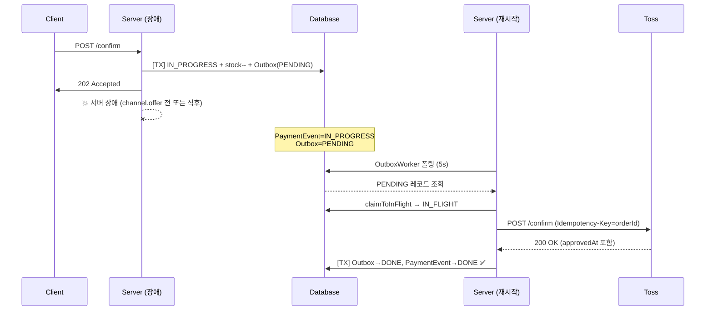

> 채널 오퍼 전 장애면 ImmediateWorker 경로가 누락되지만, OutboxWorker 폴링이 PENDING을 그대로 처리한다.

---

### 케이스 2 — 서버 장애: Outbox IN_FLIGHT에서 멈춤 (Toss 요청 미전송)

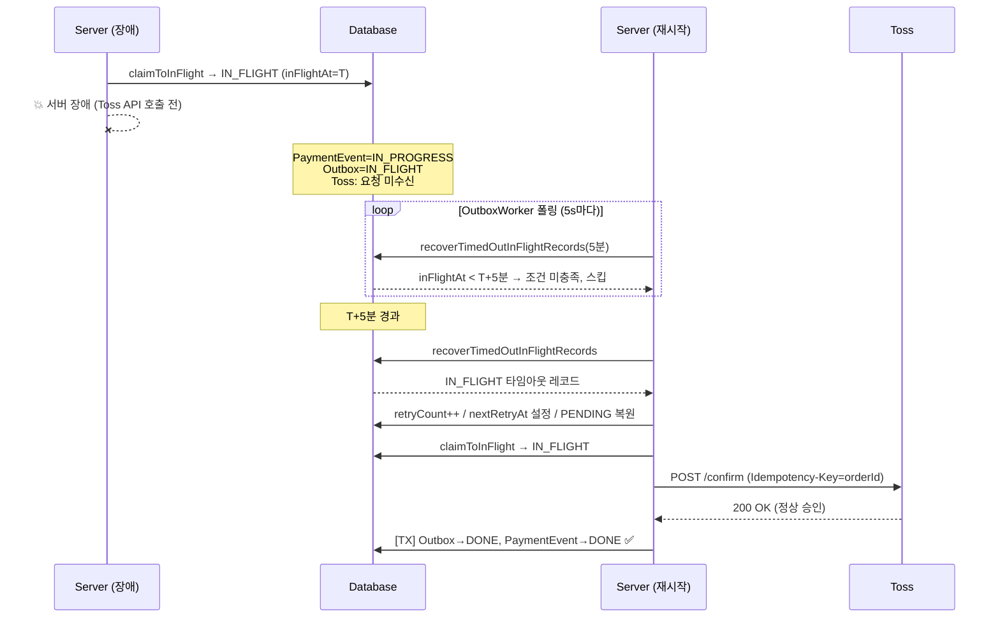

> ⚠️ 현재 `in-flight-timeout-minutes=5`로 최대 5분 지연 발생. 개선 방안은 백로그(`docs/context/TODOS.md`) 참고.

---

### 케이스 3 — 서버 장애: Outbox IN_FLIGHT에서 멈춤 (Toss 이미 승인 완료)

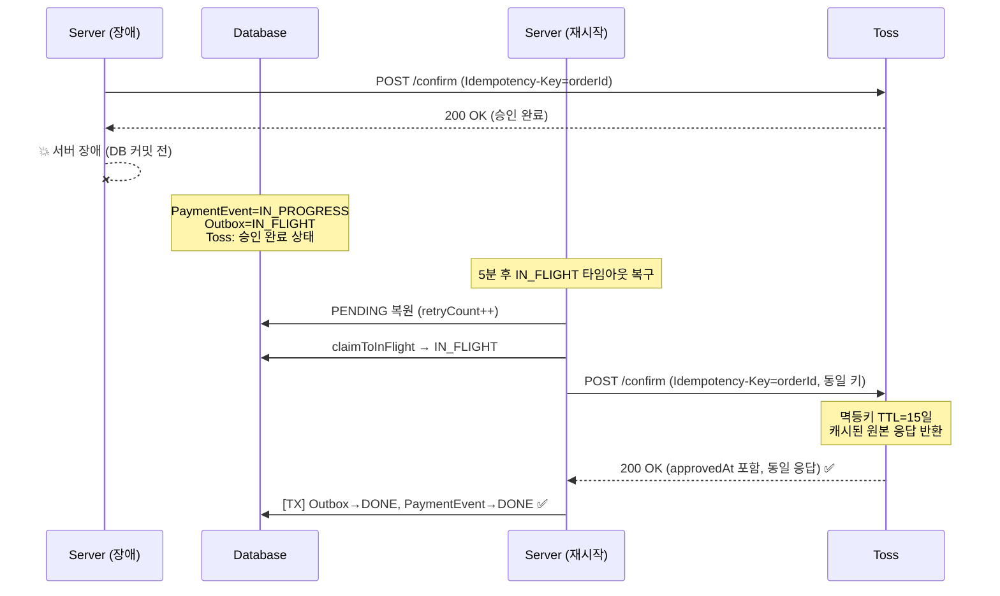

> Toss 멱등성 키 TTL이 **15일**이므로 정상 운영 범위 내에서 재시도는 항상 원본 응답을 받는다.
> 출처: [멱등키 | 토스페이먼츠 개발자센터](https://docs.tosspayments.com/guides/using-api/idempotency-key)

---

### 케이스 4 — Retryable 에러 발생 (정상 서버)

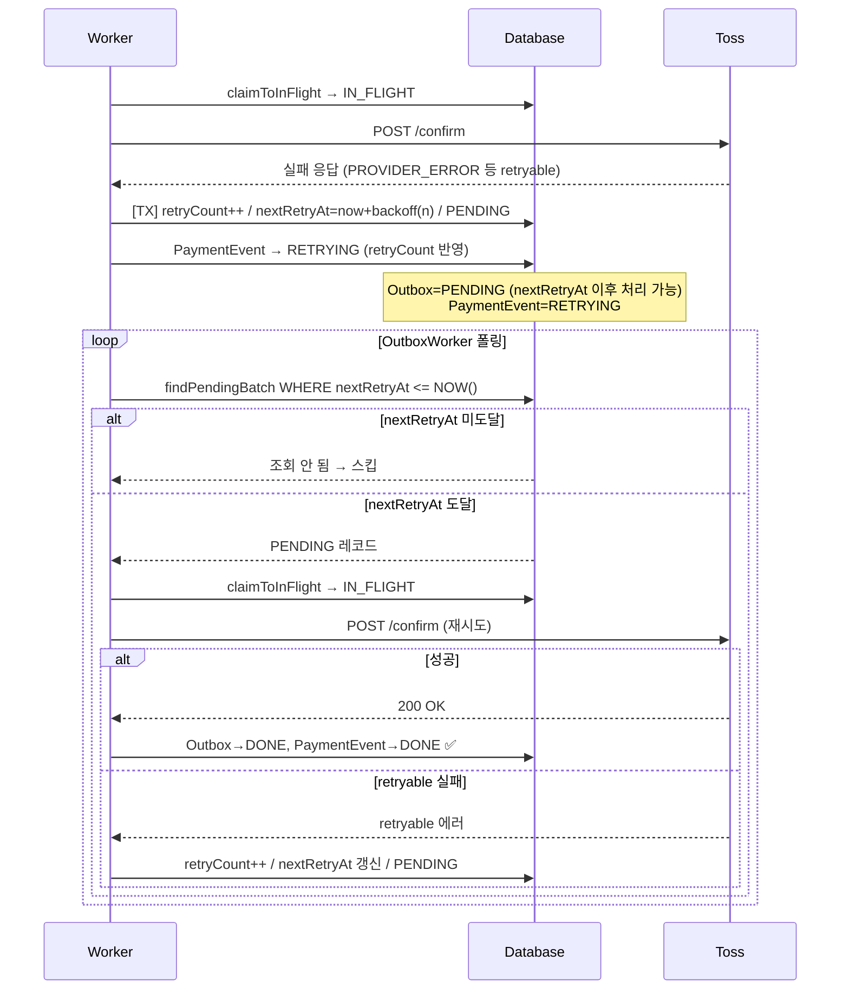

---

### 케이스 5 — Retryable 에러 한계치(maxAttempts) 도달

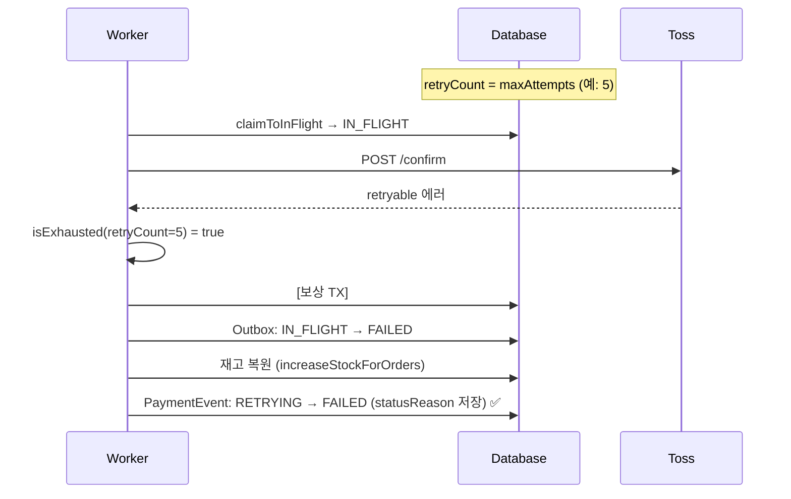

---

### 케이스 6 — SocketTimeout (네트워크 타임아웃)

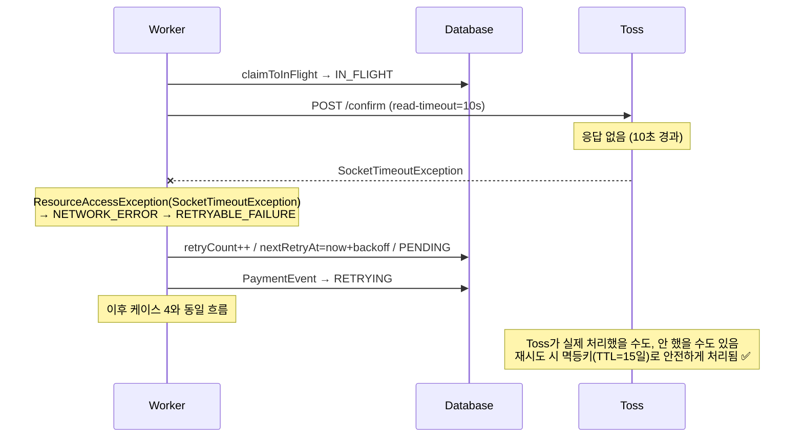

---

### 케이스 7 — Non-Retryable 에러 (즉시 실패)

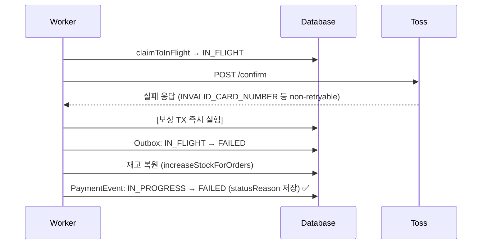

---

### 엣지 케이스 요약표

| 케이스 | PaymentEvent 최종 상태 | Outbox 최종 상태 | 처리 경로 | 비고 |
|--------|----------------------|----------------|----------|------|
| 서버 장애 (PENDING) | DONE 또는 FAILED | DONE 또는 FAILED | OutboxWorker 폴링 재처리 | ✅ |
| 서버 장애 (IN_FLIGHT, 미전송) | DONE 또는 FAILED | DONE 또는 FAILED | 5분 후 timeout → 재처리 | ⚠️ 최대 5분 지연, 백로그 등록 |
| 서버 장애 (IN_FLIGHT, Toss 승인 완료) | DONE | DONE | timeout → 재시도 → 멱등키 200 OK | ✅ TTL 15일 |
| Retryable 에러 (한계 미달) | RETRYING | PENDING→IN_FLIGHT 반복 | nextRetryAt Backoff 후 재시도 | ✅ |
| Retryable 에러 (한계 소진) | FAILED | FAILED | 보상 TX (재고 복원) | ✅ |
| SocketTimeout | RETRYING→DONE/FAILED | DONE/FAILED | NETWORK_ERROR → retryable 경로 | ✅ |
| Non-Retryable 에러 | FAILED | FAILED | 즉시 보상 TX | ✅ |

---

## 제외 범위

- **Dead Letter Queue / 수동 재처리**: 자동 재시도 전략에만 집중
- **재시도 알림 / 모니터링 대시보드**: 기존 메트릭 AOP 그대로 활용
- **클라이언트 응답에 RETRYING 노출 여부**: `PaymentStatusService` 응답 스펙 변경은 별도 논의
- **`recoverTimedOutInFlightRecords`의 즉시 보상**: timeout 경로는 "한 번 더 시도 허용" 의미를 유지하여 단순함 보존
- **IN_FLIGHT 즉시 복구 (Graceful Shutdown + timeout 단축)**: `docs/context/TODOS.md` 백로그 등록